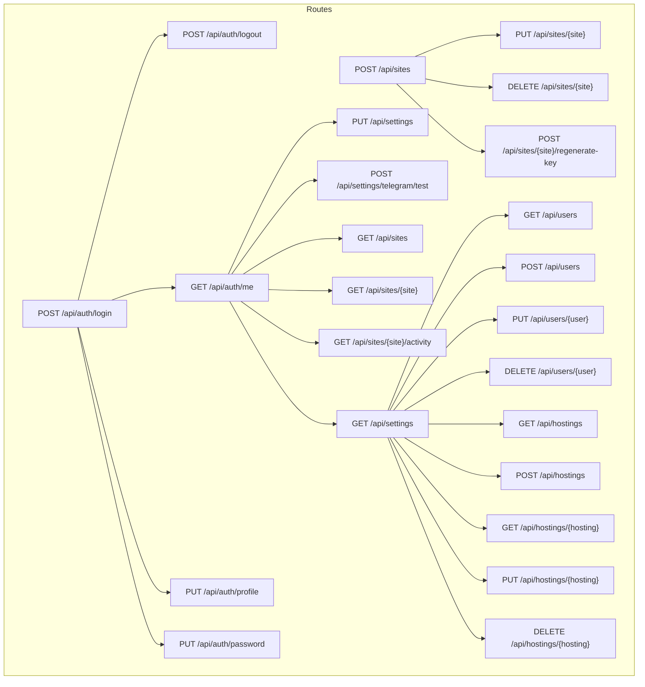
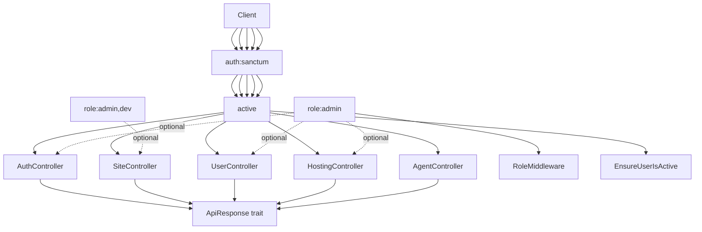
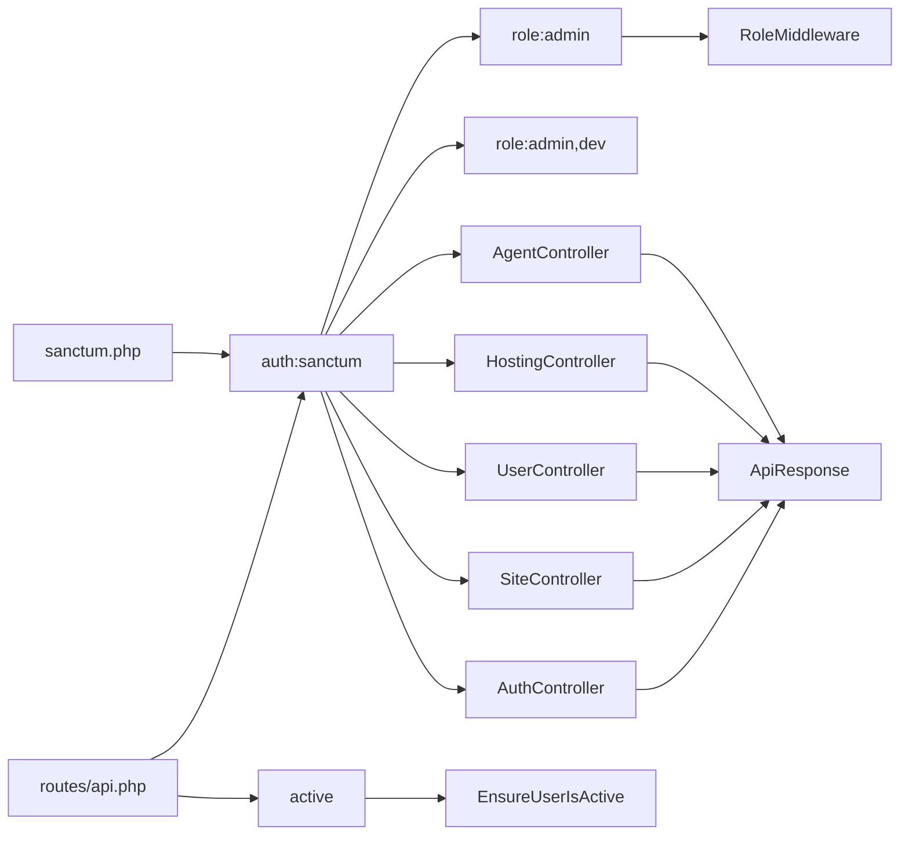

# API Reference

<cite>
**Referenced Files in This Document**
- [api.php](file://portal/routes/api.php)
- [AuthController.php](file://portal/app/Http/Controllers/Auth/AuthController.php)
- [SiteController.php](file://portal/app/Http/Controllers/Portal/SiteController.php)
- [UserController.php](file://portal/app/Http/Controllers/Portal/UserController.php)
- [HostingController.php](file://portal/app/Http/Controllers/Portal/HostingController.php)
- [AgentController.php](file://portal/app/Http/Controllers/Agent/AgentController.php)
- [RoleMiddleware.php](file://portal/app/Http/Middleware/RoleMiddleware.php)
- [EnsureUserIsActive.php](file://portal/app/Http/Middleware/EnsureUserIsActive.php)
- [sanctum.php](file://portal/config/sanctum.php)
- [auth.php](file://portal/config/auth.php)
- [ApiResponse.php](file://portal/app/Traits/ApiResponse.php)
- [StoreSiteRequest.php](file://portal/app/Http/Requests/Site/StoreSiteRequest.php)
- [UpdateSiteRequest.php](file://portal/app/Http/Requests/Site/UpdateSiteRequest.php)
- [StoreUserRequest.php](file://portal/app/Http/Requests/User/StoreUserRequest.php)
- [StoreHostingRequest.php](file://portal/app/Http/Requests/Hosting/StoreHostingRequest.php)
</cite>

## Table of Contents
1. [Introduction](#introduction)
2. [Project Structure](#project-structure)
3. [Core Components](#core-components)
4. [Architecture Overview](#architecture-overview)
5. [Detailed Component Analysis](#detailed-component-analysis)
6. [Dependency Analysis](#dependency-analysis)
7. [Performance Considerations](#performance-considerations)
8. [Troubleshooting Guide](#troubleshooting-guide)
9. [Conclusion](#conclusion)
10. [Appendices](#appendices)

## Introduction
This document provides comprehensive API documentation for EPOS Portal’s REST endpoints. It covers authentication, site management, user management, hosting management, and agent communication. For each endpoint, you will find HTTP methods, URL patterns, request/response schemas, authentication requirements, role-based access control, pagination, filtering, and practical usage examples with cURL and code snippets. It also explains the API versioning strategy, backward compatibility considerations, client implementation guidelines, and debugging/monitoring approaches.

## Project Structure
EPOS Portal exposes REST APIs under the /api namespace. Routes are grouped by authentication and role scopes:
- Public: login endpoint
- Authenticated + active user: profile and session endpoints
- Admin-only: hosting, user, and settings endpoints
- Admin + Dev: site creation, updates, deletion, and key regeneration
- All authenticated users: read-only site listing and viewing

**Diagram sources**
- [api.php:1-48](file://portal/routes/api.php#L1-L48)

**Section sources**
- [api.php:1-48](file://portal/routes/api.php#L1-L48)

## Core Components
- Authentication and session management via Laravel Sanctum personal access tokens
- Role-based access control using a custom role middleware
- Unified JSON response formatting via a shared trait
- Request validation using form request classes

Key behaviors:
- Tokens are bound to the “auth-token” name and returned once during login
- Active user enforcement revokes tokens for deactivated accounts
- Pagination metadata is included in paginated responses
- Filtering and search are supported for site listings

**Section sources**
- [AuthController.php:18-56](file://portal/app/Http/Controllers/Auth/AuthController.php#L18-L56)
- [RoleMiddleware.php:15-35](file://portal/app/Http/Middleware/RoleMiddleware.php#L15-L35)
- [EnsureUserIsActive.php:11-24](file://portal/app/Http/Middleware/EnsureUserIsActive.php#L11-L24)
- [ApiResponse.php:9-54](file://portal/app/Traits/ApiResponse.php#L9-L54)
- [StoreSiteRequest.php:14-26](file://portal/app/Http/Requests/Site/StoreSiteRequest.php#L14-L26)
- [UpdateSiteRequest.php:14-25](file://portal/app/Http/Requests/Site/UpdateSiteRequest.php#L14-L25)
- [StoreUserRequest.php:14-24](file://portal/app/Http/Requests/User/StoreUserRequest.php#L14-L24)
- [StoreHostingRequest.php:14-21](file://portal/app/Http/Requests/Hosting/StoreHostingRequest.php#L14-L21)

## Architecture Overview
The API follows a layered architecture:
- Routes define entry points and group them by middleware
- Controllers implement business logic and delegate to services
- Middleware enforces authentication and role checks
- Request classes validate inputs
- Shared trait ensures consistent JSON responses

**Diagram sources**
- [api.php:10-47](file://portal/routes/api.php#L10-L47)
- [AuthController.php:11-135](file://portal/app/Http/Controllers/Auth/AuthController.php#L11-L135)
- [SiteController.php:14-204](file://portal/app/Http/Controllers/Portal/SiteController.php#L14-L204)
- [UserController.php:14-137](file://portal/app/Http/Controllers/Portal/UserController.php#L14-L137)
- [HostingController.php:13-83](file://portal/app/Http/Controllers/Portal/HostingController.php#L13-L83)
- [AgentController.php:10-99](file://portal/app/Http/Controllers/Agent/AgentController.php#L10-L99)
- [RoleMiddleware.php:9-37](file://portal/app/Http/Middleware/RoleMiddleware.php#L9-L37)
- [EnsureUserIsActive.php:9-26](file://portal/app/Http/Middleware/EnsureUserIsActive.php#L9-L26)
- [ApiResponse.php:7-56](file://portal/app/Traits/ApiResponse.php#L7-L56)

## Detailed Component Analysis

### Authentication Endpoints
- Base path: /api/auth
- Authentication: Bearer token via Sanctum personal access tokens
- Roles: All authenticated users after login

Endpoints:
- POST /api/auth/login
  - Purpose: Obtain a personal access token
  - Headers: Content-Type: application/json
  - Body:
    - email: string, required
    - password: string, required
  - Response:
    - data.token: string
    - data.user.id: integer
    - data.user.name: string
    - data.user.email: string
    - data.user.role: string
    - data.user.telegram_chat_id: string|null
    - data.user.is_active: boolean
    - data.user.created_at: datetime
    - data.user.updated_at: datetime
  - Status codes: 200 OK, 422 Unprocessable Entity, 401 Unauthorized, 403 Forbidden
  - Notes: On success, previous tokens are revoked; token is named “auth-token”

- POST /api/auth/logout
  - Purpose: Invalidate current token
  - Response: success message
  - Status codes: 200 OK, 401 Unauthorized

- GET /api/auth/me
  - Purpose: Get current user profile
  - Response: user object (same fields as login response)
  - Status codes: 200 OK, 401 Unauthorized

- PUT /api/auth/profile
  - Purpose: Update profile (name, telegram_chat_id)
  - Body:
    - name: string, max 255
    - telegram_chat_id: string, max 100
  - Response: updated user object
  - Status codes: 200 OK, 422 Unprocessable Entity, 401 Unauthorized

- PUT /api/auth/password
  - Purpose: Change password
  - Body:
    - current_password: string, required
    - password: string, min 8, confirmed
  - Response: success message
  - Status codes: 200 OK, 422 Unprocessable Entity, 401 Unauthorized

Example usage:
- Login:
  - curl -X POST https://portal.example.com/api/auth/login \
    -H "Content-Type: application/json" \
    -d '{"email":"user@example.com","password":"your_password"}'
- Access protected resource:
  - curl -H "Authorization: Bearer YOUR_TOKEN" https://portal.example.com/api/auth/me

**Section sources**
- [api.php:7-15](file://portal/routes/api.php#L7-L15)
- [AuthController.php:18-133](file://portal/app/Http/Controllers/Auth/AuthController.php#L18-L133)
- [sanctum.php:53](file://portal/config/sanctum.php#L53)
- [auth.php:18-21](file://portal/config/auth.php#L18-L21)

### Site Management Endpoints
- Base path: /api/sites
- Authentication: Required (auth:sanctum + active)
- Roles:
  - Admin + Dev: create, update, delete, regenerate-key
  - Admin: regenerate-key
  - All authenticated: list, view, activity log

Endpoints:
- GET /api/sites
  - Purpose: List sites with filters, search, and pagination
  - Query params:
    - status: string
    - hosting_id: integer
    - tag: string
    - search: string (name or url)
    - page: integer (default 1)
  - Response: paginated items (see Pagination)
  - Status codes: 200 OK, 401 Unauthorized

- POST /api/sites
  - Purpose: Create a new site with a generated API secret key
  - Body:
    - name: string, required
    - url: string, required, unique
    - hosting_id: integer, nullable
    - description: string, nullable
    - tags: array of strings, nullable
    - user_ids: array of integers, nullable
  - Response:
    - site object
    - api_secret_key_plain: string (returned only once)
  - Status codes: 201 Created, 422 Unprocessable Entity, 401 Unauthorized, 403 Forbidden
  - Notes: Only Admin + Dev can create

- GET /api/sites/{site}
  - Purpose: View a single site
  - Response: site object with related hosting and users
  - Status codes: 200 OK, 401 Unauthorized, 403 Forbidden

- PUT /api/sites/{site}
  - Purpose: Update a site
  - Body: same as POST except optional fields
  - Response: updated site object
  - Status codes: 200 OK, 422 Unprocessable Entity, 401 Unauthorized, 403 Forbidden
  - Notes: Only Admin + Dev can update

- DELETE /api/sites/{site}
  - Purpose: Delete a site
  - Response: success message
  - Status codes: 200 OK, 401 Unauthorized, 403 Forbidden
  - Notes: Only Admin + Dev can delete

- POST /api/sites/{site}/regenerate-key
  - Purpose: Regenerate API secret key (hashed)
  - Response:
    - api_secret_key_plain: string (returned only once)
    - message: string
  - Status codes: 200 OK, 401 Unauthorized, 403 Forbidden
  - Notes: Only Admin can regenerate

- GET /api/sites/{site}/activity
  - Purpose: Paginated activity logs for a site
  - Query params: page
  - Response: paginated activity logs
  - Status codes: 200 OK, 401 Unauthorized, 403 Forbidden

Pagination:
- meta.pagination includes total, per_page, current_page, last_page

Filtering and search:
- status, hosting_id, tag (JSON contains), search (name or url)

Example usage:
- Create site:
  - curl -X POST https://portal.example.com/api/sites \
    -H "Authorization: Bearer YOUR_TOKEN" \
    -H "Content-Type: application/json" \
    -d '{"name":"Site Name","url":"https://example.com"}'

**Section sources**
- [api.php:44-46](file://portal/routes/api.php#L44-L46)
- [api.php:32-35](file://portal/routes/api.php#L32-L35)
- [api.php:15-16](file://portal/routes/api.php#L15-L16)
- [SiteController.php:23-56](file://portal/app/Http/Controllers/Portal/SiteController.php#L23-L56)
- [SiteController.php:62-92](file://portal/app/Http/Controllers/Portal/SiteController.php#L62-L92)
- [SiteController.php:97-109](file://portal/app/Http/Controllers/Portal/SiteController.php#L97-L109)
- [SiteController.php:114-133](file://portal/app/Http/Controllers/Portal/SiteController.php#L114-L133)
- [SiteController.php:138-150](file://portal/app/Http/Controllers/Portal/SiteController.php#L138-L150)
- [SiteController.php:156-182](file://portal/app/Http/Controllers/Portal/SiteController.php#L156-L182)
- [SiteController.php:187-202](file://portal/app/Http/Controllers/Portal/SiteController.php#L187-L202)
- [StoreSiteRequest.php:14-26](file://portal/app/Http/Requests/Site/StoreSiteRequest.php#L14-L26)
- [UpdateSiteRequest.php:14-25](file://portal/app/Http/Requests/Site/UpdateSiteRequest.php#L14-L25)
- [ApiResponse.php:42-54](file://portal/app/Traits/ApiResponse.php#L42-L54)

### User Management Endpoints
- Base path: /api/users
- Authentication: Required (auth:sanctum + active)
- Roles: Admin

Endpoints:
- GET /api/users
  - Purpose: List all users
  - Response: array of user objects
  - Status codes: 200 OK, 401 Unauthorized, 403 Forbidden

- POST /api/users
  - Purpose: Create a user
  - Body:
    - name: string, required
    - email: string, required, unique
    - password: string, min 8
    - role: string, in admin, dev, mkt
    - is_active: boolean, optional
    - telegram_chat_id: string, max 100
  - Response: created user object
  - Status codes: 201 Created, 422 Unprocessable Entity, 401 Unauthorized, 403 Forbidden

- PUT /api/users/{user}
  - Purpose: Update a user
  - Body:
    - name: string, optional
    - email: string, optional, unique
    - password: string, optional
    - role: string, optional, in admin, dev, mkt
    - is_active: boolean, optional
    - telegram_chat_id: string, optional
  - Response: updated user object
  - Status codes: 200 OK, 422 Unprocessable Entity, 401 Unauthorized, 403 Forbidden
  - Notes: Changing role triggers role synchronization

- DELETE /api/users/{user}
  - Purpose: Delete a user
  - Response: success message
  - Status codes: 200 OK, 400 Bad Request (cannot delete self), 401 Unauthorized, 403 Forbidden

Example usage:
- Create user:
  - curl -X POST https://portal.example.com/api/users \
    -H "Authorization: Bearer YOUR_TOKEN" \
    -H "Content-Type: application/json" \
    -d '{"name":"John Doe","email":"john@example.com","password":"securepass","role":"dev"}'

**Section sources**
- [api.php:22](file://portal/routes/api.php#L22)
- [api.php:18-27](file://portal/routes/api.php#L18-L27)
- [UserController.php:21-65](file://portal/app/Http/Controllers/Portal/UserController.php#L21-L65)
- [UserController.php:70-112](file://portal/app/Http/Controllers/Portal/UserController.php#L70-L112)
- [UserController.php:117-135](file://portal/app/Http/Controllers/Portal/UserController.php#L117-L135)
- [StoreUserRequest.php:14-24](file://portal/app/Http/Requests/User/StoreUserRequest.php#L14-L24)

### Hosting Management Endpoints
- Base path: /api/hostings
- Authentication: Required (auth:sanctum + active)
- Roles: Admin

Endpoints:
- GET /api/hostings
  - Purpose: List hostings with site counts
  - Response: array of hosting objects
  - Status codes: 200 OK, 401 Unauthorized, 403 Forbidden

- POST /api/hostings
  - Purpose: Create a hosting
  - Body:
    - name: string, required, unique
    - provider: string, required, in cloudways,cpanel,runcloud,vultr,digitalocean,other
    - note: string, nullable
  - Response: created hosting object
  - Status codes: 201 Created, 422 Unprocessable Entity, 401 Unauthorized, 403 Forbidden

- GET /api/hostings/{hosting}
  - Purpose: View a hosting
  - Response: hosting object with site count
  - Status codes: 200 OK, 401 Unauthorized, 403 Forbidden

- PUT /api/hostings/{hosting}
  - Purpose: Update a hosting
  - Body: same as POST except optional fields
  - Response: updated hosting object
  - Status codes: 200 OK, 422 Unprocessable Entity, 401 Unauthorized, 403 Forbidden

- DELETE /api/hostings/{hosting}
  - Purpose: Delete a hosting
  - Response: success message
  - Status codes: 200 OK, 401 Unauthorized, 403 Forbidden
  - Notes: Unlinks associated sites (sets hosting_id to null)

Example usage:
- Create hosting:
  - curl -X POST https://portal.example.com/api/hostings \
    -H "Authorization: Bearer YOUR_TOKEN" \
    -H "Content-Type: application/json" \
    -d '{"name":"Cloudways","provider":"cloudways","note":"Production"}'

**Section sources**
- [api.php:20](file://portal/routes/api.php#L20)
- [api.php:18-27](file://portal/routes/api.php#L18-L27)
- [HostingController.php:17-81](file://portal/app/Http/Controllers/Portal/HostingController.php#L17-L81)
- [StoreHostingRequest.php:14-21](file://portal/app/Http/Requests/Hosting/StoreHostingRequest.php#L14-L21)

### Agent Communication Endpoints
- Base path: /api/agent
- Authentication: Not applicable (agent endpoints are internal to the agent integration)
- Roles: N/A

Endpoints:
- POST /api/agent/handshake
  - Purpose: Establish connection upon agent activation
  - Body:
    - wp_version: string, max 20
    - php_version: string, max 20
    - woo_active: boolean
    - company_plugins: array of plugin objects
      - slug: string
      - version: string
      - active: boolean
  - Response:
    - success: boolean
    - message: string
  - Status codes: 200 OK

- POST /api/agent/ping
  - Purpose: Heartbeat (every 5 minutes)
  - Body:
    - company_plugins: array of plugin objects
    - orders: array
  - Response:
    - success: boolean
    - message: string
  - Status codes: 200 OK

Notes:
- These endpoints are called by the WordPress agent and update site status and metadata
- They do not require user authentication tokens

**Section sources**
- [AgentController.php:16-97](file://portal/app/Http/Controllers/Agent/AgentController.php#L16-L97)

### Settings Endpoints
- Base path: /api/settings
- Authentication: Required (auth:sanctum + active)
- Roles: Admin

Endpoints:
- GET /api/settings
  - Purpose: Retrieve portal settings
  - Response: settings object
  - Status codes: 200 OK, 401 Unauthorized, 403 Forbidden

- PUT /api/settings
  - Purpose: Update portal settings
  - Response: success message
  - Status codes: 200 OK, 422 Unprocessable Entity, 401 Unauthorized, 403 Forbidden

- POST /api/settings/telegram/test
  - Purpose: Test Telegram notifications
  - Response: success message
  - Status codes: 200 OK, 401 Unauthorized, 403 Forbidden

**Section sources**
- [api.php:24-26](file://portal/routes/api.php#L24-L26)

## Dependency Analysis
- Route groups depend on middleware stacks:
  - auth:sanctum validates bearer tokens
  - active enforces is_active flag
  - role:admin and role:admin,dev gate endpoints by role
- Controllers rely on:
  - ApiResponse trait for consistent JSON envelopes
  - Form requests for validation
  - Activity logging service for audit trails
- Sanctum configuration:
  - Guard defaults to web
  - Token expiration is not enforced (null)
  - Token prefix configurable

**Diagram sources**
- [api.php:10-47](file://portal/routes/api.php#L10-L47)
- [RoleMiddleware.php:15-35](file://portal/app/Http/Middleware/RoleMiddleware.php#L15-L35)
- [EnsureUserIsActive.php:11-24](file://portal/app/Http/Middleware/EnsureUserIsActive.php#L11-L24)
- [sanctum.php:40-53](file://portal/config/sanctum.php#L40-L53)

**Section sources**
- [api.php:10-47](file://portal/routes/api.php#L10-L47)
- [sanctum.php:40-53](file://portal/config/sanctum.php#L40-L53)
- [auth.php:18-21](file://portal/config/auth.php#L18-L21)

## Performance Considerations
- Pagination:
  - Sites listing uses a fixed page size of 20; clients should iterate pages using the pagination meta
- Filtering:
  - Index queries support status, hosting_id, tag, and search; avoid excessive filters for large datasets
- Payload sizes:
  - Some endpoints load related records (e.g., hosting, users); prefer selective retrieval and limit fields when building clients
- Rate limiting:
  - No explicit global rate limiter is configured in the provided files; implement client-side throttling and consider adding server-side limits for high-frequency endpoints like agent ping

[No sources needed since this section provides general guidance]

## Troubleshooting Guide
Common errors and resolutions:
- 401 Unauthorized
  - Cause: Missing or invalid bearer token
  - Resolution: Re-authenticate using /api/auth/login and retry
- 403 Forbidden
  - Cause: Deactivated account or insufficient permissions
  - Resolution: Verify account status; ensure correct role; check route-specific role requirements
- 422 Unprocessable Entity
  - Cause: Validation failure (missing fields, unique violations, wrong types)
  - Resolution: Review request body against endpoint schemas; fix field types and constraints
- 400 Bad Request
  - Cause: Self-deletion attempt in user management
  - Resolution: Do not attempt to delete your own account

Debugging tips:
- Enable API logging in the application to capture request/response payloads
- Use the activity endpoints to inspect recent actions
- For agent issues, verify handshake and ping responses and check site status transitions

**Section sources**
- [AuthController.php:33-35](file://portal/app/Http/Controllers/Auth/AuthController.php#L33-L35)
- [RoleMiddleware.php:19-32](file://portal/app/Http/Middleware/RoleMiddleware.php#L19-L32)
- [EnsureUserIsActive.php:13-21](file://portal/app/Http/Middleware/EnsureUserIsActive.php#L13-L21)
- [UserController.php:120-122](file://portal/app/Http/Controllers/Portal/UserController.php#L120-L122)

## Conclusion
EPOS Portal’s API provides a secure, role-aware REST interface backed by Laravel Sanctum and a custom role middleware. It supports robust filtering, pagination, and audit logging. Clients should authenticate once, reuse tokens, and adhere to role-based access rules. For agent integrations, use the dedicated endpoints to establish connections and maintain heartbeats.

[No sources needed since this section summarizes without analyzing specific files]

## Appendices

### Authentication and Authorization
- Token issuance: Personal access tokens named “auth-token”
- Token usage: Bearer token in Authorization header
- Active user enforcement: Automatically revokes tokens for deactivated users
- Roles: admin, dev, mkt; Admin + Dev can manage sites; Admin only can manage users and hostings

**Section sources**
- [AuthController.php:37-41](file://portal/app/Http/Controllers/Auth/AuthController.php#L37-L41)
- [EnsureUserIsActive.php:13-21](file://portal/app/Http/Middleware/EnsureUserIsActive.php#L13-L21)
- [RoleMiddleware.php:15-35](file://portal/app/Http/Middleware/RoleMiddleware.php#L15-L35)

### Request and Response Schemas
- Success envelope:
  - success: boolean
  - message: string (optional)
  - data: object|array|null
  - meta: object (optional, pagination)
- Error envelope:
  - success: boolean (false)
  - message: string
  - errors: object (optional)

Pagination meta:
- total, per_page, current_page, last_page

**Section sources**
- [ApiResponse.php:9-54](file://portal/app/Traits/ApiResponse.php#L9-L54)

### Versioning and Backward Compatibility
- Current strategy:
  - No explicit API version path or Accept-Version header is defined in the provided files
  - Backward compatibility is not enforced by versioning
- Recommendations:
  - Introduce versioned routes (e.g., /api/v1) and deprecate older endpoints gradually
  - Add Content-Type negotiation and Accept-Version header handling
  - Maintain backward-compatible schemas and document breaking changes

[No sources needed since this section provides general guidance]

### Client Implementation Guidelines
- Use bearer tokens obtained from /api/auth/login
- Implement retry with exponential backoff for transient failures
- Respect pagination and apply filters server-side to reduce payload sizes
- For agents, send periodic pings and handle status transitions (connected/disconnected)

[No sources needed since this section provides general guidance]

### Monitoring and Debugging Tools
- Logging:
  - Enable application logs to capture API requests and responses
- Health checks:
  - Monitor agent endpoints for connectivity and latency
- Metrics:
  - Track endpoint response times, error rates, and token usage

[No sources needed since this section provides general guidance]