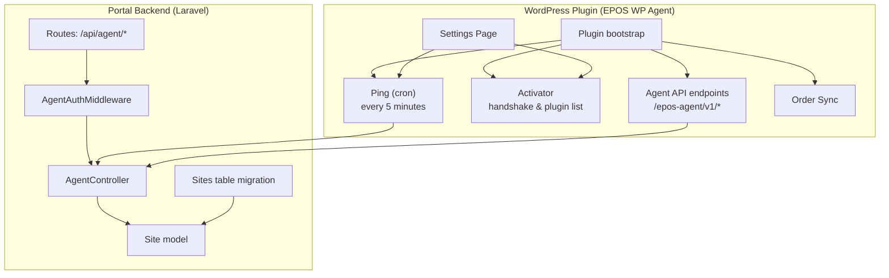
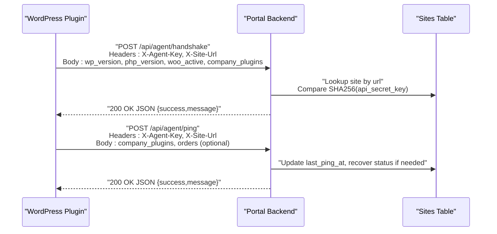
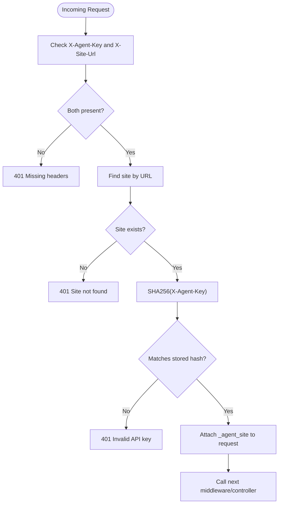
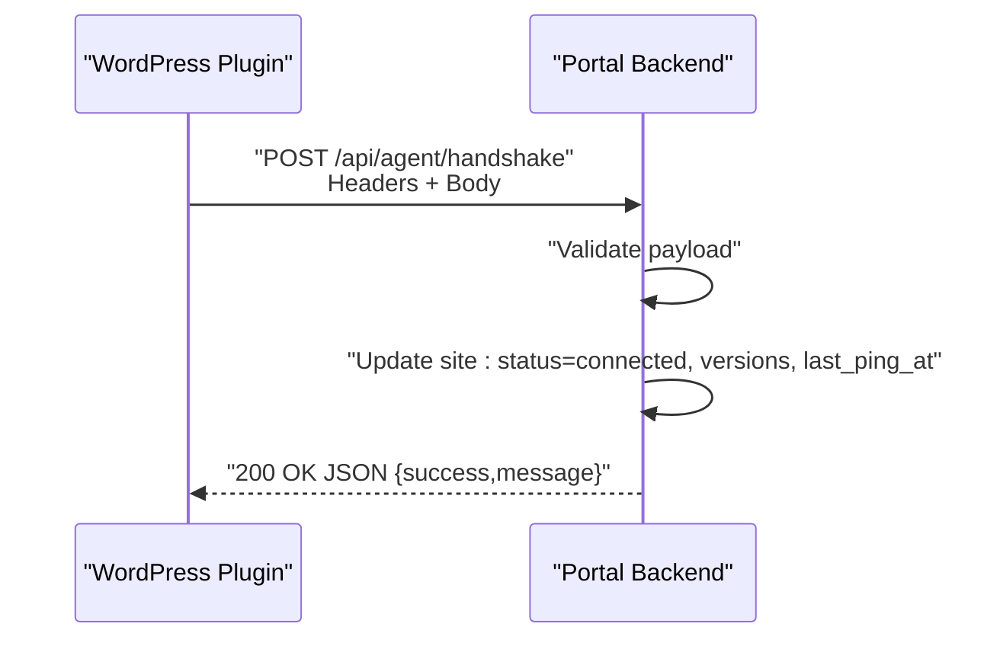
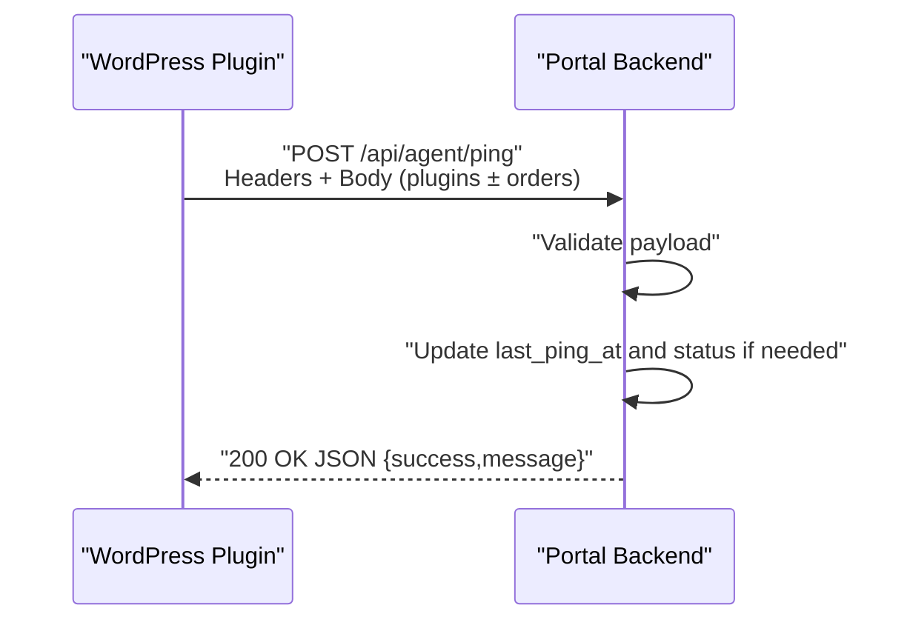
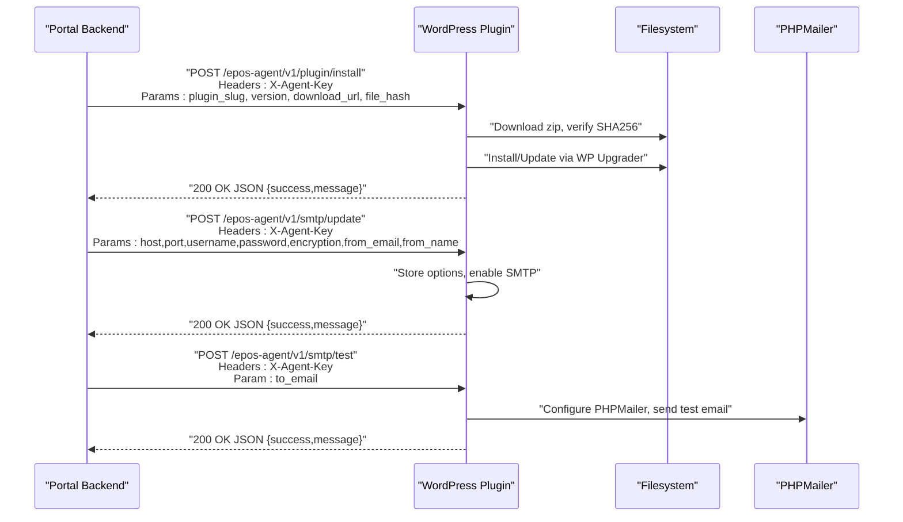
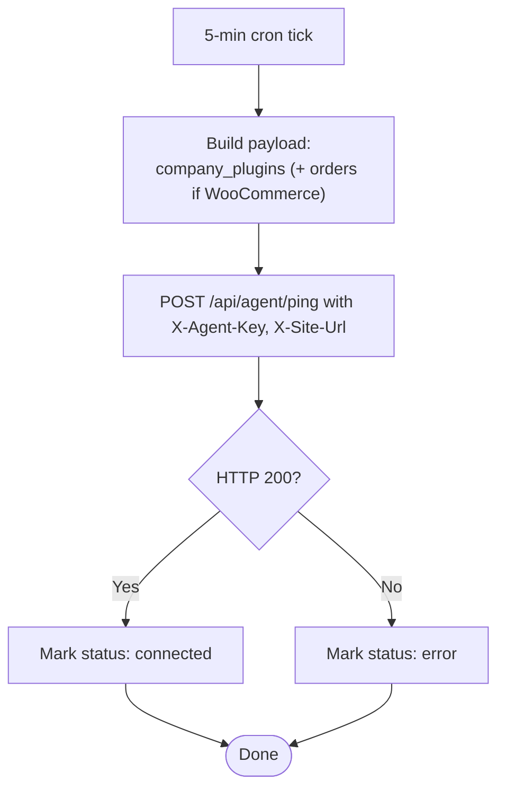
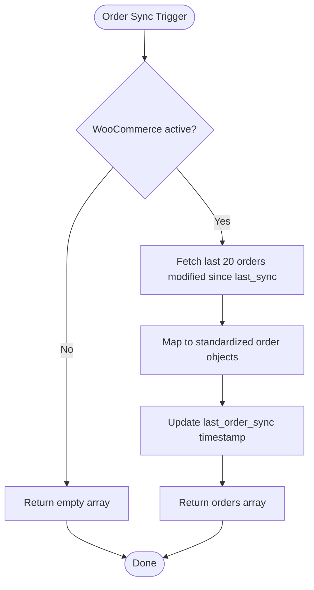
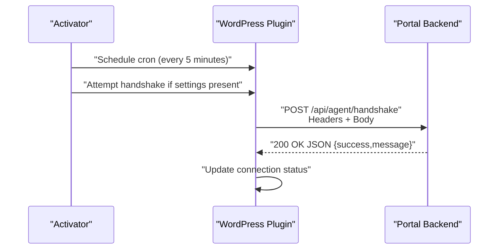
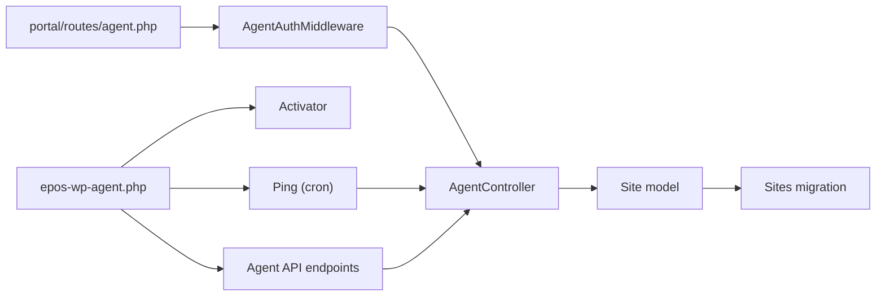

# Agent Communication Endpoints

<cite>
**Referenced Files in This Document**
- [agent.php](file://portal/routes/agent.php)
- [AgentAuthMiddleware.php](file://portal/app/Http/Middleware/AgentAuthMiddleware.php)
- [AgentController.php](file://portal/app/Http/Controllers/Agent/AgentController.php)
- [Site.php](file://portal/app/Models/Site.php)
- [2026_05_15_070002_create_sites_table.php](file://portal/database/migrations/2026_05_15_070002_create_sites_table.php)
- [api.php](file://portal/routes/api.php)
- [epos-wp-agent.php](file://agent/epos-wp-agent/epos-wp-agent.php)
- [class-api.php](file://agent/epos-wp-agent/includes/class-api.php)
- [class-activator.php](file://agent/epos-wp-agent/includes/class-activator.php)
- [class-ping.php](file://agent/epos-wp-agent/includes/class-ping.php)
- [class-order-sync.php](file://agent/epos-wp-agent/includes/class-order-sync.php)
- [class-plugin-installer.php](file://agent/epos-wp-agent/includes/class-plugin-installer.php)
- [class-smtp-config.php](file://agent/epos-wp-agent/includes/class-smtp-config.php)
- [settings-page.php](file://agent/epos-wp-agent/admin/settings-page.php)
</cite>

## Table of Contents
1. [Introduction](#introduction)
2. [Project Structure](#project-structure)
3. [Core Components](#core-components)
4. [Architecture Overview](#architecture-overview)
5. [Detailed Component Analysis](#detailed-component-analysis)
6. [Dependency Analysis](#dependency-analysis)
7. [Performance Considerations](#performance-considerations)
8. [Security Considerations](#security-considerations)
9. [Troubleshooting Guide](#troubleshooting-guide)
10. [Conclusion](#conclusion)

## Introduction
This document describes the agent communication endpoints used by the WordPress plugin (EPOS WP Agent) to communicate with the EPOS Portal backend. It covers:
- Agent-specific endpoints for handshake and heartbeat
- Authentication and secure communication patterns
- Request and response formats for site status updates, plugin information, and order synchronization
- Practical workflows for agent registration, periodic heartbeat, and data synchronization
- Security considerations including API key management, request signing, and rate limiting
- Troubleshooting guidance for timeouts, errors, and retries

## Project Structure
The agent communication spans two parts:
- Portal backend: Laravel routes and middleware validating agent requests and handling agent endpoints
- WordPress plugin: REST endpoints for receiving commands from the Portal and sending periodic heartbeat and order data

**Diagram sources**
- [agent.php:16-19](file://portal/routes/agent.php#L16-L19)
- [AgentAuthMiddleware.php:20-55](file://portal/app/Http/Middleware/AgentAuthMiddleware.php#L20-L55)
- [AgentController.php:16-97](file://portal/app/Http/Controllers/Agent/AgentController.php#L16-L97)
- [Site.php:16-39](file://portal/app/Models/Site.php#L16-L39)
- [2026_05_15_070002_create_sites_table.php:11-27](file://portal/database/migrations/2026_05_15_070002_create_sites_table.php#L11-L27)
- [epos-wp-agent.php:43-53](file://agent/epos-wp-agent/epos-wp-agent.php#L43-L53)
- [class-api.php:8-45](file://agent/epos-wp-agent/includes/class-api.php#L8-L45)
- [class-activator.php:12-76](file://agent/epos-wp-agent/includes/class-activator.php#L12-L76)
- [class-ping.php:29-81](file://agent/epos-wp-agent/includes/class-ping.php#L29-L81)
- [class-order-sync.php:13-47](file://agent/epos-wp-agent/includes/class-order-sync.php#L13-L47)
- [settings-page.php:30-114](file://agent/epos-wp-agent/admin/settings-page.php#L30-L114)

**Section sources**
- [agent.php:1-20](file://portal/routes/agent.php#L1-L20)
- [AgentAuthMiddleware.php:1-57](file://portal/app/Http/Middleware/AgentAuthMiddleware.php#L1-L57)
- [AgentController.php:1-99](file://portal/app/Http/Controllers/Agent/AgentController.php#L1-L99)
- [Site.php:1-86](file://portal/app/Models/Site.php#L1-L86)
- [2026_05_15_070002_create_sites_table.php:1-35](file://portal/database/migrations/2026_05_15_070002_create_sites_table.php#L1-L35)
- [epos-wp-agent.php:1-61](file://agent/epos-wp-agent/epos-wp-agent.php#L1-L61)
- [class-api.php:1-110](file://agent/epos-wp-agent/includes/class-api.php#L1-L110)
- [class-activator.php:1-105](file://agent/epos-wp-agent/includes/class-activator.php#L1-L105)
- [class-ping.php:1-83](file://agent/epos-wp-agent/includes/class-ping.php#L1-L83)
- [class-order-sync.php:1-49](file://agent/epos-wp-agent/includes/class-order-sync.php#L1-L49)
- [settings-page.php:1-118](file://agent/epos-wp-agent/admin/settings-page.php#L1-L118)

## Core Components
- Portal agent routes: Two endpoints protected by a custom agent middleware
  - POST /api/agent/handshake: Establishes connection and updates site metadata
  - POST /api/agent/ping: Heartbeat and status update endpoint
- Agent authentication middleware: Validates X-Agent-Key and X-Site-Url against stored hashed keys
- WordPress plugin agent API: Receives commands from the Portal (plugin install, SMTP update/test, status)
- WordPress plugin heartbeat: Cron-based ping every 5 minutes with plugin and optionally order data
- Site model and migration: Stores site metadata, API key hash, status, and timestamps

**Section sources**
- [agent.php:16-19](file://portal/routes/agent.php#L16-L19)
- [AgentAuthMiddleware.php:20-55](file://portal/app/Http/Middleware/AgentAuthMiddleware.php#L20-L55)
- [AgentController.php:16-97](file://portal/app/Http/Controllers/Agent/AgentController.php#L16-L97)
- [Site.php:16-39](file://portal/app/Models/Site.php#L16-L39)
- [2026_05_15_070002_create_sites_table.php:11-27](file://portal/database/migrations/2026_05_15_070002_create_sites_table.php#L11-L27)
- [class-api.php:15-45](file://agent/epos-wp-agent/includes/class-api.php#L15-L45)
- [class-ping.php:29-81](file://agent/epos-wp-agent/includes/class-ping.php#L29-L81)

## Architecture Overview
The agent communication follows a request-response pattern:
- WordPress plugin initiates handshake and periodic pings to the Portal
- Portal validates requests via agent middleware and updates site records
- Portal sends commands to the WordPress plugin via its own REST endpoints
- Data flows include site metadata, plugin lists, and order snapshots

**Diagram sources**
- [AgentController.php:16-97](file://portal/app/Http/Controllers/Agent/AgentController.php#L16-L97)
- [AgentAuthMiddleware.php:20-55](file://portal/app/Http/Middleware/AgentAuthMiddleware.php#L20-L55)
- [Site.php:16-39](file://portal/app/Models/Site.php#L16-L39)
- [2026_05_15_070002_create_sites_table.php:11-27](file://portal/database/migrations/2026_05_15_070002_create_sites_table.php#L11-L27)
- [class-activator.php:35-76](file://agent/epos-wp-agent/includes/class-activator.php#L35-L76)
- [class-ping.php:29-81](file://agent/epos-wp-agent/includes/class-ping.php#L29-L81)

## Detailed Component Analysis

### Portal Agent Routes and Middleware
- Routes:
  - POST /api/agent/handshake: Validates payload and updates site status and metadata
  - POST /api/agent/ping: Validates payload and updates last ping timestamp
- Middleware:
  - Requires X-Agent-Key and X-Site-Url
  - Looks up site by URL and compares SHA256(api_secret_key)
  - Attaches site object to request for controller use

**Diagram sources**
- [AgentAuthMiddleware.php:20-55](file://portal/app/Http/Middleware/AgentAuthMiddleware.php#L20-L55)

**Section sources**
- [agent.php:16-19](file://portal/routes/agent.php#L16-L19)
- [AgentAuthMiddleware.php:20-55](file://portal/app/Http/Middleware/AgentAuthMiddleware.php#L20-L55)
- [AgentController.php:16-97](file://portal/app/Http/Controllers/Agent/AgentController.php#L16-L97)

### Agent Handshake Endpoint
- Purpose: Establish connection on plugin activation
- Request headers:
  - X-Agent-Key: Plain API key
  - X-Site-Url: Site URL
- Request body:
  - wp_version: string
  - php_version: string
  - woo_active: boolean
  - company_plugins: array of objects with slug, version, active
- Response: JSON with success and message

**Diagram sources**
- [AgentController.php:16-55](file://portal/app/Http/Controllers/Agent/AgentController.php#L16-L55)
- [class-activator.php:35-76](file://agent/epos-wp-agent/includes/class-activator.php#L35-L76)

**Section sources**
- [AgentController.php:16-55](file://portal/app/Http/Controllers/Agent/AgentController.php#L16-L55)
- [class-activator.php:35-76](file://agent/epos-wp-agent/includes/class-activator.php#L35-L76)

### Agent Ping Endpoint
- Purpose: Periodic heartbeat (every 5 minutes)
- Request headers:
  - X-Agent-Key: Plain API key
  - X-Site-Url: Site URL
- Request body:
  - company_plugins: array of objects with slug, version, active
  - orders: array (optional)
- Behavior:
  - Updates last_ping_at
  - Recovers status from disconnected to connected if needed
- Response: JSON with success and message

**Diagram sources**
- [AgentController.php:61-97](file://portal/app/Http/Controllers/Agent/AgentController.php#L61-L97)
- [class-ping.php:29-81](file://agent/epos-wp-agent/includes/class-ping.php#L29-L81)

**Section sources**
- [AgentController.php:61-97](file://portal/app/Http/Controllers/Agent/AgentController.php#L61-L97)
- [class-ping.php:29-81](file://agent/epos-wp-agent/includes/class-ping.php#L29-L81)

### WordPress Plugin Agent API (Portal-to-Agent Commands)
The plugin exposes REST endpoints under epos-agent/v1 for commands from the Portal:
- POST /epos-agent/v1/plugin/install: Install or update a plugin
- POST /epos-agent/v1/smtp/update: Update SMTP settings
- POST /epos-agent/v1/smtp/test: Send a test email
- GET /epos-agent/v1/status: Return site status (WP/Woo versions, active plugins)

Authentication:
- X-Agent-Key header must match stored API key (verified using constant-time comparison)

**Diagram sources**
- [class-api.php:15-45](file://agent/epos-wp-agent/includes/class-api.php#L15-L45)
- [class-plugin-installer.php:13-92](file://agent/epos-wp-agent/includes/class-plugin-installer.php#L13-L92)
- [class-smtp-config.php:13-78](file://agent/epos-wp-agent/includes/class-smtp-config.php#L13-L78)

**Section sources**
- [class-api.php:15-45](file://agent/epos-wp-agent/includes/class-api.php#L15-L45)
- [class-plugin-installer.php:13-92](file://agent/epos-wp-agent/includes/class-plugin-installer.php#L13-L92)
- [class-smtp-config.php:13-78](file://agent/epos-wp-agent/includes/class-smtp-config.php#L13-L78)

### Heartbeat Mechanism and Data Collection
- Cron schedule: Every 5 minutes (custom interval)
- Data included:
  - company_plugins: List of EPOS plugins with slug, version, active flag
  - orders: Optional, collected from WooCommerce if active (recent orders since last sync)
- Connection status tracking: Updated based on HTTP response codes

**Diagram sources**
- [class-ping.php:29-81](file://agent/epos-wp-agent/includes/class-ping.php#L29-L81)
- [class-order-sync.php:13-47](file://agent/epos-wp-agent/includes/class-order-sync.php#L13-L47)

**Section sources**
- [class-ping.php:18-81](file://agent/epos-wp-agent/includes/class-ping.php#L18-L81)
- [class-order-sync.php:13-47](file://agent/epos-wp-agent/includes/class-order-sync.php#L13-L47)

### Order Data Transfer Protocol
- Trigger: Only when WooCommerce is active
- Collection window: Orders modified since last sync (default 20 most recent)
- Payload: Array of order objects with identifiers, totals, currency, customer info, item count, and creation date
- Post-processing: Last sync timestamp updated after each collection

**Diagram sources**
- [class-order-sync.php:13-47](file://agent/epos-wp-agent/includes/class-order-sync.php#L13-L47)

**Section sources**
- [class-order-sync.php:13-47](file://agent/epos-wp-agent/includes/class-order-sync.php#L13-L47)

### Site Registration and Initial Handshake
- On activation, plugin schedules cron and attempts handshake if Portal URL and API key are set
- Handshake payload mirrors ping payload but includes WP/Woo metadata
- Connection status updated based on response

**Diagram sources**
- [class-activator.php:12-76](file://agent/epos-wp-agent/includes/class-activator.php#L12-L76)
- [AgentController.php:16-55](file://portal/app/Http/Controllers/Agent/AgentController.php#L16-L55)

**Section sources**
- [class-activator.php:12-76](file://agent/epos-wp-agent/includes/class-activator.php#L12-L76)

## Dependency Analysis
- Portal routes depend on AgentAuthMiddleware for authentication
- AgentController depends on Site model for updates and logging
- WordPress plugin depends on WordPress REST API and cron system
- Order sync depends on WooCommerce functions and options

**Diagram sources**
- [agent.php:16-19](file://portal/routes/agent.php#L16-L19)
- [AgentAuthMiddleware.php:20-55](file://portal/app/Http/Middleware/AgentAuthMiddleware.php#L20-L55)
- [AgentController.php:16-97](file://portal/app/Http/Controllers/Agent/AgentController.php#L16-L97)
- [Site.php:16-39](file://portal/app/Models/Site.php#L16-L39)
- [2026_05_15_070002_create_sites_table.php:11-27](file://portal/database/migrations/2026_05_15_070002_create_sites_table.php#L11-L27)
- [epos-wp-agent.php:43-53](file://agent/epos-wp-agent/epos-wp-agent.php#L43-L53)

**Section sources**
- [agent.php:16-19](file://portal/routes/agent.php#L16-L19)
- [AgentAuthMiddleware.php:20-55](file://portal/app/Http/Middleware/AgentAuthMiddleware.php#L20-L55)
- [AgentController.php:16-97](file://portal/app/Http/Controllers/Agent/AgentController.php#L16-L97)
- [Site.php:16-39](file://portal/app/Models/Site.php#L16-L39)
- [2026_05_15_070002_create_sites_table.php:11-27](file://portal/database/migrations/2026_05_15_070002_create_sites_table.php#L11-L27)
- [epos-wp-agent.php:43-53](file://agent/epos-wp-agent/epos-wp-agent.php#L43-L53)

## Performance Considerations
- Heartbeat frequency: Every 5 minutes balances reliability and load
- Payload sizing: Limit orders to recent batch (default 20) to reduce overhead
- Network timeouts: WordPress requests use a 30-second timeout; consider retry logic at caller level
- Database writes: Minimal writes per heartbeat; consider batching if scale increases

[No sources needed since this section provides general guidance]

## Security Considerations
- API key management:
  - Portal stores SHA256 hash of the API key in the sites table
  - Agent middleware compares the SHA256 of the provided key with the stored hash
  - WordPress plugin verifies X-Agent-Key against stored option using constant-time comparison
- Request signing and replay protection:
  - Not implemented in current codebase
  - Recommendation: Add nonce/timestamp and signed headers for additional protection
- Rate limiting:
  - Not implemented in current codebase
  - Recommendation: Implement per-site rate limits on handshake and ping endpoints
- Transport security:
  - WordPress requests set sslverify to true; ensure HTTPS endpoints are enforced
- Least privilege:
  - Agent endpoints are minimal; avoid exposing unnecessary routes

**Section sources**
- [AgentAuthMiddleware.php:43-49](file://portal/app/Http/Middleware/AgentAuthMiddleware.php#L43-L49)
- [2026_05_15_070002_create_sites_table.php:17-18](file://portal/database/migrations/2026_05_15_070002_create_sites_table.php#L17-L18)
- [class-api.php:50-71](file://agent/epos-wp-agent/includes/class-api.php#L50-L71)
- [class-ping.php:50-62](file://agent/epos-wp-agent/includes/class-ping.php#L50-L62)

## Troubleshooting Guide
Common issues and resolutions:
- Missing headers (401):
  - Ensure both X-Agent-Key and X-Site-Url are present in requests
- Site not found (401):
  - Confirm the site URL matches the stored URL (trailing slash normalization handled in lookup)
- Invalid API key (401):
  - Verify the key matches the stored SHA256 hash; regenerate key from the Portal if needed
- Handshake or ping failures:
  - Check network connectivity and HTTPS endpoints
  - Review WordPress debug logs for error messages
- Connection status stuck:
  - WordPress plugin sets connection status based on HTTP response; inspect last error logged
- Order sync not updating:
  - Ensure WooCommerce is active and orders exist; verify last sync timestamp is being updated

Retry and timeout guidance:
- WordPress requests use a 30-second timeout; implement client-side retry with exponential backoff
- On persistent failures, mark status as error and alert administrators

**Section sources**
- [AgentAuthMiddleware.php:25-49](file://portal/app/Http/Middleware/AgentAuthMiddleware.php#L25-L49)
- [class-activator.php:60-76](file://agent/epos-wp-agent/includes/class-activator.php#L60-L76)
- [class-ping.php:64-81](file://agent/epos-wp-agent/includes/class-ping.php#L64-L81)
- [settings-page.php:30-45](file://agent/epos-wp-agent/admin/settings-page.php#L30-L45)

## Conclusion
The agent communication system provides a secure, heartbeat-driven mechanism for WordPress sites to register and synchronize with the EPOS Portal. Authentication relies on a shared secret validated via SHA256 hashing, while periodic heartbeats keep site status current. The plugin also supports remote commands for plugin installation and SMTP configuration, enabling centralized management. For production hardening, consider adding request signing, rate limiting, and enhanced monitoring.