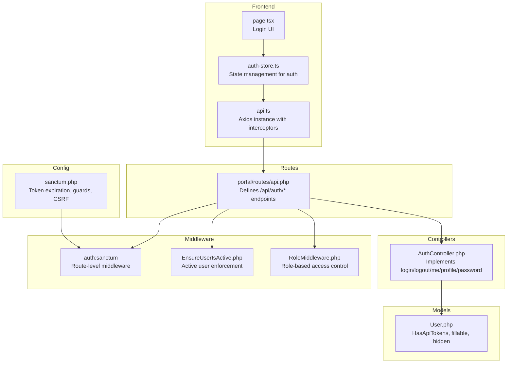
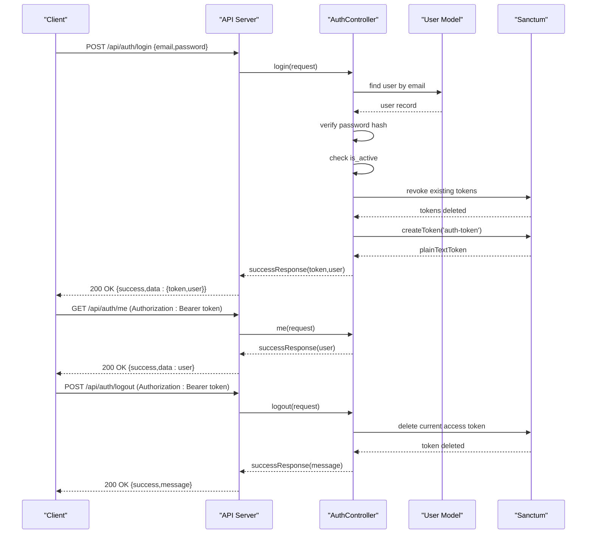
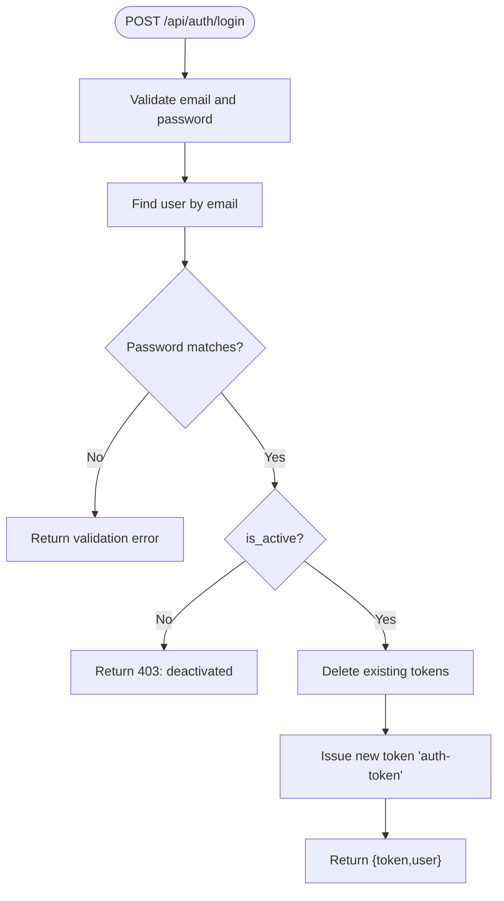
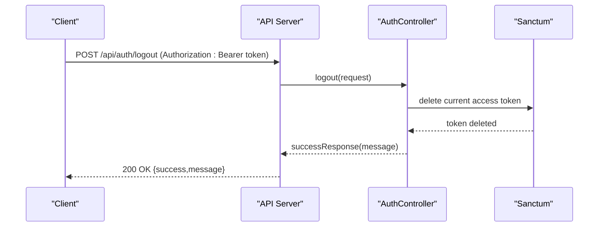
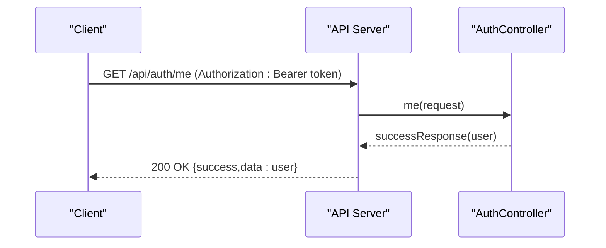
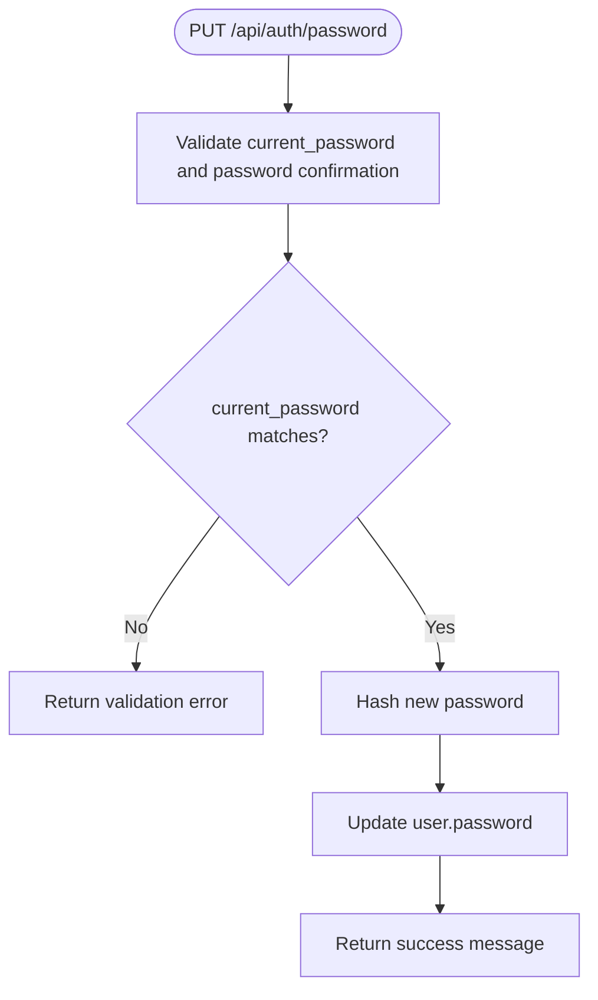
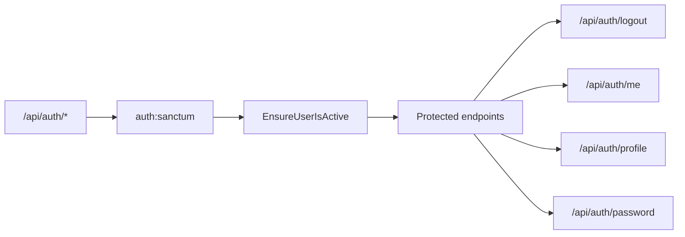
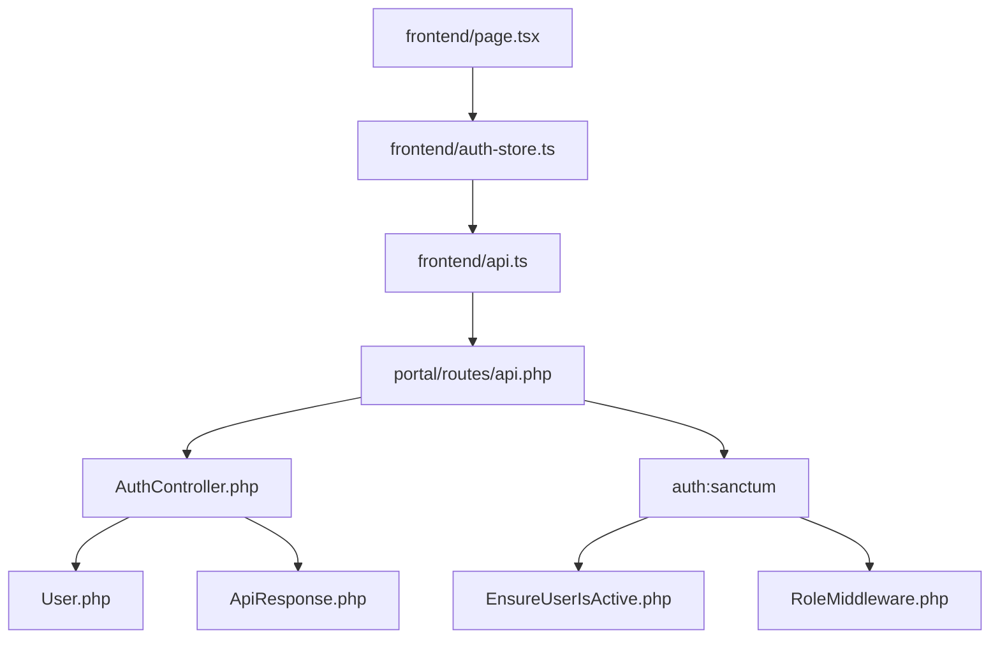

# Authentication Endpoints

<cite>
**Referenced Files in This Document**
- [api.php](file://portal/routes/api.php)
- [AuthController.php](file://portal/app/Http/Controllers/Auth/AuthController.php)
- [sanctum.php](file://portal/config/sanctum.php)
- [ApiResponse.php](file://portal/app/Traits/ApiResponse.php)
- [EnsureUserIsActive.php](file://portal/app/Http/Middleware/EnsureUserIsActive.php)
- [RoleMiddleware.php](file://portal/app/Http/Middleware/RoleMiddleware.php)
- [User.php](file://portal/app/Models/User.php)
- [auth-store.ts](file://portal/frontend/src/stores/auth-store.ts)
- [api.ts](file://portal/frontend/src/lib/api.ts)
- [page.tsx](file://portal/frontend/src/app/login/page.tsx)
- [index.ts](file://portal/frontend/src/types/index.ts)
- [create_users_table.php](file://portal/database/migrations/0001_01_01_000000_create_users_table.php)
</cite>

## Table of Contents
1. [Introduction](#introduction)
2. [Project Structure](#project-structure)
3. [Core Components](#core-components)
4. [Architecture Overview](#architecture-overview)
5. [Detailed Component Analysis](#detailed-component-analysis)
6. [Dependency Analysis](#dependency-analysis)
7. [Performance Considerations](#performance-considerations)
8. [Troubleshooting Guide](#troubleshooting-guide)
9. [Conclusion](#conclusion)
10. [Appendices](#appendices)

## Introduction
This document provides comprehensive API documentation for authentication endpoints in EPOS Portal. It covers the login endpoint, protected routes requiring Sanctum tokens, token lifecycle, error handling, and client-side implementation guidelines. Practical cURL examples, response schemas, and security considerations are included to help developers integrate and consume the authentication APIs safely and effectively.

## Project Structure
Authentication endpoints are defined in the API routes and implemented by the Auth controller. Sanctum configuration governs token behavior, while middleware enforces authentication and authorization. The frontend integrates with the backend via an Axios instance that attaches Bearer tokens and handles 401 responses.

**Diagram sources**
- [api.php:1-48](file://portal/routes/api.php#L1-L48)
- [AuthController.php:1-135](file://portal/app/Http/Controllers/Auth/AuthController.php#L1-L135)
- [sanctum.php:1-88](file://portal/config/sanctum.php#L1-L88)
- [EnsureUserIsActive.php:1-26](file://portal/app/Http/Middleware/EnsureUserIsActive.php#L1-L26)
- [RoleMiddleware.php:1-37](file://portal/app/Http/Middleware/RoleMiddleware.php#L1-L37)
- [User.php:1-38](file://portal/app/Models/User.php#L1-L38)
- [api.ts:1-37](file://portal/frontend/src/lib/api.ts#L1-L37)
- [auth-store.ts:1-64](file://portal/frontend/src/stores/auth-store.ts#L1-L64)
- [page.tsx:1-115](file://portal/frontend/src/app/login/page.tsx#L1-L115)

**Section sources**
- [api.php:1-48](file://portal/routes/api.php#L1-L48)
- [AuthController.php:1-135](file://portal/app/Http/Controllers/Auth/AuthController.php#L1-L135)
- [sanctum.php:1-88](file://portal/config/sanctum.php#L1-L88)
- [EnsureUserIsActive.php:1-26](file://portal/app/Http/Middleware/EnsureUserIsActive.php#L1-L26)
- [RoleMiddleware.php:1-37](file://portal/app/Http/Middleware/RoleMiddleware.php#L1-L37)
- [User.php:1-38](file://portal/app/Models/User.php#L1-L38)
- [api.ts:1-37](file://portal/frontend/src/lib/api.ts#L1-L37)
- [auth-store.ts:1-64](file://portal/frontend/src/stores/auth-store.ts#L1-L64)
- [page.tsx:1-115](file://portal/frontend/src/app/login/page.tsx#L1-L115)

## Core Components
- Routes define public and protected endpoints under /api/auth.
- AuthController implements login, logout, profile retrieval, profile update, and password change.
- Sanctum configuration controls token expiration and CSRF behavior.
- Middleware ensures authenticated and active users, and enforces role-based permissions.
- Frontend Axios instance attaches Authorization headers and handles 401 responses.

**Section sources**
- [api.php:6-16](file://portal/routes/api.php#L6-L16)
- [AuthController.php:18-133](file://portal/app/Http/Controllers/Auth/AuthController.php#L18-L133)
- [sanctum.php:40-53](file://portal/config/sanctum.php#L40-L53)
- [EnsureUserIsActive.php:11-24](file://portal/app/Http/Middleware/EnsureUserIsActive.php#L11-L24)
- [RoleMiddleware.php:15-35](file://portal/app/Http/Middleware/RoleMiddleware.php#L15-L35)
- [api.ts:11-34](file://portal/frontend/src/lib/api.ts#L11-L34)

## Architecture Overview
The authentication flow uses Sanctum personal access tokens. On successful login, a token is issued and stored client-side. Subsequent requests include the Authorization header. Middleware validates tokens and enforces active user and role checks.

**Diagram sources**
- [api.php:7](file://portal/routes/api.php#L7)
- [AuthController.php:18-56](file://portal/app/Http/Controllers/Auth/AuthController.php#L18-L56)
- [AuthController.php:71-85](file://portal/app/Http/Controllers/Auth/AuthController.php#L71-L85)
- [AuthController.php:61-66](file://portal/app/Http/Controllers/Auth/AuthController.php#L61-L66)
- [User.php:8](file://portal/app/Models/User.php#L8)

## Detailed Component Analysis

### Login Endpoint: POST /api/auth/login
- Purpose: Authenticate user with email and password, returning a Sanctum token and user data.
- Request body:
  - email: string, required, must be a valid email address
  - password: string, required
- Successful response:
  - data.token: string (plain-text token)
  - data.user: object containing user attributes
- Error scenarios:
  - Invalid credentials: throws validation error with message
  - Account deactivated: returns 403 with deactivation message
- Notes:
  - Existing tokens are revoked before issuing a new token
  - Token is created with a name "auth-token"

**Diagram sources**
- [AuthController.php:20-35](file://portal/app/Http/Controllers/Auth/AuthController.php#L20-L35)
- [AuthController.php:37-45](file://portal/app/Http/Controllers/Auth/AuthController.php#L37-L45)

**Section sources**
- [api.php:7](file://portal/routes/api.php#L7)
- [AuthController.php:18-56](file://portal/app/Http/Controllers/Auth/AuthController.php#L18-L56)
- [ApiResponse.php:9-26](file://portal/app/Traits/ApiResponse.php#L9-L26)

### Logout Endpoint: POST /api/auth/logout
- Purpose: Invalidate the current access token for the authenticated user.
- Authentication: Requires a valid Sanctum token.
- Behavior: Deletes the current access token.
- Response: Success message indicating logout completion.

**Diagram sources**
- [api.php:12](file://portal/routes/api.php#L12)
- [AuthController.php:61-66](file://portal/app/Http/Controllers/Auth/AuthController.php#L61-L66)

**Section sources**
- [api.php:12](file://portal/routes/api.php#L12)
- [AuthController.php:61-66](file://portal/app/Http/Controllers/Auth/AuthController.php#L61-L66)

### Profile Retrieval: GET /api/auth/me
- Purpose: Fetch the authenticated user’s profile.
- Authentication: Requires a valid Sanctum token.
- Response: User object with selected attributes.

**Diagram sources**
- [api.php:13](file://portal/routes/api.php#L13)
- [AuthController.php:71-85](file://portal/app/Http/Controllers/Auth/AuthController.php#L71-L85)

**Section sources**
- [api.php:13](file://portal/routes/api.php#L13)
- [AuthController.php:71-85](file://portal/app/Http/Controllers/Auth/AuthController.php#L71-L85)

### Profile Update: PUT /api/auth/profile
- Purpose: Update user profile fields (name, telegram_chat_id).
- Authentication: Requires a valid Sanctum token.
- Request body:
  - name: string, optional, max length 255
  - telegram_chat_id: string, optional, max length 100
- Response: Updated user object.

**Section sources**
- [api.php:14](file://portal/routes/api.php#L14)
- [AuthController.php:90-110](file://portal/app/Http/Controllers/Auth/AuthController.php#L90-L110)

### Password Change: PUT /api/auth/password
- Purpose: Change the user’s password.
- Authentication: Requires a valid Sanctum token.
- Request body:
  - current_password: string, required
  - password: string, required, minimum length 8, must match confirmation
- Error scenarios:
  - Incorrect current password: validation error
- Response: Success message upon successful password update.

**Diagram sources**
- [AuthController.php:115-133](file://portal/app/Http/Controllers/Auth/AuthController.php#L115-L133)

**Section sources**
- [api.php:15](file://portal/routes/api.php#L15)
- [AuthController.php:115-133](file://portal/app/Http/Controllers/Auth/AuthController.php#L115-L133)

### Protected Routes and Middleware
- Route group: /api/auth/* requires auth:sanctum and active user middleware.
- Active user enforcement: Ensures the user is active; otherwise deletes the token and returns 403.
- Role-based access: Additional role middleware restricts admin-only endpoints.

**Diagram sources**
- [api.php:10-16](file://portal/routes/api.php#L10-L16)
- [EnsureUserIsActive.php:11-24](file://portal/app/Http/Middleware/EnsureUserIsActive.php#L11-L24)

**Section sources**
- [api.php:10-16](file://portal/routes/api.php#L10-L16)
- [EnsureUserIsActive.php:11-24](file://portal/app/Http/Middleware/EnsureUserIsActive.php#L11-L24)
- [RoleMiddleware.php:15-35](file://portal/app/Http/Middleware/RoleMiddleware.php#L15-L35)

## Dependency Analysis
- Routes depend on AuthController methods.
- AuthController depends on User model and Sanctum token creation.
- Middleware depends on request user and token deletion.
- Frontend depends on Axios interceptors and auth store for token management.

**Diagram sources**
- [api.php:1-48](file://portal/routes/api.php#L1-L48)
- [AuthController.php:1-135](file://portal/app/Http/Controllers/Auth/AuthController.php#L1-L135)
- [User.php:1-38](file://portal/app/Models/User.php#L1-L38)
- [ApiResponse.php:1-56](file://portal/app/Traits/ApiResponse.php#L1-L56)
- [EnsureUserIsActive.php:1-26](file://portal/app/Http/Middleware/EnsureUserIsActive.php#L1-L26)
- [RoleMiddleware.php:1-37](file://portal/app/Http/Middleware/RoleMiddleware.php#L1-L37)
- [api.ts:1-37](file://portal/frontend/src/lib/api.ts#L1-L37)
- [auth-store.ts:1-64](file://portal/frontend/src/stores/auth-store.ts#L1-L64)
- [page.tsx:1-115](file://portal/frontend/src/app/login/page.tsx#L1-L115)

**Section sources**
- [api.php:1-48](file://portal/routes/api.php#L1-L48)
- [AuthController.php:1-135](file://portal/app/Http/Controllers/Auth/AuthController.php#L1-L135)
- [User.php:1-38](file://portal/app/Models/User.php#L1-L38)
- [ApiResponse.php:1-56](file://portal/app/Traits/ApiResponse.php#L1-L56)
- [EnsureUserIsActive.php:1-26](file://portal/app/Http/Middleware/EnsureUserIsActive.php#L1-L26)
- [RoleMiddleware.php:1-37](file://portal/app/Http/Middleware/RoleMiddleware.php#L1-L37)
- [api.ts:1-37](file://portal/frontend/src/lib/api.ts#L1-L37)
- [auth-store.ts:1-64](file://portal/frontend/src/stores/auth-store.ts#L1-L64)
- [page.tsx:1-115](file://portal/frontend/src/app/login/page.tsx#L1-L115)

## Performance Considerations
- Token revocation on login ensures single active session per user, reducing token proliferation.
- Sanctum token expiration is configured to be null by default; consider setting an expiration for long-lived tokens.
- Frontend interceptors avoid redundant requests by attaching Authorization headers automatically.

[No sources needed since this section provides general guidance]

## Troubleshooting Guide
Common issues and resolutions:
- 401 Unauthorized: Occurs when the Authorization header is missing or invalid. The frontend clears local storage and redirects to the login page.
- 403 Forbidden: Returned when the user account is deactivated or lacks required permissions. The server deletes the current token.
- Validation errors: Incorrect credentials or missing fields trigger validation messages.

**Section sources**
- [api.ts:22-34](file://portal/frontend/src/lib/api.ts#L22-L34)
- [EnsureUserIsActive.php:13-21](file://portal/app/Http/Middleware/EnsureUserIsActive.php#L13-L21)
- [AuthController.php:27-35](file://portal/app/Http/Controllers/Auth/AuthController.php#L27-L35)
- [AuthController.php:124-128](file://portal/app/Http/Controllers/Auth/AuthController.php#L124-L128)

## Conclusion
EPOS Portal’s authentication system leverages Sanctum for secure token-based authentication. The documented endpoints provide a complete authentication lifecycle, with robust error handling and middleware-driven enforcement of active user and role-based access. The frontend integrates seamlessly with the backend via Axios interceptors and a centralized auth store, ensuring consistent token management and user state handling.

[No sources needed since this section summarizes without analyzing specific files]

## Appendices

### API Definitions and Schemas

- Base URL
  - Production: https://yourdomain.com/api
  - Local development: http://localhost:8000/api

- Headers
  - Content-Type: application/json
  - Accept: application/json
  - Authorization: Bearer {token} (for protected routes)

- Response Envelope
  - Success envelope: { success: boolean, data: any, meta?: object }
  - Error envelope: { success: boolean, message: string, errors?: object }

- User Schema
  - id: number
  - name: string
  - email: string
  - role: "admin" | "dev" | "mkt"
  - telegram_chat_id: string | null
  - is_active: boolean
  - created_at: string
  - updated_at: string

- Token Schema
  - token: string (plain-text token issued by Sanctum)

- cURL Examples

  - Login
    - curl -X POST https://yourdomain.com/api/auth/login \
      -H "Content-Type: application/json" \
      -d '{"email":"admin@example.com","password":"your_password"}'

  - Get Profile
    - curl -X GET https://yourdomain.com/api/auth/me \
      -H "Authorization: Bearer YOUR_TOKEN"

  - Update Profile
    - curl -X PUT https://yourdomain.com/api/auth/profile \
      -H "Authorization: Bearer YOUR_TOKEN" \
      -H "Content-Type: application/json" \
      -d '{"name":"Updated Name","telegram_chat_id":"123456789"}'

  - Change Password
    - curl -X PUT https://yourdomain.com/api/auth/password \
      -H "Authorization: Bearer YOUR_TOKEN" \
      -H "Content-Type: application/json" \
      -d '{"current_password":"old_password","password":"new_password","password_confirmation":"new_password"}'

  - Logout
    - curl -X POST https://yourdomain.com/api/auth/logout \
      -H "Authorization: Bearer YOUR_TOKEN"

- Error Codes
  - 400 Bad Request: Validation errors (e.g., invalid credentials, field constraints)
  - 401 Unauthorized: Missing or invalid token
  - 403 Forbidden: Deactivated account or insufficient permissions
  - 422 Unprocessable Entity: Validation failure for request payload

**Section sources**
- [api.ts:3-9](file://portal/frontend/src/lib/api.ts#L3-L9)
- [index.ts:1-10](file://portal/frontend/src/types/index.ts#L1-L10)
- [create_users_table.php:14-25](file://portal/database/migrations/0001_01_01_000000_create_users_table.php#L14-L25)

### Security Considerations
- CSRF Protection
  - Sanctum middleware includes CSRF validation for stateful requests. Configure stateful domains appropriately for your deployment.
- Token Storage
  - Store tokens securely in browser local storage. The frontend interceptor attaches Authorization headers automatically.
- Logout Procedures
  - Delete the token on the server during logout and remove it from local storage on the client.
- Token Expiration
  - Token expiration is currently null. Consider setting a finite expiration and implementing a refresh strategy if needed.

**Section sources**
- [sanctum.php:21-26](file://portal/config/sanctum.php#L21-L26)
- [sanctum.php:81-85](file://portal/config/sanctum.php#L81-L85)
- [sanctum.php:53](file://portal/config/sanctum.php#L53)
- [AuthController.php:37-41](file://portal/app/Http/Controllers/Auth/AuthController.php#L37-L41)
- [api.ts:12-20](file://portal/frontend/src/lib/api.ts#L12-L20)
- [auth-store.ts:42-50](file://portal/frontend/src/stores/auth-store.ts#L42-L50)

### Client Implementation Guidelines
- Axios Interceptors
  - Attach Authorization header using the stored token.
  - Clear token and redirect to login on 401 responses.
- Auth Store
  - Persist token and user state in memory and local storage.
  - Hydrate state on app load by reading local storage.
  - Provide login, logout, and user fetch functions.
- UI Integration
  - Display login form with controlled inputs.
  - Handle submission errors and show user-friendly messages.
  - Redirect authenticated users away from login route.

**Section sources**
- [api.ts:11-34](file://portal/frontend/src/lib/api.ts#L11-L34)
- [auth-store.ts:17-63](file://portal/frontend/src/stores/auth-store.ts#L17-L63)
- [page.tsx:18-52](file://portal/frontend/src/app/login/page.tsx#L18-L52)