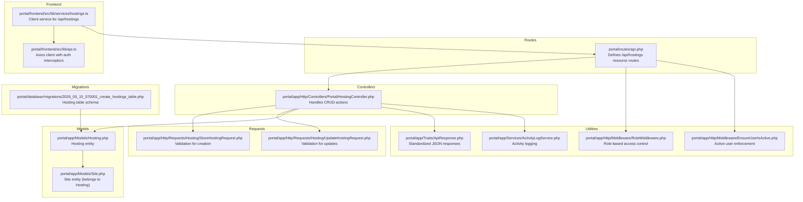
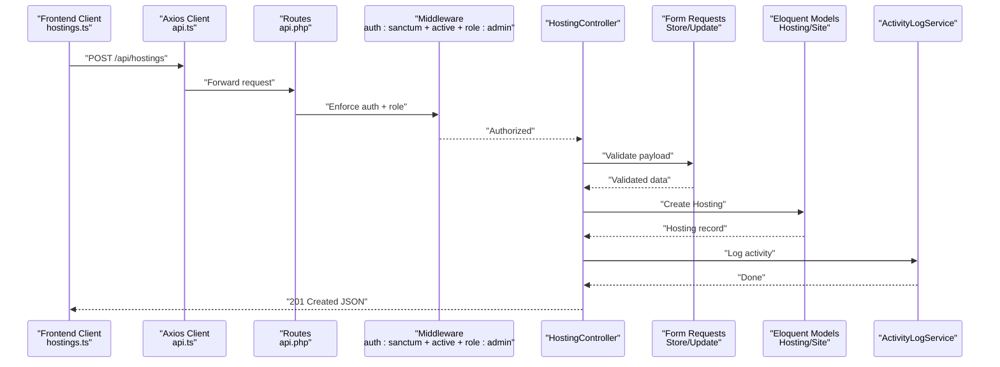
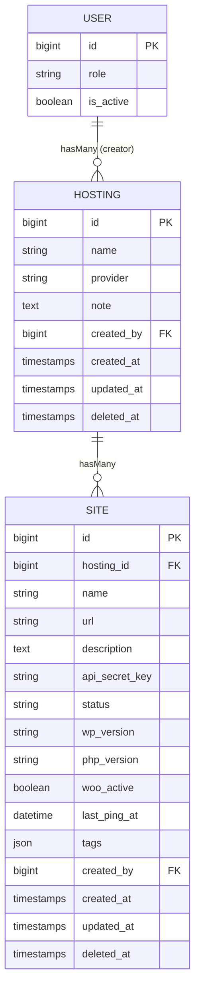
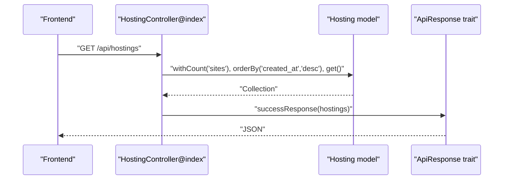
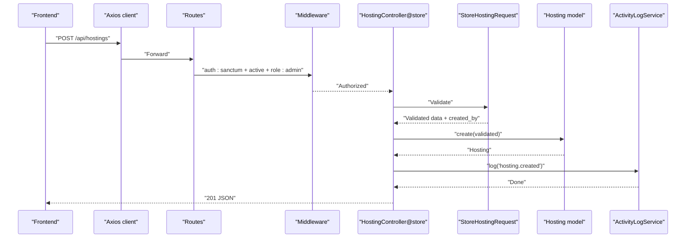
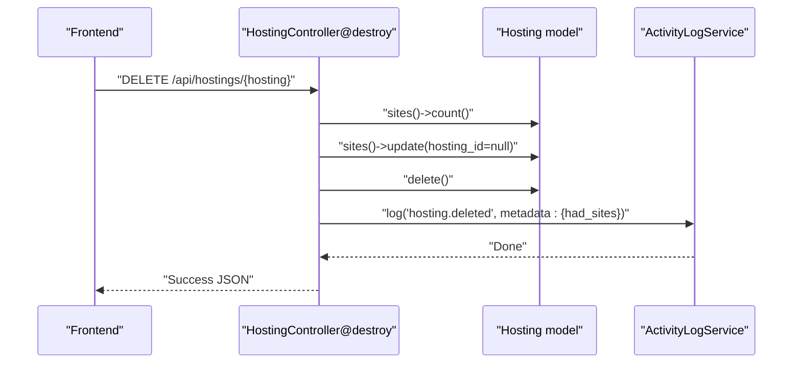
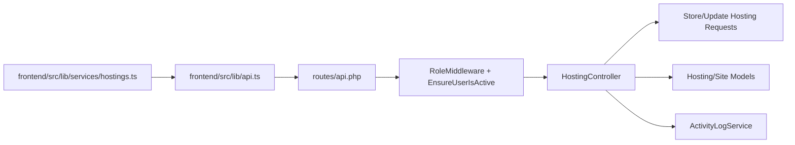

# Hosting Management Endpoints

<cite>
**Referenced Files in This Document**
- [api.php](file://portal/routes/api.php)
- [HostingController.php](file://portal/app/Http/Controllers/Portal/HostingController.php)
- [StoreHostingRequest.php](file://portal/app/Http/Requests/Hosting/StoreHostingRequest.php)
- [UpdateHostingRequest.php](file://portal/app/Http/Requests/Hosting/UpdateHostingRequest.php)
- [Hosting.php](file://portal/app/Models/Hosting.php)
- [Site.php](file://portal/app/Models/Site.php)
- [2026_05_15_070001_create_hostings_table.php](file://portal/database/migrations/2026_05_15_070001_create_hostings_table.php)
- [ApiResponse.php](file://portal/app/Traits/ApiResponse.php)
- [ActivityLogService.php](file://portal/app/Services/ActivityLogService.php)
- [RoleMiddleware.php](file://portal/app/Http/Middleware/RoleMiddleware.php)
- [EnsureUserIsActive.php](file://portal/app/Http/Middleware/EnsureUserIsActive.php)
- [hostings.ts](file://portal/frontend/src/lib/services/hostings.ts)
- [api.ts](file://portal/frontend/src/lib/api.ts)
</cite>

## Table of Contents
1. [Introduction](#introduction)
2. [Project Structure](#project-structure)
3. [Core Components](#core-components)
4. [Architecture Overview](#architecture-overview)
5. [Detailed Component Analysis](#detailed-component-analysis)
6. [Dependency Analysis](#dependency-analysis)
7. [Performance Considerations](#performance-considerations)
8. [Troubleshooting Guide](#troubleshooting-guide)
9. [Conclusion](#conclusion)
10. [Appendices](#appendices)

## Introduction
This document provides comprehensive API documentation for hosting management endpoints in EPOS Portal. It covers the complete CRUD lifecycle for hosting providers, including listing, creating, updating, and deleting hosting records. It also documents the hosting data model, relationships with sites, validation rules, authentication and authorization requirements, and error handling behavior. Practical examples and diagrams illustrate how the backend controllers, requests, models, and middleware collaborate to deliver a robust hosting management experience.

## Project Structure
The hosting management feature spans Laravel backend controllers, request validators, Eloquent models, database migrations, and frontend service clients. Routes define the endpoint surface, while middleware enforces authentication and role-based access control.

**Diagram sources**
- [api.php:22-23](file://portal/routes/api.php#L22-L23)
- [HostingController.php:13-82](file://portal/app/Http/Controllers/Portal/HostingController.php#L13-L82)
- [StoreHostingRequest.php:14-21](file://portal/app/Http/Requests/Hosting/StoreHostingRequest.php#L14-L21)
- [UpdateHostingRequest.php:15-22](file://portal/app/Http/Requests/Hosting/UpdateHostingRequest.php#L15-L22)
- [Hosting.php:10-30](file://portal/app/Models/Hosting.php#L10-L30)
- [Site.php:12-49](file://portal/app/Models/Site.php#L12-L49)
- [2026_05_15_070001_create_hostings_table.php:11-19](file://portal/database/migrations/2026_05_15_070001_create_hostings_table.php#L11-L19)
- [ApiResponse.php:9-26](file://portal/app/Traits/ApiResponse.php#L9-L26)
- [ActivityLogService.php:16-47](file://portal/app/Services/ActivityLogService.php#L16-L47)
- [RoleMiddleware.php:15-35](file://portal/app/Http/Middleware/RoleMiddleware.php#L15-L35)
- [EnsureUserIsActive.php:11-24](file://portal/app/Http/Middleware/EnsureUserIsActive.php#L11-L24)
- [hostings.ts:3-10](file://portal/frontend/src/lib/services/hostings.ts#L3-L10)
- [api.ts:12-20](file://portal/frontend/src/lib/api.ts#L12-L20)

**Section sources**
- [api.php:22-23](file://portal/routes/api.php#L22-L23)
- [HostingController.php:13-82](file://portal/app/Http/Controllers/Portal/HostingController.php#L13-L82)
- [StoreHostingRequest.php:14-21](file://portal/app/Http/Requests/Hosting/StoreHostingRequest.php#L14-L21)
- [UpdateHostingRequest.php:15-22](file://portal/app/Http/Requests/Hosting/UpdateHostingRequest.php#L15-L22)
- [Hosting.php:10-30](file://portal/app/Models/Hosting.php#L10-L30)
- [Site.php:12-49](file://portal/app/Models/Site.php#L12-L49)
- [2026_05_15_070001_create_hostings_table.php:11-19](file://portal/database/migrations/2026_05_15_070001_create_hostings_table.php#L11-L19)
- [ApiResponse.php:9-26](file://portal/app/Traits/ApiResponse.php#L9-L26)
- [ActivityLogService.php:16-47](file://portal/app/Services/ActivityLogService.php#L16-L47)
- [RoleMiddleware.php:15-35](file://portal/app/Http/Middleware/RoleMiddleware.php#L15-L35)
- [EnsureUserIsActive.php:11-24](file://portal/app/Http/Middleware/EnsureUserIsActive.php#L11-L24)
- [hostings.ts:3-10](file://portal/frontend/src/lib/services/hostings.ts#L3-L10)
- [api.ts:12-20](file://portal/frontend/src/lib/api.ts#L12-L20)

## Core Components
- API Resource Routes: The hosting resource endpoints are defined via Laravel’s apiResource, exposing standard CRUD routes under /api/hostings.
- Controller Actions: The controller implements index, store, show, update, and destroy with standardized success/error responses.
- Validation Requests: Dedicated form request classes enforce field rules for creation and updates.
- Models and Relationships: Hosting has many sites and belongs to a creator user; Site belongs to Hosting.
- Middleware: Authentication via Sanctum and role-based access control restrict access to administrative users.
- Frontend Client: A typed service wraps HTTP calls to the hosting endpoints.

**Section sources**
- [api.php:22-23](file://portal/routes/api.php#L22-L23)
- [HostingController.php:17-81](file://portal/app/Http/Controllers/Portal/HostingController.php#L17-L81)
- [StoreHostingRequest.php:14-21](file://portal/app/Http/Requests/Hosting/StoreHostingRequest.php#L14-L21)
- [UpdateHostingRequest.php:15-22](file://portal/app/Http/Requests/Hosting/UpdateHostingRequest.php#L15-L22)
- [Hosting.php:21-29](file://portal/app/Models/Hosting.php#L21-L29)
- [Site.php:41-43](file://portal/app/Models/Site.php#L41-L43)
- [RoleMiddleware.php:15-35](file://portal/app/Http/Middleware/RoleMiddleware.php#L15-L35)
- [EnsureUserIsActive.php:11-24](file://portal/app/Http/Middleware/EnsureUserIsActive.php#L11-L24)
- [hostings.ts:3-10](file://portal/frontend/src/lib/services/hostings.ts#L3-L10)

## Architecture Overview
The hosting management flow integrates route registration, middleware enforcement, controller actions, request validation, model persistence, and activity logging. The frontend consumes these endpoints through a shared Axios client configured with Bearer token injection.

**Diagram sources**
- [hostings.ts:5-6](file://portal/frontend/src/lib/services/hostings.ts#L5-L6)
- [api.ts:12-20](file://portal/frontend/src/lib/api.ts#L12-L20)
- [api.php:22-23](file://portal/routes/api.php#L22-L23)
- [RoleMiddleware.php:15-35](file://portal/app/Http/Middleware/RoleMiddleware.php#L15-L35)
- [EnsureUserIsActive.php:11-24](file://portal/app/Http/Middleware/EnsureUserIsActive.php#L11-L24)
- [HostingController.php:26-41](file://portal/app/Http/Controllers/Portal/HostingController.php#L26-L41)
- [StoreHostingRequest.php:14-21](file://portal/app/Http/Requests/Hosting/StoreHostingRequest.php#L14-L21)
- [Hosting.php:14-19](file://portal/app/Models/Hosting.php#L14-L19)
- [ActivityLogService.php:16-47](file://portal/app/Services/ActivityLogService.php#L16-L47)

## Detailed Component Analysis

### Endpoint Reference
- List all hostings
  - Method: GET
  - Path: /api/hostings
  - Description: Returns a list of hosting providers ordered by newest creation date. Each item includes a count of associated sites.
  - Authentication: Required (Sanctum), Active user enforced
  - Authorization: Admin role required
  - Response: Standard success wrapper with data array
- Create a hosting
  - Method: POST
  - Path: /api/hostings
  - Description: Creates a new hosting provider with validated attributes. Automatically sets the creator user ID.
  - Authentication: Required (Sanctum), Active user enforced
  - Authorization: Admin role required
  - Response: Standard success wrapper with created hosting object and 201 status
- View a hosting
  - Method: GET
  - Path: /api/hostings/{hosting}
  - Description: Retrieves a single hosting provider with site count loaded.
  - Authentication: Required (Sanctum), Active user enforced
  - Authorization: Admin role required
  - Response: Standard success wrapper with hosting object
- Update a hosting
  - Method: PUT/PATCH
  - Path: /api/hostings/{hosting}
  - Description: Updates existing hosting attributes conditionally based on provided fields.
  - Authentication: Required (Sanctum), Active user enforced
  - Authorization: Admin role required
  - Response: Standard success wrapper with updated hosting object
- Delete a hosting
  - Method: DELETE
  - Path: /api/hostings/{hosting}
  - Description: Deletes a hosting provider. Before deletion, unlinks all associated sites by clearing their hosting_id. Logs activity with metadata indicating prior site count.
  - Authentication: Required (Sanctum), Active user enforced
  - Authorization: Admin role required
  - Response: Standard success wrapper with message

**Section sources**
- [api.php:22-23](file://portal/routes/api.php#L22-L23)
- [HostingController.php:17-81](file://portal/app/Http/Controllers/Portal/HostingController.php#L17-L81)
- [hostings.ts:4-10](file://portal/frontend/src/lib/services/hostings.ts#L4-L10)

### Data Model and Relationships
The hosting management feature revolves around two primary models with clear relationships and constraints.

- Provider details: name, provider, note
- Creator attribution: created_by links to users
- Relationship with sites: Hosting has many sites; Site belongs to Hosting
- Hidden credential: api_secret_key is hidden from API responses (model-level hidden attributes)

**Diagram sources**
- [2026_05_15_070001_create_hostings_table.php:11-19](file://portal/database/migrations/2026_05_15_070001_create_hostings_table.php#L11-L19)
- [Hosting.php:14-19](file://portal/app/Models/Hosting.php#L14-L19)
- [Site.php:16-39](file://portal/app/Models/Site.php#L16-L39)
- [Site.php:41-43](file://portal/app/Models/Site.php#L41-L43)
- [Hosting.php:26-29](file://portal/app/Models/Hosting.php#L26-L29)

**Section sources**
- [2026_05_15_070001_create_hostings_table.php:11-19](file://portal/database/migrations/2026_05_15_070001_create_hostings_table.php#L11-L19)
- [Hosting.php:14-29](file://portal/app/Models/Hosting.php#L14-L29)
- [Site.php:16-39](file://portal/app/Models/Site.php#L16-L39)
- [Site.php:41-43](file://portal/app/Models/Site.php#L41-L43)

### Validation Rules and Field Definitions
- Creation (StoreHostingRequest)
  - name: required, string, max length, unique per provider name
  - provider: required, string, must be one of predefined values
  - note: optional, string
- Update (UpdateHostingRequest)
  - name: optional, string, max length, unique constraint ignores current hosting record
  - provider: optional, string, must be one of predefined values
  - note: optional, string

Predefined provider values: cloudways, cpanel, runcloud, vultr, digitalocean, other

**Section sources**
- [StoreHostingRequest.php:14-21](file://portal/app/Http/Requests/Hosting/StoreHostingRequest.php#L14-L21)
- [UpdateHostingRequest.php:15-22](file://portal/app/Http/Requests/Hosting/UpdateHostingRequest.php#L15-L22)

### Authentication, Authorization, and Security
- Authentication: Sanctum tokens required for all protected routes. The frontend attaches a Bearer token automatically.
- Active user enforcement: Requests fail if the authenticated user is inactive.
- Authorization: Admin role required for hosting management endpoints.
- Credential handling: api_secret_key is hidden from API responses at the model level.

**Section sources**
- [api.php:13-30](file://portal/routes/api.php#L13-L30)
- [api.ts:12-20](file://portal/frontend/src/lib/api.ts#L12-L20)
- [EnsureUserIsActive.php:11-24](file://portal/app/Http/Middleware/EnsureUserIsActive.php#L11-L24)
- [RoleMiddleware.php:15-35](file://portal/app/Http/Middleware/RoleMiddleware.php#L15-L35)
- [Site.php:37-39](file://portal/app/Models/Site.php#L37-L39)

### API Workflows

#### Listing Hostings

**Diagram sources**
- [HostingController.php:17-24](file://portal/app/Http/Controllers/Portal/HostingController.php#L17-L24)
- [ApiResponse.php:9-26](file://portal/app/Traits/ApiResponse.php#L9-L26)

#### Creating a Hosting

**Diagram sources**
- [HostingController.php:26-41](file://portal/app/Http/Controllers/Portal/HostingController.php#L26-L41)
- [StoreHostingRequest.php:14-21](file://portal/app/Http/Requests/Hosting/StoreHostingRequest.php#L14-L21)
- [Hosting.php:14-19](file://portal/app/Models/Hosting.php#L14-L19)
- [ActivityLogService.php:16-47](file://portal/app/Services/ActivityLogService.php#L16-L47)
- [api.php:22-23](file://portal/routes/api.php#L22-L23)
- [RoleMiddleware.php:15-35](file://portal/app/Http/Middleware/RoleMiddleware.php#L15-L35)
- [EnsureUserIsActive.php:11-24](file://portal/app/Http/Middleware/EnsureUserIsActive.php#L11-L24)

#### Deleting a Hosting

**Diagram sources**
- [HostingController.php:63-81](file://portal/app/Http/Controllers/Portal/HostingController.php#L63-L81)
- [ActivityLogService.php:16-47](file://portal/app/Services/ActivityLogService.php#L16-L47)

### Practical Examples

- Creating a hosting provider
  - Endpoint: POST /api/hostings
  - Payload keys: name, provider, note (optional)
  - Example payload: {"name":"Production Cloud","provider":"cpanel","note":"Primary production environment"}
  - Response: 201 with created hosting object

- Updating a hosting provider
  - Endpoint: PUT /api/hostings/{hosting}
  - Payload keys: name (optional), provider (optional), note (optional)
  - Example payload: {"provider":"runcloud"}

- Deleting a hosting provider
  - Endpoint: DELETE /api/hostings/{hosting}
  - Behavior: All associated sites are unlinked (hosting_id cleared), then hosting is deleted
  - Response: Success message

- Listing and viewing
  - GET /api/hostings returns an array with site counts
  - GET /api/hostings/{hosting} returns a single hosting with site count

Note: These examples describe request/response shapes conceptually. Refer to the “Endpoint Reference” and “Section sources” for precise paths and validations.

**Section sources**
- [hostings.ts:5-6](file://portal/frontend/src/lib/services/hostings.ts#L5-L6)
- [hostings.ts:8](file://portal/frontend/src/lib/services/hostings.ts#L8)
- [hostings.ts:10](file://portal/frontend/src/lib/services/hostings.ts#L10)
- [HostingController.php:17-81](file://portal/app/Http/Controllers/Portal/HostingController.php#L17-L81)

## Dependency Analysis
The hosting feature exhibits clear separation of concerns:
- Routes delegate to the controller for all CRUD operations.
- Controllers depend on request validators for input sanitization.
- Controllers persist data via Eloquent models and log activities.
- Middleware ensures authentication and authorization.
- Frontend service layer encapsulates HTTP interactions.

**Diagram sources**
- [hostings.ts:3-10](file://portal/frontend/src/lib/services/hostings.ts#L3-L10)
- [api.ts:12-20](file://portal/frontend/src/lib/api.ts#L12-L20)
- [api.php:22-23](file://portal/routes/api.php#L22-L23)
- [RoleMiddleware.php:15-35](file://portal/app/Http/Middleware/RoleMiddleware.php#L15-L35)
- [EnsureUserIsActive.php:11-24](file://portal/app/Http/Middleware/EnsureUserIsActive.php#L11-L24)
- [HostingController.php:26-41](file://portal/app/Http/Controllers/Portal/HostingController.php#L26-L41)
- [StoreHostingRequest.php:14-21](file://portal/app/Http/Requests/Hosting/StoreHostingRequest.php#L14-L21)
- [UpdateHostingRequest.php:15-22](file://portal/app/Http/Requests/Hosting/UpdateHostingRequest.php#L15-L22)
- [Hosting.php:14-19](file://portal/app/Models/Hosting.php#L14-L19)
- [Site.php:16-39](file://portal/app/Models/Site.php#L16-L39)
- [ActivityLogService.php:16-47](file://portal/app/Services/ActivityLogService.php#L16-L47)

**Section sources**
- [api.php:22-23](file://portal/routes/api.php#L22-L23)
- [HostingController.php:17-81](file://portal/app/Http/Controllers/Portal/HostingController.php#L17-L81)
- [StoreHostingRequest.php:14-21](file://portal/app/Http/Requests/Hosting/StoreHostingRequest.php#L14-L21)
- [UpdateHostingRequest.php:15-22](file://portal/app/Http/Requests/Hosting/UpdateHostingRequest.php#L15-L22)
- [Hosting.php:14-29](file://portal/app/Models/Hosting.php#L14-L29)
- [Site.php:16-39](file://portal/app/Models/Site.php#L16-L39)
- [ActivityLogService.php:16-47](file://portal/app/Services/ActivityLogService.php#L16-L47)
- [RoleMiddleware.php:15-35](file://portal/app/Http/Middleware/RoleMiddleware.php#L15-L35)
- [EnsureUserIsActive.php:11-24](file://portal/app/Http/Middleware/EnsureUserIsActive.php#L11-L24)
- [hostings.ts:3-10](file://portal/frontend/src/lib/services/hostings.ts#L3-L10)
- [api.ts:12-20](file://portal/frontend/src/lib/api.ts#L12-L20)

## Performance Considerations
- Indexing: Consider adding database indexes on frequently filtered or joined columns (e.g., created_by, provider) to optimize listing and filtering.
- Eager loading: The controller already loads site counts efficiently; avoid N+1 queries by leveraging withCount and similar patterns.
- Pagination: For large datasets, introduce pagination in listing endpoints to reduce payload sizes.
- Logging overhead: Activity logging is resilient and falls back to logs if the table is missing; ensure appropriate log rotation and monitoring.

[No sources needed since this section provides general guidance]

## Troubleshooting Guide
Common issues and their likely causes:

- 401 Unauthorized
  - Cause: Missing or invalid Sanctum token
  - Resolution: Ensure the frontend includes a Bearer token in Authorization header
- 403 Forbidden
  - Cause: User lacks admin role or account is inactive
  - Resolution: Verify user role and activation status; re-authenticate if needed
- Validation errors (422 Unprocessable Entity)
  - Causes:
    - name is required and must be unique
    - provider must be one of the allowed values
    - note must be a string if provided
  - Resolution: Correct payload according to validation rules
- Deletion conflicts
  - Behavior: Deleting a hosting provider unlinks all associated sites before deletion
  - Impact: Sites remain but lose their hosting association
  - Resolution: Confirm site ownership and reassignment before deletion

**Section sources**
- [api.ts:23-34](file://portal/frontend/src/lib/api.ts#L23-L34)
- [RoleMiddleware.php:19-32](file://portal/app/Http/Middleware/RoleMiddleware.php#L19-L32)
- [EnsureUserIsActive.php:13-21](file://portal/app/Http/Middleware/EnsureUserIsActive.php#L13-L21)
- [StoreHostingRequest.php:17-19](file://portal/app/Http/Requests/Hosting/StoreHostingRequest.php#L17-L19)
- [UpdateHostingRequest.php:18-20](file://portal/app/Http/Requests/Hosting/UpdateHostingRequest.php#L18-L20)
- [HostingController.php:65-68](file://portal/app/Http/Controllers/Portal/HostingController.php#L65-L68)

## Conclusion
The hosting management endpoints provide a secure, validated, and auditable interface for managing hosting providers. With role-based access control, standardized responses, and activity logging, the system supports reliable operations across creation, listing, viewing, updating, and deletion. The defined relationships with sites enable clear operational semantics, particularly during deletions, ensuring data integrity and traceability.

[No sources needed since this section summarizes without analyzing specific files]

## Appendices

### Endpoint Summary Table
- GET /api/hostings
  - Purpose: List all hostings with site counts
  - Auth: Required, Active, Admin
  - Response: Array of hostings
- POST /api/hostings
  - Purpose: Create a hosting
  - Auth: Required, Active, Admin
  - Body: name, provider, note (optional)
  - Response: Single hosting, 201
- GET /api/hostings/{hosting}
  - Purpose: View a hosting with site count
  - Auth: Required, Active, Admin
  - Response: Single hosting
- PUT /api/hostings/{hosting}
  - Purpose: Update a hosting
  - Auth: Required, Active, Admin
  - Body: name (optional), provider (optional), note (optional)
  - Response: Updated hosting
- DELETE /api/hostings/{hosting}
  - Purpose: Delete a hosting and unlink sites
  - Auth: Required, Active, Admin
  - Response: Success message

**Section sources**
- [api.php:22-23](file://portal/routes/api.php#L22-L23)
- [HostingController.php:17-81](file://portal/app/Http/Controllers/Portal/HostingController.php#L17-L81)
- [hostings.ts:4-10](file://portal/frontend/src/lib/services/hostings.ts#L4-L10)