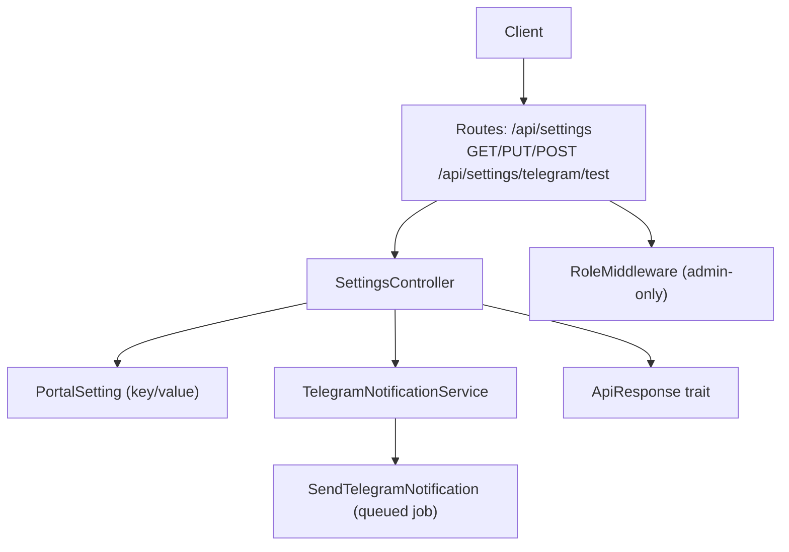
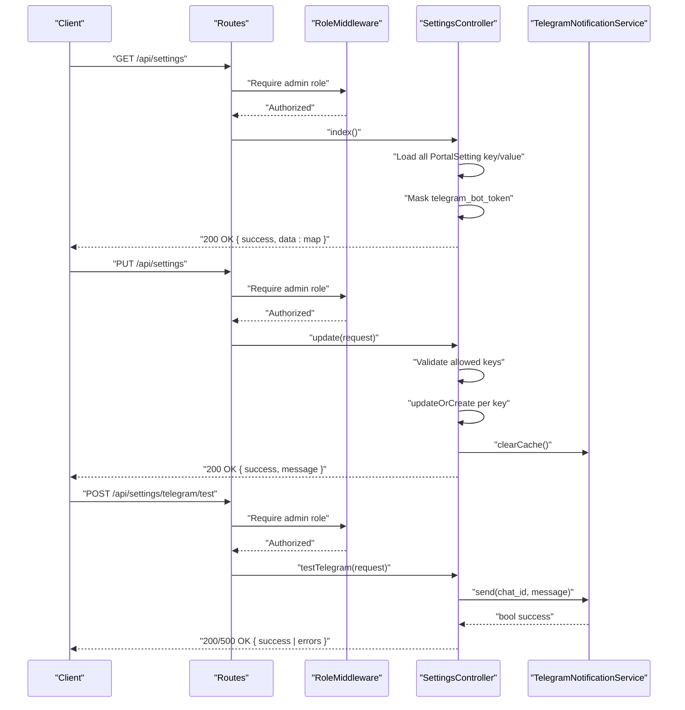
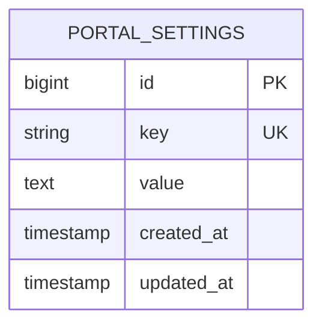
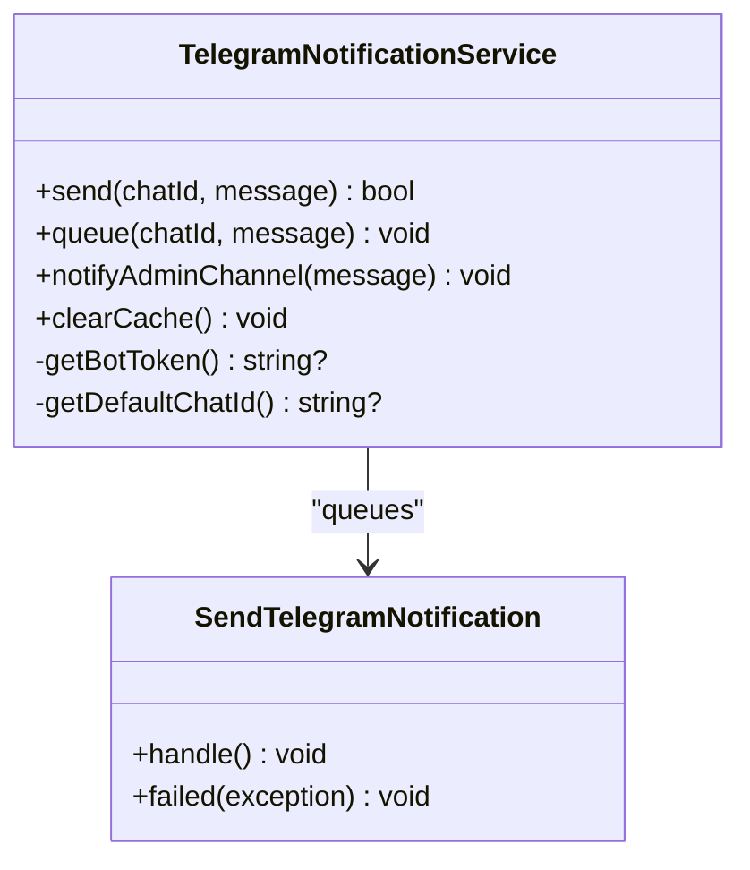
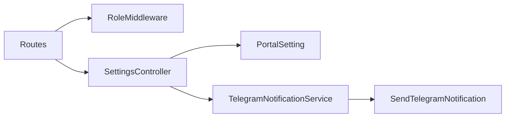

# Settings & Configuration Endpoints

<cite>
**Referenced Files in This Document**
- [api.php](file://portal/routes/api.php)
- [SettingsController.php](file://portal/app/Http/Controllers/Portal/SettingsController.php)
- [TelegramNotificationService.php](file://portal/app/Services/TelegramNotificationService.php)
- [SendTelegramNotification.php](file://portal/app/Jobs/SendTelegramNotification.php)
- [PortalSetting.php](file://portal/app/Models/PortalSetting.php)
- [2026_05_15_070005_create_portal_settings_table.php](file://portal/database/migrations/2026_05_15_070005_create_portal_settings_table.php)
- [DatabaseSeeder.php](file://portal/database/seeders/DatabaseSeeder.php)
- [RoleMiddleware.php](file://portal/app/Http/Middleware/RoleMiddleware.php)
- [ApiResponse.php](file://portal/app/Traits/ApiResponse.php)
- [api.ts](file://portal/frontend/src/lib/api.ts)
</cite>

## Table of Contents
1. [Introduction](#introduction)
2. [Project Structure](#project-structure)
3. [Core Components](#core-components)
4. [Architecture Overview](#architecture-overview)
5. [Detailed Component Analysis](#detailed-component-analysis)
6. [Dependency Analysis](#dependency-analysis)
7. [Performance Considerations](#performance-considerations)
8. [Troubleshooting Guide](#troubleshooting-guide)
9. [Conclusion](#conclusion)
10. [Appendices](#appendices)

## Introduction
This document provides comprehensive API documentation for system settings and configuration endpoints in EPOS Portal. It covers:
- Retrieving current configuration values via the settings retrieval endpoint
- Updating system parameters via the settings update endpoint
- Testing Telegram bot connectivity via the Telegram test endpoint
- Available settings categories and their validation rules
- Request/response schemas, defaults, and practical usage examples
- Permission requirements, validation behavior, and integration failure handling

## Project Structure
The settings endpoints are defined in the API routes and handled by a dedicated controller. Settings are persisted in a key-value table and consumed by services for Telegram notifications. Validation and response formatting are centralized via controller traits and middleware.

**Diagram sources**
- [api.php:26-29](file://portal/routes/api.php#L26-L29)
- [SettingsController.php:11-86](file://portal/app/Http/Controllers/Portal/SettingsController.php#L11-L86)
- [PortalSetting.php:7-10](file://portal/app/Models/PortalSetting.php#L7-L10)
- [TelegramNotificationService.php:11-106](file://portal/app/Services/TelegramNotificationService.php#L11-L106)
- [SendTelegramNotification.php:13-61](file://portal/app/Jobs/SendTelegramNotification.php#L13-L61)
- [ApiResponse.php:7-55](file://portal/app/Traits/ApiResponse.php#L7-L55)
- [RoleMiddleware.php:9-36](file://portal/app/Http/Middleware/RoleMiddleware.php#L9-L36)

**Section sources**
- [api.php:26-29](file://portal/routes/api.php#L26-L29)

## Core Components
- Settings retrieval endpoint: GET /api/settings
  - Returns all current settings as a key-value map
  - Masks sensitive Telegram bot token in the response
- Settings update endpoint: PUT /api/settings
  - Validates and persists allowed keys
  - Clears Telegram cache after updates
- Telegram test endpoint: POST /api/settings/telegram/test
  - Sends a test message to a provided chat ID
  - Requires a valid Telegram chat ID

Allowed settings keys:
- telegram_bot_token
- telegram_default_chat_id
- portal_base_url
- agent_ping_interval_minutes
- max_deployment_retries

Defaults established during seeding:
- telegram_bot_token: empty string
- telegram_default_chat_id: empty string
- portal_base_url: http://localhost:8081
- agent_ping_interval_minutes: 5
- max_deployment_retries: 3

**Section sources**
- [SettingsController.php:18-28](file://portal/app/Http/Controllers/Portal/SettingsController.php#L18-L28)
- [SettingsController.php:33-64](file://portal/app/Http/Controllers/Portal/SettingsController.php#L33-L64)
- [SettingsController.php:69-85](file://portal/app/Http/Controllers/Portal/SettingsController.php#L69-L85)
- [DatabaseSeeder.php:32-46](file://portal/database/seeders/DatabaseSeeder.php#L32-L46)

## Architecture Overview
The settings endpoints are protected by authentication and role middleware. Updates trigger cache invalidation for Telegram-related settings, ensuring subsequent reads reflect the latest configuration.

**Diagram sources**
- [api.php:26-29](file://portal/routes/api.php#L26-L29)
- [RoleMiddleware.php:15-35](file://portal/app/Http/Middleware/RoleMiddleware.php#L15-L35)
- [SettingsController.php:18-28](file://portal/app/Http/Controllers/Portal/SettingsController.php#L18-L28)
- [SettingsController.php:33-64](file://portal/app/Http/Controllers/Portal/SettingsController.php#L33-L64)
- [SettingsController.php:69-85](file://portal/app/Http/Controllers/Portal/SettingsController.php#L69-L85)
- [TelegramNotificationService.php:16-48](file://portal/app/Services/TelegramNotificationService.php#L16-L48)

## Detailed Component Analysis

### Settings Retrieval Endpoint
- Method: GET
- Path: /api/settings
- Authentication: Required (any active user)
- Authorization: Admin-only route group enforced by middleware
- Behavior:
  - Loads all settings from the portal_settings table
  - Masks the telegram_bot_token value in the response
  - Returns a flat map of key to value

Response schema:
- success: boolean
- data: object
  - Keys: string
  - Values: string | number (as applicable)
- message: optional string

Example response:
{
  "success": true,
  "data": {
    "telegram_bot_token": "••••••••…",
    "telegram_default_chat_id": "",
    "portal_base_url": "http://localhost:8081",
    "agent_ping_interval_minutes": 5,
    "max_deployment_retries": 3
  }
}

Notes:
- The masked token is intended to prevent accidental exposure while still allowing verification of presence.

**Section sources**
- [api.php:26-28](file://portal/routes/api.php#L26-L28)
- [SettingsController.php:18-28](file://portal/app/Http/Controllers/Portal/SettingsController.php#L18-L28)

### Settings Update Endpoint
- Method: PUT
- Path: /api/settings
- Authentication: Required (any active user)
- Authorization: Admin-only route group enforced by middleware
- Allowed keys (validated):
  - telegram_bot_token: nullable string
  - telegram_default_chat_id: nullable string
  - portal_base_url: nullable url
  - agent_ping_interval_minutes: nullable integer min 1, max 60
  - max_deployment_retries: nullable integer min 0, max 10
- Behavior:
  - Validates input against allowed keys and rules
  - Persists only provided keys using updateOrCreate semantics
  - Clears Telegram cache to refresh token/chat ID availability

Success response:
- success: boolean
- message: string indicating update outcome

Validation behavior:
- Unknown keys are ignored
- Partial updates are supported (only provided keys are changed)
- Numeric ranges enforce safe operational bounds

**Section sources**
- [api.php:26-28](file://portal/routes/api.php#L26-L28)
- [SettingsController.php:33-64](file://portal/app/Http/Controllers/Portal/SettingsController.php#L33-L64)

### Telegram Test Endpoint
- Method: POST
- Path: /api/settings/telegram/test
- Authentication: Required (any active user)
- Authorization: Admin-only route group enforced by middleware
- Request body:
  - chat_id: string (required)
- Behavior:
  - Validates presence of chat_id
  - Sends a Markdown-formatted test message to Telegram via service
  - Returns success on API success; otherwise returns error with details

Success response:
- success: boolean
- message: string indicating test outcome

Failure response:
- success: boolean (false)
- message: string describing failure
- errors: optional object with details

**Section sources**
- [api.php:29](file://portal/routes/api.php#L29)
- [SettingsController.php:69-85](file://portal/app/Http/Controllers/Portal/SettingsController.php#L69-L85)
- [TelegramNotificationService.php:16-48](file://portal/app/Services/TelegramNotificationService.php#L16-L48)

### Data Model and Defaults
- Table: portal_settings
  - Columns: id, key (unique), value, timestamps
- Model: PortalSetting
  - Fillable: key, value
- Defaults seeded at installation:
  - telegram_bot_token: ""
  - telegram_default_chat_id: ""
  - portal_base_url: "http://localhost:8081"
  - agent_ping_interval_minutes: "5"
  - max_deployment_retries: "3"

**Diagram sources**
- [2026_05_15_070005_create_portal_settings_table.php:11-16](file://portal/database/migrations/2026_05_15_070005_create_portal_settings_table.php#L11-L16)
- [PortalSetting.php:9](file://portal/app/Models/PortalSetting.php#L9)

**Section sources**
- [2026_05_15_070005_create_portal_settings_table.php:11-16](file://portal/database/migrations/2026_05_15_070005_create_portal_settings_table.php#L11-L16)
- [PortalSetting.php:7-10](file://portal/app/Models/PortalSetting.php#L7-L10)
- [DatabaseSeeder.php:32-46](file://portal/database/seeders/DatabaseSeeder.php#L32-L46)

### Telegram Notification Service
- Purpose: Centralized logic for sending Telegram messages and managing cached credentials
- Methods:
  - send(chatId, message): synchronous test send
  - queue(chatId, message): dispatches queued job
  - notifyAdminChannel(message): convenience method using default chat ID
  - clearCache(): evicts cached token and default chat ID
- Caching:
  - Bot token and default chat ID are cached for 300 seconds
  - Updated settings trigger cache eviction

**Diagram sources**
- [TelegramNotificationService.php:11-106](file://portal/app/Services/TelegramNotificationService.php#L11-L106)
- [SendTelegramNotification.php:13-61](file://portal/app/Jobs/SendTelegramNotification.php#L13-L61)

**Section sources**
- [TelegramNotificationService.php:16-48](file://portal/app/Services/TelegramNotificationService.php#L16-L48)
- [TelegramNotificationService.php:101-105](file://portal/app/Services/TelegramNotificationService.php#L101-L105)
- [SendTelegramNotification.php:25-52](file://portal/app/Jobs/SendTelegramNotification.php#L25-L52)

### Request/Response Schemas and Validation Rules
- GET /api/settings
  - Request: none
  - Response: success + data map (masked telegram_bot_token)
- PUT /api/settings
  - Request: partial object with allowed keys and validations
  - Response: success + message on success
  - Validation rules:
    - telegram_bot_token: nullable string
    - telegram_default_chat_id: nullable string
    - portal_base_url: nullable url
    - agent_ping_interval_minutes: nullable integer in [1, 60]
    - max_deployment_retries: nullable integer in [0, 10]
- POST /api/settings/telegram/test
  - Request: chat_id (required string)
  - Response: success + message on success; else success + message + errors

Default values:
- See seeding defaults above

**Section sources**
- [SettingsController.php:35-41](file://portal/app/Http/Controllers/Portal/SettingsController.php#L35-L41)
- [SettingsController.php:69-73](file://portal/app/Http/Controllers/Portal/SettingsController.php#L69-L73)
- [DatabaseSeeder.php:32-46](file://portal/database/seeders/DatabaseSeeder.php#L32-L46)

### Practical Examples

- Retrieve current settings
  - Method: GET /api/settings
  - Expected outcome: Returns all settings with masked token
  - Typical response keys: telegram_bot_token (masked), telegram_default_chat_id, portal_base_url, agent_ping_interval_minutes, max_deployment_retries

- Update configuration values
  - Method: PUT /api/settings
  - Example payload (partial update):
    {
      "portal_base_url": "https://portal.example.com",
      "agent_ping_interval_minutes": 10
    }
  - Outcome: Only provided keys are updated; others remain unchanged

- Test Telegram integration
  - Method: POST /api/settings/telegram/test
  - Example payload:
    {
      "chat_id": "-1001234567890"
    }
  - Outcome: On success, returns confirmation; on failure, returns error with details

Note: Responses follow the standardized success/error envelope.

**Section sources**
- [SettingsController.php:18-28](file://portal/app/Http/Controllers/Portal/SettingsController.php#L18-L28)
- [SettingsController.php:33-64](file://portal/app/Http/Controllers/Portal/SettingsController.php#L33-L64)
- [SettingsController.php:69-85](file://portal/app/Http/Controllers/Portal/SettingsController.php#L69-L85)

## Dependency Analysis
- Route protection:
  - Admin-only endpoints are wrapped in role middleware
- Controller dependencies:
  - Uses ApiResponse trait for consistent JSON envelopes
  - Interacts with PortalSetting model for persistence
  - Calls TelegramNotificationService for cache invalidation and test sends
- Service dependencies:
  - TelegramNotificationService caches credentials and queues asynchronous jobs
  - SendTelegramNotification performs HTTP requests to Telegram API and retries on failure

**Diagram sources**
- [api.php:20-30](file://portal/routes/api.php#L20-L30)
- [RoleMiddleware.php:15-35](file://portal/app/Http/Middleware/RoleMiddleware.php#L15-L35)
- [SettingsController.php:13](file://portal/app/Http/Controllers/Portal/SettingsController.php#L13)
- [PortalSetting.php:9](file://portal/app/Models/PortalSetting.php#L9)
- [TelegramNotificationService.php:101-105](file://portal/app/Services/TelegramNotificationService.php#L101-L105)
- [SendTelegramNotification.php:64](file://portal/app/Jobs/SendTelegramNotification.php#L64)

**Section sources**
- [api.php:20-30](file://portal/routes/api.php#L20-L30)
- [SettingsController.php:13](file://portal/app/Http/Controllers/Portal/SettingsController.php#L13)

## Performance Considerations
- Caching:
  - Telegram bot token and default chat ID are cached for 300 seconds to reduce database queries
  - After updates, cache is cleared to ensure immediate propagation of changes
- Asynchronous delivery:
  - Production notifications are queued via a job with retry/backoff logic
- Validation:
  - Input validation prevents invalid numeric ranges and malformed URLs

**Section sources**
- [TelegramNotificationService.php:81-96](file://portal/app/Services/TelegramNotificationService.php#L81-L96)
- [TelegramNotificationService.php:101-105](file://portal/app/Services/TelegramNotificationService.php#L101-L105)
- [SendTelegramNotification.php:17-18](file://portal/app/Jobs/SendTelegramNotification.php#L17-L18)
- [SettingsController.php:35-41](file://portal/app/Http/Controllers/Portal/SettingsController.php#L35-L41)

## Troubleshooting Guide
Common scenarios and resolutions:
- Invalid settings payload
  - Cause: Unknown keys or out-of-range values
  - Behavior: Only allowed keys are processed; unknown keys are ignored
  - Resolution: Provide only allowed keys with valid ranges
- Permission denied
  - Cause: Non-admin user attempts to access admin-only endpoints
  - Behavior: 403 response with permission message
  - Resolution: Authenticate with an admin account
- Telegram test failure
  - Cause: Missing or invalid bot token, invalid chat ID, or Telegram API error
  - Behavior: 500 response with error message
  - Resolution: Verify bot token and chat ID; retry after correcting credentials
- Unauthenticated requests
  - Cause: Missing or expired auth token
  - Behavior: Frontend interceptor handles 401 by redirecting to login
  - Resolution: Re-authenticate and retry

**Section sources**
- [SettingsController.php:43-49](file://portal/app/Http/Controllers/Portal/SettingsController.php#L43-L49)
- [RoleMiddleware.php:19-31](file://portal/app/Http/Middleware/RoleMiddleware.php#L19-L31)
- [SettingsController.php:84](file://portal/app/Http/Controllers/Portal/SettingsController.php#L84)
- [TelegramNotificationService.php:20-23](file://portal/app/Services/TelegramNotificationService.php#L20-L23)
- [api.ts:23-33](file://portal/frontend/src/lib/api.ts#L23-L33)

## Conclusion
The settings endpoints provide a secure, validated interface for reading and updating system configuration, with built-in safeguards for sensitive data and robust error handling. Telegram integration is supported through synchronous testing and asynchronous queued delivery, with caching and retry mechanisms to ensure reliability.

## Appendices

### Endpoint Reference
- GET /api/settings
  - Description: Retrieve current system settings
  - Auth: Active user
  - Admin: Not required
  - Response: success + data map (masked token)
- PUT /api/settings
  - Description: Update allowed configuration keys
  - Auth: Active user
  - Admin: Required
  - Body: Partial object with allowed keys and validations
  - Response: success + message
- POST /api/settings/telegram/test
  - Description: Test Telegram bot connectivity
  - Auth: Active user
  - Admin: Required
  - Body: chat_id (required)
  - Response: success + message or error

**Section sources**
- [api.php:26-29](file://portal/routes/api.php#L26-L29)
- [SettingsController.php:18-28](file://portal/app/Http/Controllers/Portal/SettingsController.php#L18-L28)
- [SettingsController.php:33-64](file://portal/app/Http/Controllers/Portal/SettingsController.php#L33-L64)
- [SettingsController.php:69-85](file://portal/app/Http/Controllers/Portal/SettingsController.php#L69-L85)