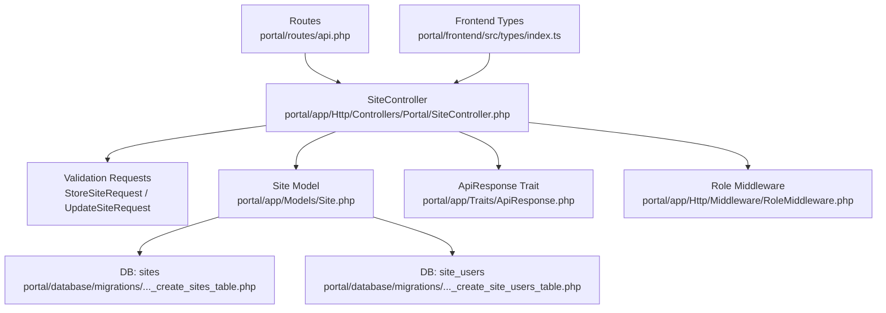
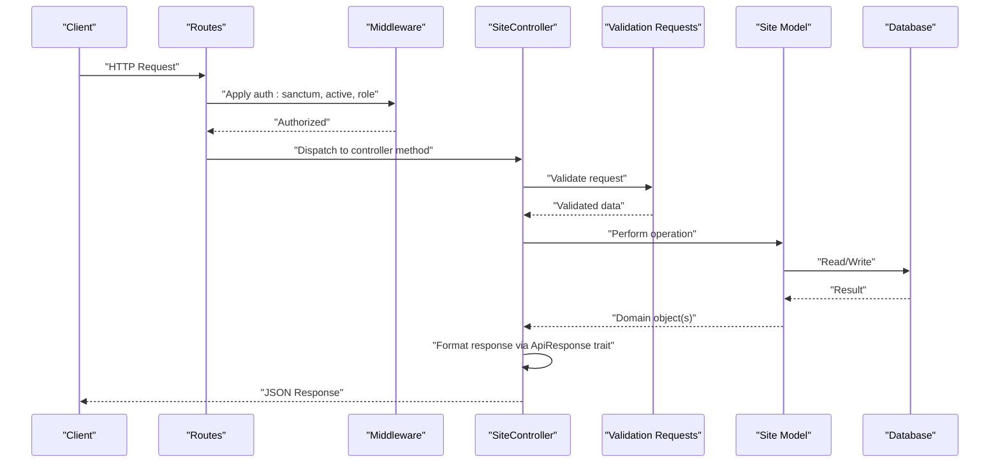
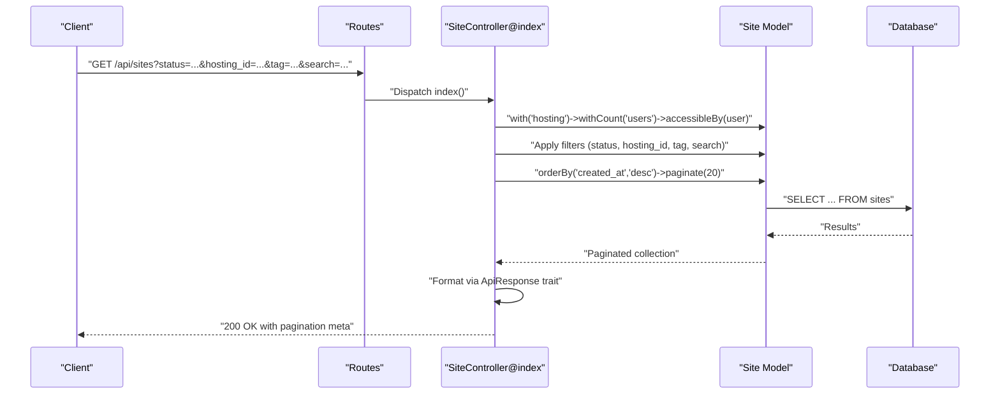
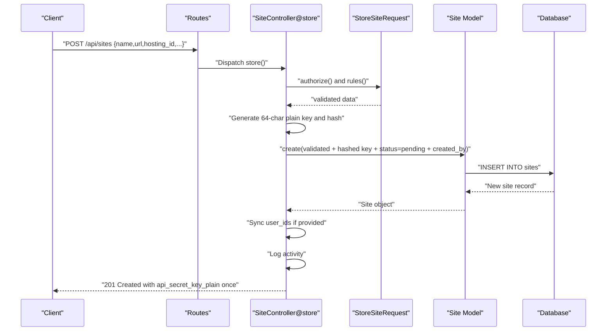
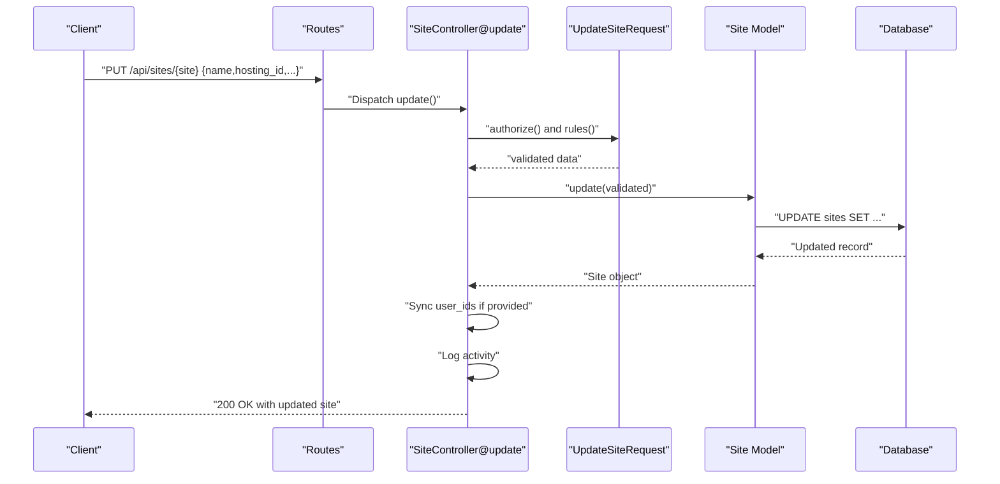
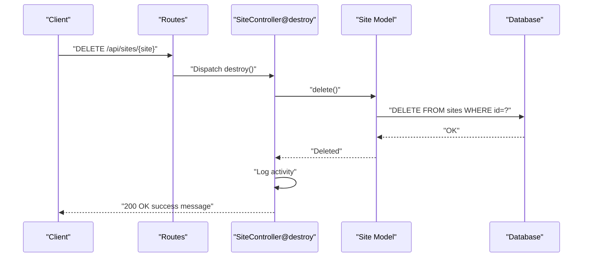
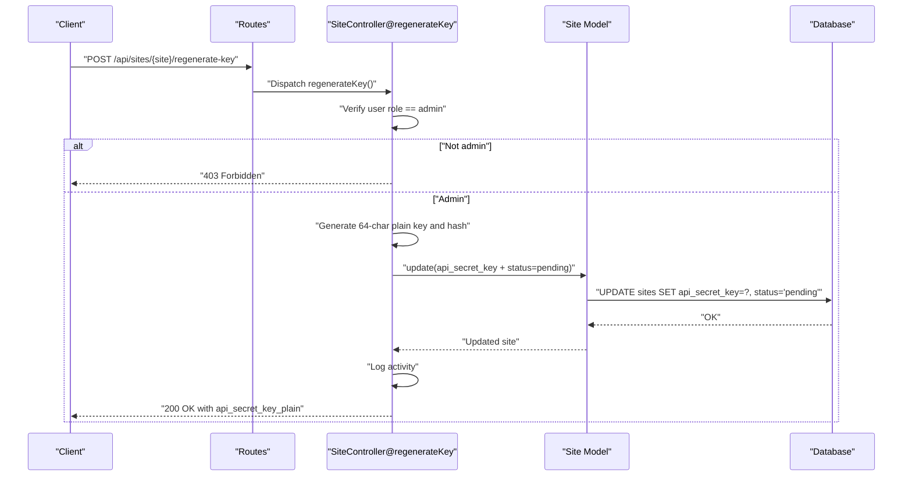
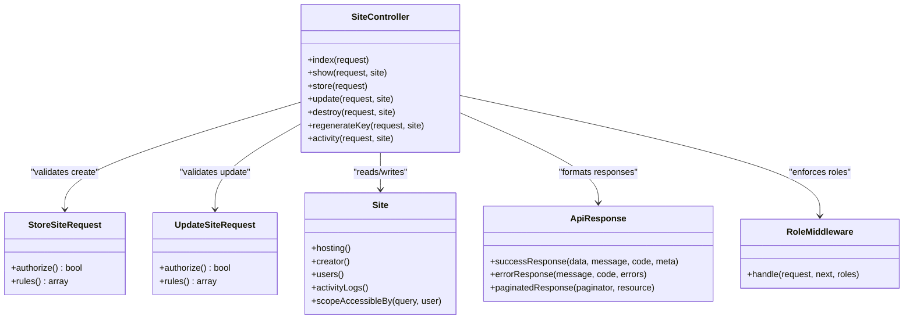

# Site Management Endpoints

<cite>
**Referenced Files in This Document**
- [api.php](file://portal/routes/api.php)
- [SiteController.php](file://portal/app/Http/Controllers/Portal/SiteController.php)
- [Site.php](file://portal/app/Models/Site.php)
- [StoreSiteRequest.php](file://portal/app/Http/Requests/Site/StoreSiteRequest.php)
- [UpdateSiteRequest.php](file://portal/app/Http/Requests/Site/UpdateSiteRequest.php)
- [RoleMiddleware.php](file://portal/app/Http/Middleware/RoleMiddleware.php)
- [ApiResponse.php](file://portal/app/Traits/ApiResponse.php)
- [create_sites_table.php](file://portal/database/migrations/2026_05_15_070002_create_sites_table.php)
- [create_site_users_table.php](file://portal/database/migrations/2026_05_15_070003_create_site_users_table.php)
- [User.php](file://portal/app/Models/User.php)
- [index.ts](file://portal/frontend/src/types/index.ts)
</cite>

## Table of Contents
1. [Introduction](#introduction)
2. [Project Structure](#project-structure)
3. [Core Components](#core-components)
4. [Architecture Overview](#architecture-overview)
5. [Detailed Component Analysis](#detailed-component-analysis)
6. [Dependency Analysis](#dependency-analysis)
7. [Performance Considerations](#performance-considerations)
8. [Troubleshooting Guide](#troubleshooting-guide)
9. [Conclusion](#conclusion)

## Introduction
This document provides comprehensive API documentation for site management endpoints in EPOS Portal. It covers all CRUD operations for sites, including listing with filtering and pagination, viewing individual sites, creating new sites, updating sites, deleting sites, and regenerating API keys. It also documents filtering capabilities, sorting options, pagination parameters, site assignment logic for different user roles, and practical examples of workflows. Error handling and access control scenarios are addressed to help developers integrate and troubleshoot effectively.

## Project Structure
The site management functionality is implemented within the Laravel backend and TypeScript frontend of the portal. The API routes are defined in the routes file and handled by the SiteController. Validation is performed via dedicated FormRequest classes. The Site model encapsulates the data structure and access control logic. Pagination and standardized responses are handled via a shared trait.

**Diagram sources**
- [api.php:1-48](file://portal/routes/api.php#L1-L48)
- [SiteController.php:14-204](file://portal/app/Http/Controllers/Portal/SiteController.php#L14-L204)
- [Site.php:12-86](file://portal/app/Models/Site.php#L12-L86)
- [StoreSiteRequest.php:7-28](file://portal/app/Http/Requests/Site/StoreSiteRequest.php#L7-L28)
- [UpdateSiteRequest.php:7-27](file://portal/app/Http/Requests/Site/UpdateSiteRequest.php#L7-L27)
- [RoleMiddleware.php:9-37](file://portal/app/Http/Middleware/RoleMiddleware.php#L9-L37)
- [ApiResponse.php:7-56](file://portal/app/Traits/ApiResponse.php#L7-L56)
- [create_sites_table.php:7-35](file://portal/database/migrations/2026_05_15_070002_create_sites_table.php#L7-L35)
- [create_site_users_table.php:7-25](file://portal/database/migrations/2026_05_15_070003_create_site_users_table.php#L7-L25)
- [index.ts:22-38](file://portal/frontend/src/types/index.ts#L22-L38)

**Section sources**
- [api.php:1-48](file://portal/routes/api.php#L1-L48)
- [SiteController.php:14-204](file://portal/app/Http/Controllers/Portal/SiteController.php#L14-L204)
- [Site.php:12-86](file://portal/app/Models/Site.php#L12-L86)
- [StoreSiteRequest.php:7-28](file://portal/app/Http/Requests/Site/StoreSiteRequest.php#L7-L28)
- [UpdateSiteRequest.php:7-27](file://portal/app/Http/Requests/Site/UpdateSiteRequest.php#L7-L27)
- [RoleMiddleware.php:9-37](file://portal/app/Http/Middleware/RoleMiddleware.php#L9-L37)
- [ApiResponse.php:7-56](file://portal/app/Traits/ApiResponse.php#L7-L56)
- [create_sites_table.php:7-35](file://portal/database/migrations/2026_05_15_070002_create_sites_table.php#L7-L35)
- [create_site_users_table.php:7-25](file://portal/database/migrations/2026_05_15_070003_create_site_users_table.php#L7-L25)
- [index.ts:22-38](file://portal/frontend/src/types/index.ts#L22-L38)

## Core Components
- API Routes: Define endpoints for listing, viewing, creating, updating, deleting, and regenerating API keys for sites. Access control is enforced via middleware for authentication, activity checks, and role-based permissions.
- SiteController: Implements all CRUD operations, applies filters and pagination, handles user assignment updates, and generates standardized JSON responses.
- Site Model: Defines fillable attributes, casts, hidden fields, relationships (hosting, users, activity logs), and an access control scope for role-based visibility.
- Validation Requests: Enforce server-side validation rules for creating and updating sites, including unique URL constraints, optional hosting associations, and user assignment constraints.
- Role Middleware: Restricts endpoints to authorized roles (admin, admin+dev).
- ApiResponse Trait: Provides consistent success/error responses and paginated response formatting.

**Section sources**
- [api.php:10-47](file://portal/routes/api.php#L10-L47)
- [SiteController.php:18-204](file://portal/app/Http/Controllers/Portal/SiteController.php#L18-L204)
- [Site.php:16-84](file://portal/app/Models/Site.php#L16-L84)
- [StoreSiteRequest.php:14-26](file://portal/app/Http/Requests/Site/StoreSiteRequest.php#L14-L26)
- [UpdateSiteRequest.php:14-25](file://portal/app/Http/Requests/Site/UpdateSiteRequest.php#L14-L25)
- [RoleMiddleware.php:15-35](file://portal/app/Http/Middleware/RoleMiddleware.php#L15-L35)
- [ApiResponse.php:9-54](file://portal/app/Traits/ApiResponse.php#L9-L54)

## Architecture Overview
The site management API follows a layered architecture:
- Routes define entry points and apply middleware for authentication and role checks.
- Controllers orchestrate requests, delegate validation, and manage model interactions.
- Models encapsulate data, relationships, and access control logic.
- Requests enforce validation rules.
- Trait standardizes response formats.

**Diagram sources**
- [api.php:10-47](file://portal/routes/api.php#L10-L47)
- [SiteController.php:23-150](file://portal/app/Http/Controllers/Portal/SiteController.php#L23-L150)
- [StoreSiteRequest.php:9-12](file://portal/app/Http/Requests/Site/StoreSiteRequest.php#L9-L12)
- [UpdateSiteRequest.php:9-12](file://portal/app/Http/Requests/Site/UpdateSiteRequest.php#L9-L12)
- [Site.php:12-86](file://portal/app/Models/Site.php#L12-L86)
- [ApiResponse.php:9-54](file://portal/app/Traits/ApiResponse.php#L9-L54)

## Detailed Component Analysis

### Endpoint Definitions and Access Control
- GET /api/sites
  - Purpose: List sites with filtering, search, and pagination.
  - Filters: status, hosting_id, tag, search (name or URL).
  - Sorting: Default order by created_at desc.
  - Pagination: 20 items per page.
  - Access: All authenticated users; non-admin users see only assigned sites.
- GET /api/sites/{site}
  - Purpose: View a single site.
  - Access: Admin or user assigned to the site.
- POST /api/sites
  - Purpose: Create a new site with a generated API key.
  - Access: Admin + Dev roles.
  - Payload supports user_ids for initial assignment.
- PUT /api/sites/{site}
  - Purpose: Update an existing site.
  - Access: Admin + Dev roles.
  - Payload supports user_ids to update assignments.
- DELETE /api/sites/{site}
  - Purpose: Delete a site.
  - Access: Admin + Dev roles.
- POST /api/sites/{site}/regenerate-key
  - Purpose: Regenerate API secret key (SHA-256 hashed).
  - Access: Admin only.
  - Returns the new plain key once.

**Section sources**
- [api.php:17-47](file://portal/routes/api.php#L17-L47)
- [SiteController.php:23-182](file://portal/app/Http/Controllers/Portal/SiteController.php#L23-L182)
- [Site.php:75-84](file://portal/app/Models/Site.php#L75-L84)

### Filtering, Sorting, and Pagination
- Filtering
  - status: Exact match on pending/connected/disconnected.
  - hosting_id: Exact match on hosting identifier.
  - tag: JSON contains match for tag values.
  - search: Case-insensitive substring match on name or URL.
- Sorting
  - Default sort: created_at descending.
- Pagination
  - Items per page: 20.
  - Response metadata includes total, per_page, current_page, last_page.

**Section sources**
- [SiteController.php:25-56](file://portal/app/Http/Controllers/Portal/SiteController.php#L25-L56)
- [ApiResponse.php:42-54](file://portal/app/Traits/ApiResponse.php#L42-L54)

### Site Data Model and Relationships
- Fillable fields include hosting_id, name, url, description, api_secret_key, status, wp_version, php_version, woo_active, last_ping_at, tags, created_by.
- Casts:
  - woo_active as boolean.
  - last_ping_at as datetime.
  - tags as array.
- Hidden fields:
  - api_secret_key (hashed value).
- Relationships:
  - hosting: belongs to hosting.
  - users: many-to-many via site_users pivot.
  - activityLogs: has many activity logs.
- Access control scope:
  - accessibleBy: admin sees all; non-admins restricted to assigned sites.

**Section sources**
- [Site.php:16-39](file://portal/app/Models/Site.php#L16-L39)
- [Site.php:41-60](file://portal/app/Models/Site.php#L41-L60)
- [Site.php:75-84](file://portal/app/Models/Site.php#L75-L84)

### Request Validation Rules
- Create (StoreSiteRequest)
  - name: required, string, max 255.
  - url: required, valid URL, max 500, unique across sites.
  - hosting_id: optional, must exist in hostings table.
  - description: optional, string.
  - tags: optional, array with each item max 50 chars.
  - user_ids: optional, array of existing user ids.
- Update (UpdateSiteRequest)
  - name: optional, string, max 255.
  - hosting_id: optional, must exist in hostings table.
  - description: optional, string.
  - tags: optional, array with each item max 50 chars.
  - user_ids: optional, array of existing user ids.

**Section sources**
- [StoreSiteRequest.php:14-26](file://portal/app/Http/Requests/Site/StoreSiteRequest.php#L14-L26)
- [UpdateSiteRequest.php:14-25](file://portal/app/Http/Requests/Site/UpdateSiteRequest.php#L14-L25)

### Role-Based Access Control
- Admin-only endpoints:
  - POST /api/sites (create)
  - PUT /api/sites/{site} (update)
  - DELETE /api/sites/{site} (delete)
  - POST /api/sites/{site}/regenerate-key (regenerate key)
- Admin + Dev endpoints:
  - Same as above.
- All authenticated users:
  - GET /api/sites (list)
  - GET /api/sites/{site} (view)
  - GET /api/sites/{site}/activity (view activity logs)

Access enforcement is implemented via:
- Route-level middleware chain: auth:sanctum, active, role.
- Controller-level checks for non-admin access to specific sites.
- RoleMiddleware validating user role against allowed roles.

**Section sources**
- [api.php:17-47](file://portal/routes/api.php#L17-L47)
- [SiteController.php:99-104](file://portal/app/Http/Controllers/Portal/SiteController.php#L99-L104)
- [SiteController.php:189-194](file://portal/app/Http/Controllers/Portal/SiteController.php#L189-L194)
- [RoleMiddleware.php:15-35](file://portal/app/Http/Middleware/RoleMiddleware.php#L15-L35)

### API Workflows

#### Listing Sites with Filtering and Pagination

**Diagram sources**
- [api.php:44](file://portal/routes/api.php#L44)
- [SiteController.php:23-56](file://portal/app/Http/Controllers/Portal/SiteController.php#L23-L56)
- [Site.php:25-27](file://portal/app/Models/Site.php#L25-L27)
- [Site.php:75-84](file://portal/app/Models/Site.php#L75-L84)
- [ApiResponse.php:42-54](file://portal/app/Traits/ApiResponse.php#L42-L54)

#### Creating a New Site

**Diagram sources**
- [api.php:32](file://portal/routes/api.php#L32)
- [SiteController.php:62-92](file://portal/app/Http/Controllers/Portal/SiteController.php#L62-L92)
- [StoreSiteRequest.php:9-12](file://portal/app/Http/Requests/Site/StoreSiteRequest.php#L9-L12)
- [Site.php:16-29](file://portal/app/Models/Site.php#L16-L29)

#### Updating a Site

**Diagram sources**
- [api.php:33](file://portal/routes/api.php#L33)
- [SiteController.php:114-133](file://portal/app/Http/Controllers/Portal/SiteController.php#L114-L133)
- [UpdateSiteRequest.php:9-12](file://portal/app/Http/Requests/Site/UpdateSiteRequest.php#L9-L12)

#### Deleting a Site

**Diagram sources**
- [api.php:34](file://portal/routes/api.php#L34)
- [SiteController.php:138-150](file://portal/app/Http/Controllers/Portal/SiteController.php#L138-L150)

#### Regenerating API Key

**Diagram sources**
- [api.php:35](file://portal/routes/api.php#L35)
- [SiteController.php:156-182](file://portal/app/Http/Controllers/Portal/SiteController.php#L156-L182)

### Practical Examples

- Create a site with hosting association and initial user assignment:
  - Request: POST /api/sites with payload including name, url, hosting_id, and user_ids.
  - Response: 201 Created with data including api_secret_key_plain (shown once).
  - Notes: The URL must be unique; hosting_id must reference an existing hosting.

- Update a site’s details:
  - Request: PUT /api/sites/{site} with optional fields like name, hosting_id, description, tags, user_ids.
  - Response: 200 OK with updated site object.

- Regenerate API key:
  - Request: POST /api/sites/{site}/regenerate-key (admin only).
  - Response: 200 OK with new api_secret_key_plain and a message indicating the site agent needs reconfiguration.

**Section sources**
- [SiteController.php:62-92](file://portal/app/Http/Controllers/Portal/SiteController.php#L62-L92)
- [SiteController.php:114-133](file://portal/app/Http/Controllers/Portal/SiteController.php#L114-L133)
- [SiteController.php:156-182](file://portal/app/Http/Controllers/Portal/SiteController.php#L156-L182)

## Dependency Analysis
The site management module exhibits clear separation of concerns:
- Routes depend on SiteController methods.
- SiteController depends on:
  - Validation requests for input sanitization.
  - Site model for persistence and access control.
  - ApiResponse trait for response formatting.
  - RoleMiddleware for authorization.
- Site model depends on:
  - Hosting and User models via relationships.
  - Database tables for storage and soft deletes.

**Diagram sources**
- [SiteController.php:14-204](file://portal/app/Http/Controllers/Portal/SiteController.php#L14-L204)
- [StoreSiteRequest.php:7-28](file://portal/app/Http/Requests/Site/StoreSiteRequest.php#L7-L28)
- [UpdateSiteRequest.php:7-27](file://portal/app/Http/Requests/Site/UpdateSiteRequest.php#L7-L27)
- [Site.php:12-86](file://portal/app/Models/Site.php#L12-L86)
- [ApiResponse.php:7-56](file://portal/app/Traits/ApiResponse.php#L7-L56)
- [RoleMiddleware.php:9-37](file://portal/app/Http/Middleware/RoleMiddleware.php#L9-L37)

**Section sources**
- [SiteController.php:14-204](file://portal/app/Http/Controllers/Portal/SiteController.php#L14-L204)
- [Site.php:12-86](file://portal/app/Models/Site.php#L12-L86)
- [StoreSiteRequest.php:7-28](file://portal/app/Http/Requests/Site/StoreSiteRequest.php#L7-L28)
- [UpdateSiteRequest.php:7-27](file://portal/app/Http/Requests/Site/UpdateSiteRequest.php#L7-L27)
- [ApiResponse.php:7-56](file://portal/app/Traits/ApiResponse.php#L7-L56)
- [RoleMiddleware.php:9-37](file://portal/app/Http/Middleware/RoleMiddleware.php#L9-L37)

## Performance Considerations
- Pagination: The default page size is 20 items. For large datasets, clients should rely on pagination meta to navigate efficiently.
- Filtering: JSON contains queries on tags and LIKE searches on name/url can be optimized with appropriate database indexes if needed.
- Eager loading: The controller loads related hosting and user counts, reducing N+1 query risks.
- Hashing: API key hashing uses SHA-256; ensure database indexing on hashed keys if extended lookups are introduced.

[No sources needed since this section provides general guidance]

## Troubleshooting Guide
Common errors and resolutions:
- Authentication/Authorization
  - 401 Unauthorized: Missing or invalid Sanctum token.
  - 403 Forbidden: Insufficient role or insufficient site assignment for view/access.
  - Resolution: Ensure proper login, active status, and correct role assignment.
- Validation Failures
  - URL uniqueness violation: The provided URL already exists.
  - Invalid hosting_id: The referenced hosting does not exist.
  - Invalid user_ids: One or more user IDs do not exist.
  - Resolution: Correct payload according to validation rules.
- Access Control Scenarios
  - Non-admin users attempting to regenerate keys: Forbidden.
  - Non-admin users viewing sites outside their assignment: Forbidden.
  - Resolution: Use admin credentials or ensure site-user assignment.

**Section sources**
- [RoleMiddleware.php:19-32](file://portal/app/Http/Middleware/RoleMiddleware.php#L19-L32)
- [SiteController.php:99-104](file://portal/app/Http/Controllers/Portal/SiteController.php#L99-L104)
- [SiteController.php:158-161](file://portal/app/Http/Controllers/Portal/SiteController.php#L158-L161)
- [SiteController.php:189-194](file://portal/app/Http/Controllers/Portal/SiteController.php#L189-L194)
- [StoreSiteRequest.php:16-26](file://portal/app/Http/Requests/Site/StoreSiteRequest.php#L16-L26)
- [UpdateSiteRequest.php:16-25](file://portal/app/Http/Requests/Site/UpdateSiteRequest.php#L16-L25)

## Conclusion
The site management endpoints in EPOS Portal provide a robust, role-aware API for managing sites with strong validation, filtering, pagination, and secure key handling. Admin users have full control over site lifecycle and key regeneration, while developer and marketing users can manage sites within their assigned scope. The documented workflows, schemas, and error handling should facilitate reliable integration and maintenance of site-related operations.