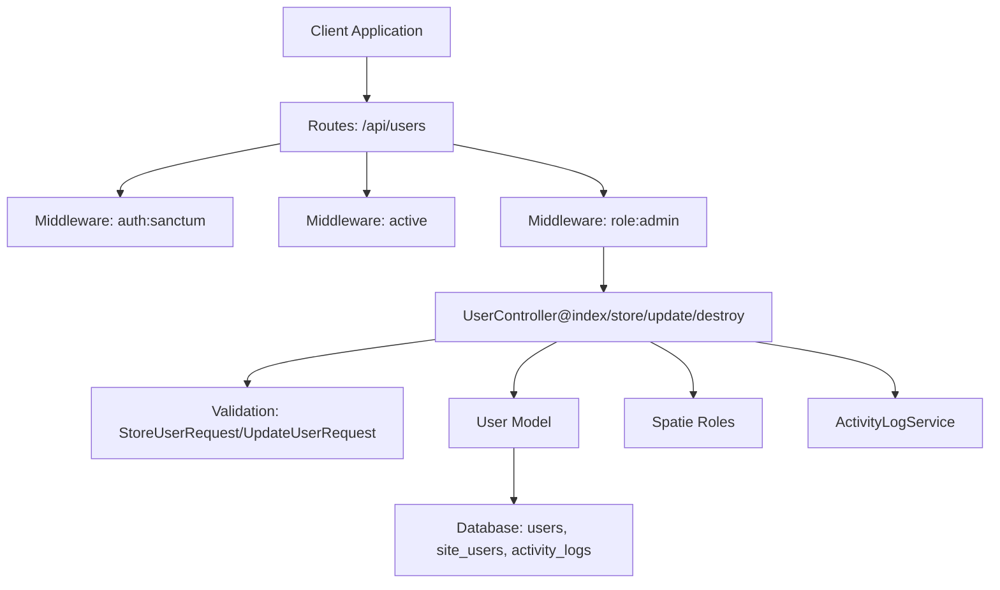
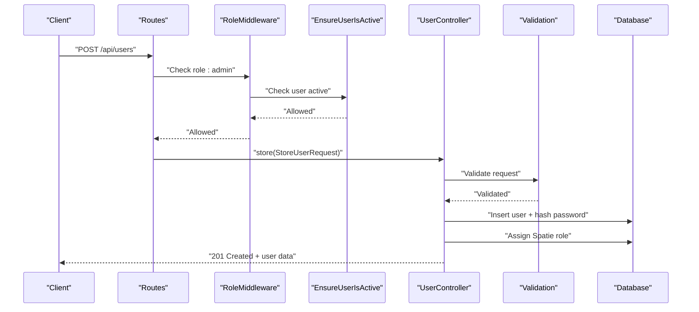
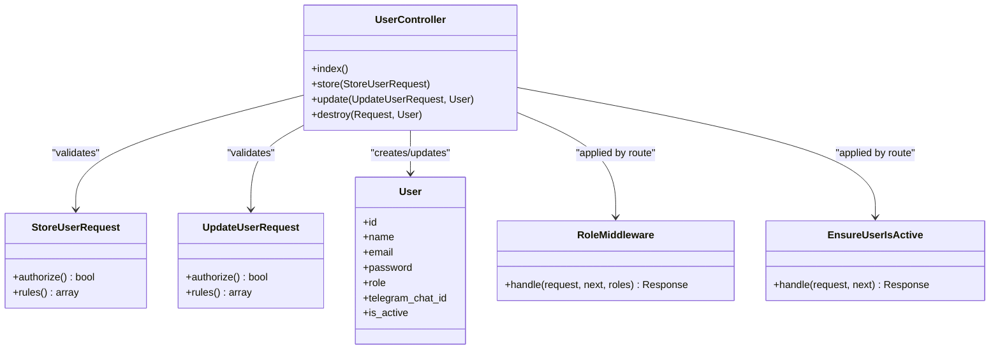

# User Management Endpoints

<cite>
**Referenced Files in This Document**
- [api.php](file://portal/routes/api.php)
- [UserController.php](file://portal/app/Http/Controllers/Portal/UserController.php)
- [User.php](file://portal/app/Models/User.php)
- [StoreUserRequest.php](file://portal/app/Http/Requests/User/StoreUserRequest.php)
- [UpdateUserRequest.php](file://portal/app/Http/Requests/User/UpdateUserRequest.php)
- [RoleMiddleware.php](file://portal/app/Http/Middleware/RoleMiddleware.php)
- [EnsureUserIsActive.php](file://portal/app/Http/Middleware/EnsureUserIsActive.php)
- [permission.php](file://portal/config/permission.php)
- [create_users_table.php](file://portal/database/migrations/0001_01_01_000000_create_users_table.php)
- [create_site_users_table.php](file://portal/database/migrations/2026_05_15_070003_create_site_users_table.php)
- [create_activity_logs_table.php](file://portal/database/migrations/2026_05_15_070004_create_activity_logs_table.php)
- [ActivityLogService.php](file://portal/app/Services/ActivityLogService.php)
- [users.ts](file://portal/frontend/src/lib/services/users.ts)
- [users page.tsx](file://portal/frontend/src/app/(dashboard)/users/page.tsx)
</cite>

## Table of Contents
1. [Introduction](#introduction)
2. [Project Structure](#project-structure)
3. [Core Components](#core-components)
4. [Architecture Overview](#architecture-overview)
5. [Detailed Component Analysis](#detailed-component-analysis)
6. [Dependency Analysis](#dependency-analysis)
7. [Performance Considerations](#performance-considerations)
8. [Troubleshooting Guide](#troubleshooting-guide)
9. [Conclusion](#conclusion)

## Introduction
This document provides comprehensive API documentation for user management endpoints in EPOS Portal. It covers the complete CRUD lifecycle for users, including listing, creating, updating, and deleting users. It also documents user data structures, validation rules, role assignment via Spatie Permissions, and the relationship between users and sites. Pagination and advanced filtering are not implemented in the backend for users; however, the frontend demonstrates client-side pagination and search patterns that can be adapted server-side. Security considerations include password hashing, user activation checks, and role-based access control enforcement.

## Project Structure
The user management functionality is implemented as follows:
- Routes define the REST endpoints under the `/api` namespace and apply authentication and role middleware.
- The UserController handles requests and delegates validation, persistence, and auditing.
- Validation is enforced via dedicated FormRequest classes.
- The User model integrates Sanctum tokens, Spatie roles, and hidden sensitive attributes.
- Spatie Permission configuration controls role/permission tables and caching.
- Migrations define the users, site_users, and activity_logs tables.
- Frontend services and pages demonstrate client-side usage patterns.

**Diagram sources**
- [api.php:24-25](file://portal/routes/api.php#L24-L25)
- [UserController.php:14-137](file://portal/app/Http/Controllers/Portal/UserController.php#L14-L137)
- [StoreUserRequest.php:14-24](file://portal/app/Http/Requests/User/StoreUserRequest.php#L14-L24)
- [UpdateUserRequest.php:15-25](file://portal/app/Http/Requests/User/UpdateUserRequest.php#L15-L25)
- [User.php:11-38](file://portal/app/Models/User.php#L11-L38)
- [permission.php:7-207](file://portal/config/permission.php#L7-L207)
- [create_users_table.php:14-25](file://portal/database/migrations/0001_01_01_000000_create_users_table.php#L14-L25)
- [create_site_users_table.php:11-17](file://portal/database/migrations/2026_05_15_070003_create_site_users_table.php#L11-L17)
- [create_activity_logs_table.php:11-24](file://portal/database/migrations/2026_05_15_070004_create_activity_logs_table.php#L11-L24)
- [ActivityLogService.php:16-48](file://portal/app/Services/ActivityLogService.php#L16-L48)

**Section sources**
- [api.php:24-25](file://portal/routes/api.php#L24-L25)
- [UserController.php:14-137](file://portal/app/Http/Controllers/Portal/UserController.php#L14-L137)
- [User.php:11-38](file://portal/app/Models/User.php#L11-L38)

## Core Components
- Routes: The users resource route is defined under the admin-only role middleware group. It exposes index, store, update, and destroy actions.
- Controller: Implements index (list), store (create), update (modify), and destroy (delete) with validation, hashing, role synchronization, and activity logging.
- Model: Defines fillable attributes, hidden fields, casting, and integrates Sanctum and Spatie roles.
- Validation: StoreUserRequest enforces required fields and uniqueness; UpdateUserRequest allows partial updates with unique email exclusion.
- Middleware: RoleMiddleware restricts endpoints to admin; EnsureUserIsActive blocks inactive users.
- Permissions: Spatie configuration defines models, tables, and caching; roles are enums in the database.

**Section sources**
- [api.php:24-25](file://portal/routes/api.php#L24-L25)
- [UserController.php:18-137](file://portal/app/Http/Controllers/Portal/UserController.php#L18-L137)
- [User.php:15-36](file://portal/app/Models/User.php#L15-L36)
- [StoreUserRequest.php:14-24](file://portal/app/Http/Requests/User/StoreUserRequest.php#L14-L24)
- [UpdateUserRequest.php:15-25](file://portal/app/Http/Requests/User/UpdateUserRequest.php#L15-L25)
- [RoleMiddleware.php:15-35](file://portal/app/Http/Middleware/RoleMiddleware.php#L15-L35)
- [EnsureUserIsActive.php:11-24](file://portal/app/Http/Middleware/EnsureUserIsActive.php#L11-L24)
- [permission.php:7-207](file://portal/config/permission.php#L7-L207)

## Architecture Overview
The user management flow integrates routing, middleware, controller, validation, persistence, and auditing.

**Diagram sources**
- [api.php:24-25](file://portal/routes/api.php#L24-L25)
- [RoleMiddleware.php:15-35](file://portal/app/Http/Middleware/RoleMiddleware.php#L15-L35)
- [EnsureUserIsActive.php:11-24](file://portal/app/Http/Middleware/EnsureUserIsActive.php#L11-L24)
- [UserController.php:33-65](file://portal/app/Http/Controllers/Portal/UserController.php#L33-L65)
- [StoreUserRequest.php:14-24](file://portal/app/Http/Requests/User/StoreUserRequest.php#L14-L24)
- [create_users_table.php:14-25](file://portal/database/migrations/0001_01_01_000000_create_users_table.php#L14-L25)

## Detailed Component Analysis

### API Endpoints

- List users
  - Method: GET
  - Path: /api/users
  - Authentication: Required (Sanctum)
  - Authorization: Admin role
  - Response: Array of users with selected fields ordered by creation date descending
  - Notes: Pagination and server-side filtering are not implemented; frontend demonstrates client-side pagination and search.

- Create user
  - Method: POST
  - Path: /api/users
  - Authentication: Required (Sanctum)
  - Authorization: Admin role
  - Request body fields:
    - name (required, string)
    - email (required, unique, email)
    - password (required, min length)
    - role (required, enum: admin, dev, mkt)
    - is_active (optional, boolean, default true)
    - telegram_chat_id (optional, string)
  - Response: 201 Created with created user details
  - Behavior: Password is hashed; Spatie role is assigned; activity logged

- Update user
  - Method: PUT
  - Path: /api/users/{user}
  - Authentication: Required (Sanctum)
  - Authorization: Admin role
  - Request body fields:
    - name (optional)
    - email (optional, unique excluding current user)
    - password (optional, min length if provided)
    - role (optional, enum: admin, dev, mkt)
    - is_active (optional)
    - telegram_chat_id (optional)
  - Behavior: Partial updates; password updated only if provided; role synchronized via Spatie; activity logged

- Delete user
  - Method: DELETE
  - Path: /api/users/{user}
  - Authentication: Required (Sanctum)
  - Authorization: Admin role
  - Constraints: Admin cannot delete their own account
  - Response: Success message upon deletion
  - Behavior: Activity logged with metadata including deleted user email

**Section sources**
- [api.php:24-25](file://portal/routes/api.php#L24-L25)
- [UserController.php:21-137](file://portal/app/Http/Controllers/Portal/UserController.php#L21-L137)
- [StoreUserRequest.php:14-24](file://portal/app/Http/Requests/User/StoreUserRequest.php#L14-L24)
- [UpdateUserRequest.php:15-25](file://portal/app/Http/Requests/User/UpdateUserRequest.php#L15-L25)

### Data Model and Validation

- User model attributes
  - Fillable: name, email, password, role, telegram_chat_id, is_active
  - Hidden: password, remember_token
  - Casts: email_verified_at (datetime), password (hashed), is_active (boolean)
  - Enum role: admin, dev, mkt

- Validation rules summary
  - Creation: name required, email unique, password required minimum length, role required enum
  - Update: optional fields with unique email exclusion for the target user; password minimum length if present

- Role assignment
  - Admin creates user with a role; Spatie role is assigned
  - Updating role synchronizes Spatie role; old role removed and new role applied

- Site assignment relationship
  - Users can be assigned to sites via the site_users pivot table
  - The relationship is defined by foreign keys to users and sites with cascade delete and uniqueness constraint

**Section sources**
- [User.php:15-36](file://portal/app/Models/User.php#L15-L36)
- [create_users_table.php:14-25](file://portal/database/migrations/0001_01_01_000000_create_users_table.php#L14-L25)
- [create_site_users_table.php:11-17](file://portal/database/migrations/2026_05_15_070003_create_site_users_table.php#L11-L17)
- [StoreUserRequest.php:14-24](file://portal/app/Http/Requests/User/StoreUserRequest.php#L14-L24)
- [UpdateUserRequest.php:15-25](file://portal/app/Http/Requests/User/UpdateUserRequest.php#L15-L25)

### Security and Access Control

- Authentication
  - Endpoints require Sanctum tokens
  - Active user requirement prevents access for deactivated accounts

- Authorization
  - Admin-only endpoints enforced via role middleware
  - Self-deletion blocked to prevent accidental lockout

- Password handling
  - Passwords are hashed during creation and update when provided
  - Minimum length enforced by validation rules

- Audit logging
  - Activity logs record user creation, updates, role changes, and deletions
  - Metadata includes actor, IP address, and relevant details

**Section sources**
- [api.php:13-30](file://portal/routes/api.php#L13-L30)
- [RoleMiddleware.php:15-35](file://portal/app/Http/Middleware/RoleMiddleware.php#L15-L35)
- [EnsureUserIsActive.php:11-24](file://portal/app/Http/Middleware/EnsureUserIsActive.php#L11-L24)
- [UserController.php:38-45](file://portal/app/Http/Controllers/Portal/UserController.php#L38-L45)
- [UserController.php:83-93](file://portal/app/Http/Controllers/Portal/UserController.php#L83-L93)
- [ActivityLogService.php:16-48](file://portal/app/Services/ActivityLogService.php#L16-L48)
- [create_activity_logs_table.php:11-24](file://portal/database/migrations/2026_05_15_070004_create_activity_logs_table.php#L11-L24)

### Practical Examples

- Create a user with role assignment
  - Endpoint: POST /api/users
  - Payload: name, email, password, role
  - Outcome: User created with assigned role; activity logged

- Update a user (including changing role)
  - Endpoint: PUT /api/users/{user}
  - Payload: role (and/or other fields)
  - Outcome: Role synchronized; activity logged with old/new role

- Deactivate a user
  - Endpoint: PUT /api/users/{user} with is_active false
  - Outcome: User updated; activity logged

- Bulk operations
  - Not implemented server-side; clients can loop over multiple requests or implement batch endpoints as needed

- User profile management
  - Profile updates (non-admin) are handled by auth endpoints; user management endpoints focus on administrative CRUD

**Section sources**
- [users.ts:4-8](file://portal/frontend/src/lib/services/users.ts#L4-L8)
- [users page.tsx:92-121](file://portal/frontend/src/app/(dashboard)/users/page.tsx#L92-L121)
- [users page.tsx:123-136](file://portal/frontend/src/app/(dashboard)/users/page.tsx#L123-L136)

### Error Handling

Common error scenarios and responses:
- Duplicate email on create or update
  - Validation failure returns field-specific errors
- Invalid role value
  - Validation failure returns field-specific errors
- Permission violation (non-admin)
  - 403 Forbidden with descriptive message
- Unauthenticated access
  - 401 Unauthorized with descriptive message
- Attempt to delete self
  - 400 Bad Request with descriptive message
- Inactive user attempts access
  - 403 Forbidden after token revocation

**Section sources**
- [StoreUserRequest.php:18-20](file://portal/app/Http/Requests/User/StoreUserRequest.php#L18-L20)
- [UpdateUserRequest.php:19-21](file://portal/app/Http/Requests/User/UpdateUserRequest.php#L19-L21)
- [RoleMiddleware.php:19-32](file://portal/app/Http/Middleware/RoleMiddleware.php#L19-L32)
- [UserController.php:120-122](file://portal/app/Http/Controllers/Portal/UserController.php#L120-L122)
- [EnsureUserIsActive.php:13-21](file://portal/app/Http/Middleware/EnsureUserIsActive.php#L13-L21)

## Dependency Analysis

**Diagram sources**
- [UserController.php:14-137](file://portal/app/Http/Controllers/Portal/UserController.php#L14-L137)
- [StoreUserRequest.php:7-25](file://portal/app/Http/Requests/User/StoreUserRequest.php#L7-L25)
- [UpdateUserRequest.php:8-26](file://portal/app/Http/Requests/User/UpdateUserRequest.php#L8-L26)
- [User.php:11-38](file://portal/app/Models/User.php#L11-L38)
- [RoleMiddleware.php:9-37](file://portal/app/Http/Middleware/RoleMiddleware.php#L9-L37)
- [EnsureUserIsActive.php:9-26](file://portal/app/Http/Middleware/EnsureUserIsActive.php#L9-L26)

**Section sources**
- [UserController.php:14-137](file://portal/app/Http/Controllers/Portal/UserController.php#L14-L137)
- [StoreUserRequest.php:7-25](file://portal/app/Http/Requests/User/StoreUserRequest.php#L7-L25)
- [UpdateUserRequest.php:8-26](file://portal/app/Http/Requests/User/UpdateUserRequest.php#L8-L26)
- [User.php:11-38](file://portal/app/Models/User.php#L11-L38)
- [RoleMiddleware.php:9-37](file://portal/app/Http/Middleware/RoleMiddleware.php#L9-L37)
- [EnsureUserIsActive.php:9-26](file://portal/app/Http/Middleware/EnsureUserIsActive.php#L9-L26)

## Performance Considerations
- Current implementation selects only essential fields and orders by creation date; consider adding indexes on frequently filtered/sorted columns if extending to server-side filtering/pagination.
- Role synchronization occurs on role changes; avoid unnecessary role updates to minimize overhead.
- Activity logging writes to database when enabled; ensure appropriate indexing on activity_logs for audit queries.

[No sources needed since this section provides general guidance]

## Troubleshooting Guide
- Validation failures
  - Verify required fields and constraints match request payload
- Role mismatch
  - Confirm caller has admin role; check middleware application
- Self-deletion errors
  - Ensure the authenticated user is not the target of deletion
- Inactive user blocked
  - Confirm user is_active flag; tokens are revoked for deactivated users
- Role not updating
  - Ensure role value is included in update payload and differs from existing role

**Section sources**
- [StoreUserRequest.php:14-24](file://portal/app/Http/Requests/User/StoreUserRequest.php#L14-L24)
- [UpdateUserRequest.php:15-25](file://portal/app/Http/Requests/User/UpdateUserRequest.php#L15-L25)
- [RoleMiddleware.php:15-35](file://portal/app/Http/Middleware/RoleMiddleware.php#L15-L35)
- [UserController.php:120-122](file://portal/app/Http/Controllers/Portal/UserController.php#L120-L122)
- [EnsureUserIsActive.php:11-24](file://portal/app/Http/Middleware/EnsureUserIsActive.php#L11-L24)

## Conclusion
EPOS Portal’s user management endpoints provide a secure, role-based CRUD interface for administrators. They enforce strong validation, handle password hashing, synchronize roles via Spatie Permissions, and maintain audit trails. While server-side pagination and advanced filtering are not implemented for users, the frontend demonstrates client-side patterns that can guide future enhancements. Administrators can manage users, assign roles, and control activation status while maintaining compliance with security and access control policies.