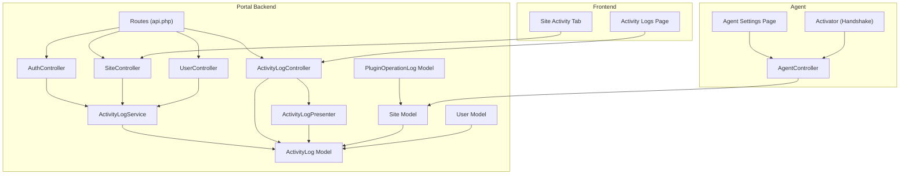
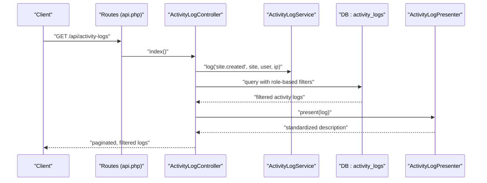
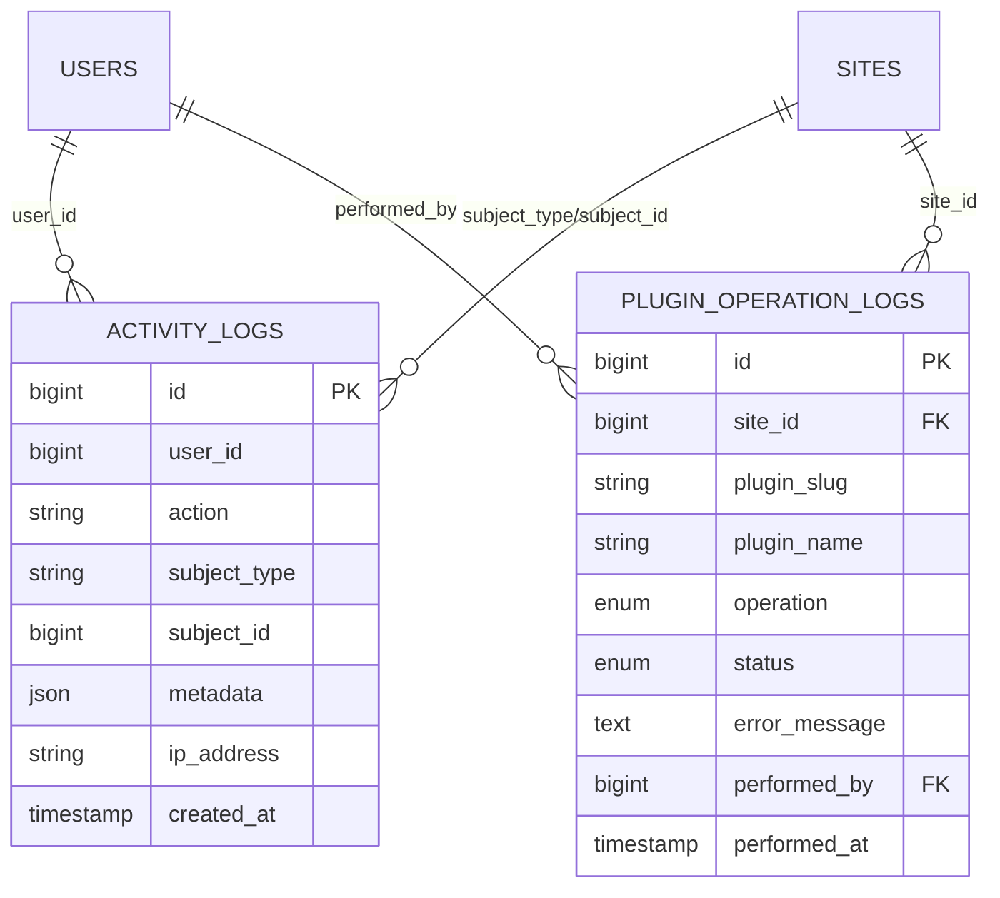
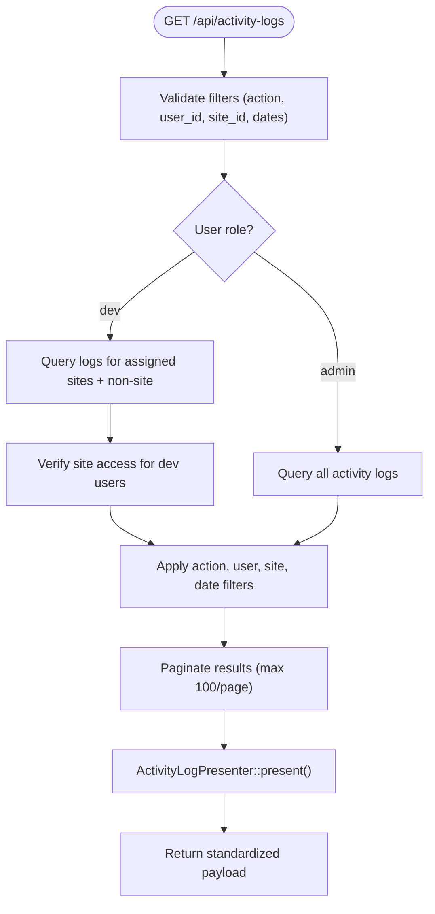
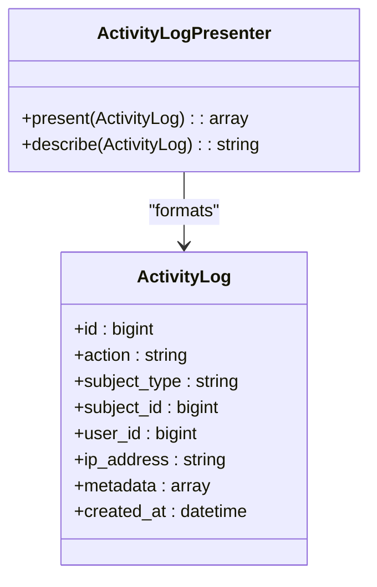
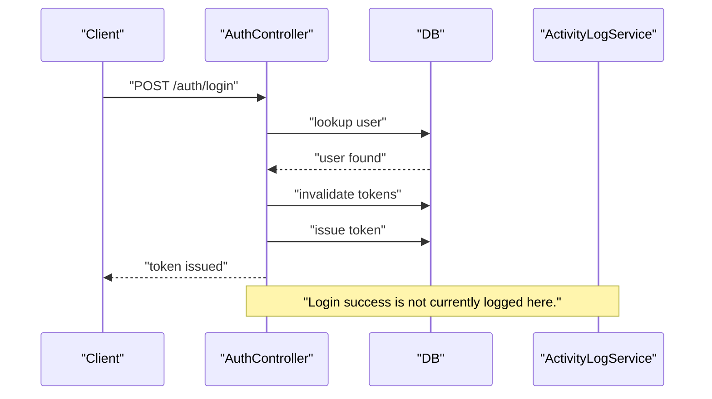
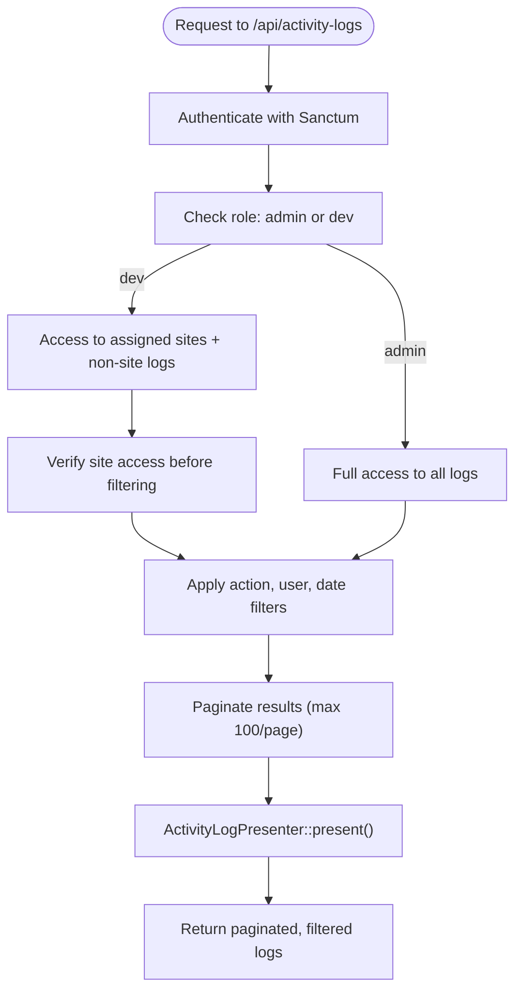
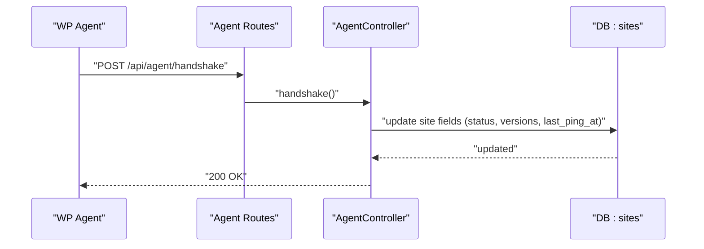
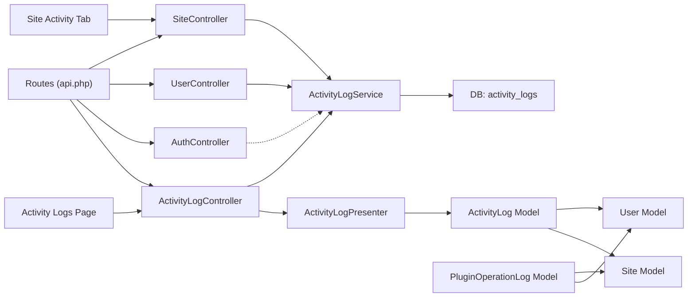

# Activity Logging & Auditing

<cite>
**Referenced Files in This Document**
- [ActivityLog.php](file://portal/app/Models/ActivityLog.php)
- [ActivityLogService.php](file://portal/app/Services/ActivityLogService.php)
- [ActivityLogController.php](file://portal/app/Http/Controllers/Portal/ActivityLogController.php)
- [ActivityLogPresenter.php](file://portal/app/Services/ActivityLogPresenter.php)
- [PluginOperationLog.php](file://portal/app/Models/PluginOperationLog.php)
- [create_activity_logs_table.php](file://portal/database/migrations/2026_05_15_070004_create_activity_logs_table.php)
- [phase6_external_plugin_management.php](file://portal/database/migrations/2026_05_19_000001_phase6_external_plugin_management.php)
- [Site.php](file://portal/app/Models/Site.php)
- [User.php](file://portal/app/Models/User.php)
- [SiteController.php](file://portal/app/Http/Controllers/Portal/SiteController.php)
- [UserController.php](file://portal/app/Http/Controllers/Portal/UserController.php)
- [AuthController.php](file://portal/app/Http/Controllers/Auth/AuthController.php)
- [api.php](file://portal/routes/api.php)
- [database.php](file://portal/config/database.php)
- [logging.php](file://portal/config/logging.php)
- [AgentController.php](file://portal/app/Http/Controllers/Agent/AgentController.php)
- [settings-page.php](file://agent/epos-wp-agent/admin/settings-page.php)
- [class-activator.php](file://agent/epos-wp-agent/includes/class-activator.php)
- [page.tsx](file://portal/frontend/src/app/(dashboard)/activity-logs/page.tsx)
- [site-activity-tab.tsx](file://portal/frontend/src/components/sites/site-activity-tab.tsx)
</cite>

## Update Summary
**Changes Made**
- Added new centralized ActivityLogController providing role-based filtering with administrator and developer access restrictions
- Enhanced ActivityLogPresenter service with standardized activity descriptions and frontend payload formatting
- Added PluginOperationLog model for plugin-specific operations (awaiting integration)
- Improved access control system with enhanced role-based filtering for different user roles
- Updated frontend components to utilize the new centralized activity logging system
- Enhanced activity description standardization and presentation formatting

## Table of Contents
1. [Introduction](#introduction)
2. [Project Structure](#project-structure)
3. [Core Components](#core-components)
4. [Architecture Overview](#architecture-overview)
5. [Detailed Component Analysis](#detailed-component-analysis)
6. [Dependency Analysis](#dependency-analysis)
7. [Performance Considerations](#performance-considerations)
8. [Troubleshooting Guide](#troubleshooting-guide)
9. [Conclusion](#conclusion)
10. [Appendices](#appendices)

## Introduction
This document describes the enhanced activity logging and auditing system implemented in the portal. The system now features a centralized activity feed with sophisticated role-based access controls, standardized activity descriptions, and improved access restrictions for different user roles. It explains how user actions and system events are captured, stored, and queried, and how the system supports compliance reporting, data retention, and operational monitoring. The enhanced system provides both centralized global activity feeds accessible to administrators and developers, as well as per-site activity feeds for site-specific monitoring.

## Project Structure
The audit trail is implemented using a dedicated controller and presenter service, with database-backed persistence and controller-level triggers for key events. The new ActivityLogController provides centralized access to all activity logs with role-based filtering, while the ActivityLogPresenter ensures consistent formatting across the frontend. Routes define access patterns and roles that govern who can view activity logs globally versus per-site. The agent integration records site-level metadata and connectivity status, which complements the audit trail. A new PluginOperationLog model provides structured logging for plugin-specific operations.

**Diagram sources**
- [ActivityLogService.php:11-49](file://portal/app/Services/ActivityLogService.php#L11-L49)
- [ActivityLogController.php:25-150](file://portal/app/Http/Controllers/Portal/ActivityLogController.php#L25-L150)
- [ActivityLogPresenter.php:16-75](file://portal/app/Services/ActivityLogPresenter.php#L16-L75)
- [ActivityLog.php:9-36](file://portal/app/Models/ActivityLog.php#L9-L36)
- [PluginOperationLog.php:7-30](file://portal/app/Models/PluginOperationLog.php#L7-L30)
- [SiteController.php:14-316](file://portal/app/Http/Controllers/Portal/SiteController.php#L14-L316)
- [UserController.php:14-137](file://portal/app/Http/Controllers/Portal/UserController.php#L14-L137)
- [AuthController.php:11-135](file://portal/app/Http/Controllers/Auth/AuthController.php#L11-L135)
- [api.php:131-135](file://portal/routes/api.php#L131-L135)
- [Site.php:12-76](file://portal/app/Models/Site.php#L12-L76)
- [User.php:11-38](file://portal/app/Models/User.php#L11-L38)
- [AgentController.php:10-37](file://portal/app/Http/Controllers/Agent/AgentController.php#L10-L37)
- [settings-page.php:67-117](file://agent/epos-wp-agent/admin/settings-page.php#L67-L117)
- [class-activator.php:46-88](file://agent/epos-wp-agent/includes/class-activator.php#L46-L88)
- [page.tsx:61-263](file://portal/frontend/src/app/(dashboard)/activity-logs/page.tsx#L61-L263)
- [site-activity-tab.tsx:31-174](file://portal/frontend/src/components/sites/site-activity-tab.tsx#L31-L174)

**Section sources**
- [ActivityLog.php:9-36](file://portal/app/Models/ActivityLog.php#L9-L36)
- [ActivityLogService.php:11-49](file://portal/app/Services/ActivityLogService.php#L11-L49)
- [ActivityLogController.php:25-150](file://portal/app/Http/Controllers/Portal/ActivityLogController.php#L25-L150)
- [ActivityLogPresenter.php:16-75](file://portal/app/Services/ActivityLogPresenter.php#L16-L75)
- [PluginOperationLog.php:7-30](file://portal/app/Models/PluginOperationLog.php#L7-L30)
- [create_activity_logs_table.php:7-31](file://portal/database/migrations/2026_05_15_070004_create_activity_logs_table.php#L7-L31)
- [phase6_external_plugin_management.php:103-117](file://portal/database/migrations/2026_05_19_000001_phase6_external_plugin_management.php#L103-L117)
- [SiteController.php:14-316](file://portal/app/Http/Controllers/Portal/SiteController.php#L14-L316)
- [UserController.php:14-137](file://portal/app/Http/Controllers/Portal/UserController.php#L14-L137)
- [AuthController.php:11-135](file://portal/app/Http/Controllers/Auth/AuthController.php#L11-L135)
- [api.php:131-135](file://portal/routes/api.php#L131-L135)
- [Site.php:12-76](file://portal/app/Models/Site.php#L12-L76)
- [User.php:11-38](file://portal/app/Models/User.php#L11-L38)
- [AgentController.php:10-37](file://portal/app/Http/Controllers/Agent/AgentController.php#L10-L37)
- [settings-page.php:67-117](file://agent/epos-wp-agent/admin/settings-page.php#L67-L117)
- [class-activator.php:46-88](file://agent/epos-wp-agent/includes/class-activator.php#L46-L88)
- [page.tsx:61-263](file://portal/frontend/src/app/(dashboard)/activity-logs/page.tsx#L61-L263)
- [site-activity-tab.tsx:31-174](file://portal/frontend/src/components/sites/site-activity-tab.tsx#L31-L174)

## Core Components
- **ActivityLog model**: Represents a single audit record with action, optional subject linkage, user, IP address, metadata, and timestamp.
- **ActivityLogService**: Centralized logging utility that writes to the database when available or falls back to application logs.
- **ActivityLogController**: New centralized controller providing global activity feeds with role-based access restrictions and advanced filtering capabilities.
- **ActivityLogPresenter**: Service that transforms ActivityLog instances into standardized frontend-friendly payloads with human-readable descriptions.
- **PluginOperationLog model**: New model for structured logging of plugin-specific operations including activation, deactivation, and error tracking.
- **Site and User models**: Provide relationships to activity logs and support role-based access for viewing logs.
- **Enhanced Controllers**: Trigger logging for key lifecycle events with improved access control and role-based restrictions.
- **Routes**: Define access control and expose endpoints for both centralized activity retrieval and per-site activity feeds.

**Updated** Enhanced with new centralized ActivityLogController, ActivityLogPresenter service, and PluginOperationLog model for improved access control, standardized presentation, and plugin-specific logging capabilities.

**Section sources**
- [ActivityLog.php:9-36](file://portal/app/Models/ActivityLog.php#L9-L36)
- [ActivityLogService.php:11-49](file://portal/app/Services/ActivityLogService.php#L11-L49)
- [ActivityLogController.php:25-150](file://portal/app/Http/Controllers/Portal/ActivityLogController.php#L25-L150)
- [ActivityLogPresenter.php:16-75](file://portal/app/Services/ActivityLogPresenter.php#L16-L75)
- [PluginOperationLog.php:7-30](file://portal/app/Models/PluginOperationLog.php#L7-L30)
- [Site.php:56-60](file://portal/app/Models/Site.php#L56-L60)
- [User.php:11-38](file://portal/app/Models/User.php#L11-L38)
- [SiteController.php:235-247](file://portal/app/Http/Controllers/Portal/SiteController.php#L235-L247)
- [api.php:131-135](file://portal/routes/api.php#L131-L135)

## Architecture Overview
The enhanced audit system follows a layered pattern with centralized access control:
- Controllers detect meaningful events and invoke the ActivityLogService.
- ActivityLogService persists records to the activity_logs table when available; otherwise, it logs to the application log channel.
- ActivityLogController provides centralized access with role-based filtering for administrators and developers.
- ActivityLogPresenter standardizes activity descriptions for consistent frontend presentation.
- Models define relationships enabling queries by subject, action, and user.
- Routes enforce role-based access to sensitive operations and activity endpoints.
- PluginOperationLog model provides structured logging for plugin-specific operations awaiting integration.

**Diagram sources**
- [api.php:131-135](file://portal/routes/api.php#L131-L135)
- [ActivityLogController.php:29-107](file://portal/app/Http/Controllers/Portal/ActivityLogController.php#L29-L107)
- [ActivityLogService.php:16-48](file://portal/app/Services/ActivityLogService.php#L16-L48)
- [ActivityLogPresenter.php:23-37](file://portal/app/Services/ActivityLogPresenter.php#L23-L37)

## Detailed Component Analysis

### Enhanced Audit Data Model and Persistence
- Fields include action, optional subject linkage (polymorphic), user, IP, metadata JSON, and created timestamp.
- Indexes on subject_type+subject_id, action, and user_id optimize common queries.
- When the activity_logs table does not exist, logging falls back to application logs.
- Enhanced with centralized querying through ActivityLogController for role-based access control.
- PluginOperationLog model provides structured logging for plugin-specific operations with foreign key relationships to Site and User models.

**Diagram sources**
- [create_activity_logs_table.php:11-24](file://portal/database/migrations/2026_05_15_070004_create_activity_logs_table.php#L11-L24)
- [ActivityLog.php:13-25](file://portal/app/Models/ActivityLog.php#L13-L25)
- [PluginOperationLog.php:11-18](file://portal/app/Models/PluginOperationLog.php#L11-L18)
- [Site.php:56-60](file://portal/app/Models/Site.php#L56-L60)

**Section sources**
- [ActivityLog.php:9-36](file://portal/app/Models/ActivityLog.php#L9-L36)
- [PluginOperationLog.php:7-30](file://portal/app/Models/PluginOperationLog.php#L7-L30)
- [create_activity_logs_table.php:7-31](file://portal/database/migrations/2026_05_15_070004_create_activity_logs_table.php#L7-L31)
- [phase6_external_plugin_management.php:103-117](file://portal/database/migrations/2026_05_19_000001_phase6_external_plugin_management.php#L103-L117)
- [ActivityLogService.php:34-47](file://portal/app/Services/ActivityLogService.php#L34-L47)

### Centralized Activity Feed with Role-Based Access Control
- **ActivityLogController**: New centralized controller providing global activity feeds accessible to administrators and developers.
- **Role-based filtering**: Administrators see all activity logs; developers see logs for their assigned sites plus non-site activities.
- **Advanced filtering**: Supports action, user, site, date range, and pagination filters.
- **Filter options endpoint**: Provides distinct action keys and users for filter dropdowns.
- **Standardized presentation**: Uses ActivityLogPresenter for consistent frontend formatting.
- **Enhanced security**: Prevents developers from accessing sites they don't have permissions for when filtering.

**Diagram sources**
- [ActivityLogController.php:29-107](file://portal/app/Http/Controllers/Portal/ActivityLogController.php#L29-L107)
- [ActivityLogController.php:113-148](file://portal/app/Http/Controllers/Portal/ActivityLogController.php#L113-L148)
- [ActivityLogPresenter.php:23-37](file://portal/app/Services/ActivityLogPresenter.php#L23-L37)

**Section sources**
- [ActivityLogController.php:25-150](file://portal/app/Http/Controllers/Portal/ActivityLogController.php#L25-L150)
- [ActivityLogPresenter.php:16-75](file://portal/app/Services/ActivityLogPresenter.php#L16-L75)
- [api.php:131-135](file://portal/routes/api.php#L131-L135)

### Standardized Activity Description Presentation
- **ActivityLogPresenter**: Service that converts ActivityLog instances into frontend-friendly payloads.
- **Human-readable descriptions**: Centralized mapping of action keys to descriptive text including site, user, plugin, and deployment actions.
- **Consistent formatting**: Ensures identical output between dashboard widgets and activity logs page.
- **Metadata handling**: Preserves original metadata while adding standardized fields.
- **Comprehensive action coverage**: Handles site lifecycle, user management, plugin operations, hosting management, and deployment actions.

**Diagram sources**
- [ActivityLogPresenter.php:16-75](file://portal/app/Services/ActivityLogPresenter.php#L16-L75)
- [ActivityLog.php:9-36](file://portal/app/Models/ActivityLog.php#L9-L36)

**Section sources**
- [ActivityLogPresenter.php:16-75](file://portal/app/Services/ActivityLogPresenter.php#L16-L75)
- [ActivityLog.php:9-36](file://portal/app/Models/ActivityLog.php#L9-L36)

### Enhanced Event Tracking Mechanisms
- **Site lifecycle**: Creation, update, deletion, restoration, connection status changes, API key regeneration, and manual sync trigger.
- **User lifecycle**: Creation, update, role changes, and deletion.
- **Plugin lifecycle**: Creation, updates, version uploads, and deployment actions.
- **Hosting lifecycle**: Creation, update, and deletion.
- **Authentication**: Login endpoint validates credentials and issues tokens; while login attempts are not logged here, failed attempts can be instrumented at middleware or framework level.
- **Enhanced access control**: Role-based restrictions on sensitive operations like API key regeneration.
- **Plugin operations**: Activation, deactivation, and error tracking through PluginOperationLog model (awaiting integration).

**Diagram sources**
- [AuthController.php:18-56](file://portal/app/Http/Controllers/Auth/AuthController.php#L18-L56)

**Section sources**
- [SiteController.php:80-85](file://portal/app/Http/Controllers/Portal/SiteController.php#L80-L85)
- [SiteController.php:123-128](file://portal/app/Http/Controllers/Portal/SiteController.php#L123-L128)
- [SiteController.php:142-147](file://portal/app/Http/Controllers/Portal/SiteController.php#L142-L147)
- [SiteController.php:171-176](file://portal/app/Http/Controllers/Portal/SiteController.php#L171-L176)
- [SiteController.php:196-201](file://portal/app/Http/Controllers/Portal/SiteController.php#L196-L201)
- [SiteController.php:222-227](file://portal/app/Http/Controllers/Portal/SiteController.php#L222-L227)
- [SiteController.php:305](file://portal/app/Http/Controllers/Portal/SiteController.php#L305)
- [UserController.php:47-53](file://portal/app/Http/Controllers/Portal/UserController.php#L47-L53)
- [UserController.php:86-92](file://portal/app/Http/Controllers/Portal/UserController.php#L86-L92)
- [UserController.php:95-100](file://portal/app/Http/Controllers/Portal/UserController.php#L95-L100)
- [UserController.php:124-130](file://portal/app/Http/Controllers/Portal/UserController.php#L124-L130)
- [AuthController.php:18-56](file://portal/app/Http/Controllers/Auth/AuthController.php#L18-L56)

### Enhanced Compliance Reporting and Access Controls
- **Centralized endpoints**: `/api/activity-logs` and `/api/activity-logs/filter-options` provide global access to activity data.
- **Role-based access**: Administrators see all logs; developers see logs for assigned sites plus non-site activities.
- **Site-specific access**: Developers cannot filter by sites they don't have access to.
- **Enhanced filtering**: Action, user, site, and date range filters with pagination support.
- **Frontend integration**: Activity logs page uses centralized API with filter dropdowns populated from server-side options.
- **Access validation**: Server-side verification prevents unauthorized site filtering for developer users.

**Diagram sources**
- [api.php:131-135](file://portal/routes/api.php#L131-L135)
- [ActivityLogController.php:29-107](file://portal/app/Http/Controllers/Portal/ActivityLogController.php#L29-L107)

**Section sources**
- [api.php:131-135](file://portal/routes/api.php#L131-L135)
- [ActivityLogController.php:25-150](file://portal/app/Http/Controllers/Portal/ActivityLogController.php#L25-L150)

### Agent Integration and Site Metadata
- The agent performs a handshake with the portal, updating site status and metadata.
- This complements the audit trail by recording connectivity and environment details.

**Diagram sources**
- [AgentController.php:16-37](file://portal/app/Http/Controllers/Agent/AgentController.php#L16-L37)
- [class-activator.php:46-88](file://agent/epos-wp-agent/includes/class-activator.php#L46-L88)
- [settings-page.php:67-117](file://agent/epos-wp-agent/admin/settings-page.php#L67-L117)

**Section sources**
- [AgentController.php:10-37](file://portal/app/Http/Controllers/Agent/AgentController.php#L10-L37)
- [class-activator.php:46-88](file://agent/epos-wp-agent/includes/class-activator.php#L46-L88)
- [settings-page.php:67-117](file://agent/epos-wp-agent/admin/settings-page.php#L67-L117)

## Dependency Analysis
- Controllers depend on ActivityLogService for capturing events.
- ActivityLogService depends on database schema detection and DB facade for insertion.
- ActivityLogController depends on ActivityLogPresenter for standardized output formatting.
- ActivityLogPresenter depends on ActivityLog model for data transformation.
- ActivityLog model depends on User and Site models via relationships.
- PluginOperationLog model depends on Site and User models for foreign key relationships.
- Routes define the policy boundaries for who can trigger or view logs.
- Frontend components depend on centralized API endpoints for activity data.

**Diagram sources**
- [SiteController.php:14-316](file://portal/app/Http/Controllers/Portal/SiteController.php#L14-L316)
- [UserController.php:14-137](file://portal/app/Http/Controllers/Portal/UserController.php#L14-L137)
- [AuthController.php:11-135](file://portal/app/Http/Controllers/Auth/AuthController.php#L11-L135)
- [ActivityLogController.php:25-150](file://portal/app/Http/Controllers/Portal/ActivityLogController.php#L25-L150)
- [ActivityLogPresenter.php:16-75](file://portal/app/Services/ActivityLogPresenter.php#L16-L75)
- [ActivityLogService.php:11-49](file://portal/app/Services/ActivityLogService.php#L11-L49)
- [ActivityLog.php:9-36](file://portal/app/Models/ActivityLog.php#L9-L36)
- [PluginOperationLog.php:7-30](file://portal/app/Models/PluginOperationLog.php#L7-L30)
- [User.php:11-38](file://portal/app/Models/User.php#L11-L38)
- [Site.php:12-76](file://portal/app/Models/Site.php#L12-L76)
- [api.php:131-135](file://portal/routes/api.php#L131-L135)
- [page.tsx:61-263](file://portal/frontend/src/app/(dashboard)/activity-logs/page.tsx#L61-L263)
- [site-activity-tab.tsx:31-174](file://portal/frontend/src/components/sites/site-activity-tab.tsx#L31-L174)

**Section sources**
- [SiteController.php:14-316](file://portal/app/Http/Controllers/Portal/SiteController.php#L14-L316)
- [UserController.php:14-137](file://portal/app/Http/Controllers/Portal/UserController.php#L14-L137)
- [AuthController.php:11-135](file://portal/app/Http/Controllers/Auth/AuthController.php#L11-L135)
- [ActivityLogController.php:25-150](file://portal/app/Http/Controllers/Portal/ActivityLogController.php#L25-L150)
- [ActivityLogPresenter.php:16-75](file://portal/app/Services/ActivityLogPresenter.php#L16-L75)
- [ActivityLogService.php:11-49](file://portal/app/Services/ActivityLogService.php#L11-L49)
- [ActivityLog.php:9-36](file://portal/app/Models/ActivityLog.php#L9-L36)
- [PluginOperationLog.php:7-30](file://portal/app/Models/PluginOperationLog.php#L7-L30)
- [User.php:11-38](file://portal/app/Models/User.php#L11-L38)
- [Site.php:12-76](file://portal/app/Models/Site.php#L12-L76)
- [api.php:131-135](file://portal/routes/api.php#L131-L135)
- [page.tsx:61-263](file://portal/frontend/src/app/(dashboard)/activity-logs/page.tsx#L61-L263)
- [site-activity-tab.tsx:31-174](file://portal/frontend/src/components/sites/site-activity-tab.tsx#L31-L174)

## Performance Considerations
- **High-volume logging**: The logger writes synchronously via a direct insert when the table exists. For high-throughput scenarios, consider:
  - Asynchronous job queuing for log writes.
  - Batch inserts to reduce round-trips.
  - Partitioning or sharding the activity_logs table by date or action type.
- **Enhanced query patterns**:
  - Use indexes on action, user_id, and subject_type+subject_id as implemented.
  - Centralized ActivityLogController provides optimized queries with role-based filtering.
  - ActivityLogPresenter reduces frontend complexity by providing standardized payloads.
  - Pagination limits (max 100 per page) prevent memory issues.
  - PluginOperationLog model includes composite index on site_id and plugin_slug for efficient querying.
- **Storage optimization**:
  - Monitor growth of the activity_logs table and implement retention policies (see Appendices).
  - Consider offloading older logs to cold storage or archival systems.
  - Filter options endpoint caches distinct values to reduce query overhead.
  - PluginOperationLog model provides structured storage for plugin-specific operations.

**Updated** Enhanced with centralized query optimization, presenter-based performance improvements, and PluginOperationLog model for structured plugin logging.

## Troubleshooting Guide
- **Logs not appearing in activity_logs**:
  - Verify the migration was run and the table exists.
  - Confirm logging fallback is functioning by checking the configured log channel.
- **Errors during logging**:
  - The service catches exceptions and logs warnings; inspect application logs for details.
- **Access denied to activity endpoints**:
  - Ensure the requesting user has the appropriate role and is assigned to the target resource (non-admin users).
- **ActivityLogController access issues**:
  - Developers cannot filter by sites they don't have access to; verify site assignments.
  - Check role middleware configuration for admin/dev routes.
- **Presenter formatting problems**:
  - Verify ActivityLogPresenter::describe() handles all action keys.
  - Ensure proper eager loading of user relationships for consistent output.
- **PluginOperationLog integration issues**:
  - Verify the plugin_operation_logs table migration has been executed.
  - Check foreign key constraints and indexes for proper operation.

**Section sources**
- [ActivityLogService.php:34-47](file://portal/app/Services/ActivityLogService.php#L34-L47)
- [logging.php:53-133](file://portal/config/logging.php#L53-L133)
- [create_activity_logs_table.php:7-31](file://portal/database/migrations/2026_05_15_070004_create_activity_logs_table.php#L7-L31)
- [phase6_external_plugin_management.php:103-117](file://portal/database/migrations/2026_05_19_000001_phase6_external_plugin_management.php#L103-L117)
- [ActivityLogController.php:75-83](file://portal/app/Http/Controllers/Portal/ActivityLogController.php#L75-L83)
- [ActivityLogPresenter.php:44-73](file://portal/app/Services/ActivityLogPresenter.php#L44-L73)

## Conclusion
The portal implements a robust, extensible audit trail with enhanced centralized access control and standardized presentation. The new ActivityLogController provides global activity feeds with role-based filtering, while the ActivityLogPresenter ensures consistent formatting across the frontend. The system leverages database-backed persistence with sensible indexes, integrates tightly with controllers for lifecycle events, and enforces role-based access for compliance. The addition of the PluginOperationLog model provides structured logging for plugin-specific operations, though it awaits integration. Future enhancements could include asynchronous logging, retention/archival policies, real-time alerting, and deeper compliance integrations.

**Updated** Enhanced with centralized activity feeds, improved access control, standardized presentation, and PluginOperationLog model for better audit trail management and plugin-specific logging capabilities.

## Appendices

### Data Retention and Archiving
- **Retention policy**: Define a time-based retention window (e.g., 90–365 days) and schedule periodic cleanup jobs to archive or delete old entries.
- **Archival strategy**: Export monthly archives to secure storage; maintain immutable copies and checksums.
- **Cost control**: Compress archived logs, use columnar formats, and apply compression at rest.
- **Centralized management**: Use ActivityLogController for efficient querying and filtering of archived data.
- **Plugin operation logs**: Consider separate retention policies for PluginOperationLog data based on compliance requirements.

**Updated** Enhanced with centralized management capabilities for archived data and PluginOperationLog model considerations.

### Real-Time Monitoring and Alerting
- **Near-real-time**: Use a message bus or queue to fan out audit events to monitoring/alerting systems.
- **Threshold-based alerts**: Detect bursts of specific actions (e.g., repeated failed logins) and escalate to administrators.
- **SIEM integration**: Forward logs to a Security Information and Event Management platform for correlation and alerting.
- **Enhanced filtering**: Leverage ActivityLogController's advanced filtering for targeted alerting scenarios.
- **Plugin operation monitoring**: Monitor PluginOperationLog entries for deployment failures and security incidents.

**Updated** Enhanced with centralized filtering capabilities for real-time monitoring and PluginOperationLog model for deployment monitoring.

### Compliance Reporting and Regulatory Features
- **Audit trails**: Provide standardized reports by date range, actor, action, and affected resource.
- **Immutable logs**: Ensure logs are append-only and tamper-evident; consider cryptographic hashing or blockchain anchoring.
- **Access controls**: Enforce least privilege and role-based access to audit data with centralized management.
- **Data minimization**: Limit metadata stored to what is necessary for compliance.
- **Standardized descriptions**: Use ActivityLogPresenter for consistent activity descriptions across compliance reports.
- **Plugin compliance**: Track plugin operations for regulatory compliance in external plugin management.

**Updated** Enhanced with standardized descriptions, centralized access controls, and PluginOperationLog model for compliance reporting.

### Configuring Audit Policies and Managing Costs
- **Policy configuration**: Define which actions are audited, who can view logs, and retention periods per category.
- **Cost management**: Use partitioning, compression, and tiered storage; monitor query performance and adjust indexing.
- **Centralized monitoring**: Use ActivityLogController for efficient querying and cost-effective log management.
- **Role-based optimization**: Leverage role-based filtering to reduce query overhead and storage costs.
- **Plugin operation costs**: Monitor PluginOperationLog table growth and implement separate retention policies for cost optimization.

**Updated** Enhanced with centralized monitoring, role-based optimization, and PluginOperationLog model cost management considerations.