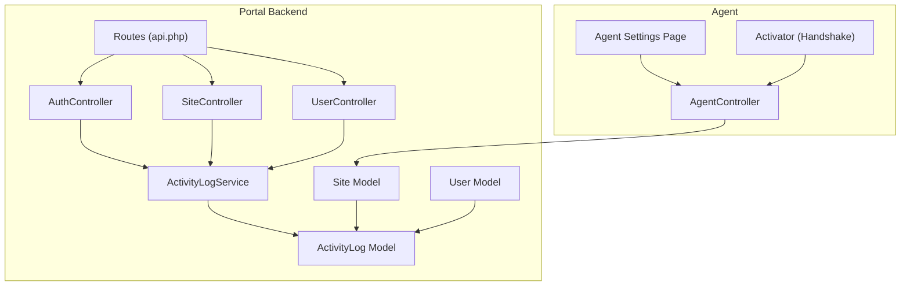
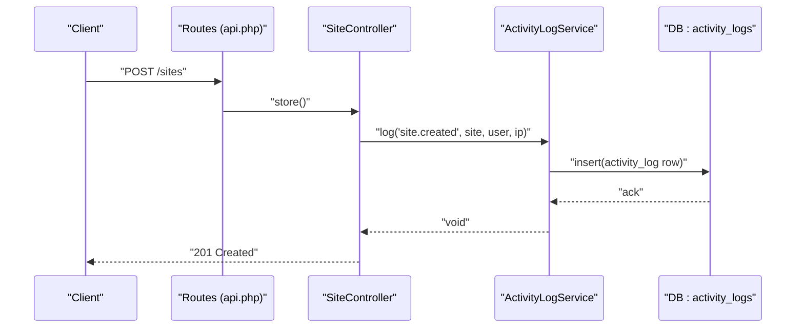
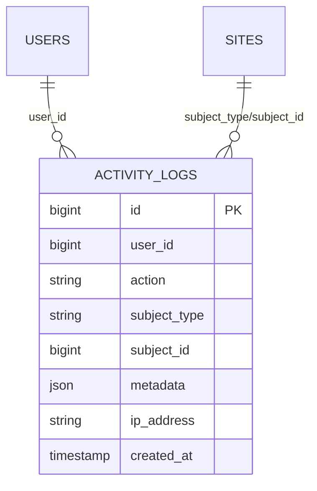
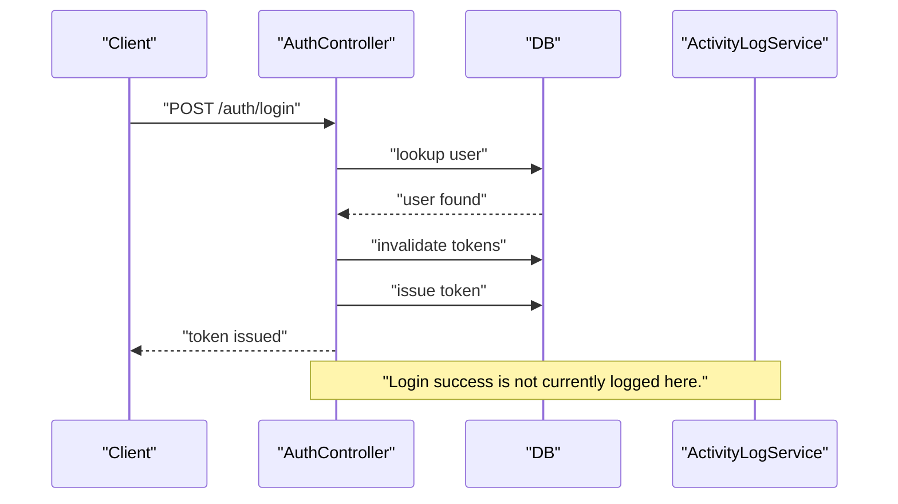
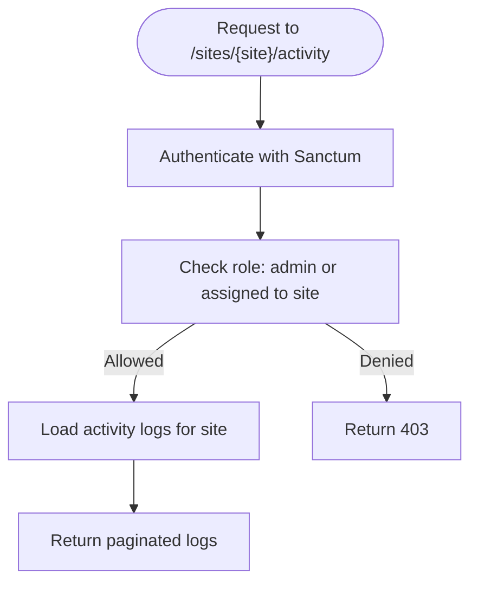
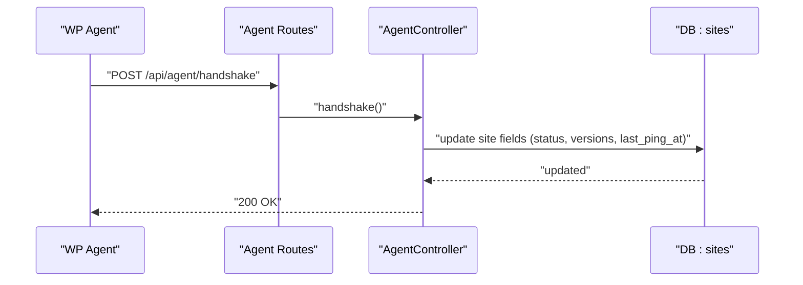
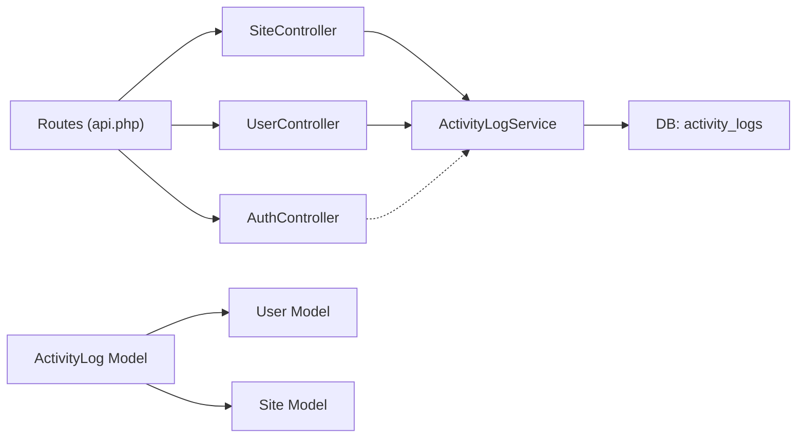

# Activity Logging & Auditing

<cite>
**Referenced Files in This Document**
- [ActivityLog.php](file://portal/app/Models/ActivityLog.php)
- [ActivityLogService.php](file://portal/app/Services/ActivityLogService.php)
- [create_activity_logs_table.php](file://portal/database/migrations/2026_05_15_070004_create_activity_logs_table.php)
- [Site.php](file://portal/app/Models/Site.php)
- [User.php](file://portal/app/Models/User.php)
- [SiteController.php](file://portal/app/Http/Controllers/Portal/SiteController.php)
- [UserController.php](file://portal/app/Http/Controllers/Portal/UserController.php)
- [AuthController.php](file://portal/app/Http/Controllers/Auth/AuthController.php)
- [api.php](file://portal/routes/api.php)
- [database.php](file://portal/config/database.php)
- [logging.php](file://portal/config/logging.php)
- [AgentController.php](file://portal/app/Http/Controllers/Agent/AgentController.php)
- [settings-page.php](file://agent/epos-wp-agent/admin/settings-page.php)
- [class-activator.php](file://agent/epos-wp-agent/includes/class-activator.php)
</cite>

## Table of Contents
1. [Introduction](#introduction)
2. [Project Structure](#project-structure)
3. [Core Components](#core-components)
4. [Architecture Overview](#architecture-overview)
5. [Detailed Component Analysis](#detailed-component-analysis)
6. [Dependency Analysis](#dependency-analysis)
7. [Performance Considerations](#performance-considerations)
8. [Troubleshooting Guide](#troubleshooting-guide)
9. [Conclusion](#conclusion)
10. [Appendices](#appendices)

## Introduction
This document describes the activity logging and auditing system implemented in the portal. It explains how user actions and system events are captured, stored, and queried, and how the system supports compliance reporting, data retention, and operational monitoring. It also outlines integration points with the WordPress agent and highlights areas for future enhancements such as real-time alerts and extended compliance integrations.

## Project Structure
The audit trail is implemented using a dedicated model and service, with database-backed persistence and controller-level triggers for key events. Routes define access patterns and roles that govern who can view activity logs. The agent integration records site-level metadata and connectivity status, which complements the audit trail.

**Diagram sources**
- [ActivityLogService.php:11-49](file://portal/app/Services/ActivityLogService.php#L11-L49)
- [ActivityLog.php:9-36](file://portal/app/Models/ActivityLog.php#L9-L36)
- [SiteController.php:14-204](file://portal/app/Http/Controllers/Portal/SiteController.php#L14-L204)
- [UserController.php:14-137](file://portal/app/Http/Controllers/Portal/UserController.php#L14-L137)
- [AuthController.php:11-135](file://portal/app/Http/Controllers/Auth/AuthController.php#L11-L135)
- [api.php:1-48](file://portal/routes/api.php#L1-L48)
- [Site.php:12-76](file://portal/app/Models/Site.php#L12-L76)
- [User.php:11-38](file://portal/app/Models/User.php#L11-L38)
- [AgentController.php:10-37](file://portal/app/Http/Controllers/Agent/AgentController.php#L10-L37)
- [settings-page.php:67-117](file://agent/epos-wp-agent/admin/settings-page.php#L67-L117)
- [class-activator.php:46-88](file://agent/epos-wp-agent/includes/class-activator.php#L46-L88)

**Section sources**
- [ActivityLog.php:9-36](file://portal/app/Models/ActivityLog.php#L9-L36)
- [ActivityLogService.php:11-49](file://portal/app/Services/ActivityLogService.php#L11-L49)
- [create_activity_logs_table.php:7-31](file://portal/database/migrations/2026_05_15_070004_create_activity_logs_table.php#L7-L31)
- [SiteController.php:14-204](file://portal/app/Http/Controllers/Portal/SiteController.php#L14-L204)
- [UserController.php:14-137](file://portal/app/Http/Controllers/Portal/UserController.php#L14-L137)
- [AuthController.php:11-135](file://portal/app/Http/Controllers/Auth/AuthController.php#L11-L135)
- [api.php:1-48](file://portal/routes/api.php#L1-L48)
- [Site.php:12-76](file://portal/app/Models/Site.php#L12-L76)
- [User.php:11-38](file://portal/app/Models/User.php#L11-L38)
- [AgentController.php:10-37](file://portal/app/Http/Controllers/Agent/AgentController.php#L10-L37)
- [settings-page.php:67-117](file://agent/epos-wp-agent/admin/settings-page.php#L67-L117)
- [class-activator.php:46-88](file://agent/epos-wp-agent/includes/class-activator.php#L46-L88)

## Core Components
- ActivityLog model: Represents a single audit record with action, optional subject linkage, user, IP address, metadata, and timestamp.
- ActivityLogService: Centralized logging utility that writes to the database when available or falls back to application logs.
- Site and User models: Provide relationships to activity logs and support role-based access for viewing logs.
- Controllers: Trigger logging for key lifecycle events such as site creation, updates, deletions, user creation, updates, role changes, and deletions.
- Routes: Define access control and expose endpoints for activity retrieval per resource.

**Section sources**
- [ActivityLog.php:9-36](file://portal/app/Models/ActivityLog.php#L9-L36)
- [ActivityLogService.php:11-49](file://portal/app/Services/ActivityLogService.php#L11-L49)
- [Site.php:56-60](file://portal/app/Models/Site.php#L56-L60)
- [User.php:11-38](file://portal/app/Models/User.php#L11-L38)
- [SiteController.php:80-85](file://portal/app/Http/Controllers/Portal/SiteController.php#L80-L85)
- [SiteController.php:123-128](file://portal/app/Http/Controllers/Portal/SiteController.php#L123-L128)
- [SiteController.php:142-147](file://portal/app/Http/Controllers/Portal/SiteController.php#L142-L147)
- [SiteController.php:171-176](file://portal/app/Http/Controllers/Portal/SiteController.php#L171-L176)
- [SiteController.php:187-202](file://portal/app/Http/Controllers/Portal/SiteController.php#L187-L202)
- [UserController.php:47-53](file://portal/app/Http/Controllers/Portal/UserController.php#L47-L53)
- [UserController.php:86-92](file://portal/app/Http/Controllers/Portal/UserController.php#L86-L92)
- [UserController.php:95-100](file://portal/app/Http/Controllers/Portal/UserController.php#L95-L100)
- [UserController.php:124-130](file://portal/app/Http/Controllers/Portal/UserController.php#L124-L130)
- [api.php:46](file://portal/routes/api.php#L46)

## Architecture Overview
The audit system follows a layered pattern:
- Controllers detect meaningful events and invoke the ActivityLogService.
- ActivityLogService persists records to the activity_logs table when available; otherwise, it logs to the application log channel.
- Models define relationships enabling queries by subject, action, and user.
- Routes enforce role-based access to sensitive operations and activity endpoints.

**Diagram sources**
- [api.php:32-35](file://portal/routes/api.php#L32-L35)
- [SiteController.php:62-92](file://portal/app/Http/Controllers/Portal/SiteController.php#L62-L92)
- [ActivityLogService.php:16-48](file://portal/app/Services/ActivityLogService.php#L16-L48)
- [create_activity_logs_table.php:11-24](file://portal/database/migrations/2026_05_15_070004_create_activity_logs_table.php#L11-L24)

## Detailed Component Analysis

### Audit Data Model and Persistence
- Fields include action, optional subject linkage (polymorphic), user, IP, metadata JSON, and created timestamp.
- Indexes on subject_type+subject_id, action, and user_id optimize common queries.
- When the activity_logs table does not exist, logging falls back to application logs.

**Diagram sources**
- [create_activity_logs_table.php:11-24](file://portal/database/migrations/2026_05_15_070004_create_activity_logs_table.php#L11-L24)
- [ActivityLog.php:13-25](file://portal/app/Models/ActivityLog.php#L13-L25)
- [Site.php:56-60](file://portal/app/Models/Site.php#L56-L60)

**Section sources**
- [ActivityLog.php:9-36](file://portal/app/Models/ActivityLog.php#L9-L36)
- [create_activity_logs_table.php:7-31](file://portal/database/migrations/2026_05_15_070004_create_activity_logs_table.php#L7-L31)
- [ActivityLogService.php:34-47](file://portal/app/Services/ActivityLogService.php#L34-L47)

### Event Tracking Mechanisms
- Site lifecycle: creation, update, deletion, and API key regeneration trigger site-related actions.
- User lifecycle: creation, update, role change, and deletion trigger user-related actions.
- Authentication: login endpoint validates credentials and issues tokens; while login attempts are not logged here, failed attempts can be instrumented at middleware or framework level.

**Diagram sources**
- [AuthController.php:18-56](file://portal/app/Http/Controllers/Auth/AuthController.php#L18-L56)

**Section sources**
- [SiteController.php:80-85](file://portal/app/Http/Controllers/Portal/SiteController.php#L80-L85)
- [SiteController.php:123-128](file://portal/app/Http/Controllers/Portal/SiteController.php#L123-L128)
- [SiteController.php:142-147](file://portal/app/Http/Controllers/Portal/SiteController.php#L142-L147)
- [SiteController.php:171-176](file://portal/app/Http/Controllers/Portal/SiteController.php#L171-L176)
- [UserController.php:47-53](file://portal/app/Http/Controllers/Portal/UserController.php#L47-L53)
- [UserController.php:86-92](file://portal/app/Http/Controllers/Portal/UserController.php#L86-L92)
- [UserController.php:95-100](file://portal/app/Http/Controllers/Portal/UserController.php#L95-L100)
- [UserController.php:124-130](file://portal/app/Http/Controllers/Portal/UserController.php#L124-L130)
- [AuthController.php:18-56](file://portal/app/Http/Controllers/Auth/AuthController.php#L18-L56)

### Compliance Reporting and Access Controls
- Activity endpoints are protected by Sanctum tokens and role middleware.
- Admin-only routes restrict access to sensitive operations.
- Activity endpoints are role-gated to ensure only authorized users can view logs for a given resource.

**Diagram sources**
- [api.php:10-47](file://portal/routes/api.php#L10-L47)
- [SiteController.php:187-202](file://portal/app/Http/Controllers/Portal/SiteController.php#L187-L202)

**Section sources**
- [api.php:10-47](file://portal/routes/api.php#L10-L47)
- [SiteController.php:187-202](file://portal/app/Http/Controllers/Portal/SiteController.php#L187-L202)

### Agent Integration and Site Metadata
- The agent performs a handshake with the portal, updating site status and metadata.
- This complements the audit trail by recording connectivity and environment details.

**Diagram sources**
- [AgentController.php:16-37](file://portal/app/Http/Controllers/Agent/AgentController.php#L16-L37)
- [class-activator.php:46-88](file://agent/epos-wp-agent/includes/class-activator.php#L46-L88)
- [settings-page.php:67-117](file://agent/epos-wp-agent/admin/settings-page.php#L67-L117)

**Section sources**
- [AgentController.php:10-37](file://portal/app/Http/Controllers/Agent/AgentController.php#L10-L37)
- [class-activator.php:46-88](file://agent/epos-wp-agent/includes/class-activator.php#L46-L88)
- [settings-page.php:67-117](file://agent/epos-wp-agent/admin/settings-page.php#L67-L117)

## Dependency Analysis
- Controllers depend on ActivityLogService for capturing events.
- ActivityLogService depends on database schema detection and DB facade for insertion.
- ActivityLog model depends on User and Site models via relationships.
- Routes define the policy boundaries for who can trigger or view logs.

**Diagram sources**
- [SiteController.php:14-204](file://portal/app/Http/Controllers/Portal/SiteController.php#L14-L204)
- [UserController.php:14-137](file://portal/app/Http/Controllers/Portal/UserController.php#L14-L137)
- [AuthController.php:11-135](file://portal/app/Http/Controllers/Auth/AuthController.php#L11-L135)
- [ActivityLogService.php:11-49](file://portal/app/Services/ActivityLogService.php#L11-L49)
- [ActivityLog.php:9-36](file://portal/app/Models/ActivityLog.php#L9-L36)
- [User.php:11-38](file://portal/app/Models/User.php#L11-L38)
- [Site.php:12-76](file://portal/app/Models/Site.php#L12-L76)
- [api.php:1-48](file://portal/routes/api.php#L1-L48)

**Section sources**
- [SiteController.php:14-204](file://portal/app/Http/Controllers/Portal/SiteController.php#L14-L204)
- [UserController.php:14-137](file://portal/app/Http/Controllers/Portal/UserController.php#L14-L137)
- [AuthController.php:11-135](file://portal/app/Http/Controllers/Auth/AuthController.php#L11-L135)
- [ActivityLogService.php:11-49](file://portal/app/Services/ActivityLogService.php#L11-L49)
- [ActivityLog.php:9-36](file://portal/app/Models/ActivityLog.php#L9-L36)
- [User.php:11-38](file://portal/app/Models/User.php#L11-L38)
- [Site.php:12-76](file://portal/app/Models/Site.php#L12-L76)
- [api.php:1-48](file://portal/routes/api.php#L1-L48)

## Performance Considerations
- High-volume logging: The logger writes synchronously via a direct insert when the table exists. For high-throughput scenarios, consider:
  - Asynchronous job queuing for log writes.
  - Batch inserts to reduce round-trips.
  - Partitioning or sharding the activity_logs table by date or action type.
- Query patterns:
  - Use indexes on action, user_id, and subject_type+subject_id as implemented.
  - Prefer filtering by action and user for administrative reports.
  - Paginate results for activity endpoints to limit payload sizes.
- Storage:
  - Monitor growth of the activity_logs table and implement retention policies (see Appendices).
  - Consider offloading older logs to cold storage or archival systems.

[No sources needed since this section provides general guidance]

## Troubleshooting Guide
- Logs not appearing in activity_logs:
  - Verify the migration was run and the table exists.
  - Confirm logging fallback is functioning by checking the configured log channel.
- Errors during logging:
  - The service catches exceptions and logs warnings; inspect application logs for details.
- Access denied to activity endpoints:
  - Ensure the requesting user has the appropriate role and is assigned to the target resource (non-admin users).

**Section sources**
- [ActivityLogService.php:34-47](file://portal/app/Services/ActivityLogService.php#L34-L47)
- [logging.php:53-133](file://portal/config/logging.php#L53-L133)
- [create_activity_logs_table.php:7-31](file://portal/database/migrations/2026_05_15_070004_create_activity_logs_table.php#L7-L31)

## Conclusion
The portal implements a robust, extensible audit trail that captures key user and system events. It leverages database-backed persistence with sensible indexes, integrates tightly with controllers for lifecycle events, and enforces role-based access for compliance. Future enhancements could include asynchronous logging, retention/archival policies, real-time alerting, and deeper compliance integrations.

[No sources needed since this section summarizes without analyzing specific files]

## Appendices

### Data Retention and Archiving
- Retention policy: Define a time-based retention window (e.g., 90–365 days) and schedule periodic cleanup jobs to archive or delete old entries.
- Archival strategy: Export monthly archives to secure storage; maintain immutable copies and checksums.
- Cost control: Compress archived logs, use columnar formats, and apply compression at rest.

[No sources needed since this section provides general guidance]

### Real-Time Monitoring and Alerting
- Near-real-time: Use a message bus or queue to fan out audit events to monitoring/alerting systems.
- Threshold-based alerts: Detect bursts of specific actions (e.g., repeated failed logins) and escalate to administrators.
- SIEM integration: Forward logs to a Security Information and Event Management platform for correlation and alerting.

[No sources needed since this section provides general guidance]

### Compliance Reporting and Regulatory Features
- Audit trails: Provide standardized reports by date range, actor, action, and affected resource.
- Immutable logs: Ensure logs are append-only and tamper-evident; consider cryptographic hashing or blockchain anchoring.
- Access controls: Enforce least privilege and role-based access to audit data.
- Data minimization: Limit metadata stored to what is necessary for compliance.

[No sources needed since this section provides general guidance]

### Configuring Audit Policies and Managing Costs
- Policy configuration: Define which actions are audited, who can view logs, and retention periods per category.
- Cost management: Use partitioning, compression, and tiered storage; monitor query performance and adjust indexing.

[No sources needed since this section provides general guidance]