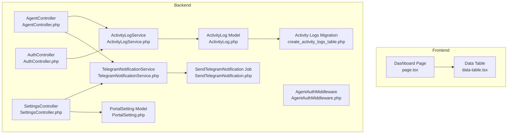
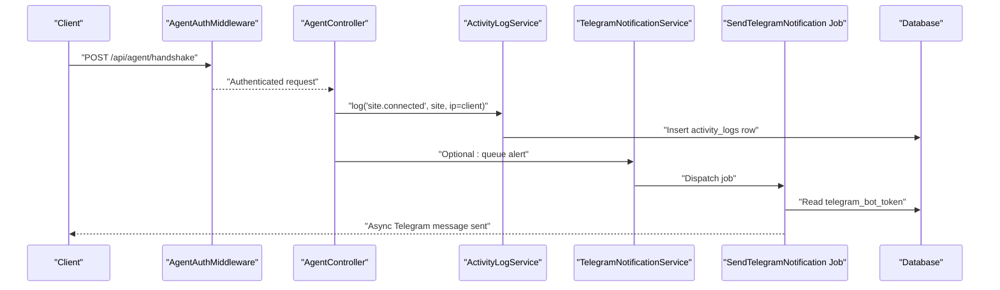
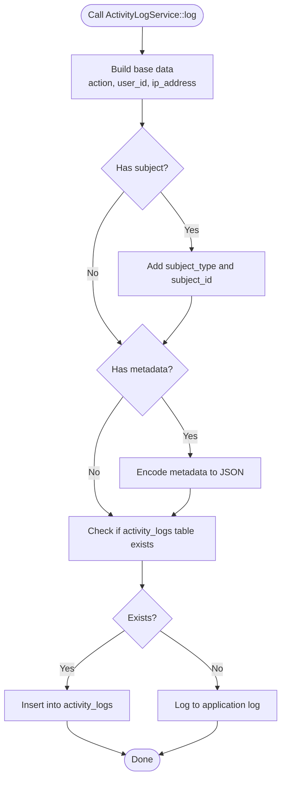
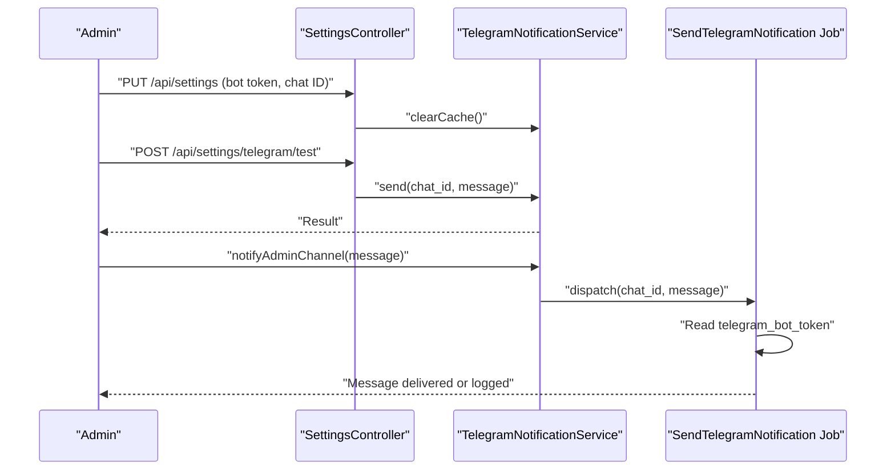
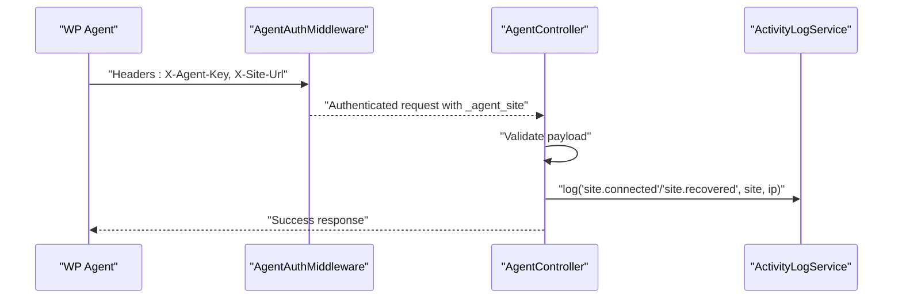
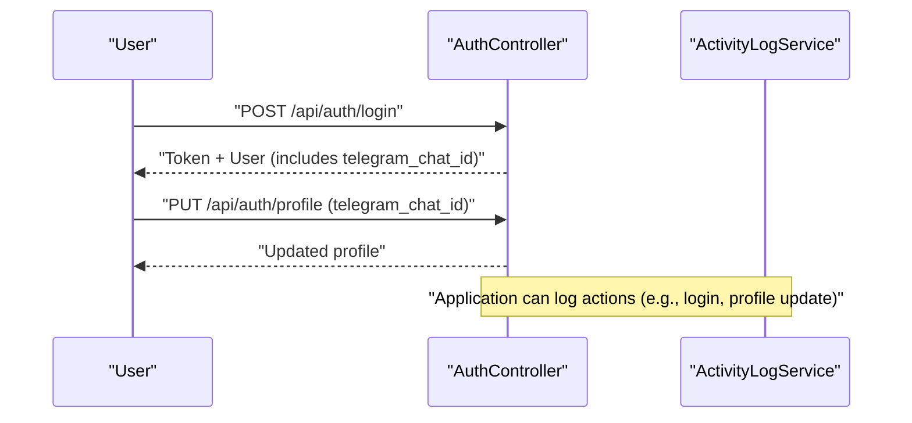
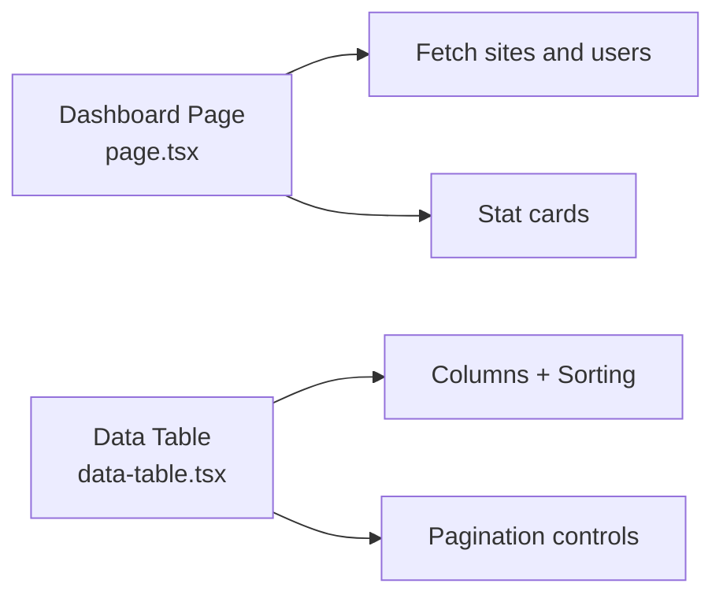
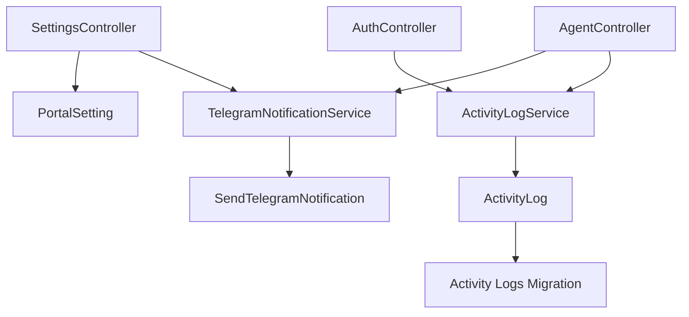

# Activity Monitoring & Alerting

<cite>
**Referenced Files in This Document**
- [ActivityLogService.php](file://portal/app/Services/ActivityLogService.php)
- [ActivityLog.php](file://portal/app/Models/ActivityLog.php)
- [create_activity_logs_table.php](file://portal/database/migrations/2026_05_15_070004_create_activity_logs_table.php)
- [TelegramNotificationService.php](file://portal/app/Services/TelegramNotificationService.php)
- [SendTelegramNotification.php](file://portal/app/Jobs/SendTelegramNotification.php)
- [SettingsController.php](file://portal/app/Http/Controllers/Portal/SettingsController.php)
- [AgentController.php](file://portal/app/Http/Controllers/Agent/AgentController.php)
- [AgentAuthMiddleware.php](file://portal/app/Http/Middleware/AgentAuthMiddleware.php)
- [AuthController.php](file://portal/app/Http/Controllers/Auth/AuthController.php)
- [PortalSetting.php](file://portal/app/Models/PortalSetting.php)
- [page.tsx](file://portal/frontend/src/app/(dashboard)/dashboard/page.tsx)
- [data-table.tsx](file://portal/frontend/src/components/data-table.tsx)
</cite>

## Table of Contents
1. [Introduction](#introduction)
2. [Project Structure](#project-structure)
3. [Core Components](#core-components)
4. [Architecture Overview](#architecture-overview)
5. [Detailed Component Analysis](#detailed-component-analysis)
6. [Dependency Analysis](#dependency-analysis)
7. [Performance Considerations](#performance-considerations)
8. [Troubleshooting Guide](#troubleshooting-guide)
9. [Conclusion](#conclusion)
10. [Appendices](#appendices)

## Introduction
This document describes the real-time activity monitoring and alerting system. It explains how suspicious activities are detected and logged, how thresholds and custom rules can be applied to trigger alerts, and how Telegram notifications are integrated for real-time delivery. It also covers the monitoring dashboard components and visualization of recent activities, along with practical examples of common alert scenarios such as failed login attempts, unauthorized access attempts, and bulk data modifications. Finally, it addresses performance impacts and scaling strategies for alert processing during high-traffic periods.

## Project Structure
The monitoring and alerting system spans backend services, models, jobs, controllers, and the frontend dashboard:
- Backend services and models manage activity logging and Telegram integration.
- Controllers orchestrate authentication, agent handshakes, and settings updates.
- Middleware authenticates agent requests.
- Frontend provides dashboard statistics and paginated data tables for activity inspection.

**Diagram sources**
- [page.tsx](file://portal/frontend/src/app/(dashboard)/dashboard/page.tsx#L1-L107)
- [data-table.tsx:1-124](file://portal/frontend/src/components/data-table.tsx#L1-L124)
- [AgentController.php:1-99](file://portal/app/Http/Controllers/Agent/AgentController.php#L1-L99)
- [AgentAuthMiddleware.php:1-57](file://portal/app/Http/Middleware/AgentAuthMiddleware.php#L1-L57)
- [AuthController.php:1-135](file://portal/app/Http/Controllers/Auth/AuthController.php#L1-L135)
- [SettingsController.php:1-87](file://portal/app/Http/Controllers/Portal/SettingsController.php#L1-L87)
- [ActivityLogService.php:1-50](file://portal/app/Services/ActivityLogService.php#L1-L50)
- [ActivityLog.php:1-37](file://portal/app/Models/ActivityLog.php#L1-L37)
- [create_activity_logs_table.php:1-32](file://portal/database/migrations/2026_05_15_070004_create_activity_logs_table.php#L1-L32)
- [TelegramNotificationService.php:1-107](file://portal/app/Services/TelegramNotificationService.php#L1-L107)
- [SendTelegramNotification.php:1-62](file://portal/app/Jobs/SendTelegramNotification.php#L1-L62)
- [PortalSetting.php:1-11](file://portal/app/Models/PortalSetting.php#L1-L11)

**Section sources**
- [page.tsx](file://portal/frontend/src/app/(dashboard)/dashboard/page.tsx#L1-L107)
- [data-table.tsx:1-124](file://portal/frontend/src/components/data-table.tsx#L1-L124)
- [AgentController.php:1-99](file://portal/app/Http/Controllers/Agent/AgentController.php#L1-L99)
- [AgentAuthMiddleware.php:1-57](file://portal/app/Http/Middleware/AgentAuthMiddleware.php#L1-L57)
- [AuthController.php:1-135](file://portal/app/Http/Controllers/Auth/AuthController.php#L1-L135)
- [SettingsController.php:1-87](file://portal/app/Http/Controllers/Portal/SettingsController.php#L1-L87)
- [ActivityLogService.php:1-50](file://portal/app/Services/ActivityLogService.php#L1-L50)
- [ActivityLog.php:1-37](file://portal/app/Models/ActivityLog.php#L1-L37)
- [create_activity_logs_table.php:1-32](file://portal/database/migrations/2026_05_15_070004_create_activity_logs_table.php#L1-L32)
- [TelegramNotificationService.php:1-107](file://portal/app/Services/TelegramNotificationService.php#L1-L107)
- [SendTelegramNotification.php:1-62](file://portal/app/Jobs/SendTelegramNotification.php#L1-L62)
- [PortalSetting.php:1-11](file://portal/app/Models/PortalSetting.php#L1-L11)

## Core Components
- Activity logging service: Centralized mechanism to record actions, subjects, users, IP addresses, and metadata.
- Activity log model and migration: Persistent schema for storing activity records with indexes for efficient querying.
- Telegram notification service: Synchronous and asynchronous channels for delivering messages to Telegram chats.
- Telegram notification job: Asynchronous worker to send messages via Telegram’s Bot API with retries and failure handling.
- Settings controller: Manages Telegram bot token and default chat ID, with masking and caching support.
- Agent and authentication controllers: Trigger activity logs for agent connections and user actions.
- Frontend dashboard: Provides high-level stats and paginated tables for inspecting activity.

**Section sources**
- [ActivityLogService.php:11-49](file://portal/app/Services/ActivityLogService.php#L11-L49)
- [ActivityLog.php:9-37](file://portal/app/Models/ActivityLog.php#L9-L37)
- [create_activity_logs_table.php:9-31](file://portal/database/migrations/2026_05_15_070004_create_activity_logs_table.php#L9-L31)
- [TelegramNotificationService.php:11-107](file://portal/app/Services/TelegramNotificationService.php#L11-L107)
- [SendTelegramNotification.php:13-62](file://portal/app/Jobs/SendTelegramNotification.php#L13-L62)
- [SettingsController.php:11-87](file://portal/app/Http/Controllers/Portal/SettingsController.php#L11-L87)
- [AgentController.php:10-99](file://portal/app/Http/Controllers/Agent/AgentController.php#L10-L99)
- [AuthController.php:11-135](file://portal/app/Http/Controllers/Auth/AuthController.php#L11-L135)
- [page.tsx](file://portal/frontend/src/app/(dashboard)/dashboard/page.tsx#L18-L107)
- [data-table.tsx:30-124](file://portal/frontend/src/components/data-table.tsx#L30-L124)

## Architecture Overview
The system integrates real-time activity logging with asynchronous alert delivery. Controllers trigger logging and optional alerting. Settings are stored in the database and cached for performance. Notifications are queued and processed asynchronously to avoid blocking user-facing requests.

**Diagram sources**
- [AgentAuthMiddleware.php:20-55](file://portal/app/Http/Middleware/AgentAuthMiddleware.php#L20-L55)
- [AgentController.php:16-55](file://portal/app/Http/Controllers/Agent/AgentController.php#L16-L55)
- [ActivityLogService.php:16-48](file://portal/app/Services/ActivityLogService.php#L16-L48)
- [TelegramNotificationService.php:53-76](file://portal/app/Services/TelegramNotificationService.php#L53-L76)
- [SendTelegramNotification.php:25-52](file://portal/app/Jobs/SendTelegramNotification.php#L25-L52)
- [create_activity_logs_table.php:11-24](file://portal/database/migrations/2026_05_15_070004_create_activity_logs_table.php#L11-L24)

## Detailed Component Analysis

### Activity Logging Pipeline
ActivityLogService centralizes logging with graceful fallback when the activity_logs table is missing. It captures action, subject, user, IP, and metadata, then writes to the database or logs to the application log.

**Diagram sources**
- [ActivityLogService.php:16-48](file://portal/app/Services/ActivityLogService.php#L16-L48)
- [create_activity_logs_table.php:11-24](file://portal/database/migrations/2026_05_15_070004_create_activity_logs_table.php#L11-L24)

**Section sources**
- [ActivityLogService.php:11-49](file://portal/app/Services/ActivityLogService.php#L11-L49)
- [ActivityLog.php:9-37](file://portal/app/Models/ActivityLog.php#L9-L37)
- [create_activity_logs_table.php:9-31](file://portal/database/migrations/2026_05_15_070004_create_activity_logs_table.php#L9-L31)

### Telegram Notification Delivery
TelegramNotificationService supports synchronous testing and asynchronous queuing. Queued notifications are handled by SendTelegramNotification job, which reads the bot token from settings and posts to Telegram’s Bot API. Retries and failure logging are built-in.

**Diagram sources**
- [SettingsController.php:33-85](file://portal/app/Http/Controllers/Portal/SettingsController.php#L33-L85)
- [TelegramNotificationService.php:53-105](file://portal/app/Services/TelegramNotificationService.php#L53-L105)
- [SendTelegramNotification.php:25-52](file://portal/app/Jobs/SendTelegramNotification.php#L25-L52)

**Section sources**
- [TelegramNotificationService.php:11-107](file://portal/app/Services/TelegramNotificationService.php#L11-L107)
- [SendTelegramNotification.php:13-62](file://portal/app/Jobs/SendTelegramNotification.php#L13-L62)
- [SettingsController.php:11-87](file://portal/app/Http/Controllers/Portal/SettingsController.php#L11-L87)
- [PortalSetting.php:7-11](file://portal/app/Models/PortalSetting.php#L7-L11)

### Agent Authentication and Activity Logging
AgentAuthMiddleware validates agent requests using a hashed API key and attaches the matched site to the request. AgentController logs site connection and recovery events with IP and metadata.

**Diagram sources**
- [AgentAuthMiddleware.php:20-55](file://portal/app/Http/Middleware/AgentAuthMiddleware.php#L20-L55)
- [AgentController.php:16-97](file://portal/app/Http/Controllers/Agent/AgentController.php#L16-L97)
- [ActivityLogService.php:16-48](file://portal/app/Services/ActivityLogService.php#L16-L48)

**Section sources**
- [AgentAuthMiddleware.php:10-57](file://portal/app/Http/Middleware/AgentAuthMiddleware.php#L10-L57)
- [AgentController.php:10-99](file://portal/app/Http/Controllers/Agent/AgentController.php#L10-L99)
- [ActivityLogService.php:11-49](file://portal/app/Services/ActivityLogService.php#L11-L49)

### Authentication Events and User Profile Updates
AuthController handles login, logout, profile updates, and password changes. On successful login, it returns user details including Telegram chat ID. Profile updates allow users to set their Telegram chat ID for personalized alerts.

**Diagram sources**
- [AuthController.php:18-110](file://portal/app/Http/Controllers/Auth/AuthController.php#L18-L110)
- [ActivityLogService.php:16-48](file://portal/app/Services/ActivityLogService.php#L16-L48)

**Section sources**
- [AuthController.php:11-135](file://portal/app/Http/Controllers/Auth/AuthController.php#L11-L135)
- [ActivityLogService.php:11-49](file://portal/app/Services/ActivityLogService.php#L11-L49)

### Monitoring Dashboard Components
The dashboard page aggregates high-level stats for sites and users. The data-table component provides a reusable table with sorting and pagination, suitable for displaying recent activity logs.

**Diagram sources**
- [page.tsx](file://portal/frontend/src/app/(dashboard)/dashboard/page.tsx#L18-L107)
- [data-table.tsx:30-124](file://portal/frontend/src/components/data-table.tsx#L30-L124)

**Section sources**
- [page.tsx](file://portal/frontend/src/app/(dashboard)/dashboard/page.tsx#L18-L107)
- [data-table.tsx:1-124](file://portal/frontend/src/components/data-table.tsx#L1-L124)

## Dependency Analysis
The system exhibits clear separation of concerns:
- Controllers depend on services for logging and notifications.
- Services depend on models and settings for persistence and configuration.
- Jobs encapsulate external API calls and retries.
- Frontend components rely on shared UI libraries and services.

**Diagram sources**
- [AgentController.php:6-9](file://portal/app/Http/Controllers/Agent/AgentController.php#L6-L9)
- [ActivityLogService.php:5-9](file://portal/app/Services/ActivityLogService.php#L5-L9)
- [TelegramNotificationService.php:5-9](file://portal/app/Services/TelegramNotificationService.php#L5-L9)
- [SendTelegramNotification.php:5-11](file://portal/app/Jobs/SendTelegramNotification.php#L5-L11)
- [SettingsController.php:6-9](file://portal/app/Http/Controllers/Portal/SettingsController.php#L6-L9)
- [PortalSetting.php:7-11](file://portal/app/Models/PortalSetting.php#L7-L11)
- [ActivityLog.php:9-37](file://portal/app/Models/ActivityLog.php#L9-L37)
- [create_activity_logs_table.php:11-24](file://portal/database/migrations/2026_05_15_070004_create_activity_logs_table.php#L11-L24)

**Section sources**
- [AgentController.php:1-99](file://portal/app/Http/Controllers/Agent/AgentController.php#L1-L99)
- [ActivityLogService.php:1-50](file://portal/app/Services/ActivityLogService.php#L1-L50)
- [TelegramNotificationService.php:1-107](file://portal/app/Services/TelegramNotificationService.php#L1-L107)
- [SendTelegramNotification.php:1-62](file://portal/app/Jobs/SendTelegramNotification.php#L1-L62)
- [SettingsController.php:1-87](file://portal/app/Http/Controllers/Portal/SettingsController.php#L1-L87)
- [PortalSetting.php:1-11](file://portal/app/Models/PortalSetting.php#L1-L11)
- [ActivityLog.php:1-37](file://portal/app/Models/ActivityLog.php#L1-L37)
- [create_activity_logs_table.php:1-32](file://portal/database/migrations/2026_05_15_070004_create_activity_logs_table.php#L1-L32)

## Performance Considerations
- Asynchronous processing: Use TelegramNotificationService::queue to offload network I/O and avoid blocking requests.
- Caching: TelegramNotificationService caches bot token and default chat ID to reduce database queries.
- Indexes: The activity_logs table includes indexes on action, user_id, and subject identifiers to speed up filtering and reporting.
- Retry strategy: The job retries with exponential backoff and logs failures to prevent silent losses.
- Frontend pagination: Use the data-table component to limit rendered rows and improve responsiveness.
- Graceful degradation: ActivityLogService falls back to application logs if the activity_logs table is unavailable.

[No sources needed since this section provides general guidance]

## Troubleshooting Guide
- Telegram notifications not sent:
  - Verify bot token and default chat ID are configured and cached.
  - Use the test endpoint to validate connectivity.
  - Inspect job logs for API errors and retry outcomes.
- Activity logs not appearing:
  - Confirm the activity_logs table exists and is migrated.
  - Check application logs for warnings when logging fails.
- Settings changes not taking effect:
  - Ensure settings are saved and cache is cleared after updates.

**Section sources**
- [SettingsController.php:33-85](file://portal/app/Http/Controllers/Portal/SettingsController.php#L33-L85)
- [TelegramNotificationService.php:81-105](file://portal/app/Services/TelegramNotificationService.php#L81-L105)
- [SendTelegramNotification.php:25-60](file://portal/app/Jobs/SendTelegramNotification.php#L25-L60)
- [ActivityLogService.php:34-48](file://portal/app/Services/ActivityLogService.php#L34-L48)

## Conclusion
The system provides a robust foundation for real-time activity monitoring and alerting. Activity logs capture meaningful events with metadata, while Telegram integration enables immediate notifications. The architecture supports asynchronous processing, caching, and graceful fallbacks. Extending the system with threshold-based alerting and custom rules requires adding detection logic around logging points and configuring alert conditions against the persisted activity data.

[No sources needed since this section summarizes without analyzing specific files]

## Appendices

### Threshold-Based Alerting and Custom Rule Configuration
- Define alert rules keyed by action or subject type, with thresholds for rate or frequency.
- Use the activity_logs table to aggregate counts per time window and compare against thresholds.
- Trigger TelegramNotificationService::queue when thresholds are exceeded.
- Store rule configurations in PortalSetting entries and cache them for low-latency evaluation.

[No sources needed since this section proposes future enhancements conceptually]

### Common Alert Scenarios
- Failed login attempts:
  - Detect multiple invalid credentials for the same user or IP within a short period.
  - Trigger an alert to the admin channel and optionally to the affected user.
- Unauthorized access attempts:
  - Detect attempts to access resources without proper permissions or roles.
  - Alert on repeated unauthorized attempts from the same IP or user.
- Bulk data modifications:
  - Detect rapid updates or deletions across many records within a short timeframe.
  - Alert on administrative actions that exceed configured thresholds.

[No sources needed since this section provides conceptual examples]