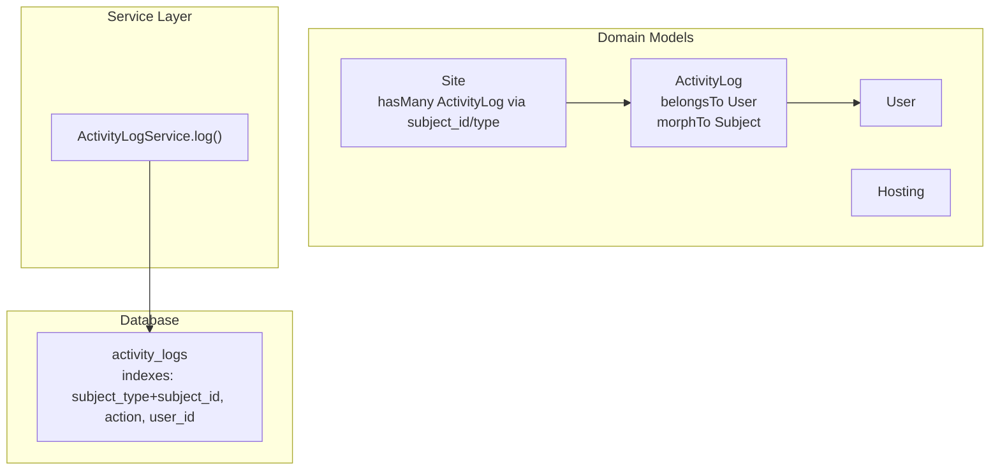
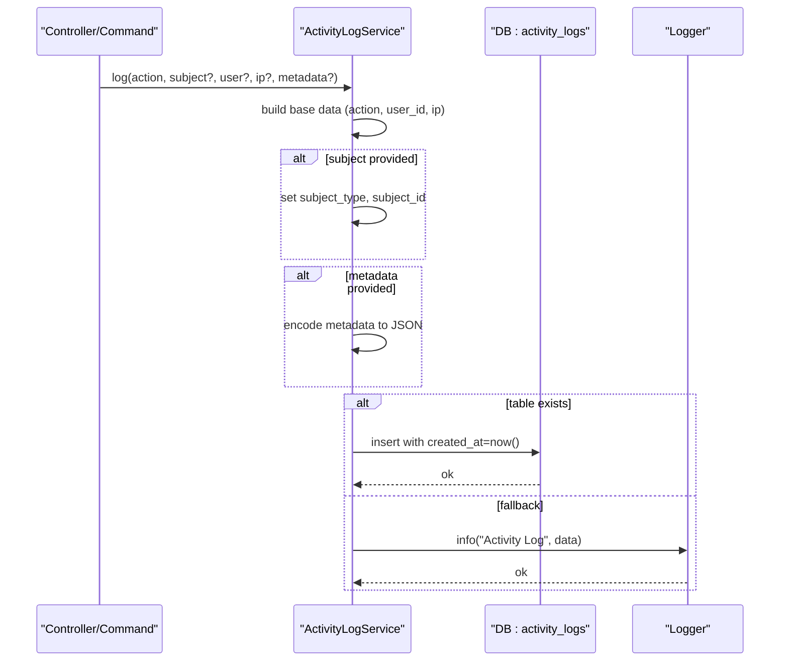
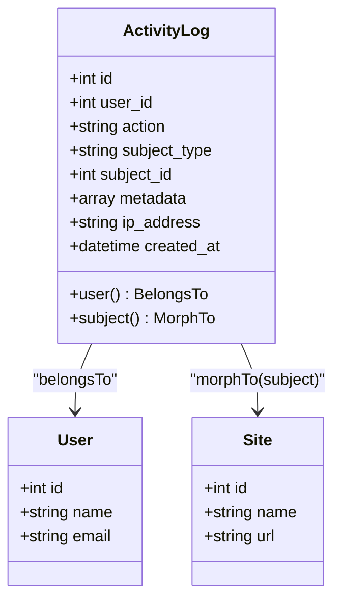
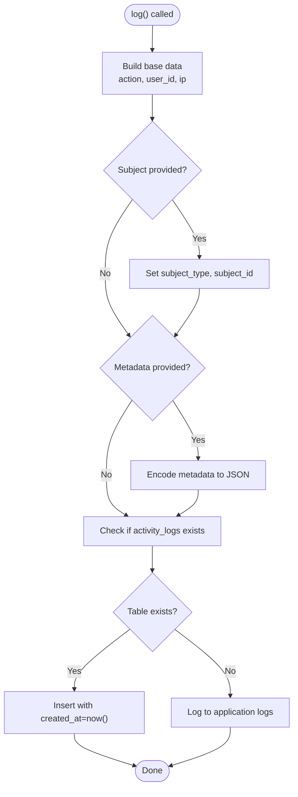
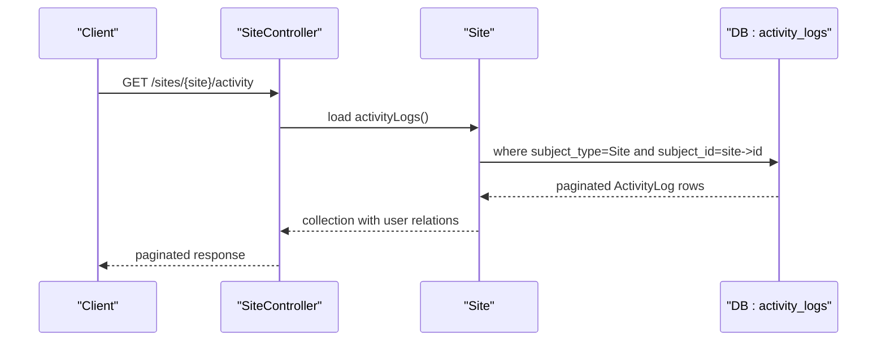
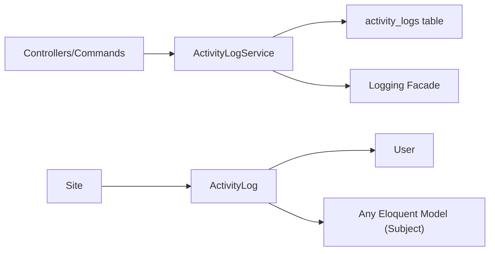

# Audit Trail System

<cite>
**Referenced Files in This Document**
- [ActivityLog.php](file://portal/app/Models/ActivityLog.php)
- [ActivityLogService.php](file://portal/app/Services/ActivityLogService.php)
- [2026_05_15_070004_create_activity_logs_table.php](file://portal/database/migrations/2026_05_15_070004_create_activity_logs_table.php)
- [Site.php](file://portal/app/Models/Site.php)
- [Hosting.php](file://portal/app/Models/Hosting.php)
- [User.php](file://portal/app/Models/User.php)
- [UserController.php](file://portal/app/Http/Controllers/Portal/UserController.php)
- [SiteController.php](file://portal/app/Http/Controllers/Portal/SiteController.php)
- [HostingController.php](file://portal/app/Http/Controllers/Portal/HostingController.php)
- [AgentController.php](file://portal/app/Http/Controllers/Agent/AgentController.php)
- [CheckSiteHealth.php](file://portal/app/Console/Commands/CheckSiteHealth.php)
</cite>

## Table of Contents
1. [Introduction](#introduction)
2. [Project Structure](#project-structure)
3. [Core Components](#core-components)
4. [Architecture Overview](#architecture-overview)
5. [Detailed Component Analysis](#detailed-component-analysis)
6. [Dependency Analysis](#dependency-analysis)
7. [Performance Considerations](#performance-considerations)
8. [Troubleshooting Guide](#troubleshooting-guide)
9. [Conclusion](#conclusion)

## Introduction
This document describes the audit trail system that captures user actions, system events, and administrative activities across the application. It documents the ActivityLog model structure, polymorphic subject associations, metadata handling, and the ActivityLogService methods used to record audit events. It also explains how audit events are triggered throughout the application and stored in the database, along with performance considerations and efficient query patterns for retrieving audit trails.

## Project Structure
The audit trail system spans three primary areas:
- Database schema: migration that defines the activity_logs table and supporting indexes
- Domain model: ActivityLog Eloquent model with relationships and casting
- Service layer: ActivityLogService that writes audit records and falls back to logging when the table does not exist

**Diagram sources**
- [2026_05_15_070004_create_activity_logs_table.php:11-24](file://portal/database/migrations/2026_05_15_070004_create_activity_logs_table.php#L11-L24)
- [ActivityLog.php:27-35](file://portal/app/Models/ActivityLog.php#L27-L35)
- [Site.php:56-60](file://portal/app/Models/Site.php#L56-L60)
- [ActivityLogService.php:16](file://portal/app/Services/ActivityLogService.php#L16)

**Section sources**
- [2026_05_15_070004_create_activity_logs_table.php:11-24](file://portal/database/migrations/2026_05_15_070004_create_activity_logs_table.php#L11-L24)
- [ActivityLog.php:9-36](file://portal/app/Models/ActivityLog.php#L9-L36)
- [ActivityLogService.php:11-49](file://portal/app/Services/ActivityLogService.php#L11-L49)

## Core Components
- ActivityLog model
  - Fields: user_id, action, subject_type, subject_id, metadata (JSON), ip_address, created_at
  - Relationships: belongs to User, polymorphic morphTo subject
  - Casting: metadata as array, created_at as datetime
- ActivityLogService
  - Static method to log activities with optional subject, user, IP address, and metadata
  - Writes to activity_logs table when present; otherwise logs to application logs
  - JSON-encodes metadata prior to insertion
- Polymorphic subject association
  - Any Eloquent model can be associated as the subject of an audit event
  - Uses subject_type and subject_id to maintain generic linkage

**Section sources**
- [ActivityLog.php:13-25](file://portal/app/Models/ActivityLog.php#L13-L25)
- [ActivityLog.php:27-35](file://portal/app/Models/ActivityLog.php#L27-L35)
- [ActivityLogService.php:16](file://portal/app/Services/ActivityLogService.php#L16)
- [ActivityLogService.php:34-42](file://portal/app/Services/ActivityLogService.php#L34-L42)

## Architecture Overview
The audit trail architecture centers on a single denormalized table that captures all auditable events. The service layer abstracts writing to the database while gracefully handling missing tables. The domain model exposes relationships to users and subjects, enabling flexible queries and reporting.

**Diagram sources**
- [ActivityLogService.php:16](file://portal/app/Services/ActivityLogService.php#L16)
- [ActivityLogService.php:34-42](file://portal/app/Services/ActivityLogService.php#L34-L42)

## Detailed Component Analysis

### ActivityLog Model
- Purpose: Stores audit events with optional subject and user linkage
- Key attributes
  - action: short textual identifier for the event type
  - subject_type/subject_id: polymorphic linkage to any model
  - metadata: JSON payload for contextual details
  - ip_address: optional client IP
  - created_at: timestamp with server-side default
- Relationships
  - user(): belongs to User
  - subject(): polymorphic morphTo relationship
- Casting
  - metadata: array (Eloquent cast)
  - created_at: datetime

**Diagram sources**
- [ActivityLog.php:13-25](file://portal/app/Models/ActivityLog.php#L13-L25)
- [ActivityLog.php:27-35](file://portal/app/Models/ActivityLog.php#L27-L35)
- [User.php:15-27](file://portal/app/Models/User.php#L15-L27)
- [Site.php:56-60](file://portal/app/Models/Site.php#L56-L60)

**Section sources**
- [ActivityLog.php:9-36](file://portal/app/Models/ActivityLog.php#L9-L36)

### ActivityLogService Methods
- Method signature
  - log(action, subject = null, user = null, ipAddress = null, metadata = null)
- Behavior
  - Builds base data from arguments
  - Sets subject_type/subject_id when a model is provided
  - Encodes metadata to JSON before insertion
  - Inserts into activity_logs when the table exists; otherwise logs to application logs
  - Catches exceptions and logs warnings

**Diagram sources**
- [ActivityLogService.php:16](file://portal/app/Services/ActivityLogService.php#L16)
- [ActivityLogService.php:34-42](file://portal/app/Services/ActivityLogService.php#L34-L42)

**Section sources**
- [ActivityLogService.php:11-49](file://portal/app/Services/ActivityLogService.php#L11-L49)

### Event Tracking Mechanisms
The system captures a wide range of events across controllers and commands:
- User management
  - Creation, updates, role changes, deletion
- Site lifecycle
  - Creation, updates, deletion, API key regeneration
- Hosting lifecycle
  - Creation, updates, deletion
- Agent interactions
  - Connection handshake, periodic pings, recovery
- System health checks
  - Disconnection and recovery events

Examples of triggers:
- User creation and updates with role metadata
- Site creation, updates, deletion, and API key regeneration
- Hosting creation, updates, and deletion with ancillary counts
- Agent handshake and ping events with environment metadata
- Console command marking sites disconnected or recovered

These are invoked from controllers and commands, passing the affected model as the subject and optionally including contextual metadata.

**Section sources**
- [UserController.php:47-53](file://portal/app/Http/Controllers/Portal/UserController.php#L47-L53)
- [UserController.php:86-93](file://portal/app/Http/Controllers/Portal/UserController.php#L86-L93)
- [UserController.php:95-100](file://portal/app/Http/Controllers/Portal/UserController.php#L95-L100)
- [SiteController.php:80-85](file://portal/app/Http/Controllers/Portal/SiteController.php#L80-L85)
- [SiteController.php:123-128](file://portal/app/Http/Controllers/Portal/SiteController.php#L123-L128)
- [SiteController.php:142-147](file://portal/app/Http/Controllers/Portal/SiteController.php#L142-L147)
- [SiteController.php:171-176](file://portal/app/Http/Controllers/Portal/SiteController.php#L171-L176)
- [HostingController.php:33-38](file://portal/app/Http/Controllers/Portal/HostingController.php#L33-L38)
- [HostingController.php:53-58](file://portal/app/Http/Controllers/Portal/HostingController.php#L53-L58)
- [HostingController.php:72-78](file://portal/app/Http/Controllers/Portal/HostingController.php#L72-L78)
- [AgentController.php:40-49](file://portal/app/Http/Controllers/Agent/AgentController.php#L40-L49)
- [AgentController.php:80-86](file://portal/app/Http/Controllers/Agent/AgentController.php#L80-L86)
- [CheckSiteHealth.php:30-36](file://portal/app/Console/Commands/CheckSiteHealth.php#L30-L36)
- [CheckSiteHealth.php:55-60](file://portal/app/Console/Commands/CheckSiteHealth.php#L55-L60)

### Metadata Field Usage
- Purpose: Store structured, contextual information alongside each event
- Encoding: Provided arrays are JSON-encoded before persistence
- Typical uses
  - Role changes during user updates
  - Environment details during agent handshakes
  - Counts and state snapshots during deletions
  - Timestamps for offline detection
- Access pattern: Eloquent cast converts metadata back to array for convenient consumption

**Section sources**
- [ActivityLogService.php:30-32](file://portal/app/Services/ActivityLogService.php#L30-L32)
- [ActivityLogService.php:37](file://portal/app/Services/ActivityLogService.php#L37)
- [ActivityLog.php:22-24](file://portal/app/Models/ActivityLog.php#L22-L24)
- [UserController.php:91](file://portal/app/Http/Controllers/Portal/UserController.php#L91)
- [AgentController.php:45-48](file://portal/app/Http/Controllers/Agent/AgentController.php#L45-L48)
- [HostingController.php:77](file://portal/app/Http/Controllers/Portal/HostingController.php#L77)
- [CheckSiteHealth.php:35](file://portal/app/Console/Commands/CheckSiteHealth.php#L35)

### Retrieving Audit Trails Efficiently
- Per-subject audit retrieval
  - Site model provides a dedicated relationship scoped to activity logs for that site
  - Query pattern: load activity logs with user details and paginate
- Indexes
  - Composite index on (subject_type, subject_id) supports per-entity queries
  - Index on action supports filtering by event type
  - Index on user_id supports per-user queries
- Recommended queries
  - Sort by created_at desc for chronological order
  - Filter by action for specific event categories
  - Join with users to enrich events with actor information

**Diagram sources**
- [SiteController.php:196-201](file://portal/app/Http/Controllers/Portal/SiteController.php#L196-L201)
- [Site.php:56-60](file://portal/app/Models/Site.php#L56-L60)

**Section sources**
- [SiteController.php:187-202](file://portal/app/Http/Controllers/Portal/SiteController.php#L187-L202)
- [Site.php:56-60](file://portal/app/Models/Site.php#L56-L60)
- [2026_05_15_070004_create_activity_logs_table.php:21-23](file://portal/database/migrations/2026_05_15_070004_create_activity_logs_table.php#L21-L23)

## Dependency Analysis
- ActivityLogService depends on:
  - Eloquent model classes for polymorphic typing
  - Schema facade to detect table existence
  - Database facade for raw inserts
  - Logging facade for fallback
- ActivityLog depends on:
  - User model for actor attribution
  - Polymorphic relationship for subject linkage
- Controllers/Commands depend on ActivityLogService to record events
- Site model encapsulates per-subject audit retrieval

**Diagram sources**
- [ActivityLogService.php:34-42](file://portal/app/Services/ActivityLogService.php#L34-L42)
- [ActivityLog.php:27-35](file://portal/app/Models/ActivityLog.php#L27-L35)
- [Site.php:56-60](file://portal/app/Models/Site.php#L56-L60)

**Section sources**
- [ActivityLogService.php:11-49](file://portal/app/Services/ActivityLogService.php#L11-L49)
- [ActivityLog.php:9-36](file://portal/app/Models/ActivityLog.php#L9-L36)
- [Site.php:56-60](file://portal/app/Models/Site.php#L56-L60)

## Performance Considerations
- High-volume logging
  - Prefer batched inserts if logging frequency becomes excessive
  - Offload to external systems (e.g., message queues) for very high throughput
- Storage and indexing
  - Keep metadata concise; avoid large payloads to reduce JSON size
  - Use indexes judiciously; additional indexes increase write overhead
- Query patterns
  - Use composite indexes for common filters (subject_type + subject_id)
  - Paginate results and limit returned fields to reduce memory footprint
- Fallback logging
  - When the activity_logs table is missing, logs are written to application logs; ensure log rotation and retention policies are configured appropriately

[No sources needed since this section provides general guidance]

## Troubleshooting Guide
- Events not appearing in the audit trail
  - Verify the activity_logs table exists and is migrated
  - Confirm ActivityLogService::log is invoked with appropriate arguments
- Metadata appears as null
  - Ensure metadata is passed as an array; it is encoded to JSON before insertion
- Missing user attribution
  - Pass the current user instance to the log call
- Excessive logging or performance degradation
  - Review query patterns and consider batching or offloading
  - Monitor disk usage and adjust retention policies

**Section sources**
- [ActivityLogService.php:34-42](file://portal/app/Services/ActivityLogService.php#L34-L42)
- [ActivityLogService.php:43-47](file://portal/app/Services/ActivityLogService.php#L43-L47)

## Conclusion
The audit trail system provides a robust, extensible mechanism for capturing user actions, system events, and administrative activities. Its polymorphic design allows auditing of any model, while metadata enables rich contextual information. The service layer ensures resilience against missing tables and offers straightforward integration points across controllers and commands. With proper indexing and query patterns, the system supports efficient retrieval of audit trails for compliance and operational insights.