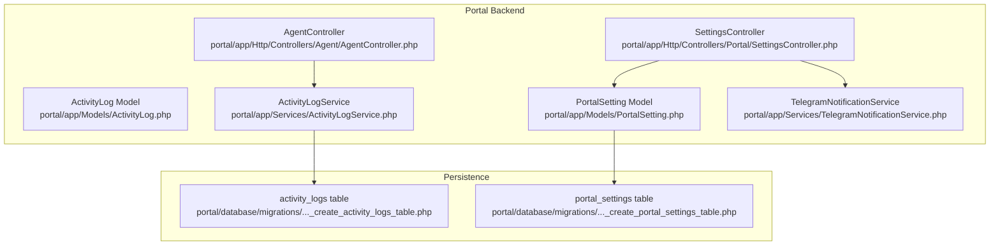
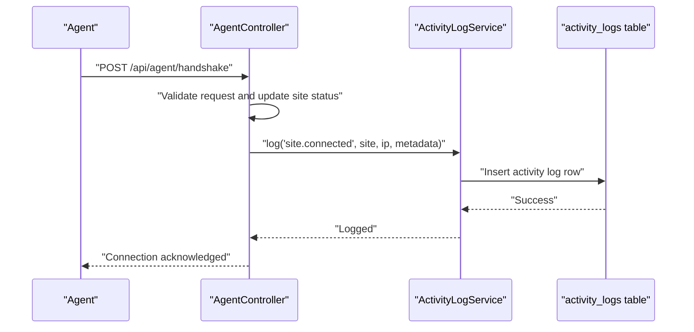
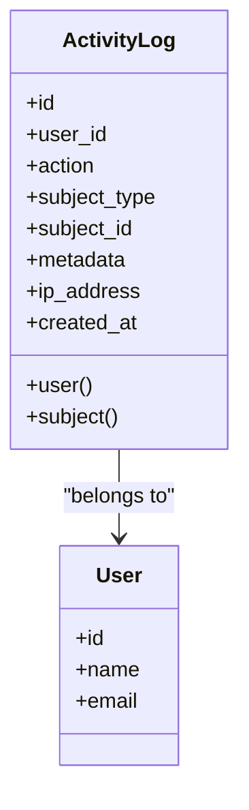
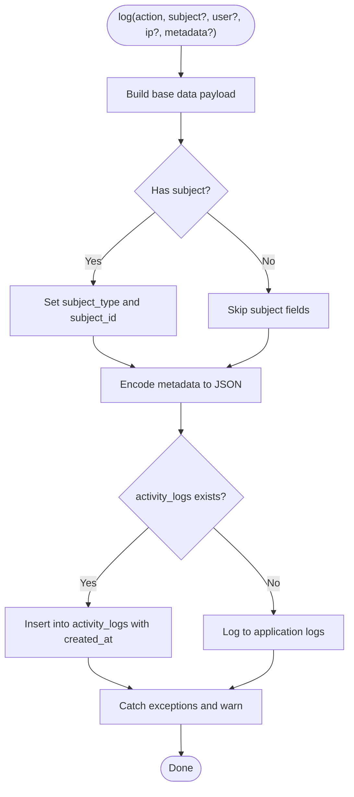
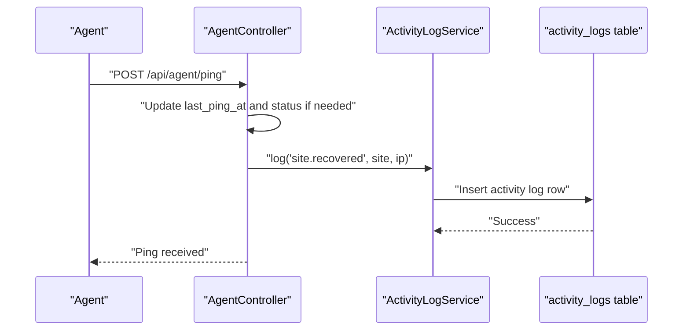
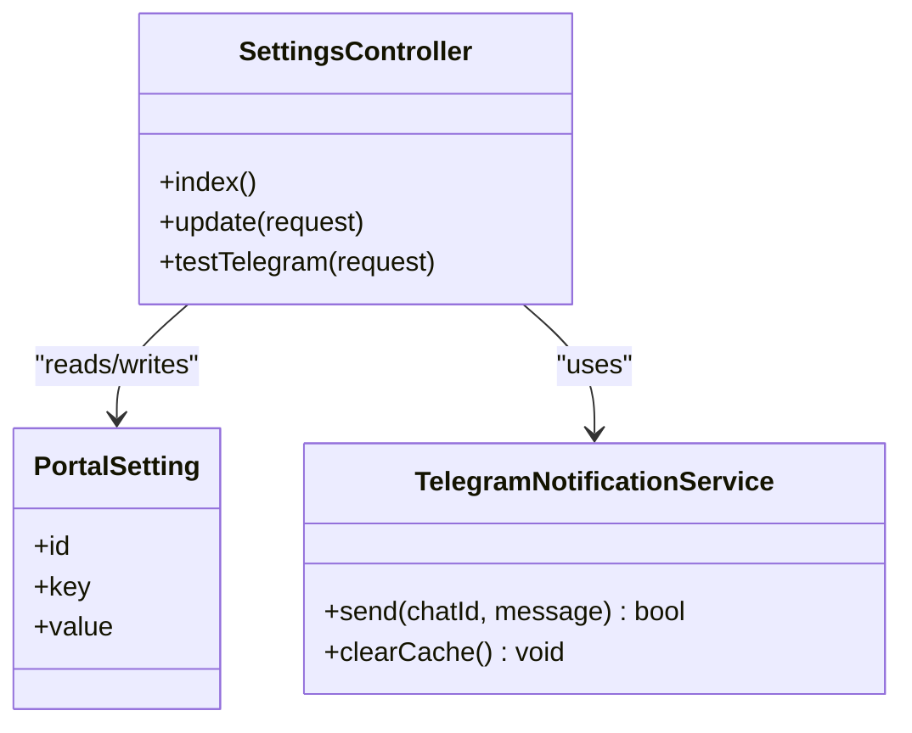
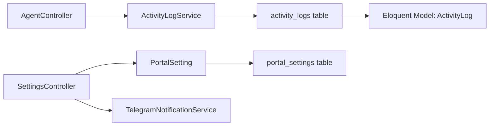

# Compliance Features

<cite>
**Referenced Files in This Document**
- [ActivityLog.php](file://portal/app/Models/ActivityLog.php)
- [create_activity_logs_table.php](file://portal/database/migrations/2026_05_15_070004_create_activity_logs_table.php)
- [ActivityLogService.php](file://portal/app/Services/ActivityLogService.php)
- [AgentController.php](file://portal/app/Http/Controllers/Agent/AgentController.php)
- [PortalSetting.php](file://portal/app/Models/PortalSetting.php)
- [create_portal_settings_table.php](file://portal/database/migrations/2026_05_15_070005_create_portal_settings_table.php)
- [SettingsController.php](file://portal/app/Http/Controllers/Portal/SettingsController.php)
- [TelegramNotificationService.php](file://portal/app/Services/TelegramNotificationService.php)
- [2026_05_15_070004_create_activity_logs_table.php](file://portal/database/migrations/2026_05_15_070004_create_activity_logs_table.php)
- [2026_05_15_070005_create_portal_settings_table.php](file://portal/database/migrations/2026_05_15_070005_create_portal_settings_table.php)
</cite>

## Table of Contents
1. [Introduction](#introduction)
2. [Project Structure](#project-structure)
3. [Core Components](#core-components)
4. [Architecture Overview](#architecture-overview)
5. [Detailed Component Analysis](#detailed-component-analysis)
6. [Dependency Analysis](#dependency-analysis)
7. [Performance Considerations](#performance-considerations)
8. [Troubleshooting Guide](#troubleshooting-guide)
9. [Conclusion](#conclusion)
10. [Appendices](#appendices)

## Introduction
This document describes the compliance-related features within the auditing system. It focuses on the capability to record and retain activity logs, the mechanisms for generating compliance reports, and the integration points with external systems. It also explains how to configure retention periods for different types of audit events, how automated cleanup processes could be implemented, and how to prepare compliance reporting templates and export formats for regulatory submissions. Guidance is included for aligning audit policies with various compliance standards and industry regulations, along with legal and regulatory considerations for maintaining audit integrity and admissibility in legal proceedings.

## Project Structure
The compliance and auditing features are primarily implemented in the backend service layer and persistence layer of the portal application. The key elements include:
- An activity logging model and migration for storing auditable events
- A service responsible for writing activity logs
- Controllers that trigger logging during agent lifecycle events
- A settings subsystem to manage operational parameters that influence audit behavior
- A notification service used for alerting and compliance-related communications

**Diagram sources**
- [ActivityLog.php:1-37](file://portal/app/Models/ActivityLog.php#L1-L37)
- [ActivityLogService.php:1-50](file://portal/app/Services/ActivityLogService.php#L1-L50)
- [AgentController.php:1-99](file://portal/app/Http/Controllers/Agent/AgentController.php#L1-L99)
- [PortalSetting.php:1-11](file://portal/app/Models/PortalSetting.php#L1-L11)
- [SettingsController.php:1-87](file://portal/app/Http/Controllers/Portal/SettingsController.php#L1-L87)
- [create_activity_logs_table.php:1-32](file://portal/database/migrations/2026_05_15_070004_create_activity_logs_table.php#L1-L32)
- [create_portal_settings_table.php:1-24](file://portal/database/migrations/2026_05_15_070005_create_portal_settings_table.php#L1-L24)

**Section sources**
- [ActivityLog.php:1-37](file://portal/app/Models/ActivityLog.php#L1-L37)
- [ActivityLogService.php:1-50](file://portal/app/Services/ActivityLogService.php#L1-L50)
- [AgentController.php:1-99](file://portal/app/Http/Controllers/Agent/AgentController.php#L1-L99)
- [PortalSetting.php:1-11](file://portal/app/Models/PortalSetting.php#L1-L11)
- [SettingsController.php:1-87](file://portal/app/Http/Controllers/Portal/SettingsController.php#L1-L87)
- [create_activity_logs_table.php:1-32](file://portal/database/migrations/2026_05_15_070004_create_activity_logs_table.php#L1-L32)
- [create_portal_settings_table.php:1-24](file://portal/database/migrations/2026_05_15_070005_create_portal_settings_table.php#L1-L24)

## Core Components
- ActivityLog model: Defines the schema and relationships for auditable events, including user association and polymorphic subject linkage.
- ActivityLogService: Provides a centralized method to persist activity logs with metadata and IP address capture, falling back to application logs if the database is unavailable.
- AgentController: Triggers logging for agent handshake and periodic ping events, capturing contextual metadata such as WordPress and PHP versions.
- PortalSetting and SettingsController: Manage operational settings that can influence audit behavior (e.g., agent ping interval), and integrate with external notification systems.
- TelegramNotificationService: Supports alerting and notifications that can be used for compliance monitoring and incident response.

Key compliance-relevant capabilities:
- Structured logging with timestamps, user identity, subject context, and metadata
- Centralized logging pipeline with fallback to application logs
- Indexes on frequently queried columns to support audit queries
- Settings-driven operational parameters that can be tuned for compliance needs

**Section sources**
- [ActivityLog.php:1-37](file://portal/app/Models/ActivityLog.php#L1-L37)
- [ActivityLogService.php:1-50](file://portal/app/Services/ActivityLogService.php#L1-L50)
- [AgentController.php:1-99](file://portal/app/Http/Controllers/Agent/AgentController.php#L1-L99)
- [PortalSetting.php:1-11](file://portal/app/Models/PortalSetting.php#L1-L11)
- [SettingsController.php:1-87](file://portal/app/Http/Controllers/Portal/SettingsController.php#L1-L87)

## Architecture Overview
The auditing system follows a layered architecture:
- Presentation: AgentController exposes endpoints for agent lifecycle events
- Application: ActivityLogService encapsulates logging logic
- Persistence: Eloquent model and migration define the audit trail schema
- Configuration: SettingsController and PortalSetting manage operational parameters

**Diagram sources**
- [AgentController.php:16-55](file://portal/app/Http/Controllers/Agent/AgentController.php#L16-L55)
- [ActivityLogService.php:16-48](file://portal/app/Services/ActivityLogService.php#L16-L48)
- [create_activity_logs_table.php:11-24](file://portal/database/migrations/2026_05_15_070004_create_activity_logs_table.php#L11-L24)

## Detailed Component Analysis

### ActivityLog Model and Schema
The ActivityLog model defines the audit record structure and relationships:
- Fields include user association, action identifier, subject polymorphism, metadata JSON, IP address, and creation timestamp
- Indexes are defined on subject_type/subject_id, action, and user_id to optimize audit queries
- Timestamps are managed via casting and insertion logic

**Diagram sources**
- [ActivityLog.php:9-36](file://portal/app/Models/ActivityLog.php#L9-L36)

**Section sources**
- [ActivityLog.php:1-37](file://portal/app/Models/ActivityLog.php#L1-L37)
- [create_activity_logs_table.php:11-24](file://portal/database/migrations/2026_05_15_070004_create_activity_logs_table.php#L11-L24)

### ActivityLogService: Logging Pipeline
ActivityLogService centralizes logging with:
- Action identification and optional subject context
- Optional user and IP address capture
- Metadata encoding to JSON for persistence
- Fallback to application logs if the activity_logs table does not exist
- Robust error handling with warnings

**Diagram sources**
- [ActivityLogService.php:16-48](file://portal/app/Services/ActivityLogService.php#L16-L48)

**Section sources**
- [ActivityLogService.php:1-50](file://portal/app/Services/ActivityLogService.php#L1-L50)

### AgentController: Audit Events
AgentController triggers audit events for:
- Handshake: Logs site connection with WordPress and PHP versions
- Ping: Updates site status and logs recovery when transitioning from disconnected to connected

**Diagram sources**
- [AgentController.php:61-97](file://portal/app/Http/Controllers/Agent/AgentController.php#L61-L97)
- [ActivityLogService.php:16-48](file://portal/app/Services/ActivityLogService.php#L16-L48)

**Section sources**
- [AgentController.php:1-99](file://portal/app/Http/Controllers/Agent/AgentController.php#L1-L99)

### PortalSetting and SettingsController: Operational Parameters
PortalSetting provides a generic key-value store suitable for compliance-related parameters. SettingsController:
- Exposes endpoints to retrieve and update settings
- Validates keys such as agent ping interval and maximum deployment retries
- Masks sensitive values when retrieving settings
- Integrates with TelegramNotificationService for alerting

**Diagram sources**
- [PortalSetting.php:7-10](file://portal/app/Models/PortalSetting.php#L7-L10)
- [SettingsController.php:18-85](file://portal/app/Http/Controllers/Portal/SettingsController.php#L18-L85)
- [TelegramNotificationService.php](file://portal/app/Services/TelegramNotificationService.php)

**Section sources**
- [PortalSetting.php:1-11](file://portal/app/Models/PortalSetting.php#L1-L11)
- [SettingsController.php:1-87](file://portal/app/Http/Controllers/Portal/SettingsController.php#L1-L87)

## Dependency Analysis
The following diagram shows the primary dependencies among compliance-related components:

**Diagram sources**
- [AgentController.php:6-8](file://portal/app/Http/Controllers/Agent/AgentController.php#L6-L8)
- [ActivityLogService.php:5-9](file://portal/app/Services/ActivityLogService.php#L5-L9)
- [ActivityLog.php:5-7](file://portal/app/Models/ActivityLog.php#L5-L7)
- [SettingsController.php:5-8](file://portal/app/Http/Controllers/Portal/SettingsController.php#L5-L8)
- [PortalSetting.php:5-6](file://portal/app/Models/PortalSetting.php#L5-L6)
- [create_activity_logs_table.php:11-24](file://portal/database/migrations/2026_05_15_070004_create_activity_logs_table.php#L11-L24)
- [create_portal_settings_table.php:11-16](file://portal/database/migrations/2026_05_15_070005_create_portal_settings_table.php#L11-L16)

**Section sources**
- [AgentController.php:1-99](file://portal/app/Http/Controllers/Agent/AgentController.php#L1-L99)
- [ActivityLogService.php:1-50](file://portal/app/Services/ActivityLogService.php#L1-L50)
- [ActivityLog.php:1-37](file://portal/app/Models/ActivityLog.php#L1-L37)
- [SettingsController.php:1-87](file://portal/app/Http/Controllers/Portal/SettingsController.php#L1-L87)
- [PortalSetting.php:1-11](file://portal/app/Models/PortalSetting.php#L1-L11)
- [create_activity_logs_table.php:1-32](file://portal/database/migrations/2026_05_15_070004_create_activity_logs_table.php#L1-L32)
- [create_portal_settings_table.php:1-24](file://portal/database/migrations/2026_05_15_070005_create_portal_settings_table.php#L1-L24)

## Performance Considerations
- Logging throughput: ActivityLogService writes directly to the database when the table exists, minimizing overhead. Consider batching or asynchronous jobs for high-volume environments.
- Query performance: Indexes on subject_type/subject_id, action, and user_id improve audit query performance. Ensure appropriate indexing for filtered searches.
- Storage costs: Retention policies and automated cleanup reduce long-term storage costs and improve query performance.
- Observability: The fallback to application logs ensures visibility even if the audit table is temporarily unavailable.

[No sources needed since this section provides general guidance]

## Troubleshooting Guide
Common issues and resolutions:
- Missing activity_logs table: ActivityLogService falls back to application logs. Verify database migration status and re-run migrations if needed.
- Logging failures: Exceptions during logging are caught and logged as warnings. Review application logs for error messages and retry conditions.
- Settings masking: Sensitive values are masked when retrieved. Use the update endpoint to modify settings and confirm changes.
- Notification delivery: Use the test endpoint to validate Telegram configuration before relying on alerts for compliance monitoring.

**Section sources**
- [ActivityLogService.php:43-47](file://portal/app/Services/ActivityLogService.php#L43-L47)
- [SettingsController.php:22-27](file://portal/app/Http/Controllers/Portal/SettingsController.php#L22-L27)
- [SettingsController.php:69-85](file://portal/app/Http/Controllers/Portal/SettingsController.php#L69-L85)

## Conclusion
The auditing system provides a solid foundation for compliance with structured logging, indexed audit trails, and operational settings that can be tuned for regulatory needs. While explicit retention policies and automated cleanup are not currently implemented in the codebase, the schema and service layer offer clear extension points to implement configurable retention periods and scheduled cleanup jobs. Compliance reporting can leverage the existing audit records and settings, with export formats tailored to specific regulatory requirements.

[No sources needed since this section summarizes without analyzing specific files]

## Appendices

### Configuring Audit Policies for Compliance Standards
- Define retention periods per event category (e.g., authentication, configuration changes, administrative actions)
- Implement scheduled cleanup jobs to remove expired records while preserving immutability guarantees
- Establish export templates aligned with regulatory formats (CSV, XML, PDF) and secure transport mechanisms
- Maintain audit integrity by preventing modification of historical records and ensuring non-repudiation controls

[No sources needed since this section provides general guidance]

### Legal and Regulatory Considerations
- Admissibility: Preserve original logs, maintain chain of custody, and avoid alterations to ensure evidentiary value
- Privacy: Apply data minimization and anonymization where applicable; ensure lawful basis for processing
- Cross-border transfers: Comply with data transfer restrictions and local privacy laws
- Auditability: Provide searchable, timestamped, and attributable records with sufficient context for investigations

[No sources needed since this section provides general guidance]