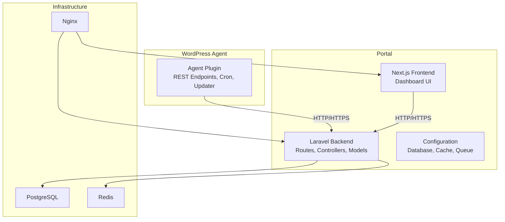
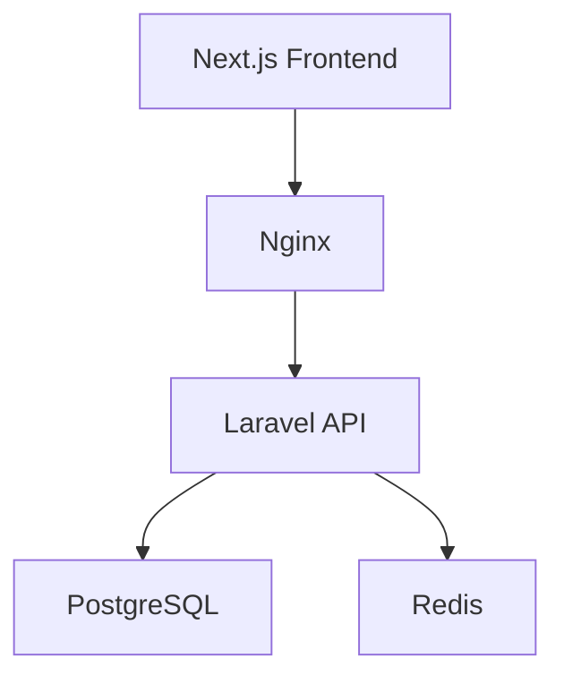
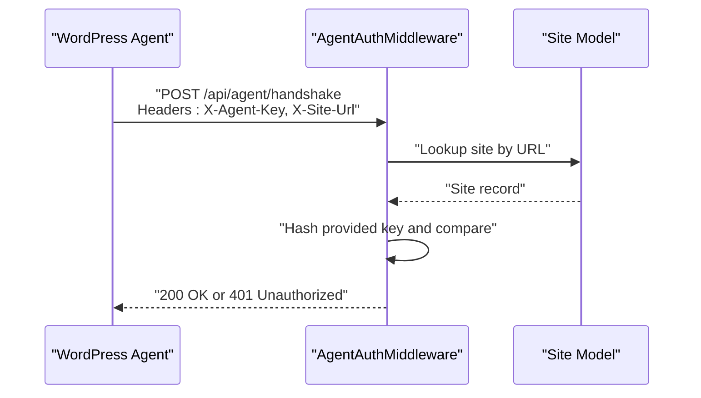
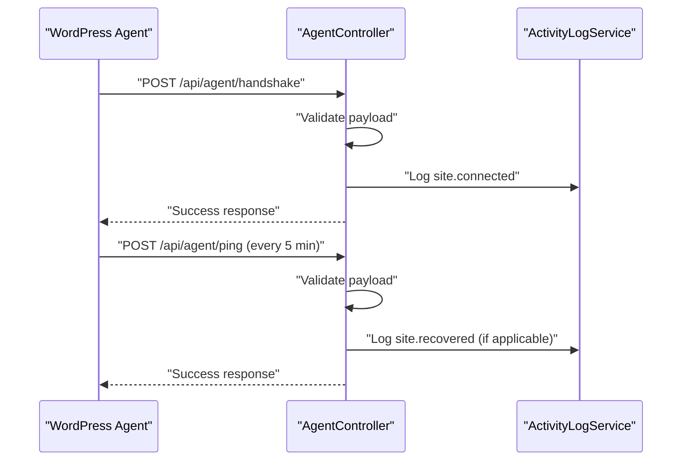
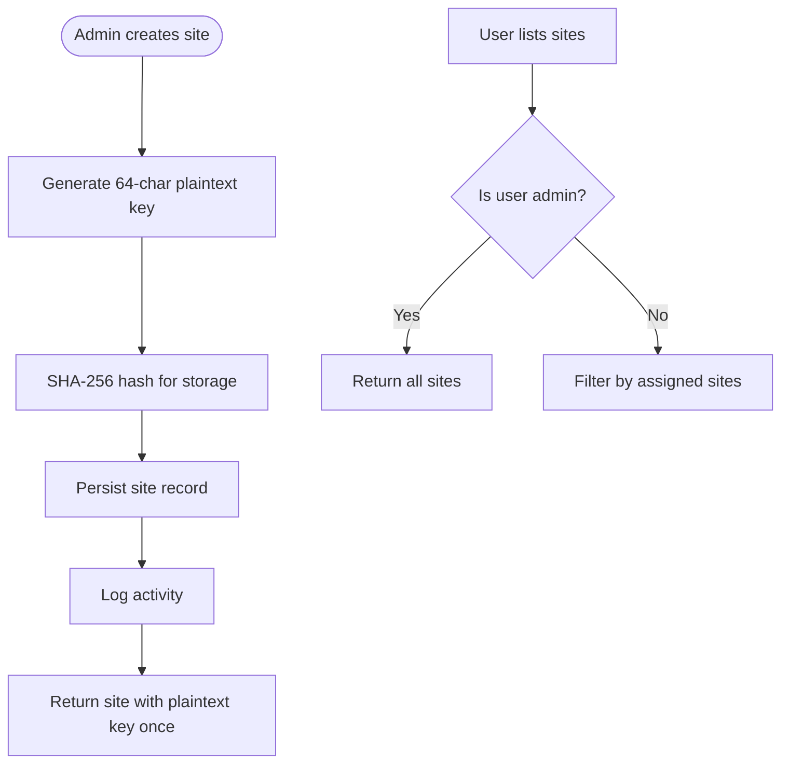
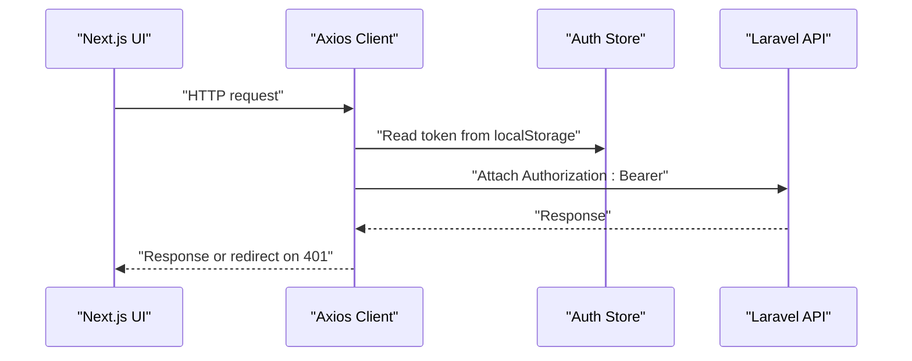
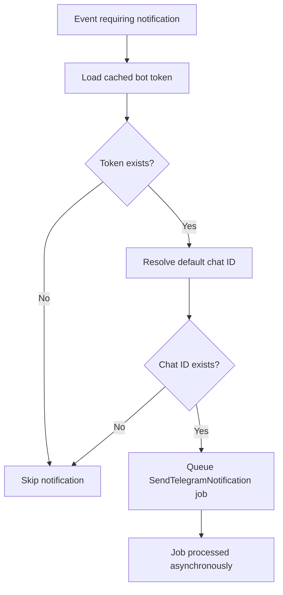
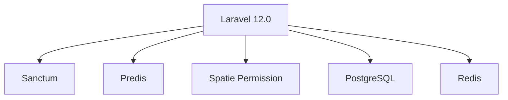
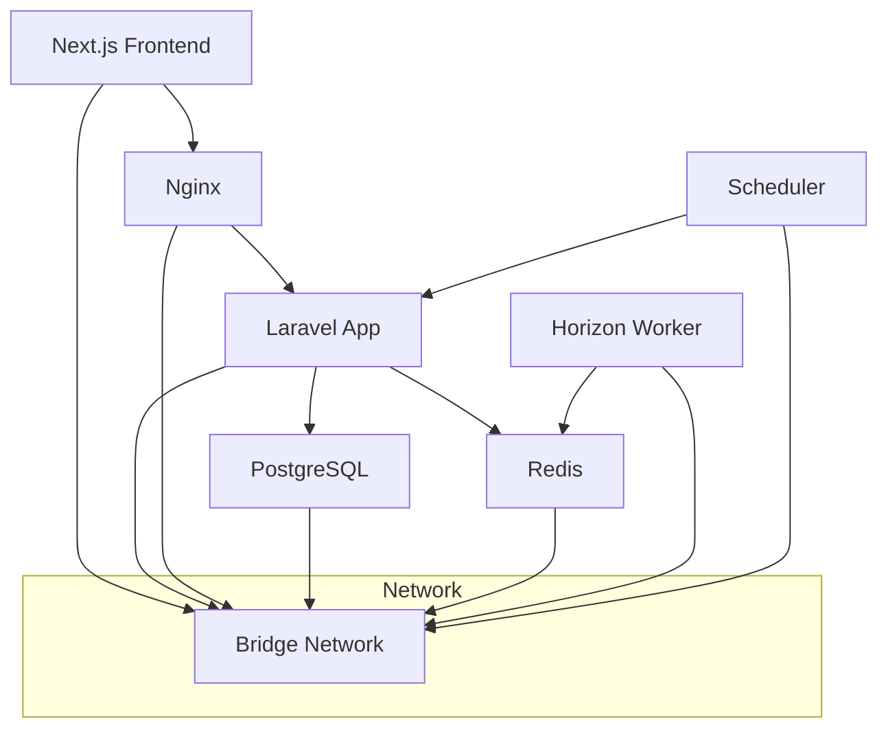
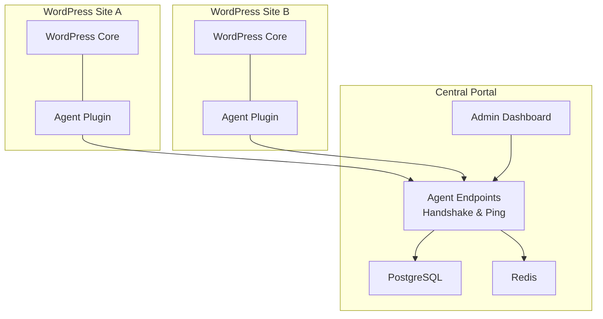

# Architecture Overview

<cite>
**Referenced Files in This Document**
- [composer.json](file://portal/composer.json)
- [package.json](file://portal/package.json)
- [docker-compose.yml](file://docker-compose.yml)
- [epos-wp-agent.php](file://agent/epos-wp-agent/epos-wp-agent.php)
- [AgentAuthMiddleware.php](file://portal/app/Http/Middleware/AgentAuthMiddleware.php)
- [AgentController.php](file://portal/app/Http/Controllers/Agent/AgentController.php)
- [SiteController.php](file://portal/app/Http/Controllers/Portal/SiteController.php)
- [api.php](file://portal/routes/api.php)
- [agent.php](file://portal/routes/agent.php)
- [database.php](file://portal/config/database.php)
- [cache.php](file://portal/config/cache.php)
- [api.ts](file://portal/frontend/src/lib/api.ts)
- [README.md](file://portal/frontend/README.md)
- [TelegramNotificationService.php](file://portal/app/Services/TelegramNotificationService.php)
</cite>

## Table of Contents
1. [Introduction](#introduction)
2. [Project Structure](#project-structure)
3. [Core Components](#core-components)
4. [Architecture Overview](#architecture-overview)
5. [Detailed Component Analysis](#detailed-component-analysis)
6. [Dependency Analysis](#dependency-analysis)
7. [Performance Considerations](#performance-considerations)
8. [Security Considerations](#security-considerations)
9. [Deployment Topology](#deployment-topology)
10. [System Context and Microservices-like Design](#system-context-and-microservices-like-design)
11. [Troubleshooting Guide](#troubleshooting-guide)
12. [Conclusion](#conclusion)

## Introduction
This document presents the architecture of the EPOS Portal system, a centralized management platform for multiple WordPress websites. The system comprises three primary components:
- Laravel 12.0 backend API providing authentication, resource management, and agent communication endpoints.
- Next.js 14+ frontend application serving the administrative dashboard and user interface.
- WordPress agent plugin installed on each managed WordPress site, acting as an independent agent that communicates with the central portal.

The architecture follows a microservices-like pattern where each WordPress site operates independently while exchanging data with the central portal through secure, standardized endpoints. The portal manages site lifecycle, user access, notifications, and operational visibility.

## Project Structure
The repository is organized into three main areas:
- portal: Laravel backend, Next.js frontend, configuration, and assets.
- agent/epos-wp-agent: WordPress plugin implementing agent capabilities.
- docker: Containerization configuration for local development and deployment.

**Diagram sources**
- [docker-compose.yml:1-109](file://docker-compose.yml#L1-L109)
- [epos-wp-agent.php:1-61](file://agent/epos-wp-agent/epos-wp-agent.php#L1-L61)
- [AgentController.php:1-99](file://portal/app/Http/Controllers/Agent/AgentController.php#L1-L99)
- [api.php:1-48](file://portal/routes/api.php#L1-L48)

**Section sources**
- [docker-compose.yml:1-109](file://docker-compose.yml#L1-L109)
- [README.md:1-37](file://portal/frontend/README.md#L1-L37)

## Core Components
- Laravel Backend API
  - Authentication and authorization via Sanctum tokens and role-based middleware.
  - REST endpoints for managing hostings, users, settings, and sites.
  - Agent-specific endpoints secured by a custom AgentAuthMiddleware validating X-Agent-Key and X-Site-Url headers.
  - Queues and scheduled tasks for asynchronous operations and maintenance.
- Next.js Frontend Application
  - Administrative dashboard built with React 18+ and TypeScript.
  - Axios-based API client with automatic bearer token injection and 401 handling.
  - TailwindCSS and Vite for styling and asset bundling.
- WordPress Agent Plugin
  - Initializes REST endpoints, cron ping, and plugin management.
  - Authenticates with the portal using a shared secret key and site URL.
  - Periodically reports health, plugin status, and order data (future phases).

Technology stack highlights:
- Backend: Laravel 12.0, Sanctum, Redis, PostgreSQL, Horizon queues.
- Frontend: Next.js 14+, React 18+, TypeScript, TailwindCSS, Vite.
- Infrastructure: Nginx, Docker containers for app, frontend, database, and cache.

**Section sources**
- [composer.json:8-15](file://portal/composer.json#L8-L15)
- [package.json:1-18](file://portal/package.json#L1-L18)
- [AgentAuthMiddleware.php:10-56](file://portal/app/Http/Middleware/AgentAuthMiddleware.php#L10-L56)
- [AgentController.php:10-99](file://portal/app/Http/Controllers/Agent/AgentController.php#L10-L99)
- [api.ts:1-37](file://portal/frontend/src/lib/api.ts#L1-L37)

## Architecture Overview
The system employs a layered architecture:
- Presentation Layer: Next.js frontend handles user interactions and displays data fetched from the backend.
- Application Layer: Laravel controllers orchestrate business logic, enforce authorization, and manage resources.
- Data Access Layer: Eloquent models interact with PostgreSQL; Redis supports caching and queues.
- Integration Layer: WordPress agents expose REST endpoints and communicate with the portal using a custom authentication scheme.

Communication flows:
- Portal-to-Agent: HTTPS requests from agents to the portal’s agent endpoints using X-Agent-Key and X-Site-Url headers.
- Portal-to-Frontend: HTTPS requests from the frontend to the backend API using Sanctum bearer tokens.
- Internal: Laravel queues and scheduled tasks manage background jobs and periodic maintenance.

**Diagram sources**
- [docker-compose.yml:15-26](file://docker-compose.yml#L15-L26)
- [database.php:87-100](file://portal/config/database.php#L87-L100)
- [cache.php:75-79](file://portal/config/cache.php#L75-L79)

## Detailed Component Analysis

### Agent Authentication and Handshake
The agent authentication mechanism ensures secure, per-site communication:
- Headers: X-Agent-Key (plain key) and X-Site-Url (site URL).
- Validation: Lookup site by normalized URL, compute SHA-256 hash of the provided key, compare with stored hash.
- Outcome: On success, attaches site context to the request; otherwise returns 401.

**Diagram sources**
- [AgentAuthMiddleware.php:20-55](file://portal/app/Http/Middleware/AgentAuthMiddleware.php#L20-L55)
- [SiteController.php:62-92](file://portal/app/Http/Controllers/Portal/SiteController.php#L62-L92)

**Section sources**
- [AgentAuthMiddleware.php:10-56](file://portal/app/Http/Middleware/AgentAuthMiddleware.php#L10-L56)
- [Site.php:12-76](file://portal/app/Models/Site.php#L12-L76)

### Agent Handshake and Heartbeat
Agents perform two primary operations:
- Handshake: Establishes connection, updates site metadata (versions, WooCommerce status), and records activity.
- Ping: Periodic heartbeat that refreshes last_ping_at and recovers status if previously disconnected.

**Diagram sources**
- [AgentController.php:16-97](file://portal/app/Http/Controllers/Agent/AgentController.php#L16-L97)

**Section sources**
- [AgentController.php:10-99](file://portal/app/Http/Controllers/Agent/AgentController.php#L10-L99)

### Site Management API
The portal exposes CRUD endpoints for sites, including:
- Creation with a generated 64-character plaintext API key (shown once) and hashed storage.
- Listing with filtering by status, hosting, tags, and search.
- Access control ensuring non-admin users only see assigned sites.
- Regeneration of API keys with appropriate authorization.

**Diagram sources**
- [SiteController.php:62-92](file://portal/app/Http/Controllers/Portal/SiteController.php#L62-L92)
- [SiteController.php:23-56](file://portal/app/Http/Controllers/Portal/SiteController.php#L23-L56)

**Section sources**
- [SiteController.php:14-204](file://portal/app/Http/Controllers/Portal/SiteController.php#L14-L204)

### Frontend API Client
The Next.js frontend communicates with the backend using an Axios instance:
- Base URL configurable via environment variable.
- Automatic bearer token injection from localStorage.
- Global 401 handler to redirect unauthenticated users to the login page.

**Diagram sources**
- [api.ts:12-34](file://portal/frontend/src/lib/api.ts#L12-L34)

**Section sources**
- [api.ts:1-37](file://portal/frontend/src/lib/api.ts#L1-L37)

### Notification Service
The portal integrates with Telegram for administrative alerts:
- Synchronous send for testing and queued dispatch for production.
- Cached bot token and default chat ID to minimize database queries.
- Job-based queuing via Horizon for reliable delivery.

**Diagram sources**
- [TelegramNotificationService.php:53-76](file://portal/app/Services/TelegramNotificationService.php#L53-L76)

**Section sources**
- [TelegramNotificationService.php:11-107](file://portal/app/Services/TelegramNotificationService.php#L11-L107)

## Dependency Analysis
External dependencies and integrations:
- Laravel 12.0 with Sanctum for authentication and Predis for Redis.
- Spatie Permission for role-based access control.
- PostgreSQL for persistent data and Redis for caching and queues.
- Horizon for queue management and scheduled tasks.

**Diagram sources**
- [composer.json:8-15](file://portal/composer.json#L8-L15)
- [database.php:87-100](file://portal/config/database.php#L87-L100)
- [cache.php:75-79](file://portal/config/cache.php#L75-L79)

**Section sources**
- [composer.json:8-15](file://portal/composer.json#L8-L15)
- [database.php:146-182](file://portal/config/database.php#L146-L182)
- [cache.php:35-102](file://portal/config/cache.php#L35-L102)

## Performance Considerations
- Caching: Redis-backed cache stores and database cache tables reduce query load.
- Queues: Horizon processes background jobs asynchronously to improve responsiveness.
- Pagination: Site listings use paginated queries to limit payload sizes.
- Indexing: JSON contains queries for tags and optimized lookups for site URLs.
- CDN and reverse proxy: Nginx serves static assets and load balances requests.

[No sources needed since this section provides general guidance]

## Security Considerations
- Agent Authentication: X-Agent-Key and X-Site-Url headers with SHA-256 hashing prevents replay attacks and ensures per-site isolation.
- API Keys: Plaintext keys are returned only once during creation; subsequent access relies on hashed values.
- Authorization: Role-based middleware restricts access to administrative functions.
- Transport: HTTPS enforced via Nginx; secrets stored in environment variables.
- Secrets Management: Environment variables in docker-compose; sensitive data not exposed to clients.

**Section sources**
- [AgentAuthMiddleware.php:10-56](file://portal/app/Http/Middleware/AgentAuthMiddleware.php#L10-L56)
- [SiteController.php:62-92](file://portal/app/Http/Controllers/Portal/SiteController.php#L62-L92)
- [docker-compose.yml:47-51](file://docker-compose.yml#L47-L51)

## Deployment Topology
The system runs in Docker containers orchestrated by docker-compose:
- app: Laravel application with PHP runtime.
- nginx: Reverse proxy and static asset serving.
- frontend: Node.js container for Next.js development.
- postgres: Persistent relational database.
- redis: In-memory cache and queue broker.
- queue: Horizon worker for queues.
- scheduler: Continuous scheduler for cron jobs.

**Diagram sources**
- [docker-compose.yml:1-109](file://docker-compose.yml#L1-L109)

**Section sources**
- [docker-compose.yml:1-109](file://docker-compose.yml#L1-L109)

## System Context and Microservices-like Design
Each WordPress site acts as an independent agent:
- Self-contained WordPress installation with the EPOS agent plugin.
- Independent lifecycle: activation, periodic pings, plugin updates, and order synchronization (planned).
- Centralized management: the portal tracks site status, enforces access policies, and aggregates telemetry.

**Diagram sources**
- [epos-wp-agent.php:26-53](file://agent/epos-wp-agent/epos-wp-agent.php#L26-L53)
- [AgentController.php:16-97](file://portal/app/Http/Controllers/Agent/AgentController.php#L16-L97)
- [api.php:1-48](file://portal/routes/api.php#L1-L48)

## Troubleshooting Guide
Common issues and resolutions:
- Authentication failures:
  - Verify X-Agent-Key and X-Site-Url headers match the stored hash and normalized URL.
  - Confirm site exists and is not soft-deleted.
- 401 responses in frontend:
  - Ensure bearer token is present in localStorage and attached by the API client.
  - Clear expired tokens and re-authenticate.
- Redis connectivity:
  - Confirm Redis service is reachable and credentials are set in environment variables.
- Database migrations:
  - Run migrations to initialize schema and seed initial data.
- Queue processing:
  - Start Horizon worker and monitor job status.

**Section sources**
- [AgentAuthMiddleware.php:20-55](file://portal/app/Http/Middleware/AgentAuthMiddleware.php#L20-L55)
- [api.ts:22-34](file://portal/frontend/src/lib/api.ts#L22-L34)
- [docker-compose.yml:56-80](file://docker-compose.yml#L56-L80)

## Conclusion
The EPOS Portal system provides a scalable, secure, and modular solution for managing multiple WordPress sites. Its microservices-like architecture enables independent site autonomy while centralizing governance, monitoring, and administration. The combination of Laravel, Next.js, WordPress agents, PostgreSQL, and Redis delivers a robust foundation for growth and operational excellence.