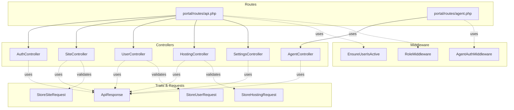
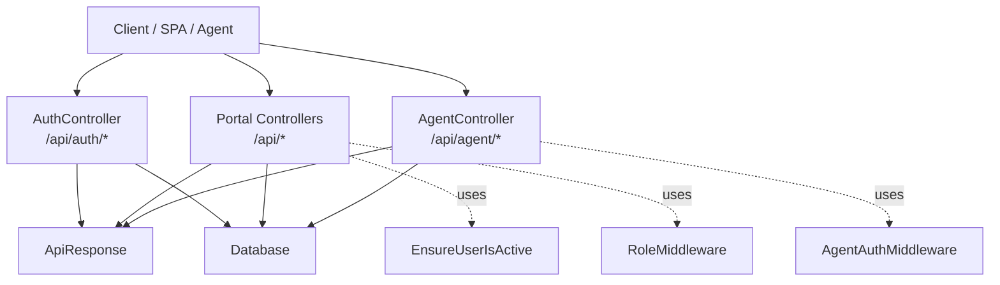
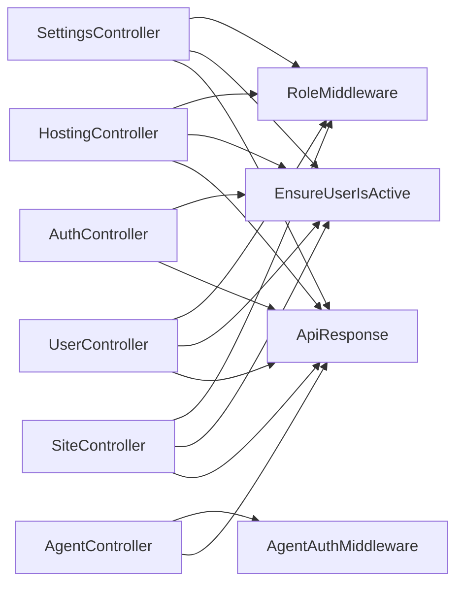

# API Endpoints Reference

<cite>
**Referenced Files in This Document**
- [routes/api.php](file://portal/routes/api.php)
- [routes/agent.php](file://portal/routes/agent.php)
- [AuthController.php](file://portal/app/Http/Controllers/Auth/AuthController.php)
- [SiteController.php](file://portal/app/Http/Controllers/Portal/SiteController.php)
- [UserController.php](file://portal/app/Http/Controllers/Portal/UserController.php)
- [HostingController.php](file://portal/app/Http/Controllers/Portal/HostingController.php)
- [SettingsController.php](file://portal/app/Http/Controllers/Portal/SettingsController.php)
- [AgentController.php](file://portal/app/Http/Controllers/Agent/AgentController.php)
- [AgentAuthMiddleware.php](file://portal/app/Http/Middleware/AgentAuthMiddleware.php)
- [EnsureUserIsActive.php](file://portal/app/Http/Middleware/EnsureUserIsActive.php)
- [RoleMiddleware.php](file://portal/app/Http/Middleware/RoleMiddleware.php)
- [ApiResponse.php](file://portal/app/Traits/ApiResponse.php)
- [StoreSiteRequest.php](file://portal/app/Http/Requests/Site/StoreSiteRequest.php)
- [StoreUserRequest.php](file://portal/app/Http/Requests/User/StoreUserRequest.php)
- [StoreHostingRequest.php](file://portal/app/Http/Requests/Hosting/StoreHostingRequest.php)
- [sanctum.php](file://portal/config/sanctum.php)
</cite>

## Table of Contents
1. [Introduction](#introduction)
2. [Project Structure](#project-structure)
3. [Core Components](#core-components)
4. [Architecture Overview](#architecture-overview)
5. [Detailed Component Analysis](#detailed-component-analysis)
6. [Dependency Analysis](#dependency-analysis)
7. [Performance Considerations](#performance-considerations)
8. [Troubleshooting Guide](#troubleshooting-guide)
9. [Conclusion](#conclusion)
10. [Appendices](#appendices)

## Introduction
This document provides a comprehensive reference for all REST endpoints in the Laravel backend. It covers HTTP methods, URL patterns, request/response schemas, authentication requirements, and operational behavior for:
- Authentication and user profile management
- Sites (CRUD with special key regeneration)
- Users (CRUD)
- Hostings (CRUD)
- Settings (portal-wide configuration)
- Agent communication endpoints (handshake and ping)

It also explains middleware-driven permissions, pagination, filtering, sorting, and security measures. Curl examples and client integration guidelines are included for practical usage.

## Project Structure
The API is organized under two route files:
- Public and authenticated routes for administrative and operational tasks
- Agent-specific routes for WordPress plugin communication

**Diagram sources**
- [routes/api.php:1-52](file://portal/routes/api.php#L1-L52)
- [routes/agent.php:1-20](file://portal/routes/agent.php#L1-L20)
- [AuthController.php:1-135](file://portal/app/Http/Controllers/Auth/AuthController.php#L1-L135)
- [SiteController.php:1-204](file://portal/app/Http/Controllers/Portal/SiteController.php#L1-L204)
- [UserController.php:1-137](file://portal/app/Http/Controllers/Portal/UserController.php#L1-L137)
- [HostingController.php:1-83](file://portal/app/Http/Controllers/Portal/HostingController.php#L1-L83)
- [SettingsController.php:1-87](file://portal/app/Http/Controllers/Portal/SettingsController.php#L1-L87)
- [AgentController.php:1-99](file://portal/app/Http/Controllers/Agent/AgentController.php#L1-L99)
- [AgentAuthMiddleware.php:1-57](file://portal/app/Http/Middleware/AgentAuthMiddleware.php#L1-L57)
- [EnsureUserIsActive.php:1-26](file://portal/app/Http/Middleware/EnsureUserIsActive.php#L1-L26)
- [RoleMiddleware.php:1-37](file://portal/app/Http/Middleware/RoleMiddleware.php#L1-L37)
- [ApiResponse.php:1-56](file://portal/app/Traits/ApiResponse.php#L1-L56)
- [StoreSiteRequest.php:1-28](file://portal/app/Http/Requests/Site/StoreSiteRequest.php#L1-L28)
- [StoreUserRequest.php:1-26](file://portal/app/Http/Requests/User/StoreUserRequest.php#L1-L26)
- [StoreHostingRequest.php:1-23](file://portal/app/Http/Requests/Hosting/StoreHostingRequest.php#L1-L23)

**Section sources**
- [routes/api.php:1-52](file://portal/routes/api.php#L1-L52)
- [routes/agent.php:1-20](file://portal/routes/agent.php#L1-L20)

## Core Components
- Authentication and user management endpoints under /api/auth
- Resource endpoints for sites, users, hostings, and settings
- Agent endpoints under /api/agent for WordPress plugin integration
- Shared response formatting via ApiResponse trait
- Request validation via FormRequest classes
- Middleware enforcing Sanctum auth, active user checks, and role-based access

**Section sources**
- [AuthController.php:15-135](file://portal/app/Http/Controllers/Auth/AuthController.php#L15-L135)
- [SiteController.php:18-204](file://portal/app/Http/Controllers/Portal/SiteController.php#L18-L204)
- [UserController.php:18-137](file://portal/app/Http/Controllers/Portal/UserController.php#L18-L137)
- [HostingController.php:17-83](file://portal/app/Http/Controllers/Portal/HostingController.php#L17-L83)
- [SettingsController.php:15-87](file://portal/app/Http/Controllers/Portal/SettingsController.php#L15-L87)
- [AgentController.php:12-99](file://portal/app/Http/Controllers/Agent/AgentController.php#L12-L99)
- [ApiResponse.php:7-56](file://portal/app/Traits/ApiResponse.php#L7-L56)
- [StoreSiteRequest.php:7-28](file://portal/app/Http/Requests/Site/StoreSiteRequest.php#L7-L28)
- [StoreUserRequest.php:7-26](file://portal/app/Http/Requests/User/StoreUserRequest.php#L7-L26)
- [StoreHostingRequest.php:7-23](file://portal/app/Http/Requests/Hosting/StoreHostingRequest.php#L7-L23)

## Architecture Overview
High-level API architecture and data flow:

**Diagram sources**
- [routes/api.php:12-51](file://portal/routes/api.php#L12-L51)
- [routes/agent.php:16-19](file://portal/routes/agent.php#L16-L19)
- [AuthController.php:15-135](file://portal/app/Http/Controllers/Auth/AuthController.php#L15-L135)
- [SiteController.php:14-204](file://portal/app/Http/Controllers/Portal/SiteController.php#L14-L204)
- [UserController.php:14-137](file://portal/app/Http/Controllers/Portal/UserController.php#L14-L137)
- [HostingController.php:13-83](file://portal/app/Http/Controllers/Portal/HostingController.php#L13-L83)
- [SettingsController.php:11-87](file://portal/app/Http/Controllers/Portal/SettingsController.php#L11-L87)
- [AgentController.php:10-99](file://portal/app/Http/Controllers/Agent/AgentController.php#L10-L99)
- [AgentAuthMiddleware.php:10-57](file://portal/app/Http/Middleware/AgentAuthMiddleware.php#L10-L57)
- [EnsureUserIsActive.php:9-26](file://portal/app/Http/Middleware/EnsureUserIsActive.php#L9-L26)
- [RoleMiddleware.php:9-37](file://portal/app/Http/Middleware/RoleMiddleware.php#L9-L37)
- [ApiResponse.php:7-56](file://portal/app/Traits/ApiResponse.php#L7-L56)

## Detailed Component Analysis

### Authentication Endpoints
- POST /api/auth/login
  - Purpose: Obtain a Sanctum token for the user
  - Auth: None
  - Request body: email, password
  - Response: token, user profile
  - Errors: Invalid credentials, deactivated account
  - Security: Tokens revoked on re-login; password hashing verified
  - Curl example:
    - curl -X POST https://your-domain/api/auth/login -H "Content-Type: application/json" -d '{"email":"user@example.com","password":"pass"}'

- POST /api/auth/logout
  - Purpose: Invalidate current token
  - Auth: Bearer token required
  - Response: success message
  - Errors: N/A

- GET /api/auth/me
  - Purpose: Get current user profile
  - Auth: Bearer token required
  - Response: user object
  - Errors: N/A

- PUT /api/auth/profile
  - Purpose: Update profile (name, telegram_chat_id)
  - Auth: Bearer token required
  - Response: updated user object
  - Errors: Validation errors

- PUT /api/auth/password
  - Purpose: Change password
  - Auth: Bearer token required
  - Request body: current_password, password (min length, confirmation)
  - Response: success message
  - Errors: Incorrect current password

**Section sources**
- [AuthController.php:15-135](file://portal/app/Http/Controllers/Auth/AuthController.php#L15-L135)
- [routes/api.php:12-18](file://portal/routes/api.php#L12-L18)

### Sites Endpoints
- GET /api/sites
  - Purpose: List sites with filters, search, pagination
  - Auth: Bearer token required; active user enforced
  - Filters:
    - status: exact match
    - hosting_id: exact match
    - tag: JSON contains
    - search: name or url LIKE
  - Sorting: default created_at desc
  - Pagination: per_page=20
  - Access: Admin sees all; Dev/MKT see assigned sites only
  - Response: paginated sites with hosting and users count
  - Errors: N/A

- POST /api/sites
  - Purpose: Create a new site
  - Auth: Bearer token required; admin/dev allowed
  - Request body: name, url, hosting_id (optional), description (optional), tags (array), user_ids (array)
  - Response: site object; includes api_secret_key_plain (shown once)
  - Errors: Validation errors, unique URL constraint
  - Notes: Status set to pending; API key generated and stored as SHA-256 hash

- GET /api/sites/{site}
  - Purpose: View a single site
  - Auth: Bearer token required
  - Access: Admin or assigned user
  - Response: site with hosting and users loaded
  - Errors: 403 if unauthorized

- PUT /api/sites/{site}
  - Purpose: Update a site
  - Auth: Bearer token required; admin/dev allowed
  - Request body: same as creation except URL uniqueness not enforced here
  - Response: updated site with hosting and users loaded
  - Errors: Validation errors

- DELETE /api/sites/{site}
  - Purpose: Delete a site
  - Auth: Bearer token required; admin/dev allowed
  - Response: success message
  - Errors: N/A

- POST /api/sites/{site}/regenerate-key
  - Purpose: Regenerate API secret key (SHA-256)
  - Auth: Bearer token required; admin only
  - Response: new api_secret_key_plain and message
  - Errors: 403 if not admin

- GET /api/sites/{site}/activity
  - Purpose: View activity logs for a site
  - Auth: Bearer token required
  - Access: Admin or assigned user
  - Response: paginated activity logs with user
  - Errors: 403 if unauthorized

Curl examples:
- Create site:
  - curl -X POST https://your-domain/api/sites -H "Authorization: Bearer YOUR_TOKEN" -H "Content-Type: application/json" -d '{"name":"Site Name","url":"https://example.com","hosting_id":1}'
- Regenerate key:
  - curl -X POST https://your-domain/api/sites/1/regenerate-key -H "Authorization: Bearer YOUR_TOKEN"

**Section sources**
- [SiteController.php:18-204](file://portal/app/Http/Controllers/Portal/SiteController.php#L18-L204)
- [StoreSiteRequest.php:7-28](file://portal/app/Http/Requests/Site/StoreSiteRequest.php#L7-L28)
- [routes/api.php:32-38](file://portal/routes/api.php#L32-L38)
- [routes/api.php:47-50](file://portal/routes/api.php#L47-L50)

### Users Endpoints
- GET /api/users
  - Purpose: List users
  - Auth: Bearer token required; admin only
  - Response: array of users (selected fields)
  - Errors: N/A

- POST /api/users
  - Purpose: Create a user
  - Auth: Bearer token required; admin only
  - Request body: name, email, password, role (admin/dev/mkt), is_active (optional), telegram_chat_id (optional)
  - Response: created user object
  - Errors: Validation errors, unique email

- PUT /api/users/{user}
  - Purpose: Update a user
  - Auth: Bearer token required; admin only
  - Request body: name, email, role, is_active, telegram_chat_id, password (optional)
  - Response: updated user object
  - Errors: Validation errors

- DELETE /api/users/{user}
  - Purpose: Delete a user
  - Auth: Bearer token required; admin only
  - Restrictions: Cannot delete self
  - Response: success message
  - Errors: 400 if self deletion attempted

Curl examples:
- Create user:
  - curl -X POST https://your-domain/api/users -H "Authorization: Bearer YOUR_TOKEN" -H "Content-Type: application/json" -d '{"name":"John Doe","email":"john@example.com","password":"SecurePass!123","role":"dev"}'

**Section sources**
- [UserController.php:18-137](file://portal/app/Http/Controllers/Portal/UserController.php#L18-L137)
- [StoreUserRequest.php:7-26](file://portal/app/Http/Requests/User/StoreUserRequest.php#L7-L26)
- [routes/api.php:24-25](file://portal/routes/api.php#L24-L25)

### Hostings Endpoints
- GET /api/hostings
  - Purpose: List hostings with sites count
  - Auth: Bearer token required; admin only
  - Response: array of hostings
  - Errors: N/A

- POST /api/hostings
  - Purpose: Create a hosting
  - Auth: Bearer token required; admin only
  - Request body: name, provider (enum), note (optional)
  - Response: created hosting object
  - Errors: Validation errors, unique name

- GET /api/hostings/{hosting}
  - Purpose: View a hosting
  - Auth: Bearer token required; admin only
  - Response: hosting with sites count
  - Errors: N/A

- PUT /api/hostings/{hosting}
  - Purpose: Update a hosting
  - Auth: Bearer token required; admin only
  - Request body: same as creation
  - Response: updated hosting object
  - Errors: Validation errors

- DELETE /api/hostings/{hosting}
  - Purpose: Delete a hosting
  - Auth: Bearer token required; admin only
  - Behavior: Unlinks sites by setting hosting_id to null, then deletes hosting
  - Response: success message
  - Errors: N/A

Curl examples:
- Create hosting:
  - curl -X POST https://your-domain/api/hostings -H "Authorization: Bearer YOUR_TOKEN" -H "Content-Type: application/json" -d '{"name":"Cloudways","provider":"cloudways"}'

**Section sources**
- [HostingController.php:17-83](file://portal/app/Http/Controllers/Portal/HostingController.php#L17-L83)
- [StoreHostingRequest.php:7-23](file://portal/app/Http/Requests/Hosting/StoreHostingRequest.php#L7-L23)
- [routes/api.php:22-23](file://portal/routes/api.php#L22-L23)

### Settings Endpoints
- GET /api/settings
  - Purpose: Retrieve portal settings
  - Auth: Bearer token required; admin only
  - Response: key-value pairs; sensitive values masked
  - Errors: N/A

- PUT /api/settings
  - Purpose: Update portal settings
  - Auth: Bearer token required; admin only
  - Allowed keys: telegram_bot_token, telegram_default_chat_id, portal_base_url, agent_ping_interval_minutes (1–60), max_deployment_retries (0–10)
  - Response: success message
  - Errors: Validation errors

- POST /api/settings/telegram/test
  - Purpose: Send a test Telegram notification
  - Auth: Bearer token required; admin only
  - Request body: chat_id
  - Response: success or error message
  - Errors: 500 if sending fails

Curl examples:
- Update settings:
  - curl -X PUT https://your-domain/api/settings -H "Authorization: Bearer YOUR_TOKEN" -H "Content-Type: application/json" -d '{"agent_ping_interval_minutes":5,"max_deployment_retries":3}'

**Section sources**
- [SettingsController.php:15-87](file://portal/app/Http/Controllers/Portal/SettingsController.php#L15-L87)
- [routes/api.php:26-30](file://portal/routes/api.php#L26-L30)

### Agent Communication Endpoints
- POST /api/agent/handshake
  - Purpose: Establish connection from WP Agent on activation
  - Auth: X-Agent-Key and X-Site-Url headers required
  - Request body: wp_version, php_version, woo_active, company_plugins[]
  - Side effects: site.status set to connected, versions recorded, last_ping_at updated
  - Response: success message
  - Errors: 401 if missing/invalid headers or key

- POST /api/agent/ping
  - Purpose: Heartbeat from WP Agent (every 5 minutes)
  - Auth: Same as handshake
  - Request body: company_plugins[], orders[] (future use)
  - Side effects: last_ping_at updated; if previously disconnected, status becomes connected
  - Response: success message
  - Errors: 401 if missing/invalid headers or key

Curl examples:
- Handshake:
  - curl -X POST https://your-domain/api/agent/handshake -H "X-Agent-Key: YOUR_PLAIN_KEY" -H "X-Site-Url: https://shop.example.com" -H "Content-Type: application/json" -d '{"wp_version":"6.4.3","php_version":"8.1.12","woo_active":true}'
- Ping:
  - curl -X POST https://your-domain/api/agent/ping -H "X-Agent-Key: YOUR_PLAIN_KEY" -H "X-Site-Url: https://shop.example.com" -H "Content-Type: application/json" -d '{}'

**Section sources**
- [AgentController.php:12-99](file://portal/app/Http/Controllers/Agent/AgentController.php#L12-L99)
- [routes/agent.php:16-19](file://portal/routes/agent.php#L16-L19)
- [AgentAuthMiddleware.php:10-57](file://portal/app/Http/Middleware/AgentAuthMiddleware.php#L10-L57)

## Dependency Analysis
- Authentication and authorization:
  - Sanctum guard configured for stateful domains and bearer tokens
  - EnsureUserIsActive middleware revokes token and blocks inactive users
  - RoleMiddleware enforces admin/dev/mkt permissions
- Controllers depend on ApiResponse trait for consistent JSON responses
- Controllers delegate validation to FormRequest classes
- Agent endpoints rely on AgentAuthMiddleware for header-based authentication

**Diagram sources**
- [AuthController.php:11-135](file://portal/app/Http/Controllers/Auth/AuthController.php#L11-L135)
- [SiteController.php:14-204](file://portal/app/Http/Controllers/Portal/SiteController.php#L14-L204)
- [UserController.php:14-137](file://portal/app/Http/Controllers/Portal/UserController.php#L14-L137)
- [HostingController.php:13-83](file://portal/app/Http/Controllers/Portal/HostingController.php#L13-L83)
- [SettingsController.php:11-87](file://portal/app/Http/Controllers/Portal/SettingsController.php#L11-L87)
- [AgentController.php:10-99](file://portal/app/Http/Controllers/Agent/AgentController.php#L10-L99)
- [EnsureUserIsActive.php:9-26](file://portal/app/Http/Middleware/EnsureUserIsActive.php#L9-L26)
- [RoleMiddleware.php:9-37](file://portal/app/Http/Middleware/RoleMiddleware.php#L9-L37)
- [AgentAuthMiddleware.php:10-57](file://portal/app/Http/Middleware/AgentAuthMiddleware.php#L10-L57)
- [ApiResponse.php:7-56](file://portal/app/Traits/ApiResponse.php#L7-L56)

**Section sources**
- [sanctum.php:8-88](file://portal/config/sanctum.php#L8-L88)
- [EnsureUserIsActive.php:9-26](file://portal/app/Http/Middleware/EnsureUserIsActive.php#L9-L26)
- [RoleMiddleware.php:9-37](file://portal/app/Http/Middleware/RoleMiddleware.php#L9-L37)
- [AgentAuthMiddleware.php:10-57](file://portal/app/Http/Middleware/AgentAuthMiddleware.php#L10-L57)
- [ApiResponse.php:7-56](file://portal/app/Traits/ApiResponse.php#L7-L56)

## Performance Considerations
- Pagination defaults:
  - Sites listing and site activity use per_page=20
- Eager loading:
  - Sites listing loads hosting and counts users to reduce queries
  - Site show and hosting show load related models as needed
- Filtering and search:
  - Index-friendly filters include exact matches on status, hosting_id, and JSON contains on tags
  - Search uses OR on name and url; consider indexing for large datasets
- Validation:
  - FormRequest classes centralize validation rules and reduce controller logic
- Recommendations:
  - Add database indexes for frequent filters (status, hosting_id)
  - Consider caching settings retrieval for high-frequency reads
  - Monitor agent ping intervals and implement backoff for retries

[No sources needed since this section provides general guidance]

## Troubleshooting Guide
Common issues and resolutions:
- Authentication failures:
  - Login credentials incorrect: verify email and password
  - Account deactivated: contact admin to reactivate or revoke token
- Authorization failures:
  - Missing role: ensure user has admin/dev/mkt role as required
  - Self deletion attempt: cannot delete own user account
- Agent authentication:
  - Missing headers: ensure X-Agent-Key and X-Site-Url are present
  - Invalid key: confirm the plain key matches the stored SHA-256 hash
  - Site not found: verify the site URL matches exactly (trailing slash trimmed)
- Rate limiting:
  - Not implemented at the framework level; consider adding rate limiting middleware or platform-level throttling
- CORS and SPA:
  - Sanctum stateful domains configured; ensure frontend domain is included

**Section sources**
- [AuthController.php:27-35](file://portal/app/Http/Controllers/Auth/AuthController.php#L27-L35)
- [UserController.php:119-122](file://portal/app/Http/Controllers/Portal/UserController.php#L119-L122)
- [AgentAuthMiddleware.php:22-49](file://portal/app/Http/Middleware/AgentAuthMiddleware.php#L22-L49)
- [sanctum.php:21-26](file://portal/config/sanctum.php#L21-L26)

## Conclusion
This API provides a secure, role-aware interface for managing sites, users, hostings, and settings, alongside dedicated endpoints for agent communication. Responses are standardized via a shared trait, and validation is centralized in request classes. Implement rate limiting and caching strategies as needed for production scale.

[No sources needed since this section summarizes without analyzing specific files]

## Appendices

### API Versioning Strategy
- No explicit version prefix is used in URLs (e.g., /v1/). Current endpoints are unversioned.
- Recommendation: Introduce /v1/ prefix for stability and future breaking-change support.

[No sources needed since this section provides general guidance]

### Rate Limiting
- Not implemented in the current codebase.
- Recommendation: Use Laravel rate limiting middleware or platform-level quotas.

[No sources needed since this section provides general guidance]

### Security Measures
- Sanctum for stateful SPA and bearer tokens
- Active user enforcement via middleware
- Role-based access control
- Agent authentication via custom headers and SHA-256 comparison
- Password hashing and token revocation on re-authentication

**Section sources**
- [sanctum.php:8-88](file://portal/config/sanctum.php#L8-L88)
- [EnsureUserIsActive.php:9-26](file://portal/app/Http/Middleware/EnsureUserIsActive.php#L9-L26)
- [RoleMiddleware.php:9-37](file://portal/app/Http/Middleware/RoleMiddleware.php#L9-L37)
- [AgentAuthMiddleware.php:10-57](file://portal/app/Http/Middleware/AgentAuthMiddleware.php#L10-L57)

### Pagination, Filtering, and Sorting
- Pagination:
  - Sites listing: per_page=20
  - Site activity: per_page=20
- Filtering:
  - Sites: status, hosting_id, tag (JSON contains), search (name/url)
- Sorting:
  - Sites: created_at desc
  - Users: created_at desc
  - Hostings: created_at desc
  - Site activity: created_at desc

**Section sources**
- [SiteController.php:23-56](file://portal/app/Http/Controllers/Portal/SiteController.php#L23-L56)
- [SiteController.php:187-202](file://portal/app/Http/Controllers/Portal/SiteController.php#L187-L202)
- [UserController.php:21-28](file://portal/app/Http/Controllers/Portal/UserController.php#L21-L28)
- [HostingController.php:17-24](file://portal/app/Http/Controllers/Portal/HostingController.php#L17-L24)

### Request/Response Schemas

- Authentication
  - POST /api/auth/login
    - Request: email, password
    - Response: token, user
  - POST /api/auth/logout
    - Request: none
    - Response: success message
  - GET /api/auth/me
    - Request: none
    - Response: user
  - PUT /api/auth/profile
    - Request: name, telegram_chat_id
    - Response: user
  - PUT /api/auth/password
    - Request: current_password, password
    - Response: success message

- Sites
  - GET /api/sites
    - Query params: status, hosting_id, tag, search
    - Response: paginated sites with hosting and users_count
  - POST /api/sites
    - Request: name, url, hosting_id, description, tags, user_ids
    - Response: site + api_secret_key_plain (once)
  - GET /api/sites/{site}
    - Response: site with hosting and users
  - PUT /api/sites/{site}
    - Request: same as creation
    - Response: updated site
  - DELETE /api/sites/{site}
    - Response: success message
  - POST /api/sites/{site}/regenerate-key
    - Response: new api_secret_key_plain + message
  - GET /api/sites/{site}/activity
    - Response: paginated activity logs

- Users
  - GET /api/users
    - Response: users array
  - POST /api/users
    - Request: name, email, password, role, is_active, telegram_chat_id
    - Response: created user
  - PUT /api/users/{user}
    - Request: same as creation
    - Response: updated user
  - DELETE /api/users/{user}
    - Response: success message

- Hostings
  - GET /api/hostings
    - Response: hostings array
  - POST /api/hostings
    - Request: name, provider, note
    - Response: created hosting
  - GET /api/hostings/{hosting}
    - Response: hosting with sites_count
  - PUT /api/hostings/{hosting}
    - Request: same as creation
    - Response: updated hosting
  - DELETE /api/hostings/{hosting}
    - Response: success message

- Settings
  - GET /api/settings
    - Response: key-value settings (masked sensitive values)
  - PUT /api/settings
    - Request: allowed keys (see above)
    - Response: success message
  - POST /api/settings/telegram/test
    - Request: chat_id
    - Response: success or error

- Agent
  - POST /api/agent/handshake
    - Headers: X-Agent-Key, X-Site-Url
    - Request: wp_version, php_version, woo_active, company_plugins[]
    - Response: success message
  - POST /api/agent/ping
    - Headers: X-Agent-Key, X-Site-Url
    - Request: company_plugins[], orders[] (future)
    - Response: success message

**Section sources**
- [AuthController.php:15-135](file://portal/app/Http/Controllers/Auth/AuthController.php#L15-L135)
- [SiteController.php:18-204](file://portal/app/Http/Controllers/Portal/SiteController.php#L18-L204)
- [UserController.php:18-137](file://portal/app/Http/Controllers/Portal/UserController.php#L18-L137)
- [HostingController.php:17-83](file://portal/app/Http/Controllers/Portal/HostingController.php#L17-L83)
- [SettingsController.php:15-87](file://portal/app/Http/Controllers/Portal/SettingsController.php#L15-L87)
- [AgentController.php:12-99](file://portal/app/Http/Controllers/Agent/AgentController.php#L12-L99)

### Client Integration Guidelines
- SPA Integration:
  - Use Bearer token returned by /api/auth/login
  - Configure Sanctum stateful domains to include your frontend origin
- Agent Integration:
  - Send X-Agent-Key and X-Site-Url headers on all /api/agent/* requests
  - On activation, call /api/agent/handshake; subsequently call /api/agent/ping every 5 minutes
- Error Handling:
  - Inspect response.success and message; HTTP 4xx/5xx indicate failures
- Pagination:
  - Use meta.pagination fields to build navigation UI

**Section sources**
- [sanctum.php:21-26](file://portal/config/sanctum.php#L21-L26)
- [AgentAuthMiddleware.php:22-52](file://portal/app/Http/Middleware/AgentAuthMiddleware.php#L22-L52)
- [ApiResponse.php:9-54](file://portal/app/Traits/ApiResponse.php#L9-L54)