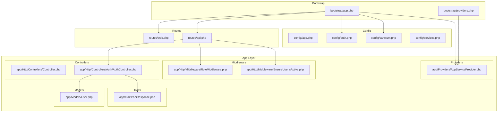
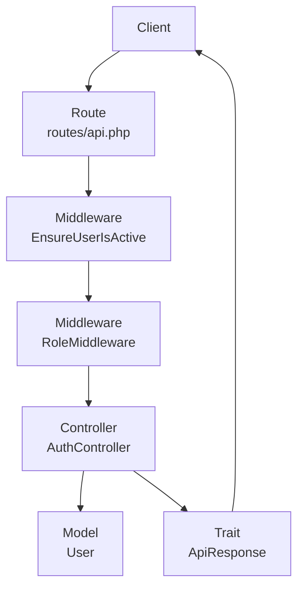
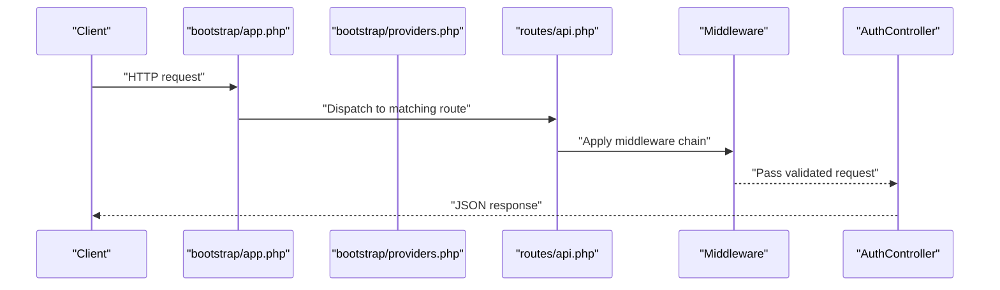
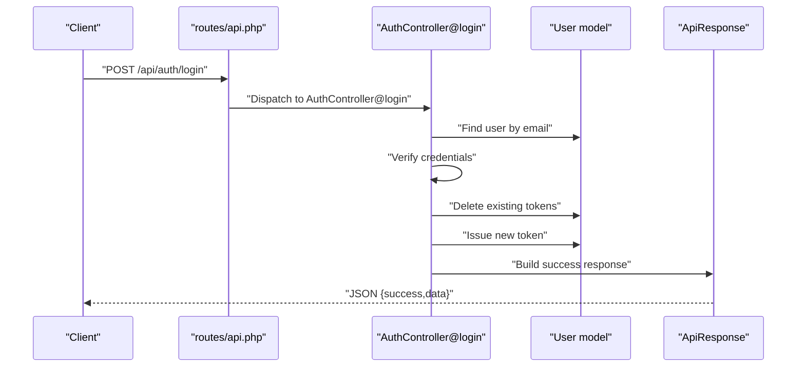
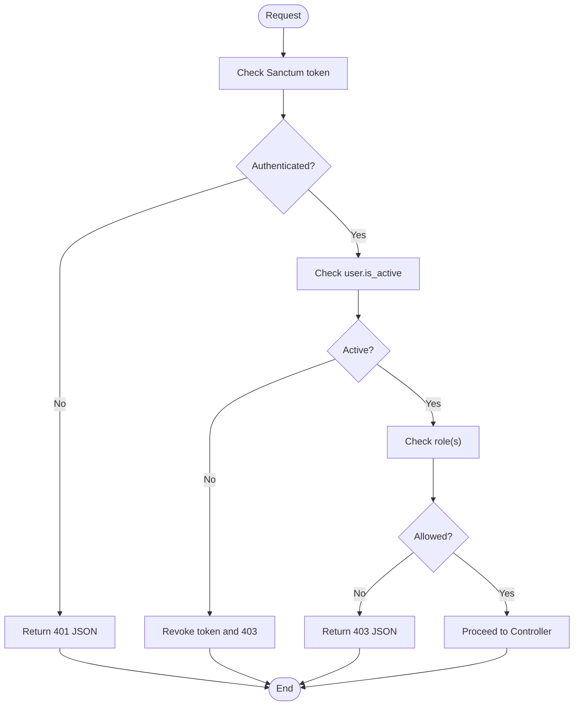
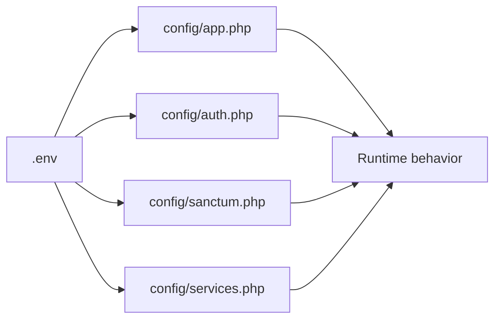
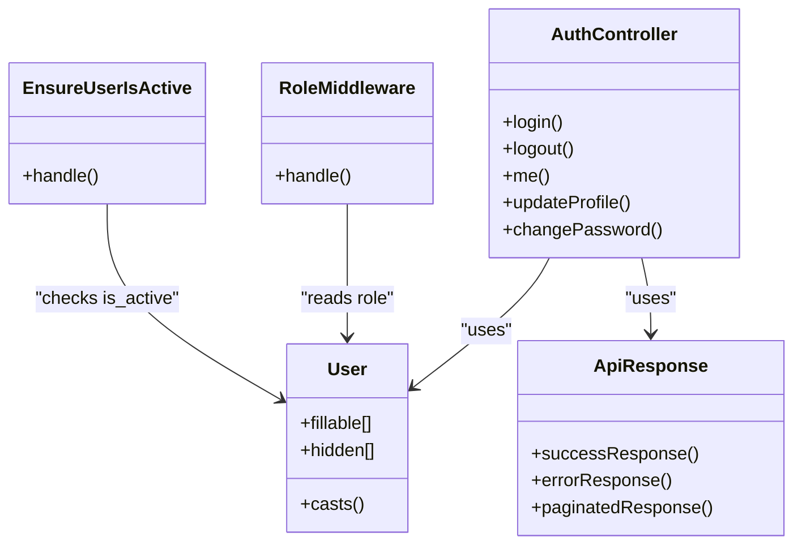
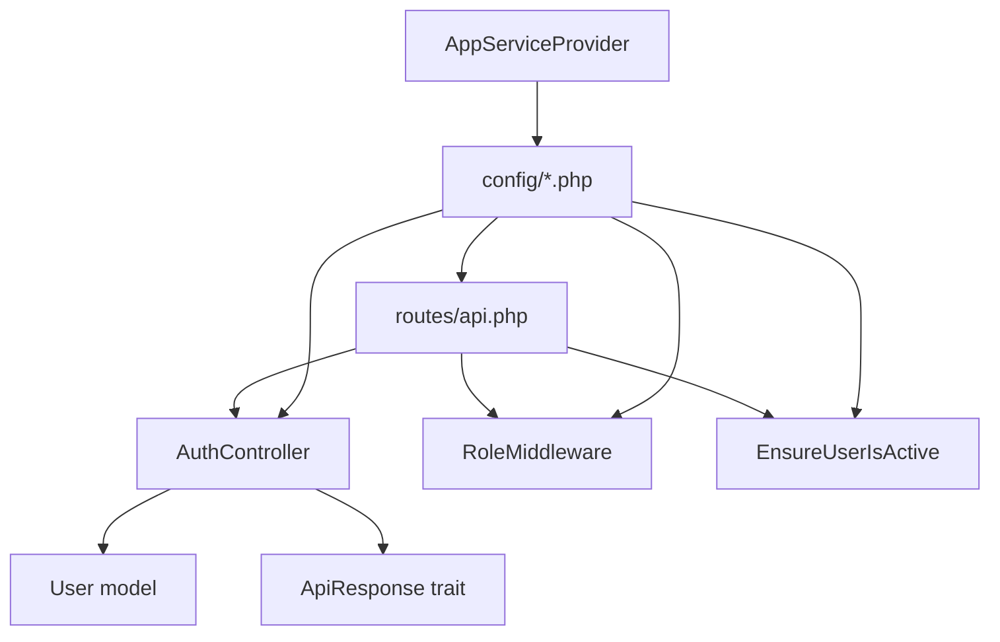

# Application Structure

<cite>
**Referenced Files in This Document**
- [app.php](file://portal/bootstrap/app.php)
- [providers.php](file://portal/bootstrap/providers.php)
- [app.php](file://portal/config/app.php)
- [auth.php](file://portal/config/auth.php)
- [sanctum.php](file://portal/config/sanctum.php)
- [services.php](file://portal/config/services.php)
- [web.php](file://portal/routes/web.php)
- [api.php](file://portal/routes/api.php)
- [Controller.php](file://portal/app/Http/Controllers/Controller.php)
- [AuthController.php](file://portal/app/Http/Controllers/Auth/AuthController.php)
- [RoleMiddleware.php](file://portal/app/Http/Middleware/RoleMiddleware.php)
- [EnsureUserIsActive.php](file://portal/app/Http/Middleware/EnsureUserIsActive.php)
- [ApiResponse.php](file://portal/app/Traits/ApiResponse.php)
- [User.php](file://portal/app/Models/User.php)
- [AppServiceProvider.php](file://portal/app/Providers/AppServiceProvider.php)
</cite>

## Table of Contents
1. [Introduction](#introduction)
2. [Project Structure](#project-structure)
3. [Core Components](#core-components)
4. [Architecture Overview](#architecture-overview)
5. [Detailed Component Analysis](#detailed-component-analysis)
6. [Dependency Analysis](#dependency-analysis)
7. [Performance Considerations](#performance-considerations)
8. [Troubleshooting Guide](#troubleshooting-guide)
9. [Conclusion](#conclusion)

## Introduction
This document explains the Laravel application structure and organization for the portal module. It focuses on the Model-View-Controller (MVC) pattern, directory hierarchy, and component responsibilities. It also documents the bootstrap process, service providers, application lifecycle, separation of concerns, middleware-driven authorization, dependency injection container usage, configuration management, and environment-specific settings. Finally, it illustrates the end-to-end request-to-response flow and provides troubleshooting guidance.

## Project Structure
The portal module follows Laravel’s standard structure with clear separation of concerns:
- bootstrap: Application bootstrap and provider registration
- config: Environment-aware configuration files
- routes: HTTP route definitions for web and API
- app: Core application code (Models, Views, Controllers, Middleware, Traits, Services, Providers)
- database: Migrations, seeds, and factories
- resources/views: Blade templates (e.g., welcome.blade.php)
- public/index.php: Front controller entry point
- storage: Logs, cache, sessions, compiled views
- tests: Unit and feature tests
- frontend: Next.js SPA (TypeScript/React) for the UI layer

**Diagram sources**
- [app.php:10-38](file://portal/bootstrap/app.php#L10-L38)
- [providers.php:5-7](file://portal/bootstrap/providers.php#L5-L7)
- [app.php:16-29](file://portal/config/app.php#L16-L29)
- [auth.php:18-21](file://portal/config/auth.php#L18-L21)
- [sanctum.php:21-26](file://portal/config/sanctum.php#L21-L26)
- [services.php:17-36](file://portal/config/services.php#L17-L36)
- [web.php:5-7](file://portal/routes/web.php#L5-L7)
- [api.php:7-47](file://portal/routes/api.php#L7-L47)
- [Controller.php:5-8](file://portal/app/Http/Controllers/Controller.php#L5-L8)
- [AuthController.php:11-134](file://portal/app/Http/Controllers/Auth/AuthController.php#L11-L134)
- [RoleMiddleware.php:9-36](file://portal/app/Http/Middleware/RoleMiddleware.php#L9-L36)
- [EnsureUserIsActive.php:9-25](file://portal/app/Http/Middleware/EnsureUserIsActive.php#L9-L25)
- [User.php:11-37](file://portal/app/Models/User.php#L11-L37)
- [ApiResponse.php:7-55](file://portal/app/Traits/ApiResponse.php#L7-L55)
- [AppServiceProvider.php:7-24](file://portal/app/Providers/AppServiceProvider.php#L7-L24)

**Section sources**
- [app.php:10-38](file://portal/bootstrap/app.php#L10-L38)
- [providers.php:5-7](file://portal/bootstrap/providers.php#L5-L7)
- [web.php:5-7](file://portal/routes/web.php#L5-L7)
- [api.php:7-47](file://portal/routes/api.php#L7-L47)

## Core Components
- Bootstrap and lifecycle
  - The bootstrap application configuration wires routing, middleware aliasing, and exception rendering. It also registers the application service provider and attaches an API agent route group.
  - Provider registration is centralized in the providers bootstrap file.
- Routing
  - Web routes serve the welcome view.
  - API routes define authentication endpoints and protected resources with role-based access.
- Controllers
  - Base controller class provides a shared foundation.
  - AuthController handles login, logout, profile updates, and password changes with standardized JSON responses via ApiResponse trait.
- Middleware
  - RoleMiddleware enforces role-based access control.
  - EnsureUserIsActive checks user activation and revokes tokens for deactivated users.
- Models
  - User model integrates Sanctum API tokens, Eloquent factory, notifications, and Spatie roles.
- Configuration
  - app.php centralizes environment-aware settings (name, environment, debug, URL, timezone, locale, encryption key, maintenance).
  - auth.php configures guards, providers, and password reset behavior.
  - sanctum.php configures stateful domains, token expiration, and middleware.
  - services.php stores third-party service credentials.
- Traits
  - ApiResponse trait standardizes success/error/pagination responses across controllers.

**Section sources**
- [app.php:10-38](file://portal/bootstrap/app.php#L10-L38)
- [providers.php:5-7](file://portal/bootstrap/providers.php#L5-L7)
- [web.php:5-7](file://portal/routes/web.php#L5-L7)
- [api.php:7-47](file://portal/routes/api.php#L7-L47)
- [Controller.php:5-8](file://portal/app/Http/Controllers/Controller.php#L5-L8)
- [AuthController.php:11-134](file://portal/app/Http/Controllers/Auth/AuthController.php#L11-L134)
- [RoleMiddleware.php:9-36](file://portal/app/Http/Middleware/RoleMiddleware.php#L9-L36)
- [EnsureUserIsActive.php:9-25](file://portal/app/Http/Middleware/EnsureUserIsActive.php#L9-L25)
- [User.php:11-37](file://portal/app/Models/User.php#L11-L37)
- [app.php:16-29](file://portal/config/app.php#L16-L29)
- [auth.php:18-21](file://portal/config/auth.php#L18-L21)
- [sanctum.php:21-26](file://portal/config/sanctum.php#L21-L26)
- [services.php:17-36](file://portal/config/services.php#L17-L36)
- [ApiResponse.php:7-55](file://portal/app/Traits/ApiResponse.php#L7-L55)

## Architecture Overview
The application follows a layered MVC architecture:
- Presentation: Routes define entry points; controllers orchestrate requests and responses.
- Business Logic: Controllers coordinate model access and optional services.
- Data Access: Eloquent models encapsulate persistence and relationships.
- Infrastructure: Configuration files manage environment-specific behavior; middleware enforces cross-cutting concerns.

**Diagram sources**
- [api.php:7-47](file://portal/routes/api.php#L7-L47)
- [EnsureUserIsActive.php:9-25](file://portal/app/Http/Middleware/EnsureUserIsActive.php#L9-L25)
- [RoleMiddleware.php:9-36](file://portal/app/Http/Middleware/RoleMiddleware.php#L9-L36)
- [AuthController.php:11-134](file://portal/app/Http/Controllers/Auth/AuthController.php#L11-L134)
- [ApiResponse.php:7-55](file://portal/app/Traits/ApiResponse.php#L7-L55)
- [User.php:11-37](file://portal/app/Models/User.php#L11-L37)

## Detailed Component Analysis

### Bootstrap and Application Lifecycle
- Bootstrap configuration
  - Configures routing for web, API, console, and health checks.
  - Registers middleware aliases for role and active-user enforcement.
  - Defines exception rendering for validation errors on JSON/API requests.
  - Attaches an API agent route group under a dedicated prefix.
- Provider registration
  - Loads AppServiceProvider during application bootstrapping.

**Diagram sources**
- [app.php:10-38](file://portal/bootstrap/app.php#L10-L38)
- [providers.php:5-7](file://portal/bootstrap/providers.php#L5-L7)
- [api.php:7-47](file://portal/routes/api.php#L7-L47)
- [EnsureUserIsActive.php:9-25](file://portal/app/Http/Middleware/EnsureUserIsActive.php#L9-L25)
- [RoleMiddleware.php:9-36](file://portal/app/Http/Middleware/RoleMiddleware.php#L9-L36)
- [AuthController.php:11-134](file://portal/app/Http/Controllers/Auth/AuthController.php#L11-L134)

**Section sources**
- [app.php:10-38](file://portal/bootstrap/app.php#L10-L38)
- [providers.php:5-7](file://portal/bootstrap/providers.php#L5-L7)

### Authentication Flow (Login)
- Route: POST /api/auth/login
- Middleware: None (public)
- Controller: Validates credentials, checks user activity, revokes old tokens, issues a new token, and returns a standardized success response.

**Diagram sources**
- [api.php:7-15](file://portal/routes/api.php#L7-L15)
- [AuthController.php:18-56](file://portal/app/Http/Controllers/Auth/AuthController.php#L18-L56)
- [User.php:11-37](file://portal/app/Models/User.php#L11-L37)
- [ApiResponse.php:7-26](file://portal/app/Traits/ApiResponse.php#L7-L26)

**Section sources**
- [api.php:7-15](file://portal/routes/api.php#L7-L15)
- [AuthController.php:18-56](file://portal/app/Http/Controllers/Auth/AuthController.php#L18-L56)

### Role-Based Access Control Flow
- Route: Protected resource under middleware groups
- Middleware: auth:sanctum, active, role:admin[,dev]
- Behavior: Rejects unauthenticated users, enforces active status, validates role membership.

**Diagram sources**
- [api.php:9-47](file://portal/routes/api.php#L9-L47)
- [EnsureUserIsActive.php:9-25](file://portal/app/Http/Middleware/EnsureUserIsActive.php#L9-L25)
- [RoleMiddleware.php:9-36](file://portal/app/Http/Middleware/RoleMiddleware.php#L9-L36)

**Section sources**
- [api.php:9-47](file://portal/routes/api.php#L9-L47)
- [EnsureUserIsActive.php:9-25](file://portal/app/Http/Middleware/EnsureUserIsActive.php#L9-L25)
- [RoleMiddleware.php:9-36](file://portal/app/Http/Middleware/RoleMiddleware.php#L9-L36)

### Configuration Management and Environment-Specific Settings
- app.php
  - Reads APP_NAME, APP_ENV, APP_DEBUG, APP_URL, timezone, locales, cipher/key, maintenance driver/store.
- auth.php
  - Defines guards (web), providers (Eloquent user model), password reset broker/table/expiry/throttle.
- sanctum.php
  - Configures stateful domains, guard, expiration, token prefix, and middleware stack.
- services.php
  - Stores third-party keys (Postmark, Resend, SES, Slack).

**Diagram sources**
- [app.php:16-29](file://portal/config/app.php#L16-L29)
- [auth.php:18-21](file://portal/config/auth.php#L18-L21)
- [sanctum.php:21-26](file://portal/config/sanctum.php#L21-L26)
- [services.php:17-36](file://portal/config/services.php#L17-L36)

**Section sources**
- [app.php:16-29](file://portal/config/app.php#L16-L29)
- [auth.php:18-21](file://portal/config/auth.php#L18-L21)
- [sanctum.php:21-26](file://portal/config/sanctum.php#L21-L26)
- [services.php:17-36](file://portal/config/services.php#L17-L36)

### Separation of Concerns
- Models
  - Encapsulate data and business rules (fillable, hidden attributes, casts).
- Controllers
  - Orchestrate request handling, validation, and response formatting.
- Middleware
  - Enforce cross-cutting policies (authentication, activation, roles).
- Traits
  - Standardize response formatting across controllers.
- Providers
  - Register and bootstrap application services.

**Diagram sources**
- [User.php:11-37](file://portal/app/Models/User.php#L11-L37)
- [AuthController.php:11-134](file://portal/app/Http/Controllers/Auth/AuthController.php#L11-L134)
- [RoleMiddleware.php:9-36](file://portal/app/Http/Middleware/RoleMiddleware.php#L9-L36)
- [EnsureUserIsActive.php:9-25](file://portal/app/Http/Middleware/EnsureUserIsActive.php#L9-L25)
- [ApiResponse.php:7-55](file://portal/app/Traits/ApiResponse.php#L7-L55)

**Section sources**
- [User.php:11-37](file://portal/app/Models/User.php#L11-L37)
- [AuthController.php:11-134](file://portal/app/Http/Controllers/Auth/AuthController.php#L11-L134)
- [RoleMiddleware.php:9-36](file://portal/app/Http/Middleware/RoleMiddleware.php#L9-L36)
- [EnsureUserIsActive.php:9-25](file://portal/app/Http/Middleware/EnsureUserIsActive.php#L9-L25)
- [ApiResponse.php:7-55](file://portal/app/Traits/ApiResponse.php#L7-L55)

## Dependency Analysis
- Routing depends on controllers and middleware.
- Controllers depend on models and traits for responses.
- Middleware depends on the authenticated user model.
- Configuration files influence runtime behavior globally.
- Service providers integrate application-wide bindings.

**Diagram sources**
- [api.php:7-47](file://portal/routes/api.php#L7-L47)
- [AuthController.php:11-134](file://portal/app/Http/Controllers/Auth/AuthController.php#L11-L134)
- [User.php:11-37](file://portal/app/Models/User.php#L11-L37)
- [ApiResponse.php:7-55](file://portal/app/Traits/ApiResponse.php#L7-L55)
- [RoleMiddleware.php:9-36](file://portal/app/Http/Middleware/RoleMiddleware.php#L9-L36)
- [EnsureUserIsActive.php:9-25](file://portal/app/Http/Middleware/EnsureUserIsActive.php#L9-L25)
- [app.php:16-29](file://portal/config/app.php#L16-L29)
- [auth.php:18-21](file://portal/config/auth.php#L18-L21)
- [sanctum.php:21-26](file://portal/config/sanctum.php#L21-L26)
- [services.php:17-36](file://portal/config/services.php#L17-L36)
- [AppServiceProvider.php:7-24](file://portal/app/Providers/AppServiceProvider.php#L7-L24)

**Section sources**
- [api.php:7-47](file://portal/routes/api.php#L7-L47)
- [AuthController.php:11-134](file://portal/app/Http/Controllers/Auth/AuthController.php#L11-L134)
- [User.php:11-37](file://portal/app/Models/User.php#L11-L37)
- [ApiResponse.php:7-55](file://portal/app/Traits/ApiResponse.php#L7-L55)
- [RoleMiddleware.php:9-36](file://portal/app/Http/Middleware/RoleMiddleware.php#L9-L36)
- [EnsureUserIsActive.php:9-25](file://portal/app/Http/Middleware/EnsureUserIsActive.php#L9-L25)
- [app.php:16-29](file://portal/config/app.php#L16-L29)
- [auth.php:18-21](file://portal/config/auth.php#L18-L21)
- [sanctum.php:21-26](file://portal/config/sanctum.php#L21-L26)
- [services.php:17-36](file://portal/config/services.php#L17-L36)
- [AppServiceProvider.php:7-24](file://portal/app/Providers/AppServiceProvider.php#L7-L24)

## Performance Considerations
- Prefer lightweight middleware chains for hot paths.
- Use pagination via the ApiResponse trait’s paginated response helper for large datasets.
- Keep configuration reads minimal; cache frequently accessed config values where appropriate.
- Avoid heavy computations inside middleware; delegate to services or jobs.

## Troubleshooting Guide
- Validation failures
  - The bootstrap exception handler renders a standardized 422 JSON response with errors for JSON/API requests.
- Authentication and authorization
  - Ensure Sanctum guard and stateful domains are configured correctly for SPA access.
  - Verify role values match expectations and that users are active.
- Environment variables
  - Confirm APP_KEY, APP_DEBUG, and third-party service keys are set appropriately per environment.

**Section sources**
- [app.php:28-38](file://portal/bootstrap/app.php#L28-L38)
- [sanctum.php:21-26](file://portal/config/sanctum.php#L21-L26)
- [auth.php:18-21](file://portal/config/auth.php#L18-L21)
- [services.php:17-36](file://portal/config/services.php#L17-L36)

## Conclusion
The portal module adheres to Laravel’s MVC architecture with clear separation of concerns. The bootstrap process initializes routing, middleware, and exception handling, while configuration files govern environment-specific behavior. Controllers coordinate business logic, middleware enforces security policies, and traits standardize responses. The documented flows illustrate how requests traverse the system from route to controller to model and back to a structured JSON response.