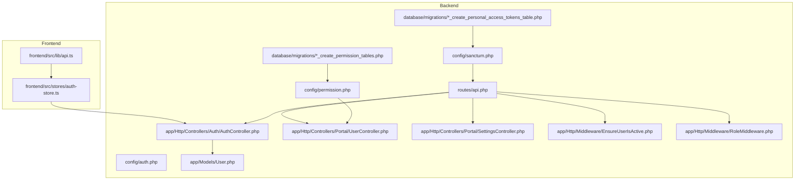
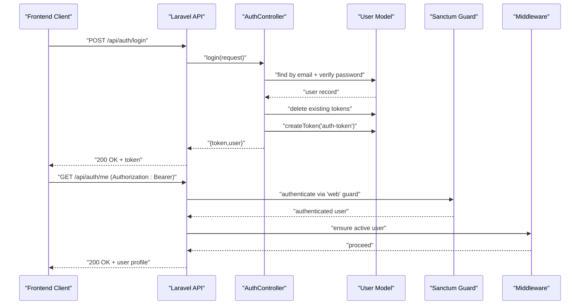
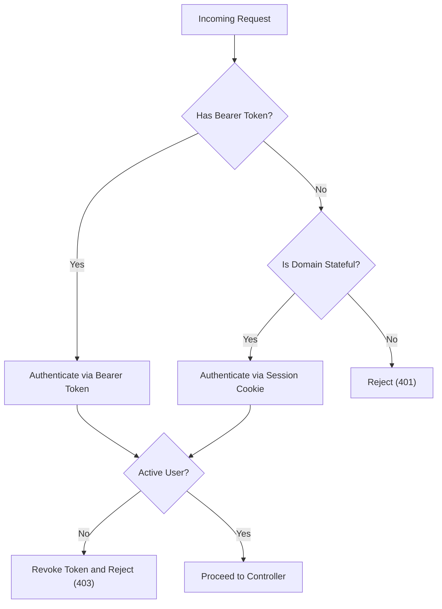
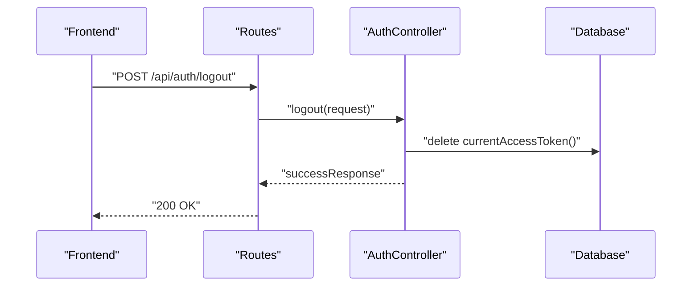
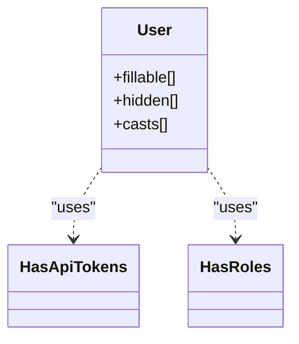
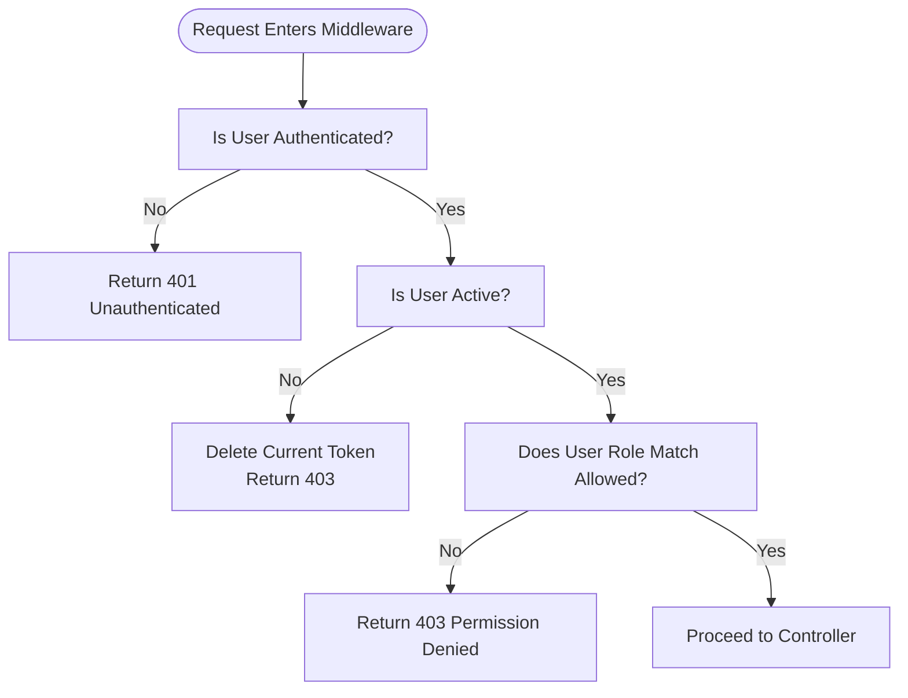
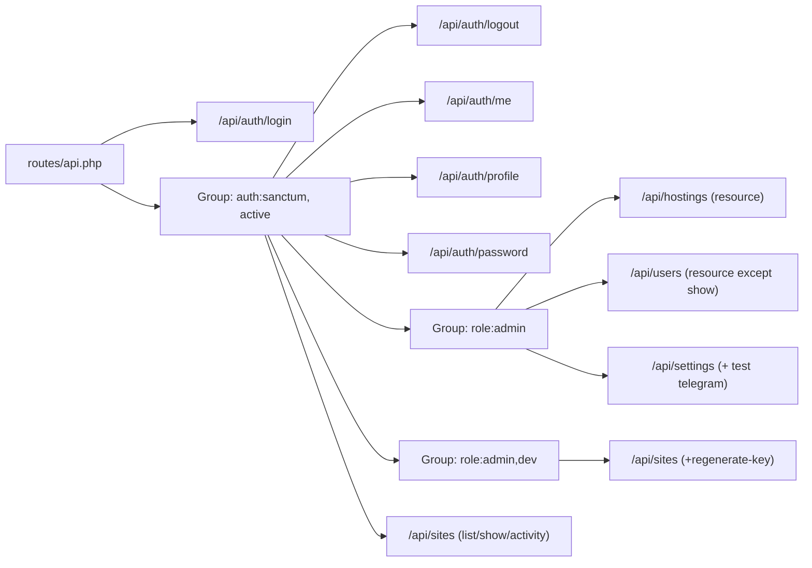
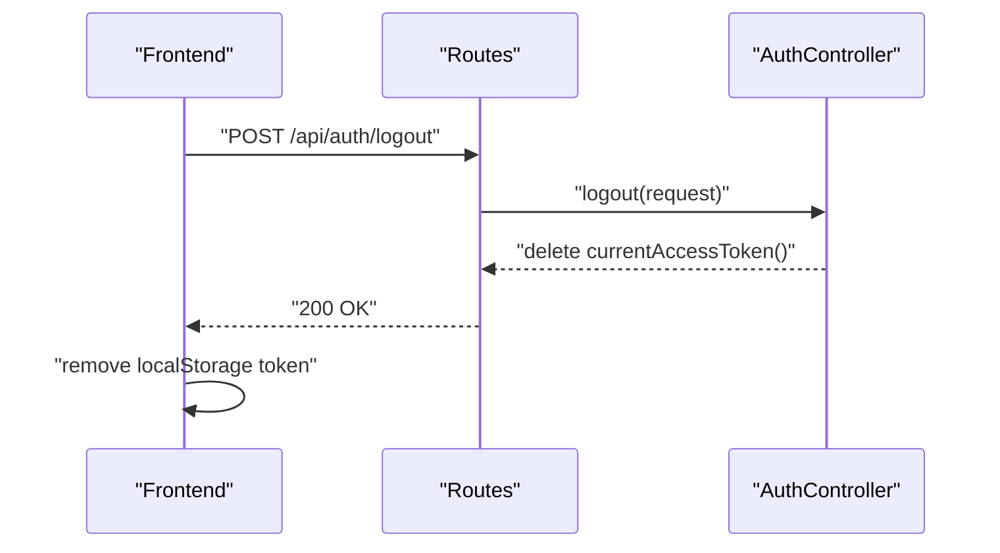
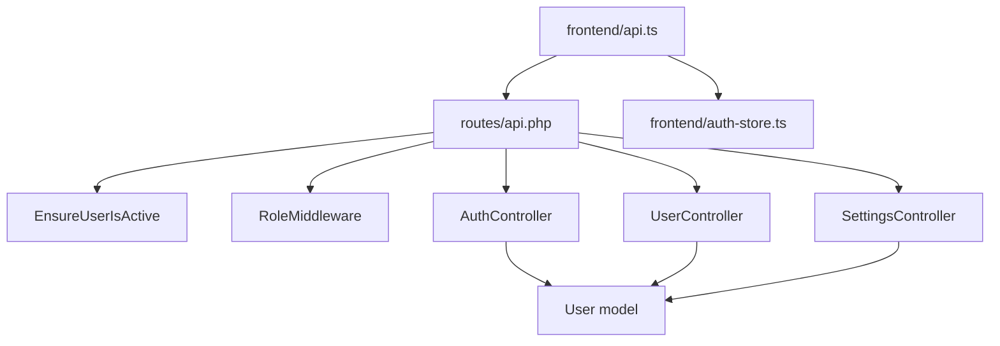

# Authentication & Authorization

<cite>
**Referenced Files in This Document**
- [auth.php](file://portal/config/auth.php)
- [sanctum.php](file://portal/config/sanctum.php)
- [permission.php](file://portal/config/permission.php)
- [AuthController.php](file://portal/app/Http/Controllers/Auth/AuthController.php)
- [User.php](file://portal/app/Models/User.php)
- [api.php](file://portal/routes/api.php)
- [EnsureUserIsActive.php](file://portal/app/Http/Middleware/EnsureUserIsActive.php)
- [RoleMiddleware.php](file://portal/app/Http/Middleware/RoleMiddleware.php)
- [create_permission_tables.php](file://portal/database/migrations/2026_05_15_061634_create_permission_tables.php)
- [create_personal_access_tokens_table.php](file://portal/database/migrations/2026_05_15_061621_create_personal_access_tokens_table.php)
- [UserController.php](file://portal/app/Http/Controllers/Portal/UserController.php)
- [SettingsController.php](file://portal/app/Http/Controllers/Portal/SettingsController.php)
- [api.ts](file://portal/frontend/src/lib/api.ts)
- [auth-store.ts](file://portal/frontend/src/stores/auth-store.ts)
</cite>

## Table of Contents
1. [Introduction](#introduction)
2. [Project Structure](#project-structure)
3. [Core Components](#core-components)
4. [Architecture Overview](#architecture-overview)
5. [Detailed Component Analysis](#detailed-component-analysis)
6. [Dependency Analysis](#dependency-analysis)
7. [Performance Considerations](#performance-considerations)
8. [Troubleshooting Guide](#troubleshooting-guide)
9. [Conclusion](#conclusion)

## Introduction
This document explains the authentication and authorization system built on Laravel Sanctum and the Spatie Permission package. It covers token-based authentication for the SPA, user registration and login flows, session/domain configuration for SPA access, role-based access control (RBAC), and custom middleware enforcement. It also documents protected routes, role-based UI rendering, permission enforcement, logout procedures, and security considerations.

## Project Structure
The authentication stack spans backend configuration, controllers, middleware, models, migrations, and the frontend client store and API module.

**Diagram sources**
- [api.php:1-48](file://portal/routes/api.php#L1-L48)
- [AuthController.php:1-135](file://portal/app/Http/Controllers/Auth/AuthController.php#L1-L135)
- [UserController.php:1-137](file://portal/app/Http/Controllers/Portal/UserController.php#L1-L137)
- [SettingsController.php:1-87](file://portal/app/Http/Controllers/Portal/SettingsController.php#L1-L87)
- [EnsureUserIsActive.php:1-26](file://portal/app/Http/Middleware/EnsureUserIsActive.php#L1-L26)
- [RoleMiddleware.php:1-37](file://portal/app/Http/Middleware/RoleMiddleware.php#L1-L37)
- [User.php:1-38](file://portal/app/Models/User.php#L1-L38)
- [sanctum.php:1-88](file://portal/config/sanctum.php#L1-L88)
- [permission.php:1-207](file://portal/config/permission.php#L1-L207)
- [create_permission_tables.php:1-135](file://portal/database/migrations/2026_05_15_061634_create_permission_tables.php#L1-L135)
- [create_personal_access_tokens_table.php:1-34](file://portal/database/migrations/2026_05_15_061621_create_personal_access_tokens_table.php#L1-L34)
- [api.ts:1-37](file://portal/frontend/src/lib/api.ts#L1-L37)
- [auth-store.ts:1-64](file://portal/frontend/src/stores/auth-store.ts#L1-L64)

**Section sources**
- [api.php:1-48](file://portal/routes/api.php#L1-L48)
- [sanctum.php:1-88](file://portal/config/sanctum.php#L1-L88)
- [permission.php:1-207](file://portal/config/permission.php#L1-L207)
- [AuthController.php:1-135](file://portal/app/Http/Controllers/Auth/AuthController.php#L1-L135)
- [User.php:1-38](file://portal/app/Models/User.php#L1-L38)
- [EnsureUserIsActive.php:1-26](file://portal/app/Http/Middleware/EnsureUserIsActive.php#L1-L26)
- [RoleMiddleware.php:1-37](file://portal/app/Http/Middleware/RoleMiddleware.php#L1-L37)
- [create_permission_tables.php:1-135](file://portal/database/migrations/2026_05_15_061634_create_permission_tables.php#L1-L135)
- [create_personal_access_tokens_table.php:1-34](file://portal/database/migrations/2026_05_15_061621_create_personal_access_tokens_table.php#L1-L34)
- [api.ts:1-37](file://portal/frontend/src/lib/api.ts#L1-L37)
- [auth-store.ts:1-64](file://portal/frontend/src/stores/auth-store.ts#L1-L64)

## Core Components
- Sanctum configuration for SPA domain handling, guards, expiration, and middleware stack.
- Authentication controller implementing login, logout, profile update, and password change with token issuance and revocation.
- User model integrated with Sanctum tokens and Spatie roles.
- Middleware for enforcing active user status and role-based access.
- Routes grouped by protection level and role scopes.
- Frontend API client and Zustand store managing Bearer token lifecycle and redirect on unauthenticated responses.

**Section sources**
- [sanctum.php:1-88](file://portal/config/sanctum.php#L1-L88)
- [AuthController.php:1-135](file://portal/app/Http/Controllers/Auth/AuthController.php#L1-L135)
- [User.php:1-38](file://portal/app/Models/User.php#L1-L38)
- [EnsureUserIsActive.php:1-26](file://portal/app/Http/Middleware/EnsureUserIsActive.php#L1-L26)
- [RoleMiddleware.php:1-37](file://portal/app/Http/Middleware/RoleMiddleware.php#L1-L37)
- [api.php:1-48](file://portal/routes/api.php#L1-L48)
- [api.ts:1-37](file://portal/frontend/src/lib/api.ts#L1-L37)
- [auth-store.ts:1-64](file://portal/frontend/src/stores/auth-store.ts#L1-L64)

## Architecture Overview
The system uses token-based authentication for the SPA. Requests carry a Bearer token stored in localStorage. Sanctum authenticates requests either via session or bearer token, depending on guard configuration. Middleware ensures the user is active and has the required role. Spatie Permissions manage roles and permissions for fine-grained access control.

**Diagram sources**
- [AuthController.php:18-85](file://portal/app/Http/Controllers/Auth/AuthController.php#L18-L85)
- [User.php:1-38](file://portal/app/Models/User.php#L1-L38)
- [sanctum.php:40-45](file://portal/config/sanctum.php#L40-L45)
- [EnsureUserIsActive.php:11-24](file://portal/app/Http/Middleware/EnsureUserIsActive.php#L11-L24)
- [api.ts:12-20](file://portal/frontend/src/lib/api.ts#L12-L20)

## Detailed Component Analysis

### Sanctum Configuration and Token Management
- Stateful domains include localhost and typical development ports to support SPA cookie-based session authentication alongside token-based requests.
- Guard configured to use the "web" session guard for Sanctum authentication attempts.
- Expiration set to null for personal access tokens, meaning tokens do not expire by default unless explicitly handled elsewhere.
- Middleware stack includes cookie encryption and CSRF validation for SPA sessions.

**Diagram sources**
- [sanctum.php:21-45](file://portal/config/sanctum.php#L21-L45)
- [EnsureUserIsActive.php:13-21](file://portal/app/Http/Middleware/EnsureUserIsActive.php#L13-L21)

**Section sources**
- [sanctum.php:1-88](file://portal/config/sanctum.php#L1-L88)
- [EnsureUserIsActive.php:1-26](file://portal/app/Http/Middleware/EnsureUserIsActive.php#L1-L26)

### Authentication Controller: Login, Logout, Profile, Password
- Login validates credentials, checks active status, revokes previous tokens, and issues a new token.
- Logout deletes the current access token for the authenticated user.
- Me returns the authenticated user’s profile.
- Profile update allows updating name and Telegram chat ID.
- Password change validates current password and updates hashed password.

**Diagram sources**
- [AuthController.php:61-66](file://portal/app/Http/Controllers/Auth/AuthController.php#L61-L66)
- [api.php:12-15](file://portal/routes/api.php#L12-L15)

**Section sources**
- [AuthController.php:1-135](file://portal/app/Http/Controllers/Auth/AuthController.php#L1-L135)
- [api.php:1-48](file://portal/routes/api.php#L1-L48)

### User Model and RBAC Integration
- The User model uses Sanctum tokens and Spatie roles traits.
- Roles and permissions are persisted via Spatie migrations and configured in permission.php.

**Diagram sources**
- [User.php:13-13](file://portal/app/Models/User.php#L13-L13)

**Section sources**
- [User.php:1-38](file://portal/app/Models/User.php#L1-L38)
- [permission.php:1-207](file://portal/config/permission.php#L1-L207)
- [create_permission_tables.php:1-135](file://portal/database/migrations/2026_05_15_061634_create_permission_tables.php#L1-L135)

### Middleware: Active User and Role Enforcement
- EnsureUserIsActive middleware rejects inactive users by revoking their token and returning 403.
- RoleMiddleware enforces role-based access using a comma-separated list of allowed roles.

**Diagram sources**
- [EnsureUserIsActive.php:11-24](file://portal/app/Http/Middleware/EnsureUserIsActive.php#L11-L24)
- [RoleMiddleware.php:15-35](file://portal/app/Http/Middleware/RoleMiddleware.php#L15-L35)

**Section sources**
- [EnsureUserIsActive.php:1-26](file://portal/app/Http/Middleware/EnsureUserIsActive.php#L1-L26)
- [RoleMiddleware.php:1-37](file://portal/app/Http/Middleware/RoleMiddleware.php#L1-L37)

### Routes and Protected Endpoints
- Public route: POST /api/auth/login
- Protected group: auth:sanctum + active middleware
  - POST /api/auth/logout
  - GET /api/auth/me
  - PUT /api/auth/profile
  - PUT /api/auth/password
- Admin-only routes: role:admin
  - Hostings resource
  - Users resource (excluding show)
  - Settings endpoints
- Admin + Dev routes: role:admin,dev
  - Sites create/update/delete and key regeneration
- Read-only site listings for all authenticated users

**Diagram sources**
- [api.php:1-48](file://portal/routes/api.php#L1-L48)

**Section sources**
- [api.php:1-48](file://portal/routes/api.php#L1-L48)

### Role-Based UI Rendering and Access Checking
- Role enforcement occurs at the route middleware level using role:admin and role:admin,dev.
- Frontend store hydrates from localStorage and redirects to login on 401 responses.
- UI components can conditionally render based on the authenticated user’s role returned by /api/auth/me.

Implementation highlights:
- Frontend interceptors attach Authorization header and redirect to login on 401.
- Store persists token and user profile, hydrating on app load.

**Section sources**
- [api.ts:1-37](file://portal/frontend/src/lib/api.ts#L1-L37)
- [auth-store.ts:1-64](file://portal/frontend/src/stores/auth-store.ts#L1-L64)

### Token Refresh and Logout Procedures
- Token refresh is not implemented in the current backend; clients should re-authenticate after token loss or expiration.
- Logout deletes the current access token for the authenticated user.
- Frontend removes token from localStorage and resets auth state.

**Diagram sources**
- [AuthController.php:61-66](file://portal/app/Http/Controllers/Auth/AuthController.php#L61-L66)
- [api.php:12-15](file://portal/routes/api.php#L12-L15)
- [auth-store.ts:42-50](file://portal/frontend/src/stores/auth-store.ts#L42-L50)

**Section sources**
- [AuthController.php:1-135](file://portal/app/Http/Controllers/Auth/AuthController.php#L1-L135)
- [api.php:1-48](file://portal/routes/api.php#L1-L48)
- [auth-store.ts:1-64](file://portal/frontend/src/stores/auth-store.ts#L1-L64)

### Security Considerations
- Token storage in localStorage exposes tokens to XSS; consider httpOnly cookies with CSRF protection for SPA if feasible.
- Ensure SANCTUM_STATEFUL_DOMAINS includes your frontend origin(s) to allow cookie-based session authentication.
- Enforce active user middleware to revoke tokens for deactivated accounts.
- Use role middleware to restrict administrative actions.
- Keep Sanctum expiration null only if tokens are short-lived elsewhere; otherwise, consider setting an expiration.

**Section sources**
- [sanctum.php:21-53](file://portal/config/sanctum.php#L21-L53)
- [EnsureUserIsActive.php:13-21](file://portal/app/Http/Middleware/EnsureUserIsActive.php#L13-L21)
- [RoleMiddleware.php:19-32](file://portal/app/Http/Middleware/RoleMiddleware.php#L19-L32)

## Dependency Analysis
- Routes depend on middleware stacks and controllers.
- Controllers depend on the User model and Spatie roles.
- Middleware depends on the authenticated user and the request context.
- Frontend depends on the API base URL and token presence.

**Diagram sources**
- [api.php:1-48](file://portal/routes/api.php#L1-L48)
- [EnsureUserIsActive.php:1-26](file://portal/app/Http/Middleware/EnsureUserIsActive.php#L1-L26)
- [RoleMiddleware.php:1-37](file://portal/app/Http/Middleware/RoleMiddleware.php#L1-L37)
- [AuthController.php:1-135](file://portal/app/Http/Controllers/Auth/AuthController.php#L1-L135)
- [UserController.php:1-137](file://portal/app/Http/Controllers/Portal/UserController.php#L1-L137)
- [SettingsController.php:1-87](file://portal/app/Http/Controllers/Portal/SettingsController.php#L1-L87)
- [User.php:1-38](file://portal/app/Models/User.php#L1-L38)
- [api.ts:1-37](file://portal/frontend/src/lib/api.ts#L1-L37)
- [auth-store.ts:1-64](file://portal/frontend/src/stores/auth-store.ts#L1-L64)

**Section sources**
- [api.php:1-48](file://portal/routes/api.php#L1-L48)
- [User.php:1-38](file://portal/app/Models/User.php#L1-L38)
- [api.ts:1-37](file://portal/frontend/src/lib/api.ts#L1-L37)
- [auth-store.ts:1-64](file://portal/frontend/src/stores/auth-store.ts#L1-L64)

## Performance Considerations
- Sanctum personal access tokens are not globally scoped by abilities; consider scoping tokens to reduce unnecessary permissions.
- Spatie permission caching is enabled by default; ensure cache invalidation on role/permission changes.
- Avoid excessive middleware overhead by grouping routes efficiently and minimizing nested middleware layers.

[No sources needed since this section provides general guidance]

## Troubleshooting Guide
- 401 Unauthorized on protected routes: Verify Bearer token is attached by the frontend interceptor and stored in localStorage.
- 403 Account deactivated: Middleware revokes token and denies access; reactivate the user or require re-authentication.
- Role denied errors: Confirm the user’s role matches the allowed roles in the route middleware.
- Token not refreshing: There is no refresh endpoint; re-login to obtain a new token.

**Section sources**
- [api.ts:23-34](file://portal/frontend/src/lib/api.ts#L23-L34)
- [EnsureUserIsActive.php:13-21](file://portal/app/Http/Middleware/EnsureUserIsActive.php#L13-L21)
- [RoleMiddleware.php:27-32](file://portal/app/Http/Middleware/RoleMiddleware.php#L27-L32)
- [AuthController.php:33-35](file://portal/app/Http/Controllers/Auth/AuthController.php#L33-L35)

## Conclusion
The application implements a clean token-based authentication system using Laravel Sanctum and a straightforward RBAC model via Spatie Permissions. Routes are organized by protection levels, with middleware ensuring active users and role-based access. The frontend integrates seamlessly with the backend using a Bearer token stored in localStorage, with automatic redirection on authentication failures. For enhanced security, consider httpOnly tokens and CSRF protection for SPA environments.