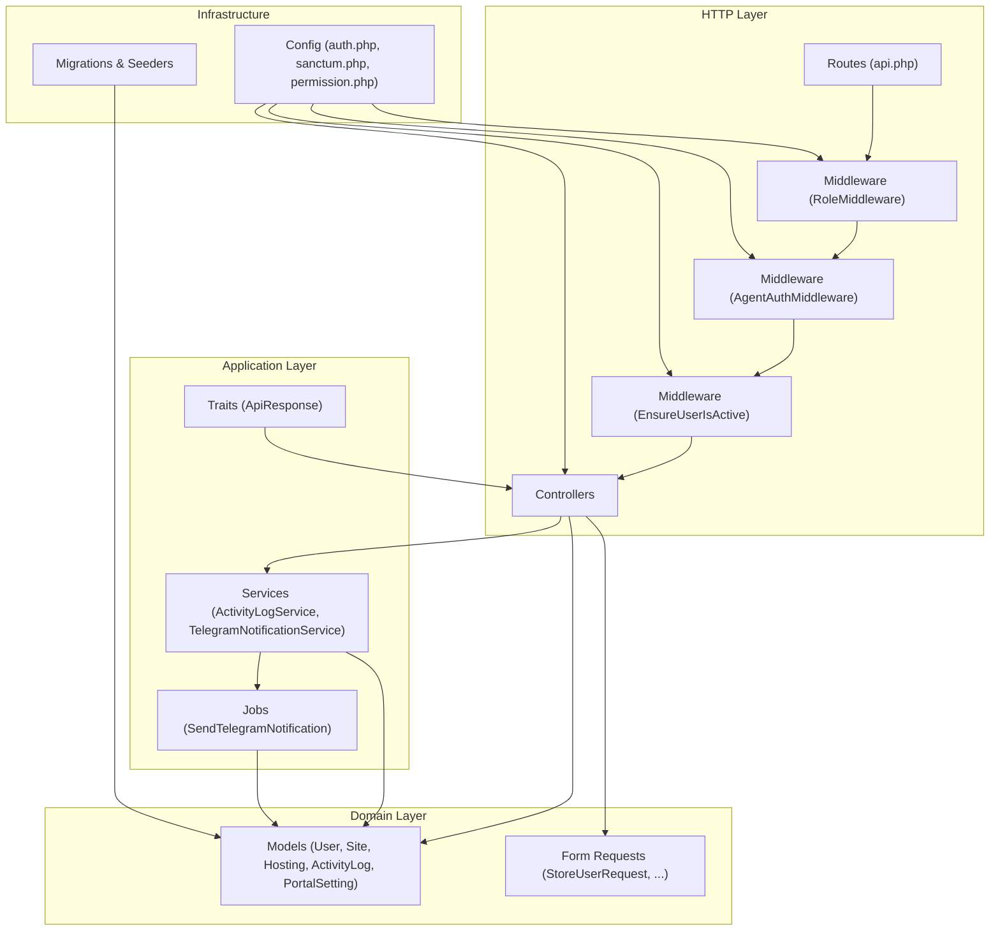
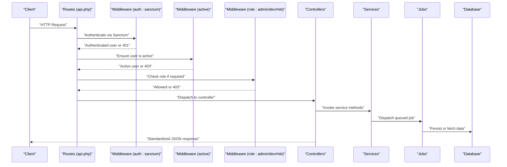
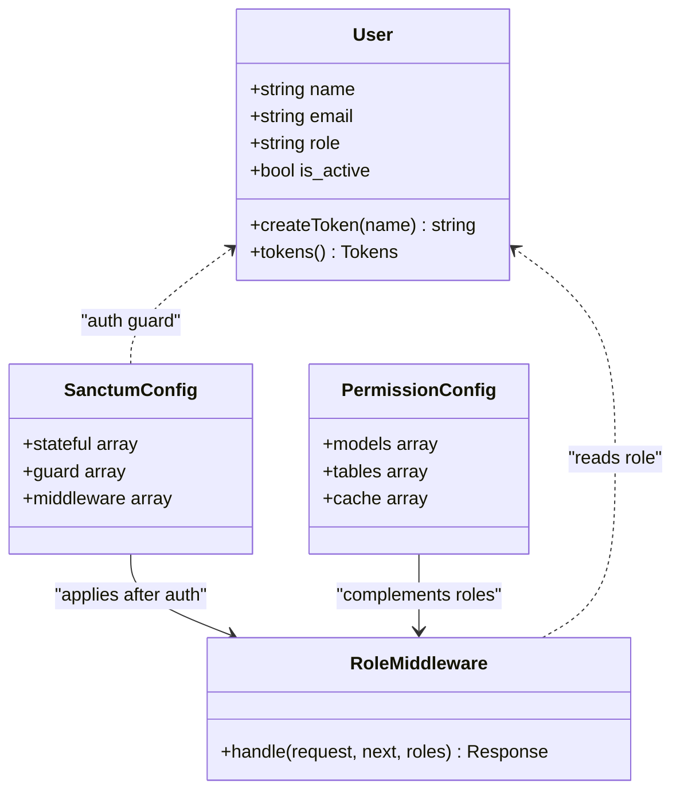
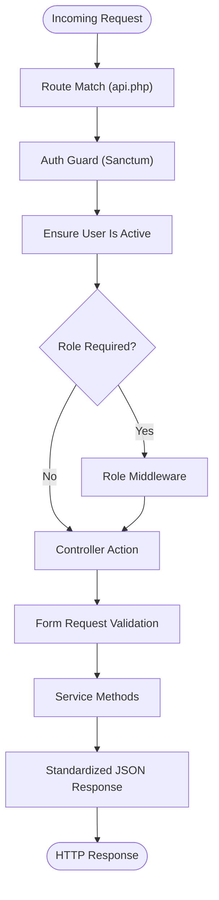
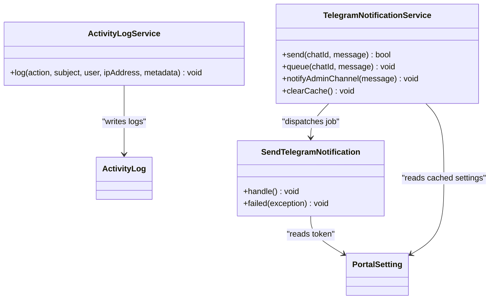
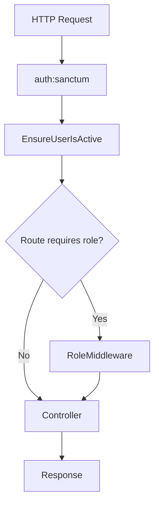
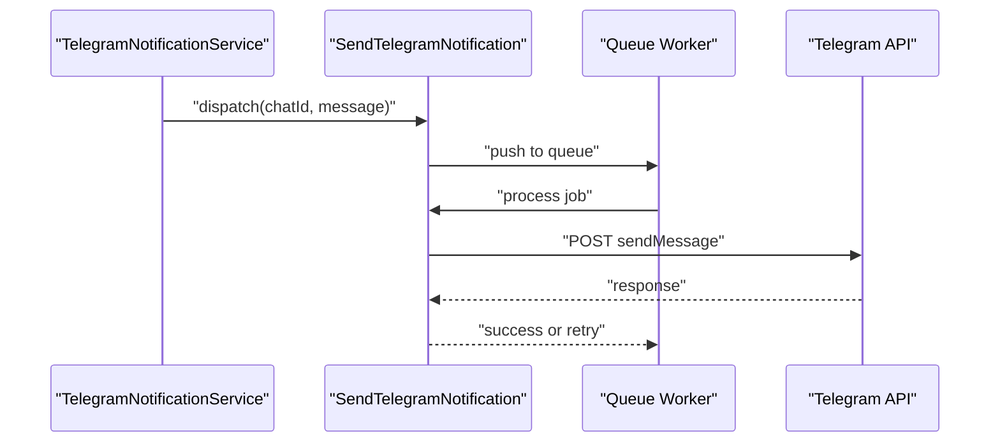
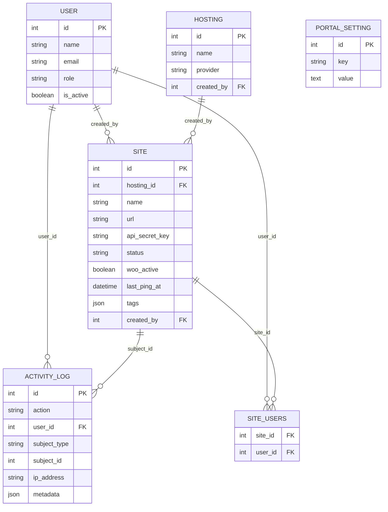
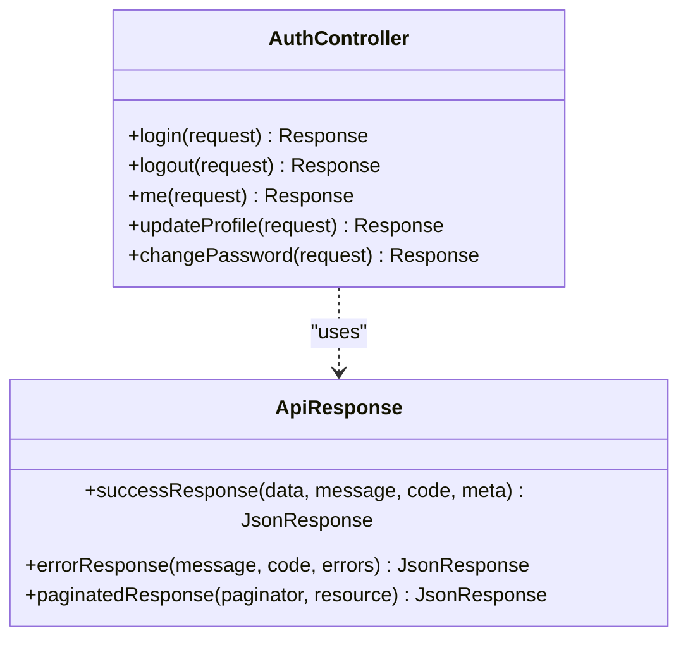
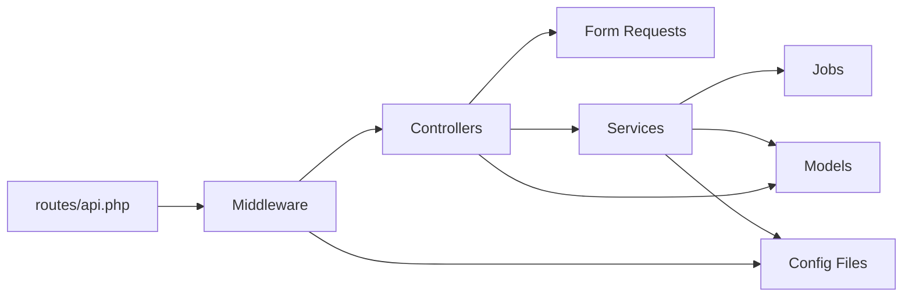

# Backend Architecture (Laravel)

<cite>
**Referenced Files in This Document**
- [Controller.php](file://portal/app/Http/Controllers/Controller.php)
- [AuthController.php](file://portal/app/Http/Controllers/Auth/AuthController.php)
- [HostingController.php](file://portal/app/Http/Controllers/Portal/HostingController.php)
- [SettingsController.php](file://portal/app/Http/Controllers/Portal/SettingsController.php)
- [SiteController.php](file://portal/app/Http/Controllers/Portal/SiteController.php)
- [UserController.php](file://portal/app/Http/Controllers/Portal/UserController.php)
- [RoleMiddleware.php](file://portal/app/Http/Middleware/RoleMiddleware.php)
- [AgentAuthMiddleware.php](file://portal/app/Http/Middleware/AgentAuthMiddleware.php)
- [EnsureUserIsActive.php](file://portal/app/Http/Middleware/EnsureUserIsActive.php)
- [StoreUserRequest.php](file://portal/app/Http/Requests/User/StoreUserRequest.php)
- [SendTelegramNotification.php](file://portal/app/Jobs/SendTelegramNotification.php)
- [ActivityLogService.php](file://portal/app/Services/ActivityLogService.php)
- [TelegramNotificationService.php](file://portal/app/Services/TelegramNotificationService.php)
- [User.php](file://portal/app/Models/User.php)
- [Hosting.php](file://portal/app/Models/Hosting.php)
- [Site.php](file://portal/app/Models/Site.php)
- [ActivityLog.php](file://portal/app/Models/ActivityLog.php)
- [PortalSetting.php](file://portal/app/Models/PortalSetting.php)
- [ApiResponse.php](file://portal/app/Traits/ApiResponse.php)
- [api.php](file://portal/routes/api.php)
- [auth.php](file://portal/config/auth.php)
- [sanctum.php](file://portal/config/sanctum.php)
- [permission.php](file://portal/config/permission.php)
- [2026_05_15_061634_create_permission_tables.php](file://portal/database/migrations/2026_05_15_061634_create_permission_tables.php)
- [2026_05_15_070001_create_hostings_table.php](file://portal/database/migrations/2026_05_15_070001_create_hostings_table.php)
- [2026_05_15_070002_create_sites_table.php](file://portal/database/migrations/2026_05_15_070002_create_sites_table.php)
- [2026_05_15_070003_create_site_users_table.php](file://portal/database/migrations/2026_05_15_070003_create_site_users_table.php)
- [2026_05_15_070004_create_activity_logs_table.php](file://portal/database/migrations/2026_05_15_070004_create_activity_logs_table.php)
- [2026_05_15_070005_create_portal_settings_table.php](file://portal/database/migrations/2026_05_15_070005_create_portal_settings_table.php)
</cite>

## Table of Contents
1. [Introduction](#introduction)
2. [Project Structure](#project-structure)
3. [Core Components](#core-components)
4. [Architecture Overview](#architecture-overview)
5. [Detailed Component Analysis](#detailed-component-analysis)
6. [Dependency Analysis](#dependency-analysis)
7. [Performance Considerations](#performance-considerations)
8. [Troubleshooting Guide](#troubleshooting-guide)
9. [Conclusion](#conclusion)

## Introduction
This document describes the Laravel backend architecture for the EPOS Portal. It explains how the MVC pattern is implemented, how controllers, models, services, middleware, jobs, and requests work together, and how the request lifecycle flows from HTTP requests through middleware to controllers and services. It also documents the authentication and authorization systems using Laravel Sanctum and Spatie Permission, the service layer and business logic encapsulation, the middleware chain and custom middleware for role-based access control, and the queue system for background processing.

## Project Structure
The backend follows a layered MVC architecture with clear separation of concerns:
- HTTP layer: routes define entry points; middleware enforces policies; controllers orchestrate responses.
- Domain layer: models represent entities and relationships; requests encapsulate validation rules.
- Application layer: services encapsulate business logic; jobs handle background tasks.
- Infrastructure: configuration files define guards, Sanctum, permissions, and queues.

**Diagram sources**
- [api.php:1-48](file://portal/routes/api.php#L1-L48)
- [RoleMiddleware.php:1-37](file://portal/app/Http/Middleware/RoleMiddleware.php#L1-L37)
- [AgentAuthMiddleware.php:1-57](file://portal/app/Http/Middleware/AgentAuthMiddleware.php#L1-L57)
- [EnsureUserIsActive.php](file://portal/app/Http/Middleware/EnsureUserIsActive.php)
- [AuthController.php:1-135](file://portal/app/Http/Controllers/Auth/AuthController.php#L1-L135)
- [StoreUserRequest.php:1-26](file://portal/app/Http/Requests/User/StoreUserRequest.php#L1-L26)
- [ActivityLogService.php:1-50](file://portal/app/Services/ActivityLogService.php#L1-L50)
- [TelegramNotificationService.php:1-107](file://portal/app/Services/TelegramNotificationService.php#L1-L107)
- [SendTelegramNotification.php:1-62](file://portal/app/Jobs/SendTelegramNotification.php#L1-L62)
- [ApiResponse.php:1-56](file://portal/app/Traits/ApiResponse.php#L1-L56)
- [auth.php:1-118](file://portal/config/auth.php#L1-L118)
- [sanctum.php:1-88](file://portal/config/sanctum.php#L1-L88)
- [permission.php:1-207](file://portal/config/permission.php#L1-L207)
- [User.php:1-38](file://portal/app/Models/User.php#L1-L38)
- [Site.php:1-76](file://portal/app/Models/Site.php#L1-L76)
- [Hosting.php:1-31](file://portal/app/Models/Hosting.php#L1-L31)
- [ActivityLog.php](file://portal/app/Models/ActivityLog.php)
- [PortalSetting.php](file://portal/app/Models/PortalSetting.php)

**Section sources**
- [api.php:1-48](file://portal/routes/api.php#L1-L48)
- [auth.php:1-118](file://portal/config/auth.php#L1-L118)
- [sanctum.php:1-88](file://portal/config/sanctum.php#L1-L88)
- [permission.php:1-207](file://portal/config/permission.php#L1-L207)

## Core Components
- Controllers: Handle HTTP requests, delegate to services, and return standardized JSON responses via a shared trait.
- Models: Define entity schemas, relationships, scopes, and attributes.
- Services: Encapsulate business logic and cross-cutting concerns (e.g., notifications, activity logging).
- Middleware: Enforce authentication, agent authentication, role checks, and user activation.
- Jobs: Asynchronous tasks for background processing (e.g., sending Telegram notifications).
- Requests: Validation and authorization rules for incoming data.
- Traits: Shared response formatting utilities.

**Section sources**
- [Controller.php:1-9](file://portal/app/Http/Controllers/Controller.php#L1-L9)
- [AuthController.php:1-135](file://portal/app/Http/Controllers/Auth/AuthController.php#L1-L135)
- [User.php:1-38](file://portal/app/Models/User.php#L1-L38)
- [Site.php:1-76](file://portal/app/Models/Site.php#L1-L76)
- [Hosting.php:1-31](file://portal/app/Models/Hosting.php#L1-L31)
- [ActivityLogService.php:1-50](file://portal/app/Services/ActivityLogService.php#L1-L50)
- [TelegramNotificationService.php:1-107](file://portal/app/Services/TelegramNotificationService.php#L1-L107)
- [SendTelegramNotification.php:1-62](file://portal/app/Jobs/SendTelegramNotification.php#L1-L62)
- [StoreUserRequest.php:1-26](file://portal/app/Http/Requests/User/StoreUserRequest.php#L1-L26)
- [ApiResponse.php:1-56](file://portal/app/Traits/ApiResponse.php#L1-L56)

## Architecture Overview
The request lifecycle begins at the route, passes through middleware, reaches the controller, and delegates to services for business logic. Responses are standardized using a shared trait. Authentication uses Sanctum personal access tokens; authorization uses Spatie Permissions with custom role middleware.

**Diagram sources**
- [api.php:1-48](file://portal/routes/api.php#L1-L48)
- [auth.php:1-118](file://portal/config/auth.php#L1-L118)
- [sanctum.php:1-88](file://portal/config/sanctum.php#L1-L88)
- [RoleMiddleware.php:1-37](file://portal/app/Http/Middleware/RoleMiddleware.php#L1-L37)
- [EnsureUserIsActive.php](file://portal/app/Http/Middleware/EnsureUserIsActive.php)
- [AuthController.php:1-135](file://portal/app/Http/Controllers/Auth/AuthController.php#L1-L135)
- [TelegramNotificationService.php:1-107](file://portal/app/Services/TelegramNotificationService.php#L1-L107)
- [SendTelegramNotification.php:1-62](file://portal/app/Jobs/SendTelegramNotification.php#L1-L62)

## Detailed Component Analysis

### Authentication and Authorization
- Authentication: Sanctum personal access tokens are used for stateful SPA authentication. Guards and middleware are configured to support session and token-based auth.
- Authorization: Spatie Permission models and tables manage roles and permissions. A custom role middleware enforces role-based access control.

**Diagram sources**
- [User.php:1-38](file://portal/app/Models/User.php#L1-L38)
- [RoleMiddleware.php:1-37](file://portal/app/Http/Middleware/RoleMiddleware.php#L1-L37)
- [sanctum.php:1-88](file://portal/config/sanctum.php#L1-L88)
- [permission.php:1-207](file://portal/config/permission.php#L1-L207)

**Section sources**
- [auth.php:1-118](file://portal/config/auth.php#L1-L118)
- [sanctum.php:1-88](file://portal/config/sanctum.php#L1-L88)
- [permission.php:1-207](file://portal/config/permission.php#L1-L207)
- [RoleMiddleware.php:1-37](file://portal/app/Http/Middleware/RoleMiddleware.php#L1-L37)
- [User.php:1-38](file://portal/app/Models/User.php#L1-L38)

### Request Processing Pipeline
- Routes define protected groups and role-based subgroups.
- Middleware stack: auth:sanctum, active, and optional role middleware.
- Controllers validate input via Form Requests and return standardized responses.

**Diagram sources**
- [api.php:1-48](file://portal/routes/api.php#L1-L48)
- [StoreUserRequest.php:1-26](file://portal/app/Http/Requests/User/StoreUserRequest.php#L1-L26)
- [AuthController.php:1-135](file://portal/app/Http/Controllers/Auth/AuthController.php#L1-L135)
- [ApiResponse.php:1-56](file://portal/app/Traits/ApiResponse.php#L1-L56)

**Section sources**
- [api.php:1-48](file://portal/routes/api.php#L1-L48)
- [StoreUserRequest.php:1-26](file://portal/app/Http/Requests/User/StoreUserRequest.php#L1-L26)
- [AuthController.php:1-135](file://portal/app/Http/Controllers/Auth/AuthController.php#L1-L135)
- [ApiResponse.php:1-56](file://portal/app/Traits/ApiResponse.php#L1-L56)

### Service Layer and Business Logic Encapsulation
- ActivityLogService: Centralized activity logging with fallback to logs if the table does not exist.
- TelegramNotificationService: Provides synchronous and asynchronous notification delivery, with caching of settings and queue dispatch.

**Diagram sources**
- [ActivityLogService.php:1-50](file://portal/app/Services/ActivityLogService.php#L1-L50)
- [TelegramNotificationService.php:1-107](file://portal/app/Services/TelegramNotificationService.php#L1-L107)
- [SendTelegramNotification.php:1-62](file://portal/app/Jobs/SendTelegramNotification.php#L1-L62)
- [ActivityLog.php](file://portal/app/Models/ActivityLog.php)
- [PortalSetting.php](file://portal/app/Models/PortalSetting.php)

**Section sources**
- [ActivityLogService.php:1-50](file://portal/app/Services/ActivityLogService.php#L1-L50)
- [TelegramNotificationService.php:1-107](file://portal/app/Services/TelegramNotificationService.php#L1-L107)
- [SendTelegramNotification.php:1-62](file://portal/app/Jobs/SendTelegramNotification.php#L1-L62)

### Middleware Chain and Custom Middleware
- RoleMiddleware: Enforces role-based access control by checking the authenticated user’s role against allowed roles.
- AgentAuthMiddleware: Validates agent requests using a hashed API key derived from the site URL.
- EnsureUserIsActive: Ensures the authenticated user is active before allowing access.

**Diagram sources**
- [RoleMiddleware.php:1-37](file://portal/app/Http/Middleware/RoleMiddleware.php#L1-L37)
- [AgentAuthMiddleware.php:1-57](file://portal/app/Http/Middleware/AgentAuthMiddleware.php#L1-L57)
- [EnsureUserIsActive.php](file://portal/app/Http/Middleware/EnsureUserIsActive.php)
- [api.php:1-48](file://portal/routes/api.php#L1-L48)

**Section sources**
- [RoleMiddleware.php:1-37](file://portal/app/Http/Middleware/RoleMiddleware.php#L1-L37)
- [AgentAuthMiddleware.php:1-57](file://portal/app/Http/Middleware/AgentAuthMiddleware.php#L1-L57)
- [EnsureUserIsActive.php](file://portal/app/Http/Middleware/EnsureUserIsActive.php)

### Queue System and Background Processing
- Jobs: The Telegram notification job sends messages asynchronously and retries on failure.
- Queue configuration: Jobs are dispatched via the queue system and retried with backoff.

**Diagram sources**
- [TelegramNotificationService.php:1-107](file://portal/app/Services/TelegramNotificationService.php#L1-L107)
- [SendTelegramNotification.php:1-62](file://portal/app/Jobs/SendTelegramNotification.php#L1-L62)

**Section sources**
- [TelegramNotificationService.php:1-107](file://portal/app/Services/TelegramNotificationService.php#L1-L107)
- [SendTelegramNotification.php:1-62](file://portal/app/Jobs/SendTelegramNotification.php#L1-L62)

### Data Models and Relationships
- User: Authenticatable with Sanctum tokens and Spatie roles; includes role and activity fields.
- Site: Belongs to Hosting and User; many-to-many with User via site_users; scoped by user assignment.
- Hosting: Creator relationship to User; has many Sites.
- ActivityLog: Optional centralized audit trail.
- PortalSetting: Stores configuration values (e.g., Telegram bot token and default chat ID).

**Diagram sources**
- [User.php:1-38](file://portal/app/Models/User.php#L1-L38)
- [Hosting.php:1-31](file://portal/app/Models/Hosting.php#L1-L31)
- [Site.php:1-76](file://portal/app/Models/Site.php#L1-L76)
- [ActivityLog.php](file://portal/app/Models/ActivityLog.php)
- [PortalSetting.php](file://portal/app/Models/PortalSetting.php)
- [2026_05_15_061634_create_permission_tables.php](file://portal/database/migrations/2026_05_15_061634_create_permission_tables.php)
- [2026_05_15_070001_create_hostings_table.php](file://portal/database/migrations/2026_05_15_070001_create_hostings_table.php)
- [2026_05_15_070002_create_sites_table.php](file://portal/database/migrations/2026_05_15_070002_create_sites_table.php)
- [2026_05_15_070003_create_site_users_table.php](file://portal/database/migrations/2026_05_15_070003_create_site_users_table.php)
- [2026_05_15_070004_create_activity_logs_table.php](file://portal/database/migrations/2026_05_15_070004_create_activity_logs_table.php)
- [2026_05_15_070005_create_portal_settings_table.php](file://portal/database/migrations/2026_05_15_070005_create_portal_settings_table.php)

**Section sources**
- [User.php:1-38](file://portal/app/Models/User.php#L1-L38)
- [Hosting.php:1-31](file://portal/app/Models/Hosting.php#L1-L31)
- [Site.php:1-76](file://portal/app/Models/Site.php#L1-L76)
- [ActivityLog.php](file://portal/app/Models/ActivityLog.php)
- [PortalSetting.php](file://portal/app/Models/PortalSetting.php)

### Controllers and Standardized Responses
- AuthController: Handles login, logout, profile update, and password change with standardized responses.
- Other controllers: Follow the same pattern, delegating to services and returning structured JSON.

**Diagram sources**
- [AuthController.php:1-135](file://portal/app/Http/Controllers/Auth/AuthController.php#L1-L135)
- [ApiResponse.php:1-56](file://portal/app/Traits/ApiResponse.php#L1-L56)

**Section sources**
- [AuthController.php:1-135](file://portal/app/Http/Controllers/Auth/AuthController.php#L1-L135)
- [ApiResponse.php:1-56](file://portal/app/Traits/ApiResponse.php#L1-L56)

## Dependency Analysis
The application exhibits low coupling and high cohesion:
- Controllers depend on services and models, not on each other.
- Services encapsulate domain logic and coordinate with jobs and models.
- Middleware is reusable and composable via route groups.
- Requests decouple validation from controllers.

**Diagram sources**
- [api.php:1-48](file://portal/routes/api.php#L1-L48)
- [RoleMiddleware.php:1-37](file://portal/app/Http/Middleware/RoleMiddleware.php#L1-L37)
- [AgentAuthMiddleware.php:1-57](file://portal/app/Http/Middleware/AgentAuthMiddleware.php#L1-L57)
- [AuthController.php:1-135](file://portal/app/Http/Controllers/Auth/AuthController.php#L1-L135)
- [TelegramNotificationService.php:1-107](file://portal/app/Services/TelegramNotificationService.php#L1-L107)
- [SendTelegramNotification.php:1-62](file://portal/app/Jobs/SendTelegramNotification.php#L1-L62)
- [auth.php:1-118](file://portal/config/auth.php#L1-L118)
- [sanctum.php:1-88](file://portal/config/sanctum.php#L1-L88)
- [permission.php:1-207](file://portal/config/permission.php#L1-L207)

**Section sources**
- [api.php:1-48](file://portal/routes/api.php#L1-L48)
- [auth.php:1-118](file://portal/config/auth.php#L1-L118)
- [sanctum.php:1-88](file://portal/config/sanctum.php#L1-L88)
- [permission.php:1-207](file://portal/config/permission.php#L1-L207)

## Performance Considerations
- Use caching for frequently accessed settings (e.g., Telegram bot token and default chat ID) to reduce database queries.
- Leverage database indexing on commonly filtered columns (e.g., site URL, user roles).
- Minimize N+1 queries by eager-loading relationships in controllers and services.
- Offload long-running tasks to the queue to keep HTTP requests responsive.
- Keep middleware logic lightweight; avoid heavy computations inside middleware.

## Troubleshooting Guide
- Authentication failures: Verify Sanctum guard configuration and ensure tokens are properly issued and included in requests.
- Authorization failures: Confirm role middleware is applied to protected routes and that users have the correct roles.
- Queue processing: Monitor queue workers and job retries; inspect logs for Telegram API errors and exceptions.
- Database migrations: Ensure permission tables and portal-related tables are created and up to date.

**Section sources**
- [sanctum.php:1-88](file://portal/config/sanctum.php#L1-L88)
- [permission.php:1-207](file://portal/config/permission.php#L1-L207)
- [SendTelegramNotification.php:1-62](file://portal/app/Jobs/SendTelegramNotification.php#L1-L62)
- [2026_05_15_061634_create_permission_tables.php](file://portal/database/migrations/2026_05_15_061634_create_permission_tables.php)
- [2026_05_15_070005_create_portal_settings_table.php](file://portal/database/migrations/2026_05_15_070005_create_portal_settings_table.php)

## Conclusion
The EPOS Portal backend leverages Laravel’s MVC architecture with clear separation between HTTP handling, domain models, application services, and infrastructure concerns. Sanctum and Spatie Permission provide robust authentication and authorization, while middleware ensures consistent policy enforcement. The service layer encapsulates business logic, and the queue system handles background tasks efficiently. This design promotes maintainability, testability, and scalability.