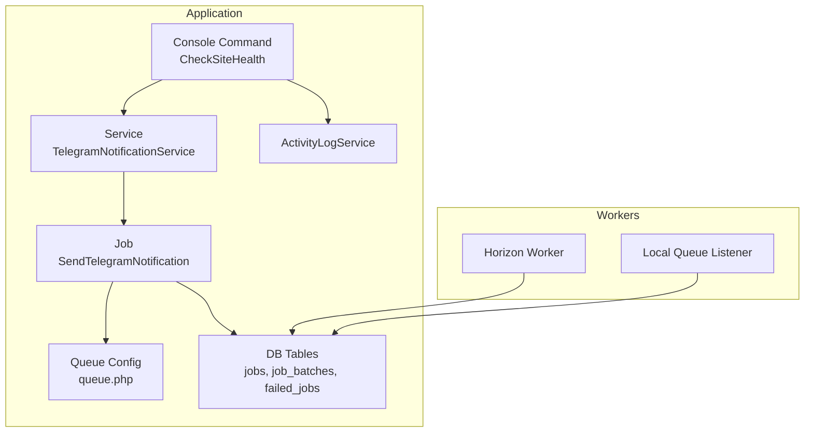
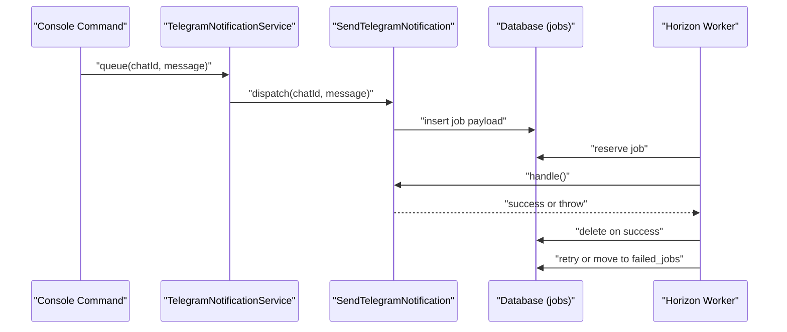
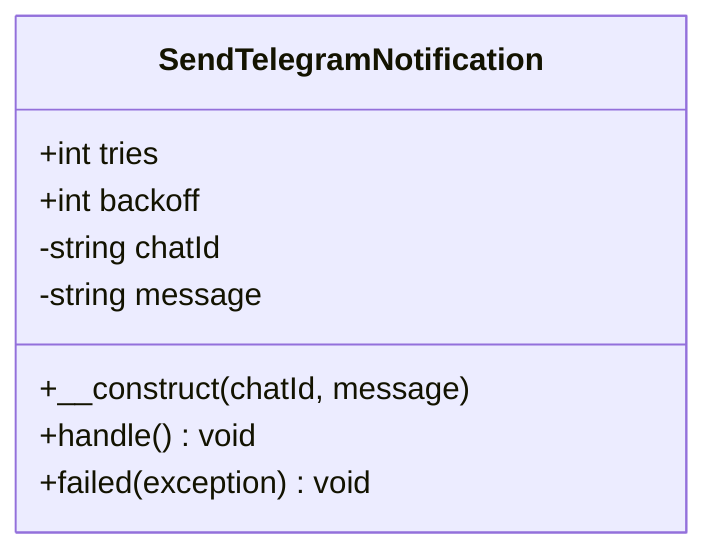
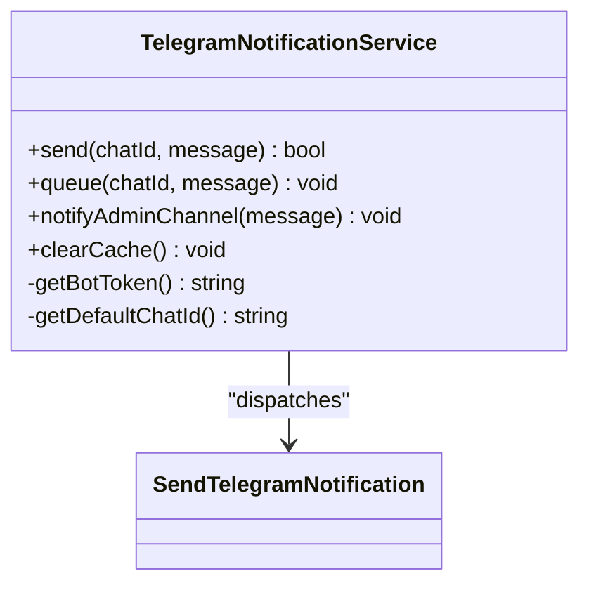
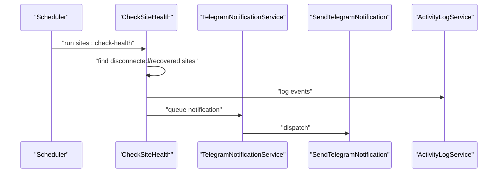
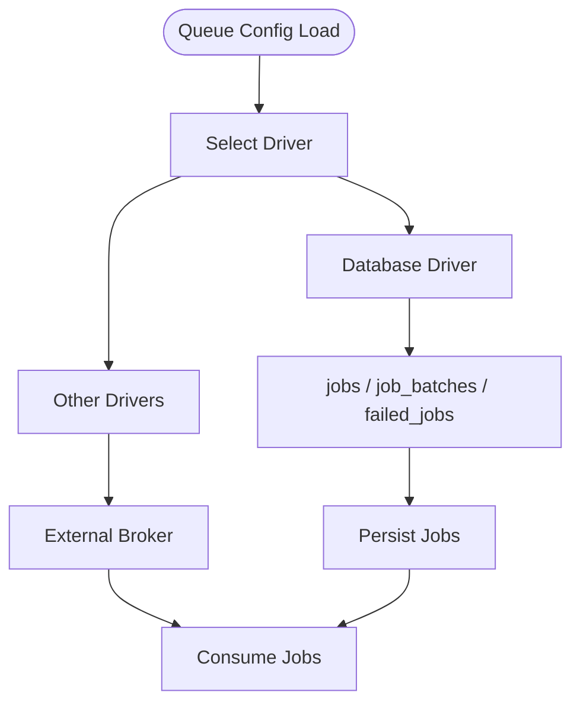
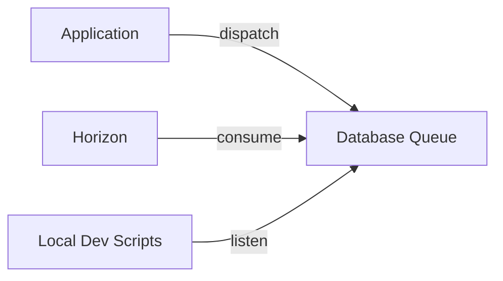
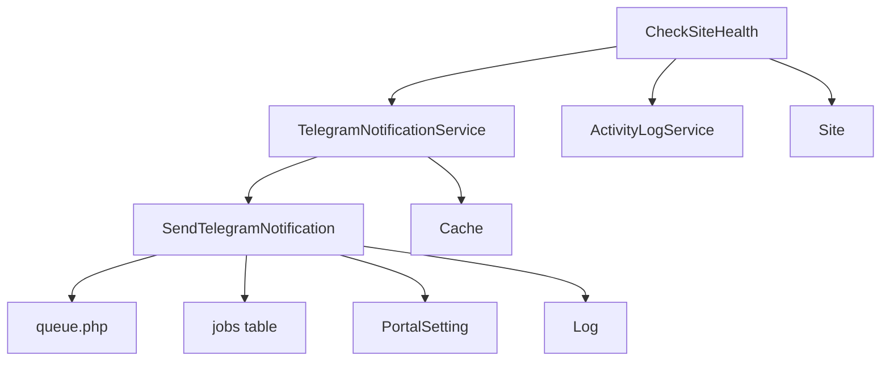
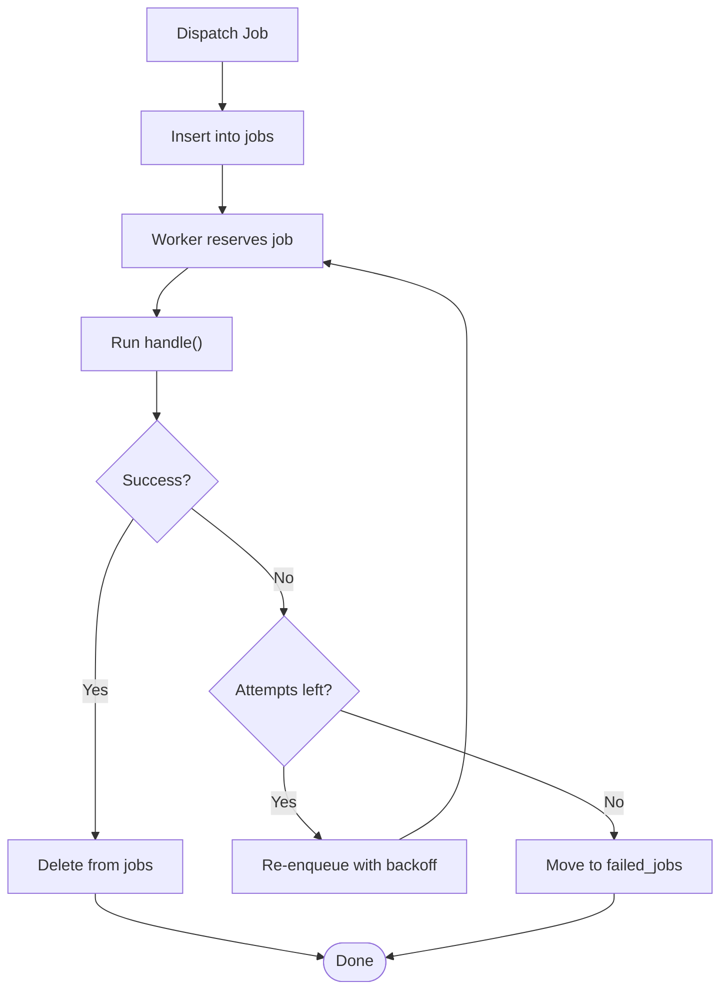

# Background Jobs & Queue Processing

<cite>
**Referenced Files in This Document**
- [SendTelegramNotification.php](file://portal/app/Jobs/SendTelegramNotification.php)
- [TelegramNotificationService.php](file://portal/app/Services/TelegramNotificationService.php)
- [CheckSiteHealth.php](file://portal/app/Console/Commands/CheckSiteHealth.php)
- [queue.php](file://portal/config/queue.php)
- [0001_01_01_000002_create_jobs_table.php](file://portal/database/migrations/0001_01_01_000002_create_jobs_table.php)
- [docker-compose.yml](file://docker-compose.yml)
- [console.php](file://portal/routes/console.php)
- [composer.json](file://portal/composer.json)
- [database.php](file://portal/config/database.php)
- [ActivityLogService.php](file://portal/app/Services/ActivityLogService.php)
</cite>

## Table of Contents
1. [Introduction](#introduction)
2. [Project Structure](#project-structure)
3. [Core Components](#core-components)
4. [Architecture Overview](#architecture-overview)
5. [Detailed Component Analysis](#detailed-component-analysis)
6. [Dependency Analysis](#dependency-analysis)
7. [Performance Considerations](#performance-considerations)
8. [Troubleshooting Guide](#troubleshooting-guide)
9. [Conclusion](#conclusion)
10. [Appendices](#appendices)

## Introduction
This document explains the background job processing system and queue management in the application. It covers the job queue architecture, worker processes, and job lifecycle management. It documents the SendTelegramNotification job implementation, related queued tasks, queue configuration, job serialization, error handling, and operational practices such as job creation, dispatching, monitoring, retries, failures, and scaling. It also describes how jobs relate to the broader application architecture, including database transactions and job persistence.

## Project Structure
The queue system is implemented using Laravel’s queue abstraction with a database-backed queue driver. Jobs are dispatched from services and console commands, persisted to the jobs table, and processed asynchronously by workers. The system integrates with Horizon for monitoring and Docker Compose for running workers and schedulers.

**Diagram sources**
- [CheckSiteHealth.php:16-93](file://portal/app/Console/Commands/CheckSiteHealth.php#L16-L93)
- [TelegramNotificationService.php:53-65](file://portal/app/Services/TelegramNotificationService.php#L53-L65)
- [SendTelegramNotification.php:13-61](file://portal/app/Jobs/SendTelegramNotification.php#L13-L61)
- [queue.php:32-92](file://portal/config/queue.php#L32-L92)
- [0001_01_01_000002_create_jobs_table.php:14-45](file://portal/database/migrations/0001_01_01_000002_create_jobs_table.php#L14-L45)
- [ActivityLogService.php:16-48](file://portal/app/Services/ActivityLogService.php#L16-L48)

**Section sources**
- [queue.php:16-127](file://portal/config/queue.php#L16-L127)
- [0001_01_01_000002_create_jobs_table.php:14-45](file://portal/database/migrations/0001_01_01_000002_create_jobs_table.php#L14-L45)
- [docker-compose.yml:66-100](file://docker-compose.yml#L66-L100)

## Core Components
- Job definition and execution: The SendTelegramNotification job encapsulates Telegram messaging logic, including retries and failure handling.
- Service layer: TelegramNotificationService provides synchronous and asynchronous dispatching helpers, caching of settings, and admin-channel notifications.
- Console command: CheckSiteHealth periodically checks site health and dispatches Telegram notifications for disconnected/recovered sites.
- Queue configuration: Defines the default database driver, connection options, retry windows, and failed job storage.
- Persistence: Jobs are stored in the jobs table with payload, attempts, timestamps, and reserved state.
- Monitoring and workers: Horizon runs as a long-lived process to consume queues; local development can use queue listeners.

**Section sources**
- [SendTelegramNotification.php:13-61](file://portal/app/Jobs/SendTelegramNotification.php#L13-L61)
- [TelegramNotificationService.php:11-106](file://portal/app/Services/TelegramNotificationService.php#L11-L106)
- [CheckSiteHealth.php:11-93](file://portal/app/Console/Commands/CheckSiteHealth.php#L11-L93)
- [queue.php:32-127](file://portal/config/queue.php#L32-L127)
- [0001_01_01_000002_create_jobs_table.php:14-45](file://portal/database/migrations/0001_01_01_000002_create_jobs_table.php#L14-L45)

## Architecture Overview
The queue architecture uses a database-backed driver. Jobs are serialized and stored in the jobs table. Workers reserve and process jobs. On success, jobs are removed; on failure, they are retried according to configured policies and eventually recorded in failed_jobs.

**Diagram sources**
- [TelegramNotificationService.php:53-65](file://portal/app/Services/TelegramNotificationService.php#L53-L65)
- [SendTelegramNotification.php:25-52](file://portal/app/Jobs/SendTelegramNotification.php#L25-L52)
- [0001_01_01_000002_create_jobs_table.php:14-22](file://portal/database/migrations/0001_01_01_000002_create_jobs_table.php#L14-L22)
- [queue.php:38-45](file://portal/config/queue.php#L38-L45)

## Detailed Component Analysis

### SendTelegramNotification Job
- Implements ShouldQueue to indicate asynchronous execution.
- Uses SerializesModels to safely serialize model attributes.
- Defines retry policy via tries and backoff.
- Retrieves bot token and target chat_id from settings.
- Sends HTTP requests to Telegram API and logs outcomes.
- Throws exceptions to trigger retry; implements failed callback for permanent failure logging.

**Diagram sources**
- [SendTelegramNotification.php:13-61](file://portal/app/Jobs/SendTelegramNotification.php#L13-L61)

**Section sources**
- [SendTelegramNotification.php:17-18](file://portal/app/Jobs/SendTelegramNotification.php#L17-L18)
- [SendTelegramNotification.php:25-52](file://portal/app/Jobs/SendTelegramNotification.php#L25-L52)
- [SendTelegramNotification.php:54-60](file://portal/app/Jobs/SendTelegramNotification.php#L54-L60)

### TelegramNotificationService
- Provides synchronous send method for immediate delivery.
- Provides queue method to dispatch SendTelegramNotification asynchronously.
- Supports default admin channel notifications.
- Caches bot token and default chat ID to reduce repeated reads.
- Clears cached settings when updated.

**Diagram sources**
- [TelegramNotificationService.php:11-106](file://portal/app/Services/TelegramNotificationService.php#L11-L106)
- [SendTelegramNotification.php:13-61](file://portal/app/Jobs/SendTelegramNotification.php#L13-L61)

**Section sources**
- [TelegramNotificationService.php:16-48](file://portal/app/Services/TelegramNotificationService.php#L16-L48)
- [TelegramNotificationService.php:53-76](file://portal/app/Services/TelegramNotificationService.php#L53-L76)
- [TelegramNotificationService.php:81-105](file://portal/app/Services/TelegramNotificationService.php#L81-L105)

### CheckSiteHealth Console Command
- Periodically identifies disconnected and recovered sites.
- Logs activities via ActivityLogService.
- Dispatches Telegram notifications asynchronously for state changes.

**Diagram sources**
- [console.php:11](file://portal/routes/console.php#L11)
- [CheckSiteHealth.php:16-93](file://portal/app/Console/Commands/CheckSiteHealth.php#L16-L93)
- [TelegramNotificationService.php:53-65](file://portal/app/Services/TelegramNotificationService.php#L53-L65)
- [ActivityLogService.php:16-48](file://portal/app/Services/ActivityLogService.php#L16-L48)

**Section sources**
- [CheckSiteHealth.php:16-93](file://portal/app/Console/Commands/CheckSiteHealth.php#L16-L93)
- [console.php:11](file://portal/routes/console.php#L11)
- [ActivityLogService.php:16-48](file://portal/app/Services/ActivityLogService.php#L16-L48)

### Queue Configuration and Persistence
- Default driver is database; supports sync, beanstalkd, SQS, redis, deferred, background, failover, and null.
- Database connection settings are configurable via environment variables.
- Job persistence schema includes jobs, job_batches, and failed_jobs tables.
- Retry window and queue name are configurable per connection.

**Diagram sources**
- [queue.php:16](file://portal/config/queue.php#L16)
- [queue.php:32-92](file://portal/config/queue.php#L32-L92)
- [0001_01_01_000002_create_jobs_table.php:14-45](file://portal/database/migrations/0001_01_01_000002_create_jobs_table.php#L14-L45)

**Section sources**
- [queue.php:16-127](file://portal/config/queue.php#L16-L127)
- [0001_01_01_000002_create_jobs_table.php:14-45](file://portal/database/migrations/0001_01_01_000002_create_jobs_table.php#L14-L45)

### Workers and Monitoring
- Horizon is started as a dedicated service in Docker Compose to monitor and process queues.
- Local development scripts demonstrate queue listening and concurrent dev processes.

**Diagram sources**
- [docker-compose.yml:66-82](file://docker-compose.yml#L66-L82)
- [composer.json:48](file://portal/composer.json#L48)

**Section sources**
- [docker-compose.yml:66-100](file://docker-compose.yml#L66-L100)
- [composer.json:48](file://portal/composer.json#L48)

## Dependency Analysis
- SendTelegramNotification depends on:
  - Queue configuration for driver and retry behavior.
  - Database for job persistence.
  - Settings model for bot credentials.
  - HTTP client for Telegram API.
  - Logging for diagnostics.
- TelegramNotificationService depends on:
  - SendTelegramNotification for dispatching.
  - Cache for settings.
  - PortalSetting model for configuration.
- CheckSiteHealth depends on:
  - Site model for state queries.
  - ActivityLogService for audit trails.
  - TelegramNotificationService for notifications.

**Diagram sources**
- [SendTelegramNotification.php:27-32](file://portal/app/Jobs/SendTelegramNotification.php#L27-L32)
- [TelegramNotificationService.php:53-65](file://portal/app/Services/TelegramNotificationService.php#L53-L65)
- [CheckSiteHealth.php:30-65](file://portal/app/Console/Commands/CheckSiteHealth.php#L30-L65)
- [ActivityLogService.php:16-48](file://portal/app/Services/ActivityLogService.php#L16-L48)

**Section sources**
- [SendTelegramNotification.php:25-52](file://portal/app/Jobs/SendTelegramNotification.php#L25-L52)
- [TelegramNotificationService.php:53-65](file://portal/app/Services/TelegramNotificationService.php#L53-L65)
- [CheckSiteHealth.php:30-65](file://portal/app/Console/Commands/CheckSiteHealth.php#L30-L65)
- [ActivityLogService.php:16-48](file://portal/app/Services/ActivityLogService.php#L16-L48)

## Performance Considerations
- Use appropriate queue drivers for scale: database is simple but may require careful indexing and monitoring; redis or SQS offer better throughput and latency.
- Tune retry_after and backoff to balance responsiveness and resource usage.
- Keep job payloads minimal; rely on serialized models only when necessary.
- Monitor queue length and worker lag via Horizon metrics.
- Consider job batching for bulk operations using job_batches.

[No sources needed since this section provides general guidance]

## Troubleshooting Guide
Common issues and remedies:
- No bot token configured:
  - Symptom: Job logs warning and exits early.
  - Action: Set telegram bot token and default chat ID in settings; clear caches if needed.
- Telegram API failures:
  - Symptom: Non-successful response triggers retry; persistent failures go to failed_jobs.
  - Action: Inspect logs and failed_jobs; verify token and network connectivity.
- Queue not processing:
  - Symptom: Jobs remain unprocessed.
  - Action: Ensure Horizon or queue listener is running; confirm database connectivity and queue name.
- Settings updates not reflected:
  - Symptom: Outdated token/chat ID used.
  - Action: Call clearCache on TelegramNotificationService after updating settings.

**Section sources**
- [SendTelegramNotification.php:27-32](file://portal/app/Jobs/SendTelegramNotification.php#L27-L32)
- [SendTelegramNotification.php:40-49](file://portal/app/Jobs/SendTelegramNotification.php#L40-L49)
- [TelegramNotificationService.php:101-105](file://portal/app/Services/TelegramNotificationService.php#L101-L105)
- [docker-compose.yml:66-82](file://docker-compose.yml#L66-L82)

## Conclusion
The application employs a robust, database-backed queue system with clear separation of concerns: jobs encapsulate work, services orchestrate dispatching, and workers process jobs asynchronously. The SendTelegramNotification job demonstrates retry and failure handling, while TelegramNotificationService centralizes configuration and dispatch patterns. With Horizon and scheduled tasks, the system supports scalable, observable background processing aligned with the broader application architecture.

[No sources needed since this section summarizes without analyzing specific files]

## Appendices

### Job Lifecycle and Retry Flow

**Diagram sources**
- [SendTelegramNotification.php:17-18](file://portal/app/Jobs/SendTelegramNotification.php#L17-L18)
- [SendTelegramNotification.php:25-52](file://portal/app/Jobs/SendTelegramNotification.php#L25-L52)
- [0001_01_01_000002_create_jobs_table.php:14-22](file://portal/database/migrations/0001_01_01_000002_create_jobs_table.php#L14-L22)
- [queue.php:123-127](file://portal/config/queue.php#L123-L127)

### Examples: Creation, Dispatching, and Monitoring
- Creating and dispatching a Telegram notification:
  - Use the service queue method to dispatch the job with chat identifier and message.
- Monitoring:
  - Observe queue length and job throughput via Horizon dashboard.
- Scaling:
  - Increase Horizon worker processes or switch to redis/SQS for higher concurrency.

**Section sources**
- [TelegramNotificationService.php:53-65](file://portal/app/Services/TelegramNotificationService.php#L53-L65)
- [docker-compose.yml:66-82](file://docker-compose.yml#L66-L82)