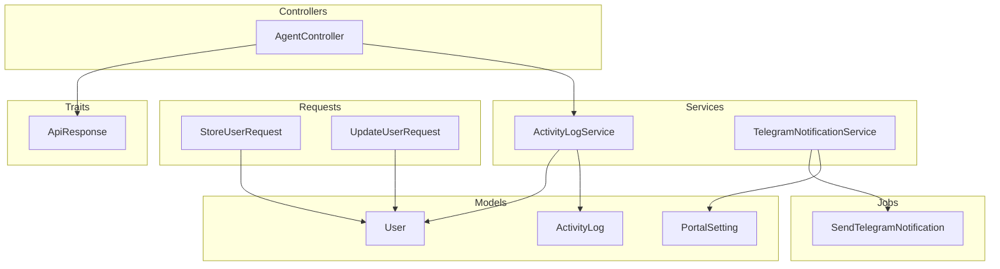
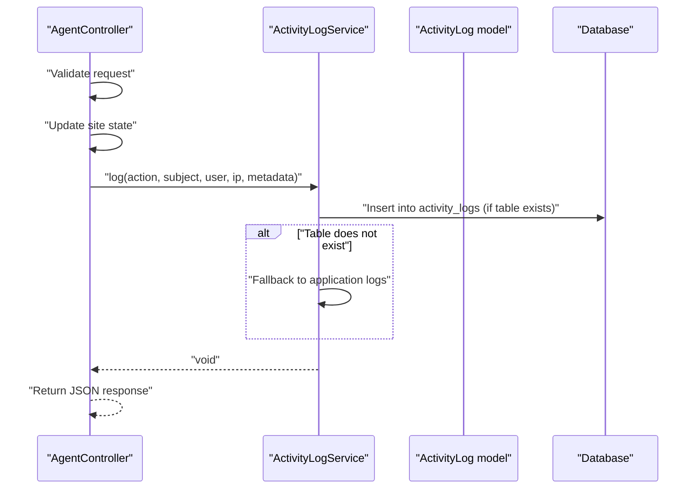
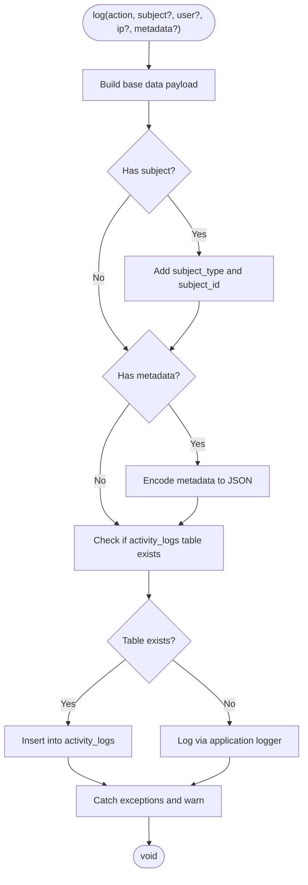
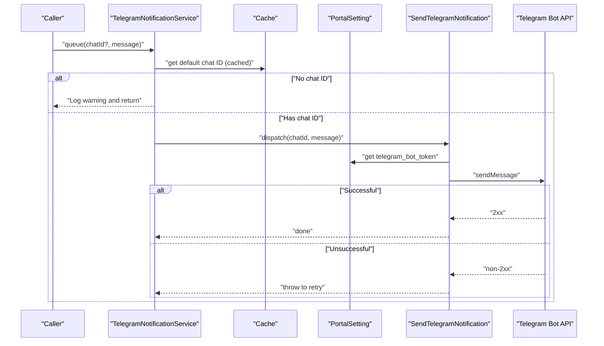
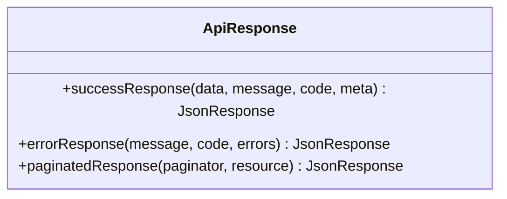
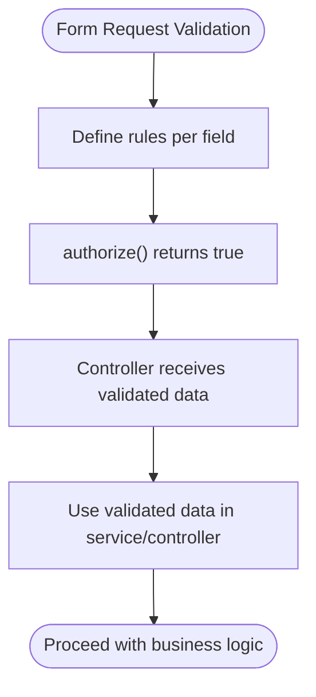
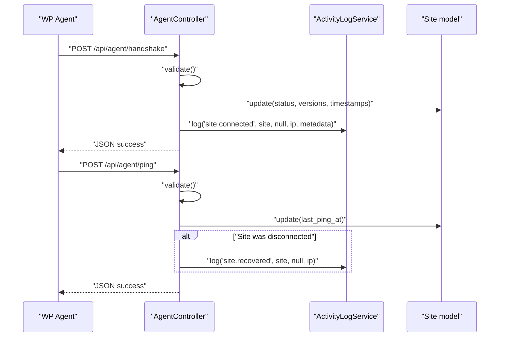
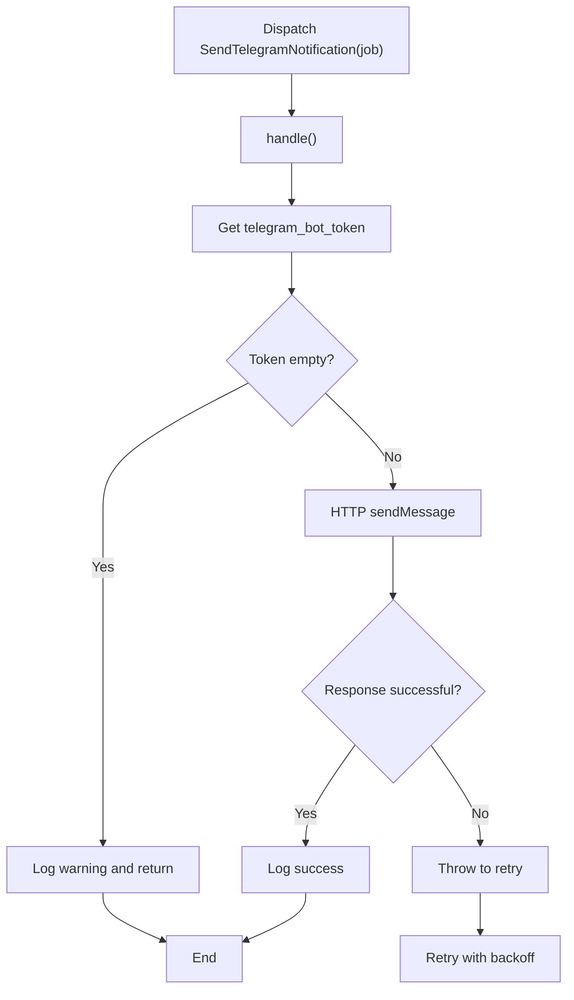
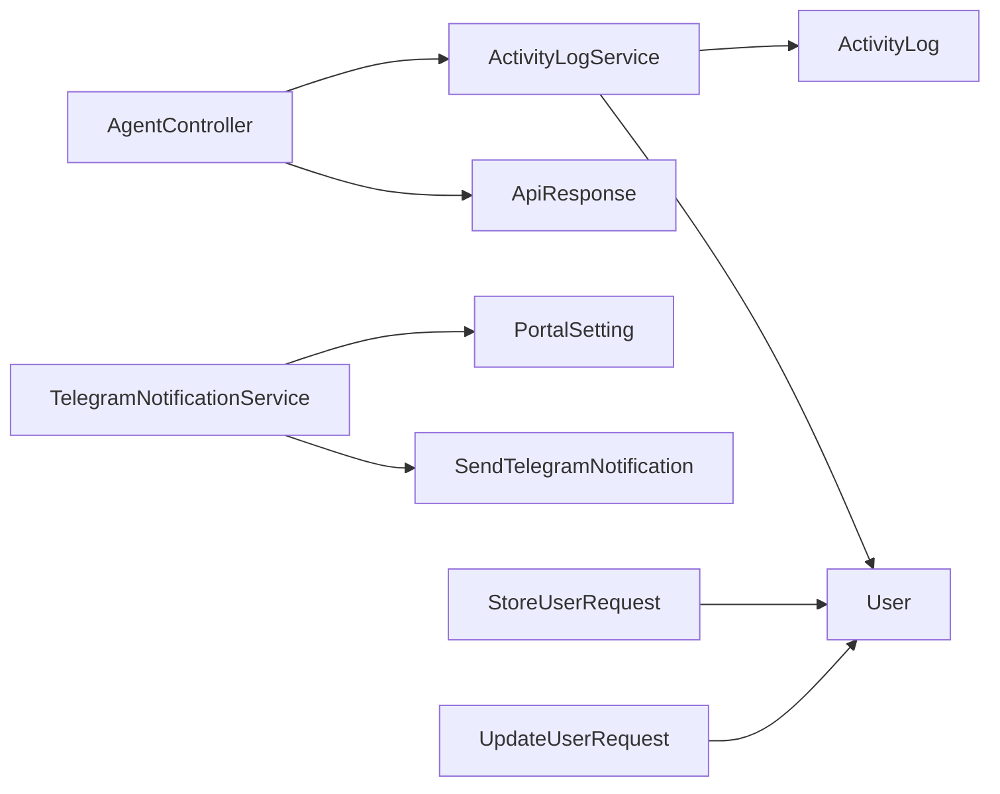

# Business Logic Services

<cite>
**Referenced Files in This Document**
- [ActivityLogService.php](file://portal/app/Services/ActivityLogService.php)
- [TelegramNotificationService.php](file://portal/app/Services/TelegramNotificationService.php)
- [ApiResponse.php](file://portal/app/Traits/ApiResponse.php)
- [ActivityLog.php](file://portal/app/Models/ActivityLog.php)
- [User.php](file://portal/app/Models/User.php)
- [StoreUserRequest.php](file://portal/app/Http/Requests/User/StoreUserRequest.php)
- [UpdateUserRequest.php](file://portal/app/Http/Requests/User/UpdateUserRequest.php)
- [AgentController.php](file://portal/app/Http/Controllers/Agent/AgentController.php)
- [SendTelegramNotification.php](file://portal/app/Jobs/SendTelegramNotification.php)
- [AppServiceProvider.php](file://portal/app/Providers/AppServiceProvider.php)
- [2026_05_15_070004_create_activity_logs_table.php](file://portal/database/migrations/2026_05_15_070004_create_activity_logs_table.php)
- [PortalSetting.php](file://portal/app/Models/PortalSetting.php)
- [api.php](file://portal/routes/api.php)
- [services.php](file://portal/config/services.php)
</cite>

## Table of Contents
1. [Introduction](#introduction)
2. [Project Structure](#project-structure)
3. [Core Components](#core-components)
4. [Architecture Overview](#architecture-overview)
5. [Detailed Component Analysis](#detailed-component-analysis)
6. [Dependency Analysis](#dependency-analysis)
7. [Performance Considerations](#performance-considerations)
8. [Troubleshooting Guide](#troubleshooting-guide)
9. [Conclusion](#conclusion)
10. [Appendices](#appendices)

## Introduction
This document explains the service layer architecture and business logic implementation in the portal application. It focuses on how services encapsulate complex operations, coordinate between models, repositories, and external systems, and enforce standardized response formatting. It documents the activity logging service, the notification service, request validation patterns via form request classes, and illustrates service composition, error handling, and transaction management. It also covers testing strategies, dependency injection, and service lifecycle management, and explains the ApiResponse trait for consistent API responses.

## Project Structure
The service layer resides under the application namespace and integrates with controllers, models, requests, jobs, and configuration. The primary service files are:
- ActivityLogService: central logging utility for auditable actions
- TelegramNotificationService: synchronous and asynchronous notifications via Telegram
- ApiResponse trait: standardized JSON response formatting
- Form Request classes: validation contracts for user creation and updates
- AgentController: demonstrates service usage in agent-facing endpoints
- SendTelegramNotification job: asynchronous delivery of Telegram messages
- AppServiceProvider: service provider for application-wide bindings
- ActivityLog model and migration: persistence and schema for activity logs
- PortalSetting model: settings-backed configuration for services
- Routes and configuration: integration points and third-party service credentials

**Diagram sources**
- [AgentController.php:1-99](file://portal/app/Http/Controllers/Agent/AgentController.php#L1-L99)
- [ActivityLogService.php:1-50](file://portal/app/Services/ActivityLogService.php#L1-L50)
- [TelegramNotificationService.php:1-107](file://portal/app/Services/TelegramNotificationService.php#L1-L107)
- [StoreUserRequest.php:1-26](file://portal/app/Http/Requests/User/StoreUserRequest.php#L1-L26)
- [UpdateUserRequest.php:1-27](file://portal/app/Http/Requests/User/UpdateUserRequest.php#L1-L27)
- [ActivityLog.php:1-37](file://portal/app/Models/ActivityLog.php#L1-L37)
- [User.php:1-38](file://portal/app/Models/User.php#L1-L38)
- [PortalSetting.php:1-11](file://portal/app/Models/PortalSetting.php#L1-L11)
- [SendTelegramNotification.php:1-62](file://portal/app/Jobs/SendTelegramNotification.php#L1-L62)
- [ApiResponse.php:1-56](file://portal/app/Traits/ApiResponse.php#L1-L56)

**Section sources**
- [AgentController.php:1-99](file://portal/app/Http/Controllers/Agent/AgentController.php#L1-L99)
- [ActivityLogService.php:1-50](file://portal/app/Services/ActivityLogService.php#L1-L50)
- [TelegramNotificationService.php:1-107](file://portal/app/Services/TelegramNotificationService.php#L1-L107)
- [ApiResponse.php:1-56](file://portal/app/Traits/ApiResponse.php#L1-L56)
- [StoreUserRequest.php:1-26](file://portal/app/Http/Requests/User/StoreUserRequest.php#L1-L26)
- [UpdateUserRequest.php:1-27](file://portal/app/Http/Requests/User/UpdateUserRequest.php#L1-L27)
- [ActivityLog.php:1-37](file://portal/app/Models/ActivityLog.php#L1-L37)
- [User.php:1-38](file://portal/app/Models/User.php#L1-L38)
- [PortalSetting.php:1-11](file://portal/app/Models/PortalSetting.php#L1-L11)
- [SendTelegramNotification.php:1-62](file://portal/app/Jobs/SendTelegramNotification.php#L1-L62)
- [AppServiceProvider.php:1-25](file://portal/app/Providers/AppServiceProvider.php#L1-L25)
- [2026_05_15_070004_create_activity_logs_table.php:1-32](file://portal/database/migrations/2026_05_15_070004_create_activity_logs_table.php#L1-L32)
- [api.php:1-58](file://portal/routes/api.php#L1-L58)
- [services.php:1-39](file://portal/config/services.php#L1-L39)

## Core Components
- ActivityLogService: Provides centralized logging for auditable actions, supports optional subject polymorphism, metadata, and graceful fallback to application logs when the activity_logs table is unavailable.
- TelegramNotificationService: Offers synchronous sending for testing and asynchronous queuing for production, with cached configuration retrieval and explicit cache invalidation.
- ApiResponse trait: Standardizes success, error, and paginated responses with consistent keys and optional metadata.
- Form Request classes: Define strict validation rules for user creation and updates, enabling declarative validation in controllers.
- AgentController: Demonstrates service usage for agent handshake and periodic ping, including activity logging and response formatting.
- SendTelegramNotification job: Implements retry logic with exponential backoff and failure handling for asynchronous Telegram messaging.
- AppServiceProvider: Application service provider for registering and binding services.
- ActivityLog model and migration: Persist activity logs with indexing and morph relations for subjects.
- PortalSetting model: Stores key-value settings consumed by services.

**Section sources**
- [ActivityLogService.php:1-50](file://portal/app/Services/ActivityLogService.php#L1-L50)
- [TelegramNotificationService.php:1-107](file://portal/app/Services/TelegramNotificationService.php#L1-L107)
- [ApiResponse.php:1-56](file://portal/app/Traits/ApiResponse.php#L1-L56)
- [StoreUserRequest.php:1-26](file://portal/app/Http/Requests/User/StoreUserRequest.php#L1-L26)
- [UpdateUserRequest.php:1-27](file://portal/app/Http/Requests/User/UpdateUserRequest.php#L1-L27)
- [AgentController.php:1-99](file://portal/app/Http/Controllers/Agent/AgentController.php#L1-L99)
- [SendTelegramNotification.php:1-62](file://portal/app/Jobs/SendTelegramNotification.php#L1-L62)
- [AppServiceProvider.php:1-25](file://portal/app/Providers/AppServiceProvider.php#L1-L25)
- [ActivityLog.php:1-37](file://portal/app/Models/ActivityLog.php#L1-L37)
- [2026_05_15_070004_create_activity_logs_table.php:1-32](file://portal/database/migrations/2026_05_15_070004_create_activity_logs_table.php#L1-L32)
- [PortalSetting.php:1-11](file://portal/app/Models/PortalSetting.php#L1-L11)

## Architecture Overview
The service layer sits between controllers and persistence/external systems. Controllers orchestrate requests, delegate validation to form requests, and invoke services for business logic. Services encapsulate cross-cutting concerns such as logging and notifications, and coordinate with models and configuration.

**Diagram sources**
- [AgentController.php:16-55](file://portal/app/Http/Controllers/Agent/AgentController.php#L16-L55)
- [ActivityLogService.php:16-48](file://portal/app/Services/ActivityLogService.php#L16-L48)
- [ActivityLog.php:9-37](file://portal/app/Models/ActivityLog.php#L9-L37)

**Section sources**
- [AgentController.php:16-55](file://portal/app/Http/Controllers/Agent/AgentController.php#L16-L55)
- [ActivityLogService.php:16-48](file://portal/app/Services/ActivityLogService.php#L16-L48)
- [ActivityLog.php:9-37](file://portal/app/Models/ActivityLog.php#L9-L37)

## Detailed Component Analysis

### ActivityLogService
Purpose:
- Centralized logging for auditable actions with optional subject polymorphism and metadata.
- Graceful degradation when the activity_logs table is missing by falling back to application logs.

Key behaviors:
- Accepts action, optional subject (Eloquent model), optional user, optional IP address, and optional metadata.
- Detects subject type and ID via Eloquent introspection.
- Inserts into activity_logs if the table exists; otherwise logs via application logger.
- Encodes metadata to JSON before insertion; logs warnings on failures.

**Diagram sources**
- [ActivityLogService.php:16-48](file://portal/app/Services/ActivityLogService.php#L16-L48)

**Section sources**
- [ActivityLogService.php:16-48](file://portal/app/Services/ActivityLogService.php#L16-L48)
- [2026_05_15_070004_create_activity_logs_table.php:11-24](file://portal/database/migrations/2026_05_15_070004_create_activity_logs_table.php#L11-L24)
- [ActivityLog.php:13-25](file://portal/app/Models/ActivityLog.php#L13-L25)

### TelegramNotificationService
Purpose:
- Provide synchronous sending for testing and asynchronous queuing for production.
- Retrieve and cache Telegram bot token and default chat ID from settings.
- Support admin channel notifications and cache invalidation.

Key behaviors:
- send(chatId, message): synchronous HTTP call to Telegram Bot API with timeout and error logging.
- queue(chatId?, message): dispatches SendTelegramNotification job; defaults to cached default chat ID.
- notifyAdminChannel(message): convenience method to queue to default chat ID.
- getBotToken()/getDefaultChatId(): cached retrieval via PortalSetting.
- clearCache(): clears cached settings after configuration changes.

**Diagram sources**
- [TelegramNotificationService.php:53-105](file://portal/app/Services/TelegramNotificationService.php#L53-L105)
- [SendTelegramNotification.php:25-52](file://portal/app/Jobs/SendTelegramNotification.php#L25-L52)
- [PortalSetting.php:9](file://portal/app/Models/PortalSetting.php#L9)

**Section sources**
- [TelegramNotificationService.php:16-105](file://portal/app/Services/TelegramNotificationService.php#L16-L105)
- [SendTelegramNotification.php:25-60](file://portal/app/Jobs/SendTelegramNotification.php#L25-L60)
- [PortalSetting.php:9](file://portal/app/Models/PortalSetting.php#L9)

### ApiResponse Trait
Purpose:
- Standardize API responses across controllers with consistent keys and optional metadata.

Key behaviors:
- successResponse(data?, message?, code=200, meta[]): constructs success envelope with optional message and meta.
- errorResponse(message, code=400, errors?): constructs error envelope with optional errors.
- paginatedResponse(paginator, resource?): wraps items with pagination metadata.

**Diagram sources**
- [ApiResponse.php:9-54](file://portal/app/Traits/ApiResponse.php#L9-L54)

**Section sources**
- [ApiResponse.php:9-54](file://portal/app/Traits/ApiResponse.php#L9-L54)

### Form Request Classes (Validation Patterns)
Purpose:
- Declarative validation for user creation and updates, enforcing business rules at the boundary.

Key behaviors:
- StoreUserRequest: validates required fields, unique email, role enumeration, and optional booleans.
- UpdateUserRequest: conditionally validates fields and ignores current user’s email uniqueness during update.

**Diagram sources**
- [StoreUserRequest.php:14-24](file://portal/app/Http/Requests/User/StoreUserRequest.php#L14-L24)
- [UpdateUserRequest.php:15-25](file://portal/app/Http/Requests/User/UpdateUserRequest.php#L15-L25)

**Section sources**
- [StoreUserRequest.php:14-24](file://portal/app/Http/Requests/User/StoreUserRequest.php#L14-L24)
- [UpdateUserRequest.php:15-25](file://portal/app/Http/Requests/User/UpdateUserRequest.php#L15-L25)

### AgentController Integration
Purpose:
- Demonstrate service composition in agent-facing endpoints: handshake and ping.

Key behaviors:
- handshake: validates agent-provided metadata, updates site state, and logs “site.connected” with metadata.
- ping: validates heartbeat payload, recovers disconnected sites, logs “site.recovered” if needed, and updates timestamps.

**Diagram sources**
- [AgentController.php:16-97](file://portal/app/Http/Controllers/Agent/AgentController.php#L16-L97)
- [ActivityLogService.php:16-48](file://portal/app/Services/ActivityLogService.php#L16-L48)

**Section sources**
- [AgentController.php:16-97](file://portal/app/Http/Controllers/Agent/AgentController.php#L16-L97)
- [ActivityLogService.php:16-48](file://portal/app/Services/ActivityLogService.php#L16-L48)

### Notification Job (Asynchronous Delivery)
Purpose:
- Asynchronously deliver Telegram notifications with retries and failure handling.

Key behaviors:
- handle(): retrieves token, sends message, logs outcomes, and throws on failure to trigger retry.
- failed(): logs permanent failure details.

**Diagram sources**
- [SendTelegramNotification.php:25-60](file://portal/app/Jobs/SendTelegramNotification.php#L25-L60)

**Section sources**
- [SendTelegramNotification.php:25-60](file://portal/app/Jobs/SendTelegramNotification.php#L25-L60)

### Service Lifecycle and Dependency Injection
- AppServiceProvider: placeholder for registering and binding services; can be extended to bind interfaces to implementations or configure singleton lifecycles.
- Jobs: leverage Laravel’s queue infrastructure; constructor injection of primitive parameters is supported by the framework.

Recommendations:
- Bind interfaces in a service provider for testability and flexibility.
- Use queued jobs for long-running or external API calls to keep controllers responsive.
- Keep services stateless where possible to simplify lifecycle management.

**Section sources**
- [AppServiceProvider.php:12-23](file://portal/app/Providers/AppServiceProvider.php#L12-L23)
- [SendTelegramNotification.php:20-23](file://portal/app/Jobs/SendTelegramNotification.php#L20-L23)

## Dependency Analysis
- Controllers depend on services and traits for business logic and response formatting.
- Services depend on models and configuration for persistence and settings.
- Jobs depend on services for configuration retrieval and external APIs.
- Form requests decouple validation from controllers, promoting reuse and clarity.

**Diagram sources**
- [AgentController.php:1-99](file://portal/app/Http/Controllers/Agent/AgentController.php#L1-L99)
- [ActivityLogService.php:1-50](file://portal/app/Services/ActivityLogService.php#L1-L50)
- [TelegramNotificationService.php:1-107](file://portal/app/Services/TelegramNotificationService.php#L1-L107)
- [SendTelegramNotification.php:1-62](file://portal/app/Jobs/SendTelegramNotification.php#L1-L62)
- [ActivityLog.php:1-37](file://portal/app/Models/ActivityLog.php#L1-L37)
- [User.php:1-38](file://portal/app/Models/User.php#L1-L38)
- [PortalSetting.php:1-11](file://portal/app/Models/PortalSetting.php#L1-L11)
- [StoreUserRequest.php:1-26](file://portal/app/Http/Requests/User/StoreUserRequest.php#L1-L26)
- [UpdateUserRequest.php:1-27](file://portal/app/Http/Requests/User/UpdateUserRequest.php#L1-L27)
- [ApiResponse.php:1-56](file://portal/app/Traits/ApiResponse.php#L1-L56)

**Section sources**
- [AgentController.php:1-99](file://portal/app/Http/Controllers/Agent/AgentController.php#L1-L99)
- [ActivityLogService.php:1-50](file://portal/app/Services/ActivityLogService.php#L1-L50)
- [TelegramNotificationService.php:1-107](file://portal/app/Services/TelegramNotificationService.php#L1-L107)
- [SendTelegramNotification.php:1-62](file://portal/app/Jobs/SendTelegramNotification.php#L1-L62)
- [ActivityLog.php:1-37](file://portal/app/Models/ActivityLog.php#L1-L37)
- [User.php:1-38](file://portal/app/Models/User.php#L1-L38)
- [PortalSetting.php:1-11](file://portal/app/Models/PortalSetting.php#L1-L11)
- [StoreUserRequest.php:1-26](file://portal/app/Http/Requests/User/StoreUserRequest.php#L1-L26)
- [UpdateUserRequest.php:1-27](file://portal/app/Http/Requests/User/UpdateUserRequest.php#L1-L27)
- [ApiResponse.php:1-56](file://portal/app/Traits/ApiResponse.php#L1-L56)

## Performance Considerations
- ActivityLogService: Uses lightweight inserts when the table exists; falls back to logs otherwise. Consider batching or asynchronous logging for high-volume scenarios.
- TelegramNotificationService: Caches tokens and chat IDs to reduce database queries; still performs HTTP calls. Use queueing for bursty traffic.
- SendTelegramNotification: Includes retry attempts and backoff; ensure queue workers are scaled appropriately.
- ApiResponse: Keep payloads lean; avoid unnecessary serialization overhead.

[No sources needed since this section provides general guidance]

## Troubleshooting Guide
Common issues and resolutions:
- Activity logs not persisted:
  - Verify the activity_logs table exists and is migrated.
  - Confirm database connectivity and permissions.
  - Review fallback logs for warnings indicating failures.
- Telegram notifications fail:
  - Check that the bot token and default chat ID are set and cached.
  - Inspect job worker logs for retry attempts and permanent failures.
  - Validate network reachability to the Telegram Bot API.
- Validation errors:
  - Ensure form requests are applied in controllers.
  - Confirm unique constraints and rule applicability for updates.

**Section sources**
- [ActivityLogService.php:34-47](file://portal/app/Services/ActivityLogService.php#L34-L47)
- [TelegramNotificationService.php:18-47](file://portal/app/Services/TelegramNotificationService.php#L18-L47)
- [SendTelegramNotification.php:40-60](file://portal/app/Jobs/SendTelegramNotification.php#L40-L60)
- [StoreUserRequest.php:14-24](file://portal/app/Http/Requests/User/StoreUserRequest.php#L14-L24)
- [UpdateUserRequest.php:15-25](file://portal/app/Http/Requests/User/UpdateUserRequest.php#L15-L25)

## Conclusion
The service layer cleanly separates business logic from controllers and persistence, enabling maintainability, testability, and scalability. ActivityLogService and TelegramNotificationService demonstrate robust error handling, graceful fallbacks, and asynchronous processing. ApiResponse ensures consistent API responses. Form requests enforce validation close to the boundary. With proper queueing, caching, and provider bindings, the system supports reliable operations across agent integrations and administrative tasks.

[No sources needed since this section summarizes without analyzing specific files]

## Appendices

### Transaction Management
- For multi-step operations, wrap service calls in database transactions to ensure atomicity.
- Use explicit transactions around writes to activity logs and external API calls to maintain consistency.
- Roll back on exceptions and surface user-friendly errors via ApiResponse.

[No sources needed since this section provides general guidance]

### Testing Strategies
- Unit tests:
  - Mock external APIs (e.g., Telegram) and database for isolated testing.
  - Test validation rules via form request classes.
- Feature tests:
  - Simulate agent handshake and ping requests; assert logged activities and response formats.
  - Verify queued jobs and retry behavior.
- Service tests:
  - Validate success/error responses and pagination envelopes using ApiResponse.

[No sources needed since this section provides general guidance]

### Integration Points and Configuration
- Routes define protected and role-based access; ensure services honor middleware constraints.
- Third-party service credentials are managed via configuration; integrate with services that require external tokens.

**Section sources**
- [api.php:13-57](file://portal/routes/api.php#L13-L57)
- [services.php:17-36](file://portal/config/services.php#L17-L36)