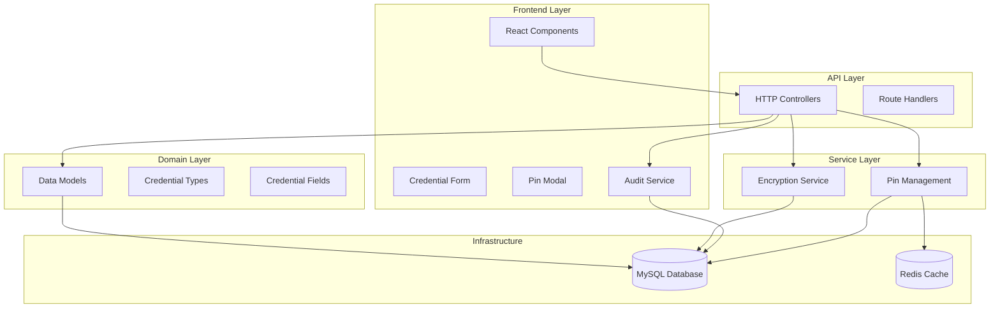
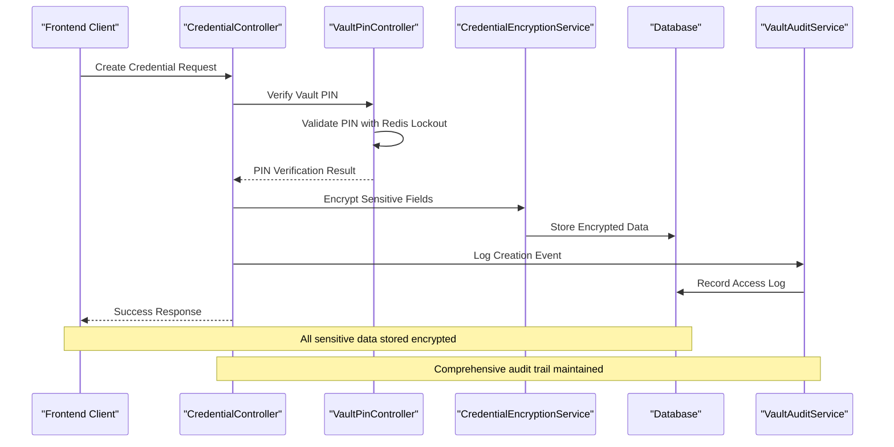
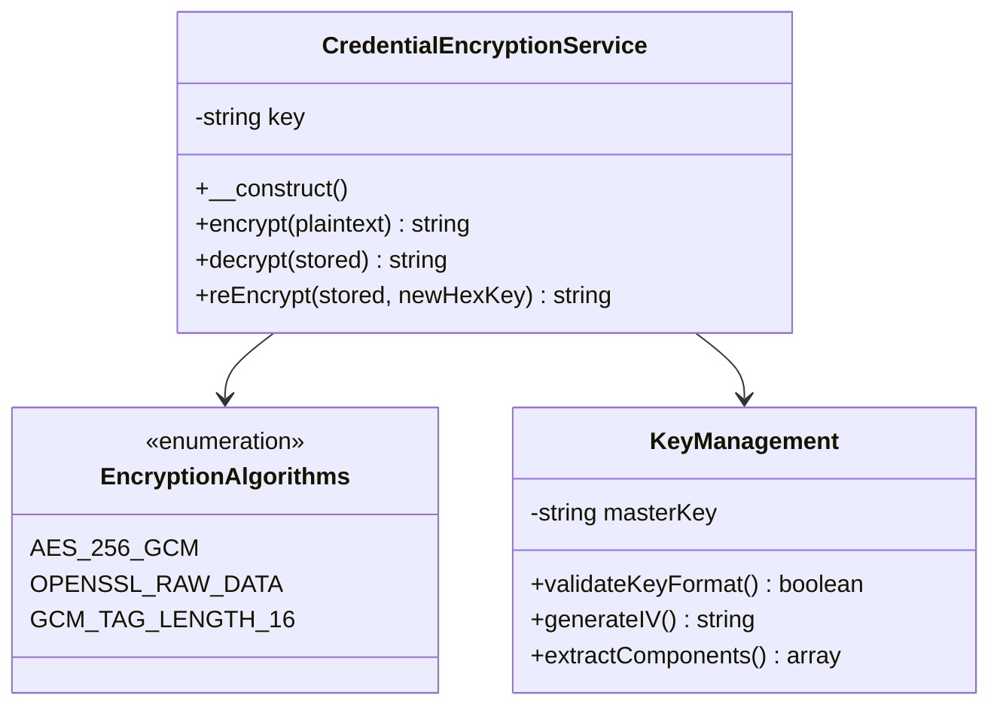
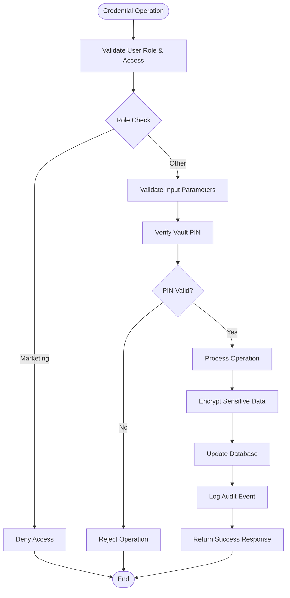
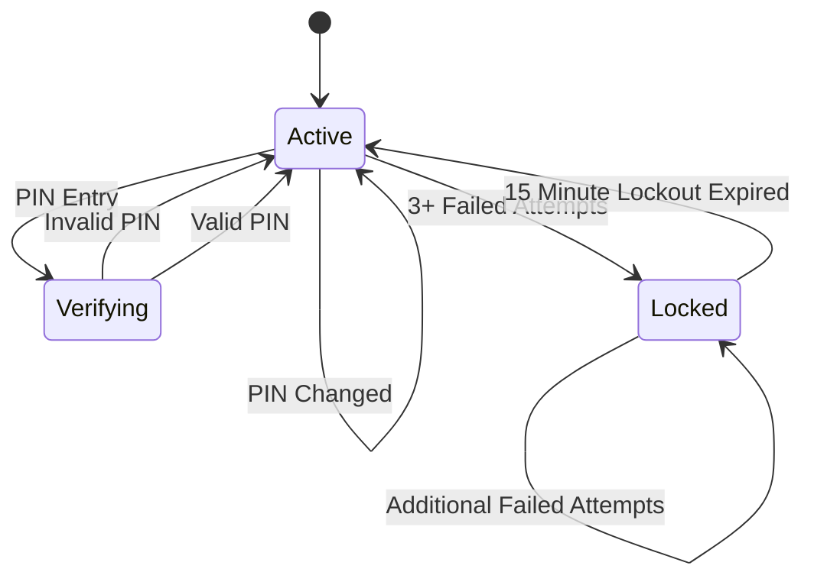
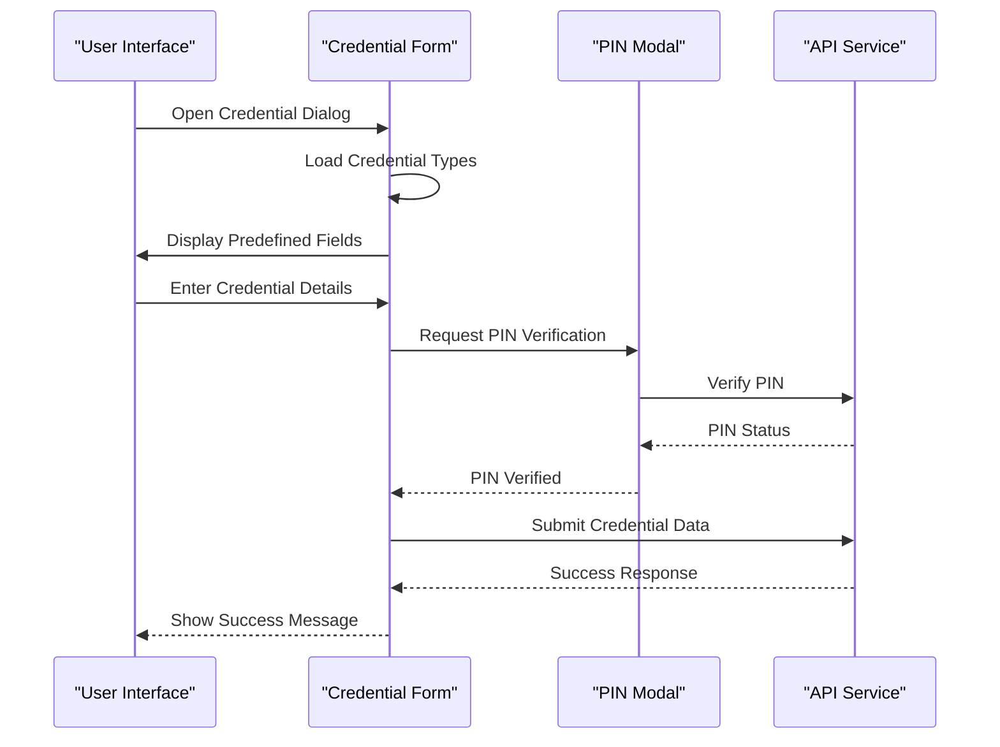
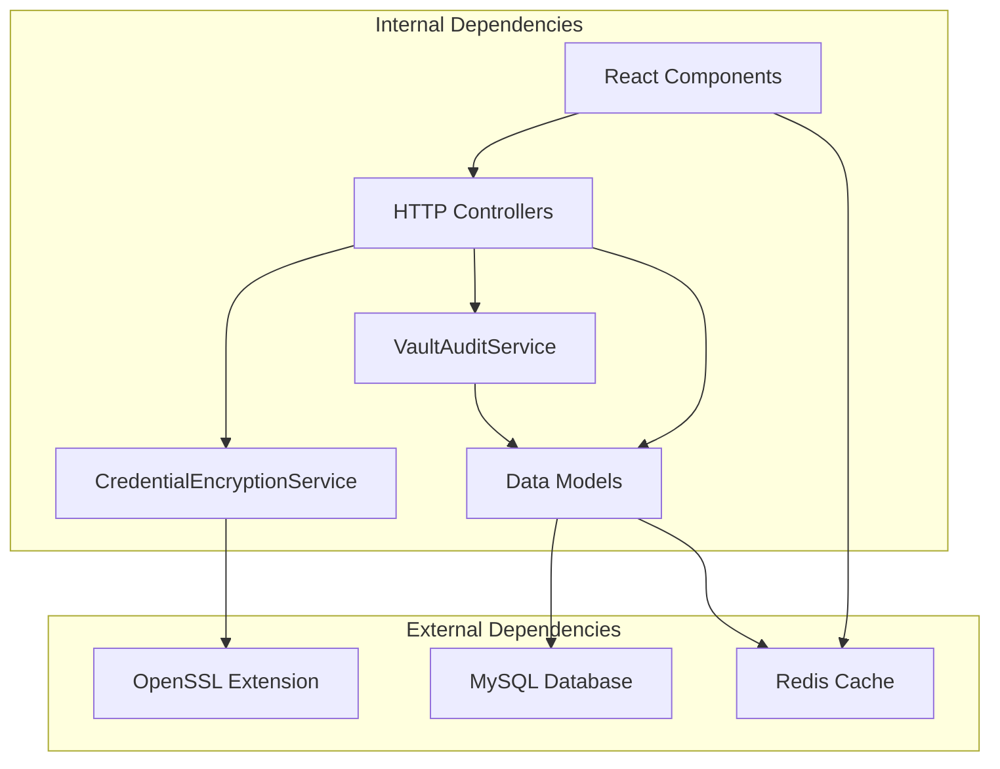

# Credential Vault System

<cite>
**Referenced Files in This Document**
- [CredentialEncryptionService.php](file://portal/app/Services/CredentialEncryptionService.php)
- [CredentialController.php](file://portal/app/Http/Controllers/Portal/CredentialController.php)
- [VaultPinController.php](file://portal/app/Http/Controllers/Portal/VaultPinController.php)
- [VaultLogController.php](file://portal/app/Http/Controllers/Portal/VaultLogController.php)
- [VaultAuditService.php](file://portal/app/Services/VaultAuditService.php)
- [SiteCredential.php](file://portal/app/Models/SiteCredential.php)
- [SiteCredentialField.php](file://portal/app/Models/SiteCredentialField.php)
- [CredentialType.php](file://portal/app/Models/CredentialType.php)
- [VaultAccessLog.php](file://portal/app/Models/VaultAccessLog.php)
- [User.php](file://portal/app/Models/User.php)
- [2026_05_16_090001_create_credential_types_table.php](file://portal/database/migrations/2026_05_16_090001_create_credential_types_table.php)
- [2026_05_16_090002_create_site_credentials_table.php](file://portal/database/migrations/2026_05_16_090002_create_site_credentials_table.php)
- [2026_05_16_090003_create_site_credential_fields_table.php](file://portal/database/migrations/2026_05_16_090003_create_site_credential_fields_table.php)
- [credential-form-dialog.tsx](file://portal/frontend/src/components/vault/credential-form-dialog.tsx)
- [pin-modal.tsx](file://portal/frontend/src/components/vault/pin-modal.tsx)
- [vault-audit-log.tsx](file://portal/frontend/src/components/vault/vault-audit-log.tsx)
</cite>

## Table of Contents
1. [Introduction](#introduction)
2. [Project Structure](#project-structure)
3. [Core Components](#core-components)
4. [Architecture Overview](#architecture-overview)
5. [Detailed Component Analysis](#detailed-component-analysis)
6. [Dependency Analysis](#dependency-analysis)
7. [Performance Considerations](#performance-considerations)
8. [Troubleshooting Guide](#troubleshooting-guide)
9. [Conclusion](#conclusion)

## Introduction
The Credential Vault System is a secure, role-based credential management solution integrated into a larger portal application. It provides centralized storage for sensitive site credentials with strong encryption, PIN-based access control, audit logging, and a user-friendly frontend interface. The system supports multiple credential types (e.g., WordPress, FTP, SFTP, Database) with customizable fields and enforces strict access controls based on user roles and site assignments.

## Project Structure
The system follows a layered architecture with clear separation between backend services, models, controllers, and frontend components:



**Diagram sources**
- [CredentialController.php:20-35](file://portal/app/Http/Controllers/Portal/CredentialController.php#L20-L35)
- [CredentialEncryptionService.php:7-18](file://portal/app/Services/CredentialEncryptionService.php#L7-L18)
- [VaultAuditService.php:7-31](file://portal/app/Services/VaultAuditService.php#L7-L31)

**Section sources**
- [CredentialController.php:1-531](file://portal/app/Http/Controllers/Portal/CredentialController.php#L1-L531)
- [CredentialEncryptionService.php:1-119](file://portal/app/Services/CredentialEncryptionService.php#L1-L119)

## Core Components
The system consists of several interconnected components that work together to provide secure credential management:

### Encryption Service
The core encryption service provides AES-256-GCM encryption for sensitive data with automatic key validation and format handling.

### Credential Management Controllers
Multiple controllers handle different aspects of credential operations including creation, retrieval, updates, and access verification.

### Audit and Security Systems
Comprehensive audit logging tracks all credential access events with IP address and user agent capture for security monitoring.

### Frontend Interfaces
React-based components provide intuitive forms for credential management with PIN verification and real-time feedback.

**Section sources**
- [CredentialEncryptionService.php:24-86](file://portal/app/Services/CredentialEncryptionService.php#L24-L86)
- [CredentialController.php:75-152](file://portal/app/Http/Controllers/Portal/CredentialController.php#L75-L152)
- [VaultAuditService.php:12-30](file://portal/app/Services/VaultAuditService.php#L12-L30)

## Architecture Overview
The system implements a multi-layered security architecture with defense-in-depth principles:



**Diagram sources**
- [CredentialController.php:98-135](file://portal/app/Http/Controllers/Portal/CredentialController.php#L98-L135)
- [VaultPinController.php:84-111](file://portal/app/Http/Controllers/Portal/VaultPinController.php#L84-L111)
- [CredentialEncryptionService.php:24-45](file://portal/app/Services/CredentialEncryptionService.php#L24-L45)

The architecture ensures:
- **Data Protection**: All sensitive information is encrypted at rest
- **Access Control**: Multi-factor authentication via PIN verification
- **Auditability**: Complete audit trail of all credential operations
- **Scalability**: Modular design supporting future enhancements

## Detailed Component Analysis

### Credential Encryption Service
The encryption service provides robust security through AES-256-GCM with proper initialization vector and authentication tag management.



**Diagram sources**
- [CredentialEncryptionService.php:7-18](file://portal/app/Services/CredentialEncryptionService.php#L7-L18)
- [CredentialEncryptionService.php:24-86](file://portal/app/Services/CredentialEncryptionService.php#L24-L86)

Key security features:
- **Master Key Validation**: Ensures 64-character hex format (32 bytes)
- **Random IV Generation**: Prevents pattern recognition attacks
- **Authentication Tags**: Prevents tampering detection
- **Base64 Encoding**: Safe transport format for encrypted data

**Section sources**
- [CredentialEncryptionService.php:11-18](file://portal/app/Services/CredentialEncryptionService.php#L11-L18)
- [CredentialEncryptionService.php:24-45](file://portal/app/Services/CredentialEncryptionService.php#L24-L45)

### Credential Management Controller
The main controller orchestrates all credential operations with comprehensive validation and role-based access control.



**Diagram sources**
- [CredentialController.php:40-69](file://portal/app/Http/Controllers/Portal/CredentialController.php#L40-L69)
- [CredentialController.php:98-135](file://portal/app/Http/Controllers/Portal/CredentialController.php#L98-L135)

**Section sources**
- [CredentialController.php:40-69](file://portal/app/Http/Controllers/Portal/CredentialController.php#L40-L69)
- [CredentialController.php:98-135](file://portal/app/Http/Controllers/Portal/CredentialController.php#L98-L135)

### Vault PIN Management
The PIN system provides layered security with lockout mechanisms and comprehensive error handling.



**Diagram sources**
- [VaultPinController.php:116-129](file://portal/app/Http/Controllers/Portal/VaultPinController.php#L116-L129)
- [VaultPinController.php:134-163](file://portal/app/Http/Controllers/Portal/VaultPinController.php#L134-L163)

**Section sources**
- [VaultPinController.php:116-129](file://portal/app/Http/Controllers/Portal/VaultPinController.php#L116-L129)
- [VaultPinController.php:134-163](file://portal/app/Http/Controllers/Portal/VaultPinController.php#L134-L163)

### Data Models and Relationships
The system uses Eloquent ORM models with proper relationships and casting for secure data handling.

```mermaid
erDiagram
CREDENTIAL_TYPES {
int id PK
string name
string slug UK
string icon
int sort_order
datetime created_at
}
SITE_CREDENTIALS {
int id PK
int site_id FK
int credential_type_id FK
string label
text notes
int created_by FK
int updated_by FK
timestamps
}
SITE_CREDENTIAL_FIELDS {
int id PK
int site_credential_id FK
string field_key
string field_label
text field_value
boolean is_sensitive
int sort_order
timestamps
}
VAULT_ACCESS_LOGS {
int id PK
int user_id FK
int site_id FK
int site_credential_id FK
string action
string field_key
string ip_address
string user_agent
array metadata
datetime created_at
}
CREDENTIAL_TYPES ||--o{ SITE_CREDENTIALS : contains
SITE_CREDENTIALS ||--o{ SITE_CREDENTIAL_FIELDS : has_many
SITE_CREDENTIALS ||--o{ VAULT_ACCESS_LOGS : generates
```

**Diagram sources**
- [2026_05_16_090001_create_credential_types_table.php:11-18](file://portal/database/migrations/2026_05_16_090001_create_credential_types_table.php#L11-L18)
- [2026_05_16_090002_create_site_credentials_table.php:11-19](file://portal/database/migrations/2026_05_16_090002_create_site_credentials_table.php#L11-L19)
- [2026_05_16_090003_create_site_credential_fields_table.php:11-19](file://portal/database/migrations/2026_05_16_090003_create_site_credential_fields_table.php#L11-L19)

**Section sources**
- [CredentialType.php:8-35](file://portal/app/Models/CredentialType.php#L8-L35)
- [SiteCredential.php:9-53](file://portal/app/Models/SiteCredential.php#L9-L53)
- [SiteCredentialField.php:8-27](file://portal/app/Models/SiteCredentialField.php#L8-L27)

### Frontend Credential Management
The React-based frontend provides intuitive interfaces for credential management with real-time validation and user feedback.



**Diagram sources**
- [credential-form-dialog.tsx:104-120](file://portal/frontend/src/components/vault/credential-form-dialog.tsx#L104-L120)
- [credential-form-dialog.tsx:218-257](file://portal/frontend/src/components/vault/credential-form-dialog.tsx#L218-L257)
- [pin-modal.tsx:81-115](file://portal/frontend/src/components/vault/pin-modal.tsx#L81-L115)

**Section sources**
- [credential-form-dialog.tsx:104-120](file://portal/frontend/src/components/vault/credential-form-dialog.tsx#L104-L120)
- [credential-form-dialog.tsx:218-257](file://portal/frontend/src/components/vault/credential-form-dialog.tsx#L218-L257)
- [pin-modal.tsx:81-115](file://portal/frontend/src/components/vault/pin-modal.tsx#L81-L115)

## Dependency Analysis
The system exhibits clean dependency management with clear separation of concerns:



**Diagram sources**
- [CredentialEncryptionService.php:5-6](file://portal/app/Services/CredentialEncryptionService.php#L5-L6)
- [VaultAuditService.php:5-6](file://portal/app/Services/VaultAuditService.php#L5-L6)

**Section sources**
- [CredentialEncryptionService.php:5-6](file://portal/app/Services/CredentialEncryptionService.php#L5-L6)
- [VaultAuditService.php:5-6](file://portal/app/Services/VaultAuditService.php#L5-L6)

## Performance Considerations
The system incorporates several performance optimization strategies:

### Caching Strategy
- **Redis for Session Management**: PIN attempts and lockout states cached with TTL
- **Database Indexing**: Proper indexing on foreign keys and frequently queried fields
- **Lazy Loading**: Eager loading of related models to prevent N+1 queries

### Encryption Performance
- **Efficient IV Generation**: Random but lightweight initialization vectors
- **Batch Operations**: Transaction-based operations for atomic credential updates
- **Memory Management**: Proper cleanup of encryption contexts

### Frontend Optimization
- **Component Memoization**: React memoization for expensive computations
- **Virtualized Lists**: Efficient rendering of large audit log lists
- **Debounced Search**: Optimized filtering for large datasets

## Troubleshooting Guide

### Common Issues and Solutions

#### Encryption Errors
**Problem**: Decryption failures or invalid encrypted format
**Solution**: Verify master key configuration and check encryption format consistency

#### PIN Authentication Failures
**Problem**: Users unable to access vault despite correct PIN
**Solution**: Check Redis connectivity and verify lockout state expiration

#### Permission Denied Errors
**Problem**: Marketing users or unauthorized personnel accessing credentials
**Solution**: Review user role assignments and site membership permissions

#### Audit Log Inconsistencies
**Problem**: Missing or incomplete audit trail entries
**Solution**: Verify database connection and ensure proper logging middleware configuration

**Section sources**
- [CredentialEncryptionService.php:58-83](file://portal/app/Services/CredentialEncryptionService.php#L58-L83)
- [VaultPinController.php:134-163](file://portal/app/Http/Controllers/Portal/VaultPinController.php#L134-L163)
- [CredentialController.php:44-52](file://portal/app/Http/Controllers/Portal/CredentialController.php#L44-L52)

## Conclusion
The Credential Vault System provides a comprehensive, secure solution for managing sensitive credentials across multiple sites and applications. Its multi-layered security approach, combining encryption, PIN-based access control, and comprehensive audit logging, ensures both data protection and operational transparency. The modular architecture supports future enhancements while maintaining strong security boundaries and clear separation of concerns.

The system successfully balances security requirements with usability, providing administrators with powerful credential management capabilities while protecting sensitive data through industry-standard encryption and access control mechanisms. The React-based frontend enhances user experience without compromising security, making the system both practical and secure for enterprise environments.