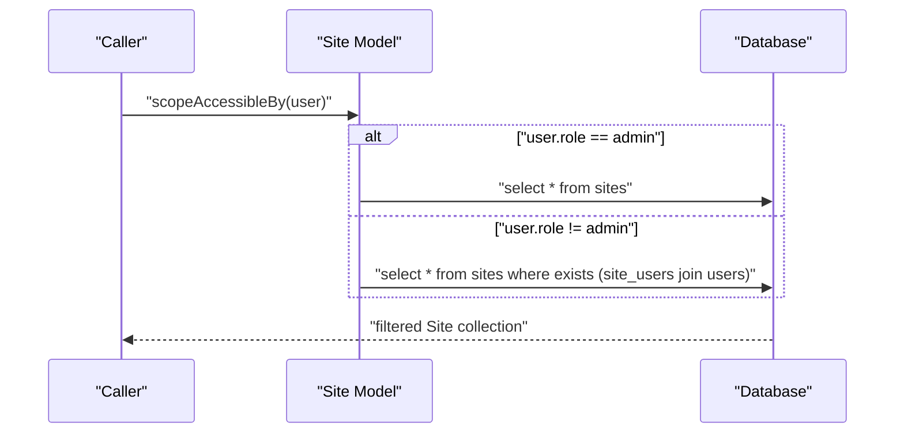

# Data Models & Database Schema

<cite>
**Referenced Files in This Document**
- [User.php](file://portal/app/Models/User.php)
- [Hosting.php](file://portal/app/Models/Hosting.php)
- [Site.php](file://portal/app/Models/Site.php)
- [ActivityLog.php](file://portal/app/Models/ActivityLog.php)
- [PortalSetting.php](file://portal/app/Models/PortalSetting.php)
- [Plugin.php](file://portal/app/Models/Plugin.php)
- [PluginVersion.php](file://portal/app/Models/PluginVersion.php)
- [PluginChangelog.php](file://portal/app/Models/PluginChangelog.php)
- [SitePlugin.php](file://portal/app/Models/SitePlugin.php)
- [DeploymentJob.php](file://portal/app/Models/DeploymentJob.php)
- [DeploymentJobSite.php](file://portal/app/Models/DeploymentJobSite.php)
- [CredentialType.php](file://portal/app/Models/CredentialType.php)
- [SiteCredential.php](file://portal/app/Models/SiteCredential.php)
- [SiteCredentialField.php](file://portal/app/Models/SiteCredentialField.php)
- [VaultAccessLog.php](file://portal/app/Models/VaultAccessLog.php)
- [CredentialShareLink.php](file://portal/app/Models/CredentialShareLink.php)
- [AutologinToken.php](file://portal/app/Models/AutologinToken.php)
- [SecurityAlert.php](file://portal/app/Models/SecurityAlert.php)
- [SecurityScanRun.php](file://portal/app/Models/SecurityScanRun.php)
- [FileIntegrityBaseline.php](file://portal/app/Models/FileIntegrityBaseline.php)
- [FileIntegrityFinding.php](file://portal/app/Models/FileIntegrityFinding.php)
- [LoginEvent.php](file://portal/app/Models/LoginEvent.php)
- [KnownLoginIp.php](file://portal/app/Models/KnownLoginIp.php)
- [SiteVulnerability.php](file://portal/app/Models/SiteVulnerability.php)
- [SiteAdminUser.php](file://portal/app/Models/SiteAdminUser.php)
- [Site2faSetting.php](file://portal/app/Models/Site2faSetting.php)
- [SiteSecurityScore.php](file://portal/app/Models/SiteSecurityScore.php)
- [VulnerabilityDefinition.php](file://portal/app/Models/VulnerabilityDefinition.php)
- [VulnerabilitySyncLog.php](file://portal/app/Models/VulnerabilitySyncLog.php)
- [create_users_table.php](file://portal/database/migrations/0001_01_01_000000_create_users_table.php)
- [create_hostings_table.php](file://portal/database/migrations/2026_05_15_070001_create_hostings_table.php)
- [create_sites_table.php](file://portal/database/migrations/2026_05_15_070002_create_sites_table.php)
- [create_site_users_table.php](file://portal/database/migrations/2026_05_15_070003_create_site_users_table.php)
- [create_activity_logs_table.php](file://portal/database/migrations/2026_05_15_070004_create_activity_logs_table.php)
- [create_portal_settings_table.php](file://portal/database/migrations/2026_05_15_070005_create_portal_settings_table.php)
- [create_plugins_table.php](file://portal/database/migrations/2026_05_15_080001_create_plugins_table.php)
- [create_plugin_versions_table.php](file://portal/database/migrations/2026_05_15_080002_create_plugin_versions_table.php)
- [create_plugin_changelogs_table.php](file://portal/database/migrations/2026_05_15_080003_create_plugin_changelogs_table.php)
- [create_site_plugins_table.php](file://portal/database/migrations/2026_05_15_080004_create_site_plugins_table.php)
- [create_deployment_jobs_table.php](file://portal/database/migrations/2026_05_15_080005_create_deployment_jobs_table.php)
- [create_deployment_job_sites_table.php](file://portal/database/migrations/2026_05_15_080006_create_deployment_job_sites_table.php)
- [create_credential_types_table.php](file://portal/database/migrations/2026_05_16_090001_create_credential_types_table.php)
- [create_site_credentials_table.php](file://portal/database/migrations/2026_05_16_090002_create_site_credentials_table.php)
- [create_site_credential_fields_table.php](file://portal/database/migrations/2026_05_16_090003_create_site_credential_fields_table.php)
- [create_vault_access_logs_table.php](file://portal/database/migrations/2026_05_16_090004_create_vault_access_logs_table.php)
- [create_credential_share_links_table.php](file://portal/database/migrations/2026_05_16_090005_create_credential_share_links_table.php)
- [create_autologin_tokens_table.php](file://portal/database/migrations/2026_05_16_090006_create_autologin_tokens_table.php)
- [add_vault_pin_hash_to_users_table.php](file://portal/database/migrations/2026_05_16_090007_add_vault_pin_hash_to_users_table.php)
- [add_credentials_to_hostings_table.php](file://portal/database/migrations/2026_05_17_000001_add_credentials_to_hostings_table.php)
- [add_rollback_and_schedule_fields.php](file://portal/database/migrations/2026_05_17_000001_add_rollback_and_schedule_fields.php)
- [add_beta_testing_fields.php](file://portal/database/migrations/2026_05_17_000002_add_beta_testing_fields.php)
- [add_api_key_encrypted_to_sites.php](file://portal/database/migrations/2026_05_17_000003_add_api_key_encrypted_to_sites.php)
- [create_security_tables.php](file://portal/database/migrations/2026_05_18_000001_create_security_tables.php)
- [create_permission_tables.php](file://portal/database/migrations/2026_05_15_061634_create_permission_tables.php)
- [permission.php](file://portal/config/permission.php)
</cite>

## Update Summary
**Changes Made**
- Added comprehensive security monitoring data model documentation covering seven new migration files
- Documented SecurityAlert, SecurityScanRun, FileIntegrityBaseline, FileIntegrityFinding, LoginEvent, KnownLoginIp, SiteVulnerability, SiteAdminUser, Site2faSetting, SiteSecurityScore, VulnerabilityDefinition, and VulnerabilitySyncLog models
- Added credential management data model documentation covering four new migration files including CredentialType, SiteCredential, SiteCredentialField, VaultAccessLog, and CredentialShareLink
- Enhanced deployment tracking with rollback capabilities, scheduling, and health checks
- Updated entity relationship diagrams to include security infrastructure and credential vault
- Added detailed field definitions, relationships, and constraints for security monitoring and credential management systems
- Enhanced dependency analysis with comprehensive foreign key relationships for security and credential systems

## Table of Contents
1. [Introduction](#introduction)
2. [Project Structure](#project-structure)
3. [Core Components](#core-components)
4. [Architecture Overview](#architecture-overview)
5. [Detailed Component Analysis](#detailed-component-analysis)
6. [Plugin Ecosystem Components](#plugin-ecosystem-components)
7. [Security Monitoring Components](#security-monitoring-components)
8. [Credential Management Components](#credential-management-components)
9. [Enhanced Deployment Tracking](#enhanced-deployment-tracking)
10. [Dependency Analysis](#dependency-analysis)
11. [Performance Considerations](#performance-considerations)
12. [Troubleshooting Guide](#troubleshooting-guide)
13. [Conclusion](#conclusion)
14. [Appendices](#appendices)

## Introduction
This document provides comprehensive data model documentation for the Eloquent models and database schema used in the application. It details entity relationships, field definitions, data types, primary and foreign keys, indexes, and constraints. It also explains model relationships such as hasMany, belongsToMany, and morphTo, documents migration patterns and schema evolution strategies, and outlines validation, accessors/mutators, and model events. Practical examples of complex queries, relationship loading, and data manipulation patterns are included, along with performance considerations and optimization techniques.

**Updated** Added extensive documentation for the security monitoring foundation, credential management infrastructure, and enhanced deployment tracking capabilities. The expanded schema now includes comprehensive security tables for vulnerability management, file integrity monitoring, login event tracking, and two-factor authentication enforcement, alongside a complete credential vault system with encryption, sharing, and audit capabilities.

## Project Structure
The data model layer consists of Eloquent models under the application namespace and a set of migrations under the database directory. Models define attributes, casts, hidden fields, and relationships. Migrations define the canonical schema, including primary keys, foreign keys, indexes, and constraints. The expanded schema now includes three major subsystems: security monitoring, credential management, and enhanced deployment tracking.

```mermaid
graph TB
subgraph "Core Models"
U["User"]
H["Hosting"]
S["Site"]
AL["ActivityLog"]
PS["PortalSetting"]
end
subgraph "Plugin Ecosystem Models"
P["Plugin"]
PV["PluginVersion"]
PC["PluginChangelog"]
SP["SitePlugin"]
DJ["DeploymentJob"]
DJS["DeploymentJobSite"]
end
subgraph "Security Monitoring Models"
SA["SecurityAlert"]
SSR["SecurityScanRun"]
FIB["FileIntegrityBaseline"]
FIF["FileIntegrityFinding"]
LE["LoginEvent"]
KLI["KnownLoginIp"]
SV["SiteVulnerability"]
SAU["SiteAdminUser"]
S2FA["Site2faSetting"]
SSS["SiteSecurityScore"]
VD["VulnerabilityDefinition"]
VSL["VulnerabilitySyncLog"]
end
subgraph "Credential Management Models"
CT["CredentialType"]
SC["SiteCredential"]
SCF["SiteCredentialField"]
VAL["VaultAccessLog"]
CSL["CredentialShareLink"]
ALT["AutologinToken"]
end
subgraph "Core Migrations"
MU["create_users_table.php"]
MH["create_hostings_table.php"]
MS["create_sites_table.php"]
MSU["create_site_users_table.php"]
MAL["create_activity_logs_table.php"]
MPS["create_portal_settings_table.php"]
end
subgraph "Plugin Migrations"
MPL["create_plugins_table.php"]
MPV["create_plugin_versions_table.php"]
MPC["create_plugin_changelogs_table.php"]
MSP["create_site_plugins_table.php"]
MDJ["create_deployment_jobs_table.php"]
MDJS["create_deployment_job_sites_table.php"]
end
subgraph "Security Migrations"
MSA["create_security_tables.php"]
end
subgraph "Credential Migrations"
MCT["create_credential_types_table.php"]
MSC["create_site_credentials_table.php"]
MSCF["create_site_credential_fields_table.php"]
MVAL["create_vault_access_logs_table.php"]
MCSL["create_credential_share_links_table.php"]
MALT["create_autologin_tokens_table.php"]
end
U --- MU
H --- MH
S --- MS
S --- MSU
AL --- MAL
PS --- MPS
P --- MPL
PV --- MPV
PC --- MPC
SP --- MSP
DJ --- MDJ
DJS --- MDJS
SA --- MSA
SSR --- MSA
FIB --- MSA
FIF --- MSA
LE --- MSA
KLI --- MSA
SV --- MSA
SAU --- MSA
S2FA --- MSA
SSS --- MSA
VD --- MSA
VSL --- MSA
CT --- MCT
SC --- MSC
SCF --- MSCF
VAL --- MVAL
CSL --- MCSL
ALT --- MALT
```



**Diagram sources**
- [User.php:1-38](file://portal/app/Models/User.php#L1-L38)
- [Hosting.php:1-31](file://portal/app/Models/Hosting.php#L1-L31)
- [Site.php:1-86](file://portal/app/Models/Site.php#L1-L86)
- [ActivityLog.php:1-37](file://portal/app/Models/ActivityLog.php#L1-L37)
- [PortalSetting.php:1-11](file://portal/app/Models/PortalSetting.php#L1-L11)
- [Plugin.php:1-35](file://portal/app/Models/Plugin.php#L1-L35)
- [PluginVersion.php:1-39](file://portal/app/Models/PluginVersion.php#L1-L39)
- [PluginChangelog.php:1-21](file://portal/app/Models/PluginChangelog.php#L1-L21)
- [SitePlugin.php:1-37](file://portal/app/Models/SitePlugin.php#L1-L37)
- [DeploymentJob.php:1-36](file://portal/app/Models/DeploymentJob.php#L1-L36)
- [DeploymentJobSite.php:1-26](file://portal/app/Models/DeploymentJobSite.php#L1-L26)
- [SecurityAlert.php:1-52](file://portal/app/Models/SecurityAlert.php#L1-L52)
- [SecurityScanRun.php:1-31](file://portal/app/Models/SecurityScanRun.php#L1-L31)
- [FileIntegrityBaseline.php:1-28](file://portal/app/Models/FileIntegrityBaseline.php#L1-L28)
- [FileIntegrityFinding.php:1-31](file://portal/app/Models/FileIntegrityFinding.php#L1-L31)
- [LoginEvent.php:1-35](file://portal/app/Models/LoginEvent.php#L1-L35)
- [KnownLoginIp.php:1-28](file://portal/app/Models/KnownLoginIp.php#L1-L28)
- [SiteVulnerability.php:1-48](file://portal/app/Models/SiteVulnerability.php#L1-L48)
- [SiteAdminUser.php:1-52](file://portal/app/Models/SiteAdminUser.php#L1-L52)
- [Site2faSetting.php:1-35](file://portal/app/Models/Site2faSetting.php#L1-L35)
- [SiteSecurityScore.php:1-35](file://portal/app/Models/SiteSecurityScore.php#L1-L35)
- [VulnerabilityDefinition.php:1-35](file://portal/app/Models/VulnerabilityDefinition.php#L1-L35)
- [VulnerabilitySyncLog.php:1-24](file://portal/app/Models/VulnerabilitySyncLog.php#L1-L24)
- [CredentialType.php:1-37](file://portal/app/Models/CredentialType.php#L1-L37)
- [SiteCredential.php:1-54](file://portal/app/Models/SiteCredential.php#L1-L54)
- [SiteCredentialField.php:1-28](file://portal/app/Models/SiteCredentialField.php#L1-L28)
- [VaultAccessLog.php:1-52](file://portal/app/Models/VaultAccessLog.php#L1-L52)
- [CredentialShareLink.php:1-77](file://portal/app/Models/CredentialShareLink.php#L1-L77)
- [AutologinToken.php:1-27](file://portal/app/Models/AutologinToken.php#L1-L27)
- [create_users_table.php:1-53](file://portal/database/migrations/0001_01_01_000000_create_users_table.php#L1-L53)
- [create_hostings_table.php:1-27](file://portal/database/migrations/2026_05_15_070001_create_hostings_table.php#L1-L27)
- [create_sites_table.php:1-35](file://portal/database/migrations/2026_05_15_070002_create_sites_table.php#L1-L35)
- [create_site_users_table.php:1-25](file://portal/database/migrations/2026_05_15_070003_create_site_users_table.php#L1-L25)
- [create_activity_logs_table.php:1-32](file://portal/database/migrations/2026_05_15_070004_create_activity_logs_table.php#L1-L32)
- [create_portal_settings_table.php:1-24](file://portal/database/migrations/2026_05_15_070005_create_portal_settings_table.php#L1-L24)
- [create_plugins_table.php:1-28](file://portal/database/migrations/2026_05_15_080001_create_plugins_table.php#L1-L28)
- [create_plugin_versions_table.php:1-31](file://portal/database/migrations/2026_05_15_080002_create_plugin_versions_table.php#L1-L31)
- [create_plugin_changelogs_table.php:1-25](file://portal/database/migrations/2026_05_15_080003_create_plugin_changelogs_table.php#L1-L25)
- [create_site_plugins_table.php:1-28](file://portal/database/migrations/2026_05_15_080004_create_site_plugins_table.php#L1-L28)
- [create_deployment_jobs_table.php:1-31](file://portal/database/migrations/2026_05_15_080005_create_deployment_jobs_table.php#L1-L31)
- [create_deployment_job_sites_table.php:1-27](file://portal/database/migrations/2026_05_15_080006_create_deployment_job_sites_table.php#L1-L27)
- [create_security_tables.php:1-212](file://portal/database/migrations/2026_05_18_000001_create_security_tables.php#L1-L212)
- [create_credential_types_table.php:1-26](file://portal/database/migrations/2026_05_16_090001_create_credential_types_table.php#L1-L26)
- [create_site_credentials_table.php:1-28](file://portal/database/migrations/2026_05_16_090002_create_site_credentials_table.php#L1-L28)
- [create_site_credential_fields_table.php:1-28](file://portal/database/migrations/2026_05_16_090003_create_site_credential_fields_table.php#L1-L28)
- [create_vault_access_logs_table.php:1-30](file://portal/database/migrations/2026_05_16_090004_create_vault_access_logs_table.php#L1-L30)
- [create_credential_share_links_table.php:1-35](file://portal/database/migrations/2026_05_16_090005_create_credential_share_links_table.php#L1-L35)
- [create_autologin_tokens_table.php:1-27](file://portal/database/migrations/2026_05_16_090006_create_autologin_tokens_table.php#L1-L27)

**Section sources**
- [User.php:1-38](file://portal/app/Models/User.php#L1-L38)
- [Hosting.php:1-31](file://portal/app/Models/Hosting.php#L1-L31)
- [Site.php:1-86](file://portal/app/Models/Site.php#L1-L86)
- [ActivityLog.php:1-37](file://portal/app/Models/ActivityLog.php#L1-L37)
- [PortalSetting.php:1-11](file://portal/app/Models/PortalSetting.php#L1-L11)
- [Plugin.php:1-35](file://portal/app/Models/Plugin.php#L1-L35)
- [PluginVersion.php:1-39](file://portal/app/Models/PluginVersion.php#L1-L39)
- [PluginChangelog.php:1-21](file://portal/app/Models/PluginChangelog.php#L1-L21)
- [SitePlugin.php:1-37](file://portal/app/Models/SitePlugin.php#L1-L37)
- [DeploymentJob.php:1-36](file://portal/app/Models/DeploymentJob.php#L1-L36)
- [DeploymentJobSite.php:1-26](file://portal/app/Models/DeploymentJobSite.php#L1-L26)
- [SecurityAlert.php:1-52](file://portal/app/Models/SecurityAlert.php#L1-L52)
- [SecurityScanRun.php:1-31](file://portal/app/Models/SecurityScanRun.php#L1-L31)
- [FileIntegrityBaseline.php:1-28](file://portal/app/Models/FileIntegrityBaseline.php#L1-L28)
- [FileIntegrityFinding.php:1-31](file://portal/app/Models/FileIntegrityFinding.php#L1-L31)
- [LoginEvent.php:1-35](file://portal/app/Models/LoginEvent.php#L1-L35)
- [KnownLoginIp.php:1-28](file://portal/app/Models/KnownLoginIp.php#L1-L28)
- [SiteVulnerability.php:1-48](file://portal/app/Models/SiteVulnerability.php#L1-L48)
- [SiteAdminUser.php:1-52](file://portal/app/Models/SiteAdminUser.php#L1-L52)
- [Site2faSetting.php:1-35](file://portal/app/Models/Site2faSetting.php#L1-L35)
- [SiteSecurityScore.php:1-35](file://portal/app/Models/SiteSecurityScore.php#L1-L35)
- [VulnerabilityDefinition.php:1-35](file://portal/app/Models/VulnerabilityDefinition.php#L1-L35)
- [VulnerabilitySyncLog.php:1-24](file://portal/app/Models/VulnerabilitySyncLog.php#L1-L24)
- [CredentialType.php:1-37](file://portal/app/Models/CredentialType.php#L1-L37)
- [SiteCredential.php:1-54](file://portal/app/Models/SiteCredential.php#L1-L54)
- [SiteCredentialField.php:1-28](file://portal/app/Models/SiteCredentialField.php#L1-L28)
- [VaultAccessLog.php:1-52](file://portal/app/Models/VaultAccessLog.php#L1-L52)
- [CredentialShareLink.php:1-77](file://portal/app/Models/CredentialShareLink.php#L1-L77)
- [AutologinToken.php:1-27](file://portal/app/Models/AutologinToken.php#L1-L27)
- [create_users_table.php:1-53](file://portal/database/migrations/0001_01_01_000000_create_users_table.php#L1-L53)
- [create_hostings_table.php:1-27](file://portal/database/migrations/2026_05_15_070001_create_hostings_table.php#L1-L27)
- [create_sites_table.php:1-35](file://portal/database/migrations/2026_05_15_070002_create_sites_table.php#L1-L35)
- [create_site_users_table.php:1-25](file://portal/database/migrations/2026_05_15_070003_create_site_users_table.php#L1-L25)
- [create_activity_logs_table.php:1-32](file://portal/database/migrations/2026_05_15_070004_create_activity_logs_table.php#L1-L32)
- [create_portal_settings_table.php:1-24](file://portal/database/migrations/2026_05_15_070005_create_portal_settings_table.php#L1-L24)
- [create_plugins_table.php:1-28](file://portal/database/migrations/2026_05_15_080001_create_plugins_table.php#L1-L28)
- [create_plugin_versions_table.php:1-31](file://portal/database/migrations/2026_05_15_080002_create_plugin_versions_table.php#L1-L31)
- [create_plugin_changelogs_table.php:1-25](file://portal/database/migrations/2026_05_15_080003_create_plugin_changelogs_table.php#L1-L25)
- [create_site_plugins_table.php:1-28](file://portal/database/migrations/2026_05_15_080004_create_site_plugins_table.php#L1-L28)
- [create_deployment_jobs_table.php:1-31](file://portal/database/migrations/2026_05_15_080005_create_deployment_jobs_table.php#L1-L31)
- [create_deployment_job_sites_table.php:1-27](file://portal/database/migrations/2026_05_15_080006_create_deployment_job_sites_table.php#L1-L27)
- [create_security_tables.php:1-212](file://portal/database/migrations/2026_05_18_000001_create_security_tables.php#L1-L212)
- [create_credential_types_table.php:1-26](file://portal/database/migrations/2026_05_16_090001_create_credential_types_table.php#L1-L26)
- [create_site_credentials_table.php:1-28](file://portal/database/migrations/2026_05_16_090002_create_site_credentials_table.php#L1-L28)
- [create_site_credential_fields_table.php:1-28](file://portal/database/migrations/2026_05_16_090003_create_site_credential_fields_table.php#L1-L28)
- [create_vault_access_logs_table.php:1-30](file://portal/database/migrations/2026_05_16_090004_create_vault_access_logs_table.php#L1-L30)
- [create_credential_share_links_table.php:1-35](file://portal/database/migrations/2026_05_16_090005_create_credential_share_links_table.php#L1-L35)
- [create_autologin_tokens_table.php:1-27](file://portal/database/migrations/2026_05_16_090006_create_autologin_tokens_table.php#L1-L27)

## Core Components
This section summarizes the core models and their responsibilities, attributes, and relationships.

- User
  - Purpose: Authentication, authorization, notifications, API tokens, and credential vault PIN management.
  - Fillable fields: name, email, password, role, telegram_chat_id, is_active, vault_pin_hash.
  - Hidden fields: password, remember_token.
  - Casts: email_verified_at to datetime, password to hashed, is_active to boolean, vault_pin_hash to string.
  - Relationships: roles via Spatie Permission package; belongsTo creator for Hosting; belongsTo creator for Site; hasMany vaultAccessLogs.
  - Accessors/Mutators: none declared; relies on casts for serialization.
  - Events: handled by traits for Sanctum and Spatie roles.

- Hosting
  - Purpose: Represents hosting provider instances with credential management capabilities.
  - Fillable fields: name, provider, note, ip_address, username, password_encrypted, panel_url, created_by.
  - Relationships: hasMany sites; belongsTo user (creator).
  - Constraints: created_by references users; soft deletes enabled.
  - **Updated** Enhanced with encrypted credential storage for hosting accounts.

- Site
  - Purpose: Represents customer websites managed by the portal with enhanced security and deployment features.
  - Fillable fields: hosting_id, name, url, description, api_secret_key, api_key_encrypted, status, wp_version, php_version, woo_active, is_beta_tester, last_ping_at, tags, created_by.
  - Hidden fields: api_key_encrypted, api_secret_key.
  - Casts: woo_active to boolean, is_beta_tester to boolean, last_ping_at to datetime, tags to array.
  - Relationships: belongsTo hosting; belongsTo user (creator); belongsToMany users (site_users pivot); hasMany activityLogs (polymorphic subject filter); hasMany sitePlugins; hasMany deploymentJobSites; hasMany securityAlerts; hasMany fileIntegrityFindings; hasMany loginEvents; hasMany siteCredentials.
  - Scopes: accessibleBy for role-based filtering.
  - **Updated** Enhanced with beta testing capabilities, API key encryption, and comprehensive security integrations.

- ActivityLog
  - Purpose: Audit trail for user actions against polymorphic subjects.
  - Fillable fields: user_id, action, subject_type, subject_id, metadata, ip_address.
  - Casts: metadata to array, created_at to datetime.
  - Relationships: belongsTo user; morphTo subject.

- PortalSetting
  - Purpose: Global key-value settings.
  - Fillable fields: key, value.

**Section sources**
- [User.php:11-37](file://portal/app/Models/User.php#L11-L37)
- [Hosting.php:10-30](file://portal/app/Models/Hosting.php#L10-L30)
- [Site.php:12-85](file://portal/app/Models/Site.php#L12-L85)
- [ActivityLog.php:9-36](file://portal/app/Models/ActivityLog.php#L9-L36)
- [PortalSetting.php:7-10](file://portal/app/Models/PortalSetting.php#L7-L10)

## Architecture Overview
The data model architecture centers around Users, Hostings, Sites, and ActivityLogs. Users are linked to Hostings and Sites via created_by foreign keys. Sites maintain a many-to-many relationship with Users through a dedicated pivot table. ActivityLogs record user actions against polymorphic subjects, enabling auditability across entities. The plugin ecosystem adds a hierarchical structure with Plugins containing Versions, Changelogs, and SitePlugin installations, orchestrated by DeploymentJobs and DeploymentJobSites. The expanded security monitoring system provides comprehensive threat detection, vulnerability management, and compliance tracking. The credential management system offers secure vault storage, sharing capabilities, and detailed audit trails.

```mermaid
classDiagram
class User {
+int id
+string name
+string email
+string role
+string telegram_chat_id
+bool is_active
+string vault_pin_hash
+datetime email_verified_at
+datetime created_at
+datetime updated_at
}
class Hosting {
+int id
+string name
+string provider
+string note
+string ip_address
+string username
+string password_encrypted
+string panel_url
+int created_by
+datetime created_at
+datetime updated_at
+datetime deleted_at
}
class Site {
+int id
+int hosting_id
+string name
+string url
+string description
+string api_secret_key
+string api_key_encrypted
+string status
+string wp_version
+string php_version
+bool woo_active
+bool is_beta_tester
+datetime last_ping_at
+array tags
+int created_by
+datetime created_at
+datetime updated_at
+datetime deleted_at
}
class SiteUser {
+int id
+int site_id
+int user_id
+datetime created_at
+datetime updated_at
}
class ActivityLog {
+int id
+int user_id
+string action
+string subject_type
+int subject_id
+array metadata
+string ip_address
+datetime created_at
}
class Plugin {
+int id
+string name
+string slug
+string description
+string author
+bool is_active
+int created_by
+datetime created_at
+datetime updated_at
}
class PluginVersion {
+int id
+int plugin_id
+string version
+string track
+string file_path
+int file_size
+string file_hash
+bool is_stable
+int released_by
+datetime released_at
+datetime created_at
+datetime updated_at
}
class PluginChangelog {
+int id
+int plugin_version_id
+text content
+string type
+datetime created_at
}
class SitePlugin {
+int id
+int site_id
+int plugin_id
+string installed_version
+string latest_version
+bool is_active
+datetime last_synced_at
}
class DeploymentJob {
+int id
+int plugin_version_id
+int initiated_by
+string status
+string job_type
+datetime scheduled_at
+int total_sites
+int success_count
+int failed_count
+text note
+datetime created_at
+datetime started_at
+datetime finished_at
}
class DeploymentJobSite {
+int id
+int deployment_job_id
+int site_id
+string status
+string rollback_version
+text rollback_reason
+json health_check_results
+datetime rolled_back_at
+text error_message
+int attempt_count
+datetime deployed_at
}
class SecurityAlert {
+int id
+int site_id
+string alert_type
+string severity
+string title
+text detail
+string status
+bool telegram_sent
+datetime telegram_sent_at
+int acknowledged_by
+datetime acknowledged_at
+datetime resolved_at
+datetime created_at
}
class SecurityScanRun {
+int id
+int site_id
+string scan_type
+string status
+datetime started_at
+datetime finished_at
+int findings_count
+text error_message
}
class FileIntegrityBaseline {
+int id
+int site_id
+text file_hashes
+int file_count
+int created_by
+datetime created_at
}
class FileIntegrityFinding {
+int id
+int site_id
+int scan_run_id
+string file_path
+string change_type
+string severity
+string file_hash_current
+string file_hash_baseline
+string status
+datetime resolved_at
+int acknowledged_by
+datetime detected_at
}
class LoginEvent {
+int id
+int site_id
+string event_type
+string username
+bigint wp_user_id
+string ip_address
+text user_agent
+datetime occurred_at
+datetime created_at
}
class KnownLoginIp {
+int id
+int site_id
+string ip_address
+datetime first_seen_at
+datetime last_seen_at
}
class SiteVulnerability {
+int id
+int site_id
+int vulnerability_id
+string plugin_slug
+string installed_version
+string status
+datetime first_detected_at
+datetime last_seen_at
+datetime patched_at
+int acknowledged_by
+datetime acknowledged_at
+text acknowledgment_note
+datetime acknowledgment_expires_at
}
class SiteAdminUser {
+int id
+int site_id
+bigint wp_user_id
+string username
+string email
+datetime registered_at
+datetime last_login_at
+bool two_fa_enabled
+string two_fa_method
+bool reviewed
+int reviewed_by
+datetime reviewed_at
+string status
+datetime first_detected_at
+datetime last_synced_at
}
class Site2faSetting {
+int id
+int site_id
+bool enabled
+string method
+string wp_plugin_used
+bool enforce_for_admins
+int enabled_by
+datetime enabled_at
+datetime updated_at
}
class SiteSecurityScore {
+int id
+int site_id
+tinyint score
+date score_date
+json breakdown
+datetime calculated_at
}
class VulnerabilityDefinition {
+int id
+string source_id
+string plugin_slug
+string plugin_name
+text affected_versions
+string fixed_in_version
+string cve_id
+string title
+text description
+string severity
+decimal cvss_score
+string source
+datetime published_at
+datetime last_synced_at
+datetime created_at
}
class VulnerabilitySyncLog {
+int id
+string status
+int total_fetched
+int total_new
+int total_updated
+text error_message
+datetime synced_at
}
class CredentialType {
+int id
+string name
+string slug
+string icon
+int sort_order
+datetime created_at
}
class SiteCredential {
+int id
+int site_id
+int credential_type_id
+string label
+text notes
+int created_by
+int updated_by
+datetime created_at
+datetime updated_at
}
class SiteCredentialField {
+int id
+int site_credential_id
+string field_key
+string field_label
+text field_value
+bool is_sensitive
+int sort_order
+datetime created_at
}
class VaultAccessLog {
+int id
+int user_id
+int site_id
+int site_credential_id
+string action
+string field_key
+string ip_address
+text user_agent
+json metadata
+datetime created_at
}
class CredentialShareLink {
+int id
+int site_id
+string token_hash
+json credential_type_ids
+int created_by
+datetime expires_at
+int max_views
+int view_count
+bool is_password_protected
+string share_password_hash
+datetime last_accessed_at
+string last_accessed_ip
+datetime revoked_at
+int revoked_by
+datetime created_at
}
class AutologinToken {
+int id
+int site_id
+int user_id
+string token_hash
+datetime expires_at
+datetime used_at
+datetime created_at
}
User "1" -- "many" Hosting : "created_by"
User "1" -- "many" Site : "created_by"
Site "1" -- "many" SiteUser : "site_id"
User "many" -- "many" Site : "site_users"
User "1" -- "many" ActivityLog : "user_id"
Site "1" -- "many" ActivityLog : "subject_type=Site"
Plugin "1" -- "many" PluginVersion : "plugin_id"
PluginVersion "1" -- "one" PluginChangelog : "plugin_version_id"
Site "1" -- "many" SitePlugin : "site_id"
Plugin "1" -- "many" SitePlugin : "plugin_id"
DeploymentJob "1" -- "many" DeploymentJobSite : "deployment_job_id"
Site "1" -- "many" DeploymentJobSite : "site_id"
Site "1" -- "many" SecurityAlert : "site_id"
Site "1" -- "many" SecurityScanRun : "site_id"
Site "1" -- "many" FileIntegrityBaseline : "site_id"
Site "1" -- "many" FileIntegrityFinding : "site_id"
Site "1" -- "many" LoginEvent : "site_id"
Site "1" -- "many" KnownLoginIp : "site_id"
Site "1" -- "many" SiteVulnerability : "site_id"
Site "1" -- "many" SiteAdminUser : "site_id"
Site "1" -- "many" Site2faSetting : "site_id"
Site "1" -- "many" SiteSecurityScore : "site_id"
VulnerabilityDefinition "1" -- "many" SiteVulnerability : "vulnerability_id"
CredentialType "1" -- "many" SiteCredential : "credential_type_id"
Site "1" -- "many" SiteCredential : "site_id"
SiteCredential "1" -- "many" SiteCredentialField : "site_credential_id"
SiteCredential "1" -- "many" VaultAccessLog : "site_credential_id"
Site "1" -- "many" CredentialShareLink : "site_id"
Site "1" -- "many" AutologinToken : "site_id"
User "1" -- "many" VaultAccessLog : "user_id"
User "1" -- "many" CredentialShareLink : "created_by"
User "1" -- "many" AutologinToken : "user_id"
```



**Diagram sources**
- [User.php:11-37](file://portal/app/Models/User.php#L11-L37)
- [Hosting.php:10-30](file://portal/app/Models/Hosting.php#L10-L30)
- [Site.php:12-85](file://portal/app/Models/Site.php#L12-L85)
- [ActivityLog.php:9-36](file://portal/app/Models/ActivityLog.php#L9-L36)
- [Plugin.php:15-33](file://portal/app/Models/Plugin.php#L15-L33)
- [PluginVersion.php:19-37](file://portal/app/Models/PluginVersion.php#L19-L37)
- [PluginChangelog.php:16-19](file://portal/app/Models/PluginChangelog.php#L16-L19)
- [SitePlugin.php:19-27](file://portal/app/Models/SitePlugin.php#L19-L27)
- [DeploymentJob.php:21-34](file://portal/app/Models/DeploymentJob.php#L21-L34)
- [DeploymentJobSite.php:16-24](file://portal/app/Models/DeploymentJobSite.php#L16-L24)
- [SecurityAlert.php:13-51](file://portal/app/Models/SecurityAlert.php#L13-L51)
- [SecurityScanRun.php:15-30](file://portal/app/Models/SecurityScanRun.php#L15-L30)
- [FileIntegrityBaseline.php:15-27](file://portal/app/Models/FileIntegrityBaseline.php#L15-L27)
- [FileIntegrityFinding.php:15-30](file://portal/app/Models/FileIntegrityFinding.php#L15-L30)
- [LoginEvent.php:15-34](file://portal/app/Models/LoginEvent.php#L15-L34)
- [KnownLoginIp.php:15-27](file://portal/app/Models/KnownLoginIp.php#L15-L27)
- [SiteVulnerability.php:15-47](file://portal/app/Models/SiteVulnerability.php#L15-L47)
- [SiteAdminUser.php:15-51](file://portal/app/Models/SiteAdminUser.php#L15-L51)
- [Site2faSetting.php:15-34](file://portal/app/Models/Site2faSetting.php#L15-L34)
- [SiteSecurityScore.php:15-34](file://portal/app/Models/SiteSecurityScore.php#L15-L34)
- [VulnerabilityDefinition.php:15-34](file://portal/app/Models/VulnerabilityDefinition.php#L15-L34)
- [VulnerabilitySyncLog.php:15-23](file://portal/app/Models/VulnerabilitySyncLog.php#L15-L23)
- [CredentialType.php:18-35](file://portal/app/Models/CredentialType.php#L18-L35)
- [SiteCredential.php:18-53](file://portal/app/Models/SiteCredential.php#L18-L53)
- [SiteCredentialField.php:17-26](file://portal/app/Models/SiteCredentialField.php#L17-L26)
- [VaultAccessLog.php:23-50](file://portal/app/Models/VaultAccessLog.php#L23-L50)
- [CredentialShareLink.php:27-76](file://portal/app/Models/CredentialShareLink.php#L27-L76)
- [AutologinToken.php:14-26](file://portal/app/Models/AutologinToken.php#L14-L26)
- [create_site_users_table.php:11-17](file://portal/database/migrations/2026_05_15_070003_create_site_users_table.php#L11-L17)
- [create_users_table.php:14-25](file://portal/database/migrations/0001_01_01_000000_create_users_table.php#L14-L25)
- [create_hostings_table.php:11-19](file://portal/database/migrations/2026_05_15_070001_create_hostings_table.php#L11-L19)
- [create_sites_table.php:11-27](file://portal/database/migrations/2026_05_15_070002_create_sites_table.php#L11-L27)
- [create_activity_logs_table.php:11-24](file://portal/database/migrations/2026_05_15_070004_create_activity_logs_table.php#L11-L24)

## Detailed Component Analysis

### User Model
- Attributes and types
  - id: integer (auto-increment)
  - name: string
  - email: string (unique)
  - email_verified_at: datetime
  - password: string (hashed via cast)
  - role: enum (admin, dev, mkt)
  - telegram_chat_id: string (nullable)
  - is_active: boolean (default true)
  - vault_pin_hash: string (nullable) - **New**
  - remember_token: string (hidden)
  - timestamps: created_at, updated_at
- Relationships
  - Roles via Spatie Permission traits.
  - Creator of Hosting entries.
  - Creator of Site entries.
  - Creator of CredentialShareLink entries.
  - Creator of AutologinToken entries.
  - Creator of VaultAccessLog entries.
- Validation and events
  - Validation handled by requests/controllers; model casts handle serialization.
  - Sanctum and Spatie traits manage API tokens and roles.
- Accessors/mutators
  - Password hashing via cast; no custom accessors/mutators.

**Section sources**
- [User.php:15-36](file://portal/app/Models/User.php#L15-L36)
- [create_users_table.php:14-25](file://portal/database/migrations/0001_01_01_000000_create_users_table.php#L14-L25)

### Hosting Model
- Attributes and types
  - id: integer
  - name: string
  - provider: string
  - note: text (nullable)
  - ip_address: string (nullable) - **New**
  - username: string (nullable) - **New**
  - password_encrypted: text (nullable) - **New**
  - panel_url: string (nullable) - **New**
  - created_by: integer (foreign key to users)
  - timestamps: created_at, updated_at
  - deleted_at: soft delete
- Relationships
  - hasMany sites
  - belongsTo user (creator)
- Indexes and constraints
  - created_by constrained to users; soft deletes enabled.
- **Updated** Enhanced with encrypted credential storage for hosting accounts, enabling secure management of hosting provider credentials.

**Section sources**
- [Hosting.php:14-29](file://portal/app/Models/Hosting.php#L14-L29)
- [create_hostings_table.php:11-19](file://portal/database/migrations/2026_05_15_070001_create_hostings_table.php#L11-L19)

### Site Model
- Attributes and types
  - id: integer
  - hosting_id: integer (nullable, references hostings)
  - name: string
  - url: string (unique)
  - description: text (nullable)
  - api_secret_key: string (unique)
  - api_key_encrypted: text (nullable) - **New**
  - status: enum (pending, connected, disconnected)
  - wp_version: string (nullable)
  - php_version: string (nullable)
  - woo_active: boolean (default false)
  - is_beta_tester: boolean (default false) - **New**
  - last_ping_at: datetime (nullable)
  - tags: json (nullable)
  - created_by: integer (references users)
  - timestamps: created_at, updated_at
  - deleted_at: soft delete
- Relationships
  - belongsTo hosting
  - belongsTo user (creator)
  - belongsToMany users via site_users pivot
  - hasMany activityLogs filtered by subject_type = Site
  - hasMany sitePlugins (not shown here)
  - hasMany deploymentJobSites
  - hasMany securityAlerts (not shown here)
  - hasMany fileIntegrityFindings (not shown here)
  - hasMany loginEvents (not shown here)
  - hasMany siteCredentials (not shown here)
- Scopes
  - accessibleBy: admin bypass; otherwise filters by user assignment via pivot.
- Indexes and constraints
  - hosting_id nullable with nullOnDelete; created_by constrained to users; unique constraints on url and api_secret_key.
- **Updated** Enhanced with beta testing capabilities, API key encryption, and comprehensive security integrations including vulnerability management, file integrity monitoring, and login event tracking.



**Diagram sources**
- [Site.php:75-84](file://portal/app/Models/Site.php#L75-L84)
- [create_sites_table.php:13-26](file://portal/database/migrations/2026_05_15_070002_create_sites_table.php#L13-L26)
- [create_site_users_table.php:13-16](file://portal/database/migrations/2026_05_15_070003_create_site_users_table.php#L13-L16)

**Section sources**
- [Site.php:16-85](file://portal/app/Models/Site.php#L16-L85)
- [create_sites_table.php:11-27](file://portal/database/migrations/2026_05_15_070002_create_sites_table.php#L11-L27)
- [create_site_users_table.php:11-17](file://portal/database/migrations/2026_05_15_070003_create_site_users_table.php#L11-L17)

### ActivityLog Model
- Attributes and types
  - id: integer
  - user_id: integer (nullable, references users)
  - action: string
  - subject_type: string (nullable)
  - subject_id: integer (nullable)
  - metadata: json (nullable)
  - ip_address: string (nullable)
  - created_at: datetime (default current timestamp)
- Relationships
  - belongsTo user
  - morphTo subject (polymorphic)
- Indexes and constraints
  - Composite index on (subject_type, subject_id)
  - Index on action
  - Index on user_id
  - Null-on-delete behavior for user_id

**Section sources**
- [ActivityLog.php:13-35](file://portal/app/Models/ActivityLog.php#L13-L35)
- [create_activity_logs_table.php:11-24](file://portal/database/migrations/2026_05_15_070004_create_activity_logs_table.php#L11-L24)

### PortalSetting Model
- Attributes and types
  - id: integer
  - key: string (unique)
  - value: text (nullable)
  - timestamps: created_at, updated_at
- Indexes and constraints
  - Unique index on key

**Section sources**
- [PortalSetting.php:9-10](file://portal/app/Models/PortalSetting.php#L9-L10)
- [create_portal_settings_table.php:11-16](file://portal/database/migrations/2026_05_15_070005_create_portal_settings_table.php#L11-L16)

## Plugin Ecosystem Components

### Plugin Model
- Purpose: Represents individual plugins available in the system.
- Fillable fields: name, slug, description, author, is_active, created_by.
- Casts: is_active to boolean.
- Relationships: hasMany versions; hasMany sitePlugins; belongsTo user (creator).
- Validation and events: handled by controllers; model casts manage serialization.
- Accessors/mutators: none declared; uses standard Eloquent relationships.

**Section sources**
- [Plugin.php:11-33](file://portal/app/Models/Plugin.php#L11-L33)
- [create_plugins_table.php:11-18](file://portal/database/migrations/2026_05_15_080001_create_plugins_table.php#L11-L18)

### PluginVersion Model
- Purpose: Manages different versions of plugins with file metadata and release information.
- Fillable fields: plugin_id, version, track, file_path, file_size, file_hash, is_stable, released_by, released_at.
- Casts: is_stable to boolean, file_size to integer, released_at to datetime.
- Relationships: belongsTo plugin; hasOne changelog; belongsTo user (released_by); hasMany deploymentJobs.
- Validation and events: handled by controllers; model casts manage serialization.
- Accessors/mutators: none declared; uses standard Eloquent relationships.
- **Updated** Enhanced with beta testing track support for managing stable and beta plugin releases.

**Section sources**
- [PluginVersion.php:11-37](file://portal/app/Models/PluginVersion.php#L11-L37)
- [create_plugin_versions_table.php:11-22](file://portal/database/migrations/2026_05_15_080002_create_plugin_versions_table.php#L11-L22)

### PluginChangelog Model
- Purpose: Stores changelog entries for plugin versions with type categorization.
- Fillable fields: plugin_version_id, content, type.
- Casts: created_at to datetime.
- Relationships: belongsTo pluginVersion.
- Validation and events: handled by controllers; model casts manage serialization.
- Accessors/mutators: none declared; uses standard Eloquent relationships.

**Section sources**
- [PluginChangelog.php:12-19](file://portal/app/Models/PluginChangelog.php#L12-L19)
- [create_plugin_changelogs_table.php:11-16](file://portal/database/migrations/2026_05_15_080003_create_plugin_changelogs_table.php#L11-L16)

### SitePlugin Model
- Purpose: Tracks plugin installation state per site with version management.
- Fillable fields: site_id, plugin_id, installed_version, latest_version, is_active, last_synced_at.
- Casts: is_active to boolean, last_synced_at to datetime.
- Relationships: belongsTo site; belongsTo plugin.
- Methods: isOutdated() compares installed vs latest versions using semantic versioning.
- Validation and events: handled by controllers; model casts manage serialization.
- Accessors/mutators: none declared; uses standard Eloquent relationships.

**Section sources**
- [SitePlugin.php:12-35](file://portal/app/Models/SitePlugin.php#L12-L35)
- [create_site_plugins_table.php:11-19](file://portal/database/migrations/2026_05_15_080004_create_site_plugins_table.php#L11-L19)

### DeploymentJob Model
- Purpose: Orchestrates plugin deployment across multiple sites with status tracking and enhanced features.
- Fillable fields: plugin_version_id, initiated_by, status, job_type, scheduled_at, total_sites, success_count, failed_count, note, created_at, started_at, finished_at.
- Casts: created_at, started_at, finished_at to datetime.
- Relationships: belongsTo pluginVersion; belongsTo user (initiated_by); hasMany deploymentJobSites.
- Validation and events: handled by controllers; model casts manage serialization.
- Accessors/mutators: none declared; uses standard Eloquent relationships.
- **Updated** Enhanced with scheduling capabilities, job type tracking, and rollback functionality for deployment operations.

**Section sources**
- [DeploymentJob.php:13-34](file://portal/app/Models/DeploymentJob.php#L13-L34)
- [create_deployment_jobs_table.php:11-22](file://portal/database/migrations/2026_05_15_080005_create_deployment_jobs_table.php#L11-L22)

### DeploymentJobSite Model
- Purpose: Tracks individual site deployment status within a deployment job with enhanced tracking.
- Fillable fields: deployment_job_id, site_id, status, rollback_version, rollback_reason, health_check_results, rolled_back_at, error_message, attempt_count, deployed_at.
- Casts: deployed_at to datetime.
- Relationships: belongsTo deploymentJob; belongsTo site.
- Validation and events: handled by controllers; model casts manage serialization.
- Accessors/mutators: none declared; uses standard Eloquent relationships.
- **Updated** Enhanced with rollback tracking, health check results, and detailed deployment status reporting.

**Section sources**
- [DeploymentJobSite.php:12-24](file://portal/app/Models/DeploymentJobSite.php#L12-L24)
- [create_deployment_job_sites_table.php:11-18](file://portal/database/migrations/2026_05_15_080006_create_deployment_job_sites_table.php#L11-L18)

## Security Monitoring Components

### SecurityAlert Model
- Purpose: Records and manages security alerts for sites with comprehensive tracking and escalation.
- Fillable fields: site_id, alert_type, severity, title, detail, status, telegram_sent, telegram_sent_at, acknowledged_by, acknowledged_at, resolved_at, created_at.
- Casts: telegram_sent to boolean, created_at to datetime.
- Relationships: belongsTo site; belongsTo user (acknowledged_by).
- Methods: status tracking with open, acknowledged, and resolved states.
- Validation and events: handled by controllers; model casts manage serialization.
- Accessors/mutators: none declared; uses standard Eloquent relationships.
- **New** Comprehensive security alert management with Telegram integration and acknowledgment tracking.

**Section sources**
- [SecurityAlert.php:13-51](file://portal/app/Models/SecurityAlert.php#L13-L51)
- [create_security_tables.php:117-135](file://portal/database/migrations/2026_05_18_000001_create_security_tables.php#L117-L135)

### SecurityScanRun Model
- Purpose: Tracks security scan operations including file integrity, vulnerability, and user audit scans.
- Fillable fields: site_id, scan_type, status, started_at, finished_at, findings_count, error_message.
- Casts: started_at, finished_at to datetime.
- Relationships: belongsTo site; hasMany fileIntegrityFindings.
- Methods: supports multiple scan types with standardized status tracking.
- Validation and events: handled by controllers; model casts manage serialization.
- Accessors/mutators: none declared; uses standard Eloquent relationships.
- **New** Centralized security scan orchestration with comprehensive finding aggregation.

**Section sources**
- [SecurityScanRun.php:15-30](file://portal/app/Models/SecurityScanRun.php#L15-L30)
- [create_security_tables.php:60-70](file://portal/database/migrations/2026_05_18_000001_create_security_tables.php#L60-L70)

### FileIntegrityBaseline Model
- Purpose: Establishes baseline file hashes for integrity monitoring and change detection.
- Fillable fields: site_id, file_hashes, file_count, created_by, created_at.
- Casts: file_count to integer, created_at to datetime.
- Relationships: belongsTo site; belongsTo user (created_by).
- Methods: JSON-based file hash storage for efficient comparison operations.
- Validation and events: handled by controllers; model casts manage serialization.
- Accessors/mutators: none declared; uses standard Eloquent relationships.
- **New** File integrity baseline establishment with comprehensive hash storage and count tracking.

**Section sources**
- [FileIntegrityBaseline.php:15-27](file://portal/app/Models/FileIntegrityBaseline.php#L15-L27)
- [create_security_tables.php:50-58](file://portal/database/migrations/2026_05_18_000001_create_security_tables.php#L50-L58)

### FileIntegrityFinding Model
- Purpose: Records detected file integrity changes with severity and resolution tracking.
- Fillable fields: site_id, scan_run_id, file_path, change_type, severity, file_hash_current, file_hash_baseline, status, resolved_at, acknowledged_by, detected_at.
- Casts: detected_at to datetime.
- Relationships: belongsTo site; belongsTo securityScanRun; belongsTo user (acknowledged_by).
- Methods: severity-based classification with open, resolved, and acknowledged status tracking.
- Validation and events: handled by controllers; model casts manage serialization.
- Accessors/mutators: none declared; uses standard Eloquent relationships.
- **New** Comprehensive file integrity change detection with automated scanning and manual review workflows.

**Section sources**
- [FileIntegrityFinding.php:15-30](file://portal/app/Models/FileIntegrityFinding.php#L15-L30)
- [create_security_tables.php:72-88](file://portal/database/migrations/2026_05_18_000001_create_security_tables.php#L72-L88)

### LoginEvent Model
- Purpose: Captures login attempts and successes for security monitoring and anomaly detection.
- Fillable fields: site_id, event_type, username, wp_user_id, ip_address, user_agent, occurred_at, created_at.
- Casts: occurred_at, created_at to datetime.
- Relationships: belongsTo site.
- Methods: event-type classification for failed and successful login attempts.
- Validation and events: handled by controllers; model casts manage serialization.
- Accessors/mutators: none declared; uses standard Eloquent relationships.
- **New** Comprehensive login event tracking with IP address correlation and user agent analysis.

**Section sources**
- [LoginEvent.php:15-34](file://portal/app/Models/LoginEvent.php#L15-L34)
- [create_security_tables.php:90-104](file://portal/database/migrations/2026_05_18_000001_create_security_tables.php#L90-L104)

### KnownLoginIp Model
- Purpose: Maintains whitelist of trusted IP addresses for login monitoring and risk assessment.
- Fillable fields: site_id, ip_address, first_seen_at, last_seen_at.
- Casts: first_seen_at, last_seen_at to datetime.
- Relationships: belongsTo site.
- Methods: unique constraint prevents duplicate IP entries per site.
- Validation and events: handled by controllers; model casts manage serialization.
- Accessors/mutators: none declared; uses standard Eloquent relationships.
- **New** Trusted IP address management for login security and anomaly detection.

**Section sources**
- [KnownLoginIp.php:15-27](file://portal/app/Models/KnownLoginIp.php#L15-L27)
- [create_security_tables.php:106-115](file://portal/database/migrations/2026_05_18_000001_create_security_tables.php#L106-L115)

### SiteVulnerability Model
- Purpose: Tracks vulnerability status for plugins and themes across sites with comprehensive lifecycle management.
- Fillable fields: site_id, vulnerability_id, plugin_slug, installed_version, status, first_detected_at, last_seen_at, patched_at, acknowledged_by, acknowledged_at, acknowledgment_note, acknowledgment_expires_at.
- Casts: first_detected_at, last_seen_at, patched_at, acknowledged_at, acknowledgment_expires_at to datetime.
- Relationships: belongsTo site; belongsTo vulnerabilityDefinition; belongsTo user (acknowledged_by).
- Methods: status tracking with open, patched, and acknowledged states; expiration-based acknowledgment management.
- Validation and events: handled by controllers; model casts manage serialization.
- Accessors/mutators: none declared; uses standard Eloquent relationships.
- **New** Comprehensive vulnerability lifecycle management with automated detection and manual oversight capabilities.

**Section sources**
- [SiteVulnerability.php:15-47](file://portal/app/Models/SiteVulnerability.php#L15-L47)
- [create_security_tables.php:30-48](file://portal/database/migrations/2026_05_18_000001_create_security_tables.php#L30-L48)

### SiteAdminUser Model
- Purpose: Monitors WordPress administrator accounts for security and compliance tracking.
- Fillable fields: site_id, wp_user_id, username, email, registered_at, last_login_at, two_fa_enabled, two_fa_method, reviewed, reviewed_by, reviewed_at, status, first_detected_at, last_synced_at.
- Casts: registered_at, last_login_at, reviewed_at, first_detected_at, last_synced_at to datetime.
- Relationships: belongsTo site; belongsTo user (reviewed_by).
- Methods: two-factor authentication tracking and administrative user lifecycle management.
- Validation and events: handled by controllers; model casts manage serialization.
- Accessors/mutators: none declared; uses standard Eloquent relationships.
- **New** Administrator user monitoring with two-factor authentication enforcement tracking and compliance review workflows.

**Section sources**
- [SiteAdminUser.php:15-51](file://portal/app/Models/SiteAdminUser.php#L15-L51)
- [create_security_tables.php:137-156](file://portal/database/migrations/2026_05_18_000001_create_security_tables.php#L137-L156)

### Site2faSetting Model
- Purpose: Manages two-factor authentication settings and enforcement policies for sites.
- Fillable fields: site_id, enabled, method, wp_plugin_used, enforce_for_admins, enabled_by, enabled_at, updated_at.
- Casts: enabled to boolean, enforce_for_admins to boolean, enabled_at, updated_at to datetime.
- Relationships: belongsTo site; belongsTo user (enabled_by).
- Methods: centralized two-factor authentication configuration with plugin integration tracking.
- Validation and events: handled by controllers; model casts manage serialization.
- Accessors/mutators: none declared; uses standard Eloquent relationships.
- **New** Centralized two-factor authentication policy management with enforcement tracking and plugin compatibility monitoring.

**Section sources**
- [Site2faSetting.php:15-34](file://portal/app/Models/Site2faSetting.php#L15-L34)
- [create_security_tables.php:158-169](file://portal/database/migrations/2026_05_18_000001_create_security_tables.php#L158-L169)

### SiteSecurityScore Model
- Purpose: Calculates and stores daily security scores for sites with detailed breakdown metrics.
- Fillable fields: site_id, score, score_date, breakdown, calculated_at.
- Casts: score to unsigned tiny integer, score_date to date, calculated_at to datetime.
- Relationships: belongsTo site.
- Methods: normalized scoring system (0-100) with JSON breakdown of contributing factors.
- Validation and events: handled by controllers; model casts manage serialization.
- Accessors/mutators: none declared; uses standard Eloquent relationships.
- **New** Automated security scoring system with historical trend tracking and detailed metric breakdowns.

**Section sources**
- [SiteSecurityScore.php:15-34](file://portal/app/Models/SiteSecurityScore.php#L15-L34)
- [create_security_tables.php:171-182](file://portal/database/migrations/2026_05_18_000001_create_security_tables.php#L171-L182)

### VulnerabilityDefinition Model
- Purpose: Stores vulnerability definitions from external sources with comprehensive metadata and CVSS scoring.
- Fillable fields: source_id, plugin_slug, plugin_name, affected_versions, fixed_in_version, cve_id, title, description, severity, cvss_score, source, published_at, last_synced_at, created_at.
- Casts: cvss_score to decimal, published_at, last_synced_at, created_at to datetime.
- Relationships: hasMany siteVulnerabilities.
- Methods: JSON-based affected versions storage for flexible version range matching; severity-based categorization.
- Validation and events: handled by controllers; model casts manage serialization.
- Accessors/mutators: none declared; uses standard Eloquent relationships.
- **New** Comprehensive vulnerability definition management with external source integration and automated synchronization.

**Section sources**
- [VulnerabilityDefinition.php:15-34](file://portal/app/Models/VulnerabilityDefinition.php#L15-L34)
- [create_security_tables.php:11-28](file://portal/database/migrations/2026_05_18_000001_create_security_tables.php#L11-L28)

### VulnerabilitySyncLog Model
- Purpose: Tracks synchronization operations with vulnerability databases for audit and troubleshooting.
- Fillable fields: status, total_fetched, total_new, total_updated, error_message, synced_at.
- Casts: total_fetched, total_new, total_updated to integer, synced_at to datetime.
- Relationships: none.
- Methods: status tracking for success and failure scenarios with detailed error reporting.
- Validation and events: handled by controllers; model casts manage serialization.
- Accessors/mutators: none declared; uses standard Eloquent relationships.
- **New** Comprehensive vulnerability database synchronization logging with operational visibility.

**Section sources**
- [VulnerabilitySyncLog.php:15-23](file://portal/app/Models/VulnerabilitySyncLog.php#L15-L23)
- [create_security_tables.php:184-193](file://portal/database/migrations/2026_05_18_000001_create_security_tables.php#L184-L193)

## Credential Management Components

### CredentialType Model
- Purpose: Defines categories and types for stored credentials with sorting and metadata.
- Fillable fields: name, slug, icon, sort_order.
- Casts: created_at to datetime.
- Relationships: hasMany siteCredentials.
- Methods: automatic timestamp management during creation.
- Validation and events: handled by controllers; model casts manage serialization.
- Accessors/mutators: none declared; uses standard Eloquent relationships.
- **New** Centralized credential type management with icon support and ordering capabilities.

**Section sources**
- [CredentialType.php:18-35](file://portal/app/Models/CredentialType.php#L18-L35)
- [create_credential_types_table.php:11-18](file://portal/database/migrations/2026_05_16_090001_create_credential_types_table.php#L11-L18)

### SiteCredential Model
- Purpose: Stores encrypted credentials for sites with field-level granularity and audit tracking.
- Fillable fields: site_id, credential_type_id, label, notes, created_by, updated_by.
- Casts: notes to encrypted using Laravel encryption.
- Relationships: belongsTo site; belongsTo credentialType; belongsTo user (created_by/updated_by); hasMany fields; hasMany accessLogs.
- Methods: field-based credential organization with ordered display and sensitive field marking.
- Validation and events: handled by controllers; model casts manage serialization.
- Accessors/mutators: none declared; uses standard Eloquent relationships.
- **New** Comprehensive credential vault with encryption, field organization, and detailed audit trails.

**Section sources**
- [SiteCredential.php:18-53](file://portal/app/Models/SiteCredential.php#L18-L53)
- [create_site_credentials_table.php:11-20](file://portal/database/migrations/2026_05_16_090002_create_site_credentials_table.php#L11-L20)

### SiteCredentialField Model
- Purpose: Defines individual fields within credentials with sensitivity and ordering controls.
- Fillable fields: site_credential_id, field_key, field_label, field_value, is_sensitive, sort_order.
- Casts: is_sensitive to boolean.
- Relationships: belongsTo siteCredential.
- Methods: ordered field presentation with sensitive data marking for UI and access control.
- Validation and events: handled by controllers; model casts manage serialization.
- Accessors/mutators: none declared; uses standard Eloquent relationships.
- **New** Granular credential field management with sensitivity controls and display ordering.

**Section sources**
- [SiteCredentialField.php:17-26](file://portal/app/Models/SiteCredentialField.php#L17-L26)
- [create_site_credential_fields_table.php:11-20](file://portal/database/migrations/2026_05_16_090003_create_site_credential_fields_table.php#L11-L20)

### VaultAccessLog Model
- Purpose: Records all credential access events for security auditing and compliance tracking.
- Fillable fields: user_id, site_id, site_credential_id, action, field_key, ip_address, user_agent, metadata.
- Casts: metadata to array, created_at to datetime.
- Relationships: belongsTo user; belongsTo site; belongsTo siteCredential.
- Methods: comprehensive access event recording with action categorization and metadata tracking.
- Validation and events: handled by controllers; model casts manage serialization.
- Accessors/mutators: none declared; uses standard Eloquent relationships.
- **New** Complete credential access audit trail with detailed event logging and compliance support.

**Section sources**
- [VaultAccessLog.php:23-50](file://portal/app/Models/VaultAccessLog.php#L23-L50)
- [create_vault_access_logs_table.php:11-22](file://portal/database/migrations/2026_05_16_090004_create_vault_access_logs_table.php#L11-L22)

### CredentialShareLink Model
- Purpose: Provides secure sharing mechanisms for credentials with expiration and access control.
- Fillable fields: site_id, token_hash, credential_type_ids, created_by, expires_at, max_views, view_count, is_password_protected, share_password_hash, last_accessed_at, last_accessed_ip, revoked_at, revoked_by.
- Casts: credential_type_ids to array, expires_at, last_accessed_at, revoked_at to datetime.
- Relationships: belongsTo site; belongsTo user (created_by/revoked_by).
- Methods: scoped access with active/expired status tracking, password protection, and view counting.
- Validation and events: handled by controllers; model casts manage serialization.
- Accessors/mutators: none declared; uses standard Eloquent relationships.
- **New** Secure credential sharing with expiration, password protection, and comprehensive access tracking.

**Section sources**
- [CredentialShareLink.php:27-76](file://portal/app/Models/CredentialShareLink.php#L27-L76)
- [create_credential_share_links_table.php:11-27](file://portal/database/migrations/2026_05_16_090005_create_credential_share_links_table.php#L11-L27)

### AutologinToken Model
- Purpose: Enables secure autologin functionality for administrative access with expiration and usage tracking.
- Fillable fields: site_id, user_id, token_hash, expires_at, used_at, created_at.
- Casts: expires_at, used_at, created_at to datetime.
- Relationships: belongsTo site; belongsTo user.
- Methods: single-use token management with expiration enforcement and usage logging.
- Validation and events: handled by controllers; model casts manage serialization.
- Accessors/mutators: none declared; uses standard Eloquent relationships.
- **New** Secure autologin token system with expiration enforcement and usage tracking.

**Section sources**
- [AutologinToken.php:14-26](file://portal/app/Models/AutologinToken.php#L14-L26)
- [create_autologin_tokens_table.php:11-19](file://portal/database/migrations/2026_05_16_090006_create_autologin_tokens_table.php#L11-L19)

## Enhanced Deployment Tracking

### Deployment Job Enhancements
The deployment system has been significantly enhanced with rollback capabilities, scheduling, and health checks:

- **Rollback Support**: DeploymentJobSite now tracks rollback_version, rollback_reason, health_check_results, and rolled_back_at fields for comprehensive deployment recovery.
- **Scheduling**: DeploymentJob includes job_type and scheduled_at fields for planned deployment operations.
- **Status Expansion**: Enhanced status tracking with healthy and rolled_back states for improved deployment visibility.
- **Health Monitoring**: Health check results storage enables automated deployment validation and rollback triggers.

**Section sources**
- [add_rollback_and_schedule_fields.php:12-30](file://portal/database/migrations/2026_05_17_000001_add_rollback_and_schedule_fields.php#L12-L30)
- [DeploymentJob.php:21-34](file://portal/app/Models/DeploymentJob.php#L21-L34)
- [DeploymentJobSite.php:16-24](file://portal/app/Models/DeploymentJobSite.php#L16-L24)

### Beta Testing Integration
The system now supports beta testing capabilities:

- **Site-Level Beta Testing**: Sites can be marked as beta testers with is_beta_tester flag.
- **Plugin Version Tracking**: PluginVersion includes track field supporting 'stable' and 'beta' classifications.
- **Targeted Deployments**: Beta testers can receive beta plugin versions while production sites remain on stable releases.

**Section sources**
- [add_beta_testing_fields.php:11-17](file://portal/database/migrations/2026_05_17_000002_add_beta_testing_fields.php#L11-L17)
- [Site.php:31-39](file://portal/app/Models/Site.php#L31-L39)
- [PluginVersion.php:19-23](file://portal/app/Models/PluginVersion.php#L19-L23)

### Enhanced Site Security Features
Sites now include comprehensive security-related enhancements:

- **API Key Encryption**: api_key_encrypted field provides secure storage of API keys alongside existing api_secret_key.
- **Beta Tester Flag**: is_beta_tester field enables selective beta program participation.
- **Enhanced Security Integrations**: Integration points for security monitoring, vulnerability management, and compliance tracking.

**Section sources**
- [add_api_key_encrypted_to_sites.php:11-12](file://portal/database/migrations/2026_05_17_000003_add_api_key_encrypted_to_sites.php#L11-L12)
- [Site.php:31-39](file://portal/app/Models/Site.php#L31-L39)

## Dependency Analysis
This section maps model dependencies and foreign key relationships derived from migrations, including the new security monitoring, credential management, and enhanced deployment tracking components.

```mermaid
erDiagram
USERS {
int id PK
string name
string email UK
enum role
string telegram_chat_id
bool is_active
string vault_pin_hash
timestamp email_verified_at
timestamp created_at
timestamp updated_at
}
HOSTINGS {
int id PK
string name
string provider
text note
string ip_address
string username
text password_encrypted
string panel_url
int created_by FK
timestamp created_at
timestamp updated_at
timestamp deleted_at
}
SITES {
int id PK
int hosting_id FK
string name
string url UK
text description
string api_secret_key UK
text api_key_encrypted
enum status
string wp_version
string php_version
bool woo_active
bool is_beta_tester
timestamp last_ping_at
json tags
int created_by FK
timestamp created_at
timestamp updated_at
timestamp deleted_at
}
SITE_USERS {
int id PK
int site_id FK
int user_id FK
timestamp created_at
timestamp updated_at
}
ACTIVITY_LOGS {
int id PK
int user_id FK
string action
string subject_type
int subject_id
json metadata
string ip_address
timestamp created_at
}
PORTAL_SETTINGS {
int id PK
string key UK
text value
timestamp created_at
timestamp updated_at
}
PLUGINS {
int id PK
string name
string slug UK
text description
string author
bool is_active
int created_by FK
timestamp created_at
timestamp updated_at
}
PLUGIN_VERSIONS {
int id PK
int plugin_id FK
string version
string track
string file_path
int file_size
string file_hash
bool is_stable
int released_by FK
timestamp released_at
timestamp created_at
timestamp updated_at
}
PLUGIN_CHANGELOGS {
int id PK
int plugin_version_id FK
text content
enum type
timestamp created_at
}
SITE_PLUGINS {
int id PK
int site_id FK
int plugin_id FK
string installed_version
string latest_version
bool is_active
timestamp last_synced_at
}
DEPLOYMENT_JOBS {
int id PK
int plugin_version_id FK
int initiated_by FK
enum status
string job_type
timestamp scheduled_at
int total_sites
int success_count
int failed_count
text note
timestamp created_at
timestamp started_at
timestamp finished_at
}
DEPLOYMENT_JOB_SITES {
int id PK
int deployment_job_id FK
int site_id FK
enum status
string rollback_version
text rollback_reason
json health_check_results
timestamp rolled_back_at
text error_message
int attempt_count
timestamp deployed_at
}
SECURITY_ALERTS {
int id PK
int site_id FK
string alert_type
enum severity
string title
text detail
enum status
bool telegram_sent
timestamp telegram_sent_at
int acknowledged_by FK
timestamp acknowledged_at
timestamp resolved_at
timestamp created_at
}
SECURITY_SCAN_RUNS {
int id PK
int site_id FK
enum scan_type
enum status
timestamp started_at
timestamp finished_at
int findings_count
text error_message
}
FILE_INTEGRITY_BASELINES {
int id PK
int site_id FK UK
text file_hashes
int file_count
int created_by FK
timestamp created_at
}
FILE_INTEGRITY_FINDINGS {
int id PK
int site_id FK
int scan_run_id FK
string file_path
enum change_type
enum severity
string file_hash_current
string file_hash_baseline
enum status
timestamp resolved_at
int acknowledged_by FK
timestamp detected_at
}
LOGIN_EVENTS {
int id PK
int site_id FK
enum event_type
string username
bigint wp_user_id
string ip_address
text user_agent
timestamp occurred_at
timestamp created_at
}
KNOWN_LOGIN_IPS {
int id PK
int site_id FK
string ip_address UK
timestamp first_seen_at
timestamp last_seen_at
}
SITE_VULNERABILITIES {
int id PK
int site_id FK
int vulnerability_id FK
string plugin_slug
string installed_version
enum status
timestamp first_detected_at
timestamp last_seen_at
timestamp patched_at
int acknowledged_by FK
timestamp acknowledged_at
text acknowledgment_note
timestamp acknowledgment_expires_at
}
SITE_ADMIN_USERS {
int id PK
int site_id FK
bigint wp_user_id
string username
string email
timestamp registered_at
timestamp last_login_at
bool two_fa_enabled
string two_fa_method
bool reviewed
int reviewed_by FK
timestamp reviewed_at
enum status
timestamp first_detected_at
timestamp last_synced_at
}
SITE_2FA_SETTINGS {
int id PK
int site_id FK UK
bool enabled
string method
string wp_plugin_used
bool enforce_for_admins
int enabled_by FK
timestamp enabled_at
timestamp updated_at
}
SITE_SECURITY_SCORES {
int id PK
int site_id FK
tinyint score
date score_date
json breakdown
timestamp calculated_at
}
VULNERABILITY_DEFINITIONS {
int id PK
string source_id UK
string plugin_slug
string plugin_name
text affected_versions
string fixed_in_version
string cve_id
string title
text description
enum severity
decimal cvss_score
string source
timestamp published_at
timestamp last_synced_at
timestamp created_at
}
VULNERABILITY_SYNC_LOGS {
int id PK
enum status
int total_fetched
int total_new
int total_updated
text error_message
timestamp synced_at
}
CREDENTIAL_TYPES {
int id PK
string name
string slug UK
string icon
int sort_order
timestamp created_at
}
SITE_CREDENTIALS {
int id PK
int site_id FK
int credential_type_id FK
string label
text notes
int created_by FK
int updated_by FK
timestamp created_at
timestamp updated_at
}
SITE_CREDENTIAL_FIELDS {
int id PK
int site_credential_id FK
string field_key
string field_label
text field_value
bool is_sensitive
int sort_order
timestamp created_at
}
VAULT_ACCESS_LOGS {
int id PK
int user_id FK
int site_id FK
int site_credential_id FK
string action
string field_key
string ip_address
text user_agent
json metadata
timestamp created_at
}
CREDENTIAL_SHARE_LINKS {
int id PK
int site_id FK
string token_hash UK
json credential_type_ids
int created_by FK
timestamp expires_at
int max_views
int view_count
bool is_password_protected
string share_password_hash
timestamp last_accessed_at
string last_accessed_ip
timestamp revoked_at
int revoked_by FK
timestamp created_at
}
AUTOLOGIN_TOKENS {
int id PK
int site_id FK
int user_id FK
string token_hash UK
timestamp expires_at
timestamp used_at
timestamp created_at
}
USERS ||--o{ HOSTINGS : "created_by"
USERS ||--o{ SITES : "created_by"
USERS ||--o{ SITE_USERS : "user_id"
USERS ||--o{ ACTIVITY_LOGS : "user_id"
USERS ||--o{ SECURITY_ALERTS : "acknowledged_by"
USERS ||--o{ FILE_INTEGRITY_FINDINGS : "acknowledged_by"
USERS ||--o{ SITE_VULNERABILITIES : "acknowledged_by"
USERS ||--o{ SITE_ADMIN_USERS : "reviewed_by"
USERS ||--o{ SITE_2FA_SETTINGS : "enabled_by"
USERS ||--o{ VAULT_ACCESS_LOGS : "user_id"
USERS ||--o{ SITE_CREDENTIALS : "created_by"
USERS ||--o{ SITE_CREDENTIALS : "updated_by"
USERS ||--o{ CREDENTIAL_SHARE_LINKS : "created_by"
USERS ||--o{ CREDENTIAL_SHARE_LINKS : "revoked_by"
USERS ||--o{ AUTOLOGIN_TOKENS : "user_id"
SITES ||--o{ SITE_USERS : "site_id"
SITES ||--o{ ACTIVITY_LOGS : "subject_type=Site"
SITES ||--o{ SITE_PLUGINS : "site_id"
SITES ||--o{ DEPLOYMENT_JOBS : "site_id"
SITES ||--o{ DEPLOYMENT_JOB_SITES : "site_id"
SITES ||--o{ SECURITY_ALERTS : "site_id"
SITES ||--o{ SECURITY_SCAN_RUNS : "site_id"
SITES ||--o{ FILE_INTEGRITY_BASELINES : "site_id"
SITES ||--o{ FILE_INTEGRITY_FINDINGS : "site_id"
SITES ||--o{ LOGIN_EVENTS : "site_id"
SITES ||--o{ KNOWN_LOGIN_IPS : "site_id"
SITES ||--o{ SITE_VULNERABILITIES : "site_id"
SITES ||--o{ SITE_ADMIN_USERS : "site_id"
SITES ||--o{ SITE_2FA_SETTINGS : "site_id"
SITES ||--o{ SITE_SECURITY_SCORES : "site_id"
SITES ||--o{ SITE_CREDENTIALS : "site_id"
SITES ||--o{ CREDENTIAL_SHARE_LINKS : "site_id"
SITES ||--o{ AUTOLOGIN_TOKENS : "site_id"
PLUGINS ||--o{ PLUGIN_VERSIONS : "plugin_id"
PLUGIN_VERSIONS ||--|| PLUGIN_CHANGELOGS : "plugin_version_id"
SITE_PLUGINS ||--|| PLUGINS : "plugin_id"
DEPLOYMENT_JOBS ||--|| PLUGIN_VERSIONS : "plugin_version_id"
DEPLOYMENT_JOB_SITES ||--|| DEPLOYMENT_JOBS : "deployment_job_id"
SITE_VULNERABILITIES ||--|| VULNERABILITY_DEFINITIONS : "vulnerability_id"
SITE_CREDENTIALS ||--|| CREDENTIAL_TYPES : "credential_type_id"
SITE_CREDENTIAL_FIELDS ||--|| SITE_CREDENTIALS : "site_credential_id"
VAULT_ACCESS_LOGS ||--|| SITE_CREDENTIALS : "site_credential_id"
```

**Diagram sources**
- [create_users_table.php:14-25](file://portal/database/migrations/0001_01_01_000000_create_users_table.php#L14-L25)
- [create_hostings_table.php:11-19](file://portal/database/migrations/2026_05_15_070001_create_hostings_table.php#L11-L19)
- [create_sites_table.php:11-27](file://portal/database/migrations/2026_05_15_070002_create_sites_table.php#L11-L27)
- [create_site_users_table.php:11-17](file://portal/database/migrations/2026_05_15_070003_create_site_users_table.php#L11-L17)
- [create_activity_logs_table.php:11-24](file://portal/database/migrations/2026_05_15_070004_create_activity_logs_table.php#L11-L24)
- [create_portal_settings_table.php:11-16](file://portal/database/migrations/2026_05_15_070005_create_portal_settings_table.php#L11-L16)
- [create_plugins_table.php:11-18](file://portal/database/migrations/2026_05_15_080001_create_plugins_table.php#L11-L18)
- [create_plugin_versions_table.php:11-22](file://portal/database/migrations/2026_05_15_080002_create_plugin_versions_table.php#L11-L22)
- [create_plugin_changelogs_table.php:11-16](file://portal/database/migrations/2026_05_15_080003_create_plugin_changelogs_table.php#L11-L16)
- [create_site_plugins_table.php:11-19](file://portal/database/migrations/2026_05_15_080004_create_site_plugins_table.php#L11-L19)
- [create_deployment_jobs_table.php:11-22](file://portal/database/migrations/2026_05_15_080005_create_deployment_jobs_table.php#L11-L22)
- [create_deployment_job_sites_table.php:11-18](file://portal/database/migrations/2026_05_15_080006_create_deployment_job_sites_table.php#L11-L18)
- [create_security_tables.php:11-212](file://portal/database/migrations/2026_05_18_000001_create_security_tables.php#L11-L212)
- [create_credential_types_table.php:11-18](file://portal/database/migrations/2026_05_16_090001_create_credential_types_table.php#L11-L18)
- [create_site_credentials_table.php:11-20](file://portal/database/migrations/2026_05_16_090002_create_site_credentials_table.php#L11-L20)
- [create_site_credential_fields_table.php:11-20](file://portal/database/migrations/2026_05_16_090003_create_site_credential_fields_table.php#L11-L20)
- [create_vault_access_logs_table.php:11-22](file://portal/database/migrations/2026_05_16_090004_create_vault_access_logs_table.php#L11-L22)
- [create_credential_share_links_table.php:11-27](file://portal/database/migrations/2026_05_16_090005_create_credential_share_links_table.php#L11-L27)
- [create_autologin_tokens_table.php:11-19](file://portal/database/migrations/2026_05_16_090006_create_autologin_tokens_table.php#L11-L19)

## Performance Considerations
- Indexing strategies
  - Composite index on (subject_type, subject_id) in activity_logs accelerates polymorphic lookups.
  - Separate indexes on action and user_id improve filtering and auditing performance.
  - Unique indexes on url and api_secret_key in sites prevent duplicates and speed up lookups.
  - Unique composite index on (site_id, user_id) in site_users ensures efficient membership checks.
  - **Updated** Security monitoring indexing: Composite indexes on (site_id, status) for vulnerabilities and findings; indexes on (site_id, severity) for alerts; unique indexes on (site_id, wp_user_id) for admin users; indexes on (site_id, ip_address, occurred_at) for login events.
  - **Updated** Credential management indexing: Unique indexes on (site_id, credential_type_id) for credential organization; indexes on token_hash for secure sharing; indexes on created_by for audit trail performance.
  - **Updated** Enhanced deployment indexing: Indexes on deployment_job_id and site_id for job-site relationships; indexes on status for deployment tracking; indexes on scheduled_at for scheduling queries.
- Query optimization techniques
  - Use eager loading for relationships to avoid N+1 queries (e.g., with users, hosting, activityLogs, plugin versions, security components).
  - Apply scopes like accessibleBy to limit dataset size early.
  - Prefer JSON fields for tags, metadata, and security breakdowns to reduce joins; ensure appropriate queries on JSON columns.
  - **Updated** Optimize security queries using where clauses on severity, status, and date ranges for vulnerability and alert management.
  - **Updated** Implement pagination for credential lists, security findings, and audit logs to manage large datasets efficiently.
  - **Updated** Use specialized scopes for credential sharing (active/expired) and deployment job filtering (scheduled/running/completed).
- Soft deletes
  - Soft deletes on hostings and sites require careful querying; ensure queries account for deleted_at when necessary.
- Casts and serialization
  - Array and datetime casts minimize manual conversion overhead and improve consistency.
  - **Updated** Encrypted casts for sensitive credential data ensure security while maintaining query performance.
- **Updated** Security and credential performance considerations
  - Use hasOne/hasMany relationships judiciously; consider lazy loading for security components and credential fields.
  - Implement caching for frequently accessed security definitions and credential types.
  - Optimize bulk operations for security scans and vulnerability synchronization using batch processing.

## Troubleshooting Guide
- Common issues
  - Unique constraint violations on url or api_secret_key in sites.
  - Foreign key constraint failures when deleting users or sites without proper cascade/null behavior.
  - Missing indexes causing slow audits or polymorphic lookups.
  - **Updated** Security monitoring issues: Missing indexes on security-related composite fields, insufficient storage for JSON security data, deployment job status conflicts, credential access log overflow.
  - **Updated** Credential management issues: Encrypted field corruption, token hash collisions, sharing link expiration problems, vault access log audit trail gaps.
  - **Updated** Enhanced deployment issues: Rollback failures, health check timeouts, scheduled deployment conflicts, beta testing version mismatches.
- Diagnostics
  - Verify indexes exist on subject_type/subject_id, action, and user_id in activity_logs.
  - Confirm unique constraints on key fields in portal_settings and site_users.
  - Check soft delete behavior and nullOnDelete configurations for dependent records.
  - **Updated** Verify security indexes on site_id with status/severity combinations for optimal query performance.
  - **Updated** Check credential encryption configuration and token hash uniqueness for secure sharing functionality.
  - **Updated** Validate deployment job status enums and rollback field constraints for reliable deployment operations.
- Remediation
  - Add missing indexes via new migrations.
  - Adjust foreign key constraints or cascades to match intended behavior.
  - Use scopes and eager loading to avoid accidental heavy queries.
  - **Updated** Implement proper error handling for security scan failures, credential decryption errors, and deployment rollback scenarios.
  - **Updated** Configure appropriate storage limits for security JSON data and implement cleanup procedures for audit logs.

**Section sources**
- [create_sites_table.php:15-17](file://portal/database/migrations/2026_05_15_070002_create_sites_table.php#L15-L17)
- [create_site_users_table.php:16-16](file://portal/database/migrations/2026_05_15_070003_create_site_users_table.php#L16-L16)
- [create_activity_logs_table.php:21-23](file://portal/database/migrations/2026_05_15_070004_create_activity_logs_table.php#L21-L23)

## Conclusion
The data model layer is designed around clear entity boundaries with explicit relationships and constraints. Users drive creation of Hostings and Sites, Sites maintain many-to-many relationships with Users, and ActivityLogs capture auditable events against polymorphic subjects. The newly added security monitoring system provides comprehensive threat detection, vulnerability management, file integrity monitoring, and compliance tracking capabilities. The credential management system offers secure vault storage, sharing mechanisms, and detailed audit trails. The enhanced deployment tracking system includes rollback capabilities, scheduling, and health monitoring. The expanded plugin ecosystem provides comprehensive plugin management capabilities with version control, changelogs, site installations, and deployment orchestration. Migrations encode primary keys, foreign keys, indexes, and constraints, while model scopes and casts streamline common operations. Following the recommended indexing and query strategies will help maintain performance as the system scales with both core functionality and the extensive security and credential management capabilities.

## Appendices

### Migration Patterns and Schema Evolution
- Pattern: Use timestamped filenames to enforce chronological order.
- Pattern: Define primary keys, foreign keys, and indexes in the same migration file as the table.
- Pattern: Add indexes for frequently queried columns (e.g., polymorphic subject_type/subject_id, action, user_id).
- Pattern: Use unique constraints for fields requiring uniqueness (e.g., email, url, api_secret_key, slug, key, token_hash).
- Pattern: Employ soft deletes for entities requiring historical tracking (hostings, sites).
- Pattern: Use JSON columns for flexible metadata (tags, metadata, security breakdowns) and ensure appropriate queries.
- **Updated** Security monitoring patterns: Cascade deletes for dependent security records, composite indexes for status tracking, enum constraints for security states, JSON storage for vulnerability definitions and security metrics.
- **Updated** Credential management patterns: Encrypted field handling, token-based access control, audit trail requirements, and secure sharing mechanisms.
- **Updated** Enhanced deployment patterns: Status enum expansion, rollback tracking, health check integration, and scheduling support.

**Section sources**
- [create_users_table.php:14-25](file://portal/database/migrations/0001_01_01_000000_create_users_table.php#L14-L25)
- [create_sites_table.php:15-23](file://portal/database/migrations/2026_05_15_070002_create_sites_table.php#L15-L23)
- [create_activity_logs_table.php:21-23](file://portal/database/migrations/2026_05_15_070004_create_activity_logs_table.php#L21-L23)
- [create_portal_settings_table.php:13-13](file://portal/database/migrations/2026_05_15_070005_create_portal_settings_table.php#L13-L13)
- [create_security_tables.php:11-212](file://portal/database/migrations/2026_05_18_000001_create_security_tables.php#L11-L212)
- [create_credential_types_table.php:11-18](file://portal/database/migrations/2026_05_16_090001_create_credential_types_table.php#L11-L18)
- [create_site_credentials_table.php:11-20](file://portal/database/migrations/2026_05_16_090002_create_site_credentials_table.php#L11-L20)
- [create_site_credential_fields_table.php:11-20](file://portal/database/migrations/2026_05_16_090003_create_site_credential_fields_table.php#L11-L20)
- [create_vault_access_logs_table.php:11-22](file://portal/database/migrations/2026_05_16_090004_create_vault_access_logs_table.php#L11-L22)
- [create_credential_share_links_table.php:11-27](file://portal/database/migrations/2026_05_16_090005_create_credential_share_links_table.php#L11-L27)
- [create_autologin_tokens_table.php:11-19](file://portal/database/migrations/2026_05_16_090006_create_autologin_tokens_table.php#L11-L19)

### Examples of Complex Queries and Relationship Loading
- Filter sites accessible by a user (role-aware):
  - Use the accessibleBy scope to restrict results to admin or sites assigned to the user.
- Load relationships efficiently:
  - Eager load users, hosting, and activityLogs to avoid N+1 queries.
- Polymorphic activity log queries:
  - Filter by subject_type and subject_id to retrieve logs for a specific Site.
- JSON column queries:
  - Query tags using JSON operators to filter by tag presence or values.
- **Updated** Security monitoring queries:
  - Get critical security alerts: Use SecurityAlert->where('severity', 'critical')->get() with site_id filtering.
  - Monitor vulnerability status: Use SiteVulnerability->where('status', 'open')->with('vulnerabilityDefinition')->get().
  - Track file integrity changes: Use FileIntegrityFinding->where('status', 'open')->where('severity', 'critical')->get().
  - Analyze login patterns: Use LoginEvent->whereBetween('occurred_at', [start, end])->groupBy('ip_address')->count().
- **Updated** Credential management queries:
  - List active credential sharing links: Use CredentialShareLink->active()->get() with site_id filtering.
  - Audit credential access: Use VaultAccessLog->where('site_id', $siteId)->orderBy('created_at', 'desc')->limit(100)->get().
  - Search credentials by type: Use SiteCredential->whereHas('credentialType', function($q) {$q->where('slug', $typeSlug);})->get().
- **Updated** Enhanced deployment queries:
  - Get scheduled deployments: Use DeploymentJob->where('status', 'scheduled')->where('scheduled_at', '<', now())->get().
  - Monitor deployment health: Use DeploymentJobSite->where('status', 'healthy')->with('site')->get().
  - Check rollback status: Use DeploymentJobSite->whereNotNull('rolled_back_at')->with('deploymentJob')->get().

**Section sources**
- [Site.php:75-84](file://portal/app/Models/Site.php#L75-L84)
- [ActivityLog.php:56-60](file://portal/app/Models/ActivityLog.php#L56-L60)
- [SecurityAlert.php:13-51](file://portal/app/Models/SecurityAlert.php#L13-L51)
- [SiteVulnerability.php:15-47](file://portal/app/Models/SiteVulnerability.php#L15-L47)
- [FileIntegrityFinding.php:15-30](file://portal/app/Models/FileIntegrityFinding.php#L15-L30)
- [LoginEvent.php:15-34](file://portal/app/Models/LoginEvent.php#L15-L34)
- [CredentialShareLink.php:62-76](file://portal/app/Models/CredentialShareLink.php#L62-L76)
- [VaultAccessLog.php:23-50](file://portal/app/Models/VaultAccessLog.php#L23-L50)
- [SiteCredential.php:18-53](file://portal/app/Models/SiteCredential.php#L18-L53)
- [DeploymentJob.php:21-34](file://portal/app/Models/DeploymentJob.php#L21-L34)
- [DeploymentJobSite.php:16-24](file://portal/app/Models/DeploymentJobSite.php#L16-L24)

### Data Validation Rules, Accessors, Mutators, and Model Events
- Validation rules
  - Validation is performed at the request layer; model fillable arrays and casts define allowed attributes and serialization behavior.
- Accessors and mutators
  - No custom accessors/mutators are defined; password hashing and date casting are handled via model casts.
  - **Updated** Credential encryption handled automatically via encrypted cast for sensitive fields.
- Model events
  - Sanctum and Spatie Permission traits manage API token lifecycle and role/permission synchronization.
  - **Updated** Automatic timestamp management for created_at fields in security and credential models.
- **Updated** Security-specific behaviors
  - Severity-based filtering for security alerts and findings.
  - Status tracking for vulnerability lifecycle management.
  - Two-factor authentication enforcement tracking for administrative users.
- **Updated** Credential-specific behaviors
  - Encrypted field storage and retrieval for sensitive credential data.
  - Token-based access control for secure credential sharing.
  - Comprehensive audit trail generation for all credential access events.

**Section sources**
- [User.php:29-36](file://portal/app/Models/User.php#L29-L36)
- [Site.php:31-39](file://portal/app/Models/Site.php#L31-L39)
- [SiteCredential.php:18-53](file://portal/app/Models/SiteCredential.php#L18-L53)
- [VaultAccessLog.php:23-50](file://portal/app/Models/VaultAccessLog.php#L23-L50)
- [CredentialShareLink.php:27-76](file://portal/app/Models/CredentialShareLink.php#L27-L76)

### Authorization and Permission Tables
- The permission tables are generated by the Spatie Permission package and include:
  - roles, permissions
  - model_has_roles, model_has_permissions
  - role_has_permissions
- Indexes and primary keys are defined to optimize lookups and enforce referential integrity.

**Section sources**
- [create_permission_tables.php:53-134](file://portal/database/migrations/2026_05_15_061634_create_permission_tables.php#L53-L134)
- [permission.php:43-76](file://portal/config/permission.php#L43-L76)

### Security Monitoring Implementation Details
- **Security Alert Management**
  - Comprehensive alert categorization with severity levels (critical, high, medium, low, info).
  - Telegram integration for critical security events with sent status tracking.
  - Acknowledgment workflows with user attribution and expiration dates.
- **Vulnerability Management**
  - External vulnerability definition integration with CVSS scoring and CVE ID mapping.
  - Automated vulnerability detection with plugin version analysis.
  - Lifecycle management from detection to patching and acknowledgment.
- **File Integrity Monitoring**
  - Baseline establishment with comprehensive file hash storage.
  - Change detection with severity classification and resolution tracking.
  - Automated scanning runs with detailed finding aggregation.
- **Login Security Monitoring**
  - Comprehensive login event capture with IP address correlation.
  - Known IP whitelist management for trusted access patterns.
  - Anomaly detection through unusual login patterns and user agents.
- **Administrative User Monitoring**
  - WordPress administrator account tracking with registration and login analytics.
  - Two-factor authentication enforcement monitoring.
  - Compliance review workflows for administrative access.

**Section sources**
- [SecurityAlert.php:13-51](file://portal/app/Models/SecurityAlert.php#L13-L51)
- [VulnerabilityDefinition.php:15-34](file://portal/app/Models/VulnerabilityDefinition.php#L15-L34)
- [SiteVulnerability.php:15-47](file://portal/app/Models/SiteVulnerability.php#L15-L47)
- [FileIntegrityBaseline.php:15-27](file://portal/app/Models/FileIntegrityBaseline.php#L15-L27)
- [FileIntegrityFinding.php:15-30](file://portal/app/Models/FileIntegrityFinding.php#L15-L30)
- [LoginEvent.php:15-34](file://portal/app/Models/LoginEvent.php#L15-L34)
- [KnownLoginIp.php:15-27](file://portal/app/Models/KnownLoginIp.php#L15-L27)
- [SiteAdminUser.php:15-51](file://portal/app/Models/SiteAdminUser.php#L15-L51)
- [Site2faSetting.php:15-34](file://portal/app/Models/Site2faSetting.php#L15-L34)

### Credential Management Implementation Details
- **Credential Type System**
  - Hierarchical credential categorization with icon support and sorting.
  - Extensible type system for various credential categories (database, API, service accounts).
  - Metadata support for credential organization and discovery.
- **Secure Credential Storage**
  - End-to-end encryption for sensitive credential data at rest.
  - Field-level sensitivity controls for UI and access management.
  - Structured credential organization with labeled fields and values.
- **Access Control and Sharing**
  - Secure token-based sharing with expiration and view limiting.
  - Password protection for shared credentials with secure password hashing.
  - Comprehensive audit trail for all credential access events.
- **Integration and Automation**
  - Seamless integration with site and user management systems.
  - Automated credential lifecycle management and rotation support.
  - API endpoints for secure credential retrieval and sharing.

**Section sources**
- [CredentialType.php:18-35](file://portal/app/Models/CredentialType.php#L18-L35)
- [SiteCredential.php:18-53](file://portal/app/Models/SiteCredential.php#L18-L53)
- [SiteCredentialField.php:17-26](file://portal/app/Models/SiteCredentialField.php#L17-L26)
- [VaultAccessLog.php:23-50](file://portal/app/Models/VaultAccessLog.php#L23-L50)
- [CredentialShareLink.php:27-76](file://portal/app/Models/CredentialShareLink.php#L27-L76)
- [AutologinToken.php:14-26](file://portal/app/Models/AutologinToken.php#L14-L26)

### Enhanced Deployment Tracking Implementation Details
- **Rollback Capabilities**
  - Comprehensive rollback tracking with version identification and reason documentation.
  - Health check integration for automated rollback triggers based on deployment outcomes.
  - Detailed rollback audit trail with timestamped rollback events.
- **Scheduling and Planning**
  - Advanced deployment scheduling with temporal planning and resource allocation.
  - Job type differentiation for various deployment scenarios (standard, rollback, maintenance).
  - Conflict resolution for overlapping scheduled deployments.
- **Health Monitoring and Quality Assurance**
  - Integrated health check systems for deployment validation and quality assurance.
  - Real-time status tracking with automated state transitions based on health results.
  - Comprehensive error reporting and diagnostic information for failed deployments.
- **Beta Testing and Release Management**
  - Segmented deployment targeting for beta testers versus production environments.
  - Version track management supporting stable and beta release channels.
  - Controlled rollout strategies with gradual adoption and feedback collection.

**Section sources**
- [DeploymentJob.php:21-34](file://portal/app/Models/DeploymentJob.php#L21-L34)
- [DeploymentJobSite.php:16-24](file://portal/app/Models/DeploymentJobSite.php#L16-L24)
- [add_rollback_and_schedule_fields.php:12-30](file://portal/database/migrations/2026_05_17_000001_add_rollback_and_schedule_fields.php#L12-L30)
- [add_beta_testing_fields.php:11-17](file://portal/database/migrations/2026_05_17_000002_add_beta_testing_fields.php#L11-L17)