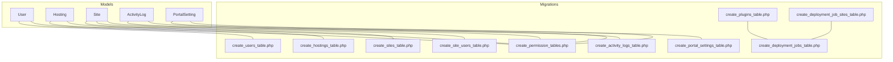
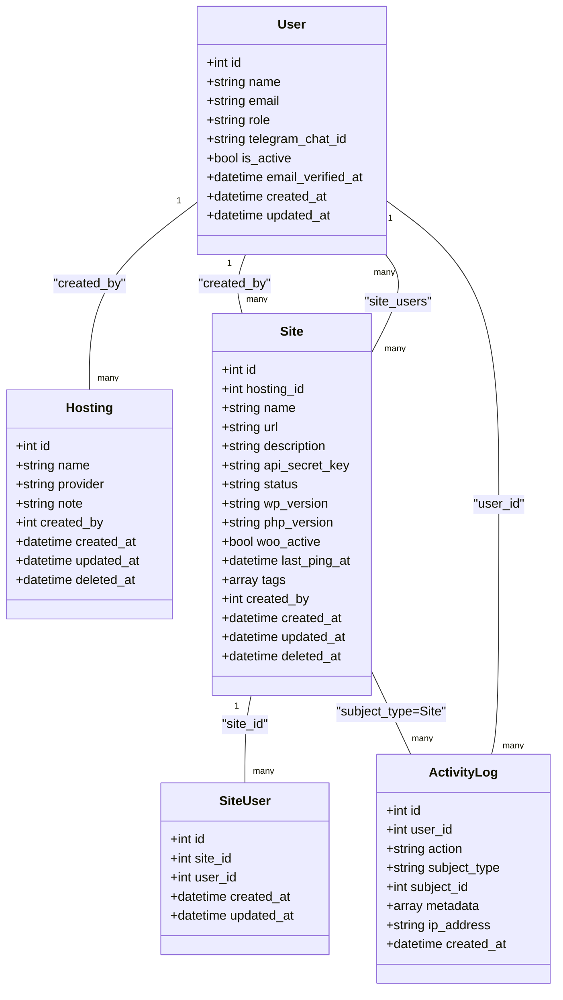
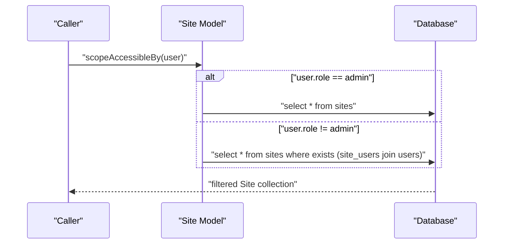
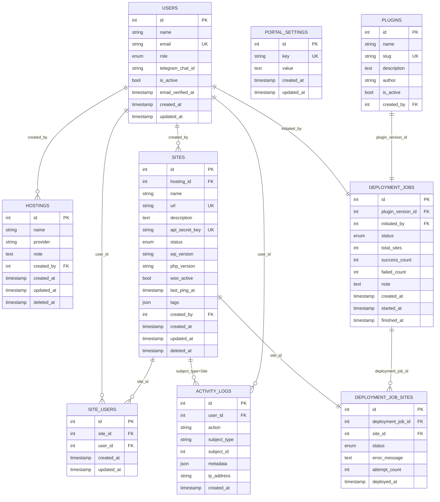

# Data Models & Database Schema

<cite>
**Referenced Files in This Document**
- [User.php](file://portal/app/Models/User.php)
- [Hosting.php](file://portal/app/Models/Hosting.php)
- [Site.php](file://portal/app/Models/Site.php)
- [ActivityLog.php](file://portal/app/Models/ActivityLog.php)
- [PortalSetting.php](file://portal/app/Models/PortalSetting.php)
- [create_users_table.php](file://portal/database/migrations/0001_01_01_000000_create_users_table.php)
- [create_hostings_table.php](file://portal/database/migrations/2026_05_15_070001_create_hostings_table.php)
- [create_sites_table.php](file://portal/database/migrations/2026_05_15_070002_create_sites_table.php)
- [create_site_users_table.php](file://portal/database/migrations/2026_05_15_070003_create_site_users_table.php)
- [create_activity_logs_table.php](file://portal/database/migrations/2026_05_15_070004_create_activity_logs_table.php)
- [create_portal_settings_table.php](file://portal/database/migrations/2026_05_15_070005_create_portal_settings_table.php)
- [create_plugins_table.php](file://portal/database/migrations/2026_05_15_080001_create_plugins_table.php)
- [create_deployment_jobs_table.php](file://portal/database/migrations/2026_05_15_080005_create_deployment_jobs_table.php)
- [create_deployment_job_sites_table.php](file://portal/database/migrations/2026_05_15_080006_create_deployment_job_sites_table.php)
- [create_permission_tables.php](file://portal/database/migrations/2026_05_15_061634_create_permission_tables.php)
- [permission.php](file://portal/config/permission.php)
</cite>

## Table of Contents
1. [Introduction](#introduction)
2. [Project Structure](#project-structure)
3. [Core Components](#core-components)
4. [Architecture Overview](#architecture-overview)
5. [Detailed Component Analysis](#detailed-component-analysis)
6. [Dependency Analysis](#dependency-analysis)
7. [Performance Considerations](#performance-considerations)
8. [Troubleshooting Guide](#troubleshooting-guide)
9. [Conclusion](#conclusion)
10. [Appendices](#appendices)

## Introduction
This document provides comprehensive data model documentation for the Eloquent models and database schema used in the application. It details entity relationships, field definitions, data types, primary and foreign keys, indexes, and constraints. It also explains model relationships such as hasMany, belongsToMany, and morphTo, documents migration patterns and schema evolution strategies, and outlines validation, accessors/mutators, and model events. Practical examples of complex queries, relationship loading, and data manipulation patterns are included, along with performance considerations and optimization techniques.

## Project Structure
The data model layer consists of Eloquent models under the application namespace and a set of migrations under the database directory. Models define attributes, casts, hidden fields, and relationships. Migrations define the canonical schema, including primary keys, foreign keys, indexes, and constraints.

**Diagram sources**
- [User.php:1-38](file://portal/app/Models/User.php#L1-L38)
- [Hosting.php:1-31](file://portal/app/Models/Hosting.php#L1-L31)
- [Site.php:1-86](file://portal/app/Models/Site.php#L1-L86)
- [ActivityLog.php:1-37](file://portal/app/Models/ActivityLog.php#L1-L37)
- [PortalSetting.php:1-11](file://portal/app/Models/PortalSetting.php#L1-L11)
- [create_users_table.php:1-53](file://portal/database/migrations/0001_01_01_000000_create_users_table.php#L1-L53)
- [create_hostings_table.php:1-27](file://portal/database/migrations/2026_05_15_070001_create_hostings_table.php#L1-L27)
- [create_sites_table.php:1-35](file://portal/database/migrations/2026_05_15_070002_create_sites_table.php#L1-L35)
- [create_site_users_table.php:1-25](file://portal/database/migrations/2026_05_15_070003_create_site_users_table.php#L1-L25)
- [create_activity_logs_table.php:1-32](file://portal/database/migrations/2026_05_15_070004_create_activity_logs_table.php#L1-L32)
- [create_portal_settings_table.php:1-24](file://portal/database/migrations/2026_05_15_070005_create_portal_settings_table.php#L1-L24)
- [create_plugins_table.php:1-28](file://portal/database/migrations/2026_05_15_080001_create_plugins_table.php#L1-L28)
- [create_deployment_jobs_table.php:1-31](file://portal/database/migrations/2026_05_15_080005_create_deployment_jobs_table.php#L1-L31)
- [create_deployment_job_sites_table.php:1-27](file://portal/database/migrations/2026_05_15_080006_create_deployment_job_sites_table.php#L1-L27)
- [create_permission_tables.php:53-134](file://portal/database/migrations/2026_05_15_061634_create_permission_tables.php#L53-L134)

**Section sources**
- [User.php:1-38](file://portal/app/Models/User.php#L1-L38)
- [Hosting.php:1-31](file://portal/app/Models/Hosting.php#L1-L31)
- [Site.php:1-86](file://portal/app/Models/Site.php#L1-L86)
- [ActivityLog.php:1-37](file://portal/app/Models/ActivityLog.php#L1-L37)
- [PortalSetting.php:1-11](file://portal/app/Models/PortalSetting.php#L1-L11)
- [create_users_table.php:1-53](file://portal/database/migrations/0001_01_01_000000_create_users_table.php#L1-L53)
- [create_hostings_table.php:1-27](file://portal/database/migrations/2026_05_15_070001_create_hostings_table.php#L1-L27)
- [create_sites_table.php:1-35](file://portal/database/migrations/2026_05_15_070002_create_sites_table.php#L1-L35)
- [create_site_users_table.php:1-25](file://portal/database/migrations/2026_05_15_070003_create_site_users_table.php#L1-L25)
- [create_activity_logs_table.php:1-32](file://portal/database/migrations/2026_05_15_070004_create_activity_logs_table.php#L1-L32)
- [create_portal_settings_table.php:1-24](file://portal/database/migrations/2026_05_15_070005_create_portal_settings_table.php#L1-L24)
- [create_plugins_table.php:1-28](file://portal/database/migrations/2026_05_15_080001_create_plugins_table.php#L1-L28)
- [create_deployment_jobs_table.php:1-31](file://portal/database/migrations/2026_05_15_080005_create_deployment_jobs_table.php#L1-L31)
- [create_deployment_job_sites_table.php:1-27](file://portal/database/migrations/2026_05_15_080006_create_deployment_job_sites_table.php#L1-L27)
- [create_permission_tables.php:53-134](file://portal/database/migrations/2026_05_15_061634_create_permission_tables.php#L53-L134)

## Core Components
This section summarizes the core models and their responsibilities, attributes, and relationships.

- User
  - Purpose: Authentication, authorization, notifications, and API tokens.
  - Fillable fields: name, email, password, role, telegram_chat_id, is_active.
  - Hidden fields: password, remember_token.
  - Casts: email_verified_at to datetime, password to hashed, is_active to boolean.
  - Relationships: roles via Spatie Permission package; belongsTo creator for Hosting; belongsTo creator for Site.
  - Accessors/Mutators: none declared; relies on casts for serialization.
  - Events: handled by traits for Sanctum and Spatie roles.

- Hosting
  - Purpose: Represents hosting provider instances.
  - Fillable fields: name, provider, note, created_by.
  - Relationships: hasMany sites; belongsTo user (creator).
  - Constraints: created_by references users; soft deletes enabled.

- Site
  - Purpose: Represents customer websites managed by the portal.
  - Fillable fields: hosting_id, name, url, description, api_secret_key, status, wp_version, php_version, woo_active, last_ping_at, tags, created_by.
  - Hidden fields: api_secret_key.
  - Casts: woo_active to boolean, last_ping_at to datetime, tags to array.
  - Relationships: belongsTo hosting; belongsTo user (creator); belongsToMany users (site_users pivot); hasMany activityLogs (polymorphic subject filter); hasMany sitePlugins; hasMany deploymentJobSites.
  - Scopes: accessibleBy for role-based filtering.

- ActivityLog
  - Purpose: Audit trail for user actions against polymorphic subjects.
  - Fillable fields: user_id, action, subject_type, subject_id, metadata, ip_address.
  - Casts: metadata to array, created_at to datetime.
  - Relationships: belongsTo user; morphTo subject.

- PortalSetting
  - Purpose: Global key-value settings.
  - Fillable fields: key, value.

**Section sources**
- [User.php:11-37](file://portal/app/Models/User.php#L11-L37)
- [Hosting.php:10-30](file://portal/app/Models/Hosting.php#L10-L30)
- [Site.php:12-85](file://portal/app/Models/Site.php#L12-L85)
- [ActivityLog.php:9-36](file://portal/app/Models/ActivityLog.php#L9-L36)
- [PortalSetting.php:7-10](file://portal/app/Models/PortalSetting.php#L7-L10)

## Architecture Overview
The data model architecture centers around Users, Hostings, Sites, and ActivityLogs. Users are linked to Hostings and Sites via created_by foreign keys. Sites maintain a many-to-many relationship with Users through a dedicated pivot table. ActivityLogs record user actions against polymorphic subjects, enabling auditability across entities.

**Diagram sources**
- [User.php:11-37](file://portal/app/Models/User.php#L11-L37)
- [Hosting.php:10-30](file://portal/app/Models/Hosting.php#L10-L30)
- [Site.php:12-85](file://portal/app/Models/Site.php#L12-L85)
- [ActivityLog.php:9-36](file://portal/app/Models/ActivityLog.php#L9-L36)
- [create_site_users_table.php:11-17](file://portal/database/migrations/2026_05_15_070003_create_site_users_table.php#L11-L17)
- [create_users_table.php:14-25](file://portal/database/migrations/0001_01_01_000000_create_users_table.php#L14-L25)
- [create_hostings_table.php:11-19](file://portal/database/migrations/2026_05_15_070001_create_hostings_table.php#L11-L19)
- [create_sites_table.php:11-27](file://portal/database/migrations/2026_05_15_070002_create_sites_table.php#L11-L27)
- [create_activity_logs_table.php:11-24](file://portal/database/migrations/2026_05_15_070004_create_activity_logs_table.php#L11-L24)

## Detailed Component Analysis

### User Model
- Attributes and types
  - id: integer (auto-increment)
  - name: string
  - email: string (unique)
  - email_verified_at: datetime
  - password: string (hashed via cast)
  - role: enum (admin, dev, mkt)
  - telegram_chat_id: string (nullable)
  - is_active: boolean (default true)
  - remember_token: string (hidden)
  - timestamps: created_at, updated_at
- Relationships
  - Roles via Spatie Permission traits.
  - Creator of Hosting entries.
  - Creator of Site entries.
- Validation and events
  - Validation handled by requests/controllers; model casts handle serialization.
  - Sanctum and Spatie traits manage API tokens and roles.
- Accessors/mutators
  - Password hashing via cast; no custom accessors/mutators.

**Section sources**
- [User.php:15-36](file://portal/app/Models/User.php#L15-L36)
- [create_users_table.php:14-25](file://portal/database/migrations/0001_01_01_000000_create_users_table.php#L14-L25)

### Hosting Model
- Attributes and types
  - id: integer
  - name: string
  - provider: string
  - note: text (nullable)
  - created_by: integer (foreign key to users)
  - timestamps: created_at, updated_at
  - deleted_at: soft delete
- Relationships
  - hasMany sites
  - belongsTo user (creator)
- Indexes and constraints
  - created_by constrained to users; soft deletes enabled.

**Section sources**
- [Hosting.php:14-29](file://portal/app/Models/Hosting.php#L14-L29)
- [create_hostings_table.php:11-19](file://portal/database/migrations/2026_05_15_070001_create_hostings_table.php#L11-L19)

### Site Model
- Attributes and types
  - id: integer
  - hosting_id: integer (nullable, references hostings)
  - name: string
  - url: string (unique)
  - description: text (nullable)
  - api_secret_key: string (unique)
  - status: enum (pending, connected, disconnected)
  - wp_version: string (nullable)
  - php_version: string (nullable)
  - woo_active: boolean (default false)
  - last_ping_at: datetime (nullable)
  - tags: json (nullable)
  - created_by: integer (references users)
  - timestamps: created_at, updated_at
  - deleted_at: soft delete
- Relationships
  - belongsTo hosting
  - belongsTo user (creator)
  - belongsToMany users via site_users pivot
  - hasMany activityLogs filtered by subject_type = Site
  - hasMany sitePlugins (not shown here)
  - hasMany deploymentJobSites
- Scopes
  - accessibleBy: admin bypass; otherwise filters by user assignment via pivot.
- Indexes and constraints
  - hosting_id nullable with nullOnDelete; created_by constrained to users; unique constraints on url and api_secret_key.

**Diagram sources**
- [Site.php:75-84](file://portal/app/Models/Site.php#L75-L84)
- [create_sites_table.php:13-26](file://portal/database/migrations/2026_05_15_070002_create_sites_table.php#L13-L26)
- [create_site_users_table.php:13-16](file://portal/database/migrations/2026_05_15_070003_create_site_users_table.php#L13-L16)

**Section sources**
- [Site.php:16-85](file://portal/app/Models/Site.php#L16-L85)
- [create_sites_table.php:11-27](file://portal/database/migrations/2026_05_15_070002_create_sites_table.php#L11-L27)
- [create_site_users_table.php:11-17](file://portal/database/migrations/2026_05_15_070003_create_site_users_table.php#L11-L17)

### ActivityLog Model
- Attributes and types
  - id: integer
  - user_id: integer (nullable, references users)
  - action: string
  - subject_type: string (nullable)
  - subject_id: integer (nullable)
  - metadata: json (nullable)
  - ip_address: string (nullable)
  - created_at: datetime (default current timestamp)
- Relationships
  - belongsTo user
  - morphTo subject (polymorphic)
- Indexes and constraints
  - Composite index on (subject_type, subject_id)
  - Index on action
  - Index on user_id
  - Null-on-delete behavior for user_id

**Section sources**
- [ActivityLog.php:13-35](file://portal/app/Models/ActivityLog.php#L13-L35)
- [create_activity_logs_table.php:11-24](file://portal/database/migrations/2026_05_15_070004_create_activity_logs_table.php#L11-L24)

### PortalSetting Model
- Attributes and types
  - id: integer
  - key: string (unique)
  - value: text (nullable)
  - timestamps: created_at, updated_at
- Indexes and constraints
  - Unique index on key

**Section sources**
- [PortalSetting.php:9-10](file://portal/app/Models/PortalSetting.php#L9-L10)
- [create_portal_settings_table.php:11-16](file://portal/database/migrations/2026_05_15_070005_create_portal_settings_table.php#L11-L16)

### Additional Entities (Plugins and Deployment)
These entities support plugin management and deployment orchestration.

- Plugins
  - Fields: name, slug (unique), description, author, is_active, created_by
  - created_by references users
- DeploymentJobs
  - Fields: plugin_version_id, initiated_by, status, total_sites, success_count, failed_count, note, timestamps
  - Status enum supports queued, running, completed, failed, cancelled
- DeploymentJobSites
  - Fields: deployment_job_id, site_id, status, error_message, attempt_count, deployed_at
  - Status enum supports pending, running, success, failed, skipped

**Section sources**
- [create_plugins_table.php:11-20](file://portal/database/migrations/2026_05_15_080001_create_plugins_table.php#L11-L20)
- [create_deployment_jobs_table.php:11-23](file://portal/database/migrations/2026_05_15_080005_create_deployment_jobs_table.php#L11-L23)
- [create_deployment_job_sites_table.php:11-19](file://portal/database/migrations/2026_05_15_080006_create_deployment_job_sites_table.php#L11-L19)

## Dependency Analysis
This section maps model dependencies and foreign key relationships derived from migrations.

**Diagram sources**
- [create_users_table.php:14-25](file://portal/database/migrations/0001_01_01_000000_create_users_table.php#L14-L25)
- [create_hostings_table.php:11-19](file://portal/database/migrations/2026_05_15_070001_create_hostings_table.php#L11-L19)
- [create_sites_table.php:11-27](file://portal/database/migrations/2026_05_15_070002_create_sites_table.php#L11-L27)
- [create_site_users_table.php:11-17](file://portal/database/migrations/2026_05_15_070003_create_site_users_table.php#L11-L17)
- [create_activity_logs_table.php:11-24](file://portal/database/migrations/2026_05_15_070004_create_activity_logs_table.php#L11-L24)
- [create_portal_settings_table.php:11-16](file://portal/database/migrations/2026_05_15_070005_create_portal_settings_table.php#L11-L16)
- [create_plugins_table.php:11-20](file://portal/database/migrations/2026_05_15_080001_create_plugins_table.php#L11-L20)
- [create_deployment_jobs_table.php:11-23](file://portal/database/migrations/2026_05_15_080005_create_deployment_jobs_table.php#L11-L23)
- [create_deployment_job_sites_table.php:11-19](file://portal/database/migrations/2026_05_15_080006_create_deployment_job_sites_table.php#L11-L19)

## Performance Considerations
- Indexing strategies
  - Composite index on (subject_type, subject_id) in activity_logs accelerates polymorphic lookups.
  - Separate indexes on action and user_id improve filtering and auditing performance.
  - Unique indexes on url and api_secret_key in sites prevent duplicates and speed up lookups.
  - Unique composite index on (site_id, user_id) in site_users ensures efficient membership checks.
- Query optimization techniques
  - Use eager loading for relationships to avoid N+1 queries (e.g., with users, hosting, activityLogs).
  - Apply scopes like accessibleBy to limit dataset size early.
  - Prefer JSON fields for tags and metadata to reduce joins; ensure appropriate queries on JSON columns.
- Soft deletes
  - Soft deletes on hostings and sites require careful querying; ensure queries account for deleted_at when necessary.
- Casts and serialization
  - Array and datetime casts minimize manual conversion overhead and improve consistency.

[No sources needed since this section provides general guidance]

## Troubleshooting Guide
- Common issues
  - Unique constraint violations on url or api_secret_key in sites.
  - Foreign key constraint failures when deleting users or sites without proper cascade/null behavior.
  - Missing indexes causing slow audits or polymorphic lookups.
- Diagnostics
  - Verify indexes exist on subject_type/subject_id, action, and user_id in activity_logs.
  - Confirm unique constraints on key fields in portal_settings and site_users.
  - Check soft delete behavior and nullOnDelete configurations for dependent records.
- Remediation
  - Add missing indexes via new migrations.
  - Adjust foreign key constraints or cascades to match intended behavior.
  - Use scopes and eager loading to avoid accidental heavy queries.

**Section sources**
- [create_sites_table.php:15-17](file://portal/database/migrations/2026_05_15_070002_create_sites_table.php#L15-L17)
- [create_site_users_table.php:16-16](file://portal/database/migrations/2026_05_15_070003_create_site_users_table.php#L16-L16)
- [create_activity_logs_table.php:21-23](file://portal/database/migrations/2026_05_15_070004_create_activity_logs_table.php#L21-L23)

## Conclusion
The data model layer is designed around clear entity boundaries with explicit relationships and constraints. Users drive creation of Hostings and Sites, Sites maintain many-to-many relationships with Users, and ActivityLogs capture auditable events against polymorphic subjects. Migrations encode primary keys, foreign keys, indexes, and constraints, while model scopes and casts streamline common operations. Following the recommended indexing and query strategies will help maintain performance as the system scales.

[No sources needed since this section summarizes without analyzing specific files]

## Appendices

### Migration Patterns and Schema Evolution
- Pattern: Use timestamped filenames to enforce chronological order.
- Pattern: Define primary keys, foreign keys, and indexes in the same migration file as the table.
- Pattern: Add indexes for frequently queried columns (e.g., polymorphic subject_type/subject_id, action, user_id).
- Pattern: Use unique constraints for fields requiring uniqueness (e.g., email, url, api_secret_key, slug, key).
- Pattern: Employ soft deletes for entities requiring historical tracking (hostings, sites).
- Pattern: Use JSON columns for flexible metadata (tags, metadata) and ensure appropriate queries.

**Section sources**
- [create_users_table.php:14-25](file://portal/database/migrations/0001_01_01_000000_create_users_table.php#L14-L25)
- [create_sites_table.php:15-23](file://portal/database/migrations/2026_05_15_070002_create_sites_table.php#L15-L23)
- [create_activity_logs_table.php:21-23](file://portal/database/migrations/2026_05_15_070004_create_activity_logs_table.php#L21-L23)
- [create_portal_settings_table.php:13-13](file://portal/database/migrations/2026_05_15_070005_create_portal_settings_table.php#L13-L13)
- [create_plugins_table.php:14-14](file://portal/database/migrations/2026_05_15_080001_create_plugins_table.php#L14-L14)

### Examples of Complex Queries and Relationship Loading
- Filter sites accessible by a user (role-aware):
  - Use the accessibleBy scope to restrict results to admin or sites assigned to the user.
- Load relationships efficiently:
  - Eager load users, hosting, and activityLogs to avoid N+1 queries.
- Polymorphic activity log queries:
  - Filter by subject_type and subject_id to retrieve logs for a specific Site.
- JSON column queries:
  - Query tags using JSON operators to filter by tag presence or values.

**Section sources**
- [Site.php:75-84](file://portal/app/Models/Site.php#L75-L84)
- [ActivityLog.php:56-60](file://portal/app/Models/ActivityLog.php#L56-L60)

### Data Validation Rules, Accessors, Mutators, and Model Events
- Validation rules
  - Validation is performed at the request layer; model fillable arrays and casts define allowed attributes and serialization behavior.
- Accessors and mutators
  - No custom accessors/mutators are defined; password hashing and date casting are handled via model casts.
- Model events
  - Sanctum and Spatie Permission traits manage API token lifecycle and role/permission synchronization.

**Section sources**
- [User.php:29-36](file://portal/app/Models/User.php#L29-L36)
- [Site.php:31-39](file://portal/app/Models/Site.php#L31-L39)

### Authorization and Permission Tables
- The permission tables are generated by the Spatie Permission package and include:
  - roles, permissions
  - model_has_roles, model_has_permissions
  - role_has_permissions
- Indexes and primary keys are defined to optimize lookups and enforce referential integrity.

**Section sources**
- [create_permission_tables.php:53-134](file://portal/database/migrations/2026_05_15_061634_create_permission_tables.php#L53-L134)
- [permission.php:43-76](file://portal/config/permission.php#L43-L76)