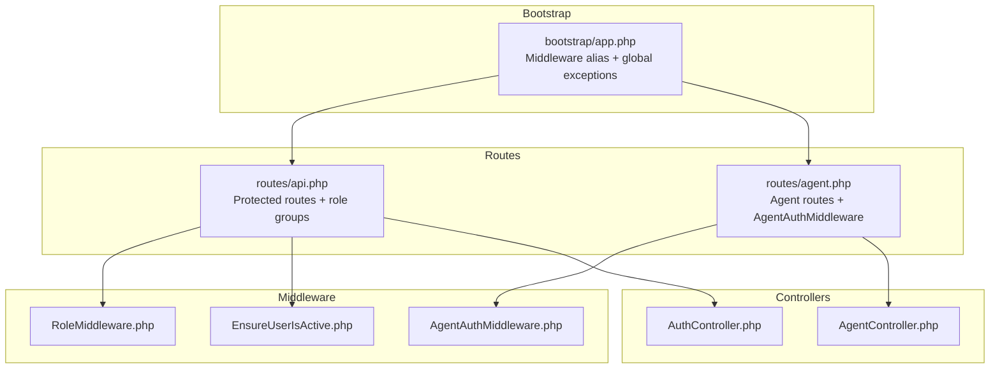
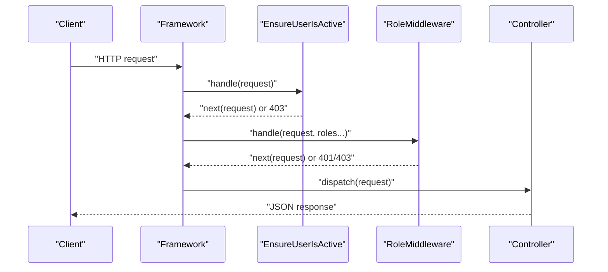
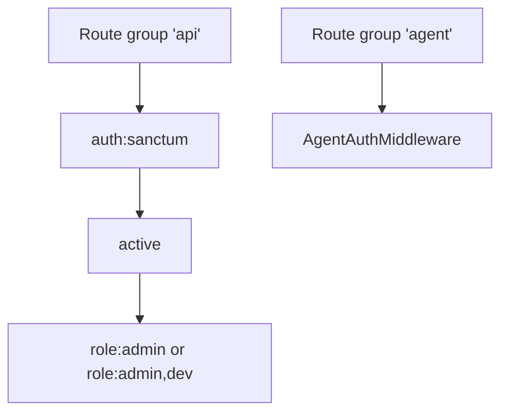
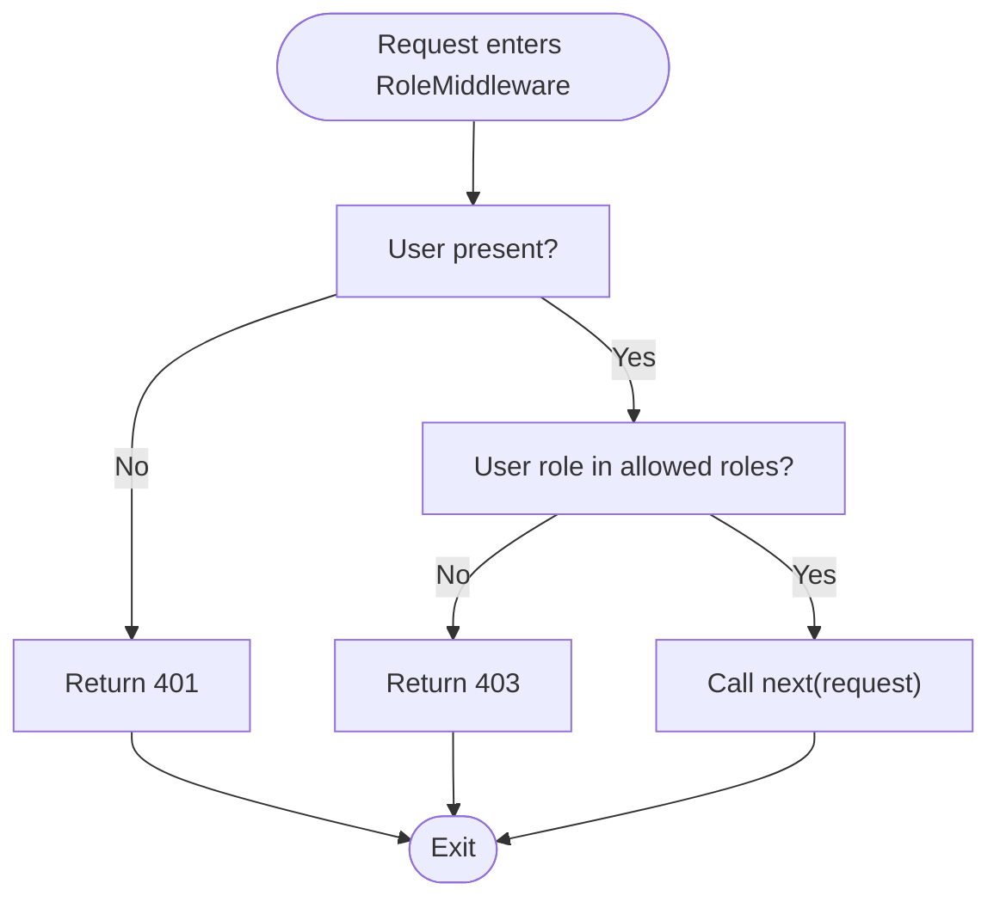
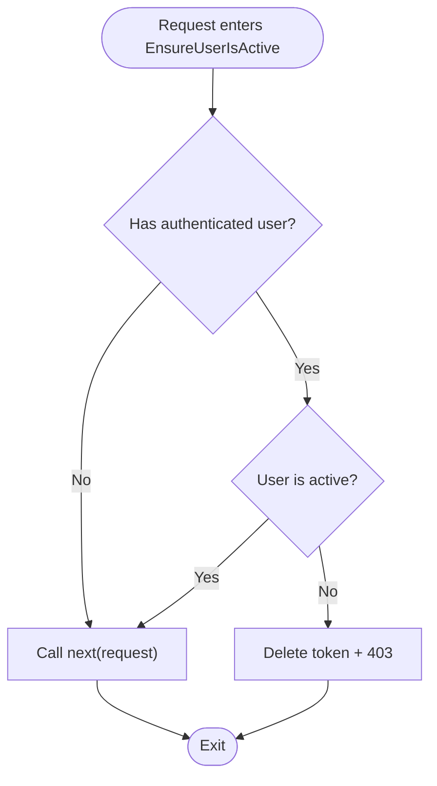
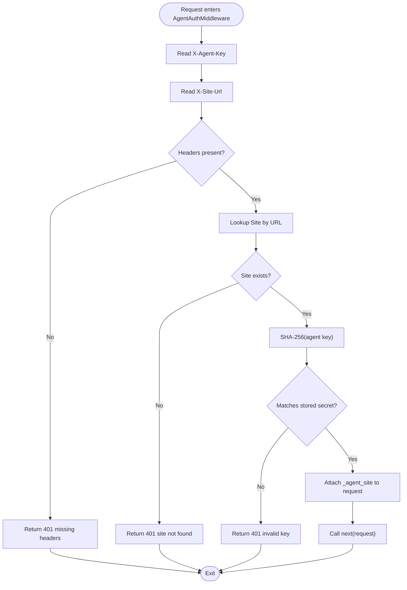
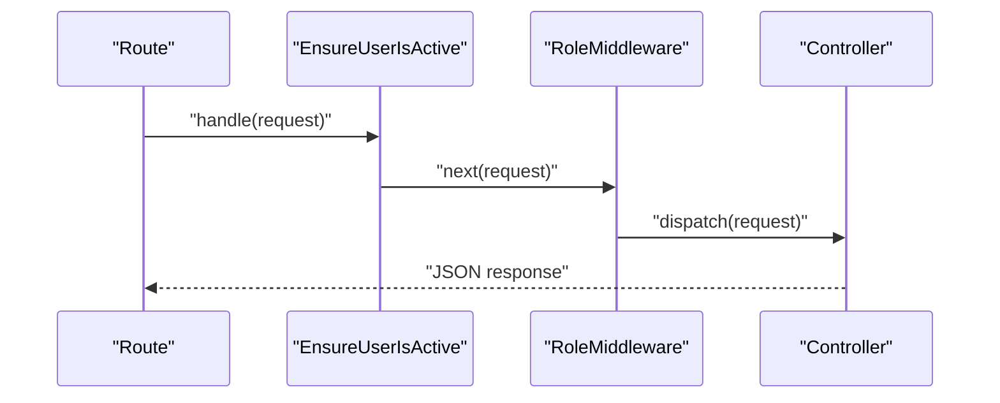
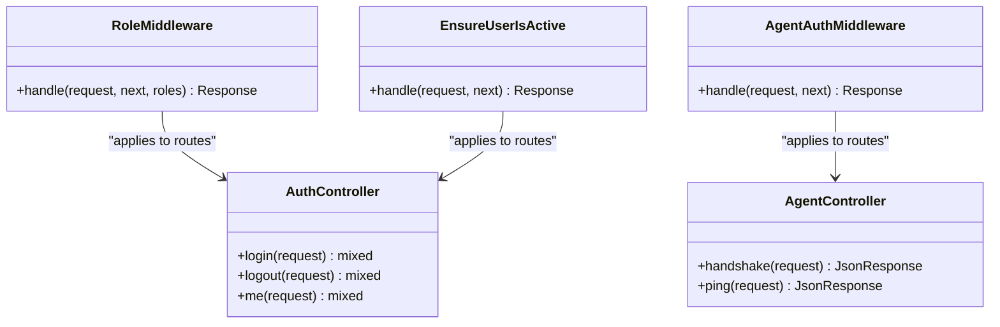
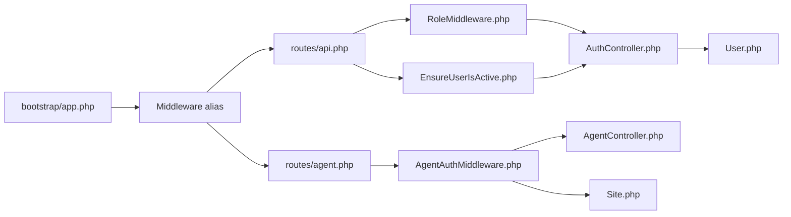

# Middleware & Interceptors

<cite>
**Referenced Files in This Document**
- [app.php](file://portal/bootstrap/app.php)
- [AgentAuthMiddleware.php](file://portal/app/Http/Middleware/AgentAuthMiddleware.php)
- [EnsureUserIsActive.php](file://portal/app/Http/Middleware/EnsureUserIsActive.php)
- [RoleMiddleware.php](file://portal/app/Http/Middleware/RoleMiddleware.php)
- [api.php](file://portal/routes/api.php)
- [agent.php](file://portal/routes/agent.php)
- [AuthController.php](file://portal/app/Http/Controllers/Auth/AuthController.php)
- [AgentController.php](file://portal/app/Http/Controllers/Agent/AgentController.php)
- [Site.php](file://portal/app/Models/Site.php)
- [User.php](file://portal/app/Models/User.php)
- [app.php](file://portal/app/Http/Controllers/Controller.php)
- [auth.php](file://portal/config/auth.php)
- [ExampleTest.php](file://portal/tests/Feature/ExampleTest.php)
- [ExampleTest.php](file://portal/tests/Unit/ExampleTest.php)
</cite>

## Table of Contents
1. [Introduction](#introduction)
2. [Project Structure](#project-structure)
3. [Core Components](#core-components)
4. [Architecture Overview](#architecture-overview)
5. [Detailed Component Analysis](#detailed-component-analysis)
6. [Dependency Analysis](#dependency-analysis)
7. [Performance Considerations](#performance-considerations)
8. [Troubleshooting Guide](#troubleshooting-guide)
9. [Conclusion](#conclusion)
10. [Appendices](#appendices)

## Introduction
This document explains the middleware pipeline and custom interceptors used in the backend API. It covers how HTTP requests flow through middleware layers, how custom middleware enforces role-based access control, validates user activity, and authenticates agents, and how middleware is registered and ordered. It also documents middleware composition, request/response transformations, error handling, performance considerations, testing, and debugging techniques, and clarifies the relationship between middleware and controller logic.

## Project Structure
The middleware pipeline is configured at the framework bootstrap level and applied to route groups. The API routes demonstrate layered middleware application, while agent-specific routes use a dedicated interceptor. Controllers consume the attached request attributes and user context set by middleware.

**Diagram sources**
- [app.php:22-27](file://portal/bootstrap/app.php#L22-L27)
- [api.php:13-57](file://portal/routes/api.php#L13-L57)
- [agent.php:16-19](file://portal/routes/agent.php#L16-L19)
- [RoleMiddleware.php:15-35](file://portal/app/Http/Middleware/RoleMiddleware.php#L15-L35)
- [EnsureUserIsActive.php:11-24](file://portal/app/Http/Middleware/EnsureUserIsActive.php#L11-L24)
- [AgentAuthMiddleware.php:20-55](file://portal/app/Http/Middleware/AgentAuthMiddleware.php#L20-L55)
- [AuthController.php:18-56](file://portal/app/Http/Controllers/Auth/AuthController.php#L18-L56)
- [AgentController.php:16-55](file://portal/app/Http/Controllers/Agent/AgentController.php#L16-L55)

**Section sources**
- [app.php:22-27](file://portal/bootstrap/app.php#L22-L27)
- [api.php:13-57](file://portal/routes/api.php#L13-L57)
- [agent.php:16-19](file://portal/routes/agent.php#L16-L19)

## Core Components
- Role-based access control middleware: Enforces allowed roles per request.
- Active user validation middleware: Blocks requests from deactivated accounts.
- Agent authentication middleware: Validates agent requests via headers and attaches site context.
- Route groups: Apply middleware to specific route groups and individual routes.
- Controllers: Consume user context and agent site context set by middleware.

**Section sources**
- [RoleMiddleware.php:15-35](file://portal/app/Http/Middleware/RoleMiddleware.php#L15-L35)
- [EnsureUserIsActive.php:11-24](file://portal/app/Http/Middleware/EnsureUserIsActive.php#L11-L24)
- [AgentAuthMiddleware.php:20-55](file://portal/app/Http/Middleware/AgentAuthMiddleware.php#L20-L55)
- [api.php:13-57](file://portal/routes/api.php#L13-L57)
- [agent.php:16-19](file://portal/routes/agent.php#L16-L19)

## Architecture Overview
The request lifecycle begins at the framework bootstrap, applies aliases for middleware, and routes traffic to either the API or agent endpoints. API routes enforce authentication, active user checks, and role gating. Agent routes enforce agent-specific authentication and attach a site context for controller use.

**Diagram sources**
- [app.php:22-27](file://portal/bootstrap/app.php#L22-L27)
- [EnsureUserIsActive.php:11-24](file://portal/app/Http/Middleware/EnsureUserIsActive.php#L11-L24)
- [RoleMiddleware.php:15-35](file://portal/app/Http/Middleware/RoleMiddleware.php#L15-L35)
- [AuthController.php:18-56](file://portal/app/Http/Controllers/Auth/AuthController.php#L18-L56)

## Detailed Component Analysis

### Middleware Registration and Ordering
- Middleware aliases are registered in the bootstrap configuration, enabling short names in route definitions.
- API routes apply middleware in order: authentication, active user check, and role checks.
- Agent routes apply agent authentication middleware to specific endpoints.

**Diagram sources**
- [app.php:23-26](file://portal/bootstrap/app.php#L23-L26)
- [api.php:13-57](file://portal/routes/api.php#L13-L57)
- [agent.php:16-19](file://portal/routes/agent.php#L16-L19)

**Section sources**
- [app.php:22-27](file://portal/bootstrap/app.php#L22-L27)
- [api.php:13-57](file://portal/routes/api.php#L13-L57)
- [agent.php:16-19](file://portal/routes/agent.php#L16-L19)

### Role-Based Access Control Middleware
- Purpose: Restrict routes to specific roles.
- Behavior: Returns unauthorized or forbidden responses when unauthenticated or unauthorized; otherwise forwards to the next middleware/controller.
- Usage: Applied as middleware('role:admin') or middleware('role:admin,dev').

**Diagram sources**
- [RoleMiddleware.php:15-35](file://portal/app/Http/Middleware/RoleMiddleware.php#L15-L35)

**Section sources**
- [RoleMiddleware.php:15-35](file://portal/app/Http/Middleware/RoleMiddleware.php#L15-L35)
- [api.php:21-48](file://portal/routes/api.php#L21-L48)

### Active User Validation Middleware
- Purpose: Prevents deactivated users from accessing protected routes.
- Behavior: Revokes the current token and blocks the request with a forbidden response if the user is inactive; otherwise continues.

**Diagram sources**
- [EnsureUserIsActive.php:11-24](file://portal/app/Http/Middleware/EnsureUserIsActive.php#L11-L24)

**Section sources**
- [EnsureUserIsActive.php:11-24](file://portal/app/Http/Middleware/EnsureUserIsActive.php#L11-L24)
- [AuthController.php:33-35](file://portal/app/Http/Controllers/Auth/AuthController.php#L33-L35)

### Agent Authentication Middleware
- Purpose: Authenticate agent requests using two headers and compare a hashed key against stored secrets.
- Behavior: Validates presence of headers, resolves the site by URL, compares SHA-256 hashes, attaches the site to the request, and proceeds or returns unauthorized responses.

**Diagram sources**
- [AgentAuthMiddleware.php:20-55](file://portal/app/Http/Middleware/AgentAuthMiddleware.php#L20-L55)
- [Site.php:16-39](file://portal/app/Models/Site.php#L16-L39)

**Section sources**
- [AgentAuthMiddleware.php:20-55](file://portal/app/Http/Middleware/AgentAuthMiddleware.php#L20-L55)
- [agent.php:16-19](file://portal/routes/agent.php#L16-L19)
- [AgentController.php:16-55](file://portal/app/Http/Controllers/Agent/AgentController.php#L16-L55)
- [Site.php:16-39](file://portal/app/Models/Site.php#L16-L39)

### Middleware Composition and Request/Response Transformation
- Composition: API routes compose authentication, active user validation, and role checks. Agent routes compose agent authentication.
- Request transformation: Agent middleware merges a site object into the request for controller consumption.
- Response transformation: Global exception rendering normalizes validation errors to JSON with a consistent shape.

**Diagram sources**
- [api.php:13-57](file://portal/routes/api.php#L13-L57)
- [EnsureUserIsActive.php:11-24](file://portal/app/Http/Middleware/EnsureUserIsActive.php#L11-L24)
- [RoleMiddleware.php:15-35](file://portal/app/Http/Middleware/RoleMiddleware.php#L15-L35)
- [AuthController.php:18-56](file://portal/app/Http/Controllers/Auth/AuthController.php#L18-L56)

**Section sources**
- [app.php:28-37](file://portal/bootstrap/app.php#L28-L37)
- [api.php:13-57](file://portal/routes/api.php#L13-L57)

### Relationship Between Middleware and Controller Logic
- API controllers rely on authenticated user context established by the framework’s Sanctum guard and validated by the active user middleware.
- Agent controllers rely on the agent middleware attaching a site object to the request for actions like handshake and ping.
- Controllers use traits for standardized success/error responses.

**Diagram sources**
- [RoleMiddleware.php:15-35](file://portal/app/Http/Middleware/RoleMiddleware.php#L15-L35)
- [EnsureUserIsActive.php:11-24](file://portal/app/Http/Middleware/EnsureUserIsActive.php#L11-L24)
- [AgentAuthMiddleware.php:20-55](file://portal/app/Http/Middleware/AgentAuthMiddleware.php#L20-L55)
- [AuthController.php:18-56](file://portal/app/Http/Controllers/Auth/AuthController.php#L18-L56)
- [AgentController.php:16-55](file://portal/app/Http/Controllers/Agent/AgentController.php#L16-L55)

**Section sources**
- [AuthController.php:18-56](file://portal/app/Http/Controllers/Auth/AuthController.php#L18-L56)
- [AgentController.php:16-55](file://portal/app/Http/Controllers/Agent/AgentController.php#L16-L55)

## Dependency Analysis
- Middleware depends on the framework’s request/response abstractions and the application’s models for lookups.
- Controllers depend on middleware-provided user context and request attributes.
- Route definitions declare middleware aliases and group compositions.

**Diagram sources**
- [app.php:22-27](file://portal/bootstrap/app.php#L22-L27)
- [api.php:13-57](file://portal/routes/api.php#L13-L57)
- [agent.php:16-19](file://portal/routes/agent.php#L16-L19)
- [RoleMiddleware.php:15-35](file://portal/app/Http/Middleware/RoleMiddleware.php#L15-L35)
- [EnsureUserIsActive.php:11-24](file://portal/app/Http/Middleware/EnsureUserIsActive.php#L11-L24)
- [AgentAuthMiddleware.php:20-55](file://portal/app/Http/Middleware/AgentAuthMiddleware.php#L20-L55)
- [AuthController.php:18-56](file://portal/app/Http/Controllers/Auth/AuthController.php#L18-L56)
- [AgentController.php:16-55](file://portal/app/Http/Controllers/Agent/AgentController.php#L16-L55)
- [Site.php:16-39](file://portal/app/Models/Site.php#L16-L39)
- [User.php:15-22](file://portal/app/Models/User.php#L15-L22)

**Section sources**
- [app.php:22-27](file://portal/bootstrap/app.php#L22-L27)
- [api.php:13-57](file://portal/routes/api.php#L13-L57)
- [agent.php:16-19](file://portal/routes/agent.php#L16-L19)
- [Site.php:16-39](file://portal/app/Models/Site.php#L16-L39)
- [User.php:15-22](file://portal/app/Models/User.php#L15-L22)

## Performance Considerations
- Prefer minimal middleware overhead: keep checks fast (e.g., in-memory role checks, efficient database lookups).
- Use early exits for missing headers or invalid tokens to avoid unnecessary work.
- Cache frequently accessed data when appropriate (e.g., site metadata) to reduce database load.
- Avoid heavy cryptographic operations in hot paths; the agent middleware uses SHA-256 hashing once per request.
- Keep route groups narrow to limit middleware application scope.

## Troubleshooting Guide
- Validation failures: Global exception rendering returns a JSON body with a consistent shape for validation errors.
- Authentication/authorization failures: Role and active user middleware return explicit 401/403 responses.
- Agent authentication failures: Missing headers, invalid site URL, or mismatched keys return 401 with a message.
- Debugging tips:
  - Verify middleware aliases are registered in the bootstrap configuration.
  - Confirm route groups apply middleware in the intended order.
  - Inspect request.user() and request attributes set by middleware in controllers.
  - Use controller-level logging around sensitive operations.

**Section sources**
- [app.php:28-37](file://portal/bootstrap/app.php#L28-L37)
- [EnsureUserIsActive.php:11-24](file://portal/app/Http/Middleware/EnsureUserIsActive.php#L11-L24)
- [RoleMiddleware.php:15-35](file://portal/app/Http/Middleware/RoleMiddleware.php#L15-L35)
- [AgentAuthMiddleware.php:20-55](file://portal/app/Http/Middleware/AgentAuthMiddleware.php#L20-L55)

## Conclusion
The middleware pipeline provides layered enforcement for authentication, activity validation, and role-based access control in the API, and agent-specific authentication for the agent endpoints. Middleware registration and ordering are declarative via route groups, enabling predictable request processing chains. Controllers receive enriched request contexts, allowing them to focus on business logic while middleware handles cross-cutting concerns.

## Appendices

### Middleware Registration Reference
- Aliases defined in the bootstrap configuration enable short names in route definitions.
- Agent routes explicitly reference the agent middleware class.

**Section sources**
- [app.php:23-26](file://portal/bootstrap/app.php#L23-L26)
- [agent.php:16-19](file://portal/routes/agent.php#L16-L19)

### Testing and Debugging References
- Basic feature and unit tests exist in the repository for verification.
- Use controller methods to assert expected behavior after middleware processing.

**Section sources**
- [ExampleTest.php:13-18](file://portal/tests/Feature/ExampleTest.php#L13-L18)
- [ExampleTest.php:12-15](file://portal/tests/Unit/ExampleTest.php#L12-L15)