# Security Monitoring System

<cite>
**Referenced Files in This Document**
- [LoginSecurityAnalyzer.php](file://portal/app/Services/LoginSecurityAnalyzer.php)
- [SecurityScoreService.php](file://portal/app/Services/SecurityScoreService.php)
- [TelegramNotificationService.php](file://portal/app/Services/TelegramNotificationService.php)
- [SecurityFileMonitor.php](file://agent/epos-wp-agent/includes/class-security-file-monitor.php)
- [Security2faManager.php](file://agent/epos-wp-agent/includes/class-security-2fa-manager.php)
- [SecurityApi.php](file://agent/epos-wp-agent/includes/class-security-api.php)
- [SecurityLoginMonitor.php](file://agent/epos-wp-agent/includes/class-security-login-monitor.php)
- [SecurityUserMonitor.php](file://agent/epos-wp-agent/includes/class-security-user-monitor.php)
- [VulnerabilityDefinition.php](file://portal/app/Models/VulnerabilityDefinition.php)
- [SiteVulnerability.php](file://portal/app/Models/SiteVulnerability.php)
- [FileIntegrityBaseline.php](file://portal/app/Models/FileIntegrityBaseline.php)
- [SecurityAlert.php](file://portal/app/Models/SecurityAlert.php)
- [LoginEvent.php](file://portal/app/Models/LoginEvent.php)
- [SiteAdminUser.php](file://portal/app/Models/SiteAdminUser.php)
- [Site2faSetting.php](file://portal/app/Models/Site2faSetting.php)
- [SiteSecurityScore.php](file://portal/app/Models/SiteSecurityScore.php)
- [KnownLoginIp.php](file://portal/app/Models/KnownLoginIp.php)
- [SecurityReportController.php](file://portal/app/Http/Controllers/Agent/SecurityReportController.php)
- [SendTelegramNotification.php](file://portal/app/Jobs/SendTelegramNotification.php)
- [PruneLoginEvents.php](file://portal/app/Console/Commands/PruneLoginEvents.php)
- [CreateSecurityTables.php](file://portal/database/migrations/2026_05_18_000001_create_security_tables.php)
- [Ping.php](file://agent/epos-wp-agent/includes/class-ping.php)
- [AgentRoutes.php](file://portal/routes/agent.php)
</cite>

## Update Summary
**Changes Made**
- Added comprehensive vulnerability management system with new database tables (vulnerability_definitions, site_vulnerabilities)
- Enhanced security scoring system with vulnerability-based deductions
- Integrated Telegram notification service with queue-based processing
- Expanded database schema with 12 new security-related tables
- Added vulnerability synchronization and scanning capabilities
- Enhanced login security analysis with improved Telegram integration

## Table of Contents
1. [Introduction](#introduction)
2. [System Architecture](#system-architecture)
3. [Core Security Components](#core-security-components)
4. [Vulnerability Management System](#vulnerability-management-system)
5. [File Integrity Monitoring](#file-integrity-monitoring)
6. [Login Security Analysis](#login-security-analysis)
7. [User Security Monitoring](#user-security-monitoring)
8. [Two-Factor Authentication Management](#two-factor-authentication-management)
9. [Security Scoring System](#security-scoring-system)
10. [Telegram Notification Integration](#telegram-notification-integration)
11. [Communication Protocol](#communication-protocol)
12. [Data Storage and Models](#data-storage-and-models)
13. [Operational Procedures](#operational-procedures)
14. [Troubleshooting Guide](#troubleshooting-guide)
15. [Conclusion](#conclusion)

## Introduction

The Security Monitoring System is a comprehensive WordPress security solution designed to provide real-time threat detection, automated response capabilities, and centralized security management across multiple WordPress installations. This system consists of two primary components: the WordPress Agent plugin that runs on each monitored site, and the central Portal application that aggregates and analyzes security data from all connected agents.

The system implements multi-layered security monitoring including file integrity verification, login activity analysis, user privilege tracking, vulnerability assessment, and automated two-factor authentication enforcement. It provides real-time alerts via Telegram notifications and maintains detailed audit trails for compliance and forensic analysis.

**Updated** Enhanced with comprehensive vulnerability management system, advanced security scoring with vulnerability deductions, and integrated Telegram notification service with queue-based processing.

## System Architecture

The security monitoring system follows a distributed architecture pattern where each WordPress site runs an Agent plugin that periodically communicates with a central Portal application. The architecture ensures scalability, fault tolerance, and centralized management while maintaining security isolation between monitored sites.

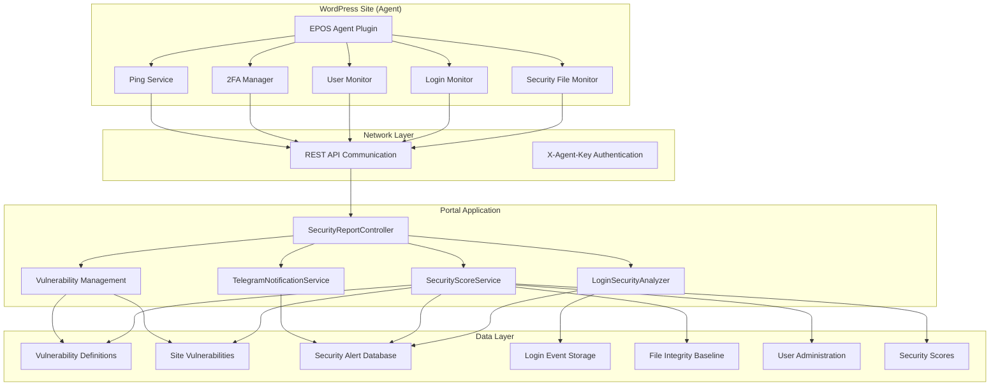

**Diagram sources**
- [SecurityApi.php:14-74](file://agent/epos-wp-agent/includes/class-security-api.php#L14-L74)
- [SecurityReportController.php:18-42](file://portal/app/Http/Controllers/Agent/SecurityReportController.php#L18-L42)
- [Ping.php:61-104](file://agent/epos-wp-agent/includes/class-ping.php#L61-L104)

## Core Security Components

The system comprises several specialized security components that work together to provide comprehensive protection:

### Security Detection Engine

The central detection engine analyzes security events in real-time and applies multiple detection algorithms to identify potential threats. The engine processes login attempts, file modifications, user privilege changes, vulnerability assessments, and other security-relevant activities.

### Automated Response System

When security threats are detected, the system automatically triggers appropriate responses including alert generation, user notifications, and remediation actions. The response system is designed to minimize response time while avoiding false positives.

### Centralized Management Interface

The Portal application provides a unified interface for managing security policies, monitoring multiple sites, and coordinating security responses across the entire network of monitored WordPress installations.

**Updated** Enhanced with vulnerability detection and management capabilities, expanding the detection engine to include vulnerability assessment algorithms.

**Section sources**
- [LoginSecurityAnalyzer.php:11-23](file://portal/app/Services/LoginSecurityAnalyzer.php#L11-L23)
- [SecurityScoreService.php:14-27](file://portal/app/Services/SecurityScoreService.php#L14-L27)

## Vulnerability Management System

The vulnerability management system provides comprehensive identification, tracking, and remediation of security vulnerabilities across all monitored WordPress installations. This component maintains a synchronized database of known vulnerabilities and continuously assesses site-specific vulnerability status.

### Vulnerability Database Architecture

The system maintains a comprehensive vulnerability database with detailed metadata for each identified security issue, including CVSS scores, affected versions, and remediation guidance.

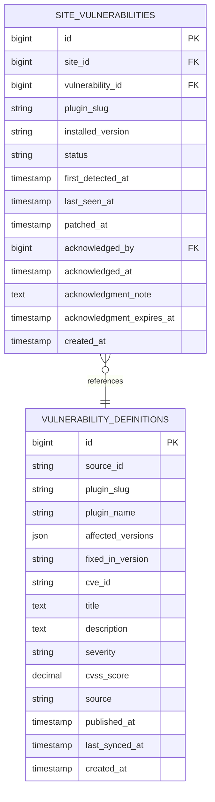

**Diagram sources**
- [CreateSecurityTables.php:11-48](file://portal/database/migrations/2026_05_18_000001_create_security_tables.php#L11-L48)
- [VulnerabilityDefinition.php:10-30](file://portal/app/Models/VulnerabilityDefinition.php#L10-L30)
- [SiteVulnerability.php:11-32](file://portal/app/Models/SiteVulnerability.php#L11-L32)

### Vulnerability Assessment Process

The system continuously monitors installed plugins and themes against the vulnerability database, automatically flagging outdated components and generating security alerts for critical vulnerabilities.

**Section sources**
- [CreateSecurityTables.php:11-48](file://portal/database/migrations/2026_05_18_000001_create_security_tables.php#L11-L48)
- [VulnerabilityDefinition.php:32-35](file://portal/app/Models/VulnerabilityDefinition.php#L32-L35)
- [SiteVulnerability.php:34-47](file://portal/app/Models/SiteVulnerability.php#L34-L47)

## File Integrity Monitoring

The file integrity monitoring system provides comprehensive protection against unauthorized modifications to critical WordPress files and directories. This component continuously monitors file hashes and detects any changes that could indicate compromise.

### Baseline Creation Process

The system creates cryptographic baselines of all monitored files during initial setup. These baselines serve as the reference point for detecting unauthorized changes and are stored securely for comparison purposes.

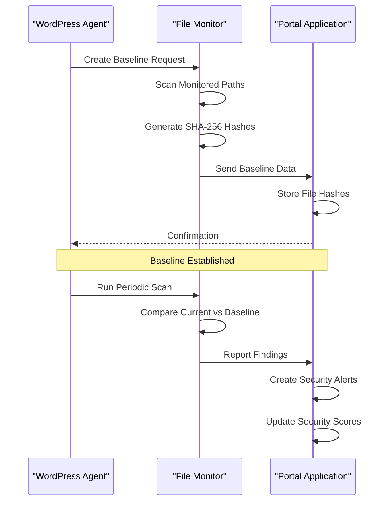

**Diagram sources**
- [SecurityFileMonitor.php:38-83](file://agent/epos-wp-agent/includes/class-security-file-monitor.php#L38-L83)
- [SecurityReportController.php:24-42](file://portal/app/Http/Controllers/Agent/SecurityReportController.php#L24-L42)

### Change Detection Algorithm

The monitoring system employs sophisticated algorithms to detect various types of file modifications including additions, deletions, and unauthorized modifications. Different file types receive different severity classifications based on their criticality.

**Section sources**
- [SecurityFileMonitor.php:90-174](file://agent/epos-wp-agent/includes/class-security-file-monitor.php#L90-L174)
- [SecurityReportController.php:48-103](file://portal/app/Http/Controllers/Agent/SecurityReportController.php#L48-L103)

## Login Security Analysis

The login security analysis system monitors authentication attempts across all WordPress installations and applies multiple detection algorithms to identify potential security threats including brute force attacks, credential stuffing, and suspicious login patterns.

### Detection Algorithms

The system implements four primary detection algorithms:

1. **Brute Force Attack Detection**: Identifies single-source brute force attempts exceeding 20 failed attempts within 10 minutes
2. **Distributed Brute Force Detection**: Detects coordinated attacks from multiple IP addresses exceeding 100 failed attempts from 10+ distinct IPs in 30 minutes
3. **Credential Stuffing Detection**: Monitors username-based attack patterns exceeding 50 attempts within 1 hour
4. **Suspicious Login Detection**: Flags successful logins from previously unknown IP addresses during unusual hours (22:00-06:00)

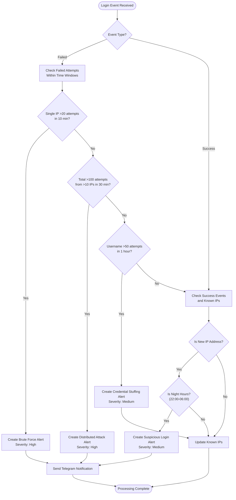

**Diagram sources**
- [LoginSecurityAnalyzer.php:28-201](file://portal/app/Services/LoginSecurityAnalyzer.php#L28-L201)

### Known IP Management

The system maintains a database of known legitimate IP addresses for each site to reduce false positives in suspicious login detection. IP addresses are automatically updated based on successful login patterns.

**Updated** Enhanced with improved Telegram notification integration for high-severity alerts, providing real-time messaging to administrators.

**Section sources**
- [LoginSecurityAnalyzer.php:141-201](file://portal/app/Services/LoginSecurityAnalyzer.php#L141-L201)
- [KnownLoginIp.php:8-28](file://portal/app/Models/KnownLoginIp.php#L8-L28)

## User Security Monitoring

The user security monitoring system tracks administrative user activities and privileges across all monitored WordPress installations. This component provides immediate alerts for critical user security events and maintains audit trails for compliance purposes.

### Administrative User Tracking

The system monitors all administrative user activities including new user registrations, role promotions, and privilege changes. Special attention is given to events involving administrator role assignments due to the elevated security risk.

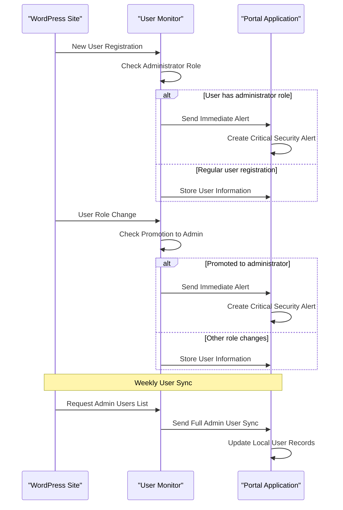

**Diagram sources**
- [SecurityUserMonitor.php:24-62](file://agent/epos-wp-agent/includes/class-security-user-monitor.php#L24-L62)
- [SecurityReportController.php:148-189](file://portal/app/Http/Controllers/Agent/SecurityReportController.php#L148-L189)

### Security Alert Generation

The user monitoring system generates critical security alerts for any administrative privilege changes, ensuring immediate notification to security personnel for review and potential mitigation actions.

**Section sources**
- [SecurityUserMonitor.php:92-110](file://agent/epos-wp-agent/includes/class-security-user-monitor.php#L92-L110)
- [SecurityReportController.php:174-186](file://portal/app/Http/Controllers/Agent/SecurityReportController.php#L174-L186)

## Two-Factor Authentication Management

The two-factor authentication management system provides automated enforcement and monitoring of 2FA policies across all monitored WordPress installations. This component ensures that administrative accounts maintain proper security posture.

### 2FA Plugin Integration

The system integrates with popular WordPress 2FA plugins including WP 2FA, Two Factor, Google Authenticator, and Wordfence. It provides automatic installation, configuration, and status monitoring of 2FA implementations.

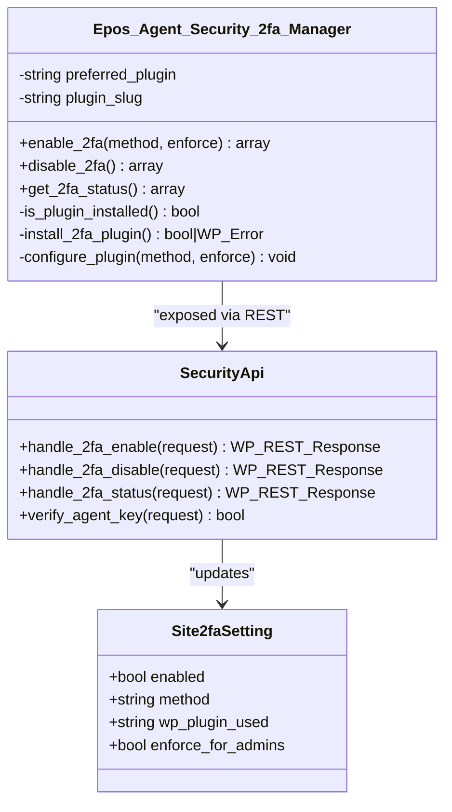

**Diagram sources**
- [Security2faManager.php:9-131](file://agent/epos-wp-agent/includes/class-security-2fa-manager.php#L9-L131)
- [SecurityApi.php:134-161](file://agent/epos-wp-agent/includes/class-security-api.php#L134-L161)

### Automated 2FA Enforcement

The system provides automated 2FA enforcement capabilities that can install and configure 2FA plugins on WordPress sites. This ensures consistent security posture across all monitored installations while allowing for manual override when necessary.

**Section sources**
- [Security2faManager.php:21-44](file://agent/epos-wp-agent/includes/class-security-2fa-manager.php#L21-L44)
- [SecurityReportController.php:241-280](file://portal/app/Http/Controllers/Agent/SecurityReportController.php#L241-L280)

## Security Scoring System

The security scoring system provides quantitative assessment of WordPress site security posture by evaluating multiple security factors and generating daily scores for trend analysis and reporting.

### Enhanced Scoring Algorithm

The system calculates security scores using a weighted deduction model that evaluates six primary security domains:

1. **File Integrity**: Deductions for detected file modifications and missing baselines
2. **Vulnerabilities**: Deductions based on CVSS scores of identified vulnerabilities
3. **Login Security**: Deductions for active security alerts within the last 24 hours
4. **User Security**: Deductions for unreviewed administrators and excessive admin accounts
5. **Two-Factor Authentication**: Deductions for missing 2FA enforcement or implementation
6. **Maintenance**: Deductions for outdated plugins and WordPress core

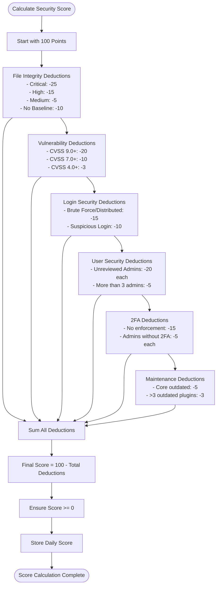

**Diagram sources**
- [SecurityScoreService.php:16-50](file://portal/app/Services/SecurityScoreService.php#L16-L50)
- [SecurityScoreService.php:52-184](file://portal/app/Services/SecurityScoreService.php#L52-L184)

### Daily Score Tracking

The system maintains historical security score data to enable trend analysis and demonstrate security improvement over time. Daily scores are stored with detailed breakdowns of contributing factors.

**Updated** Enhanced with vulnerability-based deductions, adding CVSS score calculations and vulnerability status tracking to the scoring algorithm.

**Section sources**
- [SecurityScoreService.php:41-50](file://portal/app/Services/SecurityScoreService.php#L41-L50)
- [SecurityScoreService.php:29-39](file://portal/app/Services/SecurityScoreService.php#L29-L39)

## Telegram Notification Integration

The Telegram notification system provides real-time alerting capabilities for critical security events across all monitored WordPress installations. This component ensures immediate notification delivery while maintaining system reliability through queue-based processing.

### Notification Architecture

The system implements a robust notification pipeline that handles both synchronous and asynchronous message delivery with retry mechanisms and error handling.

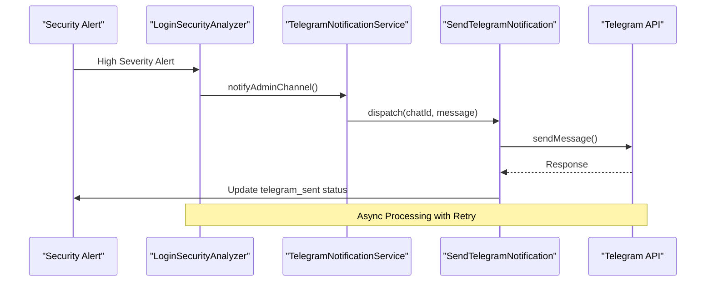

**Diagram sources**
- [LoginSecurityAnalyzer.php:206-215](file://portal/app/Services/LoginSecurityAnalyzer.php#L206-L215)
- [TelegramNotificationService.php:77-83](file://portal/app/Services/TelegramNotificationService.php#L77-L83)
- [SendTelegramNotification.php:25-66](file://portal/app/Jobs/SendTelegramNotification.php#L25-L66)

### Configuration and Caching

The notification system supports flexible configuration through environment variables and database settings with intelligent caching to minimize API calls and improve performance.

**Section sources**
- [TelegramNotificationService.php:16-55](file://portal/app/Services/TelegramNotificationService.php#L16-L55)
- [TelegramNotificationService.php:88-126](file://portal/app/Services/TelegramNotificationService.php#L88-L126)
- [SendTelegramNotification.php:20-75](file://portal/app/Jobs/SendTelegramNotification.php#L20-L75)

## Communication Protocol

The system uses a secure REST API communication protocol that enables encrypted data exchange between WordPress agents and the central Portal application. This protocol ensures data integrity and authenticates all communications.

### Authentication Mechanism

All API communications require X-Agent-Key authentication headers containing hashed API keys for security verification. The authentication system prevents unauthorized access while maintaining operational flexibility.

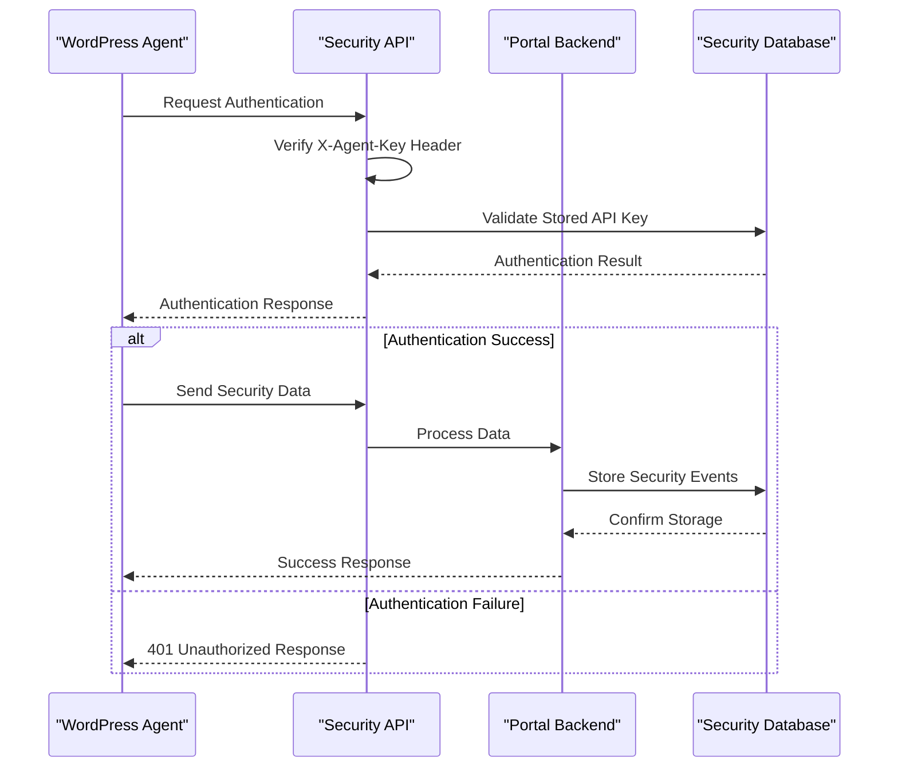

**Diagram sources**
- [SecurityApi.php:82-86](file://agent/epos-wp-agent/includes/class-security-api.php#L82-L86)
- [AgentRoutes.php:18-33](file://portal/routes/agent.php#L18-L33)

### Data Synchronization

The system implements bidirectional data synchronization ensuring that security events, configurations, and status updates are consistently maintained across all components.

**Section sources**
- [SecurityApi.php:21-74](file://agent/epos-wp-agent/includes/class-security-api.php#L21-L74)
- [Ping.php:69-104](file://agent/epos-wp-agent/includes/class-ping.php#L69-L104)

## Data Storage and Models

The security monitoring system utilizes a comprehensive database schema designed to support extensive security analytics, trend analysis, and compliance reporting across multiple WordPress installations.

### Enhanced Database Schema Design

The system employs a normalized database design with 12 specialized tables for comprehensive security tracking. The schema supports efficient querying, indexing, and relationship management essential for real-time security analysis.

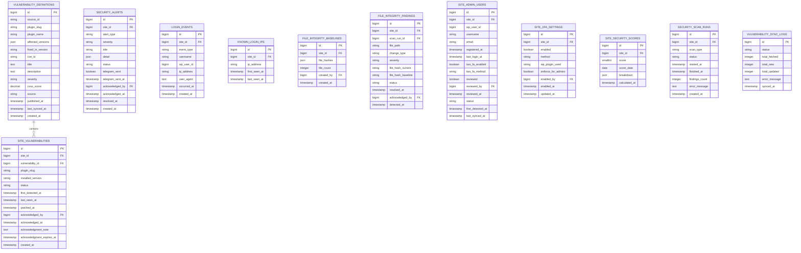

**Diagram sources**
- [CreateSecurityTables.php:11-212](file://portal/database/migrations/2026_05_18_000001_create_security_tables.php#L11-L212)

### Advanced Indexing Strategy

The database schema includes strategic indexing on frequently queried columns including site_id, status, severity, and timestamps to optimize query performance for real-time security analysis and reporting.

**Updated** Added comprehensive vulnerability tracking tables with foreign key relationships, enhanced security alert system with Telegram integration tracking, and expanded security scoring with vulnerability-based calculations.

**Section sources**
- [CreateSecurityTables.php:90-135](file://portal/database/migrations/2026_05_18_000001_create_security_tables.php#L90-L135)
- [SecurityAlert.php:37-61](file://portal/app/Models/SecurityAlert.php#L37-L61)

## Operational Procedures

The security monitoring system operates through standardized procedures that ensure consistent security posture across all monitored WordPress installations while minimizing operational overhead.

### Daily Operations

The system performs several automated operations daily including login event pruning, security alert cleanup, vulnerability synchronization, and score recalculations. These operations maintain system performance and data relevance.

### Security Alert Lifecycle

Security alerts follow a structured lifecycle from detection through resolution, including automatic escalation for critical incidents and automated acknowledgment for routine events.

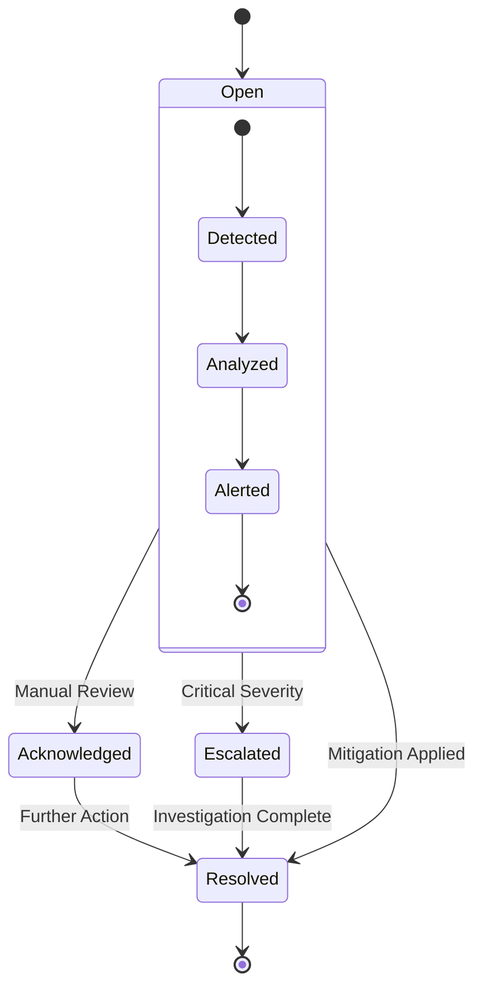

### Data Retention Policy

The system implements automated data retention policies that remove old login events after 90 days and resolved security alerts after 180 days to maintain optimal database performance while preserving audit trail requirements.

**Updated** Enhanced with vulnerability synchronization logging, security scan run tracking, and comprehensive data pruning procedures for all security-related tables.

**Section sources**
- [PruneLoginEvents.php:15-34](file://portal/app/Console/Commands/PruneLoginEvents.php#L15-L34)
- [SecurityReportController.php:138-141](file://portal/app/Http/Controllers/Agent/SecurityReportController.php#L138-L141)

## Troubleshooting Guide

Common issues and their resolutions for the security monitoring system:

### Communication Issues

**Problem**: Agents cannot connect to Portal
**Symptoms**: Connection status shows error, ping fails
**Resolution**: Verify X-Agent-Key configuration, check network connectivity, confirm Portal URL settings

### Authentication Failures

**Problem**: Security API requests rejected
**Symptoms**: HTTP 401 errors, authentication failures
**Resolution**: Regenerate API keys, verify key format, check header transmission

### Performance Issues

**Problem**: Slow security analysis or alert generation
**Symptoms**: Delayed alerts, slow response times
**Resolution**: Optimize database indexes, review server resources, adjust analysis windows

### Data Synchronization Problems

**Problem**: Inconsistent security data across systems
**Symptoms**: Missing alerts, duplicate entries, out-of-date information
**Resolution**: Check cron job execution, verify database connections, review network stability

### Telegram Notification Failures

**Problem**: Telegram alerts not being delivered
**Symptoms**: Alerts marked as open, no Telegram messages received
**Resolution**: Verify bot token configuration, check queue worker status, review API rate limits

**Updated** Added troubleshooting guidance for Telegram notification failures, vulnerability synchronization issues, and enhanced security scoring problems.

**Section sources**
- [Ping.php:106-123](file://agent/epos-wp-agent/includes/class-ping.php#L106-L123)
- [TelegramNotificationService.php:45-54](file://portal/app/Services/TelegramNotificationService.php#L45-L54)

## Conclusion

The Security Monitoring System provides comprehensive WordPress security protection through automated threat detection, real-time alerting, and centralized management capabilities. The system's modular architecture ensures scalability and maintainability while its multi-layered security approach provides robust protection against various threat vectors.

Key benefits include automated security analysis reducing manual oversight requirements, comprehensive audit trails supporting compliance needs, and real-time alerting enabling rapid incident response. The system's design emphasizes operational efficiency while maintaining strict security standards essential for enterprise WordPress environments.

**Updated** The enhanced system now provides comprehensive vulnerability management, advanced security scoring with vulnerability-based deductions, integrated Telegram notification service with queue-based processing, and extensive database tracking for all security aspects. The addition of vulnerability definitions, site vulnerabilities, and enhanced security scoring creates a holistic security solution that adapts to evolving security threats while providing actionable insights for continuous security improvement.