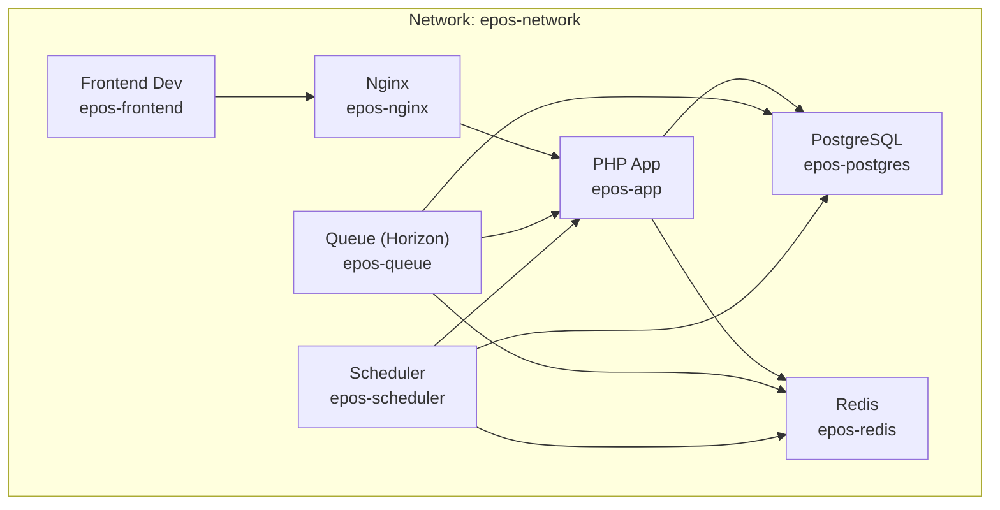
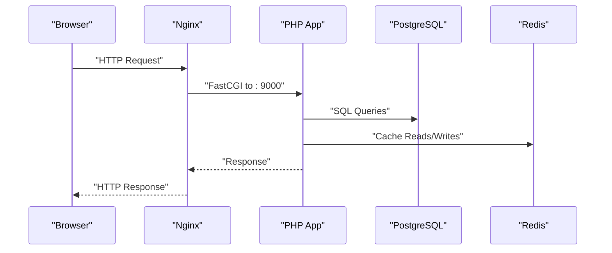
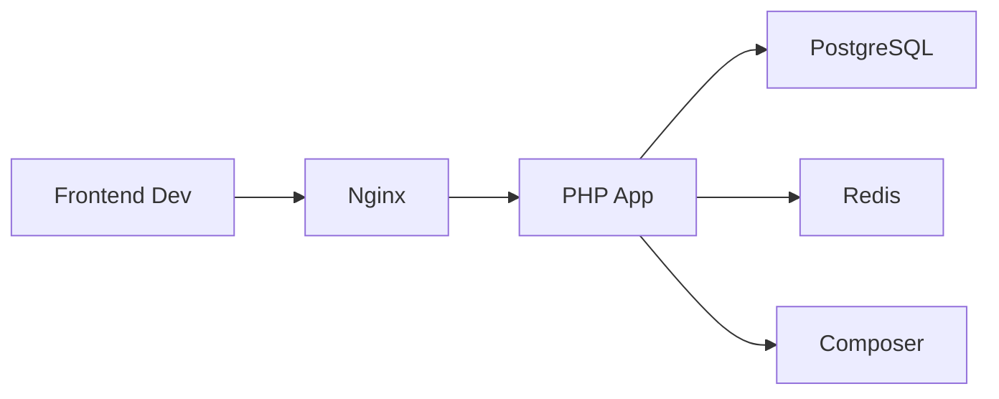

# Deployment & Operations

<cite>
**Referenced Files in This Document**
- [docker-compose.yml](file://docker-compose.yml)
- [default.conf](file://docker/nginx/default.conf)
- [Dockerfile (PHP)](file://docker/php/Dockerfile)
- [Dockerfile (Node)](file://docker/node/Dockerfile)
- [app.php](file://portal/config/app.php)
- [database.php](file://portal/config/database.php)
- [logging.php](file://portal/config/logging.php)
- [composer.json](file://portal/composer.json)
- [web.php](file://portal/routes/web.php)
- [api.php](file://portal/routes/api.php)
- [2026_05_15_070001_create_hostings_table.php](file://portal/database/migrations/2026_05_15_070001_create_hostings_table.php)
- [2026_05_15_070002_create_sites_table.php](file://portal/database/migrations/2026_05_15_070002_create_sites_table.php)
- [CheckSiteHealth.php](file://portal/app/Console/Commands/CheckSiteHealth.php)
- [SettingsController.php](file://portal/app/Http/Controllers/Portal/SettingsController.php)
- [ActivityLogService.php](file://portal/app/Services/ActivityLogService.php)
- [package.json](file://portal/frontend/package.json)
- [next.config.ts](file://portal/frontend/next.config.ts)
- [.gitignore (frontend)](file://portal/frontend/.gitignore)
</cite>

## Table of Contents
1. [Introduction](#introduction)
2. [Project Structure](#project-structure)
3. [Core Components](#core-components)
4. [Architecture Overview](#architecture-overview)
5. [Detailed Component Analysis](#detailed-component-analysis)
6. [Dependency Analysis](#dependency-analysis)
7. [Performance Considerations](#performance-considerations)
8. [Troubleshooting Guide](#troubleshooting-guide)
9. [Conclusion](#conclusion)
10. [Appendices](#appendices)

## Introduction
This document provides comprehensive guidance for deploying and operating the platform using Docker-based containers. It covers container configuration, environment setup, scaling strategies, infrastructure requirements, CI/CD considerations, database migrations and backups, monitoring and logging, load balancing and reverse proxy with Nginx, SSL/TLS and security hardening, maintenance procedures, and disaster recovery.

## Project Structure
The deployment stack is orchestrated with Docker Compose and includes:
- PHP application service built from a custom PHP-FPM Dockerfile
- Nginx reverse proxy serving static assets and routing API requests to the PHP application
- PostgreSQL database for persistent relational data
- Redis for caching and queues
- Frontend development container running Next.js locally
- Optional queue and scheduler services for Horizon and scheduled tasks

**Diagram sources**
- [docker-compose.yml:1-109](file://docker-compose.yml#L1-L109)

**Section sources**
- [docker-compose.yml:1-109](file://docker-compose.yml#L1-L109)

## Core Components
- PHP Application Service
  - Built from a PHP 8.2 FPM base image with system extensions and Redis PECL module installed.
  - Non-root user is created and used for process isolation.
  - Mounted volume syncs the portal application code into the container.
  - Depends on PostgreSQL and Redis.

- Nginx Reverse Proxy
  - Serves the PHP application via FastCGI to port 9000 inside the app container.
  - Exposes port 80 mapped to the host via APP_PORT with defaults.
  - Provides CORS headers for local frontend development.
  - Denies access to hidden files except well-known paths.

- PostgreSQL Database
  - Named volume persists relational data.
  - Environment variables configure database name, user, and password.
  - Exposed on host port 5432 with configurable override.

- Redis
  - Named volume persists cached data and supports queues.
  - Exposed on host port 6379 with configurable override.

- Frontend Development Container
  - Node 20 Alpine image with npm scripts.
  - Mounts frontend code and runs Next.js dev server on port 3000.
  - Rewrites API requests to the backend for local development.

- Queue and Scheduler
  - Queue service runs Horizon to process queues.
  - Scheduler service periodically invokes scheduled tasks.

**Section sources**
- [docker/php/Dockerfile:1-46](file://docker/php/Dockerfile#L1-L46)
- [docker/node/Dockerfile:1-14](file://docker/node/Dockerfile#L1-L14)
- [docker-compose.yml:1-109](file://docker-compose.yml#L1-L109)
- [default.conf:1-41](file://docker/nginx/default.conf#L1-L41)

## Architecture Overview
The platform uses a reverse-proxy fronted PHP application. The frontend communicates with the backend via Nginx rewrites during development. Production deployments should expose Nginx to the internet and secure traffic with TLS termination or pass-through depending on the chosen strategy.

**Diagram sources**
- [docker-compose.yml:15-40](file://docker-compose.yml#L15-L40)
- [default.conf:30-35](file://docker/nginx/default.conf#L30-L35)

## Detailed Component Analysis

### Reverse Proxy and Load Balancing (Nginx)
- Nginx listens on port 80 and serves the PHP application’s public directory.
- Static asset limits and CORS headers are configured for local development.
- PHP requests are proxied to the PHP application container on port 9000.
- Access to hidden files is denied except for well-known paths.

Operational guidance:
- For production, bind Nginx to the host IP and configure TLS termination.
- Use upstream blocks and multiple Nginx instances behind a hardware or cloud load balancer for high availability.
- Enable gzip and cache headers for static assets.

**Section sources**
- [default.conf:1-41](file://docker/nginx/default.conf#L1-L41)
- [docker-compose.yml:15-26](file://docker-compose.yml#L15-L26)

### PHP Application Container
- PHP-FPM with required extensions and Redis support.
- Composer is available inside the container for dependency management.
- Non-root user ensures safer runtime execution.

Scaling considerations:
- Run multiple PHP application replicas behind a load balancer.
- Use sticky sessions if required by session storage; otherwise rely on external cache/session stores.

**Section sources**
- [docker/php/Dockerfile:1-46](file://docker/php/Dockerfile#L1-L46)
- [docker-compose.yml:2-13](file://docker-compose.yml#L2-L13)

### Frontend Development Container
- Next.js dev server runs on port 3000.
- Local rewrites route API calls to the backend for seamless development.

Production guidance:
- Build and deploy the frontend using a CDN or Nginx static serving.
- Configure environment variables for API base URL and feature flags.

**Section sources**
- [docker/node/Dockerfile:1-14](file://docker/node/Dockerfile#L1-L14)
- [next.config.ts:1-15](file://portal/frontend/next.config.ts#L1-L15)
- [.gitignore (frontend):1-42](file://portal/frontend/.gitignore#L1-L42)

### Database and Migrations
- Default connection is SQLite in the provided configuration.
- PostgreSQL and Redis configurations are available for production.
- Migrations define hostings, sites, and related tables.

Migration and backup procedures:
- Apply migrations using the application container.
- Back up PostgreSQL using logical dumps or managed services snapshots.
- Back up Redis persistence volume for cache continuity.

**Section sources**
- [database.php:20-117](file://portal/config/database.php#L20-L117)
- [2026_05_15_070001_create_hostings_table.php:1-27](file://portal/database/migrations/2026_05_15_070001_create_hostings_table.php#L1-L27)
- [2026_05_15_070002_create_sites_table.php:1-35](file://portal/database/migrations/2026_05_15_070002_create_sites_table.php#L1-L35)

### Queues and Scheduled Tasks
- Queue service runs Horizon to process queues.
- Scheduler service executes scheduled tasks every minute.

Operational guidance:
- Scale queue workers horizontally as needed.
- Ensure Redis connectivity and proper queue configuration.
- Monitor Horizon UI for failed jobs and retry policies.

**Section sources**
- [docker-compose.yml:66-100](file://docker-compose.yml#L66-L100)

### Health Monitoring and Site Status Checks
- A console command periodically evaluates site connectivity based on last ping timestamps and emits notifications.
- Activity logs are recorded for site disconnections and recoveries.

Operational guidance:
- Configure Telegram bot token and chat ID via settings endpoints.
- Schedule the health check command via the scheduler service.

**Section sources**
- [CheckSiteHealth.php:1-95](file://portal/app/Console/Commands/CheckSiteHealth.php#L1-L95)
- [SettingsController.php:1-49](file://portal/app/Http/Controllers/Portal/SettingsController.php#L1-L49)
- [ActivityLogService.php:1-49](file://portal/app/Services/ActivityLogService.php#L1-L49)

### Logging and Observability
- Default logging channel is stack-based with configurable daily rotation.
- Slack and Papertrail channels are available for external integrations.
- Stderr and syslog channels support centralized logging.

Operational guidance:
- Configure LOG_CHANNEL and LOG_LEVEL for environments.
- Integrate with external log aggregation systems using stderr or syslog.

**Section sources**
- [logging.php:1-133](file://portal/config/logging.php#L1-L133)
- [app.php:121-124](file://portal/config/app.php#L121-L124)

### API Surface and Authentication
- Public authentication endpoints and protected routes gated by Sanctum and role middleware.
- Admin-only endpoints for managing hostings, users, and settings.

Operational guidance:
- Enforce HTTPS in production and configure trusted proxies.
- Use role middleware to restrict administrative actions.

**Section sources**
- [api.php:1-48](file://portal/routes/api.php#L1-L48)
- [web.php:1-8](file://portal/routes/web.php#L1-L8)

## Dependency Analysis
The application depends on:
- PHP 8.2 runtime and extensions
- PostgreSQL for primary data
- Redis for caching and queues
- Composer for dependency management
- Next.js for frontend development

**Diagram sources**
- [docker-compose.yml:1-109](file://docker-compose.yml#L1-L109)
- [composer.json:1-90](file://portal/composer.json#L1-L90)

**Section sources**
- [docker-compose.yml:1-109](file://docker-compose.yml#L1-L109)
- [composer.json:1-90](file://portal/composer.json#L1-L90)

## Performance Considerations
- PHP OPcache and Bcmath/Intl extensions are enabled for improved performance.
- Redis configured for caching and queue backplane.
- Use persistent connections and connection pooling for PostgreSQL and Redis.
- Enable gzip and browser caching for static assets via Nginx.
- Scale PHP replicas behind Nginx and use Redis clustering for high throughput.

[No sources needed since this section provides general guidance]

## Troubleshooting Guide
Common operational issues and resolutions:
- Application not reachable
  - Verify Nginx is listening on the expected port and routing to the PHP container.
  - Confirm CORS headers for local development and origin allowances for production.

- Database connectivity failures
  - Check PostgreSQL credentials and network reachability.
  - Ensure migrations are applied before startup.

- Queue processing not working
  - Confirm Redis is reachable and Horizon is running.
  - Review queue worker logs and retry policies.

- Logging not appearing externally
  - Set LOG_CHANNEL to daily or stderr and forward container logs to a collector.
  - Validate Slack/Papertrail webhook URLs and credentials.

**Section sources**
- [default.conf:13-27](file://docker/nginx/default.conf#L13-L27)
- [docker-compose.yml:42-64](file://docker-compose.yml#L42-L64)
- [logging.php:76-113](file://portal/config/logging.php#L76-L113)

## Conclusion
The platform is designed for containerized deployment with clear separation of concerns: Nginx for reverse proxy, PHP for application logic, PostgreSQL for persistence, and Redis for caching and queues. By following the operational guidance—scaling horizontally, securing traffic, maintaining robust logging, and automating migrations—you can achieve reliable, observable, and maintainable operations.

[No sources needed since this section summarizes without analyzing specific files]

## Appendices

### Infrastructure Requirements
- Servers
  - Minimum: 2 vCPUs, 4 GB RAM, 50 GB SSD for development.
  - Production: Horizontal scaling with load balancer, auto-scaling groups, and managed PostgreSQL/Redis offerings.

- Network
  - Allow inbound TCP 80/443 for Nginx.
  - Allow internal TCP 5432 (PostgreSQL) and 6379 (Redis) within the epos-network.
  - Configure firewall rules per environment.

- Security
  - Enforce HTTPS with TLS certificates.
  - Restrict SSH access and rotate secrets regularly.
  - Use non-root containers and minimal base images.

[No sources needed since this section provides general guidance]

### CI/CD Pipeline Setup
- Build stages
  - Build PHP container with Composer dependencies.
  - Build Node container for frontend assets.
- Test stages
  - Run unit and feature tests via Composer scripts.
- Deploy stages
  - Push images to a registry.
  - Orchestrate deployment with Docker Compose or Kubernetes.
- Automation
  - Use GitHub Actions or GitLab CI to automate builds, tests, and deployments.

[No sources needed since this section provides general guidance]

### SSL/TLS Certificate Management
- Option 1: TLS termination at Nginx with ACME automation.
- Option 2: TLS passthrough to PHP application if required by infrastructure.
- Rotate certificates and reload Nginx after renewal.

[No sources needed since this section provides general guidance]

### Maintenance Procedures
- Updates and patches
  - Regularly update base images and dependencies.
  - Apply database migrations in maintenance windows.
- System health checks
  - Monitor Nginx, PHP, PostgreSQL, and Redis health.
  - Use scheduled tasks to validate connectivity and alert on failures.

**Section sources**
- [CheckSiteHealth.php:16-73](file://portal/app/Console/Commands/CheckSiteHealth.php#L16-L73)

### Disaster Recovery and Backup
- Backups
  - PostgreSQL: Logical dumps or managed snapshots.
  - Redis: Persisted volume plus periodic snapshots.
  - Application code: Version-controlled and containerized.
- Restoration
  - Restore database from latest dump.
  - Recreate containers and re-run migrations.
  - Rehydrate caches from backups where applicable.

[No sources needed since this section provides general guidance]