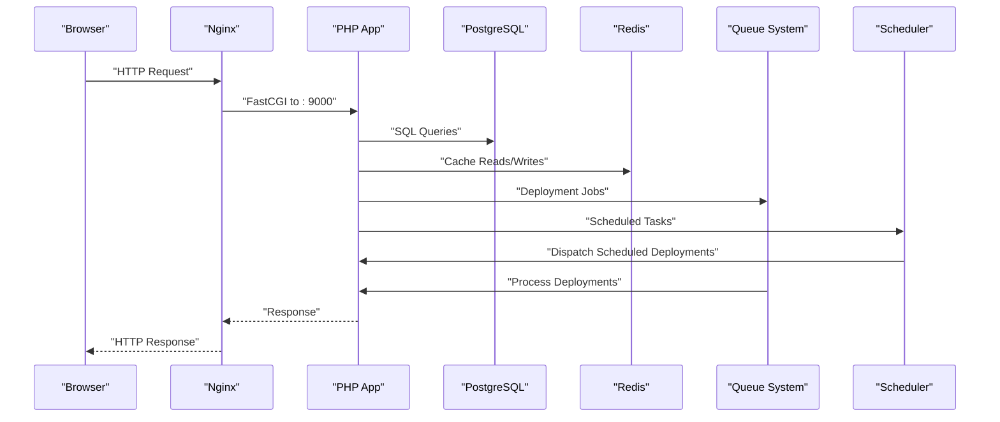
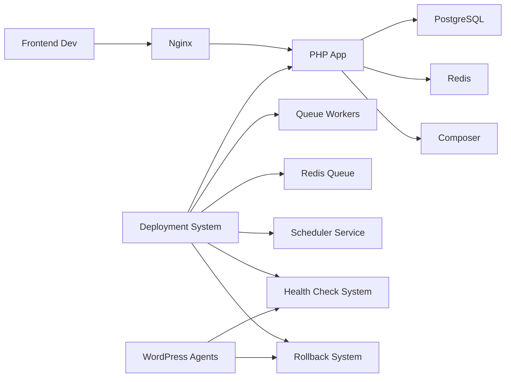

# Deployment & Operations

<cite>
**Referenced Files in This Document**
- [docker-compose.yml](file://docker-compose.yml)
- [default.conf](file://docker/nginx/default.conf)
- [Dockerfile (PHP)](file://docker/php/Dockerfile)
- [Dockerfile (Node)](file://docker/node/Dockerfile)
- [app.php](file://portal/config/app.php)
- [database.php](file://portal/config/database.php)
- [logging.php](file://portal/config/logging.php)
- [composer.json](file://portal/composer.json)
- [web.php](file://portal/routes/web.php)
- [api.php](file://portal/routes/api.php)
- [2026_05_15_070001_create_hostings_table.php](file://portal/database/migrations/2026_05_15_070001_create_hostings_table.php)
- [2026_05_15_070002_create_sites_table.php](file://portal/database/migrations/2026_05_15_070002_create_sites_table.php)
- [2026_05_15_080005_create_deployment_jobs_table.php](file://portal/database/migrations/2026_05_15_080005_create_deployment_jobs_table.php)
- [2026_05_15_080006_create_deployment_job_sites_table.php](file://portal/database/migrations/2026_05_15_080006_create_deployment_job_sites_table.php)
- [2026_05_17_000001_add_rollback_and_schedule_fields.php](file://portal/database/migrations/2026_05_17_000001_add_rollback_and_schedule_fields.php)
- [CheckSiteHealth.php](file://portal/app/Console/Commands/CheckSiteHealth.php)
- [DispatchScheduledDeployments.php](file://portal/app/Console/Commands/DispatchScheduledDeployments.php)
- [SettingsController.php](file://portal/app/Http/Controllers/Portal/SettingsController.php)
- [ActivityLogService.php](file://portal/app/Services/ActivityLogService.php)
- [DeploymentController.php](file://portal/app/Http/Controllers/Portal/DeploymentController.php)
- [DeploymentJob.php](file://portal/app/Models/DeploymentJob.php)
- [DeploymentJobSite.php](file://portal/app/Models/DeploymentJobSite.php)
- [DispatchBulkDeployment.php](file://portal/app/Jobs/DispatchBulkDeployment.php)
- [PushPluginToSite.php](file://portal/app/Jobs/PushPluginToSite.php)
- [package.json](file://portal/frontend/package.json)
- [next.config.ts](file://portal/frontend/next.config.ts)
- [.gitignore (frontend)](file://portal/frontend/.gitignore)
- [deployments/page.tsx](file://portal/frontend/src/app/(dashboard)/deployments/page.tsx)
- [deployments/scheduled/page.tsx](file://portal/frontend/src/app/(dashboard)/deployments/scheduled/page.tsx)
- [deployments.ts](file://portal/frontend/src/lib/services/deployments.ts)
- [index.ts (types)](file://portal/frontend/src/types/index.ts)
- [class-health-check.php](file://agent/epos-wp-agent/includes/class-health-check.php)
- [class-rollback.php](file://agent/epos-wp-agent/includes/class-rollback.php)
</cite>

## Update Summary
**Changes Made**
- Enhanced deployment system documentation with scheduling capabilities and rollback mechanisms
- Added comprehensive health check system with automated rollback functionality
- Documented new scheduled deployment management endpoints and workflows
- Updated deployment job management with manual rollback capabilities
- Added detailed progress tracking with health monitoring and rollback status
- Enhanced frontend interfaces for scheduled deployments and rollback history

## Table of Contents
1. [Introduction](#introduction)
2. [Project Structure](#project-structure)
3. [Core Components](#core-components)
4. [Architecture Overview](#architecture-overview)
5. [Detailed Component Analysis](#detailed-component-analysis)
6. [Enhanced Deployment System](#enhanced-deployment-system)
7. [Health Monitoring and Automated Rollback](#health-monitoring-and-automated-rollback)
8. [Dependency Analysis](#dependency-analysis)
9. [Performance Considerations](#performance-considerations)
10. [Troubleshooting Guide](#troubleshooting-guide)
11. [Conclusion](#conclusion)
12. [Appendices](#appendices)

## Introduction
This document provides comprehensive guidance for deploying and operating the platform using Docker-based containers. It covers container configuration, environment setup, scaling strategies, infrastructure requirements, CI/CD considerations, database migrations and backups, monitoring and logging, load balancing and reverse proxy with Nginx, SSL/TLS and security hardening, maintenance procedures, and disaster recovery.

**Updated** Enhanced with comprehensive deployment system featuring scheduling capabilities, automated health checks, rollback mechanisms, and detailed progress tracking with real-time monitoring.

## Project Structure
The deployment stack is orchestrated with Docker Compose and includes:
- PHP application service built from a custom PHP-FPM Dockerfile
- Nginx reverse proxy serving static assets and routing API requests to the PHP application
- PostgreSQL database for persistent relational data
- Redis for caching and queues
- Frontend development container running Next.js locally
- Optional queue and scheduler services for Horizon and scheduled tasks
- Enhanced deployment system with scheduling and rollback capabilities

```mermaid
graph TB
subgraph "Network: epos-network"
APP["PHP App<br/>epos-app"]
NGINX["Nginx<br/>epos-nginx"]
FRONT["Frontend Dev<br/>epos-frontend"]
DB["PostgreSQL<br/>epos-postgres"]
RDS["Redis<br/>epos-redis"]
QUEUE["Queue (Horizon)<br/>epos-queue"]
SCHED["Scheduler<br/>epos-scheduler"]
DEPLOY_CTRL["Deployment Controller<br/>API Endpoints"]
JOB["Deployment Job<br/>Database Tables"]
BULK["Bulk Deployment<br/>Queue Processing"]
SCHEDULE["Scheduled Deployments<br/>Time-based Dispatch"]
HEALTH["Health Checks<br/>Automated Monitoring"]
ROLLBACK["Rollback System<br/>Automatic & Manual"]
ENDPOINT["Deployment API<br/>Enhanced Endpoints"]
ENDPOINT --> DEPLOY_CTRL
DEPLOY_CTRL --> JOB
JOB --> BULK
BULK --> APP
SCHEDULE --> DEPLOY_CTRL
HEALTH --> DEPLOY_CTRL
ROLLBACK --> DEPLOY_CTRL
ENDPOINT --> APP
ENDPOINT --> DB
JOB --> DB
BULK --> DB
BULK --> RDS
ENDPOINT --> RDS
ENDPOINT --> NGINX
```

**Diagram sources**
- [docker-compose.yml:1-109](file://docker-compose.yml#L1-L109)
- [DeploymentController.php:15-386](file://portal/app/Http/Controllers/Portal/DeploymentController.php#L15-L386)
- [DispatchBulkDeployment.php:14-37](file://portal/app/Jobs/DispatchBulkDeployment.php#L14-L37)
- [DispatchScheduledDeployments.php:1-34](file://portal/app/Console/Commands/DispatchScheduledDeployments.php#L1-L34)

**Section sources**
- [docker-compose.yml:1-109](file://docker-compose.yml#L1-L109)

## Core Components
- PHP Application Service
  - Built from a PHP 8.2 FPM base image with system extensions and Redis PECL module installed.
  - Non-root user is created and used for process isolation.
  - Mounted volume syncs the portal application code into the container.
  - Depends on PostgreSQL and Redis.

- Nginx Reverse Proxy
  - Serves the PHP application via FastCGI to port 9000 inside the app container.
  - Exposes port 80 mapped to the host via APP_PORT with defaults.
  - Provides CORS headers for local frontend development.
  - Denies access to hidden files except well-known paths.

- PostgreSQL Database
  - Named volume persists relational data.
  - Environment variables configure database name, user, and password.
  - Exposed on host port 5432 with configurable override.

- Redis
  - Named volume persists cached data and supports queues.
  - Exposed on host port 6379 with configurable override.

- Frontend Development Container
  - Node 20 Alpine image with npm scripts.
  - Mounts frontend code and runs Next.js dev server on port 3000.
  - Rewrites API requests to the backend for local development.

- Queue and Scheduler
  - Queue service runs Horizon to process queues.
  - Scheduler service periodically invokes scheduled tasks including deployment dispatch.

**Section sources**
- [docker/php/Dockerfile:1-46](file://docker/php/Dockerfile#L1-L46)
- [docker/node/Dockerfile:1-14](file://docker/node/Dockerfile#L1-L14)
- [docker-compose.yml:1-109](file://docker-compose.yml#L1-L109)
- [default.conf:1-41](file://docker/nginx/default.conf#L1-L41)

## Architecture Overview
The platform uses a reverse-proxy fronted PHP application. The frontend communicates with the backend via Nginx rewrites during development. Production deployments should expose Nginx to the internet and secure traffic with TLS termination or pass-through depending on the chosen strategy.

**Updated** Enhanced with comprehensive deployment system architecture including scheduling, health monitoring, and rollback capabilities.



**Diagram sources**
- [docker-compose.yml:15-40](file://docker-compose.yml#L15-L40)
- [default.conf:30-35](file://docker/nginx/default.conf#L30-L35)
- [DeploymentController.php:24-82](file://portal/app/Http/Controllers/Portal/DeploymentController.php#L24-L82)
- [DispatchScheduledDeployments.php:14-32](file://portal/app/Console/Commands/DispatchScheduledDeployments.php#L14-L32)

## Detailed Component Analysis

### Reverse Proxy and Load Balancing (Nginx)
- Nginx listens on port 80 and serves the PHP application's public directory.
- Static asset limits and CORS headers are configured for local development.
- PHP requests are proxied to the PHP application container on port 9000.
- Access to hidden files is denied except for well-known paths.

Operational guidance:
- For production, bind Nginx to the host IP and configure TLS termination.
- Use upstream blocks and multiple Nginx instances behind a hardware or cloud load balancer for high availability.
- Enable gzip and cache headers for static assets.

**Section sources**
- [default.conf:1-41](file://docker/nginx/default.conf#L1-L41)
- [docker-compose.yml:15-26](file://docker-compose.yml#L15-L26)

### PHP Application Container
- PHP-FPM with required extensions and Redis support.
- Composer is available inside the container for dependency management.
- Non-root user ensures safer runtime execution.

Scaling considerations:
- Run multiple PHP application replicas behind a load balancer.
- Use sticky sessions if required by session storage; otherwise rely on external cache/session stores.

**Section sources**
- [docker/php/Dockerfile:1-46](file://docker/php/Dockerfile#L1-L46)
- [docker-compose.yml:2-13](file://docker-compose.yml#L2-L13)

### Frontend Development Container
- Next.js dev server runs on port 3000.
- Local rewrites route API calls to the backend for seamless development.

Production guidance:
- Build and deploy the frontend using a CDN or Nginx static serving.
- Configure environment variables for API base URL and feature flags.

**Section sources**
- [docker/node/Dockerfile:1-14](file://docker/node/Dockerfile#L1-L14)
- [next.config.ts:1-15](file://portal/frontend/next.config.ts#L1-L15)
- [.gitignore (frontend):1-42](file://portal/frontend/.gitignore#L1-L42)

### Database and Migrations
- Default connection is SQLite in the provided configuration.
- PostgreSQL and Redis configurations are available for production.
- Migrations define hostings, sites, and related tables.

**Updated** Enhanced with deployment-specific migrations supporting scheduling, rollback, and health monitoring capabilities.

Migration and backup procedures:
- Apply migrations using the application container.
- Back up PostgreSQL using logical dumps or managed services snapshots.
- Back up Redis persistence volume for cache continuity.

**Section sources**
- [database.php:20-117](file://portal/config/database.php#L20-L117)
- [2026_05_15_070001_create_hostings_table.php:1-27](file://portal/database/migrations/2026_05_15_070001_create_hostings_table.php#L1-L27)
- [2026_05_15_070002_create_sites_table.php:1-35](file://portal/database/migrations/2026_05_15_070002_create_sites_table.php#L1-L35)
- [2026_05_15_080005_create_deployment_jobs_table.php:1-31](file://portal/database/migrations/2026_05_15_080005_create_deployment_jobs_table.php#L1-L31)
- [2026_05_15_080006_create_deployment_job_sites_table.php:1-27](file://portal/database/migrations/2026_05_15_080006_create_deployment_job_sites_table.php#L1-L27)
- [2026_05_17_000001_add_rollback_and_schedule_fields.php:1-50](file://portal/database/migrations/2026_05_17_000001_add_rollback_and_schedule_fields.php#L1-L50)

### Queues and Scheduled Tasks
- Queue service runs Horizon to process queues.
- Scheduler service executes scheduled tasks every minute.

**Updated** Enhanced with deployment-specific queue processing for bulk deployments and scheduled deployment dispatch.

Operational guidance:
- Scale queue workers horizontally as needed.
- Ensure Redis connectivity and proper queue configuration.
- Monitor Horizon UI for failed jobs and retry policies.
- Deployment jobs are processed on dedicated 'deployments' queue.
- Scheduled deployments are automatically dispatched by the scheduler service.

**Section sources**
- [docker-compose.yml:66-100](file://docker-compose.yml#L66-L100)
- [DispatchBulkDeployment.php:30-34](file://portal/app/Jobs/DispatchBulkDeployment.php#L30-L34)
- [DispatchScheduledDeployments.php:14-32](file://portal/app/Console/Commands/DispatchScheduledDeployments.php#L14-L32)

### Health Monitoring and Site Status Checks
- A console command periodically evaluates site connectivity based on last ping timestamps and emits notifications.
- Activity logs are recorded for site disconnections and recoveries.

**Updated** Enhanced with comprehensive health monitoring system including automated rollback capabilities.

Operational guidance:
- Configure Telegram bot token and chat ID via settings endpoints.
- Schedule the health check command via the scheduler service.
- Health checks monitor site accessibility, admin panel reachability, fatal errors, and plugin activation status.
- Automated rollback triggers when health checks fail.

**Section sources**
- [CheckSiteHealth.php:1-95](file://portal/app/Console/Commands/CheckSiteHealth.php#L1-L95)
- [SettingsController.php:1-49](file://portal/app/Http/Controllers/Portal/SettingsController.php#L1-L49)
- [ActivityLogService.php:1-49](file://portal/app/Services/ActivityLogService.php#L1-L49)
- [class-health-check.php:1-320](file://agent/epos-wp-agent/includes/class-health-check.php#L1-L320)

### Logging and Observability
- Default logging channel is stack-based with configurable daily rotation.
- Slack and Papertrail channels are available for external integrations.
- Stderr and syslog channels support centralized logging.

Operational guidance:
- Configure LOG_CHANNEL and LOG_LEVEL for environments.
- Integrate with external log aggregation systems using stderr or syslog.

**Section sources**
- [logging.php:1-133](file://portal/config/logging.php#L1-L133)
- [app.php:121-124](file://portal/config/app.php#L121-L124)

### API Surface and Authentication
- Public authentication endpoints and protected routes gated by Sanctum and role middleware.
- Admin-only endpoints for managing hostings, users, and settings.

**Updated** Enhanced with comprehensive deployment management endpoints including scheduling, rollback, and health monitoring.

Operational guidance:
- Enforce HTTPS in production and configure trusted proxies.
- Use role middleware to restrict administrative actions.
- Deployment endpoints are accessible to admin and dev roles.
- Health check endpoints are available for agent communication.

**Section sources**
- [api.php:1-142](file://portal/routes/api.php#L1-L142)
- [web.php:1-8](file://portal/routes/web.php#L1-L8)

## Enhanced Deployment System

### Overview
The platform now includes a comprehensive deployment system supporting bulk deployments across multiple WordPress sites with advanced scheduling capabilities, automated health monitoring, rollback mechanisms, and detailed progress tracking with real-time monitoring and job management.

### Enhanced API Endpoints
The deployment system exposes the following REST endpoints:

**Core Deployment Management**
- `POST /api/deployments` - Create a new deployment job (supports scheduling)
- `GET /api/deployments` - List deployment jobs
- `GET /api/deployments/{deploymentJob}` - Show deployment job details
- `GET /api/deployments/{deploymentJob}/progress` - Get progress counts
- `POST /api/deployments/{deploymentJob}/retry-failed` - Retry failed deployments
- `POST /api/deployments/{deploymentJob}/cancel` - Cancel deployment

**Scheduling Management**
- `GET /api/deployments/scheduled` - List scheduled deployment jobs
- `PUT /api/deployments/{deploymentJob}/schedule` - Reschedule a deployment
- `DELETE /api/deployments/{deploymentJob}/schedule` - Cancel scheduled deployment

**Rollback Management**
- `POST /api/deployment-job-sites/{deploymentJobSite}/rollback` - Manual rollback for specific site
- `GET /api/sites/{site}/rollback-history` - Get rollback history for a site

### Deployment Workflow Enhancements
1. **Job Creation**: Admin/Dev users create deployment jobs with optional scheduling
2. **Scheduling**: Jobs can be scheduled for future execution with validation
3. **Bulk Processing**: System fans out individual deployment tasks to each target site
4. **Health Monitoring**: Automated health checks run after deployment completion
5. **Rollback Capability**: Automatic rollback on health check failure or manual rollback
6. **Real-time Tracking**: Live monitoring of deployment status with health indicators
7. **Completion Handling**: Final status determined with success/failure ratios and health status

### Database Schema Enhancements
The deployment system introduces enhanced database schema supporting scheduling and rollback:

**deployment_jobs** (Enhanced)
- Supports 'scheduled' status for time-based deployments
- Added 'job_type' field for distinguishing between regular and rollback deployments
- Added 'scheduled_at' timestamp for scheduling functionality
- Enhanced status enum includes 'scheduled' and 'cancelled'

**deployment_job_sites** (Enhanced)
- Enhanced status enum includes 'healthy' and 'rolled_back' status indicators
- Added rollback tracking fields: 'rollback_version', 'rollback_reason', 'rolled_back_at'
- Added health monitoring fields: 'health_check_results' JSON storage
- Improved status tracking with health monitoring integration

### Advanced Job Management Features
- **Scheduling Capabilities**: Create deployments with future execution dates
- **Rescheduling**: Modify scheduled deployment times dynamically
- **Cancellation**: Cancel queued or running deployments
- **Manual Rollback**: Trigger rollback for specific deployment failures
- **Automatic Rollback**: Health check system automatically rolls back failed deployments
- **Rollback History**: Track and view rollback activities
- **Health Monitoring**: Comprehensive health check system with multiple validation points
- **Detailed Progress Tracking**: Real-time progress with health status indicators
- **Error Tracking**: Comprehensive error logging and reporting
- **Activity Logging**: Audit trail of all deployment activities including rollbacks

### Frontend Integration Enhancements
The deployment system includes comprehensive frontend interfaces:

**Enhanced Deployments Dashboard**
- Lists all deployment jobs with status indicators including health status
- Shows scheduled deployments with countdown timers
- Real-time progress bars and statistics with health monitoring
- Detail views with individual site status and health check results

**Scheduled Deployments Interface**
- Dedicated interface for managing scheduled deployments
- Edit schedule functionality with date/time picker
- Cancel scheduled deployment option
- Visual indicators for upcoming deployments

**Rollback Management Interface**
- View rollback history for individual sites
- Manual rollback initiation from deployment detail pages
- Rollback status tracking and completion verification

**Section sources**
- [DeploymentController.php:15-386](file://portal/app/Http/Controllers/Portal/DeploymentController.php#L15-L386)
- [DeploymentJob.php:9-37](file://portal/app/Models/DeploymentJob.php#L9-L37)
- [DeploymentJobSite.php:8-30](file://portal/app/Models/DeploymentJobSite.php#L8-L30)
- [DispatchBulkDeployment.php:14-37](file://portal/app/Jobs/DispatchBulkDeployment.php#L14-L37)
- [PushPluginToSite.php:17-116](file://portal/app/Jobs/PushPluginToSite.php#L17-L116)
- [deployments/page.tsx:22-177](file://portal/frontend/src/app/(dashboard)/deployments/page.tsx#L22-L177)
- [deployments/scheduled/page.tsx:33-300](file://portal/frontend/src/app/(dashboard)/deployments/scheduled/page.tsx#L33-L300)
- [deployments.ts:3-34](file://portal/frontend/src/lib/services/deployments.ts#L3-L34)
- [index.ts (types):111-155](file://portal/frontend/src/types/index.ts#L111-L155)

## Health Monitoring and Automated Rollback

### Automated Health Check System
The platform implements a comprehensive automated health check system that monitors deployed plugins after installation:

**Health Check Components**
- **Site Reachability**: Verifies homepage accessibility after deployment
- **Admin Panel Access**: Confirms WordPress admin panel accessibility
- **Fatal Error Detection**: Scans debug.log for PHP fatal errors post-installation
- **WooCommerce Checkout**: Validates e-commerce functionality (when applicable)
- **Plugin Activation**: Ensures target plugin remains active after deployment

**Health Check Scheduling**
- First health check: 2 minutes after deployment completion
- Second health check: 7 minutes after deployment completion
- Automatic cleanup of deployment tracking after successful completion

**Rollback Triggers**
- Any failed health check triggers automatic rollback
- Rollback preserves plugin activation state when possible
- Extended backup retention for investigation period (7 days)
- Health status tracking prevents duplicate rollback attempts

### Manual Rollback System
Administrators can manually trigger rollbacks for specific deployment failures:

**Manual Rollback Process**
- Identify failing deployment job site
- Initiate manual rollback from deployment detail page
- System automatically finds previous stable version
- Creates rollback deployment job with appropriate metadata
- Executes rollback operation on target site
- Logs rollback activity for audit trail

**Rollback History Tracking**
- Comprehensive rollback history for each site
- Detailed rollback metadata including versions and reasons
- Timestamp tracking for rollback completion
- Integration with deployment job tracking system

### Agent Integration
WordPress agents communicate health check results and rollback status to the central portal:

**Agent Health Reporting**
- Health check results sent to portal via REST API
- Rollback status reporting for failed deployments
- Error detail transmission for troubleshooting
- Integration with portal's activity logging system

**Section sources**
- [class-health-check.php:1-320](file://agent/epos-wp-agent/includes/class-health-check.php#L1-L320)
- [class-rollback.php:1-224](file://agent/epos-wp-agent/includes/class-rollback.php#L1-L224)
- [DeploymentController.php:301-384](file://portal/app/Http/Controllers/Portal/DeploymentController.php#L301-L384)

## Dependency Analysis
The application depends on:
- PHP 8.2 runtime and extensions
- PostgreSQL for primary data
- Redis for caching and queues
- Composer for dependency management
- Next.js for frontend development

**Updated** Enhanced with deployment system dependencies including scheduling, health monitoring, and rollback capabilities.



**Diagram sources**
- [docker-compose.yml:1-109](file://docker-compose.yml#L1-L109)
- [composer.json:1-90](file://portal/composer.json#L1-L90)
- [DispatchBulkDeployment.php:30-34](file://portal/app/Jobs/DispatchBulkDeployment.php#L30-L34)
- [DispatchScheduledDeployments.php:14-32](file://portal/app/Console/Commands/DispatchScheduledDeployments.php#L14-L32)

**Section sources**
- [docker-compose.yml:1-109](file://docker-compose.yml#L1-L109)
- [composer.json:1-90](file://portal/composer.json#L1-L90)

## Performance Considerations
- PHP OPcache and Bcmath/Intl extensions are enabled for improved performance.
- Redis configured for caching and queue backplane.
- Use persistent connections and connection pooling for PostgreSQL and Redis.
- Enable gzip and browser caching for static assets via Nginx.
- Scale PHP replicas behind Nginx and use Redis clustering for high throughput.

**Updated** Added deployment system performance considerations including scheduling, health monitoring, and rollback optimization.

- **Queue Scaling**: Deploy dedicated queue workers for deployment processing and health monitoring
- **Concurrent Execution**: Fan-out bulk deployments across multiple worker processes
- **Connection Pooling**: Optimize database connections for high-volume deployment operations
- **Memory Management**: Monitor memory usage during bulk deployment operations and health check processing
- **Timeout Configuration**: Proper timeout handling for long-running deployment tasks and health check operations
- **Scheduling Optimization**: Efficient scheduling of deployment dispatch and health check operations
- **Rollback Performance**: Optimized rollback operations with minimal downtime impact
- **Health Check Efficiency**: Optimized health check execution with minimal resource consumption

## Troubleshooting Guide
Common operational issues and resolutions:
- Application not reachable
  - Verify Nginx is listening on the expected port and routing to the PHP container.
  - Confirm CORS headers for local development and origin allowances for production.

- Database connectivity failures
  - Check PostgreSQL credentials and network reachability.
  - Ensure migrations are applied before startup.

- Queue processing not working
  - Confirm Redis is reachable and Horizon is running.
  - Review queue worker logs and retry policies.
  - Verify deployment-specific queue configuration.

- Deployment failures
  - Check individual site deployment logs for specific error messages.
  - Verify plugin version availability and download URLs.
  - Ensure target sites are connected and accessible.
  - Monitor queue worker capacity for deployment processing.
  - Check health check results for automated rollback triggers.

- Scheduling issues
  - Verify scheduler service is running and executing scheduled tasks.
  - Check deployment job status transitions from 'scheduled' to 'queued'.
  - Validate scheduled deployment times and timezone settings.

- Rollback problems
  - Verify backup availability for rollback operations.
  - Check rollback history for failed rollback attempts.
  - Ensure health check system is functioning correctly.
  - Validate agent communication for health reporting.

- Logging not appearing externally
  - Set LOG_CHANNEL to daily or stderr and forward container logs to a collector.
  - Validate Slack/Papertrail webhook URLs and credentials.

**Updated** Added comprehensive troubleshooting guidance for scheduling, health monitoring, and rollback systems.

**Section sources**
- [default.conf:13-27](file://docker/nginx/default.conf#L13-L27)
- [docker-compose.yml:42-64](file://docker-compose.yml#L42-L64)
- [logging.php:76-113](file://portal/config/logging.php#L76-L113)
- [PushPluginToSite.php:64-71](file://portal/app/Jobs/PushPluginToSite.php#L64-L71)
- [class-health-check.php:239-273](file://agent/epos-wp-agent/includes/class-health-check.php#L239-L273)

## Conclusion
The platform is designed for containerized deployment with clear separation of concerns: Nginx for reverse proxy, PHP for application logic, PostgreSQL for persistence, and Redis for caching and queues. The enhanced deployment system adds comprehensive bulk deployment capabilities with real-time monitoring, scheduling, automated health checks, and rollback mechanisms. By following the operational guidance—scaling horizontally, securing traffic, maintaining robust logging, automating migrations, implementing health monitoring, and establishing rollback procedures—you can achieve reliable, observable, and maintainable operations with advanced deployment management capabilities.

**Updated** Enhanced conclusion to reflect the addition of comprehensive deployment system capabilities including scheduling, health monitoring, and rollback mechanisms.

## Appendices

### Infrastructure Requirements
- Servers
  - Minimum: 2 vCPUs, 4 GB RAM, 50 GB SSD for development.
  - Production: Horizontal scaling with load balancer, auto-scaling groups, and managed PostgreSQL/Redis offerings.

**Updated** Added deployment system infrastructure requirements.

- **Queue Workers**: Dedicated deployment workers for bulk processing and health monitoring
- **Storage**: Additional disk space for plugin packages, deployment artifacts, and rollback backups
- **Network**: Increased bandwidth for plugin distribution to multiple sites and health check communications
- **Scheduling Service**: Dedicated scheduler service for time-based deployment dispatch
- **Health Monitoring**: Additional resources for health check execution and monitoring

### CI/CD Pipeline Setup
- Build stages
  - Build PHP container with Composer dependencies.
  - Build Node container for frontend assets.
- Test stages
  - Run unit and feature tests via Composer scripts.
- Deploy stages
  - Push images to a registry.
  - Orchestrate deployment with Docker Compose or Kubernetes.
- Automation
  - Use GitHub Actions or GitLab CI to automate builds, tests, and deployments.

**Updated** Deployment system CI/CD considerations.

- **Deployment Testing**: Automated testing of deployment workflows and rollback scenarios
- **Rollback Procedures**: Automated rollback for failed deployments and health check failures
- **Monitoring Integration**: Deployment metrics, health check monitoring, and alerting integration
- **Scheduling Validation**: Automated validation of scheduled deployment workflows

### SSL/TLS Certificate Management
- Option 1: TLS termination at Nginx with ACME automation.
- Option 2: TLS passthrough to PHP application if required by infrastructure.
- Rotate certificates and reload Nginx after renewal.

### Maintenance Procedures
- Updates and patches
  - Regularly update base images and dependencies.
  - Apply database migrations in maintenance windows.
- System health checks
  - Monitor Nginx, PHP, PostgreSQL, and Redis health.
  - Use scheduled tasks to validate connectivity and alert on failures.
  - Monitor deployment queue health and worker status.
  - Validate health check system functionality and rollback capabilities.

**Updated** Added deployment system maintenance procedures.

- **Deployment Health**: Monitor deployment queue health, worker status, and job processing
- **Plugin Management**: Regular plugin version updates, compatibility checks, and rollback readiness
- **Storage Monitoring**: Monitor disk usage for plugin packages, deployment logs, and rollback backups
- **Performance Tuning**: Optimize queue worker scaling based on deployment volume and health check load
- **Health System Maintenance**: Regular testing of health check procedures and rollback mechanisms
- **Scheduling Validation**: Periodic validation of scheduled deployment workflows and time synchronization

**Section sources**
- [CheckSiteHealth.php:16-73](file://portal/app/Console/Commands/CheckSiteHealth.php#L16-L73)
- [DispatchScheduledDeployments.php:14-32](file://portal/app/Console/Commands/DispatchScheduledDeployments.php#L14-L32)

### Disaster Recovery and Backup
- Backups
  - PostgreSQL: Logical dumps or managed snapshots.
  - Redis: Persisted volume plus periodic snapshots.
  - Application code: Version-controlled and containerized.
  - Deployment state: Backup deployment job states, progress tracking, and rollback history.
  - Plugin artifacts: Maintain plugin package versions and rollback backups.
- Restoration
  - Restore database from latest dump.
  - Recreate containers and re-run migrations.
  - Rehydrate caches from backups where applicable.
  - Restore deployment state and resume interrupted bulk deployments.
  - Validate health check system and rollback capabilities after restoration.

**Updated** Added deployment system disaster recovery considerations.

- **Deployment State**: Backup deployment job states, progress tracking, and scheduling information
- **Rollback Data**: Maintain rollback backup copies and version history for restoration
- **Queue Recovery**: Handle queue state recovery after system failures, including scheduled deployment dispatch
- **Health Monitoring**: Restore health check configuration and monitoring capabilities
- **Partial Deployment Recovery**: Ability to resume interrupted bulk deployments and health check processes
- **Rollback History**: Maintain comprehensive rollback history for audit and recovery purposes