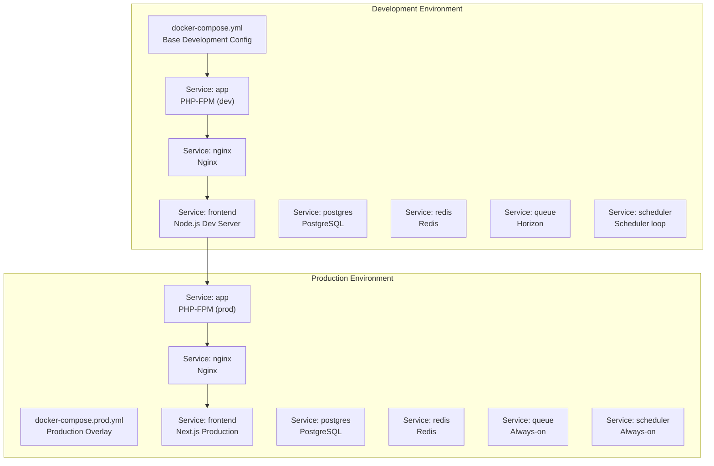
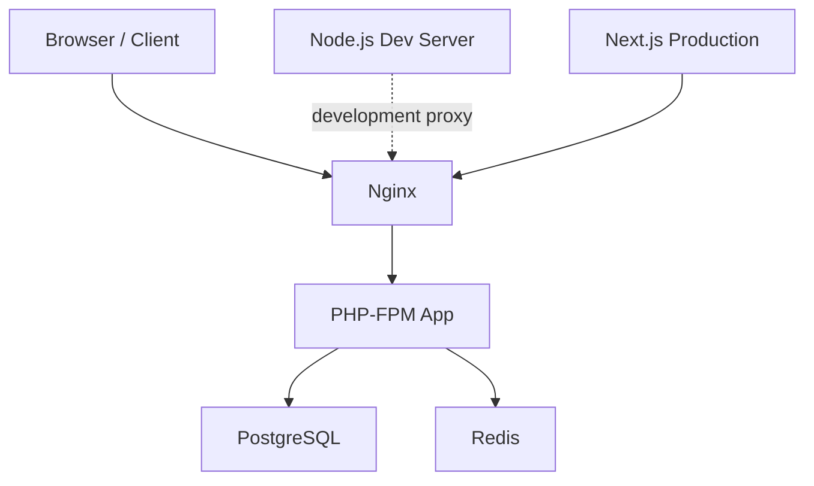
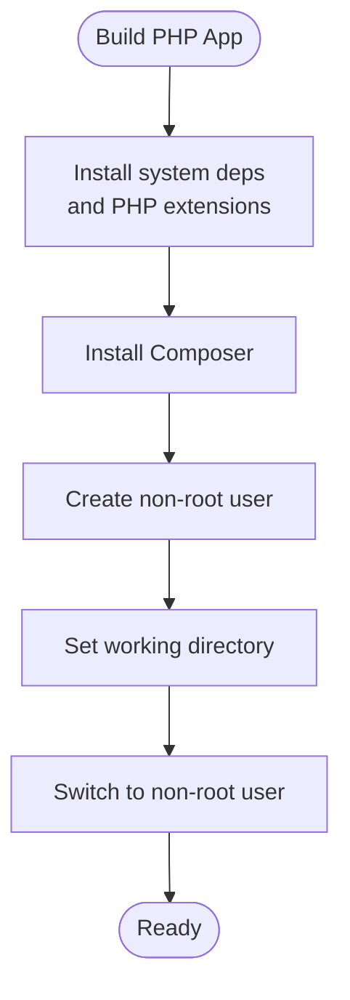
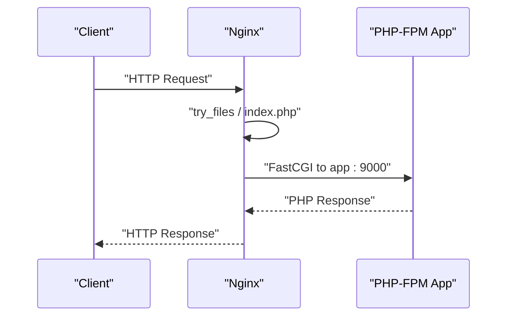
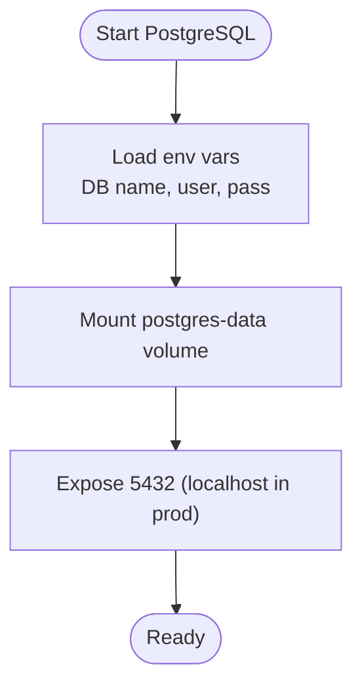
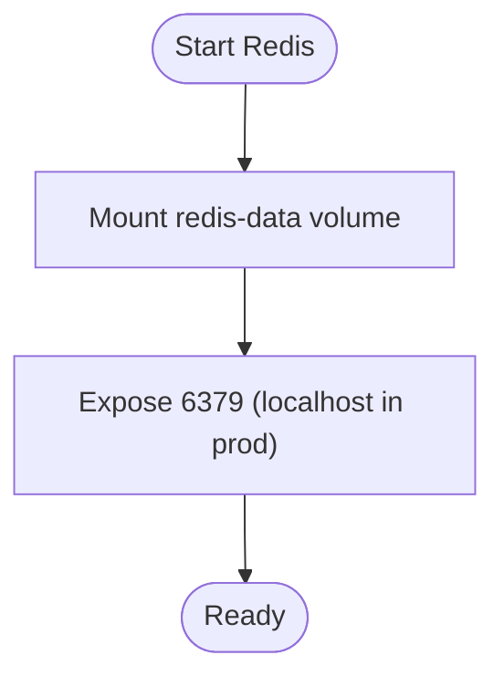
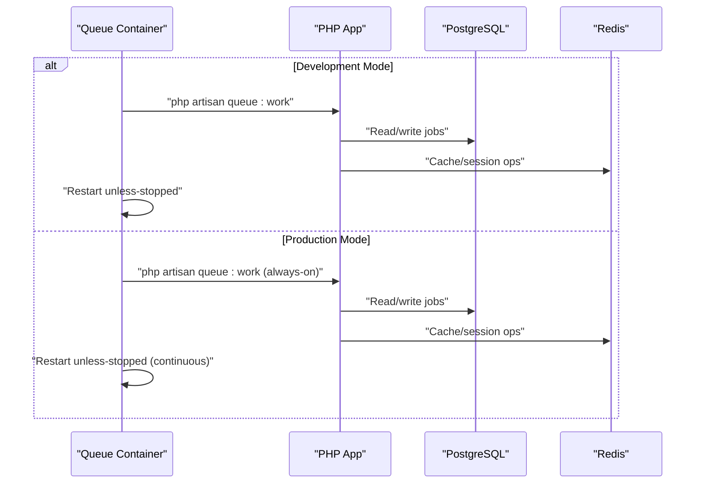
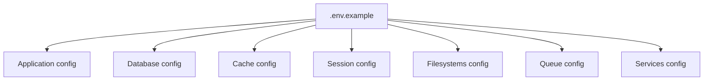
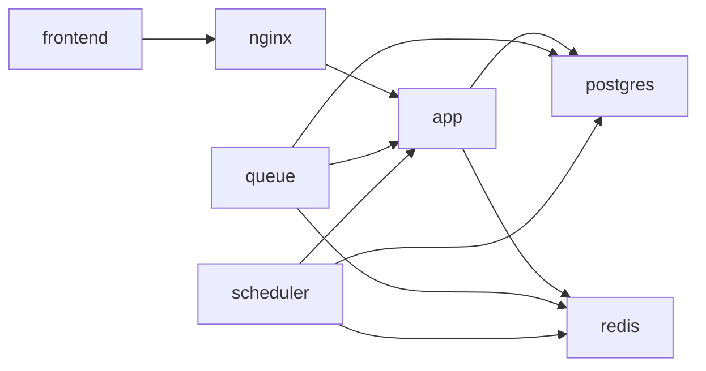

# Docker Deployment

<cite>
**Referenced Files in This Document**
- [docker-compose.yml](file://docker-compose.yml)
- [docker-compose.prod.yml](file://docker-compose.prod.yml)
- [Makefile](file://Makefile)
- [docker/php/Dockerfile](file://docker/php/Dockerfile)
- [docker/node/Dockerfile](file://docker/node/Dockerfile)
- [docker/nginx/default.conf](file://docker/nginx/default.conf)
- [portal/composer.json](file://portal/composer.json)
- [portal/package.json](file://portal/package.json)
- [portal/config/database.php](file://portal/config/database.php)
- [portal/config/cache.php](file://portal/config/cache.php)
- [portal/config/session.php](file://portal/config/session.php)
- [portal/config/app.php](file://portal/config/app.php)
- [portal/config/filesystems.php](file://portal/config/filesystems.php)
- [portal/config/queue.php](file://portal/config/queue.php)
- [portal/config/services.php](file://portal/config/services.php)
- [portal/.env.example](file://portal/.env.example)
- [portal/frontend/.env.local.example](file://portal/frontend/.env.local.example)
- [portal/vite.config.js](file://portal/vite.config.js)
</cite>

## Update Summary
**Changes Made**
- Added comprehensive production overlay documentation with docker-compose.prod.yml
- Documented environment switching commands and streamlined deployment workflows
- Updated deployment instructions to include production-specific configurations
- Enhanced frontend container setup with production build process
- Added Makefile commands for environment management and production deployment

## Table of Contents
1. [Introduction](#introduction)
2. [Project Structure](#project-structure)
3. [Core Components](#core-components)
4. [Architecture Overview](#architecture-overview)
5. [Development vs Production Environments](#development-vs-production-environments)
6. [Detailed Component Analysis](#detailed-component-analysis)
7. [Environment Management](#environment-management)
8. [Production Deployment](#production-deployment)
9. [Dependency Analysis](#dependency-analysis)
10. [Performance Considerations](#performance-considerations)
11. [Troubleshooting Guide](#troubleshooting-guide)
12. [Conclusion](#conclusion)
13. [Appendices](#appendices)

## Introduction
This document provides comprehensive guidance for deploying the portal stack using Docker and Docker Compose across both development and production environments. It covers container orchestration, service definitions, networking, volumes, and environment-driven configuration. The enhanced setup now includes a production-ready overlay (docker-compose.prod.yml) that provides separate build processes for development and production environments, along with streamlined deployment workflows and environment switching commands.

## Project Structure
The deployment is orchestrated by two primary Docker Compose files: a base development configuration (docker-compose.yml) and a production overlay (docker-compose.prod.yml). The base configuration defines services for the PHP application, Nginx, Node.js frontend, PostgreSQL, and Redis, while the production overlay extends and overrides these settings for production readiness.

**Diagram sources**
- [docker-compose.yml:1-118](file://docker-compose.yml#L1-L118)
- [docker-compose.prod.yml:16-53](file://docker-compose.prod.yml#L16-L53)

**Section sources**
- [docker-compose.yml:1-118](file://docker-compose.yml#L1-L118)
- [docker-compose.prod.yml:1-53](file://docker-compose.prod.yml#L1-L53)

## Core Components
- **PHP Application Container (Laravel)**
  - Built from a custom PHP-FPM base image with system dependencies and extensions installed.
  - Non-root user is created and used for process isolation.
  - Application code is mounted from the host for local development iteration.
  - In production, runs php-fpm directly instead of development commands.

- **Nginx Reverse Proxy**
  - Serves static assets and proxies PHP requests to the PHP-FPM app container.
  - CORS headers are configured for the frontend origin during development.
  - Exposes the configured application port to the host.

- **Node.js Frontend Container**
  - **Development**: Runs the Next.js/Vite development server for the frontend.
  - **Production**: Runs a built Next.js application with production optimizations.
  - Mounts the frontend directory for live reload and iterative development in dev mode.

- **PostgreSQL Database**
  - Provides relational data persistence with named volume for durability.
  - Configured via environment variables for database name, user, and password.
  - In production, binds to localhost for security.

- **Redis**
  - Provides caching and session storage for the application.
  - Uses a named volume for persistence.
  - In production, binds to localhost for security.

- **Queue Worker and Scheduler**
  - Separate containers running Laravel Horizon and a scheduled task runner.
  - Both depend on the app, PostgreSQL, and Redis.
  - In production, these workers run continuously without profile gating.

**Section sources**
- [docker/php/Dockerfile:1-49](file://docker/php/Dockerfile#L1-L49)
- [docker/node/Dockerfile:1-14](file://docker/node/Dockerfile#L1-L14)
- [docker/nginx/default.conf:1-25](file://docker/nginx/default.conf#L1-L25)
- [docker-compose.yml:1-118](file://docker-compose.yml#L1-L118)
- [docker-compose.prod.yml:16-53](file://docker-compose.prod.yml#L16-L53)

## Architecture Overview
The system uses a bridge network to connect all services. Nginx fronts the application and forwards PHP requests to the PHP-FPM app container. The frontend runs independently and communicates with the backend via the Nginx gateway. PostgreSQL and Redis provide persistence and caching respectively. Queue and scheduler containers run alongside the app to handle background tasks and cron-like jobs, with production environments running these workers continuously.

**Diagram sources**
- [docker-compose.yml:1-118](file://docker-compose.yml#L1-L118)
- [docker-compose.prod.yml:16-53](file://docker-compose.prod.yml#L16-L53)
- [docker/nginx/default.conf:1-25](file://docker/nginx/default.conf#L1-L25)

## Development vs Production Environments
The deployment supports two distinct environments with separate configurations and workflows:

### Development Environment (Default)
- **Frontend**: Next.js development server with Hot Module Replacement (HMR)
- **Backend**: Laravel application with development commands
- **Workers**: Optional via Docker profiles
- **Ports**: Flexible port mapping for development convenience
- **Environment**: Development-focused with debugging enabled

### Production Environment (Overlay)
- **Frontend**: Built Next.js application served by production server
- **Backend**: PHP-FPM with production optimizations
- **Workers**: Always-on containers for continuous operation
- **Ports**: Secure binding to localhost for external exposure
- **Environment**: Production-ready with performance optimizations

**Section sources**
- [docker-compose.yml:1-118](file://docker-compose.yml#L1-L118)
- [docker-compose.prod.yml:16-53](file://docker-compose.prod.yml#L16-L53)
- [Makefile:51-91](file://Makefile#L51-L91)

## Detailed Component Analysis

### PHP Application Container (Laravel)
- **Base Image and Dependencies**
  - PHP-FPM base image with system packages and PHP extensions for GD, ZIP, ICU, EXIF, PCNTL, OPcache, and Redis extension.
  - Composer is installed and available for dependency management.
  - Non-root user is created and used for runtime security.

- **Working Directory and User**
  - Working directory is set to the application root.
  - Runtime user is switched to a non-root user for safer execution.

- **Volume Mount**
  - Application code is mounted from the host to enable live development.

- **Dependencies and Scripts**
  - Composer dependencies are declared for Laravel and related packages.
  - Scripts include setup, dev, and test commands.

**Diagram sources**
- [docker/php/Dockerfile:1-49](file://docker/php/Dockerfile#L1-L49)
- [portal/composer.json:1-90](file://portal/composer.json#L1-L90)

**Section sources**
- [docker/php/Dockerfile:1-49](file://docker/php/Dockerfile#L1-L49)
- [portal/composer.json:1-90](file://portal/composer.json#L1-L90)

### Nginx Reverse Proxy
- **Listening and Root**
  - Listens on port 80 and serves content from the application public directory.
  - Index files include PHP and HTML fallbacks.

- **CORS Configuration**
  - Adds CORS headers for the frontend origin during development.
  - Handles preflight OPTIONS requests explicitly.

- **PHP Request Handling**
  - Proxies PHP requests to the PHP-FPM app container on port 9000.
  - Includes FastCGI parameters and hides server signature.

- **Security**
  - Denies access to hidden files except well-known paths.

**Diagram sources**
- [docker/nginx/default.conf:1-25](file://docker/nginx/default.conf#L1-L25)
- [docker-compose.yml:16-27](file://docker-compose.yml#L16-L27)

**Section sources**
- [docker/nginx/default.conf:1-25](file://docker/nginx/default.conf#L1-L25)
- [docker-compose.yml:16-27](file://docker-compose.yml#L16-L27)

### Node.js Frontend Container
- **Development Mode**
  - Alpine Node.js base image with working directory set to the frontend path.
  - Copies package manifest and installs dependencies.
  - Starts the development server with hot reload.

- **Production Mode**
  - Installs dependencies using npm ci for deterministic builds.
  - Builds the Next.js application with production optimizations.
  - Starts the production server with zero-config deployment.

```mermaid
flowchart TD
subgraph "Development Mode"
BuildDev(["Build Node Frontend Dev"]) --> CopyPkgDev["Copy package manifests"]
CopyPkgDev --> InstallDepsDev["Install dependencies"]
InstallDepsDev --> CopySrcDev["Copy source code"]
CopySrcDev --> ExposePortDev["Expose port 3000"]
ExposePortDev --> RunDev["Run dev server"]
end
subgraph "Production Mode"
BuildProd(["Build Node Frontend Prod"]) --> CopyPkgProd["Copy package manifests"]
CopyPkgProd --> InstallCI["npm ci (deterministic)"]
InstallCI --> CopySrcProd["Copy source code"]
CopySrcProd --> BuildApp["npm run build (prod)"]
BuildApp --> RunProd["npm run start (prod)"]
end
```

**Diagram sources**
- [docker/node/Dockerfile:1-14](file://docker/node/Dockerfile#L1-L14)
- [docker-compose.prod.yml:28-33](file://docker-compose.prod.yml#L28-L33)
- [portal/package.json:5-10](file://portal/package.json#L5-L10)

**Section sources**
- [docker/node/Dockerfile:1-14](file://docker/node/Dockerfile#L1-L14)
- [docker-compose.prod.yml:28-33](file://docker-compose.prod.yml#L28-L33)
- [portal/package.json:1-43](file://portal/package.json#L1-L43)

### Database Container (PostgreSQL)
- **Image and Persistence**
  - Uses an Alpine PostgreSQL image.
  - Persists data in a named volume mapped to the container's data directory.

- **Environment Variables**
  - Configures database name, user, and password via environment variables.

- **Ports**
  - Exposes the PostgreSQL port to the host with configurable mapping.
  - In production, binds to localhost for security.

**Diagram sources**
- [docker-compose.yml:47-59](file://docker-compose.yml#L47-L59)
- [docker-compose.prod.yml:35-43](file://docker-compose.prod.yml#L35-L43)

**Section sources**
- [docker-compose.yml:47-59](file://docker-compose.yml#L47-L59)
- [docker-compose.prod.yml:35-43](file://docker-compose.prod.yml#L35-L43)

### Redis Container
- **Image and Persistence**
  - Uses an Alpine Redis image.
  - Persists data in a named volume under the container's data directory.

- **Ports**
  - Exposes the Redis port to the host with configurable mapping.
  - In production, binds to localhost for security.

**Diagram sources**
- [docker-compose.yml:61-69](file://docker-compose.yml#L61-L69)
- [docker-compose.prod.yml:40-43](file://docker-compose.prod.yml#L40-L43)

**Section sources**
- [docker-compose.yml:61-69](file://docker-compose.yml#L61-L69)
- [docker-compose.prod.yml:40-43](file://docker-compose.prod.yml#L40-L43)

### Queue Worker and Scheduler Containers
- **Development Profile Mode**
  - Runs the Horizon command to process queues.
  - Controlled by a profile for selective startup.
  - Designed for development flexibility.

- **Production Always-On Mode**
  - Runs continuously without profile gating.
  - Ensures reliable background job processing.
  - Critical for production reliability.

**Diagram sources**
- [docker-compose.yml:71-109](file://docker-compose.yml#L71-L109)
- [docker-compose.prod.yml:46-52](file://docker-compose.prod.yml#L46-L52)

**Section sources**
- [docker-compose.yml:71-109](file://docker-compose.yml#L71-L109)
- [docker-compose.prod.yml:46-52](file://docker-compose.prod.yml#L46-L52)

### PHP Application Configuration (Environment and Storage)
- **Environment Variables**
  - Application name, environment, debug, URL, locale, and maintenance settings are defined.
  - Database defaults to SQLite locally; production should override with PostgreSQL values.
  - Session and cache drivers are configured for database and Redis.
  - Redis defaults point to localhost; in Docker they must be overridden to the service name.

- **Database Configuration**
  - Supports multiple drivers including SQLite, MySQL/MariaDB, PostgreSQL, SQL Server.
  - PostgreSQL settings include host, port, database, username, password, charset, collation, and SSL mode.

- **Cache and Session Configuration**
  - Cache default is database; Redis cache connection is configurable.
  - Session driver defaults to database; Redis-backed sessions are supported.
  - Cookie and SameSite policies are configurable.

- **Filesystems**
  - Local disks for private and public storage.
  - Public disk URL is derived from the application URL.

- **Queues**
  - Supports sync, database, Beanstalkd, SQS, and Redis backends.
  - Redis queue connection is configurable.

- **Services**
  - Credentials for external services (Mailgun, Postmark, SES, Slack) are environment-driven.

**Diagram sources**
- [portal/.env.example:1-111](file://portal/.env.example#L1-L111)
- [portal/config/app.php:1-127](file://portal/config/app.php#L1-L127)
- [portal/config/database.php:1-185](file://portal/config/database.php#L1-L185)
- [portal/config/cache.php:1-118](file://portal/config/cache.php#L1-L118)
- [portal/config/session.php:1-218](file://portal/config/session.php#L1-L218)
- [portal/config/filesystems.php:1-81](file://portal/config/filesystems.php#L1-L81)
- [portal/config/queue.php:1-130](file://portal/config/queue.php#L1-L130)
- [portal/config/services.php:1-39](file://portal/config/services.php#L1-L39)

**Section sources**
- [portal/.env.example:1-111](file://portal/.env.example#L1-L111)
- [portal/config/app.php:1-127](file://portal/config/app.php#L1-L127)
- [portal/config/database.php:1-185](file://portal/config/database.php#L1-L185)
- [portal/config/cache.php:1-118](file://portal/config/cache.php#L1-L118)
- [portal/config/session.php:1-218](file://portal/config/session.php#L1-L218)
- [portal/config/filesystems.php:1-81](file://portal/config/filesystems.php#L1-L81)
- [portal/config/queue.php:1-130](file://portal/config/queue.php#L1-L130)
- [portal/config/services.php:1-39](file://portal/config/services.php#L1-L39)

## Environment Management
The deployment includes comprehensive environment switching capabilities managed through Makefile commands:

### Environment Switching Commands
- **Development Environment**: `make up` starts the development stack with hot reloading
- **Production Environment**: `make up-prod` starts the production stack with built assets
- **Environment Backup**: `make use-prod-env` swaps to production environment with automatic backup
- **Environment Restoration**: `make use-dev-env` restores development environment from backup

### Production Setup Workflow
The production setup process automates the complete deployment pipeline:
1. Switch to production environment
2. Build and start production containers
3. Set proper permissions for storage directories
4. Run database migrations
5. Generate configuration and route caches

**Section sources**
- [Makefile:51-91](file://Makefile#L51-L91)
- [Makefile:71-81](file://Makefile#L71-L81)

## Production Deployment
The production overlay provides a comprehensive deployment solution with the following key features:

### Production Configuration Overrides
- **Application Environment**: Sets APP_ENV to production for optimized behavior
- **Frontend Production Build**: Builds Next.js application once and serves with production server
- **Worker Reliability**: Removes profile gating so workers run continuously
- **Security Hardening**: Binds database and Redis ports to localhost only

### Deployment Commands
- **Production Start**: `make up-prod` - starts production stack with overlay
- **Production Stop**: `make down-prod` - stops production stack cleanly
- **Production Restart**: `make restart-prod` - restarts production stack
- **First-time Setup**: `make prod-setup` - complete production deployment pipeline

### Production Workflow Benefits
- **Separate Build Processes**: Development and production use different build pipelines
- **Streamlined Operations**: Single command deployment with automated setup
- **Environment Isolation**: Clear separation between development and production states
- **Reliability**: Continuous worker processes ensure production stability

**Section sources**
- [docker-compose.prod.yml:16-53](file://docker-compose.prod.yml#L16-L53)
- [Makefile:51-91](file://Makefile#L51-L91)

## Dependency Analysis
- **Service Dependencies**
  - app depends on postgres and redis.
  - nginx depends on app.
  - frontend depends on nginx.
  - queue and scheduler depend on app, postgres, and redis.

- **Network**
  - All services join the same bridge network for internal communication.

- **Volumes**
  - postgres-data and redis-data volumes persist database and cache data.

**Diagram sources**
- [docker-compose.yml:1-118](file://docker-compose.yml#L1-L118)

**Section sources**
- [docker-compose.yml:1-118](file://docker-compose.yml#L1-L118)

## Performance Considerations
- **PHP-FPM and Nginx**
  - Use PHP-FPM with appropriate process and thread settings aligned with CPU cores.
  - Tune Nginx worker processes and connections for concurrent load.

- **PostgreSQL**
  - Configure connection limits and autovacuum settings.
  - Use SSD-backed storage for improved I/O performance.

- **Redis**
  - Enable persistence modes (RDB/AOF) as needed.
  - Monitor memory usage and eviction policies.

- **Frontend**
  - Use Vite's production build for optimized assets in staging/production.
  - Enable gzip/brotli compression in Nginx for reduced payload sizes.

- **Resource Allocation**
  - Assign CPU and memory limits per service in Compose for predictable performance.
  - Use separate containers for queue and scheduler to isolate workloads.

[No sources needed since this section provides general guidance]

## Troubleshooting Guide
- **Cannot reach the application in the browser**
  - Verify Nginx is listening on the expected port and serving the correct root.
  - Confirm PHP requests are proxied to app:9000.

- **PHP errors or blank pages**
  - Check PHP-FPM logs and ensure the app container is healthy.
  - Validate database connectivity and credentials.

- **Database connection failures**
  - Ensure the postgres container is running and accepting connections.
  - Confirm the application's database host is set to the service name.

- **Redis connection failures**
  - Ensure the redis container is running and accessible.
  - Verify Redis host and port in application configuration.

- **CORS errors in development**
  - Confirm CORS headers are present for the frontend origin.
  - Check that preflight OPTIONS requests are handled.

- **Frontend not updating**
  - Confirm the frontend container is running the dev server.
  - Verify the development port is exposed and mapped correctly.

- **Queue or scheduler not running**
  - Confirm the worker profile is enabled if using profiles.
  - Check logs for errors and dependencies.

- **Production environment issues**
  - Verify production environment variables are loaded correctly.
  - Check that production workers are running continuously.
  - Ensure production assets are built and served properly.

**Section sources**
- [docker/nginx/default.conf:1-25](file://docker/nginx/default.conf#L1-L25)
- [docker-compose.yml:1-118](file://docker-compose.yml#L1-L118)
- [docker-compose.prod.yml:16-53](file://docker-compose.prod.yml#L16-L53)

## Conclusion
This Docker-based deployment provides a robust, modular, and scalable foundation for the portal stack with comprehensive support for both development and production environments. The enhanced setup with docker-compose.prod.yml overlay enables separate build processes for development and production, streamlines deployment workflows through Makefile commands, and provides clear environment switching capabilities. By leveraging Compose overlays, environment-driven configuration, and dedicated containers for each component, teams can develop, test, and deploy efficiently while maintaining production-grade reliability and security.

[No sources needed since this section summarizes without analyzing specific files]

## Appendices

### Step-by-Step Deployment Instructions
- **Prerequisites**
  - Install Docker and Docker Compose.
  - Clone the repository and navigate to the project root.

- **Development Environment Setup**
  - Copy the example environment file to a new environment file and adjust values for your environment.
  - Ensure ports for the application, frontend, PostgreSQL, and Redis are available on the host.
  - Start development environment: `make up`

- **Production Environment Setup**
  - Switch to production environment: `make use-prod-env`
  - Complete production setup: `make prod-setup`
  - Or start production directly: `make up-prod`

- **Initial Setup**
  - Run application setup scripts to install dependencies, generate keys, and migrate the database.
  - Start the frontend development server.

- **Access the Application**
  - Development: Open the application URL in a browser.
  - Production: Access the frontend at the configured development port.

- **Scale and Operate**
  - Scale the app container horizontally as needed.
  - Use separate profiles to start workers when required.

**Section sources**
- [docker-compose.yml:1-118](file://docker-compose.yml#L1-L118)
- [docker-compose.prod.yml:16-53](file://docker-compose.prod.yml#L16-L53)
- [Makefile:51-91](file://Makefile#L51-L91)
- [portal/composer.json:1-90](file://portal/composer.json#L1-L90)
- [portal/package.json:1-43](file://portal/package.json#L1-L43)
- [portal/vite.config.js:1-19](file://portal/vite.config.js#L1-L19)

### Environment Management Commands
- **Development Commands**
  - `make up` - Start development stack
  - `make down` - Stop development stack
  - `make rebuild` - Rebuild and restart development stack

- **Production Commands**
  - `make up-prod` - Start production stack
  - `make down-prod` - Stop production stack
  - `make rebuild-prod` - Rebuild and restart production stack

- **Environment Switching**
  - `make use-prod-env` - Switch to production environment
  - `make use-dev-env` - Restore development environment
  - `make prod-setup` - Complete production deployment

**Section sources**
- [Makefile:33-91](file://Makefile#L33-L91)

### Health Checks
- **Define explicit health checks for each service:**
  - app: probe the PHP-FPM socket or a simple endpoint.
  - nginx: probe the application root or a dedicated health endpoint.
  - postgres: use a database probe script or psql command.
  - redis: use redis-cli ping.
  - frontend: probe the development server port.

- **Compose Healthcheck Fields**
  - Add healthcheck directives to each service definition to enable automatic restarts on failure.

**Section sources**
- [docker-compose.yml:1-118](file://docker-compose.yml#L1-L118)

### Scaling Strategies
- **Horizontal Scaling**
  - Scale the app service to multiple replicas behind a load balancer.
  - Ensure shared state is externalized (PostgreSQL, Redis).

- **Worker Scaling**
  - Run multiple queue and scheduler containers for increased throughput.
  - Use distinct queues and priorities for critical tasks.

- **Resource Allocation**
  - Set CPU and memory limits per service.
  - Use placement constraints for resource-intensive workloads.

**Section sources**
- [docker-compose.yml:1-118](file://docker-compose.yml#L1-L118)

### Resource Allocation
- **CPU and Memory**
  - Assign reservations and limits to each service.
  - Monitor utilization and adjust based on observed load.

- **Storage**
  - Use bind mounts or volumes for persistent data.
  - Back up volumes regularly and monitor disk usage.

**Section sources**
- [docker-compose.yml:1-118](file://docker-compose.yml#L1-L118)