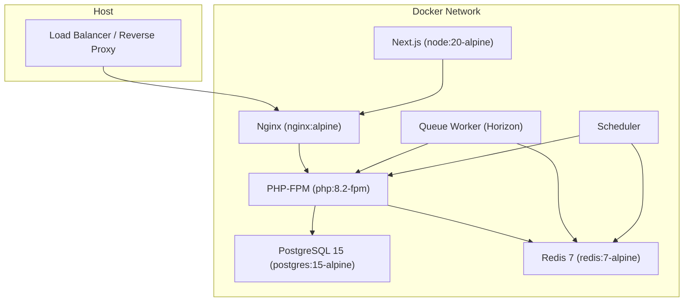
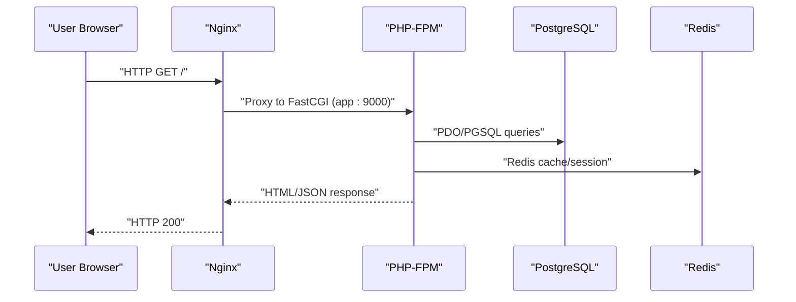
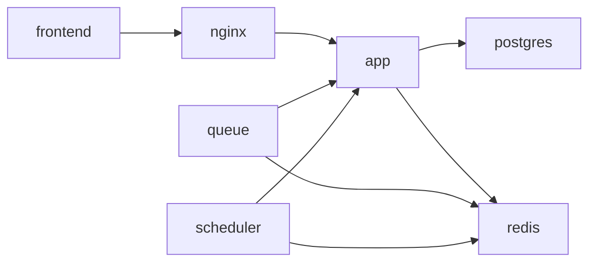

# Infrastructure Setup

<cite>
**Referenced Files in This Document**
- [docker-compose.yml](file://docker-compose.yml)
- [nginx/default.conf](file://docker/nginx/default.conf)
- [php/Dockerfile](file://docker/php/Dockerfile)
- [node/Dockerfile](file://docker/node/Dockerfile)
- [portal/config/database.php](file://portal/config/database.php)
- [portal/config/cache.php](file://portal/config/cache.php)
- [portal/.env.example](file://portal/.env.example)
- [portal/config/app.php](file://portal/config/app.php)
- [portal/config/services.php](file://portal/config/services.php)
- [portal/config/logging.php](file://portal/config/logging.php)
- [portal/composer.json](file://portal/composer.json)
- [portal/vite.config.js](file://portal/vite.config.js)
- [portal/frontend/package.json](file://portal/frontend/package.json)
</cite>

## Table of Contents
1. [Introduction](#introduction)
2. [Project Structure](#project-structure)
3. [Core Components](#core-components)
4. [Architecture Overview](#architecture-overview)
5. [Detailed Component Analysis](#detailed-component-analysis)
6. [Dependency Analysis](#dependency-analysis)
7. [Performance Considerations](#performance-considerations)
8. [Troubleshooting Guide](#troubleshooting-guide)
9. [Conclusion](#conclusion)
10. [Appendices](#appendices)

## Introduction
This document describes the infrastructure setup for the project, focusing on containerized deployment using Docker Compose. It covers hardware requirements, operating system prerequisites, networking, database and caching infrastructure, load balancing via Nginx, SSL/TLS certificate management, and security hardening practices. The guidance is derived from the repository’s containerization and configuration files.

## Project Structure
The infrastructure is orchestrated with Docker Compose and includes:
- Web server: Nginx
- Application: PHP-FPM (via custom PHP Dockerfile)
- Frontend: Node.js Next.js development server
- Database: PostgreSQL
- Caching: Redis
- Background workers: Laravel Horizon (queue) and scheduler
- Networks: Single bridge network for internal communication

**Diagram sources**
- [docker-compose.yml:1-109](file://docker-compose.yml#L1-L109)
- [nginx/default.conf:1-41](file://docker/nginx/default.conf#L1-L41)
- [php/Dockerfile:1-46](file://docker/php/Dockerfile#L1-L46)
- [node/Dockerfile:1-14](file://docker/node/Dockerfile#L1-L14)

**Section sources**
- [docker-compose.yml:1-109](file://docker-compose.yml#L1-L109)

## Core Components
- Application container (PHP-FPM): Built from a custom Dockerfile installing PHP 8.2, required extensions, and Composer. Runs under a non-root user.
- Web server (Nginx): Serves static assets and proxies PHP requests to the PHP-FPM container.
- Frontend (Node.js): Runs Next.js in development mode for local iteration.
- Database (PostgreSQL): Persistent relational store with named volume.
- Cache (Redis): In-memory store for sessions, queues, and caching.
- Queue and Scheduler: Dedicated containers running Laravel Horizon and a scheduled task loop.

Key runtime and configuration references:
- PHP extensions and Redis module are installed in the PHP container.
- Nginx configuration sets up PHP-FPM proxying and CORS for the frontend origin.
- Environment variables drive database, cache, and app behavior.

**Section sources**
- [docker/php/Dockerfile:1-46](file://docker/php/Dockerfile#L1-L46)
- [docker/nginx/default.conf:1-41](file://docker/nginx/default.conf#L1-L41)
- [docker-compose.yml:1-109](file://docker-compose.yml#L1-L109)
- [portal/config/database.php:87-100](file://portal/config/database.php#L87-L100)
- [portal/config/cache.php:75-79](file://portal/config/cache.php#L75-L79)
- [portal/.env.example:23-66](file://portal/.env.example#L23-L66)

## Architecture Overview
The system uses a single bridge network for internal service discovery. Exposed ports are mapped from containers to the host for Nginx (HTTP), PostgreSQL, Redis, and the frontend dev server. The PHP application communicates with PostgreSQL and Redis using service names as hostnames.

**Diagram sources**
- [nginx/default.conf:30-35](file://docker/nginx/default.conf#L30-L35)
- [docker-compose.yml:31-35](file://docker-compose.yml#L31-L35)
- [portal/config/database.php:87-100](file://portal/config/database.php#L87-L100)
- [portal/config/cache.php:75-79](file://portal/config/cache.php#L75-L79)

## Detailed Component Analysis

### Hardware Requirements
- Development (Local workstation):
  - CPU: Quad-core modern x86_64 or ARM64
  - Memory: 8–16 GB RAM
  - Storage: 50–100 GB available disk space
  - OS: macOS, Windows 10/11, or Linux (Docker Desktop recommended)
- Small Production (Single node):
  - CPU: 2 vCPUs minimum, 3–4 vCPUs recommended
  - Memory: 4–8 GB RAM
  - Storage: SSD-backed, 20–50 GB for OS + logs + DB + Redis
  - Network: 100 Mbps uplink
- Medium Production (Multiple replicas):
  - CPU: 4+ vCPUs per app node
  - Memory: 8+ GB RAM
  - Storage: SSD-backed, scalable volumes for DB and Redis
  - Network: 1 Gbps uplink
- Large Production (High scale):
  - CPU: 8+ vCPUs per app node
  - Memory: 16+ GB RAM
  - Storage: NVMe or cloud block storage with backups
  - Network: 10 Gbps uplink with load balancer

Notes:
- Container overhead adds ~0.5–1 CPU core and 1–2 GB RAM per service.
- PostgreSQL and Redis require dedicated resources proportional to workload concurrency and dataset size.

### Operating System Requirements
- Host OS: Linux kernel 5.4+ (recommended), or Docker Desktop on macOS/Windows
- Docker Engine: 20.10+ with Docker Compose v2 support
- Optional: systemd for process supervision outside containers

### System Dependencies
- Docker and Docker Compose
- Git (for cloning and updates)
- Node.js 20.x (for frontend dev)
- PHP 8.2+ (for local development outside containers)

**Section sources**
- [docker/php/Dockerfile:1-46](file://docker/php/Dockerfile#L1-L46)
- [docker/node/Dockerfile:1-14](file://docker/node/Dockerfile#L1-L14)
- [portal/composer.json:8-14](file://portal/composer.json#L8-L14)

### Network Configuration
- Published ports (host:container):
  - Nginx: 8080:80 (HTTP)
  - PostgreSQL: 5432:5432
  - Redis: 6379:6379
  - Frontend: 3000:3000
- Internal network:
  - Bridge network “epos-network” enables service-to-service communication by service name (e.g., app, postgres, redis)
- CORS:
  - Nginx adds CORS headers for http://localhost:3000 for local development

Port and CORS references:
- Published ports and volumes: [docker-compose.yml:18-26](file://docker-compose.yml#L18-L26)
- CORS headers: [nginx/default.conf:13-27](file://docker/nginx/default.conf#L13-L27)

**Section sources**
- [docker-compose.yml:18-26](file://docker-compose.yml#L18-L26)
- [nginx/default.conf:13-27](file://docker/nginx/default.conf#L13-L27)

### Database Infrastructure (PostgreSQL)
- Version: 15 Alpine
- Persistence: Named volume “postgres-data”
- Environment:
  - Database name, user, and password from environment variables
- Configuration:
  - Default connection uses environment variables for host, port, database, username, and password
  - Additional drivers (MySQL/MariaDB/SQLServer) are available but not used by default

Operational notes:
- Use environment variables to configure DB connection in production
- Backups should target the “postgres-data” volume or logical dumps

**Section sources**
- [docker-compose.yml:42-54](file://docker-compose.yml#L42-L54)
- [portal/config/database.php:87-100](file://portal/config/database.php#L87-L100)
- [portal/.env.example:23-28](file://portal/.env.example#L23-L28)

### Caching Infrastructure (Redis)
- Version: 7 Alpine
- Persistence: In-container “/data” mounted to named volume “redis-data”
- Configuration:
  - Default and cache connections configurable via environment variables
  - Redis client, host, port, database, and credentials are environment-driven
  - Locking and failover stores supported in cache configuration

Operational notes:
- For production, consider Redis Sentinel or Redis Cluster for HA
- Enable AOF/RDB persistence in Redis configuration for durability

**Section sources**
- [docker-compose.yml:56-64](file://docker-compose.yml#L56-L64)
- [portal/config/cache.php:75-79](file://portal/config/cache.php#L75-L79)
- [portal/config/database.php:146-182](file://portal/config/database.php#L146-L182)
- [portal/.env.example:45-49](file://portal/.env.example#L45-L49)

### Load Balancing with Nginx
- Nginx image: alpine
- Listens on 80 inside the container; mapped to host port 8080
- Proxies PHP requests to app:9000 (PHP-FPM)
- Serves static assets from the Laravel public directory
- Adds CORS headers for the frontend origin during development

Recommendations:
- Replace default.conf with a production-grade configuration for TLS termination, gzip, and timeouts
- Use upstream servers behind Nginx for horizontal scaling of PHP-FPM instances

**Section sources**
- [docker-compose.yml:15-26](file://docker-compose.yml#L15-L26)
- [nginx/default.conf:1-41](file://docker/nginx/default.conf#L1-L41)

### SSL/TLS Certificate Management
- Current setup: No TLS termination in the provided compose file
- Recommended approach:
  - Use a reverse proxy (e.g., Traefik, Caddy, or Nginx) with automatic ACME (Let’s Encrypt) provisioning
  - Mount ACME storage volume for certificate persistence
  - Redirect HTTP to HTTPS and enforce strong ciphers

[No sources needed since this section provides general guidance]

### Security Hardening
- Firewall and network:
  - Restrict inbound access to published ports (8080, 5432, 6379, 3000) to trusted CIDRs
  - Keep PostgreSQL and Redis bound to localhost inside containers; avoid publishing admin ports externally
- Secrets and environment:
  - Generate and store APP_KEY securely; rotate periodically
  - Use strong passwords for DB and Redis; store secrets in a secret manager
- Access control:
  - Limit administrative access to containers and hosts
  - Use role-based permissions for database users
- Intrusion detection:
  - Monitor application logs and database activity
  - Consider WAF and IDS/IPS at the perimeter

[No sources needed since this section provides general guidance]

## Dependency Analysis
Internal dependencies among services:
- app depends_on postgres and redis
- nginx depends_on app
- frontend depends_on nginx
- queue and scheduler depend_on app, postgres, redis

**Diagram sources**
- [docker-compose.yml:11-79](file://docker-compose.yml#L11-L79)

**Section sources**
- [docker-compose.yml:11-79](file://docker-compose.yml#L11-L79)

## Performance Considerations
- PHP-FPM:
  - Tune pm.* settings in php-fpm pool for concurrent requests
  - Enable OPcache and configure memory limits appropriately
- PostgreSQL:
  - Use connection pooling (e.g., PgBouncer) for high concurrency
  - Monitor WAL and vacuum settings
- Redis:
  - Enable AOF persistence and periodic snapshots
  - Size memory for hot keys and eviction policies
- Nginx:
  - Enable gzip/static caching and limit request sizes
- Queue:
  - Scale queue workers horizontally; monitor backlog and latency

[No sources needed since this section provides general guidance]

## Troubleshooting Guide
- Cannot connect to database:
  - Verify DB host/port/credentials in environment variables
  - Confirm service connectivity via “docker exec … ping postgres”
- Redis connection errors:
  - Check REDIS_HOST/PORT/PASSWORD in environment
  - Validate Redis volume and permissions
- PHP-FPM not responding:
  - Inspect Nginx proxy settings and PHP-FPM logs
  - Confirm PHP extensions installation and Composer autoload
- CORS issues:
  - Ensure Nginx CORS headers match the frontend origin
- Logs:
  - Review Laravel logs in storage/logs
  - Use logging configuration to forward to external systems

**Section sources**
- [portal/config/logging.php:53-130](file://portal/config/logging.php#L53-L130)
- [portal/config/database.php:87-100](file://portal/config/database.php#L87-L100)
- [portal/config/cache.php:75-79](file://portal/config/cache.php#L75-L79)
- [nginx/default.conf:13-27](file://docker/nginx/default.conf#L13-L27)

## Conclusion
The repository provides a solid containerized foundation for development and small-scale production. For larger deployments, add TLS termination, horizontal scaling, persistent backups, and centralized logging/monitoring. Apply strict security controls and operational rigor around secrets, network exposure, and access control.

## Appendices

### Port Summary
- Nginx: 8080:80
- PostgreSQL: 5432:5432
- Redis: 6379:6379
- Frontend Dev: 3000:3000

**Section sources**
- [docker-compose.yml:18-26](file://docker-compose.yml#L18-L26)

### Environment Variables Reference
- Application:
  - APP_ENV, APP_KEY, APP_DEBUG, APP_URL, TIMEZONE, LOCALE
- Database:
  - DB_CONNECTION, DB_HOST, DB_PORT, DB_DATABASE, DB_USERNAME, DB_PASSWORD
- Cache:
  - CACHE_STORE, REDIS_* (host, port, password, db)
- Mail:
  - MAIL_* (host, port, username, password)
- Frontend:
  - VITE_APP_NAME

**Section sources**
- [portal/.env.example:1-66](file://portal/.env.example#L1-L66)
- [portal/config/app.php:29-55](file://portal/config/app.php#L29-L55)
- [portal/config/database.php:87-100](file://portal/config/database.php#L87-L100)
- [portal/config/cache.php:75-79](file://portal/config/cache.php#L75-L79)
- [portal/config/services.php:17-36](file://portal/config/services.php#L17-L36)