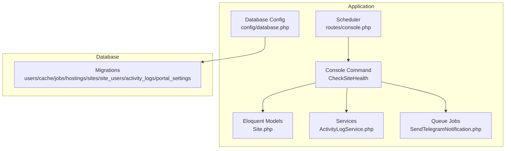
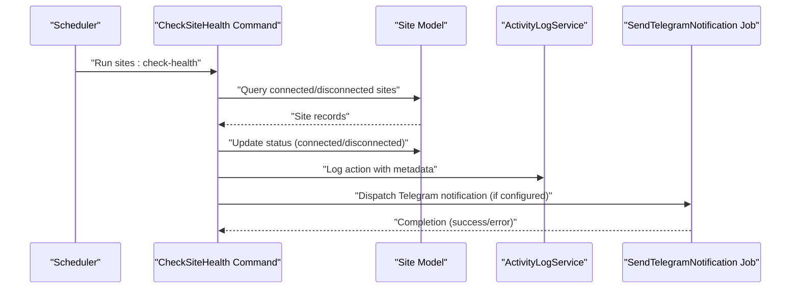
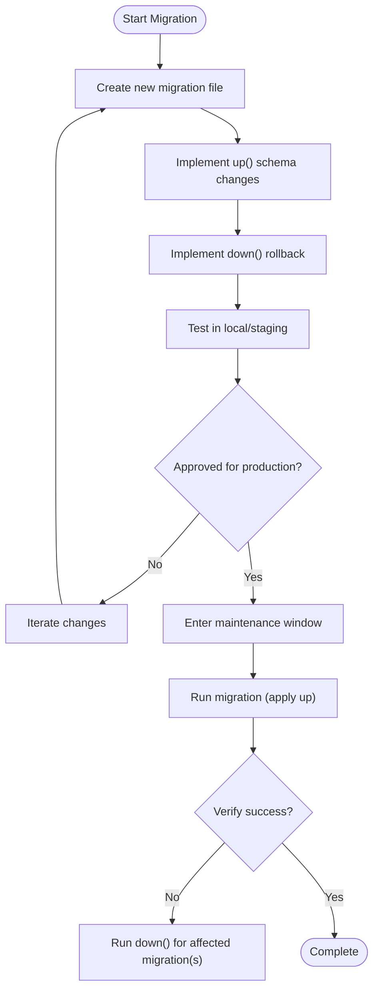
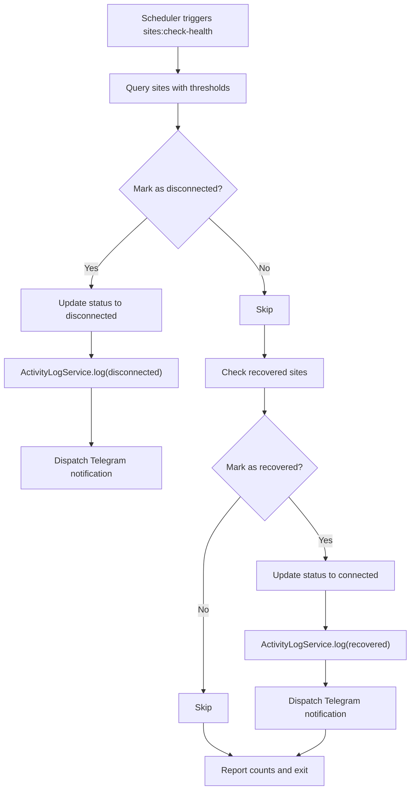
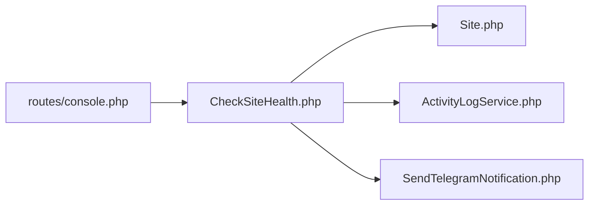

# Maintenance Procedures

<cite>
**Referenced Files in This Document**
- [0001_01_01_000000_create_users_table.php](file://portal/database/migrations/0001_01_01_000000_create_users_table.php)
- [0001_01_01_000001_create_cache_table.php](file://portal/database/migrations/0001_01_01_000001_create_cache_table.php)
- [0001_01_01_000002_create_jobs_table.php](file://portal/database/migrations/0001_01_01_000002_create_jobs_table.php)
- [2026_05_15_070001_create_hostings_table.php](file://portal/database/migrations/2026_05_15_070001_create_hostings_table.php)
- [2026_05_15_070002_create_sites_table.php](file://portal/database/migrations/2026_05_15_070002_create_sites_table.php)
- [2026_05_15_070003_create_site_users_table.php](file://portal/database/migrations/2026_05_15_070003_create_site_users_table.php)
- [2026_05_15_070004_create_activity_logs_table.php](file://portal/database/migrations/2026_05_15_070004_create_activity_logs_table.php)
- [2026_05_15_070005_create_portal_settings_table.php](file://portal/database/migrations/2026_05_15_070005_create_portal_settings_table.php)
- [CheckSiteHealth.php](file://portal/app/Console/Commands/CheckSiteHealth.php)
- [database.php](file://portal/config/database.php)
- [console.php](file://portal/routes/console.php)
- [composer.json](file://portal/composer.json)
- [Site.php](file://portal/app/Models/Site.php)
- [ActivityLogService.php](file://portal/app/Services/ActivityLogService.php)
- [SendTelegramNotification.php](file://portal/app/Jobs/SendTelegramNotification.php)
</cite>

## Table of Contents
1. [Introduction](#introduction)
2. [Project Structure](#project-structure)
3. [Core Components](#core-components)
4. [Architecture Overview](#architecture-overview)
5. [Detailed Component Analysis](#detailed-component-analysis)
6. [Dependency Analysis](#dependency-analysis)
7. [Performance Considerations](#performance-considerations)
8. [Troubleshooting Guide](#troubleshooting-guide)
9. [Conclusion](#conclusion)
10. [Appendices](#appendices)

## Introduction
This document defines comprehensive maintenance procedures for the platform, covering database migrations, application updates, backups, security patching, performance optimization, system health checks, disaster recovery, and maintenance windows. It consolidates operational guidance grounded in the repository’s configuration, migrations, scheduled tasks, and runtime services.

## Project Structure
The maintenance-relevant parts of the repository are organized around:
- Database schema definitions under migrations
- Application configuration for database and queues
- Scheduled console commands for health monitoring
- Models and services that support logging and notifications
- Composer scripts for setup and development lifecycle

**Diagram sources**
- [CheckSiteHealth.php:1-95](file://portal/app/Console/Commands/CheckSiteHealth.php#L1-L95)
- [console.php:1-12](file://portal/routes/console.php#L1-L12)
- [database.php:1-185](file://portal/config/database.php#L1-L185)
- [Site.php:1-86](file://portal/app/Models/Site.php#L1-L86)
- [ActivityLogService.php:1-50](file://portal/app/Services/ActivityLogService.php#L1-L50)
- [SendTelegramNotification.php:1-62](file://portal/app/Jobs/SendTelegramNotification.php#L1-L62)
- [0001_01_01_000000_create_users_table.php:1-53](file://portal/database/migrations/0001_01_01_000000_create_users_table.php#L1-L53)
- [0001_01_01_000001_create_cache_table.php:1-36](file://portal/database/migrations/0001_01_01_000001_create_cache_table.php#L1-L36)
- [0001_01_01_000002_create_jobs_table.php:1-58](file://portal/database/migrations/0001_01_01_000002_create_jobs_table.php#L1-L58)
- [2026_05_15_070001_create_hostings_table.php:1-27](file://portal/database/migrations/2026_05_15_070001_create_hostings_table.php#L1-L27)
- [2026_05_15_070002_create_sites_table.php:1-35](file://portal/database/migrations/2026_05_15_070002_create_sites_table.php#L1-L35)
- [2026_05_15_070003_create_site_users_table.php:1-25](file://portal/database/migrations/2026_05_15_070003_create_site_users_table.php#L1-L25)
- [2026_05_15_070004_create_activity_logs_table.php:1-32](file://portal/database/migrations/2026_05_15_070004_create_activity_logs_table.php#L1-L32)
- [2026_05_15_070005_create_portal_settings_table.php:1-24](file://portal/database/migrations/2026_05_15_070005_create_portal_settings_table.php#L1-L24)

**Section sources**
- [database.php:1-185](file://portal/config/database.php#L1-L185)
- [console.php:1-12](file://portal/routes/console.php#L1-L12)

## Core Components
- Database migrations define the schema for users, cache, jobs, hostings, sites, site-users relationships, activity logs, and portal settings.
- The health-check command monitors site connectivity and emits notifications via queued jobs.
- Configuration supports multiple database drivers and Redis-backed caches and queues.
- Composer scripts automate setup and asset publishing.

Key maintenance-relevant components:
- Migrations: [0001_01_01_000000_create_users_table.php:1-53](file://portal/database/migrations/0001_01_01_000000_create_users_table.php#L1-L53), [0001_01_01_000001_create_cache_table.php:1-36](file://portal/database/migrations/0001_01_01_000001_create_cache_table.php#L1-L36), [0001_01_01_000002_create_jobs_table.php:1-58](file://portal/database/migrations/0001_01_01_000002_create_jobs_table.php#L1-L58), [2026_05_15_070001_create_hostings_table.php:1-27](file://portal/database/migrations/2026_05_15_070001_create_hostings_table.php#L1-L27), [2026_05_15_070002_create_sites_table.php:1-35](file://portal/database/migrations/2026_05_15_070002_create_sites_table.php#L1-L35), [2026_05_15_070003_create_site_users_table.php:1-25](file://portal/database/migrations/2026_05_15_070003_create_site_users_table.php#L1-L25), [2026_05_15_070004_create_activity_logs_table.php:1-32](file://portal/database/migrations/2026_05_15_070004_create_activity_logs_table.php#L1-L32), [2026_05_15_070005_create_portal_settings_table.php:1-24](file://portal/database/migrations/2026_05_15_070005_create_portal_settings_table.php#L1-L24)
- Health check command: [CheckSiteHealth.php:1-95](file://portal/app/Console/Commands/CheckSiteHealth.php#L1-L95)
- Database config: [database.php:1-185](file://portal/config/database.php#L1-L185)
- Scheduler: [console.php:1-12](file://portal/routes/console.php#L1-L12)
- Composer scripts: [composer.json:1-90](file://portal/composer.json#L1-L90)

**Section sources**
- [0001_01_01_000000_create_users_table.php:1-53](file://portal/database/migrations/0001_01_01_000000_create_users_table.php#L1-L53)
- [CheckSiteHealth.php:1-95](file://portal/app/Console/Commands/CheckSiteHealth.php#L1-L95)
- [database.php:1-185](file://portal/config/database.php#L1-L185)
- [composer.json:1-90](file://portal/composer.json#L1-L90)

## Architecture Overview
The maintenance architecture integrates scheduled health checks, model-driven site state transitions, activity logging, and asynchronous notifications.

**Diagram sources**
- [console.php:11-11](file://portal/routes/console.php#L11-L11)
- [CheckSiteHealth.php:16-73](file://portal/app/Console/Commands/CheckSiteHealth.php#L16-L73)
- [Site.php:12-86](file://portal/app/Models/Site.php#L12-L86)
- [ActivityLogService.php:16-48](file://portal/app/Services/ActivityLogService.php#L16-L48)
- [SendTelegramNotification.php:25-60](file://portal/app/Jobs/SendTelegramNotification.php#L25-L60)

## Detailed Component Analysis

### Database Migration Procedures
- Purpose: Define and evolve schema safely across environments using Laravel migrations.
- Execution: Apply pending migrations to synchronize schema with code.
- Rollback: Down methods revert schema changes per migration file.
- Data migrations: Not present in current migrations; use dedicated migration files for data-only changes.

Recommended process:
1. Plan schema change in a new migration file.
2. Add up/down methods to alter schema and reverse changes.
3. Test locally with a fresh database.
4. Schedule maintenance window; apply migrations in staging first.
5. Promote to production during a planned window; monitor for errors.
6. If issues occur, roll back using the down method for the affected migration(s).

**Diagram sources**
- [0001_01_01_000000_create_users_table.php:12-51](file://portal/database/migrations/0001_01_01_000000_create_users_table.php#L12-L51)
- [0001_01_01_000001_create_cache_table.php:12-34](file://portal/database/migrations/0001_01_01_000001_create_cache_table.php#L12-L34)
- [0001_01_01_000002_create_jobs_table.php:12-55](file://portal/database/migrations/0001_01_01_000002_create_jobs_table.php#L12-L55)
- [2026_05_15_070001_create_hostings_table.php:9-25](file://portal/database/migrations/2026_05_15_070001_create_hostings_table.php#L9-L25)
- [2026_05_15_070002_create_sites_table.php:9-33](file://portal/database/migrations/2026_05_15_070002_create_sites_table.php#L9-L33)
- [2026_05_15_070003_create_site_users_table.php:9-23](file://portal/database/migrations/2026_05_15_070003_create_site_users_table.php#L9-L23)
- [2026_05_15_070004_create_activity_logs_table.php:9-29](file://portal/database/migrations/2026_05_15_070004_create_activity_logs_table.php#L9-L29)
- [2026_05_15_070005_create_portal_settings_table.php:9-22](file://portal/database/migrations/2026_05_15_070005_create_portal_settings_table.php#L9-L22)

**Section sources**
- [0001_01_01_000000_create_users_table.php:12-51](file://portal/database/migrations/0001_01_01_000000_create_users_table.php#L12-L51)
- [0001_01_01_000001_create_cache_table.php:12-34](file://portal/database/migrations/0001_01_01_000001_create_cache_table.php#L12-L34)
- [0001_01_01_000002_create_jobs_table.php:12-55](file://portal/database/migrations/0001_01_01_000002_create_jobs_table.php#L12-L55)
- [2026_05_15_070001_create_hostings_table.php:9-25](file://portal/database/migrations/2026_05_15_070001_create_hostings_table.php#L9-L25)
- [2026_05_15_070002_create_sites_table.php:9-33](file://portal/database/migrations/2026_05_15_070002_create_sites_table.php#L9-L33)
- [2026_05_15_070003_create_site_users_table.php:9-23](file://portal/database/migrations/2026_05_15_070003_create_site_users_table.php#L9-L23)
- [2026_05_15_070004_create_activity_logs_table.php:9-29](file://portal/database/migrations/2026_05_15_070004_create_activity_logs_table.php#L9-L29)
- [2026_05_15_070005_create_portal_settings_table.php:9-22](file://portal/database/migrations/2026_05_15_070005_create_portal_settings_table.php#L9-L22)

### Application Update Procedures
- Dependency updates: Use Composer to update PHP dependencies and publish assets after updates.
- Code deployment: Commit changes, run Composer install, apply migrations, rebuild assets, and restart services if necessary.
- Rollback protocols: Revert to the previous release, re-run migrations if needed, restore configuration and environment variables.

Recommended process:
1. Prepare maintenance window; notify stakeholders.
2. Backup database and application files.
3. Pull latest code; update dependencies.
4. Clear caches and compile assets.
5. Run migrations; verify functionality.
6. Deploy artifacts; restart services if required.
7. Monitor logs and health checks.
8. If issues arise, rollback to the prior known-good release and re-verify.

**Section sources**
- [composer.json:37-71](file://portal/composer.json#L37-L71)

### Backup Procedures
- Database backups: Back up the configured database (SQLite/MariaDB/MySQL/PostgreSQL/SQLServer) using native tools appropriate to the driver. Schedule regular snapshots outside peak hours.
- File system backups: Archive application root, storage directories, and configuration files.
- Automated scheduling: Use OS-level cron/systemd timers to schedule periodic backups and retention policies.

Note: The repository does not include automated backup scripts. Implement external backup automation aligned with your infrastructure.

**Section sources**
- [database.php:20-117](file://portal/config/database.php#L20-L117)

### Security Patching Procedures
- Vulnerability assessment: Scan dependencies using Composer and static analysis tools; review security advisories.
- Patch application: Update dependencies, rebuild assets, and re-run tests.
- Verification: Validate authentication, authorization, and API endpoints; confirm no regressions.

**Section sources**
- [composer.json:8-24](file://portal/composer.json#L8-L24)

### Performance Optimization Procedures
- Database tuning: Adjust connection settings and charset/collation per driver; ensure proper indexing on frequently queried columns.
- Caching optimization: Configure Redis client, prefixes, and database-specific cache instances; monitor hit rates.
- Resource allocation: Scale queues and workers; tune queue retry/backoff; ensure adequate memory and CPU for the application and database.

**Section sources**
- [database.php:146-182](file://portal/config/database.php#L146-L182)

### System Health Checks
- Automated monitoring: The scheduler runs the health-check command periodically to detect disconnected/recovered sites and update statuses accordingly.
- Manual verification: Inspect logs, queue worker status, and Redis connectivity.
- Preventive maintenance: Regularly review thresholds, clean old jobs and cache entries, and rotate logs.

**Diagram sources**
- [console.php:11-11](file://portal/routes/console.php#L11-L11)
- [CheckSiteHealth.php:16-73](file://portal/app/Console/Commands/CheckSiteHealth.php#L16-L73)
- [Site.php:12-86](file://portal/app/Models/Site.php#L12-L86)
- [ActivityLogService.php:16-48](file://portal/app/Services/ActivityLogService.php#L16-L48)
- [SendTelegramNotification.php:25-60](file://portal/app/Jobs/SendTelegramNotification.php#L25-L60)

**Section sources**
- [console.php:11-11](file://portal/routes/console.php#L11-L11)
- [CheckSiteHealth.php:16-73](file://portal/app/Console/Commands/CheckSiteHealth.php#L16-L73)

### Disaster Recovery Procedures
- Backup restoration: Restore database and file system from the most recent successful backups; verify integrity.
- System recovery: Recreate environment, restore configuration, deploy code, run migrations, and restart services.
- Business continuity: Maintain offsite backups, document RTO/RPO targets, and conduct periodic DR tests.

Note: The repository does not include DR playbooks. Integrate with your backup and orchestration systems.

**Section sources**
- [database.php:20-117](file://portal/config/database.php#L20-L117)

### Maintenance Window Scheduling and Impact Mitigation
- Scheduling: Choose low-traffic periods; communicate with stakeholders; gate deployments behind feature flags if applicable.
- Impact mitigation: Use blue/green or canary deployments; enable read-only mode if needed; prepare rollback plans; monitor metrics and logs post-change.

[No sources needed since this section provides general guidance]

## Dependency Analysis
The health-check command depends on the Site model, activity logging service, and queued Telegram notifications. The scheduler invokes the command at fixed intervals.

**Diagram sources**
- [console.php:11-11](file://portal/routes/console.php#L11-L11)
- [CheckSiteHealth.php:16-73](file://portal/app/Console/Commands/CheckSiteHealth.php#L16-L73)
- [Site.php:12-86](file://portal/app/Models/Site.php#L12-L86)
- [ActivityLogService.php:16-48](file://portal/app/Services/ActivityLogService.php#L16-L48)
- [SendTelegramNotification.php:25-60](file://portal/app/Jobs/SendTelegramNotification.php#L25-L60)

**Section sources**
- [console.php:11-11](file://portal/routes/console.php#L11-L11)
- [CheckSiteHealth.php:16-73](file://portal/app/Console/Commands/CheckSiteHealth.php#L16-L73)

## Performance Considerations
- Database: Tune charset/collation, indexes, and connection pooling per driver.
- Caching: Use Redis for cache and queues; configure client options and prefixes.
- Queues: Increase concurrency, set retry limits, and monitor failed job tables.

**Section sources**
- [database.php:146-182](file://portal/config/database.php#L146-L182)

## Troubleshooting Guide
- Health check failures: Confirm scheduler is running, verify configuration keys for Telegram, and inspect queue worker status.
- Database connectivity: Validate environment variables and connection settings.
- Logging: Review application logs and failed job records.

**Section sources**
- [CheckSiteHealth.php:75-93](file://portal/app/Console/Commands/CheckSiteHealth.php#L75-L93)
- [SendTelegramNotification.php:25-60](file://portal/app/Jobs/SendTelegramNotification.php#L25-L60)
- [database.php:20-117](file://portal/config/database.php#L20-L117)

## Conclusion
These procedures provide a structured approach to maintaining the platform reliably. By following documented migration, update, backup, security, performance, and recovery practices—combined with automated health checks—you can minimize downtime and risk while ensuring continuous service availability.

## Appendices
- Appendix A: Migration checklist
  - Create migration file
  - Implement up/down methods
  - Test in staging
  - Apply in production during maintenance window
  - Verify and monitor
- Appendix B: Update checklist
  - Backup database and files
  - Update dependencies
  - Run migrations
  - Rebuild assets
  - Deploy and verify
- Appendix C: Backup checklist
  - Identify backup targets (database, storage, configs)
  - Schedule automated backups
  - Validate restore procedure
- Appendix D: Security checklist
  - Scan dependencies
  - Apply patches
  - Regression test
- Appendix E: Performance checklist
  - Review indexes and queries
  - Tune Redis and queues
  - Monitor metrics
- Appendix F: DR checklist
  - Document RTO/RPO
  - Store offsite backups
  - Practice recovery drills

[No sources needed since this section provides general guidance]