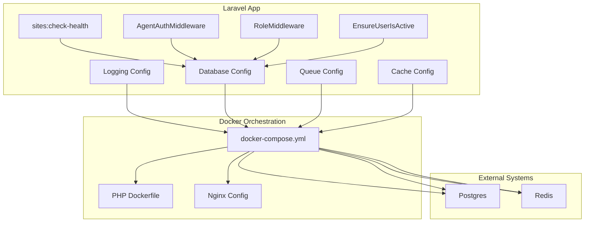
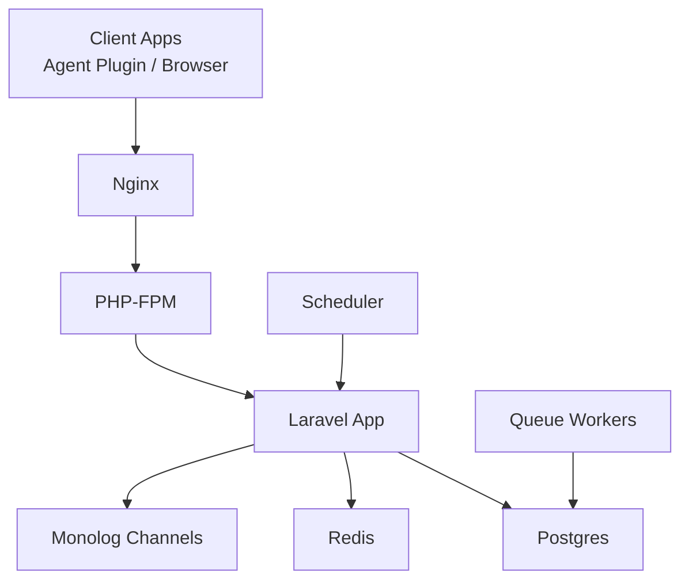
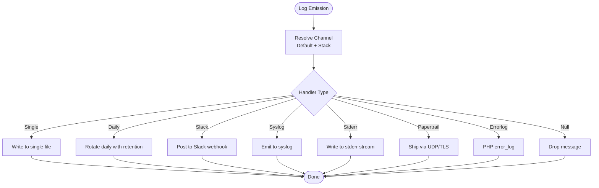
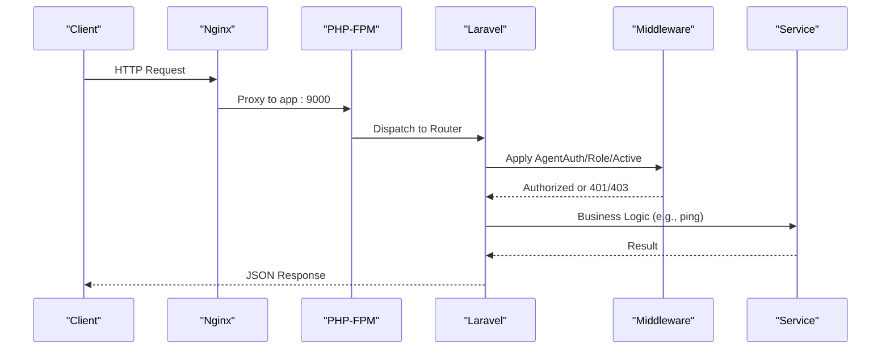
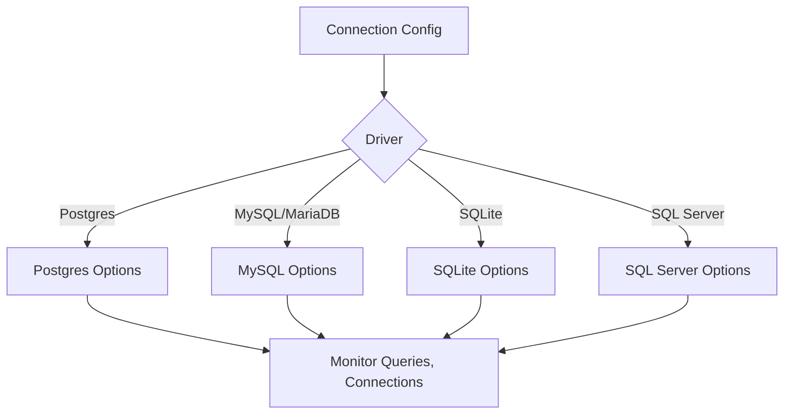
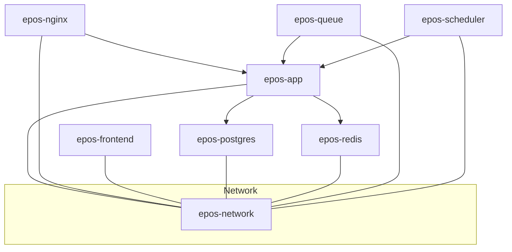
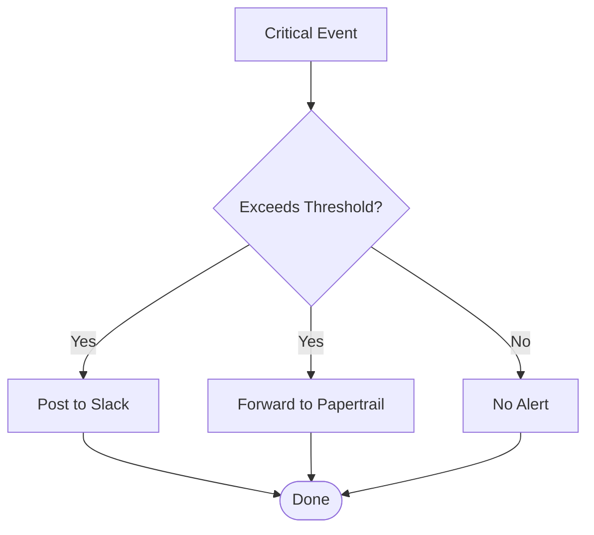
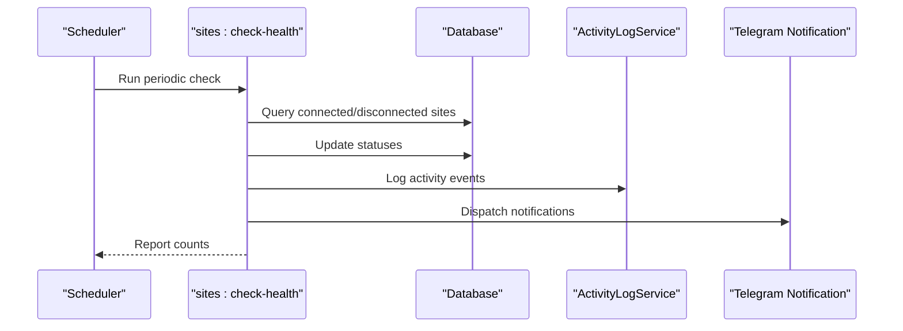
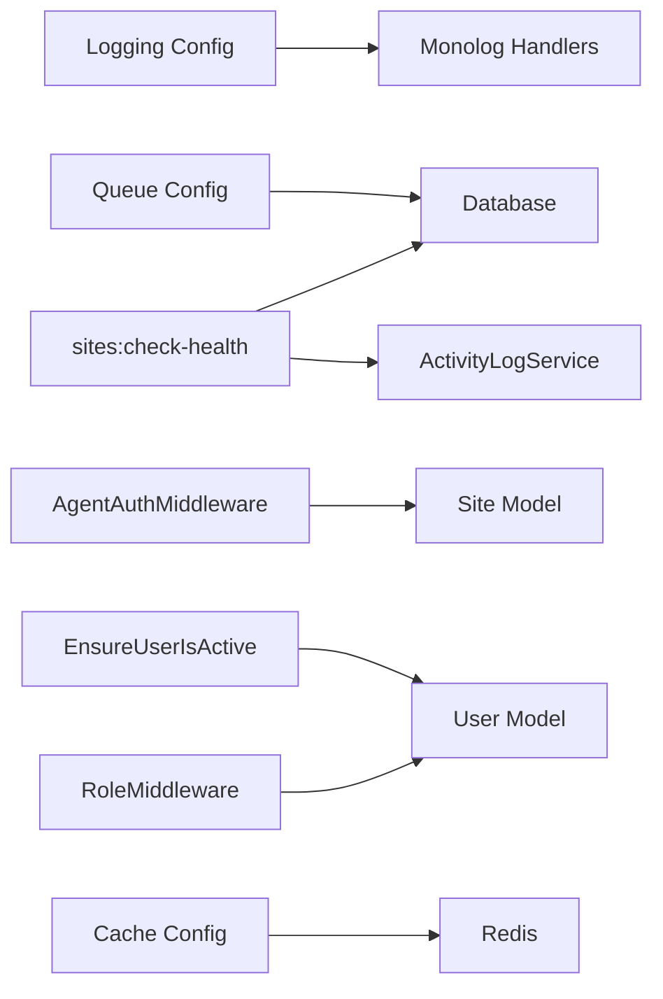

# Monitoring & Logging

<cite>
**Referenced Files in This Document**
- [logging.php](file://portal/config/logging.php)
- [app.php](file://portal/config/app.php)
- [database.php](file://portal/config/database.php)
- [cache.php](file://portal/config/cache.php)
- [queue.php](file://portal/config/queue.php)
- [docker-compose.yml](file://docker-compose.yml)
- [Dockerfile (php)](file://docker/php/Dockerfile)
- [Nginx config](file://docker/nginx/default.conf)
- [CheckSiteHealth.php](file://portal/app/Console/Commands/CheckSiteHealth.php)
- [ActivityLogService.php](file://portal/app/Services/ActivityLogService.php)
- [ActivityLog.php](file://portal/app/Models/ActivityLog.php)
- [AgentAuthMiddleware.php](file://portal/app/Http/Middleware/AgentAuthMiddleware.php)
- [EnsureUserIsActive.php](file://portal/app/Http/Middleware/EnsureUserIsActive.php)
- [RoleMiddleware.php](file://portal/app/Http/Middleware/RoleMiddleware.php)
- [app bootstrap](file://portal/bootstrap/app.php)
- [API routes](file://portal/routes/api.php)
- [Agent routes](file://portal/routes/agent.php)
</cite>

## Table of Contents
1. [Introduction](#introduction)
2. [Project Structure](#project-structure)
3. [Core Components](#core-components)
4. [Architecture Overview](#architecture-overview)
5. [Detailed Component Analysis](#detailed-component-analysis)
6. [Dependency Analysis](#dependency-analysis)
7. [Performance Considerations](#performance-considerations)
8. [Troubleshooting Guide](#troubleshooting-guide)
9. [Conclusion](#conclusion)
10. [Appendices](#appendices)

## Introduction
This document provides comprehensive monitoring and logging guidance for the Laravel-based portal and supporting infrastructure. It covers application logging configuration, Laravel monitoring practices, database monitoring, container metrics, system-level monitoring, alerting strategies, log aggregation, health checks, and troubleshooting workflows grounded in the repository’s configuration and code.

## Project Structure
The monitoring and logging ecosystem spans:
- Laravel application configuration for logging, queues, cache, and database
- Docker Compose orchestration for app, Nginx, Postgres, Redis, and workers
- Middleware and console commands enabling health checks and agent authentication
- Frontend rewrite configuration for API routing

**Diagram sources**
- [docker-compose.yml:1-109](file://docker-compose.yml#L1-L109)
- [Dockerfile (php):1-46](file://docker/php/Dockerfile#L1-L46)
- [Nginx config:1-41](file://docker/nginx/default.conf#L1-L41)
- [logging.php:1-133](file://portal/config/logging.php#L1-L133)
- [database.php:1-185](file://portal/config/database.php#L1-L185)
- [queue.php:1-130](file://portal/config/queue.php#L1-L130)
- [cache.php:1-118](file://portal/config/cache.php#L1-L118)
- [CheckSiteHealth.php:1-95](file://portal/app/Console/Commands/CheckSiteHealth.php#L1-L95)
- [AgentAuthMiddleware.php:1-57](file://portal/app/Http/Middleware/AgentAuthMiddleware.php#L1-L57)
- [RoleMiddleware.php:1-37](file://portal/app/Http/Middleware/RoleMiddleware.php#L1-L37)
- [EnsureUserIsActive.php:1-26](file://portal/app/Http/Middleware/EnsureUserIsActive.php#L1-L26)

**Section sources**
- [docker-compose.yml:1-109](file://docker-compose.yml#L1-L109)
- [logging.php:1-133](file://portal/config/logging.php#L1-L133)
- [database.php:1-185](file://portal/config/database.php#L1-L185)
- [queue.php:1-130](file://portal/config/queue.php#L1-L130)
- [cache.php:1-118](file://portal/config/cache.php#L1-L118)
- [CheckSiteHealth.php:1-95](file://portal/app/Console/Commands/CheckSiteHealth.php#L1-L95)
- [AgentAuthMiddleware.php:1-57](file://portal/app/Http/Middleware/AgentAuthMiddleware.php#L1-L57)
- [RoleMiddleware.php:1-37](file://portal/app/Http/Middleware/RoleMiddleware.php#L1-L37)
- [EnsureUserIsActive.php:1-26](file://portal/app/Http/Middleware/EnsureUserIsActive.php#L1-L26)
- [Nginx config:1-41](file://docker/nginx/default.conf#L1-L41)
- [Dockerfile (php):1-46](file://docker/php/Dockerfile#L1-L46)

## Core Components
- Application logging: Centralized via Monolog-backed channels with daily rotation, Slack, syslog, stderr, and Papertrail support.
- Health monitoring: A scheduled console command evaluates site connectivity and emits notifications and activity logs.
- Authentication and authorization: Agent traffic is authenticated via a dedicated middleware; API access is gated by role and active-user checks.
- Containerization: PHP-FPM, Nginx, Postgres, Redis orchestrated with persistent volumes and restart policies.
- Queue and cache: Database-backed queue with configurable retry and lock behavior; Redis and database cache stores.

**Section sources**
- [logging.php:53-130](file://portal/config/logging.php#L53-L130)
- [CheckSiteHealth.php:11-73](file://portal/app/Console/Commands/CheckSiteHealth.php#L11-L73)
- [ActivityLogService.php:11-48](file://portal/app/Services/ActivityLogService.php#L11-L48)
- [AgentAuthMiddleware.php:10-55](file://portal/app/Http/Middleware/AgentAuthMiddleware.php#L10-L55)
- [RoleMiddleware.php:9-35](file://portal/app/Http/Middleware/RoleMiddleware.php#L9-L35)
- [EnsureUserIsActive.php:9-23](file://portal/app/Http/Middleware/EnsureUserIsActive.php#L9-L23)
- [docker-compose.yml:1-109](file://docker-compose.yml#L1-L109)
- [queue.php:32-92](file://portal/config/queue.php#L32-L92)
- [cache.php:35-102](file://portal/config/cache.php#L35-L102)

## Architecture Overview
The monitoring architecture integrates application-level logging, scheduled health checks, middleware-driven access control, and containerized infrastructure with external systems (Postgres and Redis).

**Diagram sources**
- [Nginx config:1-41](file://docker/nginx/default.conf#L1-L41)
- [Dockerfile (php):1-46](file://docker/php/Dockerfile#L1-L46)
- [docker-compose.yml:1-109](file://docker-compose.yml#L1-L109)
- [database.php:33-117](file://portal/config/database.php#L33-L117)
- [queue.php:32-92](file://portal/config/queue.php#L32-L92)
- [logging.php:53-130](file://portal/config/logging.php#L53-L130)

## Detailed Component Analysis

### Application Logging Configuration
- Default channel selection and deprecation logging are configurable via environment variables.
- Channels include stack, single, daily (with retention days), slack, syslog, stderr, papertrail, errorlog, and null.
- Daily rotation is enabled with a default retention window; level defaults to debug unless overridden.
- Slack and Papertrail channels are available for external alerting and log shipping.

**Diagram sources**
- [logging.php:53-130](file://portal/config/logging.php#L53-L130)

**Section sources**
- [logging.php:21-21](file://portal/config/logging.php#L21-L21)
- [logging.php:34-37](file://portal/config/logging.php#L34-L37)
- [logging.php:53-130](file://portal/config/logging.php#L53-L130)

### Laravel Application Monitoring
- Request/response tracking: The application exposes a health endpoint and routes for authentication, agent handshakes, and pings. Middleware enforces role and active-user constraints for protected routes.
- Error reporting: Validation exceptions are normalized for JSON responses; general exceptions are handled by the framework bootstrap.
- Activity logging: A service writes structured activity logs to a database table when available, otherwise falls back to application logs.

**Diagram sources**
- [app bootstrap:10-38](file://portal/bootstrap/app.php#L10-L38)
- [API routes:1-52](file://portal/routes/api.php#L1-L52)
- [Agent routes:16-19](file://portal/routes/agent.php#L16-L19)
- [AgentAuthMiddleware.php:20-55](file://portal/app/Http/Middleware/AgentAuthMiddleware.php#L20-L55)
- [RoleMiddleware.php:15-35](file://portal/app/Http/Middleware/RoleMiddleware.php#L15-L35)
- [EnsureUserIsActive.php:11-23](file://portal/app/Http/Middleware/EnsureUserIsActive.php#L11-L23)

**Section sources**
- [app bootstrap:15-15](file://portal/bootstrap/app.php#L15-L15)
- [API routes:13-30](file://portal/routes/api.php#L13-L30)
- [Agent routes:16-19](file://portal/routes/agent.php#L16-L19)
- [AgentAuthMiddleware.php:20-55](file://portal/app/Http/Middleware/AgentAuthMiddleware.php#L20-L55)
- [RoleMiddleware.php:15-35](file://portal/app/Http/Middleware/RoleMiddleware.php#L15-L35)
- [EnsureUserIsActive.php:11-23](file://portal/app/Http/Middleware/EnsureUserIsActive.php#L11-L23)

### Database Monitoring
- Connection configuration supports SQLite, MySQL/MariaDB, PostgreSQL, and SQL Server drivers with SSL options and charset/collation settings.
- Redis configuration includes client selection, clustering, prefixes, persistence toggles, and retry/backoff parameters.
- Recommended monitoring practices:
  - Track slow queries and query execution plans in Postgres.
  - Monitor connection pool saturation and max retries in Redis.
  - Verify migration status and table existence for cache and queue tables.
  - Confirm SSL/TLS settings for remote databases.

**Diagram sources**
- [database.php:33-117](file://portal/config/database.php#L33-L117)
- [cache.php:75-79](file://portal/config/cache.php#L75-L79)
- [queue.php:67-74](file://portal/config/queue.php#L67-L74)

**Section sources**
- [database.php:20-117](file://portal/config/database.php#L20-L117)
- [cache.php:75-79](file://portal/config/cache.php#L75-L79)
- [queue.php:67-74](file://portal/config/queue.php#L67-L74)

### Container Monitoring
- Containers: app, nginx, frontend, postgres, redis, queue, scheduler.
- Volumes: persistent storage for Postgres and Redis data.
- Restart policy: queue and scheduler containers use a restart policy to ensure resilience.
- Resource utilization: monitor CPU, memory, and disk usage per container using platform-native metrics.

**Diagram sources**
- [docker-compose.yml:1-109](file://docker-compose.yml#L1-L109)

**Section sources**
- [docker-compose.yml:6-109](file://docker-compose.yml#L6-L109)
- [Dockerfile (php):1-46](file://docker/php/Dockerfile#L1-L46)
- [Nginx config:1-41](file://docker/nginx/default.conf#L1-L41)

### System Monitoring
- CPU, memory, disk, and network usage can be tracked via container runtime metrics and host-level collectors.
- Correlate Nginx access logs with application logs to identify latency spikes and error rates.
- Monitor Postgres and Redis health endpoints and metrics exposed by their images.

[No sources needed since this section provides general guidance]

### Alerting Configuration
- Slack channel: Configure webhook URL and level threshold to receive critical alerts.
- Papertrail: Enable TLS-based forwarding for centralized log ingestion.
- Telegram notifications: The health check command dispatches notifications when chat ID and token are configured.

**Diagram sources**
- [logging.php:76-83](file://portal/config/logging.php#L76-L83)
- [logging.php:85-95](file://portal/config/logging.php#L85-L95)
- [CheckSiteHealth.php:81-93](file://portal/app/Console/Commands/CheckSiteHealth.php#L81-L93)

**Section sources**
- [logging.php:76-95](file://portal/config/logging.php#L76-L95)
- [CheckSiteHealth.php:81-93](file://portal/app/Console/Commands/CheckSiteHealth.php#L81-L93)

### Log Aggregation and Analysis
- Available handlers include syslog, stderr, and Papertrail for external log aggregation.
- Recommended approach: Ship logs to a centralized system (e.g., ELK stack or similar) using syslog or UDP/TLS transport.
- Use daily rotation with retention to manage local log sizes.

**Section sources**
- [logging.php:108-119](file://portal/config/logging.php#L108-L119)
- [logging.php:85-95](file://portal/config/logging.php#L85-L95)
- [logging.php:68-74](file://portal/config/logging.php#L68-L74)

### Health Checks and Automated Diagnostics
- Health endpoint: The application registers a health check route for uptime verification.
- Scheduled diagnostics: A console command periodically evaluates site connectivity, updates statuses, records activity logs, and sends notifications.

**Diagram sources**
- [app bootstrap:15-15](file://portal/bootstrap/app.php#L15-L15)
- [CheckSiteHealth.php:16-73](file://portal/app/Console/Commands/CheckSiteHealth.php#L16-L73)
- [ActivityLogService.php:16-48](file://portal/app/Services/ActivityLogService.php#L16-L48)

**Section sources**
- [app bootstrap:15-15](file://portal/bootstrap/app.php#L15-L15)
- [CheckSiteHealth.php:13-73](file://portal/app/Console/Commands/CheckSiteHealth.php#L13-L73)
- [ActivityLogService.php:16-48](file://portal/app/Services/ActivityLogService.php#L16-L48)

## Dependency Analysis
- Logging depends on Monolog handlers and processors; channel composition enables layered outputs.
- Health checks depend on database connectivity and Redis availability for queue operations.
- Agent authentication depends on Site model and stored hashed keys.
- Middleware dependencies: AgentAuthMiddleware, RoleMiddleware, EnsureUserIsActive enforce access policies.

**Diagram sources**
- [logging.php:53-130](file://portal/config/logging.php#L53-L130)
- [CheckSiteHealth.php:1-95](file://portal/app/Console/Commands/CheckSiteHealth.php#L1-L95)
- [ActivityLogService.php:1-50](file://portal/app/Services/ActivityLogService.php#L1-L50)
- [AgentAuthMiddleware.php:1-57](file://portal/app/Http/Middleware/AgentAuthMiddleware.php#L1-L57)
- [RoleMiddleware.php:1-37](file://portal/app/Http/Middleware/RoleMiddleware.php#L1-L37)
- [EnsureUserIsActive.php:1-26](file://portal/app/Http/Middleware/EnsureUserIsActive.php#L1-L26)
- [queue.php:32-92](file://portal/config/queue.php#L32-L92)
- [cache.php:75-79](file://portal/config/cache.php#L75-L79)

**Section sources**
- [logging.php:53-130](file://portal/config/logging.php#L53-L130)
- [CheckSiteHealth.php:1-95](file://portal/app/Console/Commands/CheckSiteHealth.php#L1-L95)
- [ActivityLogService.php:1-50](file://portal/app/Services/ActivityLogService.php#L1-L50)
- [AgentAuthMiddleware.php:1-57](file://portal/app/Http/Middleware/AgentAuthMiddleware.php#L1-L57)
- [RoleMiddleware.php:1-37](file://portal/app/Http/Middleware/RoleMiddleware.php#L1-L37)
- [EnsureUserIsActive.php:1-26](file://portal/app/Http/Middleware/EnsureUserIsActive.php#L1-L26)
- [queue.php:32-92](file://portal/config/queue.php#L32-L92)
- [cache.php:75-79](file://portal/config/cache.php#L75-L79)

## Performance Considerations
- Use daily rotation with appropriate retention to balance observability and disk usage.
- Prefer stderr logging in containerized environments for centralized collection.
- Tune Redis backoff and retry parameters to reduce transient failure impact.
- Monitor queue backlog and retry thresholds to prevent saturation.

[No sources needed since this section provides general guidance]

## Troubleshooting Guide
- Logs not rotating: Verify daily channel path and retention days; confirm filesystem permissions under storage/logs.
- Slack/Papertrail alerts missing: Check webhook URL and credentials; validate TLS settings and network egress.
- Health check not firing: Confirm scheduler container is running and restart policy is effective; validate cron invocation.
- Agent authentication failures: Ensure X-Agent-Key and X-Site-Url headers are present; verify hashed key matches stored value.
- Role-based access denied: Confirm user role matches middleware requirements; ensure tokens remain valid and active.
- Database connectivity issues: Validate connection parameters and SSL settings; check Postgres logs and network reachability.
- Redis connectivity issues: Verify host/port/password; inspect Redis logs and cluster configuration.

**Section sources**
- [logging.php:68-74](file://portal/config/logging.php#L68-L74)
- [logging.php:76-95](file://portal/config/logging.php#L76-L95)
- [CheckSiteHealth.php:18-25](file://portal/app/Console/Commands/CheckSiteHealth.php#L18-L25)
- [AgentAuthMiddleware.php:22-54](file://portal/app/Http/Middleware/AgentAuthMiddleware.php#L22-L54)
- [RoleMiddleware.php:19-35](file://portal/app/Http/Middleware/RoleMiddleware.php#L19-L35)
- [EnsureUserIsActive.php:13-23](file://portal/app/Http/Middleware/EnsureUserIsActive.php#L13-L23)
- [database.php:35-117](file://portal/config/database.php#L35-L117)
- [cache.php:146-182](file://portal/config/cache.php#L146-L182)

## Conclusion
The system integrates robust logging via Monolog channels, scheduled health diagnostics, strict middleware-based access control, and containerized infrastructure with persistent storage and restart policies. By leveraging daily rotation, external log shipping, and health endpoints, teams can maintain visibility into application behavior, agent communications, and infrastructure stability. Align operational procedures with environment-specific configurations to ensure reliable monitoring and timely incident response.

## Appendices
- Environment variables commonly used for logging and monitoring:
  - LOG_CHANNEL, LOG_LEVEL, LOG_STACK, LOG_DAILY_DAYS
  - LOG_SLACK_WEBHOOK_URL, LOG_SLACK_USERNAME, LOG_SLACK_EMOJI
  - PAPERTRAIL_URL, PAPERTRAIL_PORT, LOG_PAPERTRAIL_HANDLER
  - LOG_SYSLOG_FACILITY, LOG_STDERR_FORMATTER
  - APP_MAINTENANCE_DRIVER, APP_MAINTENANCE_STORE

**Section sources**
- [logging.php:21-21](file://portal/config/logging.php#L21-L21)
- [logging.php:34-37](file://portal/config/logging.php#L34-L37)
- [logging.php:57-58](file://portal/config/logging.php#L57-L58)
- [logging.php:72-72](file://portal/config/logging.php#L72-L72)
- [logging.php:78-82](file://portal/config/logging.php#L78-L82)
- [logging.php:89-93](file://portal/config/logging.php#L89-L93)
- [logging.php:111-112](file://portal/config/logging.php#L111-L112)
- [logging.php:105-105](file://portal/config/logging.php#L105-L105)
- [app.php:121-124](file://portal/config/app.php#L121-L124)