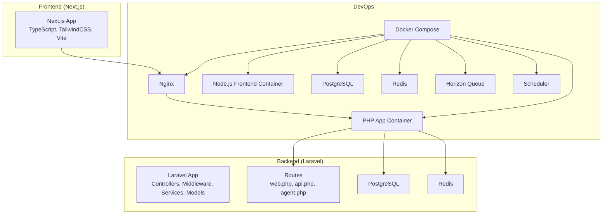
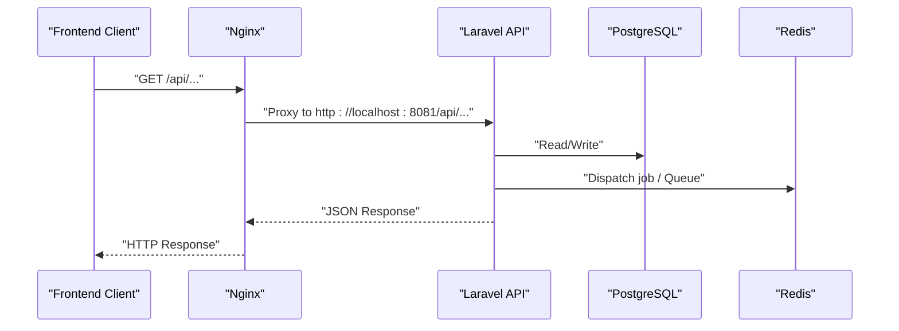
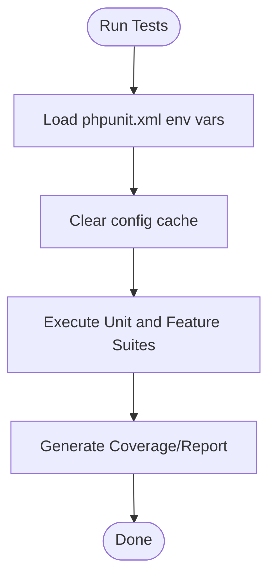
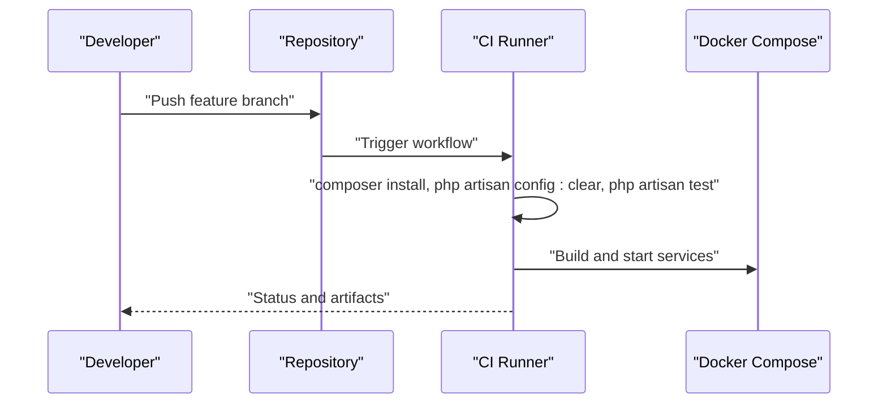
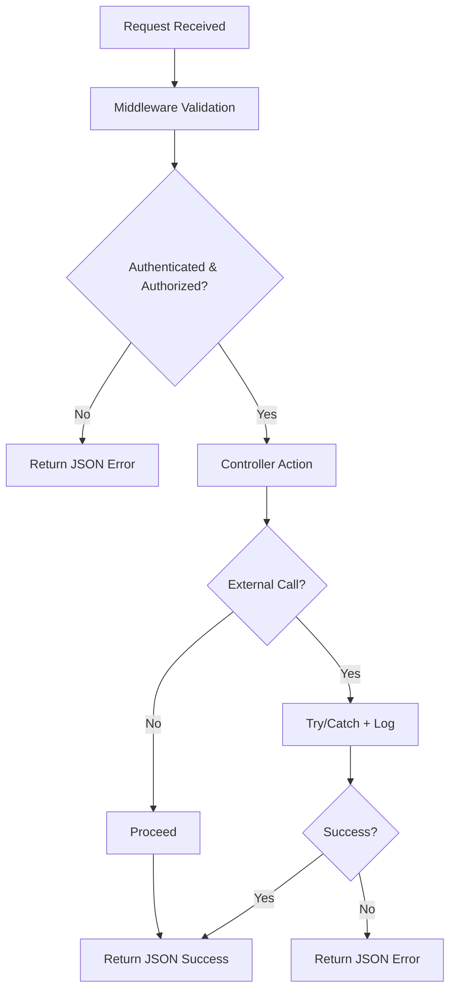
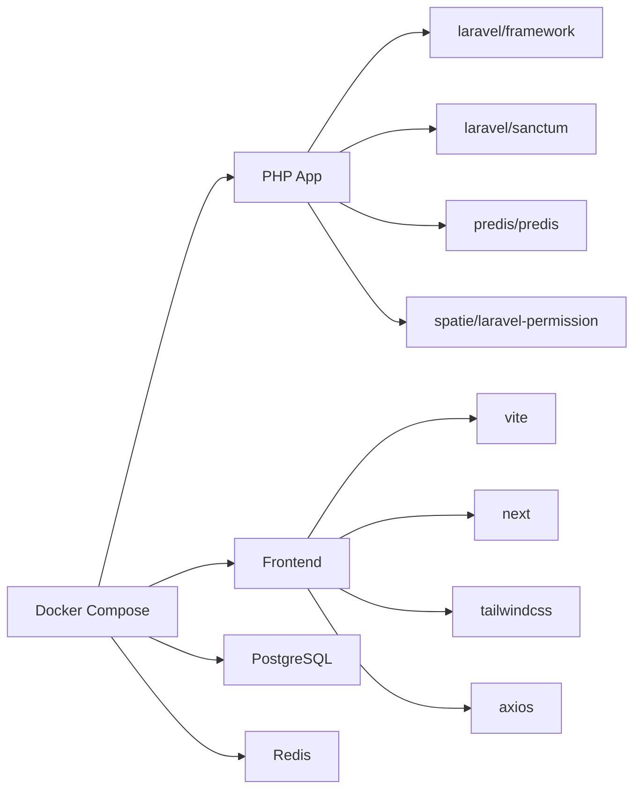

# Development Guidelines

<cite>
**Referenced Files in This Document**
- [composer.json](file://portal/composer.json)
- [package.json](file://portal/package.json)
- [phpunit.xml](file://portal/phpunit.xml)
- [eslint.config.mjs](file://portal/frontend/eslint.config.mjs)
- [.editorconfig](file://portal/.editorconfig)
- [tsconfig.json](file://portal/frontend/tsconfig.json)
- [postcss.config.mjs](file://portal/frontend/postcss.config.mjs)
- [next.config.ts](file://portal/frontend/next.config.ts)
- [TestCase.php](file://portal/tests/TestCase.php)
- [ExampleTest.php (Unit)](file://portal/tests/Unit/ExampleTest.php)
- [ExampleTest.php (Feature)](file://portal/tests/Feature/ExampleTest.php)
- [ApiResponse.php](file://portal/app/Traits/ApiResponse.php)
- [AgentAuthMiddleware.php](file://portal/app/Http/Middleware/AgentAuthMiddleware.php)
- [RoleMiddleware.php](file://portal/app/Http/Middleware/RoleMiddleware.php)
- [ActivityLogService.php](file://portal/app/Services/ActivityLogService.php)
- [TelegramNotificationService.php](file://portal/app/Services/TelegramNotificationService.php)
- [docker-compose.yml](file://docker-compose.yml)
- [Dockerfile (PHP)](file://docker/php/Dockerfile)
- [Dockerfile (Node)](file://docker/node/Dockerfile)
- [default.conf (Nginx)](file://docker/nginx/default.conf)
</cite>

## Table of Contents
1. [Introduction](#introduction)
2. [Project Structure](#project-structure)
3. [Core Components](#core-components)
4. [Architecture Overview](#architecture-overview)
5. [Detailed Component Analysis](#detailed-component-analysis)
6. [Dependency Analysis](#dependency-analysis)
7. [Performance Considerations](#performance-considerations)
8. [Troubleshooting Guide](#troubleshooting-guide)
9. [Contribution Guidelines](#contribution-guidelines)
10. [Release Management and Versioning](#release-management-and-versioning)
11. [Extensibility and Backward Compatibility](#extensibility-and-backward-compatibility)
12. [Conclusion](#conclusion)

## Introduction
This document provides comprehensive development guidelines for contributing to EPOS Portal. It covers coding standards for PHP (PSR-12), JavaScript/TypeScript conventions, React component patterns, testing strategies (unit, integration, API), development workflow, debugging/logging/error handling, documentation standards, code quality tools, contribution processes, release management, and extensibility practices grounded in the repository’s existing configuration and implementation.

## Project Structure
EPOS Portal is a dual-environment project:
- Backend: Laravel 12 application under portal/app, routes, controllers, middleware, services, and tests.
- Frontend: Next.js 14 application under portal/frontend, TypeScript, TailwindCSS v4, Vite build tooling.
- DevOps: Docker Compose orchestrating PHP app, Nginx, Node.js frontend, PostgreSQL, Redis, Horizon queue, and scheduler.

**Diagram sources**
- [docker-compose.yml:1-109](file://docker-compose.yml#L1-L109)
- [next.config.ts:1-15](file://portal/frontend/next.config.ts#L1-L15)
- [composer.json:1-90](file://portal/composer.json#L1-L90)

**Section sources**
- [docker-compose.yml:1-109](file://docker-compose.yml#L1-L109)
- [composer.json:1-90](file://portal/composer.json#L1-L90)
- [package.json:1-18](file://portal/package.json#L1-L18)

## Core Components
- Backend entry points and routing are defined in Laravel route files and controllers.
- Frontend entry points are Next.js pages under portal/frontend/src/app.
- Shared response formatting is standardized via ApiResponse trait.
- Middleware enforces agent authentication and role-based access control.
- Services encapsulate cross-cutting concerns like activity logging and Telegram notifications.
- Testing is organized into Unit and Feature suites with PHPUnit.

**Section sources**
- [composer.json:37-72](file://portal/composer.json#L37-L72)
- [phpunit.xml:7-35](file://portal/phpunit.xml#L7-L35)
- [ApiResponse.php:1-56](file://portal/app/Traits/ApiResponse.php#L1-L56)
- [AgentAuthMiddleware.php:1-57](file://portal/app/Http/Middleware/AgentAuthMiddleware.php#L1-L57)
- [RoleMiddleware.php:1-37](file://portal/app/Http/Middleware/RoleMiddleware.php#L1-L37)
- [ActivityLogService.php:1-50](file://portal/app/Services/ActivityLogService.php#L1-L50)
- [TelegramNotificationService.php:1-107](file://portal/app/Services/TelegramNotificationService.php#L1-L107)

## Architecture Overview
The system follows a client-server pattern:
- Frontend Next.js app communicates with backend Laravel API via /api routes proxied by Nginx.
- Authentication and authorization are handled by Sanctum and custom middleware.
- Background jobs are processed via Horizon and Redis.
- Environment isolation is achieved through Docker Compose.

**Diagram sources**
- [next.config.ts:4-11](file://portal/frontend/next.config.ts#L4-L11)
- [docker-compose.yml:15-40](file://docker-compose.yml#L15-L40)

**Section sources**
- [next.config.ts:1-15](file://portal/frontend/next.config.ts#L1-L15)
- [docker-compose.yml:1-109](file://docker-compose.yml#L1-L109)

## Detailed Component Analysis

### Coding Standards and Conventions

- PHP (PSR-12)
  - PSR-12 compliance is ensured by Laravel Pint in development dependencies.
  - EditorConfig enforces consistent indentation and line endings across editors.
  - PHP runtime and framework versions are defined in Composer configuration.

  **Section sources**
  - [composer.json:16-24](file://portal/composer.json#L16-L24)
  - [.editorconfig:1-19](file://portal/.editorconfig#L1-L19)

- JavaScript/TypeScript
  - Next.js TypeScript configuration enables strict mode and JSX transform.
  - ESLint is configured via eslint.config.mjs using Next.js core-web-vitals and TypeScript presets.
  - TailwindCSS is integrated with PostCSS and configured in the frontend.

  **Section sources**
  - [tsconfig.json:1-35](file://portal/frontend/tsconfig.json#L1-L35)
  - [eslint.config.mjs:1-19](file://portal/frontend/eslint.config.mjs#L1-L19)
  - [postcss.config.mjs:1-8](file://portal/frontend/postcss.config.mjs#L1-L8)

- React Component Patterns
  - Next.js App Router pages are used for routing and layout composition.
  - UI primitives are built with shared components under portal/frontend/src/components.
  - Global styles are centralized under portal/frontend/src/app/globals.css.

  **Section sources**
  - [next.config.ts:1-15](file://portal/frontend/next.config.ts#L1-L15)

### Testing Strategy

- PHPUnit (Unit and Feature)
  - PHPUnit configuration defines Unit and Feature test suites and sets environment variables for deterministic testing (SQLite in-memory, array cache/session, etc.).
  - Base test case class extends Laravel’s base test case.

- Test Organization
  - Unit tests validate isolated logic.
  - Feature tests validate HTTP responses and application behavior.

- API Testing Approaches
  - Use Laravel Dusk or Pest for browser-level API tests if needed; otherwise rely on Feature tests for HTTP assertions.

**Diagram sources**
- [phpunit.xml:20-35](file://portal/phpunit.xml#L20-L35)
- [composer.json:50-53](file://portal/composer.json#L50-L53)

**Section sources**
- [phpunit.xml:1-37](file://portal/phpunit.xml#L1-L37)
- [TestCase.php:1-11](file://portal/tests/TestCase.php#L1-L11)
- [ExampleTest.php (Unit):1-17](file://portal/tests/Unit/ExampleTest.php#L1-L17)
- [ExampleTest.php (Feature):1-20](file://portal/tests/Feature/ExampleTest.php#L1-L20)

### Development Workflow

- Local Setup
  - Composer scripts provide setup and dev commands.
  - Docker Compose orchestrates app, Nginx, Node, PostgreSQL, Redis, Horizon, and scheduler.

- Branching Strategy
  - Use feature branches prefixed with feature/, fix/, chore/, docs/.
  - Merge via pull requests with passing tests and reviews.

- Code Review
  - Require at least one reviewer; ensure tests pass and style checks succeed.

- CI/CD Integration
  - Integrate Composer install, Laravel cache clear, migration, and test execution in CI.
  - Build and deploy containers using docker-compose or platform-specific runners.

**Diagram sources**
- [composer.json:37-72](file://portal/composer.json#L37-L72)
- [docker-compose.yml:1-109](file://docker-compose.yml#L1-L109)

**Section sources**
- [composer.json:37-72](file://portal/composer.json#L37-L72)
- [docker-compose.yml:1-109](file://docker-compose.yml#L1-L109)

### Debugging Techniques, Logging Practices, and Error Handling

- Logging
  - Use Laravel Log facade for structured logs.
  - ActivityLogService writes to database when available; falls back to logs otherwise.
  - TelegramNotificationService logs failures and exceptions.

- Error Handling Patterns
  - Centralized JSON response formatting via ApiResponse trait.
  - Middleware returns structured JSON errors for authentication/authorization failures.
  - Services wrap external calls with try/catch and log warnings/errors.

**Diagram sources**
- [ApiResponse.php:1-56](file://portal/app/Traits/ApiResponse.php#L1-L56)
- [AgentAuthMiddleware.php:20-55](file://portal/app/Http/Middleware/AgentAuthMiddleware.php#L20-L55)
- [RoleMiddleware.php:15-35](file://portal/app/Http/Middleware/RoleMiddleware.php#L15-L35)
- [ActivityLogService.php:16-48](file://portal/app/Services/ActivityLogService.php#L16-L48)
- [TelegramNotificationService.php:16-48](file://portal/app/Services/TelegramNotificationService.php#L16-L48)

**Section sources**
- [ActivityLogService.php:1-50](file://portal/app/Services/ActivityLogService.php#L1-L50)
- [TelegramNotificationService.php:1-107](file://portal/app/Services/TelegramNotificationService.php#L1-L107)
- [ApiResponse.php:1-56](file://portal/app/Traits/ApiResponse.php#L1-L56)
- [AgentAuthMiddleware.php:1-57](file://portal/app/Http/Middleware/AgentAuthMiddleware.php#L1-L57)
- [RoleMiddleware.php:1-37](file://portal/app/Http/Middleware/RoleMiddleware.php#L1-L37)

### Code Quality Tools

- PHP
  - Laravel Pint for automated PSR-12 formatting.
  - PHPUnit for unit and feature tests.

- JavaScript/TypeScript
  - ESLint via eslint.config.mjs with Next.js recommended configs.
  - TailwindCSS plugin for PostCSS.

- EditorConfig
  - Enforces consistent editor behavior across contributors.

**Section sources**
- [composer.json:16-24](file://portal/composer.json#L16-L24)
- [eslint.config.mjs:1-19](file://portal/frontend/eslint.config.mjs#L1-L19)
- [postcss.config.mjs:1-8](file://portal/frontend/postcss.config.mjs#L1-L8)
- [.editorconfig:1-19](file://portal/.editorconfig#L1-L19)

### Documentation Standards and Inline Documentation

- Inline Documentation
  - Use PHPDoc blocks for traits, classes, methods, and significant logic.
  - Document parameters, return types, exceptions, and behavioral notes.

- External Documentation
  - Keep README.md and project-level docs updated with setup, workflow, and contribution steps.

[No sources needed since this section provides general guidance]

## Dependency Analysis
- Backend dependencies include Laravel framework, Sanctum, Predis, Spatie Permission, and development tools like PHPUnit and Pint.
- Frontend dependencies include Vite, Next.js, TailwindCSS, Axios, and related tooling.
- Docker Compose ties all services together with explicit ports, environment variables, and volume mounts.

**Diagram sources**
- [composer.json:8-24](file://portal/composer.json#L8-L24)
- [package.json:9-16](file://portal/package.json#L9-L16)
- [docker-compose.yml:1-109](file://docker-compose.yml#L1-L109)

**Section sources**
- [composer.json:1-90](file://portal/composer.json#L1-L90)
- [package.json:1-18](file://portal/package.json#L1-L18)
- [docker-compose.yml:1-109](file://docker-compose.yml#L1-L109)

## Performance Considerations
- Use caching for frequently accessed settings (e.g., Telegram bot token and chat ID).
- Prefer queued jobs for asynchronous tasks (e.g., notifications).
- Optimize database queries and avoid N+1 selects; leverage eager loading where appropriate.
- Minimize payload sizes in API responses and paginate large datasets.

[No sources needed since this section provides general guidance]

## Troubleshooting Guide
- Local Development
  - Verify Docker services are healthy and ports are free.
  - Confirm environment variables in .env and phpunit.xml are set correctly.
  - Rebuild containers after dependency changes.

- Testing
  - Clear configuration cache before running tests.
  - Use SQLite in-memory database for fast test runs.

- Logging
  - Inspect Laravel logs and check fallback logs when database logging is unavailable.
  - Monitor Redis queues and Horizon dashboard for stuck jobs.

**Section sources**
- [phpunit.xml:20-35](file://portal/phpunit.xml#L20-L35)
- [docker-compose.yml:1-109](file://docker-compose.yml#L1-L109)
- [ActivityLogService.php:34-48](file://portal/app/Services/ActivityLogService.php#L34-L48)
- [TelegramNotificationService.php:16-48](file://portal/app/Services/TelegramNotificationService.php#L16-L48)

## Contribution Guidelines
- Issue Reporting
  - Use repository issue templates; include environment details, steps to reproduce, and expected vs. actual behavior.

- Feature Requests
  - Open an issue describing the problem statement, proposed solution, and acceptance criteria.

- Pull Requests
  - Reference related issues.
  - Include unit and/or feature tests.
  - Ensure code passes linting and formatting checks.
  - Request review from maintainers.

[No sources needed since this section provides general guidance]

## Release Management and Versioning
- Versioning
  - Use semantic versioning (MAJOR.MINOR.PATCH) for releases.
  - Tag releases in Git and publish Docker images accordingly.

- Changelog
  - Maintain a changelog summarizing breaking changes, features, fixes, and deprecations.

- Deployment
  - Promote images built from tagged commits to production environments.
  - Apply database migrations during deployment.

[No sources needed since this section provides general guidance]

## Extensibility and Backward Compatibility
- Extend Controllers and Services
  - Add new controllers under app/Http/Controllers and register routes in api.php/web.php.
  - Encapsulate domain logic in services and reuse ApiResponse trait for consistent responses.

- Maintain Backward Compatibility
  - Avoid removing or renaming public APIs.
  - Introduce new endpoints instead of modifying existing ones.
  - Use feature flags or versioned endpoints when necessary.

- Middleware and Policies
  - Add new middleware for cross-cutting concerns and apply selectively to routes.

**Section sources**
- [ApiResponse.php:1-56](file://portal/app/Traits/ApiResponse.php#L1-L56)
- [AgentAuthMiddleware.php:1-57](file://portal/app/Http/Middleware/AgentAuthMiddleware.php#L1-L57)
- [RoleMiddleware.php:1-37](file://portal/app/Http/Middleware/RoleMiddleware.php#L1-L37)

## Conclusion
These guidelines consolidate the current development practices and standards observed in the repository. By adhering to PSR-12, Next.js/TypeScript conventions, robust testing, and the documented workflows, contributors can efficiently extend EPOS Portal while maintaining reliability, readability, and maintainability.