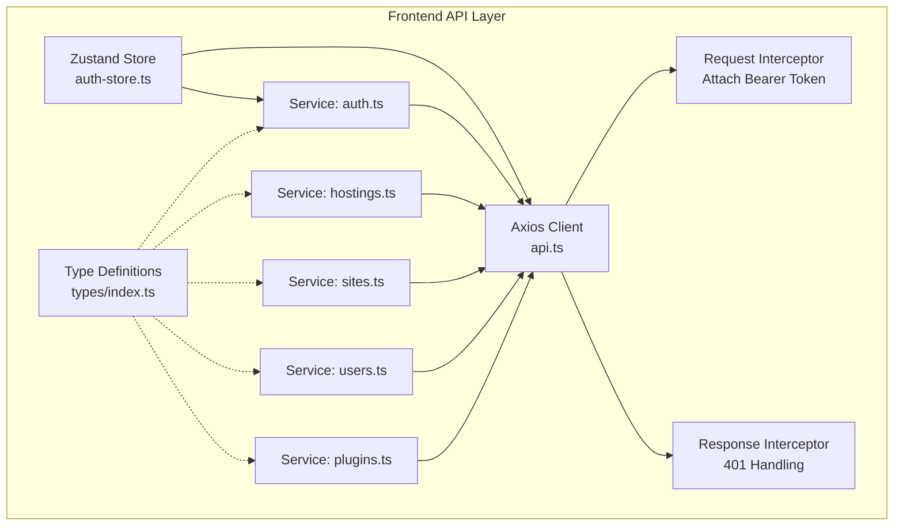
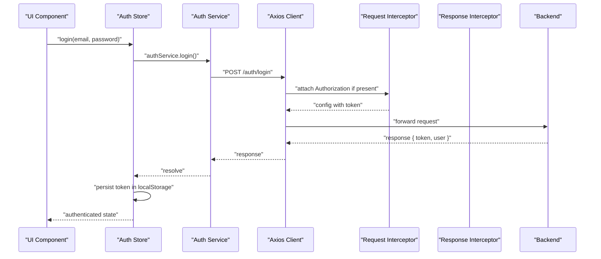
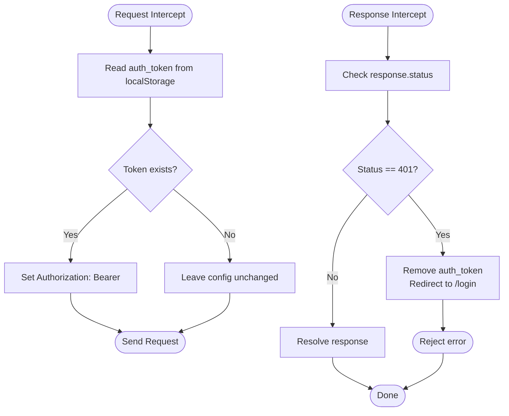
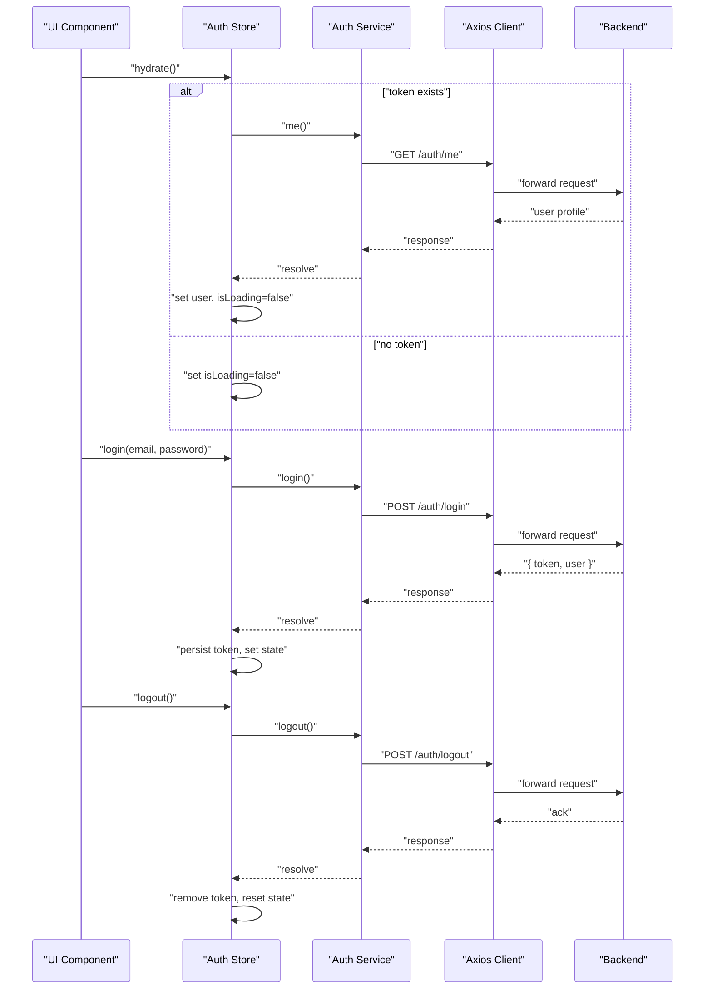
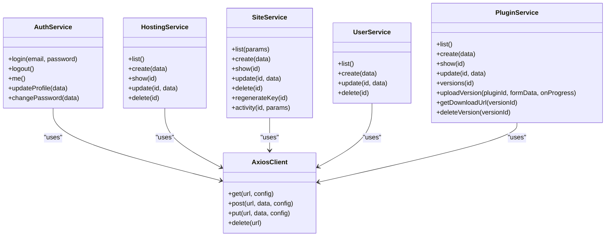
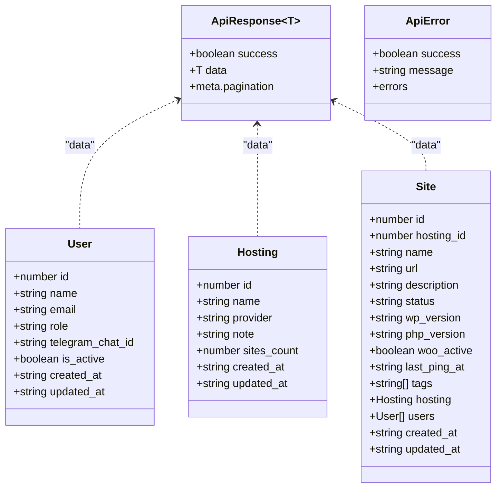
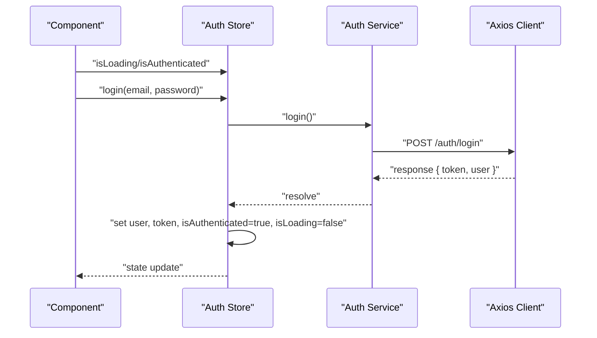
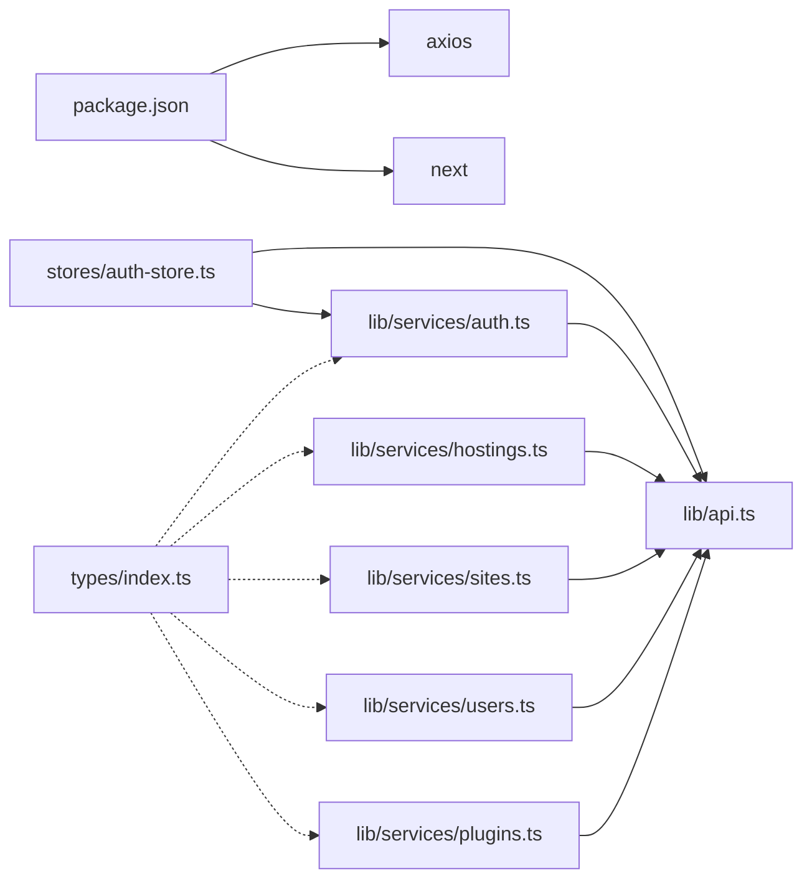

# API Integration

<cite>
**Referenced Files in This Document**
- [api.ts](file://portal/frontend/src/lib/api.ts)
- [auth.ts](file://portal/frontend/src/lib/services/auth.ts)
- [hostings.ts](file://portal/frontend/src/lib/services/hostings.ts)
- [sites.ts](file://portal/frontend/src/lib/services/sites.ts)
- [users.ts](file://portal/frontend/src/lib/services/users.ts)
- [plugins.ts](file://portal/frontend/src/lib/services/plugins.ts)
- [auth-store.ts](file://portal/frontend/src/stores/auth-store.ts)
- [index.ts](file://portal/frontend/src/types/index.ts)
- [next.config.ts](file://portal/frontend/next.config.ts)
- [package.json](file://portal/frontend/package.json)
</cite>

## Table of Contents
1. [Introduction](#introduction)
2. [Project Structure](#project-structure)
3. [Core Components](#core-components)
4. [Architecture Overview](#architecture-overview)
5. [Detailed Component Analysis](#detailed-component-analysis)
6. [Dependency Analysis](#dependency-analysis)
7. [Performance Considerations](#performance-considerations)
8. [Troubleshooting Guide](#troubleshooting-guide)
9. [Conclusion](#conclusion)
10. [Appendices](#appendices)

## Introduction
This document describes the API integration layer and HTTP client configuration used by the frontend. It covers the Axios client setup, request/response interceptors, authentication token lifecycle, error handling strategies, retry mechanisms, service-layer organization, endpoint definitions, data transformation patterns, TypeScript interfaces, type safety, response validation, examples of API calls, loading states, error handling patterns, caching strategies, offline handling, and API versioning considerations.

## Project Structure
The API integration is centered around a single Axios client instance configured with base URL, headers, interceptors, and a set of service modules that encapsulate domain-specific endpoints. Authentication state is managed via a Zustand store that persists tokens and orchestrates login/logout flows. Type definitions for API responses and domain entities are declared in a shared types module.

**Diagram sources**
- [api.ts:1-37](file://portal/frontend/src/lib/api.ts#L1-L37)
- [auth.ts:1-16](file://portal/frontend/src/lib/services/auth.ts#L1-L16)
- [hostings.ts:1-12](file://portal/frontend/src/lib/services/hostings.ts#L1-L12)
- [sites.ts:1-14](file://portal/frontend/src/lib/services/sites.ts#L1-L14)
- [users.ts:1-10](file://portal/frontend/src/lib/services/users.ts#L1-L10)
- [plugins.ts:1-29](file://portal/frontend/src/lib/services/plugins.ts#L1-L29)
- [auth-store.ts:1-64](file://portal/frontend/src/stores/auth-store.ts#L1-L64)
- [index.ts:1-96](file://portal/frontend/src/types/index.ts#L1-L96)

**Section sources**
- [api.ts:1-37](file://portal/frontend/src/lib/api.ts#L1-L37)
- [auth.ts:1-16](file://portal/frontend/src/lib/services/auth.ts#L1-L16)
- [hostings.ts:1-12](file://portal/frontend/src/lib/services/hostings.ts#L1-L12)
- [sites.ts:1-14](file://portal/frontend/src/lib/services/sites.ts#L1-L14)
- [users.ts:1-10](file://portal/frontend/src/lib/services/users.ts#L1-L10)
- [plugins.ts:1-29](file://portal/frontend/src/lib/services/plugins.ts#L1-L29)
- [auth-store.ts:1-64](file://portal/frontend/src/stores/auth-store.ts#L1-L64)
- [index.ts:1-96](file://portal/frontend/src/types/index.ts#L1-L96)

## Core Components
- Axios client with base URL and JSON headers
- Request interceptor attaching Authorization header from local storage
- Response interceptor handling 401 Unauthorized by clearing token and redirecting to login
- Service modules exposing typed endpoints for authentication, hostings, sites, users, and plugins
- Zustand store managing authentication state, persisting tokens, and orchestrating login/logout
- Shared TypeScript interfaces for domain entities and API response envelopes
- Next.js rewrites proxying /api requests to backend server

**Section sources**
- [api.ts:1-37](file://portal/frontend/src/lib/api.ts#L1-L37)
- [auth-store.ts:1-64](file://portal/frontend/src/stores/auth-store.ts#L1-L64)
- [auth.ts:1-16](file://portal/frontend/src/lib/services/auth.ts#L1-L16)
- [hostings.ts:1-12](file://portal/frontend/src/lib/services/hostings.ts#L1-L12)
- [sites.ts:1-14](file://portal/frontend/src/lib/services/sites.ts#L1-L14)
- [users.ts:1-10](file://portal/frontend/src/lib/services/users.ts#L1-L10)
- [plugins.ts:1-29](file://portal/frontend/src/lib/services/plugins.ts#L1-L29)
- [index.ts:1-96](file://portal/frontend/src/types/index.ts#L1-L96)
- [next.config.ts:1-15](file://portal/frontend/next.config.ts#L1-L15)

## Architecture Overview
The frontend uses a centralized Axios client to communicate with the backend. All service modules depend on this client. The store coordinates authentication state and persists tokens in local storage. The response interceptor centralizes 401 handling, while the request interceptor injects the bearer token. Next.js rewrites route /api/* to the backend server.

**Diagram sources**
- [auth-store.ts:35-40](file://portal/frontend/src/stores/auth-store.ts#L35-L40)
- [auth.ts:4-5](file://portal/frontend/src/lib/services/auth.ts#L4-L5)
- [api.ts:12-20](file://portal/frontend/src/lib/api.ts#L12-L20)

## Detailed Component Analysis

### Axios Client and Interceptors
- Base URL is derived from an environment variable with a sensible default path. This enables local development and deployment flexibility.
- JSON headers ensure consistent content negotiation.
- Request interceptor reads the token from local storage and attaches an Authorization header when available.
- Response interceptor checks for 401 status and clears the stored token, then redirects to the login page. Other responses pass through unchanged.

**Diagram sources**
- [api.ts:3-9](file://portal/frontend/src/lib/api.ts#L3-L9)
- [api.ts:12-20](file://portal/frontend/src/lib/api.ts#L12-L20)
- [api.ts:22-34](file://portal/frontend/src/lib/api.ts#L22-L34)

**Section sources**
- [api.ts:1-37](file://portal/frontend/src/lib/api.ts#L1-L37)

### Authentication Service and Store
- The auth store hydrates from localStorage on startup, sets authenticated state if a token exists, and attempts to fetch user details.
- Login posts credentials to the backend, persists the returned token, and updates state.
- Logout attempts a backend logout, ignores failures, removes the token, and resets state.
- Fetching user details updates the user profile; on failure, it clears the token and resets state.

**Diagram sources**
- [auth-store.ts:23-33](file://portal/frontend/src/stores/auth-store.ts#L23-L33)
- [auth-store.ts:52-60](file://portal/frontend/src/stores/auth-store.ts#L52-L60)
- [auth-store.ts:35-40](file://portal/frontend/src/stores/auth-store.ts#L35-L40)
- [auth-store.ts:42-49](file://portal/frontend/src/stores/auth-store.ts#L42-L49)
- [auth.ts:4-7](file://portal/frontend/src/lib/services/auth.ts#L4-L7)

**Section sources**
- [auth-store.ts:1-64](file://portal/frontend/src/stores/auth-store.ts#L1-L64)
- [auth.ts:1-16](file://portal/frontend/src/lib/services/auth.ts#L1-L16)

### Service Layer Organization and Endpoint Definitions
- Authentication service exposes endpoints for login, logout, fetching current user, updating profile, and changing password.
- Hosting service supports listing, creating, retrieving, updating, and deleting hostings.
- Site service supports listing with optional query parameters, CRUD operations, regenerating keys, and fetching activity logs.
- User service supports CRUD operations.
- Plugin service supports listing, creating, retrieving, updating, listing versions, uploading versions with progress callbacks, obtaining download URLs, and deleting versions.

**Diagram sources**
- [auth.ts:3-15](file://portal/frontend/src/lib/services/auth.ts#L3-L15)
- [hostings.ts:3-11](file://portal/frontend/src/lib/services/hostings.ts#L3-L11)
- [sites.ts:3-13](file://portal/frontend/src/lib/services/sites.ts#L3-L13)
- [users.ts:3-9](file://portal/frontend/src/lib/services/users.ts#L3-L9)
- [plugins.ts:3-28](file://portal/frontend/src/lib/services/plugins.ts#L3-L28)
- [api.ts:1-37](file://portal/frontend/src/lib/api.ts#L1-L37)

**Section sources**
- [auth.ts:1-16](file://portal/frontend/src/lib/services/auth.ts#L1-L16)
- [hostings.ts:1-12](file://portal/frontend/src/lib/services/hostings.ts#L1-L12)
- [sites.ts:1-14](file://portal/frontend/src/lib/services/sites.ts#L1-L14)
- [users.ts:1-10](file://portal/frontend/src/lib/services/users.ts#L1-L10)
- [plugins.ts:1-29](file://portal/frontend/src/lib/services/plugins.ts#L1-L29)

### Data Transformation Patterns and Response Validation
- The API response envelope defines a consistent shape with a boolean success flag, a data payload, and optional pagination metadata.
- Domain entity interfaces model backend resources with strict field typing and optional relationships.
- Services return Axios responses directly, allowing consumers to access response.data.data for normalized data.
- Consumers should validate response.data against the ApiResponse<T> envelope and ensure success is true before using data.

**Diagram sources**
- [index.ts:40-57](file://portal/frontend/src/types/index.ts#L40-L57)
- [index.ts:1-96](file://portal/frontend/src/types/index.ts#L1-L96)

**Section sources**
- [index.ts:1-96](file://portal/frontend/src/types/index.ts#L1-L96)

### TypeScript Interfaces and Type Safety Measures
- Strongly-typed service method signatures enforce correct argument shapes for endpoints.
- FormData uploads in plugin service support progress callbacks with numeric percent values.
- Optional fields in domain interfaces reflect nullable backend values and optional relations.
- ApiResponse<T> ensures consumers consistently handle success flags and pagination metadata.

**Section sources**
- [plugins.ts:11-23](file://portal/frontend/src/lib/services/plugins.ts#L11-L23)
- [index.ts:1-96](file://portal/frontend/src/types/index.ts#L1-L96)

### Examples of API Calls, Loading States, and Error Handling Patterns
- Login flow: The store invokes the auth service login, persists the token, and updates authentication state. UI components observe isLoading and isAuthenticated to render appropriate states.
- Logout flow: The store calls the auth service logout, ignores network errors, clears the token, and resets state.
- Fetch user: On hydration or explicit fetch, the store calls the auth service me and updates the user profile; on failure, it clears the token and resets state.
- Service usage: Components call service methods and handle response.data.data after verifying success.

**Diagram sources**
- [auth-store.ts:35-40](file://portal/frontend/src/stores/auth-store.ts#L35-L40)
- [auth.ts:4-5](file://portal/frontend/src/lib/services/auth.ts#L4-L5)

**Section sources**
- [auth-store.ts:17-63](file://portal/frontend/src/stores/auth-store.ts#L17-L63)
- [auth.ts:1-16](file://portal/frontend/src/lib/services/auth.ts#L1-L16)

### Caching Strategies, Offline Handling, and API Versioning
- Caching: No client-side caching is implemented in the current codebase. Responses are not cached; each request goes to the server.
- Offline handling: There is no offline detection or fallback mechanism. Network failures propagate as errors.
- API versioning: No explicit versioning header or path segment is used in the client. The backend determines versioning strategy; the client relies on the configured base URL and endpoint paths.

Recommendations:
- Implement a lightweight cache layer (e.g., in-memory LRU) for read-heavy endpoints with configurable TTL.
- Add offline detection and optimistic updates for write operations with sync-on-reconnect.
- Adopt a versioned base URL or Accept-Version header to decouple client and server versions.

**Section sources**
- [api.ts:3-9](file://portal/frontend/src/lib/api.ts#L3-L9)

## Dependency Analysis
The frontend depends on Axios for HTTP transport and Next.js for routing and environment configuration. The API client is the central dependency for all services. The store depends on the API client and auth service. Types are consumed by services and UI components.

**Diagram sources**
- [package.json:11-30](file://portal/frontend/package.json#L11-L30)
- [api.ts:1-37](file://portal/frontend/src/lib/api.ts#L1-L37)
- [auth.ts:1-16](file://portal/frontend/src/lib/services/auth.ts#L1-L16)
- [hostings.ts:1-12](file://portal/frontend/src/lib/services/hostings.ts#L1-L12)
- [sites.ts:1-14](file://portal/frontend/src/lib/services/sites.ts#L1-L14)
- [users.ts:1-10](file://portal/frontend/src/lib/services/users.ts#L1-L10)
- [plugins.ts:1-29](file://portal/frontend/src/lib/services/plugins.ts#L1-L29)
- [auth-store.ts:1-64](file://portal/frontend/src/stores/auth-store.ts#L1-L64)
- [index.ts:1-96](file://portal/frontend/src/types/index.ts#L1-L96)

**Section sources**
- [package.json:11-30](file://portal/frontend/package.json#L11-L30)
- [api.ts:1-37](file://portal/frontend/src/lib/api.ts#L1-L37)

## Performance Considerations
- Minimize unnecessary requests by batching operations and using service methods that accept query parameters.
- Avoid heavy computations in interceptors; keep them synchronous and fast.
- For large uploads (plugin versions), rely on the provided progress callback to improve perceived performance.
- Consider lazy-loading service modules to reduce initial bundle size.

## Troubleshooting Guide
Common issues and resolutions:
- 401 Unauthorized: The response interceptor clears the token and redirects to the login page. Verify token validity and expiration on the backend.
- Network errors: Inspect the thrown error object in the consumer; ensure proper error boundaries and user feedback.
- CORS/proxy issues: Confirm Next.js rewrites are active and the backend allows cross-origin requests.
- Token persistence: Ensure localStorage is available and not blocked by browser privacy settings.

**Section sources**
- [api.ts:22-34](file://portal/frontend/src/lib/api.ts#L22-L34)
- [auth-store.ts:42-59](file://portal/frontend/src/stores/auth-store.ts#L42-L59)
- [next.config.ts:4-11](file://portal/frontend/next.config.ts#L4-L11)

## Conclusion
The API integration layer provides a clean, centralized Axios client with robust interceptors, a cohesive service layer, and strong TypeScript typings. Authentication is handled centrally via a Zustand store and persisted token lifecycle. While the current implementation focuses on simplicity and clarity, extending with caching, offline handling, and versioning would further improve resilience and developer experience.

## Appendices
- Environment configuration: The base URL is resolved from an environment variable with a default fallback. Ensure NEXT_PUBLIC_API_URL is set appropriately in deployments.
- Next.js rewrites: /api/* routes are proxied to the backend server address configured in the Next.js configuration.

**Section sources**
- [api.ts:4](file://portal/frontend/src/lib/api.ts#L4)
- [next.config.ts:4-11](file://portal/frontend/next.config.ts#L4-L11)