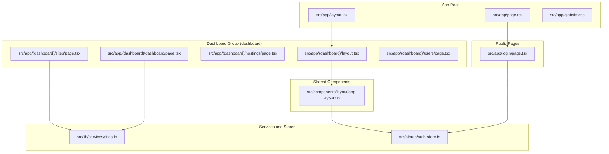
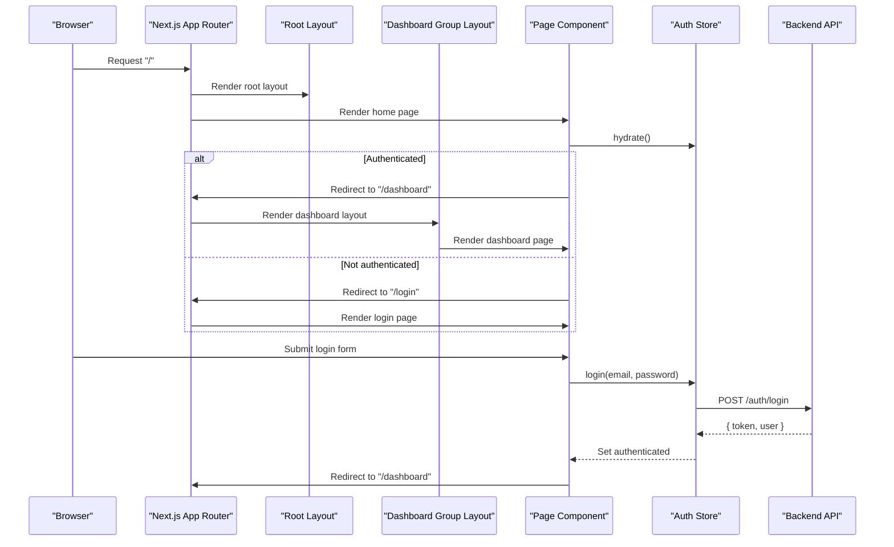
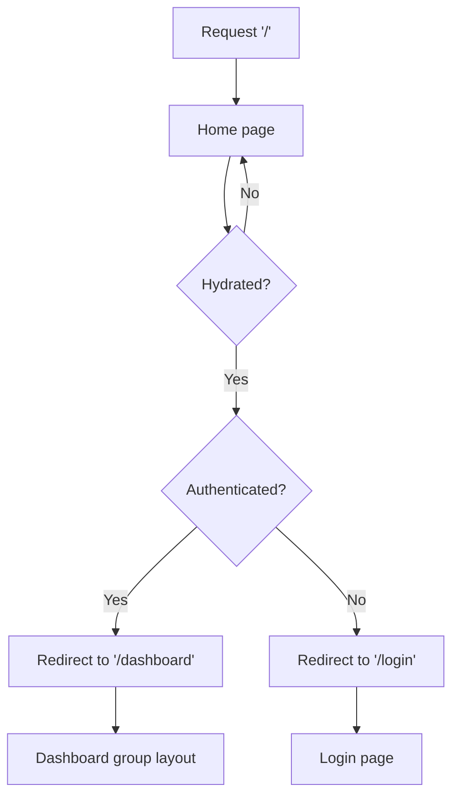
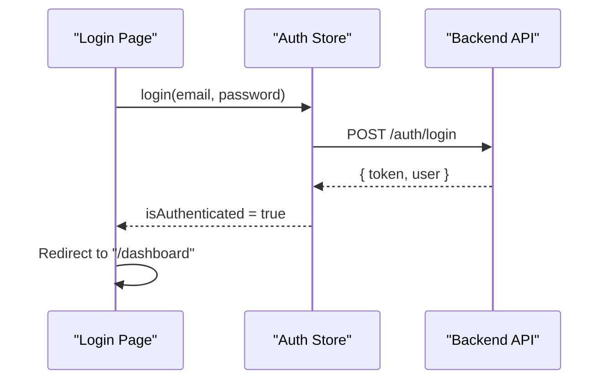
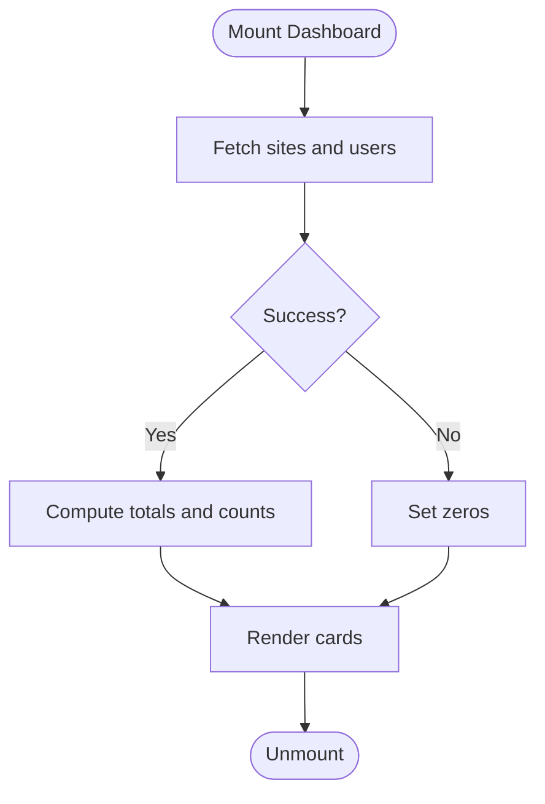
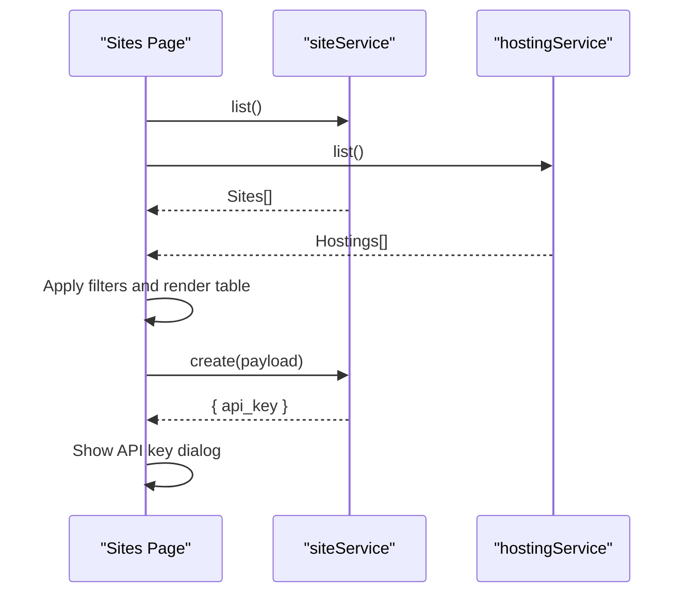
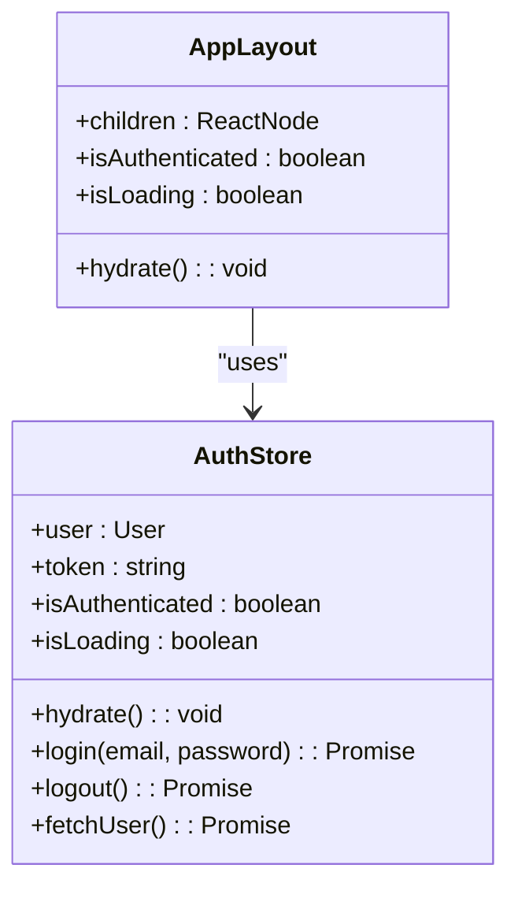

# Application Structure

<cite>
**Referenced Files in This Document**
- [package.json](file://portal/frontend/package.json)
- [next.config.ts](file://portal/frontend/next.config.ts)
- [tsconfig.json](file://portal/frontend/tsconfig.json)
- [src/app/layout.tsx](file://portal/frontend/src/app/layout.tsx)
- [src/app/page.tsx](file://portal/frontend/src/app/page.tsx)
- [src/app/globals.css](file://portal/frontend/src/app/globals.css)
- [src/app/login/page.tsx](file://portal/frontend/src/app/login/page.tsx)
- [src/app/(dashboard)/layout.tsx](file://portal/frontend/src/app/(dashboard)/layout.tsx)
- [src/app/(dashboard)/dashboard/page.tsx](file://portal/frontend/src/app/(dashboard)/dashboard/page.tsx)
- [src/app/(dashboard)/hostings/page.tsx](file://portal/frontend/src/app/(dashboard)/hostings/page.tsx)
- [src/app/(dashboard)/sites/page.tsx](file://portal/frontend/src/app/(dashboard)/sites/page.tsx)
- [src/app/(dashboard)/users/page.tsx](file://portal/frontend/src/app/(dashboard)/users/page.tsx)
- [src/components/layout/app-layout.tsx](file://portal/frontend/src/components/layout/app-layout.tsx)
- [src/lib/services/sites.ts](file://portal/frontend/src/lib/services/sites.ts)
- [src/stores/auth-store.ts](file://portal/frontend/src/stores/auth-store.ts)
</cite>

## Table of Contents
1. [Introduction](#introduction)
2. [Project Structure](#project-structure)
3. [Core Components](#core-components)
4. [Architecture Overview](#architecture-overview)
5. [Detailed Component Analysis](#detailed-component-analysis)
6. [Dependency Analysis](#dependency-analysis)
7. [Performance Considerations](#performance-considerations)
8. [Troubleshooting Guide](#troubleshooting-guide)
9. [Conclusion](#conclusion)
10. [Appendices](#appendices)

## Introduction
This document explains the Next.js application structure for the frontend located under portal/frontend. It covers the app directory organization, file naming conventions, routing patterns, layout hierarchy, page components, shared components, global CSS configuration, TypeScript setup, build configuration, environment variable handling, and static asset management. It also provides guidance on app router versus pages router considerations and migration patterns.

## Project Structure
The frontend follows the Next.js App Router convention with a strict file-system-based routing model. Key areas:
- App root layout and metadata
- Public pages (login, home redirect)
- Dashboard group with nested routes for dashboard, hostings, sites, users
- Shared UI components and layout wrappers
- Global styles and fonts
- TypeScript configuration and Next.js configuration
- API service layer and state management



**Diagram sources**
- [src/app/layout.tsx:1-38](file://portal/frontend/src/app/layout.tsx#L1-L38)
- [src/app/page.tsx:1-27](file://portal/frontend/src/app/page.tsx#L1-L27)
- [src/app/globals.css:1-130](file://portal/frontend/src/app/globals.css#L1-L130)
- [src/app/login/page.tsx:1-115](file://portal/frontend/src/app/login/page.tsx#L1-L115)
- [src/app/(dashboard)/layout.tsx](file://portal/frontend/src/app/(dashboard)/layout.tsx#L1-L12)
- [src/app/(dashboard)/dashboard/page.tsx](file://portal/frontend/src/app/(dashboard)/dashboard/page.tsx#L1-L108)
- [src/app/(dashboard)/hostings/page.tsx](file://portal/frontend/src/app/(dashboard)/hostings/page.tsx#L1-L282)
- [src/app/(dashboard)/sites/page.tsx](file://portal/frontend/src/app/(dashboard)/sites/page.tsx#L1-L362)
- [src/app/(dashboard)/users/page.tsx](file://portal/frontend/src/app/(dashboard)/users/page.tsx#L1-L324)
- [src/components/layout/app-layout.tsx:1-50](file://portal/frontend/src/components/layout/app-layout.tsx#L1-L50)
- [src/lib/services/sites.ts:1-14](file://portal/frontend/src/lib/services/sites.ts#L1-L14)
- [src/stores/auth-store.ts:1-64](file://portal/frontend/src/stores/auth-store.ts#L1-L64)

**Section sources**
- [package.json:1-43](file://portal/frontend/package.json#L1-L43)
- [next.config.ts:1-15](file://portal/frontend/next.config.ts#L1-L15)
- [tsconfig.json:1-35](file://portal/frontend/tsconfig.json#L1-L35)

## Core Components
- Root layout and metadata define the HTML document shell, fonts, and global styles.
- Home page performs hydration and redirects to either login or dashboard.
- Login page handles authentication and redirects after successful login.
- Dashboard group layout wraps pages with a shared application layout.
- Dashboard, Hostings, Sites, and Users pages implement CRUD and listing with shared UI components.
- Shared AppLayout enforces authentication and renders sidebar, header, and content area.
- Services encapsulate API calls for domain entities.
- Zustand store manages authentication state and persistence.

**Section sources**
- [src/app/layout.tsx:1-38](file://portal/frontend/src/app/layout.tsx#L1-L38)
- [src/app/page.tsx:1-27](file://portal/frontend/src/app/page.tsx#L1-L27)
- [src/app/login/page.tsx:1-115](file://portal/frontend/src/app/login/page.tsx#L1-L115)
- [src/app/(dashboard)/layout.tsx](file://portal/frontend/src/app/(dashboard)/layout.tsx#L1-L12)
- [src/app/(dashboard)/dashboard/page.tsx](file://portal/frontend/src/app/(dashboard)/dashboard/page.tsx#L1-L108)
- [src/app/(dashboard)/hostings/page.tsx](file://portal/frontend/src/app/(dashboard)/hostings/page.tsx#L1-L282)
- [src/app/(dashboard)/sites/page.tsx](file://portal/frontend/src/app/(dashboard)/sites/page.tsx#L1-L362)
- [src/app/(dashboard)/users/page.tsx](file://portal/frontend/src/app/(dashboard)/users/page.tsx#L1-L324)
- [src/components/layout/app-layout.tsx:1-50](file://portal/frontend/src/components/layout/app-layout.tsx#L1-L50)
- [src/lib/services/sites.ts:1-14](file://portal/frontend/src/lib/services/sites.ts#L1-L14)
- [src/stores/auth-store.ts:1-64](file://portal/frontend/src/stores/auth-store.ts#L1-L64)

## Architecture Overview
The application uses Next.js App Router with:
- File-system routing: folders and page.tsx files define routes.
- Layout nesting: root layout and dashboard group layout wrap pages.
- Shared UI components: reusable building blocks for forms, dialogs, tables, and navigation.
- API-driven pages: data fetching via services and state via zustand store.
- Rewrites for API proxying to backend.



**Diagram sources**
- [src/app/layout.tsx:1-38](file://portal/frontend/src/app/layout.tsx#L1-L38)
- [src/app/page.tsx:1-27](file://portal/frontend/src/app/page.tsx#L1-L27)
- [src/app/login/page.tsx:1-115](file://portal/frontend/src/app/login/page.tsx#L1-L115)
- [src/app/(dashboard)/layout.tsx](file://portal/frontend/src/app/(dashboard)/layout.tsx#L1-L12)
- [src/stores/auth-store.ts:1-64](file://portal/frontend/src/stores/auth-store.ts#L1-L64)
- [next.config.ts:1-15](file://portal/frontend/next.config.ts#L1-L15)

## Detailed Component Analysis

### Routing and Layout Hierarchy
- Root layout defines metadata, fonts, and global CSS. It wraps all pages.
- Home page hydrates auth state and redirects accordingly.
- Dashboard group layout applies a shared application layout to dashboard, hostings, sites, and users pages.
- Authentication enforcement occurs at both the home page and the shared application layout.



**Diagram sources**
- [src/app/page.tsx:1-27](file://portal/frontend/src/app/page.tsx#L1-L27)
- [src/app/(dashboard)/layout.tsx](file://portal/frontend/src/app/(dashboard)/layout.tsx#L1-L12)
- [src/components/layout/app-layout.tsx:1-50](file://portal/frontend/src/components/layout/app-layout.tsx#L1-L50)

**Section sources**
- [src/app/layout.tsx:1-38](file://portal/frontend/src/app/layout.tsx#L1-L38)
- [src/app/page.tsx:1-27](file://portal/frontend/src/app/page.tsx#L1-L27)
- [src/app/(dashboard)/layout.tsx](file://portal/frontend/src/app/(dashboard)/layout.tsx#L1-L12)
- [src/components/layout/app-layout.tsx:1-50](file://portal/frontend/src/components/layout/app-layout.tsx#L1-L50)

### Authentication Flow
- Auth store persists token in local storage and hydrates on mount.
- Login page submits credentials and redirects upon success.
- Shared AppLayout enforces authentication and blocks unauthenticated access.



**Diagram sources**
- [src/app/login/page.tsx:1-115](file://portal/frontend/src/app/login/page.tsx#L1-L115)
- [src/stores/auth-store.ts:1-64](file://portal/frontend/src/stores/auth-store.ts#L1-L64)

**Section sources**
- [src/stores/auth-store.ts:1-64](file://portal/frontend/src/stores/auth-store.ts#L1-L64)
- [src/app/login/page.tsx:1-115](file://portal/frontend/src/app/login/page.tsx#L1-L115)
- [src/components/layout/app-layout.tsx:1-50](file://portal/frontend/src/components/layout/app-layout.tsx#L1-L50)

### Dashboard Page
- Fetches statistics concurrently for sites and users.
- Renders cards with loading skeletons and status indicators.



**Diagram sources**
- [src/app/(dashboard)/dashboard/page.tsx](file://portal/frontend/src/app/(dashboard)/dashboard/page.tsx#L1-L108)

**Section sources**
- [src/app/(dashboard)/dashboard/page.tsx](file://portal/frontend/src/app/(dashboard)/dashboard/page.tsx#L1-L108)

### Sites Management Page
- Lists sites with filters, status badges, and actions.
- Supports creating a site and displaying a generated API key dialog.
- Integrates with site and hosting services.



**Diagram sources**
- [src/app/(dashboard)/sites/page.tsx](file://portal/frontend/src/app/(dashboard)/sites/page.tsx#L1-L362)
- [src/lib/services/sites.ts:1-14](file://portal/frontend/src/lib/services/sites.ts#L1-L14)

**Section sources**
- [src/app/(dashboard)/sites/page.tsx](file://portal/frontend/src/app/(dashboard)/sites/page.tsx#L1-L362)
- [src/lib/services/sites.ts:1-14](file://portal/frontend/src/lib/services/sites.ts#L1-L14)

### Hostings and Users Pages
- Both pages implement CRUD with dialogs, tables, and status badges.
- Uses shared UI components and services for consistent UX.

**Section sources**
- [src/app/(dashboard)/hostings/page.tsx](file://portal/frontend/src/app/(dashboard)/hostings/page.tsx#L1-L282)
- [src/app/(dashboard)/users/page.tsx](file://portal/frontend/src/app/(dashboard)/users/page.tsx#L1-L324)

### Shared Components
- AppLayout centralizes authentication checks and renders sidebar/header/content.
- Reusable UI components are imported from the components library.



**Diagram sources**
- [src/components/layout/app-layout.tsx:1-50](file://portal/frontend/src/components/layout/app-layout.tsx#L1-L50)
- [src/stores/auth-store.ts:1-64](file://portal/frontend/src/stores/auth-store.ts#L1-L64)

**Section sources**
- [src/components/layout/app-layout.tsx:1-50](file://portal/frontend/src/components/layout/app-layout.tsx#L1-L50)
- [src/stores/auth-store.ts:1-64](file://portal/frontend/src/stores/auth-store.ts#L1-L64)

## Dependency Analysis
- Next.js runtime and related packages are defined in package.json.
- Tailwind CSS v4, shadcn/ui, and animation helpers are configured in global CSS.
- TypeScript strict mode and bundler module resolution are enabled.
- Next.js rewrite proxies API requests to a backend server.

```mermaid
graph LR
Pkg["package.json"] --> Next["next"]
Pkg --> React["react / react-dom"]
Pkg --> UI["@radix-ui/react", "lucide-react", "sonner"]
Pkg --> Utils["axios", "date-fns", "zustand"]
TS["tsconfig.json"] --> Strict["strict mode"]
TS --> Bundler["moduleResolution: bundler"]
NextCfg["next.config.ts"] --> Rewrite["Rewrite /api/* -> backend"]
```

**Diagram sources**
- [package.json:1-43](file://portal/frontend/package.json#L1-L43)
- [tsconfig.json:1-35](file://portal/frontend/tsconfig.json#L1-L35)
- [next.config.ts:1-15](file://portal/frontend/next.config.ts#L1-L15)

**Section sources**
- [package.json:1-43](file://portal/frontend/package.json#L1-L43)
- [tsconfig.json:1-35](file://portal/frontend/tsconfig.json#L1-L35)
- [next.config.ts:1-15](file://portal/frontend/next.config.ts#L1-L15)

## Performance Considerations
- Concurrent data fetching reduces total load time.
- Skeleton loaders improve perceived performance during initial loads.
- Client-side routing avoids full-page reloads for internal navigation.
- Consider enabling incremental static regeneration (ISR) or server-side rendering (SSR) for frequently changing data if needed.

## Troubleshooting Guide
- Authentication loops: Verify local storage token presence and ensure hydration completes before redirects.
- API proxying: Confirm rewrites in Next.js configuration match backend address.
- Fonts and CSS: Ensure Google Fonts are accessible and global CSS imports are correct.
- Type errors: Validate TypeScript strictness and path aliases in tsconfig.

**Section sources**
- [src/stores/auth-store.ts:1-64](file://portal/frontend/src/stores/auth-store.ts#L1-L64)
- [next.config.ts:1-15](file://portal/frontend/next.config.ts#L1-L15)
- [src/app/layout.tsx:1-38](file://portal/frontend/src/app/layout.tsx#L1-L38)
- [tsconfig.json:1-35](file://portal/frontend/tsconfig.json#L1-L35)

## Conclusion
The application leverages Next.js App Router to deliver a structured, scalable frontend with clear separation of concerns. The layout hierarchy, shared components, and centralized state management enable maintainable development. The configuration supports modern tooling and API proxying, while the routing model aligns with file-system conventions.

## Appendices

### File Naming Conventions and Routing Patterns
- page.tsx: Defines a route segment.
- layout.tsx: Defines a layout for a route group.
- [param]: Dynamic route segment.
- (group): Route group for layout scoping without affecting URLs.

Examples present:
- Root layout and page under src/app
- Dashboard group with nested pages
- Dynamic segment for site detail under src/app/(dashboard)/sites/[id]

**Section sources**
- [src/app/layout.tsx:1-38](file://portal/frontend/src/app/layout.tsx#L1-L38)
- [src/app/page.tsx:1-27](file://portal/frontend/src/app/page.tsx#L1-L27)
- [src/app/(dashboard)/layout.tsx](file://portal/frontend/src/app/(dashboard)/layout.tsx#L1-L12)
- [src/app/(dashboard)/dashboard/page.tsx](file://portal/frontend/src/app/(dashboard)/dashboard/page.tsx#L1-L108)
- [src/app/(dashboard)/hostings/page.tsx](file://portal/frontend/src/app/(dashboard)/hostings/page.tsx#L1-L282)
- [src/app/(dashboard)/sites/page.tsx](file://portal/frontend/src/app/(dashboard)/sites/page.tsx#L1-L362)
- [src/app/(dashboard)/users/page.tsx](file://portal/frontend/src/app/(dashboard)/users/page.tsx#L1-L324)

### Global CSS and Typography
- Global CSS imports Tailwind v4, animations, and shadcn/tailwind.css.
- Font variables are injected via Next.js Google Fonts.
- Theme tokens and dark mode variants are defined centrally.

**Section sources**
- [src/app/globals.css:1-130](file://portal/frontend/src/app/globals.css#L1-L130)
- [src/app/layout.tsx:1-38](file://portal/frontend/src/app/layout.tsx#L1-L38)

### TypeScript Setup
- Strict mode enabled with noEmit and bundler module resolution.
- Path alias @/* mapped to ./src.
- Next.js plugin included for framework support.

**Section sources**
- [tsconfig.json:1-35](file://portal/frontend/tsconfig.json#L1-L35)

### Build and Environment Configuration
- Scripts for dev, build, start, and lint.
- Rewrites proxy /api/* to backend service.

**Section sources**
- [package.json:1-43](file://portal/frontend/package.json#L1-L43)
- [next.config.ts:1-15](file://portal/frontend/next.config.ts#L1-L15)

### Static Assets and Public Directory
- Place static assets under the Next.js public directory for root-level access.
- Prefer importing assets in components for build-time optimization.

[No sources needed since this section provides general guidance]

### App Router vs Pages Router Considerations
- App Router offers file-system routing, layouts, and streaming SSR.
- Pages Router uses a /pages directory with automatic route generation.
- Migration tips:
  - Move pages to src/app with page.tsx naming.
  - Extract shared UI into components and reuse across pages.
  - Replace pages middleware with App Router middleware files if needed.
  - Convert dynamic routes using brackets [] in App Router.

[No sources needed since this section provides general guidance]