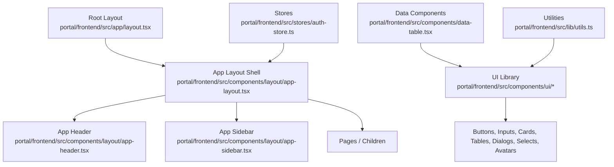
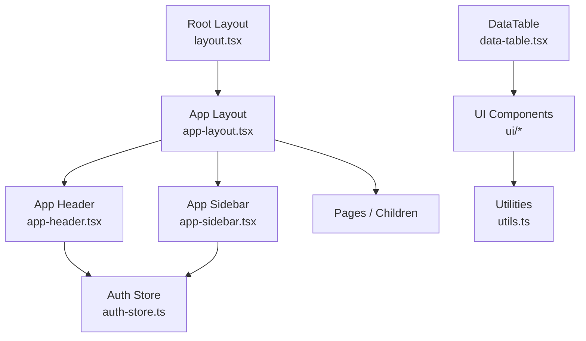
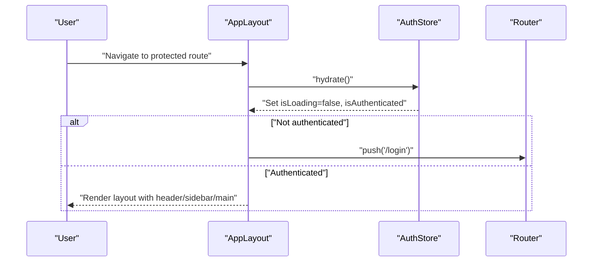
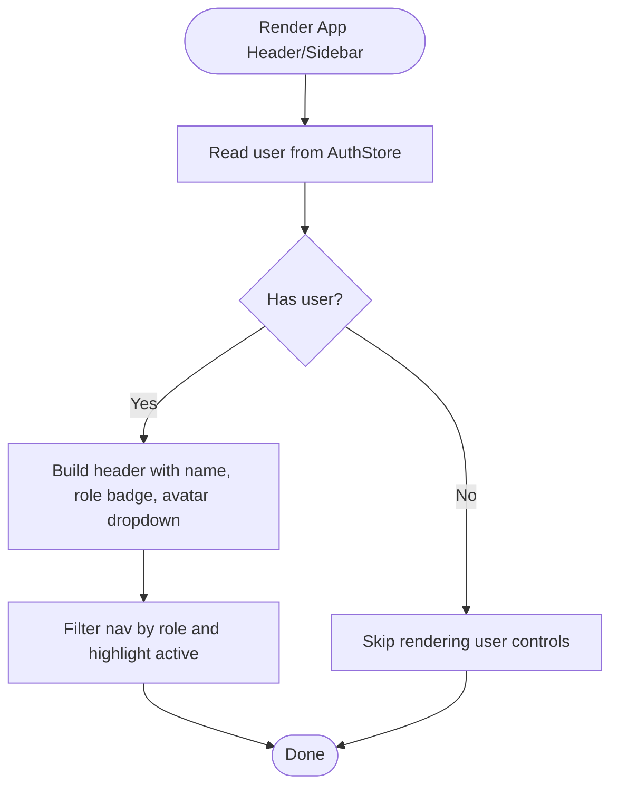
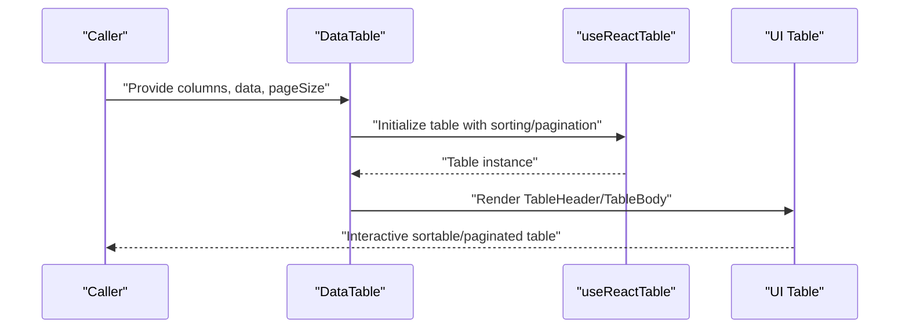
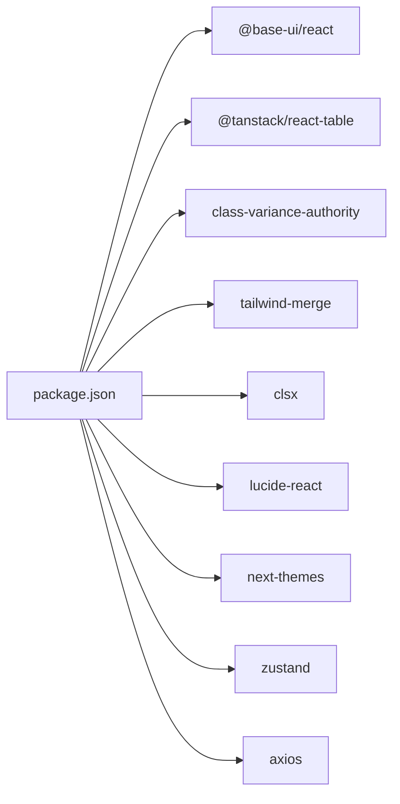

# Component Architecture

<cite>
**Referenced Files in This Document**
- [layout.tsx](file://portal/frontend/src/app/layout.tsx)
- [app-layout.tsx](file://portal/frontend/src/components/layout/app-layout.tsx)
- [app-header.tsx](file://portal/frontend/src/components/layout/app-header.tsx)
- [app-sidebar.tsx](file://portal/frontend/src/components/layout/app-sidebar.tsx)
- [button.tsx](file://portal/frontend/src/components/ui/button.tsx)
- [input.tsx](file://portal/frontend/src/components/ui/input.tsx)
- [card.tsx](file://portal/frontend/src/components/ui/card.tsx)
- [table.tsx](file://portal/frontend/src/components/ui/table.tsx)
- [dialog.tsx](file://portal/frontend/src/components/ui/dialog.tsx)
- [select.tsx](file://portal/frontend/src/components/ui/select.tsx)
- [avatar.tsx](file://portal/frontend/src/components/ui/avatar.tsx)
- [data-table.tsx](file://portal/frontend/src/components/data-table.tsx)
- [auth-store.ts](file://portal/frontend/src/stores/auth-store.ts)
- [utils.ts](file://portal/frontend/src/lib/utils.ts)
- [package.json](file://portal/frontend/package.json)
</cite>

## Table of Contents
1. [Introduction](#introduction)
2. [Project Structure](#project-structure)
3. [Core Components](#core-components)
4. [Architecture Overview](#architecture-overview)
5. [Detailed Component Analysis](#detailed-component-analysis)
6. [Dependency Analysis](#dependency-analysis)
7. [Performance Considerations](#performance-considerations)
8. [Accessibility Implementation](#accessibility-implementation)
9. [Testing Strategies](#testing-strategies)
10. [Conclusion](#conclusion)
11. [Appendices](#appendices)

## Introduction
This document describes the component architecture and UI library of the portal frontend built with Next.js and TypeScript. It explains the component hierarchy, reusable UI components, design system patterns, component composition, prop interfaces, state management, TailwindCSS integration, styling conventions, theme configuration, atomic design principles, documentation standards, examples of custom components, form components, data display components, layout components, testing strategies, accessibility implementation, and performance optimization techniques.

## Project Structure
The frontend is organized around a clear separation of concerns:
- Application shell and global styles live under the app directory.
- Reusable UI components are grouped under components/ui.
- Layout scaffolding is under components/layout.
- Data presentation and complex widgets under components.
- State management via Zustand stores under stores.
- Shared utilities under lib.
- Global fonts and theme are configured at the root layout level.



**Diagram sources**
- [layout.tsx:1-38](file://portal/frontend/src/app/layout.tsx#L1-L38)
- [app-layout.tsx:1-50](file://portal/frontend/src/components/layout/app-layout.tsx#L1-L50)
- [app-header.tsx:1-75](file://portal/frontend/src/components/layout/app-header.tsx#L1-L75)
- [app-sidebar.tsx:1-65](file://portal/frontend/src/components/layout/app-sidebar.tsx#L1-L65)
- [data-table.tsx:1-124](file://portal/frontend/src/components/data-table.tsx#L1-L124)
- [auth-store.ts:1-64](file://portal/frontend/src/stores/auth-store.ts#L1-L64)
- [utils.ts:1-7](file://portal/frontend/src/lib/utils.ts#L1-L7)

**Section sources**
- [layout.tsx:1-38](file://portal/frontend/src/app/layout.tsx#L1-L38)
- [app-layout.tsx:1-50](file://portal/frontend/src/components/layout/app-layout.tsx#L1-L50)

## Core Components
This section documents the foundational UI components and their design system patterns.

- Button
  - Purpose: Unified action primitive with variant and size scales.
  - Variants: default, outline, secondary, ghost, destructive, link.
  - Sizes: default, xs, sm, lg, icon, icon-xs, icon-sm, icon-lg.
  - Props: className, variant, size, plus base button props.
  - Composition: Uses class variance authority for variant tokens and cn for merging Tailwind classes.

- Input
  - Purpose: Text input with consistent focus states, invalid states, and dark mode support.
  - Props: className, type, plus base input props.
  - Composition: Wraps a base UI input primitive and applies standardized focus/invalid styles.

- Card
  - Purpose: Container with header, title, description, content, footer, and action slots.
  - Sizes: default, sm.
  - Slots: card-header, card-title, card-description, card-content, card-footer, card-action.
  - Props: className, size.

- Table
  - Purpose: Scrollable table container with header/body/footer, rows, and cells.
  - Slots: table-container, table, table-header, table-body, table-footer, table-row, table-head, table-cell, table-caption.
  - Props: Standard HTML element props.

- Dialog
  - Purpose: Modal overlay with content area, optional close button, header/footer helpers.
  - Props: Root, Trigger, Portal, Close, Overlay, Content, Header, Footer, Title, Description.
  - Behavior: Uses Base UI dialog primitives with consistent backdrop and popup animations.

- Select
  - Purpose: Dropdown selection with trigger, content, items, separators, scroll buttons.
  - Props: Root, Group, Value, Trigger(size), Content(positioning), Label, Item, Separator, ScrollUpButton, ScrollDownButton.
  - Behavior: Supports positioning, alignment, and scroll-aware rendering.

- Avatar
  - Purpose: User avatars with fallback, badges, and group/count helpers.
  - Sizes: default, sm, lg.
  - Props: Root, Image, Fallback, Badge, Group, GroupCount.

- DataTable
  - Purpose: Sortable, paginated table wrapper around TanStack React Table.
  - Props: columns (ColumnDef), data (TData[]), pageSize (optional).
  - Behavior: Manages sorting state and pagination internally; composes UI table components.

**Section sources**
- [button.tsx:1-59](file://portal/frontend/src/components/ui/button.tsx#L1-L59)
- [input.tsx:1-21](file://portal/frontend/src/components/ui/input.tsx#L1-L21)
- [card.tsx:1-104](file://portal/frontend/src/components/ui/card.tsx#L1-L104)
- [table.tsx:1-117](file://portal/frontend/src/components/ui/table.tsx#L1-L117)
- [dialog.tsx:1-161](file://portal/frontend/src/components/ui/dialog.tsx#L1-L161)
- [select.tsx:1-202](file://portal/frontend/src/components/ui/select.tsx#L1-L202)
- [avatar.tsx:1-110](file://portal/frontend/src/components/ui/avatar.tsx#L1-L110)
- [data-table.tsx:1-124](file://portal/frontend/src/components/data-table.tsx#L1-L124)

## Architecture Overview
The application enforces a layered architecture:
- Root layout sets fonts and global toaster.
- App layout manages authentication hydration, redirects unauthenticated users, and renders the shell.
- App header integrates with the auth store to show user info and actions.
- App sidebar provides navigation filtered by role.
- UI components are thin wrappers around Base UI primitives with Tailwind styling and variant systems.
- DataTable composes UI table components and TanStack Table for advanced data rendering.



**Diagram sources**
- [layout.tsx:1-38](file://portal/frontend/src/app/layout.tsx#L1-L38)
- [app-layout.tsx:1-50](file://portal/frontend/src/components/layout/app-layout.tsx#L1-L50)
- [app-header.tsx:1-75](file://portal/frontend/src/components/layout/app-header.tsx#L1-L75)
- [app-sidebar.tsx:1-65](file://portal/frontend/src/components/layout/app-sidebar.tsx#L1-L65)
- [data-table.tsx:1-124](file://portal/frontend/src/components/data-table.tsx#L1-L124)
- [auth-store.ts:1-64](file://portal/frontend/src/stores/auth-store.ts#L1-L64)
- [utils.ts:1-7](file://portal/frontend/src/lib/utils.ts#L1-L7)

## Detailed Component Analysis

### Authentication and App Shell
The app shell orchestrates authentication and layout:
- Hydrates auth state on mount.
- Redirects to login if not authenticated.
- Renders loading skeleton while hydrating.
- Provides a responsive layout with fixed sidebar and scrollable main content.



**Diagram sources**
- [app-layout.tsx:1-50](file://portal/frontend/src/components/layout/app-layout.tsx#L1-L50)
- [auth-store.ts:1-64](file://portal/frontend/src/stores/auth-store.ts#L1-L64)

**Section sources**
- [app-layout.tsx:1-50](file://portal/frontend/src/components/layout/app-layout.tsx#L1-L50)
- [auth-store.ts:1-64](file://portal/frontend/src/stores/auth-store.ts#L1-L64)

### Header and Navigation
- Header displays user name, role badge, and avatar dropdown menu.
- Sidebar renders navigation items filtered by role and highlights active item based on pathname.
- Both components depend on the auth store for user context.



**Diagram sources**
- [app-header.tsx:1-75](file://portal/frontend/src/components/layout/app-header.tsx#L1-L75)
- [app-sidebar.tsx:1-65](file://portal/frontend/src/components/layout/app-sidebar.tsx#L1-L65)
- [auth-store.ts:1-64](file://portal/frontend/src/stores/auth-store.ts#L1-L64)

**Section sources**
- [app-header.tsx:1-75](file://portal/frontend/src/components/layout/app-header.tsx#L1-L75)
- [app-sidebar.tsx:1-65](file://portal/frontend/src/components/layout/app-sidebar.tsx#L1-L65)

### UI Component Library Patterns
- Variant-driven styling with class variance authority.
- Utility-first Tailwind classes merged via a centralized cn function.
- Slot-based composition for semantic grouping and styling hooks.
- Primitive wrappers around Base UI components to standardize behavior and appearance.

```mermaid
classDiagram
class Button {
+variant : "default"|"outline"|...
+size : "default"|"sm"|...
+render(props)
}
class Input {
+type : string
+render(props)
}
class Card {
+size : "default"|"sm"
+CardHeader()
+CardTitle()
+CardDescription()
+CardContent()
+CardFooter()
+CardAction()
}
class Table {
+TableHeader()
+TableBody()
+TableFooter()
+TableRow()
+TableHead()
+TableCell()
+TableCaption()
}
class Dialog {
+DialogTrigger()
+DialogContent(showCloseButton?)
+DialogHeader()
+DialogFooter(showCloseButton?)
+DialogTitle()
+DialogDescription()
}
class Select {
+SelectTrigger(size?)
+SelectContent(...)
+SelectItem()
+SelectLabel()
+SelectSeparator()
+SelectScrollUpButton()
+SelectScrollDownButton()
}
class Avatar {
+size : "default"|"sm"|"lg"
+AvatarImage()
+AvatarFallback()
+AvatarBadge()
+AvatarGroup()
+AvatarGroupCount()
}
class DataTable {
+columns : ColumnDef[]
+data : TData[]
+pageSize : number
}
Button --> Utils["cn()"]
Input --> Utils
Card --> Utils
Table --> Utils
Dialog --> Utils
Select --> Utils
Avatar --> Utils
DataTable --> Table
```

**Diagram sources**
- [button.tsx:1-59](file://portal/frontend/src/components/ui/button.tsx#L1-L59)
- [input.tsx:1-21](file://portal/frontend/src/components/ui/input.tsx#L1-L21)
- [card.tsx:1-104](file://portal/frontend/src/components/ui/card.tsx#L1-L104)
- [table.tsx:1-117](file://portal/frontend/src/components/ui/table.tsx#L1-L117)
- [dialog.tsx:1-161](file://portal/frontend/src/components/ui/dialog.tsx#L1-L161)
- [select.tsx:1-202](file://portal/frontend/src/components/ui/select.tsx#L1-L202)
- [avatar.tsx:1-110](file://portal/frontend/src/components/ui/avatar.tsx#L1-L110)
- [data-table.tsx:1-124](file://portal/frontend/src/components/data-table.tsx#L1-L124)
- [utils.ts:1-7](file://portal/frontend/src/lib/utils.ts#L1-L7)

**Section sources**
- [button.tsx:1-59](file://portal/frontend/src/components/ui/button.tsx#L1-L59)
- [input.tsx:1-21](file://portal/frontend/src/components/ui/input.tsx#L1-L21)
- [card.tsx:1-104](file://portal/frontend/src/components/ui/card.tsx#L1-L104)
- [table.tsx:1-117](file://portal/frontend/src/components/ui/table.tsx#L1-L117)
- [dialog.tsx:1-161](file://portal/frontend/src/components/ui/dialog.tsx#L1-L161)
- [select.tsx:1-202](file://portal/frontend/src/components/ui/select.tsx#L1-L202)
- [avatar.tsx:1-110](file://portal/frontend/src/components/ui/avatar.tsx#L1-L110)
- [data-table.tsx:1-124](file://portal/frontend/src/components/data-table.tsx#L1-L124)
- [utils.ts:1-7](file://portal/frontend/src/lib/utils.ts#L1-L7)

### DataTable Component
DataTable composes TanStack React Table with UI table components to provide sorting and pagination out of the box.



**Diagram sources**
- [data-table.tsx:1-124](file://portal/frontend/src/components/data-table.tsx#L1-L124)
- [table.tsx:1-117](file://portal/frontend/src/components/ui/table.tsx#L1-L117)

**Section sources**
- [data-table.tsx:1-124](file://portal/frontend/src/components/data-table.tsx#L1-L124)
- [table.tsx:1-117](file://portal/frontend/src/components/ui/table.tsx#L1-L117)

## Dependency Analysis
External libraries and their roles:
- Base UI: Accessible primitives for dialogs, selects, inputs, buttons, avatars.
- TanStack React Table: Declarative table rendering with sorting and pagination.
- Class Variance Authority: Variant-based component styling.
- Tailwind Merge + clsx: Robust class merging and deduplication.
- Lucide React: Icons for UI elements.
- Next Themes: Theme switching support.
- Zustand: Lightweight state management for auth.
- Axios: HTTP client for API calls.



**Diagram sources**
- [package.json:11-31](file://portal/frontend/package.json#L11-L31)

**Section sources**
- [package.json:11-31](file://portal/frontend/package.json#L11-L31)

## Performance Considerations
- Prefer variant props over ad-hoc className overrides to keep styles predictable and cache-friendly.
- Use slot-based components to minimize unnecessary DOM nesting and improve re-render boundaries.
- Memoize heavy computations in data components (e.g., column definitions) to avoid re-renders.
- Lazy-load non-critical UI sections and defer heavy icons until needed.
- Keep className concatenation centralized via cn to reduce bundle bloat from repeated conditionals.
- Use server-side rendering and static generation where appropriate to reduce client work.

## Accessibility Implementation
- All interactive components wrap Base UI primitives, which provide ARIA attributes and keyboard navigation.
- Focus management: Buttons and inputs maintain focus rings and visible focus states.
- Semantic markup: Card, Table, Dialog, Select, and Avatar expose explicit slots for screen reader compatibility.
- Keyboard navigation: Select and Dialog support arrow keys, Enter, Escape, and Tab ordering.
- ARIA invalid states: Inputs and form controls reflect aria-invalid for error states.
- Icons include proper semantics; decorative icons are hidden from assistive technologies.

## Testing Strategies
- Unit tests for UI components:
  - Verify variant and size combinations render expected classes.
  - Confirm slot-based composition produces correct DOM structure.
- Integration tests for data components:
  - Validate sorting and pagination interactions.
  - Ensure empty state rendering and cell rendering correctness.
- State store tests:
  - Mock API responses and assert store hydration, login, logout, and error cleanup.
- Snapshot tests for layout components to prevent regressions in structure and styling.

## Conclusion
The component architecture emphasizes composability, variant-driven styling, and primitive-based accessibility through Base UI. The UI library follows a consistent pattern of wrapping primitives with Tailwind classes and variant tokens, enabling rapid development of forms, data displays, and layouts. State management is centralized via Zustand, and the design system promotes maintainability and scalability across the application.

## Appendices

### Design System and Atomic Design Principles
- Atoms: Button, Input, Avatar.
- Molecules: Card sections, Table parts, Dialog parts, Select parts.
- Organisms: DataTable, AppHeader, AppSidebar.
- Templates: AppLayout shell.
- Pages: Dashboard, Sites, Hostings, Users, Settings.

### TailwindCSS Integration and Theme Configuration
- Tailwind v4 is used with PostCSS pipeline.
- Utilities are merged via cn to ensure deterministic class ordering.
- Dark mode support is integrated via next-themes and Base UI’s dark variants.
- Font families are injected via Next.js Google Fonts and applied globally.

**Section sources**
- [layout.tsx:1-38](file://portal/frontend/src/app/layout.tsx#L1-L38)
- [utils.ts:1-7](file://portal/frontend/src/lib/utils.ts#L1-L7)
- [package.json:32-41](file://portal/frontend/package.json#L32-L41)