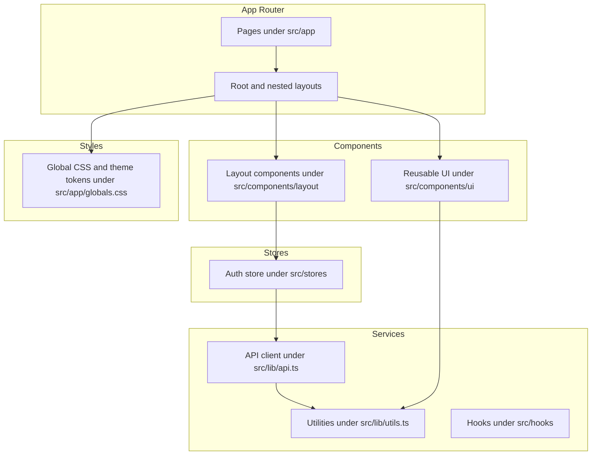
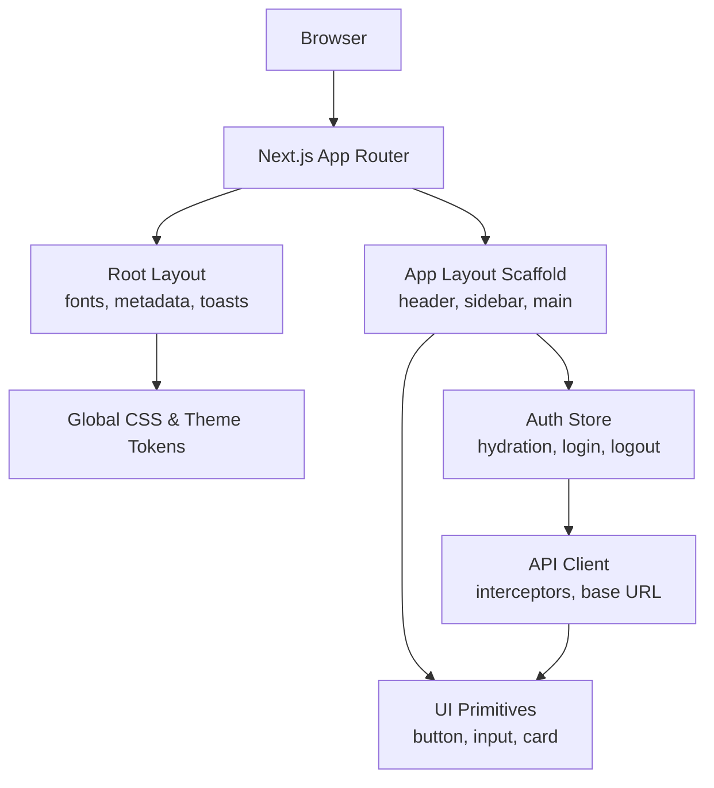
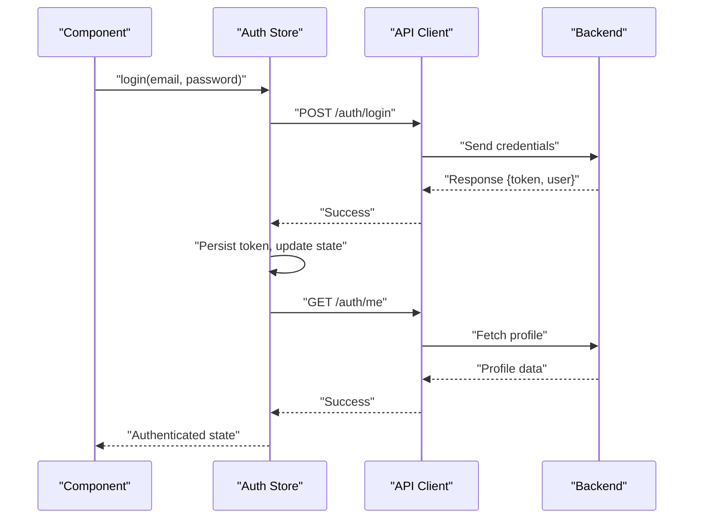
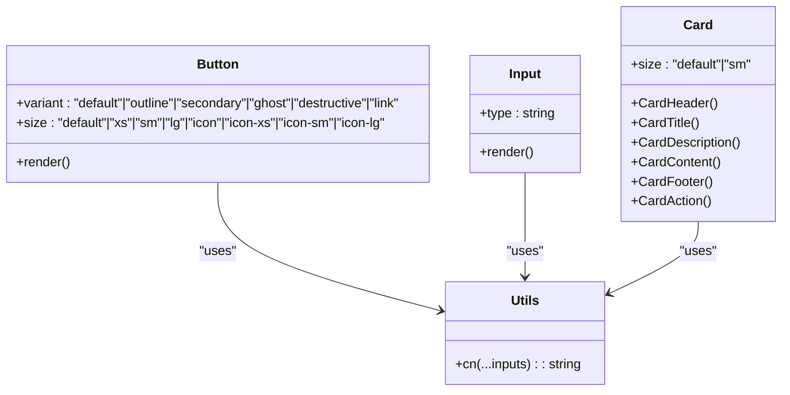
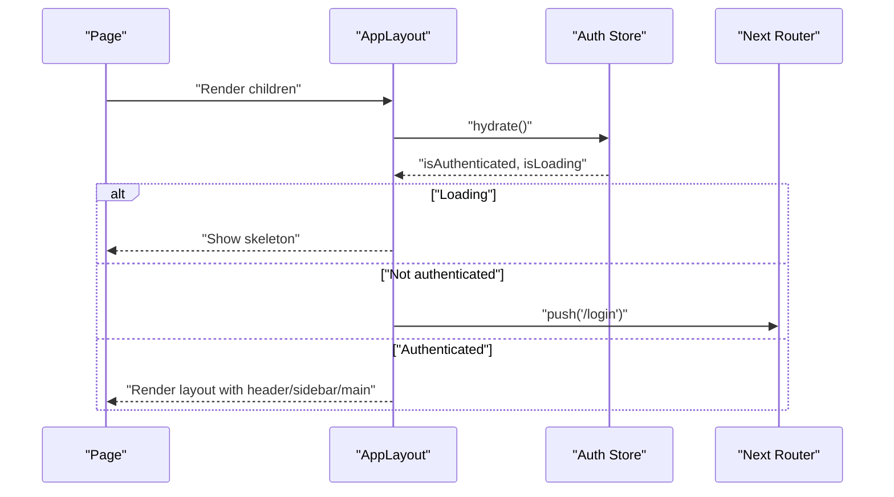
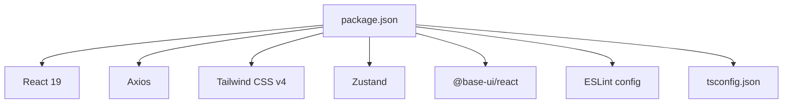

# Frontend Architecture (Next.js)

<cite>
**Referenced Files in This Document**
- [package.json](file://portal/frontend/package.json)
- [next.config.ts](file://portal/frontend/next.config.ts)
- [tsconfig.json](file://portal/frontend/tsconfig.json)
- [components.json](file://portal/frontend/components.json)
- [layout.tsx](file://portal/frontend/src/app/layout.tsx)
- [globals.css](file://portal/frontend/src/app/globals.css)
- [auth-store.ts](file://portal/frontend/src/stores/auth-store.ts)
- [api.ts](file://portal/frontend/src/lib/api.ts)
- [utils.ts](file://portal/frontend/src/lib/utils.ts)
- [use-mobile.ts](file://portal/frontend/src/hooks/use-mobile.ts)
- [button.tsx](file://portal/frontend/src/components/ui/button.tsx)
- [input.tsx](file://portal/frontend/src/components/ui/input.tsx)
- [card.tsx](file://portal/frontend/src/components/ui/card.tsx)
- [app-layout.tsx](file://portal/frontend/src/components/layout/app-layout.tsx)
</cite>

## Table of Contents
1. [Introduction](#introduction)
2. [Project Structure](#project-structure)
3. [Core Components](#core-components)
4. [Architecture Overview](#architecture-overview)
5. [Detailed Component Analysis](#detailed-component-analysis)
6. [Dependency Analysis](#dependency-analysis)
7. [Performance Considerations](#performance-considerations)
8. [Troubleshooting Guide](#troubleshooting-guide)
9. [Conclusion](#conclusion)
10. [Appendices](#appendices)

## Introduction
This document describes the frontend architecture of the Next.js application located under portal/frontend. It covers the app directory structure, routing model, component hierarchy, TypeScript integration, state management via custom stores, API integration layer, UI component organization, styling with Tailwind CSS, build configuration, environment handling, deployment considerations, responsive design patterns, accessibility, and performance strategies.

## Project Structure
The frontend is organized around Next.js App Router conventions with a clear separation of pages, components, stores, services, and shared utilities:
- Pages and layouts live under src/app with route groups and nested layouts.
- Reusable UI components are under src/components/ui.
- Layout scaffolding is under src/components/layout.
- Shared logic resides in src/lib (API client, utilities), src/stores (Zustand stores), and src/hooks (React hooks).
- Global styles and theme tokens are defined in src/app/globals.css with Tailwind v4 configuration.

**Diagram sources**
- [layout.tsx:1-38](file://portal/frontend/src/app/layout.tsx#L1-L38)
- [globals.css:1-130](file://portal/frontend/src/app/globals.css#L1-L130)
- [auth-store.ts:1-64](file://portal/frontend/src/stores/auth-store.ts#L1-L64)
- [api.ts:1-37](file://portal/frontend/src/lib/api.ts#L1-L37)
- [utils.ts:1-7](file://portal/frontend/src/lib/utils.ts#L1-L7)
- [button.tsx:1-59](file://portal/frontend/src/components/ui/button.tsx#L1-L59)
- [input.tsx:1-21](file://portal/frontend/src/components/ui/input.tsx#L1-L21)
- [card.tsx:1-104](file://portal/frontend/src/components/ui/card.tsx#L1-L104)
- [app-layout.tsx:1-50](file://portal/frontend/src/components/layout/app-layout.tsx#L1-L50)

**Section sources**
- [layout.tsx:1-38](file://portal/frontend/src/app/layout.tsx#L1-L38)
- [globals.css:1-130](file://portal/frontend/src/app/globals.css#L1-L130)
- [components.json:1-26](file://portal/frontend/components.json#L1-L26)

## Core Components
- Root layout and metadata define global fonts, theme variables, and toast notifications.
- Global CSS integrates Tailwind v4, animations, and shadcn base styles with custom theme tokens.
- Authentication store manages user session hydration, login/logout, and protected route guards.
- API client centralizes HTTP requests, attaches auth tokens, and handles 401 responses.
- UI primitives (button, input, card) provide consistent styling and behavior using class variance authority and Tailwind utilities.
- Layout scaffolding composes header, sidebar, and main content area with responsive behavior.

Key implementation references:
- Root layout and metadata: [layout.tsx:1-38](file://portal/frontend/src/app/layout.tsx#L1-L38)
- Global theme and tokens: [globals.css:1-130](file://portal/frontend/src/app/globals.css#L1-L130)
- Auth store and session lifecycle: [auth-store.ts:1-64](file://portal/frontend/src/stores/auth-store.ts#L1-L64)
- API client and interceptors: [api.ts:1-37](file://portal/frontend/src/lib/api.ts#L1-L37)
- UI primitives: [button.tsx:1-59](file://portal/frontend/src/components/ui/button.tsx#L1-L59), [input.tsx:1-21](file://portal/frontend/src/components/ui/input.tsx#L1-L21), [card.tsx:1-104](file://portal/frontend/src/components/ui/card.tsx#L1-L104)
- App layout scaffold: [app-layout.tsx:1-50](file://portal/frontend/src/components/layout/app-layout.tsx#L1-L50)

**Section sources**
- [layout.tsx:1-38](file://portal/frontend/src/app/layout.tsx#L1-L38)
- [globals.css:1-130](file://portal/frontend/src/app/globals.css#L1-L130)
- [auth-store.ts:1-64](file://portal/frontend/src/stores/auth-store.ts#L1-L64)
- [api.ts:1-37](file://portal/frontend/src/lib/api.ts#L1-L37)
- [button.tsx:1-59](file://portal/frontend/src/components/ui/button.tsx#L1-L59)
- [input.tsx:1-21](file://portal/frontend/src/components/ui/input.tsx#L1-L21)
- [card.tsx:1-104](file://portal/frontend/src/components/ui/card.tsx#L1-L104)
- [app-layout.tsx:1-50](file://portal/frontend/src/components/layout/app-layout.tsx#L1-L50)

## Architecture Overview
The frontend follows a layered architecture:
- Presentation Layer: App Router pages, nested layouts, and UI components.
- State Management: Zustand stores for authentication state.
- Services: Axios-based API client with request/response interceptors.
- Styling: Tailwind v4 with custom theme tokens and shadcn primitives.

**Diagram sources**
- [layout.tsx:1-38](file://portal/frontend/src/app/layout.tsx#L1-L38)
- [globals.css:1-130](file://portal/frontend/src/app/globals.css#L1-L130)
- [app-layout.tsx:1-50](file://portal/frontend/src/components/layout/app-layout.tsx#L1-L50)
- [auth-store.ts:1-64](file://portal/frontend/src/stores/auth-store.ts#L1-L64)
- [api.ts:1-37](file://portal/frontend/src/lib/api.ts#L1-L37)
- [button.tsx:1-59](file://portal/frontend/src/components/ui/button.tsx#L1-L59)
- [input.tsx:1-21](file://portal/frontend/src/components/ui/input.tsx#L1-L21)
- [card.tsx:1-104](file://portal/frontend/src/components/ui/card.tsx#L1-L104)

## Detailed Component Analysis

### Authentication State Management
The auth store encapsulates:
- State: user, token, loading, and isAuthenticated flags.
- Hydration: reads token from local storage and fetches user profile.
- Login: posts credentials, persists token, updates state.
- Logout: calls backend logout endpoint, clears token, resets state.
- Fetch user: retrieves current user profile with error handling.

**Diagram sources**
- [auth-store.ts:23-33](file://portal/frontend/src/stores/auth-store.ts#L23-L33)
- [auth-store.ts:52-60](file://portal/frontend/src/stores/auth-store.ts#L52-L60)

**Section sources**
- [auth-store.ts:1-64](file://portal/frontend/src/stores/auth-store.ts#L1-L64)

### API Integration Layer
The API client:
- Uses a base URL from environment variables.
- Attaches Authorization header when a token is present.
- Redirects to login on 401 responses.

**Diagram sources**
- [auth-store.ts:35-40](file://portal/frontend/src/stores/auth-store.ts#L35-L40)
- [auth-store.ts:52-56](file://portal/frontend/src/stores/auth-store.ts#L52-L56)
- [api.ts:12-20](file://portal/frontend/src/lib/api.ts#L12-L20)
- [api.ts:22-34](file://portal/frontend/src/lib/api.ts#L22-L34)

**Section sources**
- [api.ts:1-37](file://portal/frontend/src/lib/api.ts#L1-L37)
- [auth-store.ts:1-64](file://portal/frontend/src/stores/auth-store.ts#L1-L64)

### UI Component Library Organization
Reusable UI primitives are built with:
- Base UI primitives from @base-ui/react.
- Class variance authority for variants and sizes.
- Tailwind utilities and the shared cn() utility for merging classes.

**Diagram sources**
- [button.tsx:1-59](file://portal/frontend/src/components/ui/button.tsx#L1-L59)
- [input.tsx:1-21](file://portal/frontend/src/components/ui/input.tsx#L1-L21)
- [card.tsx:1-104](file://portal/frontend/src/components/ui/card.tsx#L1-L104)
- [utils.ts:1-7](file://portal/frontend/src/lib/utils.ts#L1-L7)

**Section sources**
- [button.tsx:1-59](file://portal/frontend/src/components/ui/button.tsx#L1-L59)
- [input.tsx:1-21](file://portal/frontend/src/components/ui/input.tsx#L1-L21)
- [card.tsx:1-104](file://portal/frontend/src/components/ui/card.tsx#L1-L104)
- [utils.ts:1-7](file://portal/frontend/src/lib/utils.ts#L1-L7)

### Layout Components and Navigation
The app layout:
- Hydrates auth state on mount.
- Guards protected routes by redirecting unauthenticated users to login.
- Renders sidebar, header, and main content area with responsive spacing.

**Diagram sources**
- [app-layout.tsx:10-22](file://portal/frontend/src/components/layout/app-layout.tsx#L10-L22)
- [auth-store.ts:23-33](file://portal/frontend/src/stores/auth-store.ts#L23-L33)

**Section sources**
- [app-layout.tsx:1-50](file://portal/frontend/src/components/layout/app-layout.tsx#L1-L50)
- [auth-store.ts:1-64](file://portal/frontend/src/stores/auth-store.ts#L1-L64)

### Responsive Design and Accessibility Patterns
- Responsive breakpoints: The mobile hook detects widths below the tablet breakpoint and can be used to adapt UI.
- Accessibility: Components use semantic attributes and focus-visible rings for keyboard navigation.
- Typography and contrast: Theme tokens define color roles for foreground/background and interactive states.

Implementation references:
- Mobile detection hook: [use-mobile.ts:1-20](file://portal/frontend/src/hooks/use-mobile.ts#L1-L20)
- Theme tokens and dark mode: [globals.css:51-118](file://portal/frontend/src/app/globals.css#L51-L118)
- Focus and interaction states in UI primitives: [button.tsx:6-41](file://portal/frontend/src/components/ui/button.tsx#L6-L41), [input.tsx:6-18](file://portal/frontend/src/components/ui/input.tsx#L6-L18)

**Section sources**
- [use-mobile.ts:1-20](file://portal/frontend/src/hooks/use-mobile.ts#L1-L20)
- [globals.css:1-130](file://portal/frontend/src/app/globals.css#L1-L130)
- [button.tsx:1-59](file://portal/frontend/src/components/ui/button.tsx#L1-L59)
- [input.tsx:1-21](file://portal/frontend/src/components/ui/input.tsx#L1-L21)

## Dependency Analysis
External dependencies and their roles:
- Next.js runtime and App Router.
- React 19 and React DOM.
- Axios for HTTP requests.
- Tailwind CSS v4 for styling and theme tokens.
- Base UI primitives for accessible components.
- Zustand for lightweight state management.
- Recharts, date-fns, cmdk, lucide-react for charts, dates, commands, and icons.
- next-themes for theme switching.
- Tailwind merge and class variance authority for class composition.

Build and toolchain:
- TypeScript compiler with bundler module resolution and path aliases.
- ESLint with Next.js recommended config.
- PostCSS/Tailwind CSS pipeline.

**Diagram sources**
- [package.json:1-43](file://portal/frontend/package.json#L1-L43)
- [tsconfig.json:1-35](file://portal/frontend/tsconfig.json#L1-L35)

**Section sources**
- [package.json:1-43](file://portal/frontend/package.json#L1-L43)
- [tsconfig.json:1-35](file://portal/frontend/tsconfig.json#L1-L35)

## Performance Considerations
- Client-side hydration and skeleton loading reduce perceived latency during auth initialization.
- Local storage caching minimizes repeated network calls for token presence.
- Request/response interceptors centralize auth and error handling to avoid duplication.
- Tailwind v4’s tree-shaking and CSS-in-JS theme tokens help keep bundles lean.
- Prefer server components for static content and leverage Next.js image optimization for assets.

## Troubleshooting Guide
Common issues and resolutions:
- 401 Unauthorized: The API client removes the token and redirects to login automatically.
- Missing API URL: The client falls back to "/api"; configure NEXT_PUBLIC_API_URL for production.
- Auth hydration loop: Ensure hydration runs once on mount and does not trigger unnecessary re-renders.
- Responsive layout glitches: Verify useIsMobile hook matches Tailwind breakpoints and adjust layout logic accordingly.

**Section sources**
- [api.ts:22-34](file://portal/frontend/src/lib/api.ts#L22-L34)
- [api.ts:4-9](file://portal/frontend/src/lib/api.ts#L4-L9)
- [auth-store.ts:23-33](file://portal/frontend/src/stores/auth-store.ts#L23-L33)
- [use-mobile.ts:1-20](file://portal/frontend/src/hooks/use-mobile.ts#L1-L20)

## Conclusion
The frontend employs a clean, modular architecture with strong separation of concerns. App Router pages and nested layouts provide a scalable routing model. Zustand simplifies state management for authentication, while a centralized API client ensures consistent request/response handling. The UI component library leverages Tailwind CSS v4 and shadcn primitives for maintainable, accessible components. With responsive hooks, theme tokens, and performance-conscious patterns, the application is well-positioned for growth and maintenance.

## Appendices

### Build System Configuration
- Next.js configuration defines API rewrites for development proxying.
- TypeScript configuration enables strict mode, bundler module resolution, and path aliases.
- Tailwind v4 configured via components.json with shadcn integration and custom CSS variables.

**Section sources**
- [next.config.ts:1-15](file://portal/frontend/next.config.ts#L1-L15)
- [tsconfig.json:1-35](file://portal/frontend/tsconfig.json#L1-L35)
- [components.json:1-26](file://portal/frontend/components.json#L1-L26)

### Environment Variables Handling
- NEXT_PUBLIC_API_URL controls the backend base URL for the browser.
- NEXT_PUBLIC_* variables are exposed to the client; keep sensitive secrets server-side.

**Section sources**
- [api.ts:4-9](file://portal/frontend/src/lib/api.ts#L4-L9)

### Deployment Considerations
- Build artifacts are produced by Next.js build; serve statically or via Next.js start in production.
- Configure API rewrites appropriately for production backend endpoints.
- Ensure environment variables are set for NEXT_PUBLIC_API_URL and any backend-dependent settings.

**Section sources**
- [next.config.ts:4-11](file://portal/frontend/next.config.ts#L4-L11)
- [package.json:5-10](file://portal/frontend/package.json#L5-L10)