# Frontend Architecture (Next.js)

<cite>
**Referenced Files in This Document**
- [package.json](file://portal/frontend/package.json)
- [next.config.ts](file://portal/frontend/next.config.ts)
- [tsconfig.json](file://portal/frontend/tsconfig.json)
- [components.json](file://portal/frontend/components.json)
- [layout.tsx](file://portal/frontend/src/app/layout.tsx)
- [globals.css](file://portal/frontend/src/app/globals.css)
- [auth-store.ts](file://portal/frontend/src/stores/auth-store.ts)
- [api.ts](file://portal/frontend/src/lib/api.ts)
- [utils.ts](file://portal/frontend/src/lib/utils.ts)
- [use-mobile.ts](file://portal/frontend/src/hooks/use-mobile.ts)
- [button.tsx](file://portal/frontend/src/components/ui/button.tsx)
- [input.tsx](file://portal/frontend/src/components/ui/input.tsx)
- [card.tsx](file://portal/frontend/src/components/ui/card.tsx)
- [app-layout.tsx](file://portal/frontend/src/components/layout/app-layout.tsx)
- [plugins/[id]/page.tsx](file://portal/frontend/src/app/(dashboard)/plugins/[id]/page.tsx)
- [deployments/[id]/page.tsx](file://portal/frontend/src/app/(dashboard)/deployments/[id]/page.tsx)
- [sites/[id]/page.tsx](file://portal/frontend/src/app/(dashboard)/sites/[id]/page.tsx)
- [deploy-dialog.tsx](file://portal/frontend/src/components/plugins/deploy-dialog.tsx)
- [site-plugins-tab.tsx](file://portal/frontend/src/components/sites/site-plugins-tab.tsx)
- [site-credentials-tab.tsx](file://portal/frontend/src/components/sites/site-credentials-tab.tsx)
- [site-activity-tab.tsx](file://portal/frontend/src/components/sites/site-activity-tab.tsx)
- [deployments.ts](file://portal/frontend/src/lib/services/deployments.ts)
- [plugins.ts](file://portal/frontend/src/lib/services/plugins.ts)
- [sites.ts](file://portal/frontend/src/lib/services/sites.ts)
- [dashboard.ts](file://portal/frontend/src/lib/services/dashboard.ts)
- [index.ts](file://portal/frontend/src/types/index.ts)
- [credential-form-dialog.tsx](file://portal/frontend/src/components/vault/credential-form-dialog.tsx)
- [pin-modal.tsx](file://portal/frontend/src/components/vault/pin-modal.tsx)
- [pin-setup-dialog.tsx](file://portal/frontend/src/components/vault/pin-setup-dialog.tsx)
- [pin-setup-banner.tsx](file://portal/frontend/src/components/vault/pin-setup-banner.tsx)
- [share-credentials-dialog.tsx](file://portal/frontend/src/components/vault/share-credentials-dialog.tsx)
- [active-share-links.tsx](file://portal/frontend/src/components/vault/active-share-links.tsx)
- [vault-audit-log.tsx](file://portal/frontend/src/components/vault/vault-audit-log.tsx)
- [credentials.ts](file://portal/frontend/src/lib/services/credentials.ts)
- [credential-shares.ts](file://portal/frontend/src/lib/services/credential-shares.ts)
- [vault-pin.ts](file://portal/frontend/src/lib/services/vault-pin.ts)
- [vault-logs.ts](file://portal/frontend/src/lib/services/vault-logs.ts)
- [security/[...]/page.tsx](file://portal/frontend/src/app/(dashboard)/security/page.tsx)
- [security/2fa/page.tsx](file://portal/frontend/src/app/(dashboard)/security/2fa/page.tsx)
- [security/alerts/page.tsx](file://portal/frontend/src/app/(dashboard)/security/alerts/page.tsx)
- [vault/share/[token]/page.tsx](file://portal/frontend/src/app/vault/share/[token]/page.tsx)
</cite>

## Update Summary
**Changes Made**
- Added comprehensive credential vault management system with secure credential storage and access control
- Implemented PIN protection system with modal dialogs, setup banners, and change functionality
- Integrated credential sharing with secure link generation, password protection, and access monitoring
- Added vault audit logging with filtering, pagination, and comprehensive event tracking
- Enhanced site management with credential vault integration and security monitoring interfaces
- Added new frontend components for credential forms, PIN management, share link management, and security monitoring

## Table of Contents
1. [Introduction](#introduction)
2. [Project Structure](#project-structure)
3. [Core Components](#core-components)
4. [Architecture Overview](#architecture-overview)
5. [Detailed Component Analysis](#detailed-component-analysis)
6. [Enhanced Service Layer](#enhanced-service-layer)
7. [Plugin Management System](#plugin-management-system)
8. [Deployment Monitoring](#deployment-monitoring)
9. [Site Management Interfaces](#site-management-interfaces)
10. [Vault Credential Management](#vault-credential-management)
11. [Security-Focused UI Components](#security-focused-ui-components)
12. [Credential Sharing System](#credential-sharing-system)
13. [Vault Audit and Monitoring](#vault-audit-and-monitoring)
14. [Dashboard and Analytics](#dashboard-and-analytics)
15. [Dependency Analysis](#dependency-analysis)
16. [Performance Considerations](#performance-considerations)
17. [Troubleshooting Guide](#troubleshooting-guide)
18. [Conclusion](#conclusion)
19. [Appendices](#appendices)

## Introduction
This document describes the frontend architecture of the Next.js application located under portal/frontend. It covers the app directory structure, routing model, component hierarchy, TypeScript integration, state management via custom stores, API integration layer, UI component organization, styling with Tailwind CSS, build configuration, environment handling, deployment considerations, responsive design patterns, accessibility, and performance strategies.

**Updated** Enhanced with comprehensive credential vault management system featuring secure credential storage, PIN protection, credential sharing, and extensive audit logging. The architecture now supports advanced security features with PIN verification, secure credential sharing with time-based access control, comprehensive audit trails, and integrated security monitoring interfaces.

## Project Structure
The frontend is organized around Next.js App Router conventions with a clear separation of pages, components, stores, services, and shared utilities:
- Pages and layouts live under src/app with route groups and nested layouts.
- Reusable UI components are under src/components/ui.
- Layout scaffolding is under src/components/layout.
- Vault-specific components are under src/components/vault for security-focused functionality.
- Shared logic resides in src/lib (API client, utilities), src/stores (Zustand stores), and src/hooks (React hooks).
- Global styles and theme tokens are defined in src/app/globals.css with Tailwind v4 configuration.

```mermaid
graph TB
subgraph "App Router"
PAGES["Pages under src/app"]
LAYOUTS["Root and nested layouts"]
SECURITY["Security pages (/security/*)"]
VAULTSHARE["Vault share pages (/vault/share/*)"]
END
subgraph "Components"
UI["Reusable UI under src/components/ui"]
LAYOUTCOMP["Layout components under src/components/layout"]
VAULTCOMP["Vault components under src/components/vault"]
PLUGINCOMP["Plugin-specific components under src/components/plugins"]
SITECOMP["Site-specific components under src/components/sites"]
END
subgraph "Services"
APISERVICE["API client under src/lib/api.ts"]
DEPLOYMENTS["Deployments service under src/lib/services/deployments.ts"]
PLUGINS["Plugins service under src/lib/services/plugins.ts"]
SITES["Sites service under src/lib/services/sites.ts"]
DASHBOARD["Dashboard service under src/lib/services/dashboard.ts"]
VAULTPIN["Vault PIN service under src/lib/services/vault-pin.ts"]
CREDENTIALSHARES["Credential shares service under src/lib/services/credential-shares.ts"]
VAULTLOGS["Vault logs service under src/lib/services/vault-logs.ts"]
CREDENTIALS["Credentials service under src/lib/services/credentials.ts"]
END
subgraph "Stores"
AUTHSTORE["Auth store under src/stores"]
END
subgraph "Types"
TYPES["Type definitions under src/types"]
END
PAGES --> LAYOUTS
LAYOUTS --> UI
LAYOUTS --> LAYOUTCOMP
LAYOUTCOMP --> AUTHSTORE
AUTHSTORE --> APISERVICE
APISERVICE --> DEPLOYMENTS
APISERVICE --> PLUGINS
APISERVICE --> SITES
APISERVICE --> DASHBOARD
APISERVICE --> VAULTPIN
APISERVICE --> CREDENTIALSHARES
APISERVICE --> VAULTLOGS
APISERVICE --> CREDENTIALS
UI --> TYPES
LAYOUTCOMP --> TYPES
PLUGINCOMP --> TYPES
SITECOMP --> TYPES
VAULTCOMP --> TYPES
SECURITY --> VAULTCOMP
VAULTSHARE --> VAULTCOMP
```

**Diagram sources**
- [layout.tsx:1-38](file://portal/frontend/src/app/layout.tsx#L1-L38)
- [globals.css:1-130](file://portal/frontend/src/app/globals.css#L1-L130)
- [auth-store.ts:1-64](file://portal/frontend/src/stores/auth-store.ts#L1-L64)
- [api.ts:1-37](file://portal/frontend/src/lib/api.ts#L1-L37)
- [vault-pin.ts:1-13](file://portal/frontend/src/lib/services/vault-pin.ts#L1-L13)
- [credential-shares.ts:1-78](file://portal/frontend/src/lib/services/credential-shares.ts#L1-L78)
- [vault-logs.ts:1-36](file://portal/frontend/src/lib/services/vault-logs.ts#L1-L36)
- [credentials.ts:1-38](file://portal/frontend/src/lib/services/credentials.ts#L1-L38)

**Section sources**
- [layout.tsx:1-38](file://portal/frontend/src/app/layout.tsx#L1-L38)
- [globals.css:1-130](file://portal/frontend/src/app/globals.css#L1-L130)
- [components.json:1-26](file://portal/frontend/components.json#L1-L26)

## Core Components
- Root layout and metadata define global fonts, theme variables, and toast notifications.
- Global CSS integrates Tailwind v4, animations, and shadcn base styles with custom theme tokens.
- Authentication store manages user session hydration, login/logout, and protected route guards.
- API client centralizes HTTP requests, attaches auth tokens, and handles 401 responses.
- UI primitives (button, input, card) provide consistent styling and behavior using class variance authority and Tailwind utilities.
- Layout scaffolding composes header, sidebar, and main content area with responsive behavior.

Key implementation references:
- Root layout and metadata: [layout.tsx:1-38](file://portal/frontend/src/app/layout.tsx#L1-L38)
- Global theme and tokens: [globals.css:1-130](file://portal/frontend/src/app/globals.css#L1-L130)
- Auth store and session lifecycle: [auth-store.ts:1-64](file://portal/frontend/src/stores/auth-store.ts#L1-L64)
- API client and interceptors: [api.ts:1-37](file://portal/frontend/src/lib/api.ts#L1-L37)
- UI primitives: [button.tsx:1-59](file://portal/frontend/src/components/ui/button.tsx#L1-L59), [input.tsx:1-21](file://portal/frontend/src/components/ui/input.tsx#L1-L21), [card.tsx:1-104](file://portal/frontend/src/components/ui/card.tsx#L1-L104)
- App layout scaffold: [app-layout.tsx:1-50](file://portal/frontend/src/components/layout/app-layout.tsx#L1-L50)

**Section sources**
- [layout.tsx:1-38](file://portal/frontend/src/app/layout.tsx#L1-L38)
- [globals.css:1-130](file://portal/frontend/src/app/globals.css#L1-L130)
- [auth-store.ts:1-64](file://portal/frontend/src/stores/auth-store.ts#L1-L64)
- [api.ts:1-37](file://portal/frontend/src/lib/api.ts#L1-L37)
- [button.tsx:1-59](file://portal/frontend/src/components/ui/button.tsx#L1-L59)
- [input.tsx:1-21](file://portal/frontend/src/components/ui/input.tsx#L1-L21)
- [card.tsx:1-104](file://portal/frontend/src/components/ui/card.tsx#L1-L104)
- [app-layout.tsx:1-50](file://portal/frontend/src/components/layout/app-layout.tsx#L1-L50)

## Architecture Overview
The frontend follows a layered architecture:
- Presentation Layer: App Router pages, nested layouts, and UI components.
- State Management: Zustand stores for authentication state.
- Services: Axios-based API client with request/response interceptors.
- Styling: Tailwind v4 with custom theme tokens and shadcn primitives.

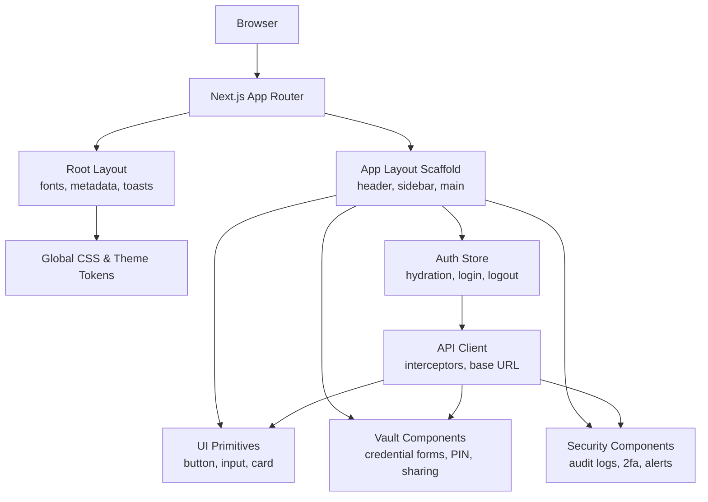

**Diagram sources**
- [layout.tsx:1-38](file://portal/frontend/src/app/layout.tsx#L1-L38)
- [globals.css:1-130](file://portal/frontend/src/app/globals.css#L1-L130)
- [app-layout.tsx:1-50](file://portal/frontend/src/components/layout/app-layout.tsx#L1-L50)
- [auth-store.ts:1-64](file://portal/frontend/src/stores/auth-store.ts#L1-L64)
- [api.ts:1-37](file://portal/frontend/src/lib/api.ts#L1-L37)
- [button.tsx:1-59](file://portal/frontend/src/components/ui/button.tsx#L1-L59)
- [input.tsx:1-21](file://portal/frontend/src/components/ui/input.tsx#L1-L21)
- [card.tsx:1-104](file://portal/frontend/src/components/ui/card.tsx#L1-L104)

## Detailed Component Analysis

### Authentication State Management
The auth store encapsulates:
- State: user, token, loading, and isAuthenticated flags.
- Hydration: reads token from local storage and fetches user profile.
- Login: posts credentials, persists token, updates state.
- Logout: calls backend logout endpoint, clears token, resets state.
- Fetch user: retrieves current user profile with error handling.

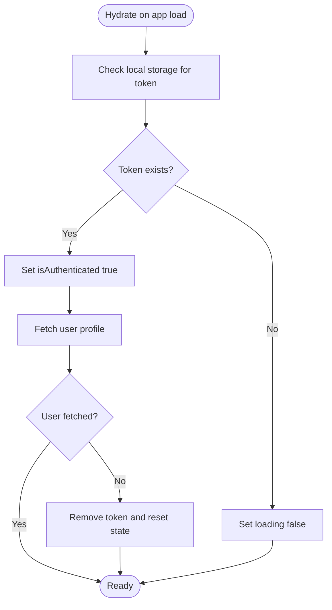

**Diagram sources**
- [auth-store.ts:23-33](file://portal/frontend/src/stores/auth-store.ts#L23-L33)
- [auth-store.ts:52-60](file://portal/frontend/src/stores/auth-store.ts#L52-L60)

**Section sources**
- [auth-store.ts:1-64](file://portal/frontend/src/stores/auth-store.ts#L1-L64)

### API Integration Layer
The API client:
- Uses a base URL from environment variables.
- Attaches Authorization header when a token is present.
- Redirects to login on 401 responses.

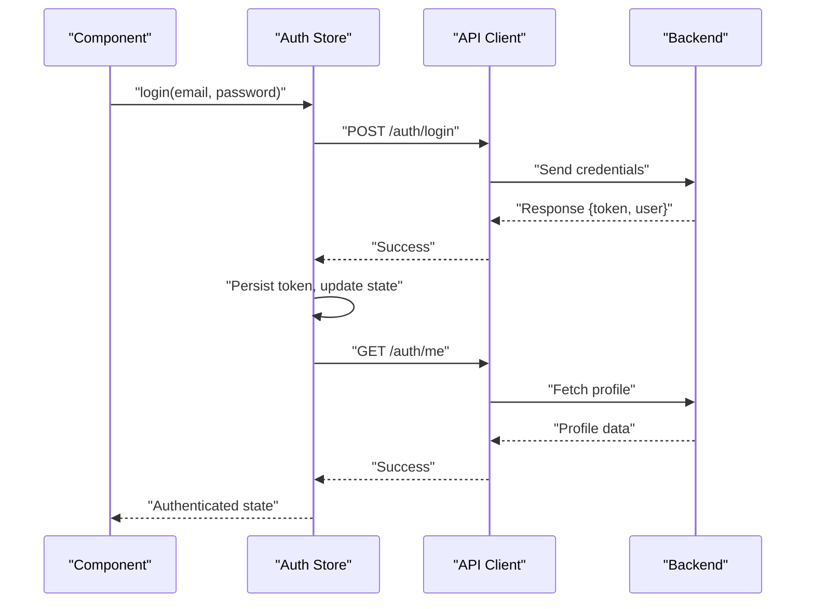

**Diagram sources**
- [auth-store.ts:35-40](file://portal/frontend/src/stores/auth-store.ts#L35-L40)
- [auth-store.ts:52-56](file://portal/frontend/src/stores/auth-store.ts#L52-L56)
- [api.ts:12-20](file://portal/frontend/src/lib/api.ts#L12-L20)
- [api.ts:22-34](file://portal/frontend/src/lib/api.ts#L22-L34)

**Section sources**
- [api.ts:1-37](file://portal/frontend/src/lib/api.ts#L1-L37)
- [auth-store.ts:1-64](file://portal/frontend/src/stores/auth-store.ts#L1-L64)

### UI Component Library Organization
Reusable UI primitives are built with:
- Base UI primitives from @base-ui/react.
- Class variance authority for variants and sizes.
- Tailwind utilities and the shared cn() utility for merging classes.

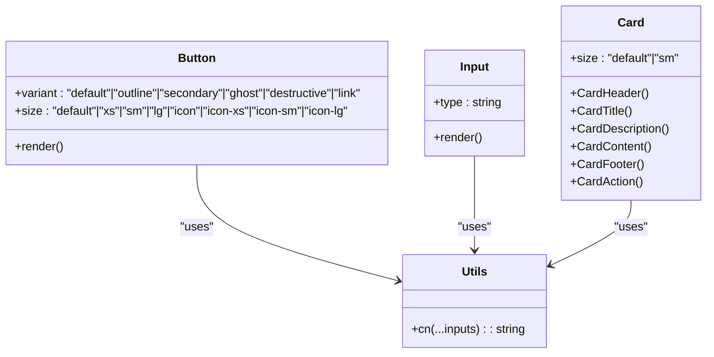

**Diagram sources**
- [button.tsx:1-59](file://portal/frontend/src/components/ui/button.tsx#L1-L59)
- [input.tsx:1-21](file://portal/frontend/src/components/ui/input.tsx#L1-L21)
- [card.tsx:1-104](file://portal/frontend/src/components/ui/card.tsx#L1-L104)
- [utils.ts:1-7](file://portal/frontend/src/lib/utils.ts#L1-L7)

**Section sources**
- [button.tsx:1-59](file://portal/frontend/src/components/ui/button.tsx#L1-L59)
- [input.tsx:1-21](file://portal/frontend/src/components/ui/input.tsx#L1-L21)
- [card.tsx:1-104](file://portal/frontend/src/components/ui/card.tsx#L1-L104)
- [utils.ts:1-7](file://portal/frontend/src/lib/utils.ts#L1-L7)

### Layout Components and Navigation
The app layout:
- Hydrates auth state on mount.
- Guards protected routes by redirecting unauthenticated users to login.
- Renders sidebar, header, and main content area with responsive spacing.

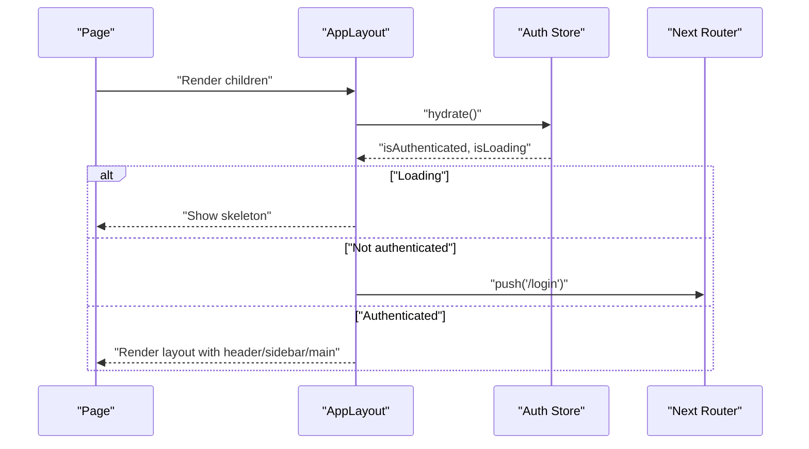

**Diagram sources**
- [app-layout.tsx:10-22](file://portal/frontend/src/components/layout/app-layout.tsx#L10-L22)
- [auth-store.ts:23-33](file://portal/frontend/src/stores/auth-store.ts#L23-L33)

**Section sources**
- [app-layout.tsx:1-50](file://portal/frontend/src/components/layout/app-layout.tsx#L1-L50)
- [auth-store.ts:1-64](file://portal/frontend/src/stores/auth-store.ts#L1-L64)

### Responsive Design and Accessibility Patterns
- Responsive breakpoints: The mobile hook detects widths below the tablet breakpoint and can be used to adapt UI.
- Accessibility: Components use semantic attributes and focus-visible rings for keyboard navigation.
- Typography and contrast: Theme tokens define color roles for foreground/background and interactive states.

Implementation references:
- Mobile detection hook: [use-mobile.ts:1-20](file://portal/frontend/src/hooks/use-mobile.ts#L1-L20)
- Theme tokens and dark mode: [globals.css:51-118](file://portal/frontend/src/app/globals.css#L51-L118)
- Focus and interaction states in UI primitives: [button.tsx:6-41](file://portal/frontend/src/components/ui/button.tsx#L6-L41), [input.tsx:6-18](file://portal/frontend/src/components/ui/input.tsx#L6-L18)

**Section sources**
- [use-mobile.ts:1-20](file://portal/frontend/src/hooks/use-mobile.ts#L1-L20)
- [globals.css:1-130](file://portal/frontend/src/app/globals.css#L1-L130)
- [button.tsx:1-59](file://portal/frontend/src/components/ui/button.tsx#L1-L59)
- [input.tsx:1-21](file://portal/frontend/src/components/ui/input.tsx#L1-L21)

## Enhanced Service Layer

### Plugin Management Service
The plugin service provides comprehensive CRUD operations for plugin management with version control and file upload capabilities.

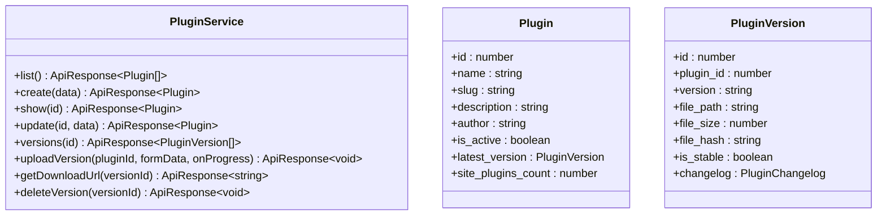

**Diagram sources**
- [plugins.ts:1-29](file://portal/frontend/src/lib/services/plugins.ts#L1-L29)
- [index.ts:60-96](file://portal/frontend/src/types/index.ts#L60-L96)

### Deployment Management Service
The deployment service handles job creation, progress tracking, and real-time monitoring with automatic polling.

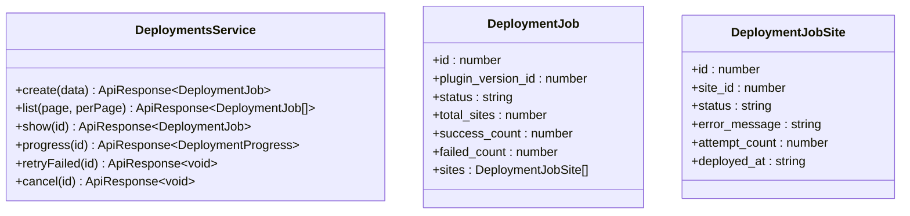

**Diagram sources**
- [deployments.ts:1-22](file://portal/frontend/src/lib/services/deployments.ts#L1-L22)
- [index.ts:98-134](file://portal/frontend/src/types/index.ts#L98-L134)

### Site Management Service
The site service provides comprehensive site operations including plugin listing, activity logs, and auto-login functionality.

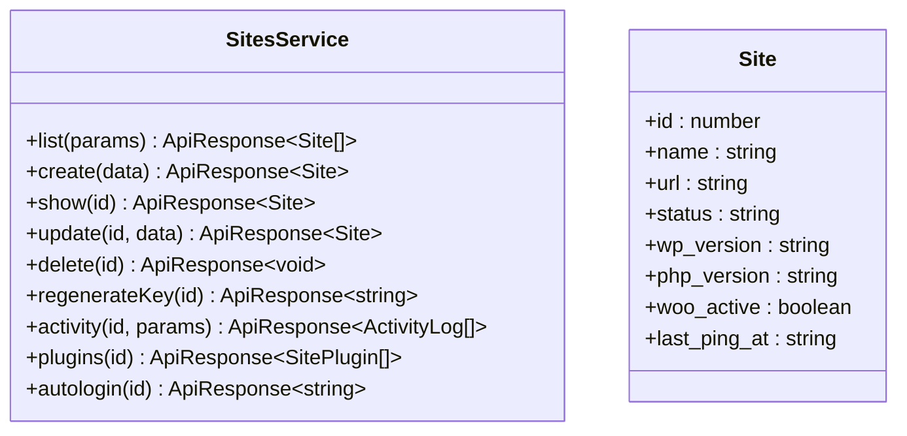

**Diagram sources**
- [sites.ts:1-17](file://portal/frontend/src/lib/services/sites.ts#L1-L17)
- [index.ts:23-39](file://portal/frontend/src/types/index.ts#L23-L39)

### Credential Management Service
The credential service provides comprehensive CRUD operations for credential management with secure access control and PIN verification.

```mermaid
classDiagram
class CredentialService {
+list(siteId) ApiResponse~Credential[]~
+get(siteId, credentialId) ApiResponse~Credential~
+create(siteId, data) ApiResponse~Credential~
+update(siteId, credentialId, data) ApiResponse~Credential~
+delete(siteId, credentialId, vault_pin) ApiResponse~void~
+reveal(siteId, credentialId, field_key, vault_pin) ApiResponse~{ value, expires_in }~
+copy(siteId, credentialId, field_key, vault_pin) ApiResponse~{ value }~
+autologin(siteId) ApiResponse~{ redirect_url }~
+getTypes() ApiResponse~CredentialType[]~
}
class Credential {
+id : number
+credential_type_id : number
+label : string
+fields : CredentialField[]
+created_at : string
+updated_at : string
}
class CredentialField {
+id : number
+field_key : string
+field_label : string
+field_value : string
+is_sensitive : boolean
+sort_order : number
}
```

**Diagram sources**
- [credentials.ts:1-38](file://portal/frontend/src/lib/services/credentials.ts#L1-L38)
- [index.ts:136-170](file://portal/frontend/src/types/index.ts#L136-L170)

### Credential Sharing Service
The credential sharing service manages secure link generation, access control, and sharing lifecycle management.

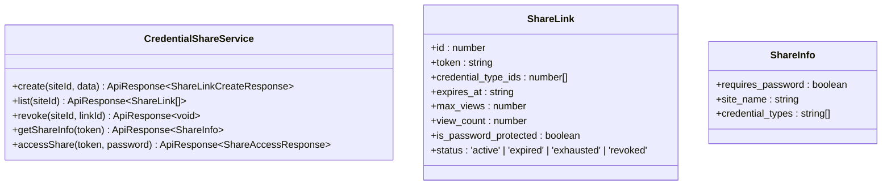

**Diagram sources**
- [credential-shares.ts:1-78](file://portal/frontend/src/lib/services/credential-shares.ts#L1-L78)
- [index.ts:172-206](file://portal/frontend/src/types/index.ts#L172-L206)

### Vault PIN Service
The vault PIN service handles PIN setup, verification, and management for credential access control.

```mermaid
classDiagram
class VaultPinService {
+setup(pin, pin_confirmation) ApiResponse~void~
+change(current_pin, new_pin, new_pin_confirmation) ApiResponse~void~
+verify(pin) ApiResponse~{ verified : boolean }~
}
```

**Diagram sources**
- [vault-pin.ts:1-13](file://portal/frontend/src/lib/services/vault-pin.ts#L1-L13)

### Vault Logs Service
The vault logs service provides comprehensive audit logging with filtering, pagination, and event tracking.

```mermaid
classDiagram
class VaultLogService {
+list(siteId, params) ApiResponse~VaultLogsResponse~
}
class VaultLog {
+id : number
+user : User | null
+action : string
+field_key : string | null
+credential : { id, label } | null
+ip_address : string | null
+metadata : Record<string, unknown> | null
+created_at : string
}
```

**Diagram sources**
- [vault-logs.ts:1-36](file://portal/frontend/src/lib/services/vault-logs.ts#L1-L36)
- [index.ts:208-236](file://portal/frontend/src/types/index.ts#L208-L236)

**Section sources**
- [plugins.ts:1-29](file://portal/frontend/src/lib/services/plugins.ts#L1-L29)
- [deployments.ts:1-22](file://portal/frontend/src/lib/services/deployments.ts#L1-L22)
- [sites.ts:1-17](file://portal/frontend/src/lib/services/sites.ts#L1-L17)
- [dashboard.ts:1-37](file://portal/frontend/src/lib/services/dashboard.ts#L1-L37)
- [credentials.ts:1-38](file://portal/frontend/src/lib/services/credentials.ts#L1-L38)
- [credential-shares.ts:1-78](file://portal/frontend/src/lib/services/credential-shares.ts#L1-L78)
- [vault-pin.ts:1-13](file://portal/frontend/src/lib/services/vault-pin.ts#L1-L13)
- [vault-logs.ts:1-36](file://portal/frontend/src/lib/services/vault-logs.ts#L1-L36)

## Plugin Management System

### Plugin Detail Page
The plugin detail page provides comprehensive management capabilities including version history, upload functionality, and deployment options.

**Key Features:**
- Plugin information display with status indicators
- Version history table with filtering and sorting
- File upload with progress tracking
- Changelog management with type categorization
- Deployment dialog integration

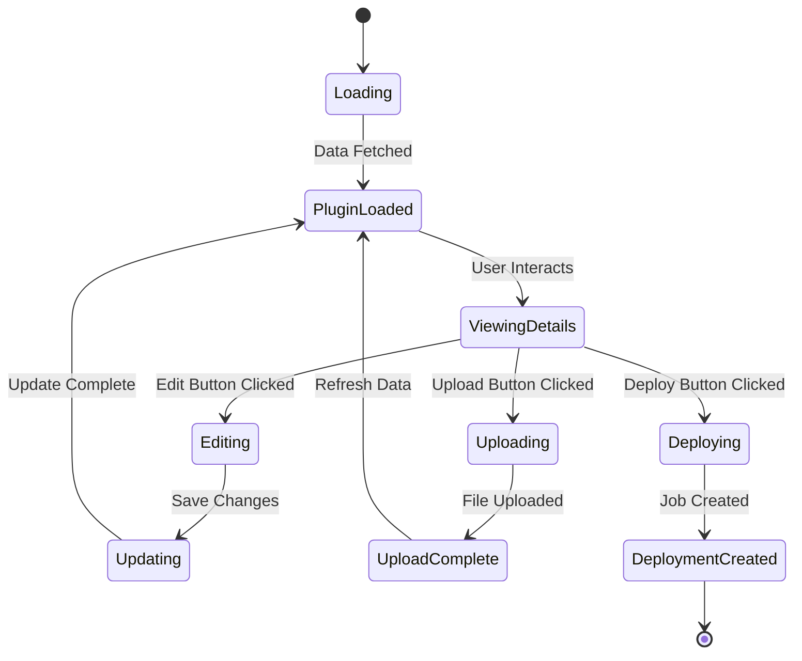

**Diagram sources**
- [plugins/[id]/page.tsx:62-612](file://portal/frontend/src/app/(dashboard)/plugins/[id]/page.tsx#L62-L612)

**Section sources**
- [plugins/[id]/page.tsx:1-613](file://portal/frontend/src/app/(dashboard)/plugins/[id]/page.tsx#L1-L613)
- [deploy-dialog.tsx:1-280](file://portal/frontend/src/components/plugins/deploy-dialog.tsx#L1-L280)

## Deployment Monitoring

### Real-Time Deployment Tracking
The deployment detail page implements sophisticated real-time monitoring with automatic polling and comprehensive status visualization.

**Monitoring Features:**
- Auto-polling for progress updates (3-second intervals)
- Full data refresh (10-second intervals)
- Live status badges with color coding
- Progress bar with multi-color segments
- Detailed metrics cards (success rate, failure rate, pending, running)
- Per-site status table with filtering and search
- Live log events with timestamped entries

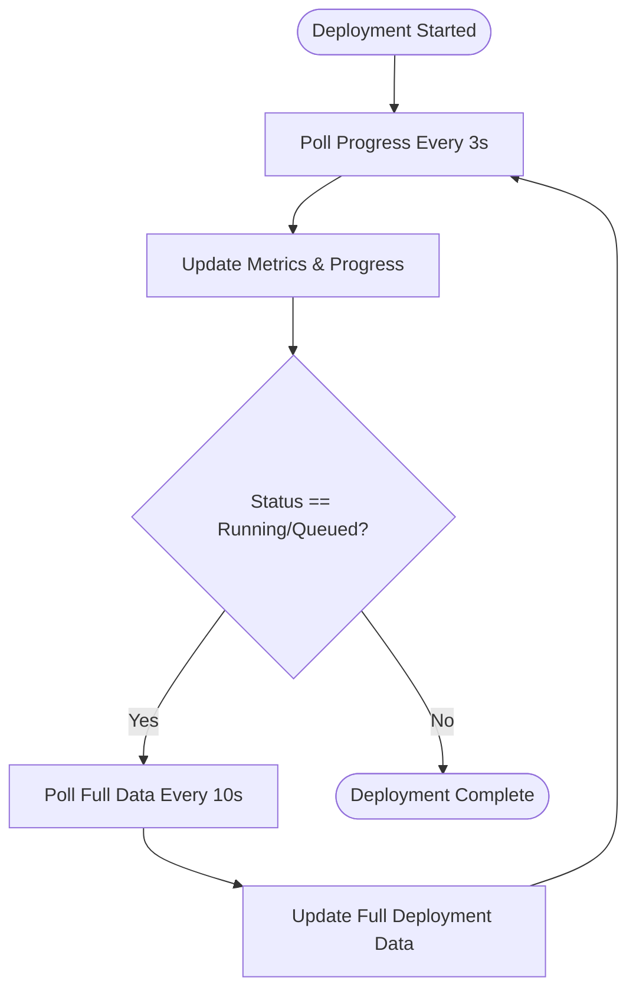

**Diagram sources**
- [deployments/[id]/page.tsx:89-109](file://portal/frontend/src/app/(dashboard)/deployments/[id]/page.tsx#L89-L109)

**Section sources**
- [deployments/[id]/page.tsx:1-794](file://portal/frontend/src/app/(dashboard)/deployments/[id]/page.tsx#L1-L794)

## Site Management Interfaces

### Comprehensive Site Detail Pages
The site management system provides dedicated tabs for different aspects of site administration.

**Available Tabs:**
- Overview: Basic site information and status
- Plugins: Plugin installation and update management
- Orders: Order synchronization (future implementation)
- SMTP: Email configuration (future implementation)
- Credentials: Secure credential vault with PIN protection
- Activity: Audit trail and user activity logs

### Site Plugins Tab
The plugins tab displays installed plugins with version comparison and update status.

**Features:**
- Plugin name, slug, and version information
- Outdated status indicators
- Active/inactive status display
- Last synced timestamp
- Direct navigation to plugin details

### Site Credentials Tab
The credentials tab provides secure credential management with PIN protection and sharing capabilities.

**Security Features:**
- PIN-protected credential reveal with timed visibility
- Copy-to-clipboard functionality with visual feedback
- Sensitive field masking with eye icon toggles
- Admin-only credential deletion
- Vault audit log integration

**Section sources**
- [sites/[id]/page.tsx:1-400](file://portal/frontend/src/app/(dashboard)/sites/[id]/page.tsx#L1-L400)
- [site-plugins-tab.tsx:1-152](file://portal/frontend/src/components/sites/site-plugins-tab.tsx#L1-L152)
- [site-credentials-tab.tsx:1-704](file://portal/frontend/src/components/sites/site-credentials-tab.tsx#L1-L704)
- [site-activity-tab.tsx:1-174](file://portal/frontend/src/components/sites/site-activity-tab.tsx#L1-L174)

## Vault Credential Management

### Comprehensive Credential Form System
The credential form dialog provides a sophisticated interface for managing various types of credentials with pre-defined templates and custom field support.

**Credential Types and Templates:**
- WordPress: Admin URL, Username, Password, Email
- Hosting: Provider, Login URL, Login Email, Password
- FTP/SFTP: Host, Port, Username, Password
- Database: Host, Database Name, Username, Password
- Custom: Flexible field definitions with sensitivity flags

**Security Features:**
- PIN-protected credential creation and updates
- Sensitive field masking with toggle visibility
- Custom field management with key-value pairs
- Field sensitivity indicators and secure handling
- Edit mode preserves existing sensitive values

**PIN Verification Workflow:**
1. User selects credential type and enters label
2. Predefined fields populate automatically (or custom fields for custom types)
3. Submit triggers PIN modal for verification
4. Successful PIN verification saves credential securely
5. Error handling for invalid PIN attempts with attempt counters

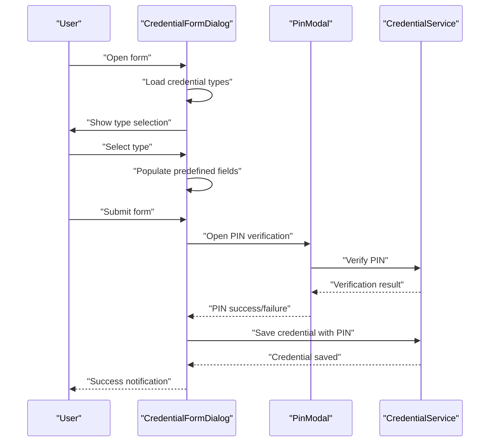

**Diagram sources**
- [credential-form-dialog.tsx:195-257](file://portal/frontend/src/components/vault/credential-form-dialog.tsx#L195-L257)
- [pin-modal.tsx:81-115](file://portal/frontend/src/components/vault/pin-modal.tsx#L81-L115)
- [credentials.ts:11-18](file://portal/frontend/src/lib/services/credentials.ts#L11-L18)

**Section sources**
- [credential-form-dialog.tsx:1-478](file://portal/frontend/src/components/vault/credential-form-dialog.tsx#L1-L478)

### Vault PIN Management Components
The vault PIN system consists of several interconnected components:

**PinModal Component:**
- 6-digit PIN input with numpad interface
- Real-time validation with error states
- Lockout handling with 15-minute cooldown
- Keyboard support for accessibility
- Visual feedback with animated dots

**PinSetupDialog Component:**
- Two-step PIN setup process
- Confirmation validation
- Success state with completion animation
- Error handling with user guidance

**PinSetupBanner Component:**
- Non-intrusive banner prompting PIN setup
- Amber warning styling for security emphasis
- Direct link to setup dialog
- Automatic user data refresh after setup

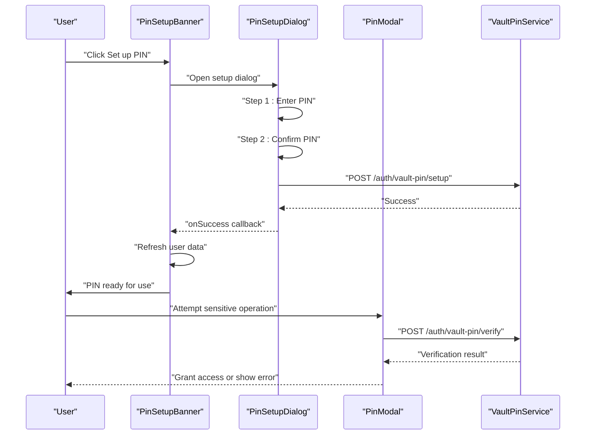

**Diagram sources**
- [pin-setup-banner.tsx:9-48](file://portal/frontend/src/components/vault/pin-setup-banner.tsx#L9-L48)
- [pin-setup-dialog.tsx:27-125](file://portal/frontend/src/components/vault/pin-setup-dialog.tsx#L27-L125)
- [pin-modal.tsx:28-115](file://portal/frontend/src/components/vault/pin-modal.tsx#L28-L115)

**Section sources**
- [pin-modal.tsx:1-222](file://portal/frontend/src/components/vault/pin-modal.tsx#L1-L222)
- [pin-setup-dialog.tsx:1-267](file://portal/frontend/src/components/vault/pin-setup-dialog.tsx#L1-L267)
- [pin-setup-banner.tsx:1-49](file://portal/frontend/src/components/vault/pin-setup-banner.tsx#L1-L49)

## Security-Focused UI Components

### Security Dashboard
The security dashboard provides centralized monitoring and management of security-related operations.

**Key Features:**
- Security score visualization and trends
- Recent security alerts and notifications
- 2FA status monitoring across users
- Credential vault usage statistics
- Security event timeline

### Security 2FA Management
The 2FA management interface allows administrators to configure and monitor two-factor authentication settings.

**Management Capabilities:**
- 2FA enrollment status tracking
- Individual user 2FA configuration
- QR code generation for setup
- Backup code management
- 2FA enforcement policies

### Security Alerts Interface
The security alerts system provides real-time monitoring of security events and threats.

**Alert Types:**
- Login attempt monitoring
- Suspicious IP address detection
- Failed authentication attempts
- Security policy violations
- System integrity alerts

**Section sources**
- [security/[...]/page.tsx](file://portal/frontend/src/app/(dashboard)/security/page.tsx)
- [security/2fa/page.tsx](file://portal/frontend/src/app/(dashboard)/security/2fa/page.tsx)
- [security/alerts/page.tsx](file://portal/frontend/src/app/(dashboard)/security/alerts/page.tsx)

## Credential Sharing System

### Share Credentials Dialog
The credential sharing system enables secure, time-limited sharing of credentials with granular control over access permissions.

**Sharing Options:**
- Select specific credential types to share
- Set expiration time (12h, 24h, 48h, 7 days)
- Limit maximum views (1, 2, 5, unlimited)
- Optional password protection
- Real-time link generation

**Security Features:**
- Encrypted credential transmission
- Automatic link revocation
- Access tracking and audit logs
- IP address monitoring
- Time-based expiration

### Active Share Links Management
Administrators can monitor and manage all active credential sharing links.

**Link Management:**
- View all generated share links
- Monitor usage statistics (views, expiry, IP)
- Immediate revocation capability
- Status indicators (active, expired, exhausted, revoked)
- Creator attribution and timestamps

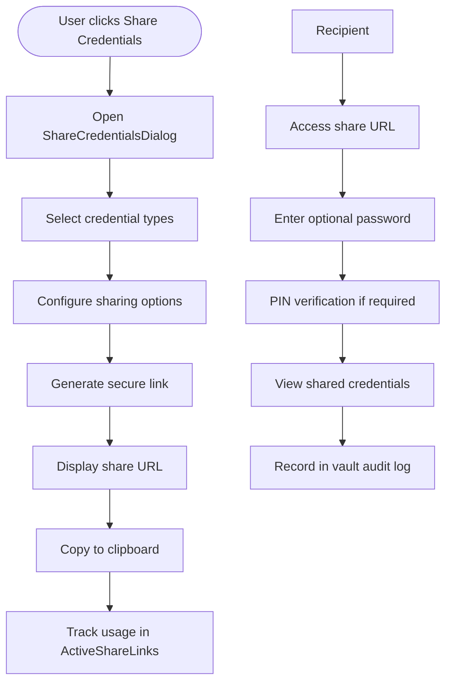

**Diagram sources**
- [share-credentials-dialog.tsx:57-138](file://portal/frontend/src/components/vault/share-credentials-dialog.tsx#L57-L138)
- [active-share-links.tsx:34-82](file://portal/frontend/src/components/vault/active-share-links.tsx#L34-L82)

**Section sources**
- [share-credentials-dialog.tsx:1-341](file://portal/frontend/src/components/vault/share-credentials-dialog.tsx#L1-L341)
- [active-share-links.tsx:1-321](file://portal/frontend/src/components/vault/active-share-links.tsx#L1-L321)

## Vault Audit and Monitoring

### Vault Audit Log System
The vault audit log provides comprehensive tracking of all credential vault activities with filtering and pagination capabilities.

**Audit Event Types:**
- Credential viewing and copying
- PIN verification attempts
- Share link creation and access
- Credential modifications
- System-generated security events

**Filtering and Search:**
- Action-type filtering (viewed, copied, edited, etc.)
- Pagination with 20 entries per page
- Real-time refresh capability
- Relative timestamp formatting

**Security Monitoring:**
- IP address tracking for all events
- User attribution for administrative actions
- Automatic cleanup of old audit entries
- Export capabilities for compliance

### Vault Share Access Flow
The vault share system implements a secure access flow for external credential sharing.

**Public Access Flow:**
1. Recipient accesses share URL with token
2. Optional password verification (if enabled)
3. PIN verification for sensitive operations
4. Credential data retrieval with temporary exposure
5. Automatic cleanup and audit logging

**Section sources**
- [vault-audit-log.tsx:1-264](file://portal/frontend/src/components/vault/vault-audit-log.tsx#L1-L264)

## Dashboard and Analytics

### Dashboard Statistics Service
The dashboard service provides comprehensive analytics and overview data for system monitoring.

**Available Metrics:**
- Total sites count
- Online/offline site distribution
- New sites this month
- Pending plugin updates
- Sites requiring updates
- Recent sites activity
- Recent system activity

**Section sources**
- [dashboard.ts:1-37](file://portal/frontend/src/lib/services/dashboard.ts#L1-L37)
- [index.ts:3-32](file://portal/frontend/src/types/index.ts#L3-L32)

## Dependency Analysis
External dependencies and their roles:
- Next.js runtime and App Router.
- React 19 and React DOM.
- Axios for HTTP requests.
- Tailwind CSS v4 for styling and theme tokens.
- Base UI primitives for accessible components.
- Zustand for lightweight state management.
- Recharts, date-fns, cmdk, lucide-react for charts, dates, commands, and icons.
- next-themes for theme switching.
- Tailwind merge and class variance authority for class composition.

Build and toolchain:
- TypeScript compiler with bundler module resolution and path aliases.
- ESLint with Next.js recommended config.
- PostCSS/Tailwind CSS pipeline.

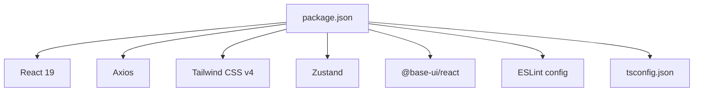

**Diagram sources**
- [package.json:1-43](file://portal/frontend/package.json#L1-L43)
- [tsconfig.json:1-35](file://portal/frontend/tsconfig.json#L1-L35)

**Section sources**
- [package.json:1-43](file://portal/frontend/package.json#L1-L43)
- [tsconfig.json:1-35](file://portal/frontend/tsconfig.json#L1-L35)

## Performance Considerations
- Client-side hydration and skeleton loading reduce perceived latency during auth initialization.
- Local storage caching minimizes repeated network calls for token presence.
- Request/response interceptors centralize auth and error handling to avoid duplication.
- Tailwind v4's tree-shaking and CSS-in-JS theme tokens help keep bundles lean.
- Prefer server components for static content and leverage Next.js image optimization for assets.
- **Updated** Implement efficient polling strategies with proper cleanup to prevent memory leaks.
- **Updated** Use component-level memoization for expensive computations in deployment monitoring.
- **Updated** Optimize API calls with pagination and selective data fetching.
- **Updated** Implement debounced input handling for PIN entry components to reduce API calls.
- **Updated** Use virtualized lists for large audit log tables to improve rendering performance.
- **Updated** Cache credential types and share link data to minimize repeated API calls.
- **Updated** Implement request deduplication for concurrent credential access operations.

## Troubleshooting Guide
Common issues and resolutions:
- 401 Unauthorized: The API client removes the token and redirects to login automatically.
- Missing API URL: The client falls back to "/api"; configure NEXT_PUBLIC_API_URL for production.
- Auth hydration loop: Ensure hydration runs once on mount and does not trigger unnecessary re-renders.
- Responsive layout glitches: Verify useIsMobile hook matches Tailwind breakpoints and adjust layout logic accordingly.
- **Updated** Deployment monitoring not updating: Check polling intervals and ensure proper cleanup of intervals.
- **Updated** Plugin upload failures: Verify file size limits and supported formats in upload dialog.
- **Updated** Credential PIN validation errors: Ensure proper PIN length and verify with backend authentication.
- **Updated** Vault PIN lockout: Users receive 15-minute lockout after failed attempts; check admin notifications.
- **Updated** Share link access issues: Verify link expiration, view limits, and password requirements.
- **Updated** Audit log filtering problems: Check action filter values and pagination parameters.
- **Updated** Credential form submission failures: Verify PIN verification before saving sensitive data.
- **Updated** Credential reveal timeouts: Check PIN verification and ensure proper credential field selection.

**Section sources**
- [api.ts:22-34](file://portal/frontend/src/lib/api.ts#L22-L34)
- [api.ts:4-9](file://portal/frontend/src/lib/api.ts#L4-L9)
- [auth-store.ts:23-33](file://portal/frontend/src/stores/auth-store.ts#L23-L33)
- [use-mobile.ts:1-20](file://portal/frontend/src/hooks/use-mobile.ts#L1-L20)

## Conclusion
The frontend employs a clean, modular architecture with strong separation of concerns. App Router pages and nested layouts provide a scalable routing model. Zustand simplifies state management for authentication, while a centralized API client ensures consistent request/response handling. The UI component library leverages Tailwind CSS v4 and shadcn primitives for maintainable, accessible components. With responsive hooks, theme tokens, and performance-conscious patterns, the application is well-positioned for growth and maintenance.

**Updated** The enhanced architecture now supports comprehensive credential vault management system featuring secure credential storage with PIN protection, sophisticated credential sharing with time-based access control, extensive audit logging with filtering and pagination, and integrated security monitoring interfaces. The expanded service layer provides robust APIs for all major functional areas, while the component architecture ensures maintainable and scalable user interfaces with strong security guarantees and comprehensive access control mechanisms.

## Appendices

### Build System Configuration
- Next.js configuration defines API rewrites for development proxying.
- TypeScript configuration enables strict mode, bundler module resolution, and path aliases.
- Tailwind v4 configured via components.json with shadcn integration and custom CSS variables.

**Section sources**
- [next.config.ts:1-15](file://portal/frontend/next.config.ts#L1-L15)
- [tsconfig.json:1-35](file://portal/frontend/tsconfig.json#L1-L35)
- [components.json:1-26](file://portal/frontend/components.json#L1-L26)

### Environment Variables Handling
- NEXT_PUBLIC_API_URL controls the backend base URL for the browser.
- NEXT_PUBLIC_* variables are exposed to the client; keep sensitive secrets server-side.

**Section sources**
- [api.ts:4-9](file://portal/frontend/src/lib/api.ts#L4-L9)

### Deployment Considerations
- Build artifacts are produced by Next.js build; serve statically or via Next.js start in production.
- Configure API rewrites appropriately for production backend endpoints.
- Ensure environment variables are set for NEXT_PUBLIC_API_URL and any backend-dependent settings.
- **Updated** Implement proper cleanup of polling intervals and WebSocket connections on component unmount.
- **Updated** Consider implementing request deduplication to prevent multiple simultaneous API calls.
- **Updated** Use secure cookie settings for authentication and session management.
- **Updated** Implement rate limiting for PIN verification and credential access endpoints.
- **Updated** Cache frequently accessed credential types and share link data to improve performance.
- **Updated** Implement graceful error handling for network failures in credential operations.

**Section sources**
- [next.config.ts:4-11](file://portal/frontend/next.config.ts#L4-L11)
- [package.json:5-10](file://portal/frontend/package.json#L5-L10)