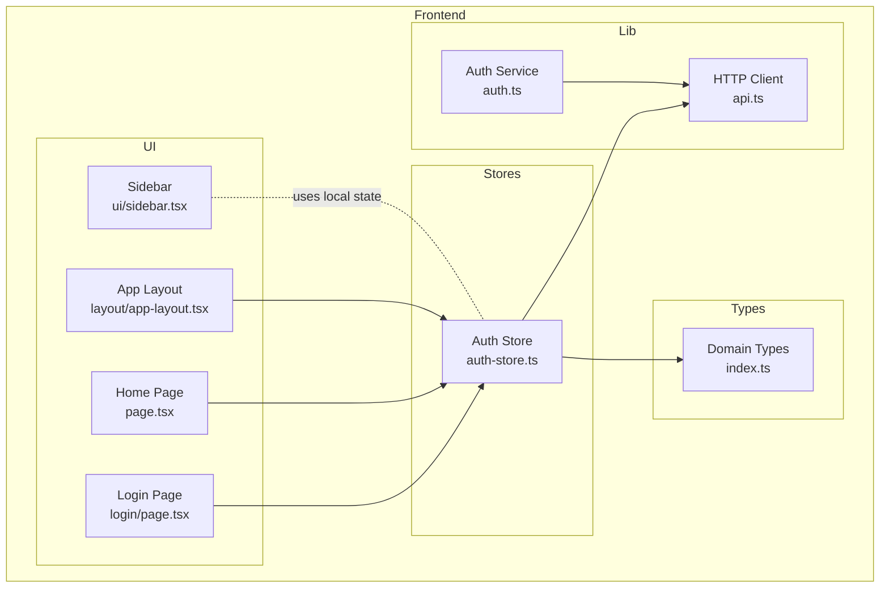
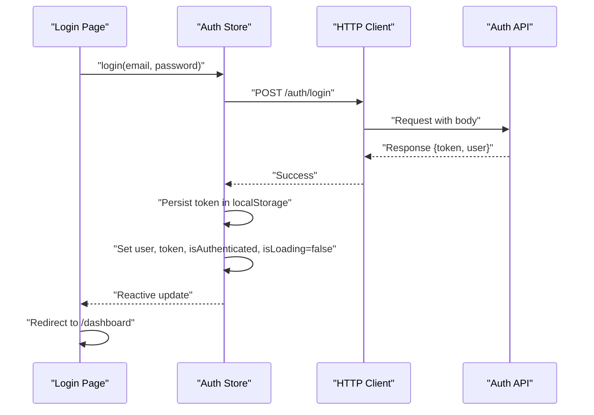
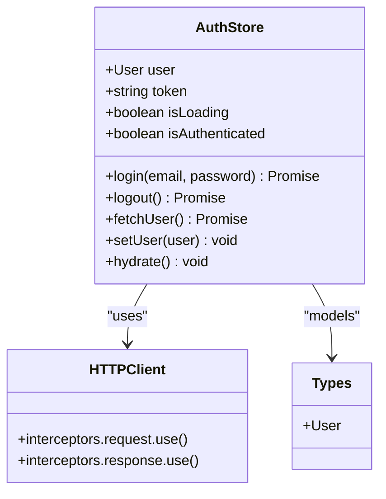
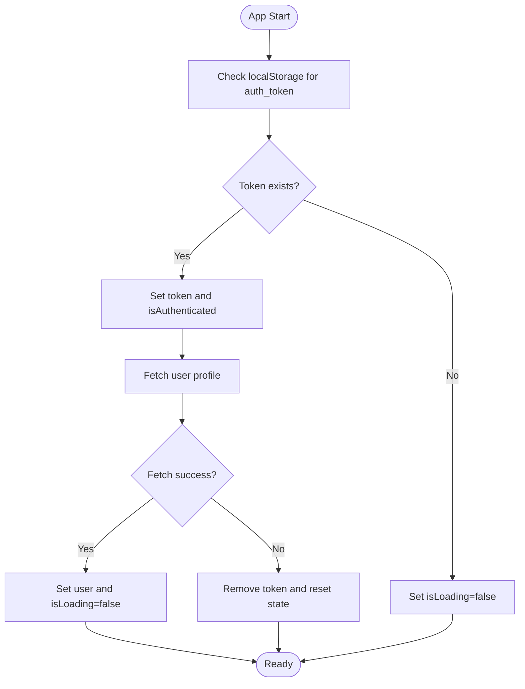
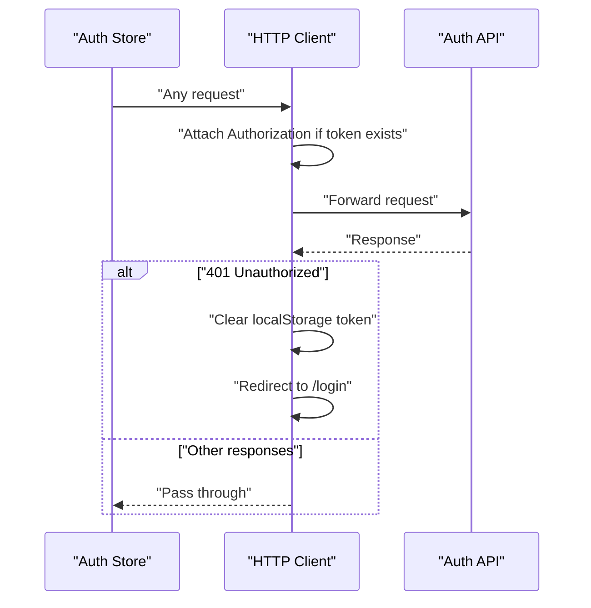
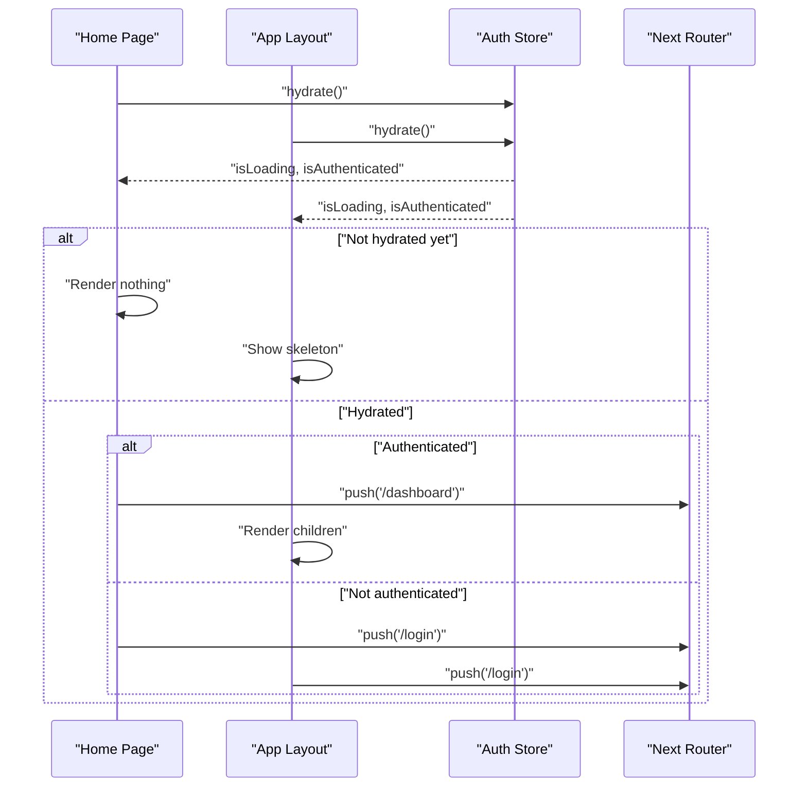
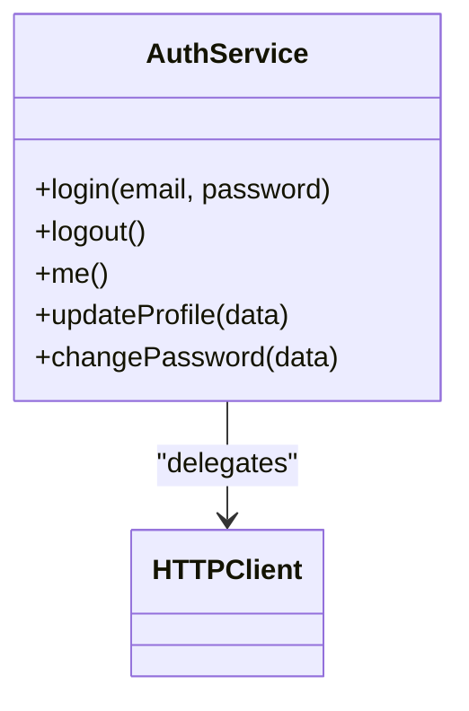
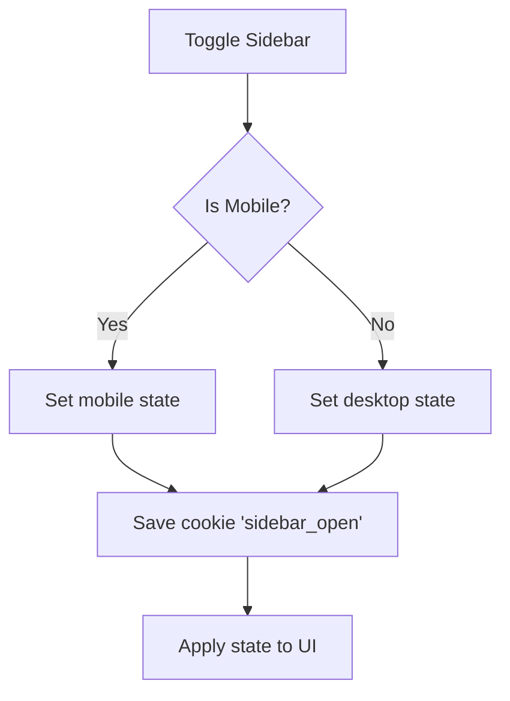
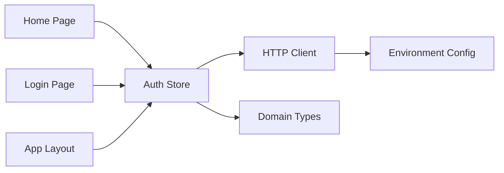

# State Management

<cite>
**Referenced Files in This Document**
- [auth-store.ts](file://portal/frontend/src/stores/auth-store.ts)
- [api.ts](file://portal/frontend/src/lib/api.ts)
- [index.ts](file://portal/frontend/src/types/index.ts)
- [page.tsx](file://portal/frontend/src/app/login/page.tsx)
- [page.tsx](file://portal/frontend/src/app/page.tsx)
- [app-layout.tsx](file://portal/frontend/src/components/layout/app-layout.tsx)
- [sidebar.tsx](file://portal/frontend/src/components/ui/sidebar.tsx)
- [next.config.ts](file://portal/frontend/next.config.ts)
- [auth.ts](file://portal/frontend/src/lib/services/auth.ts)
</cite>

## Table of Contents
1. [Introduction](#introduction)
2. [Project Structure](#project-structure)
3. [Core Components](#core-components)
4. [Architecture Overview](#architecture-overview)
5. [Detailed Component Analysis](#detailed-component-analysis)
6. [Dependency Analysis](#dependency-analysis)
7. [Performance Considerations](#performance-considerations)
8. [Troubleshooting Guide](#troubleshooting-guide)
9. [Conclusion](#conclusion)

## Introduction
This document explains the state management system built around a custom Zustand store for authentication, session handling, and user context. It covers store patterns, state update mechanisms, reactive state changes, custom hooks, utility functions, and persistence strategies. It also addresses integration with Next.js App Router, server-side rendering considerations, hydration patterns, error handling, synchronization, performance optimization, memory management, and debugging techniques.

## Project Structure
The state management system centers on a single store module and supporting utilities:
- Authentication store: defines state shape, actions, and persistence
- HTTP client: central Axios instance with interceptors for auth tokens and 401 handling
- Types: shared TypeScript interfaces for domain models
- UI pages and layouts: consume the store via hooks and drive navigation and hydration
- Services: thin wrappers around the HTTP client for auth-related operations

**Diagram sources**
- [auth-store.ts:1-64](file://portal/frontend/src/stores/auth-store.ts#L1-L64)
- [api.ts:1-37](file://portal/frontend/src/lib/api.ts#L1-L37)
- [index.ts:1-58](file://portal/frontend/src/types/index.ts#L1-L58)
- [page.tsx:1-60](file://portal/frontend/src/app/login/page.tsx#L1-L60)
- [page.tsx:1-26](file://portal/frontend/src/app/page.tsx#L1-L26)
- [app-layout.tsx:1-49](file://portal/frontend/src/components/layout/app-layout.tsx#L1-L49)
- [sidebar.tsx:53-94](file://portal/frontend/src/components/ui/sidebar.tsx#L53-L94)
- [auth.ts:1-16](file://portal/frontend/src/lib/services/auth.ts#L1-L16)

**Section sources**
- [auth-store.ts:1-64](file://portal/frontend/src/stores/auth-store.ts#L1-L64)
- [api.ts:1-37](file://portal/frontend/src/lib/api.ts#L1-L37)
- [index.ts:1-58](file://portal/frontend/src/types/index.ts#L1-L58)
- [page.tsx:1-60](file://portal/frontend/src/app/login/page.tsx#L1-L60)
- [page.tsx:1-26](file://portal/frontend/src/app/page.tsx#L1-L26)
- [app-layout.tsx:1-49](file://portal/frontend/src/components/layout/app-layout.tsx#L1-L49)
- [sidebar.tsx:53-94](file://portal/frontend/src/components/ui/sidebar.tsx#L53-L94)
- [auth.ts:1-16](file://portal/frontend/src/lib/services/auth.ts#L1-L16)

## Core Components
- Auth store: exposes user, token, loading, and authentication flags; provides login, logout, user fetch, setter, and hydration
- HTTP client: centralized Axios instance with request/response interceptors for token injection and 401 handling
- Domain types: strongly typed models for user, hosting, site, and API response/error shapes
- UI integration: pages and layout coordinate navigation and hydration using the store
- Auth service: convenience wrapper for auth endpoints

Key responsibilities:
- State shape and actions: define and encapsulate auth state transitions
- Persistence: persist token in local storage and hydrate on app start
- Reactive updates: store updates trigger component re-renders automatically
- Session handling: automatic logout on 401 via interceptors
- Navigation: redirect based on hydration and authentication state

**Section sources**
- [auth-store.ts:5-15](file://portal/frontend/src/stores/auth-store.ts#L5-L15)
- [auth-store.ts:17-63](file://portal/frontend/src/stores/auth-store.ts#L17-L63)
- [api.ts:11-34](file://portal/frontend/src/lib/api.ts#L11-L34)
- [index.ts:1-10](file://portal/frontend/src/types/index.ts#L1-L10)
- [page.tsx:18-34](file://portal/frontend/src/app/login/page.tsx#L18-L34)
- [page.tsx:7-23](file://portal/frontend/src/app/page.tsx#L7-L23)
- [app-layout.tsx:10-22](file://portal/frontend/src/components/layout/app-layout.tsx#L10-L22)
- [auth.ts:3-15](file://portal/frontend/src/lib/services/auth.ts#L3-L15)

## Architecture Overview
The system follows a unidirectional data flow:
- UI triggers actions via the store hook
- Store performs async operations (login, fetch user)
- HTTP client handles requests and responses
- On success, store updates state; on 401, client clears token and redirects
- Components reactively re-render based on store changes

**Diagram sources**
- [page.tsx:36-52](file://portal/frontend/src/app/login/page.tsx#L36-L52)
- [auth-store.ts:35-40](file://portal/frontend/src/stores/auth-store.ts#L35-L40)
- [api.ts:3-9](file://portal/frontend/src/lib/api.ts#L3-L9)

## Detailed Component Analysis

### Auth Store
The store encapsulates authentication state and actions:
- State fields: user, token, isLoading, isAuthenticated
- Actions:
  - login: posts credentials, persists token, sets user and flags
  - logout: posts logout, clears token and state
  - fetchUser: loads current user profile
  - setUser: sets user without network call
  - hydrate: restores state from localStorage on app start

**Diagram sources**
- [auth-store.ts:5-15](file://portal/frontend/src/stores/auth-store.ts#L5-L15)
- [auth-store.ts:17-63](file://portal/frontend/src/stores/auth-store.ts#L17-L63)
- [api.ts:11-34](file://portal/frontend/src/lib/api.ts#L11-L34)
- [index.ts:1-10](file://portal/frontend/src/types/index.ts#L1-L10)

**Section sources**
- [auth-store.ts:5-15](file://portal/frontend/src/stores/auth-store.ts#L5-L15)
- [auth-store.ts:17-63](file://portal/frontend/src/stores/auth-store.ts#L17-L63)

### Hydration and SSR Considerations
- Hydration pattern: on app start, the store reads the token from localStorage and conditionally fetches the user profile
- Loading state: isLoading prevents premature navigation until hydration completes
- Redirects: after hydration, components redirect based on isAuthenticated and isLoading
- Next.js App Router: pages opt into client behavior and coordinate hydration and routing

**Diagram sources**
- [auth-store.ts:23-33](file://portal/frontend/src/stores/auth-store.ts#L23-L33)
- [auth-store.ts:52-60](file://portal/frontend/src/stores/auth-store.ts#L52-L60)
- [page.tsx:11-23](file://portal/frontend/src/app/page.tsx#L11-L23)
- [page.tsx:26-34](file://portal/frontend/src/app/login/page.tsx#L26-L34)
- [app-layout.tsx:14-22](file://portal/frontend/src/components/layout/app-layout.tsx#L14-L22)

**Section sources**
- [auth-store.ts:23-33](file://portal/frontend/src/stores/auth-store.ts#L23-L33)
- [auth-store.ts:52-60](file://portal/frontend/src/stores/auth-store.ts#L52-L60)
- [page.tsx:11-23](file://portal/frontend/src/app/page.tsx#L11-L23)
- [page.tsx:26-34](file://portal/frontend/src/app/login/page.tsx#L26-L34)
- [app-layout.tsx:14-22](file://portal/frontend/src/components/layout/app-layout.tsx#L14-L22)

### HTTP Client and Interceptors
- Request interceptor: attaches Authorization header when token is present
- Response interceptor: on 401, clears token and navigates to login
- Centralized base URL and headers

**Diagram sources**
- [api.ts:11-34](file://portal/frontend/src/lib/api.ts#L11-L34)
- [auth-store.ts:35-40](file://portal/frontend/src/stores/auth-store.ts#L35-L40)
- [auth-store.ts:42-50](file://portal/frontend/src/stores/auth-store.ts#L42-L50)

**Section sources**
- [api.ts:11-34](file://portal/frontend/src/lib/api.ts#L11-L34)

### UI Integration and Navigation
- Login page: initializes hydration, handles form submission, redirects on success
- Home page: coordinates initial redirect based on hydration outcome
- App layout: guards protected routes during hydration and redirects unauthorized users

**Diagram sources**
- [page.tsx:7-23](file://portal/frontend/src/app/page.tsx#L7-L23)
- [app-layout.tsx:10-22](file://portal/frontend/src/components/layout/app-layout.tsx#L10-L22)
- [auth-store.ts:23-33](file://portal/frontend/src/stores/auth-store.ts#L23-L33)

**Section sources**
- [page.tsx:7-23](file://portal/frontend/src/app/page.tsx#L7-L23)
- [app-layout.tsx:10-22](file://portal/frontend/src/components/layout/app-layout.tsx#L10-L22)

### Auth Service Wrapper
A thin service layer wraps the HTTP client for auth operations, enabling testability and reuse.

**Diagram sources**
- [auth.ts:3-15](file://portal/frontend/src/lib/services/auth.ts#L3-L15)
- [api.ts:1-37](file://portal/frontend/src/lib/api.ts#L1-L37)

**Section sources**
- [auth.ts:3-15](file://portal/frontend/src/lib/services/auth.ts#L3-L15)

### Sidebar State Persistence (Local Cookie)
The sidebar component persists its open/closed state in a cookie to maintain UX continuity across reloads. While not part of the auth store, it demonstrates complementary persistence strategies.

**Diagram sources**
- [sidebar.tsx:69-94](file://portal/frontend/src/components/ui/sidebar.tsx#L69-L94)

**Section sources**
- [sidebar.tsx:69-94](file://portal/frontend/src/components/ui/sidebar.tsx#L69-L94)

## Dependency Analysis
- Auth store depends on:
  - HTTP client for network calls
  - Domain types for typing
- HTTP client depends on:
  - Environment configuration for base URL
  - Local storage for token persistence
- Pages and layout depend on:
  - Auth store for state and hydration
  - Router for navigation

**Diagram sources**
- [page.tsx:1-26](file://portal/frontend/src/app/page.tsx#L1-L26)
- [page.tsx:1-60](file://portal/frontend/src/app/login/page.tsx#L1-L60)
- [app-layout.tsx:1-49](file://portal/frontend/src/components/layout/app-layout.tsx#L1-L49)
- [auth-store.ts:1-6](file://portal/frontend/src/stores/auth-store.ts#L1-L6)
- [api.ts:3-9](file://portal/frontend/src/lib/api.ts#L3-L9)
- [index.ts:1-10](file://portal/frontend/src/types/index.ts#L1-L10)

**Section sources**
- [auth-store.ts:1-6](file://portal/frontend/src/stores/auth-store.ts#L1-L6)
- [api.ts:3-9](file://portal/frontend/src/lib/api.ts#L3-L9)
- [index.ts:1-10](file://portal/frontend/src/types/index.ts#L1-L10)
- [page.tsx:1-26](file://portal/frontend/src/app/page.tsx#L1-L26)
- [page.tsx:1-60](file://portal/frontend/src/app/login/page.tsx#L1-L60)
- [app-layout.tsx:1-49](file://portal/frontend/src/components/layout/app-layout.tsx#L1-L49)

## Performance Considerations
- Minimize unnecessary re-renders:
  - Keep the store slice small; avoid storing large derived data
  - Use setters for partial updates when appropriate
- Debounce or batch UI updates if adding frequent state changes
- Avoid heavy computations inside selectors; compute once and memoize
- Prefer shallow equality for object updates to reduce churn
- Limit concurrent network calls; coalesce login and fetchUser calls as done in hydration
- Use skeleton loaders during hydration to improve perceived performance
- Persist only essential data (token) to localStorage; avoid large payloads

[No sources needed since this section provides general guidance]

## Troubleshooting Guide
Common issues and resolutions:
- Stuck in loading state:
  - Verify hydration runs on app start and that localStorage token is present
  - Ensure fetchUser resolves; check network tab for failures
- Unexpected redirects to login:
  - Confirm 401 interceptor clears token and navigates
  - Check that Authorization header is attached on subsequent requests
- Token mismatch or stale state:
  - Ensure logout clears token and resets state
  - Confirm login writes token and sets user
- Hydration race conditions:
  - Guard route rendering until hydration completes (isLoading flag)
  - Use skeleton UI while loading

**Section sources**
- [auth-store.ts:23-33](file://portal/frontend/src/stores/auth-store.ts#L23-L33)
- [auth-store.ts:52-60](file://portal/frontend/src/stores/auth-store.ts#L52-L60)
- [api.ts:22-34](file://portal/frontend/src/lib/api.ts#L22-L34)

## Conclusion
The state management system leverages a compact Zustand store, a centralized HTTP client with interceptors, and strong TypeScript types to provide robust authentication state handling. Hydration ensures seamless transitions across browser refreshes, while interceptors manage session integrity. UI pages and layouts coordinate hydration and navigation to deliver a coherent user experience. The design supports scalability, maintainability, and predictable state updates, with clear patterns for persistence, error handling, and performance.