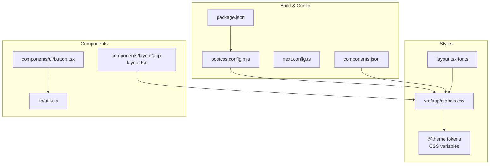
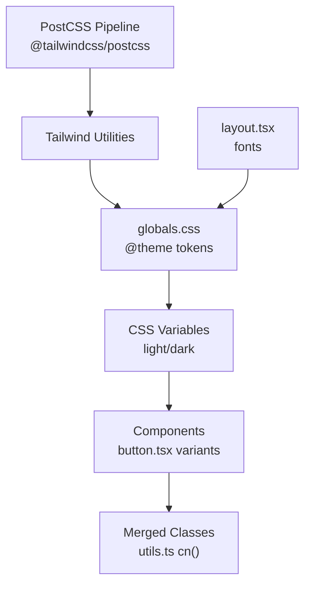
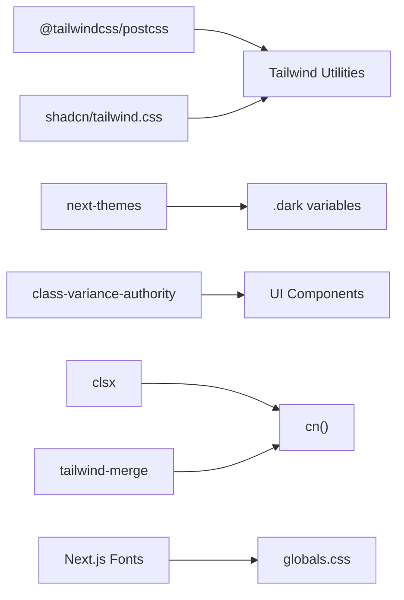

# Styling & Theming

<cite>
**Referenced Files in This Document**
- [package.json](file://portal/frontend/package.json)
- [postcss.config.mjs](file://portal/frontend/postcss.config.mjs)
- [next.config.ts](file://portal/frontend/next.config.ts)
- [components.json](file://portal/frontend/components.json)
- [globals.css](file://portal/frontend/src/app/globals.css)
- [layout.tsx](file://portal/frontend/src/app/layout.tsx)
- [app-layout.tsx](file://portal/frontend/src/components/layout/app-layout.tsx)
- [button.tsx](file://portal/frontend/src/components/ui/button.tsx)
- [utils.ts](file://portal/frontend/src/lib/utils.ts)
</cite>

## Table of Contents
1. [Introduction](#introduction)
2. [Project Structure](#project-structure)
3. [Core Components](#core-components)
4. [Architecture Overview](#architecture-overview)
5. [Detailed Component Analysis](#detailed-component-analysis)
6. [Dependency Analysis](#dependency-analysis)
7. [Performance Considerations](#performance-considerations)
8. [Troubleshooting Guide](#troubleshooting-guide)
9. [Conclusion](#conclusion)

## Introduction
This document explains the styling and theming system built with TailwindCSS v4 and custom CSS in the frontend application. It covers the Tailwind configuration, design tokens, color system, typography scale, spacing units, component variants, dark mode implementation, theme switching, responsive design patterns, CSS architecture, utility-first approach, and component styling conventions. It also provides examples of custom styles, animations, and interactive states, along with performance optimization and browser compatibility considerations.

## Project Structure
The styling system is organized around:
- TailwindCSS v4 via PostCSS plugin
- Design tokens defined in CSS variables and consumed via @theme
- Utility-first components using class-variance-authority and clsx/tailwind-merge
- Dark mode via CSS custom properties and a custom dark variant
- Responsive patterns integrated with component variants

**Diagram sources**
- [postcss.config.mjs:1-8](file://portal/frontend/postcss.config.mjs#L1-L8)
- [components.json:1-26](file://portal/frontend/components.json#L1-L26)
- [globals.css:1-130](file://portal/frontend/src/app/globals.css#L1-L130)
- [layout.tsx:1-38](file://portal/frontend/src/app/layout.tsx#L1-L38)
- [button.tsx:1-59](file://portal/frontend/src/components/ui/button.tsx#L1-L59)
- [utils.ts:1-7](file://portal/frontend/src/lib/utils.ts#L1-L7)
- [app-layout.tsx:1-50](file://portal/frontend/src/components/layout/app-layout.tsx#L1-L50)

**Section sources**
- [package.json:1-43](file://portal/frontend/package.json#L1-L43)
- [postcss.config.mjs:1-8](file://portal/frontend/postcss.config.mjs#L1-L8)
- [next.config.ts:1-15](file://portal/frontend/next.config.ts#L1-L15)
- [components.json:1-26](file://portal/frontend/components.json#L1-L26)
- [globals.css:1-130](file://portal/frontend/src/app/globals.css#L1-L130)
- [layout.tsx:1-38](file://portal/frontend/src/app/layout.tsx#L1-L38)
- [button.tsx:1-59](file://portal/frontend/src/components/ui/button.tsx#L1-L59)
- [utils.ts:1-7](file://portal/frontend/src/lib/utils.ts#L1-L7)
- [app-layout.tsx:1-50](file://portal/frontend/src/components/layout/app-layout.tsx#L1-L50)

## Core Components
- TailwindCSS v4 configured via PostCSS plugin
- Design tokens via CSS variables and @theme
- Dark mode using CSS custom properties and a custom dark variant
- Utility-first components with class variants and responsive modifiers
- Shared utility function for merging and deduplicating classes

Key implementation references:
- Tailwind plugin activation and PostCSS pipeline
- Design tokens and @theme mapping
- Dark mode CSS variables and custom dark variant
- Button component variants and sizes
- Utility class merging

**Section sources**
- [postcss.config.mjs:1-8](file://portal/frontend/postcss.config.mjs#L1-L8)
- [globals.css:1-130](file://portal/frontend/src/app/globals.css#L1-L130)
- [button.tsx:1-59](file://portal/frontend/src/components/ui/button.tsx#L1-L59)
- [utils.ts:1-7](file://portal/frontend/src/lib/utils.ts#L1-L7)

## Architecture Overview
The styling architecture combines:
- Build-time: TailwindCSS v4 runs through PostCSS to generate utilities
- Runtime: CSS variables define design tokens; @theme exposes them to utilities
- Theming: CSS variables switch between light and dark palettes
- Components: Variants and sizes are defined with class-variance-authority and merged with clsx/tailwind-merge
- Layout: Fonts are loaded via Next.js fonts and exposed as CSS variables

**Diagram sources**
- [postcss.config.mjs:1-8](file://portal/frontend/postcss.config.mjs#L1-L8)
- [globals.css:1-130](file://portal/frontend/src/app/globals.css#L1-L130)
- [button.tsx:1-59](file://portal/frontend/src/components/ui/button.tsx#L1-L59)
- [utils.ts:1-7](file://portal/frontend/src/lib/utils.ts#L1-L7)
- [layout.tsx:1-38](file://portal/frontend/src/app/layout.tsx#L1-L38)

## Detailed Component Analysis

### Tailwind Configuration and Build Pipeline
- TailwindCSS v4 is enabled via the PostCSS plugin.
- Next.js configuration supports rewrites but does not alter CSS processing.
- shadcn/tailwind.css is imported to align component styles with the design system.

Implementation references:
- PostCSS plugin activation
- Next.js rewrites configuration
- shadcn/tailwind.css import

**Section sources**
- [postcss.config.mjs:1-8](file://portal/frontend/postcss.config.mjs#L1-L8)
- [next.config.ts:1-15](file://portal/frontend/next.config.ts#L1-L15)
- [globals.css:1-4](file://portal/frontend/src/app/globals.css#L1-L4)

### Design Tokens and CSS Variables
- Design tokens are defined as CSS variables in :root and .dark.
- @theme maps CSS variables to Tailwind utilities for consistent usage across components.
- Tokens include background, foreground, primary/secondary/accent, borders, input/ring, and chart colors.
- Typography tokens include sans and mono fonts via Next.js fonts and CSS variables.
- Border radius tokens scale from small to extra-large using a shared radius variable.

Implementation references:
- CSS variables for light and dark themes
- @theme mapping of tokens
- Font variables from layout.tsx

**Section sources**
- [globals.css:51-118](file://portal/frontend/src/app/globals.css#L51-L118)
- [globals.css:7-49](file://portal/frontend/src/app/globals.css#L7-L49)
- [layout.tsx:6-14](file://portal/frontend/src/app/layout.tsx#L6-L14)

### Color System
- Colors are defined using oklch color space for perceptually uniform lightness and chroma.
- Light palette emphasizes subtle contrast with low saturation; dark palette increases foreground luminance while preserving readability.
- Semantic roles include primary, secondary, muted, accent, destructive, border, input, ring, and popover/card.

Implementation references:
- oklch color definitions
- Semantic color assignments
- Dark mode overrides

**Section sources**
- [globals.css:51-118](file://portal/frontend/src/app/globals.css#L51-L118)

### Typography Scale
- Sans-serif and monospace fonts are loaded via Next.js fonts and exposed as CSS variables.
- Headings and body text derive from the same font family with consistent variable names.
- Component variants adjust text sizes and weights to maintain rhythm.

Implementation references:
- Font loading and CSS variable injection
- Base layer applying font-sans to html

**Section sources**
- [layout.tsx:6-14](file://portal/frontend/src/app/layout.tsx#L6-L14)
- [globals.css:120-130](file://portal/frontend/src/app/globals.css#L120-L130)

### Spacing Units
- Spacing is derived from component variants and CSS utilities.
- Radius tokens scale proportionally from small to extra-extra-large using a base radius variable.
- Components encode padding, height, and gap using consistent units.

Implementation references:
- Radius token scaling
- Button size variants and paddings

**Section sources**
- [globals.css:42-49](file://portal/frontend/src/app/globals.css#L42-L49)
- [button.tsx:22-34](file://portal/frontend/src/components/ui/button.tsx#L22-L34)

### Component Variants and Sizes
- Variants: default, outline, secondary, ghost, destructive, link.
- Sizes: default, xs, sm, lg, and multiple icon variants.
- Interactive states: focus-visible ring, hover states, active transforms, disabled opacity, aria-invalid borders and rings.
- SVG sizing: icons inherit size unless explicitly sized.

Implementation references:
- Variant and size definitions
- Focus-visible ring and hover states
- Disabled and invalid states

**Section sources**
- [button.tsx:6-41](file://portal/frontend/src/components/ui/button.tsx#L6-L41)
- [button.tsx:43-59](file://portal/frontend/src/components/ui/button.tsx#L43-L59)

### Dark Mode Implementation and Theme Switching
- Dark mode toggles via CSS custom properties; .dark class switches variables.
- A custom dark variant enables targeting dark-mode selectors consistently.
- Theme persistence and switching are handled by next-themes integration (installed dependency).

Implementation references:
- .dark class variables
- Custom dark variant
- next-themes dependency

**Section sources**
- [globals.css:86-118](file://portal/frontend/src/app/globals.css#L86-L118)
- [globals.css:5](file://portal/frontend/src/app/globals.css#L5)
- [package.json:21](file://portal/frontend/package.json#L21)

### Responsive Design Patterns
- Components use responsive-aware utilities (e.g., lg: for sidebar layout).
- Layout components apply responsive spacing and container widths.
- Breakpoints are implicit via Tailwind utilities; no custom media queries are defined in the provided files.

Implementation references:
- Layout using lg: for sidebar position
- Component variants with responsive modifiers

**Section sources**
- [app-layout.tsx:43](file://portal/frontend/src/components/layout/app-layout.tsx#L43)
- [button.tsx:22-34](file://portal/frontend/src/components/ui/button.tsx#L22-L34)

### CSS Architecture and Utility-First Approach
- globals.css imports Tailwind, animations, and shadcn styles.
- @layer base applies foundational styles to elements and body.
- Utilities are composed per component using class-variance-authority and merged via cn().
- Design tokens unify colors, typography, and radii across components.

Implementation references:
- Import order and layers
- Utility composition and merging

**Section sources**
- [globals.css:1-130](file://portal/frontend/src/app/globals.css#L1-L130)
- [button.tsx:1-59](file://portal/frontend/src/components/ui/button.tsx#L1-L59)
- [utils.ts:1-7](file://portal/frontend/src/lib/utils.ts#L1-L7)

### Component Styling Conventions
- Each component defines a cva() with variants and sizes.
- cn() merges incoming className with computed variants, deduplicating conflicting utilities.
- Focus-visible rings and hover states are explicit for accessibility and UX.
- Icons inside components receive consistent sizing and pointer behavior.

Implementation references:
- Button variant composition
- Utility merging
- Icon sizing and pointer events

**Section sources**
- [button.tsx:6-41](file://portal/frontend/src/components/ui/button.tsx#L6-L41)
- [utils.ts:4-6](file://portal/frontend/src/lib/utils.ts#L4-L6)

### Examples of Custom Styles, Animations, and Interactive States
- Animations: tw-animate-css is imported for motion primitives.
- Interactive states: focus-visible ring, hover, active, disabled, and aria-invalid states.
- Custom dark variant: enables dark-mode-specific selectors.

Implementation references:
- tw-animate-css import
- Focus and hover utilities
- Dark variant selector

**Section sources**
- [globals.css:2](file://portal/frontend/src/app/globals.css#L2)
- [button.tsx:7](file://portal/frontend/src/components/ui/button.tsx#L7)
- [globals.css:5](file://portal/frontend/src/app/globals.css#L5)

## Dependency Analysis
The styling system relies on:
- TailwindCSS v4 via @tailwindcss/postcss
- Design system alignment via shadcn/tailwind.css
- Theme orchestration via next-themes
- Utility merging via clsx and tailwind-merge
- Font loading via Next.js Google Fonts

**Diagram sources**
- [postcss.config.mjs:1-8](file://portal/frontend/postcss.config.mjs#L1-L8)
- [globals.css:1-4](file://portal/frontend/src/app/globals.css#L1-L4)
- [package.json:11-31](file://portal/frontend/package.json#L11-L31)
- [button.tsx:1-59](file://portal/frontend/src/components/ui/button.tsx#L1-L59)
- [utils.ts:1-7](file://portal/frontend/src/lib/utils.ts#L1-L7)
- [layout.tsx:6-14](file://portal/frontend/src/app/layout.tsx#L6-L14)

**Section sources**
- [package.json:11-31](file://portal/frontend/package.json#L11-L31)
- [postcss.config.mjs:1-8](file://portal/frontend/postcss.config.mjs#L1-L8)
- [globals.css:1-4](file://portal/frontend/src/app/globals.css#L1-L4)
- [button.tsx:1-59](file://portal/frontend/src/components/ui/button.tsx#L1-L59)
- [utils.ts:1-7](file://portal/frontend/src/lib/utils.ts#L1-L7)
- [layout.tsx:6-14](file://portal/frontend/src/app/layout.tsx#L6-L14)

## Performance Considerations
- Keep the number of unique variants minimal to reduce CSS bloat.
- Prefer utility-first composition over ad hoc custom CSS to leverage PurgeCSS and tree-shaking.
- Use CSS variables for theming to avoid duplicating color utilities.
- Avoid excessive nesting; keep component variants shallow.
- Use responsive utilities sparingly; test bundle size impact.
- Ensure animations are lightweight; avoid heavy transforms or filters.

## Troubleshooting Guide
- Dark mode not applying:
  - Verify .dark class is present on the root element and variables are defined.
  - Confirm the custom dark variant is used in selectors.
- Fonts not loading:
  - Ensure Next.js font variables are injected and applied to html/body.
- Variants not merging correctly:
  - Check cn() usage and ensure incoming className is passed last.
- Animation classes not working:
  - Confirm tw-animate-css import and that animation utilities are used.

**Section sources**
- [globals.css:86-118](file://portal/frontend/src/app/globals.css#L86-L118)
- [globals.css:5](file://portal/frontend/src/app/globals.css#L5)
- [layout.tsx:27-30](file://portal/frontend/src/app/layout.tsx#L27-L30)
- [utils.ts:4-6](file://portal/frontend/src/lib/utils.ts#L4-L6)
- [globals.css:2](file://portal/frontend/src/app/globals.css#L2)

## Conclusion
The styling and theming system leverages TailwindCSS v4, CSS variables, and a design-token-driven architecture to deliver a consistent, accessible, and performant UI. The combination of @theme, custom dark variant, and component variants ensures predictable styling across the application. By adhering to utility-first composition and centralized design tokens, teams can scale the system while maintaining visual coherence and efficient builds.