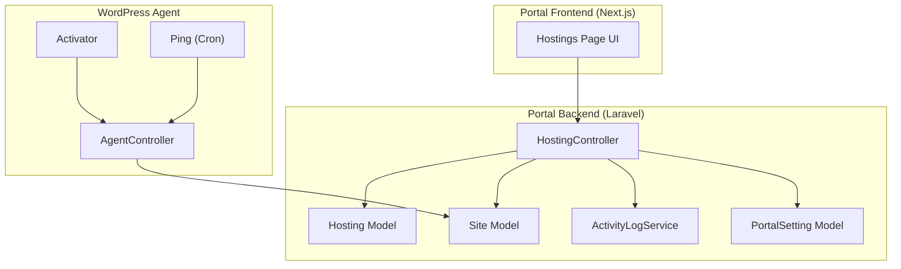
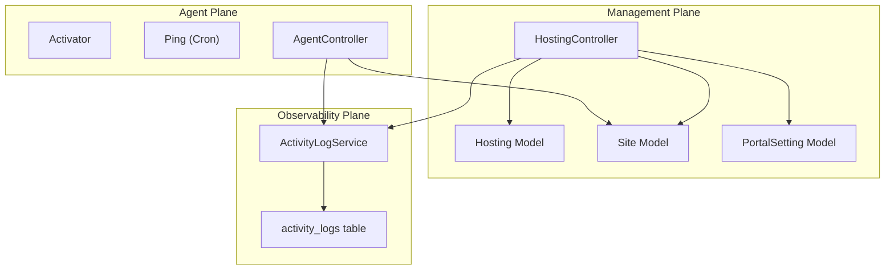
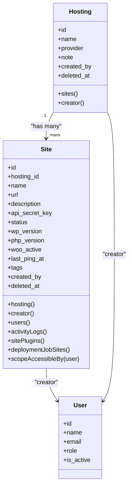
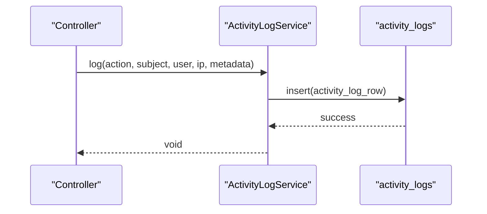
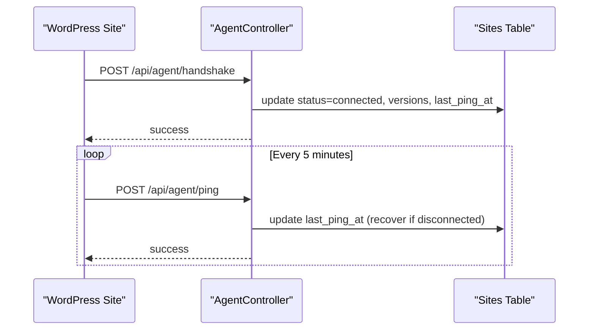
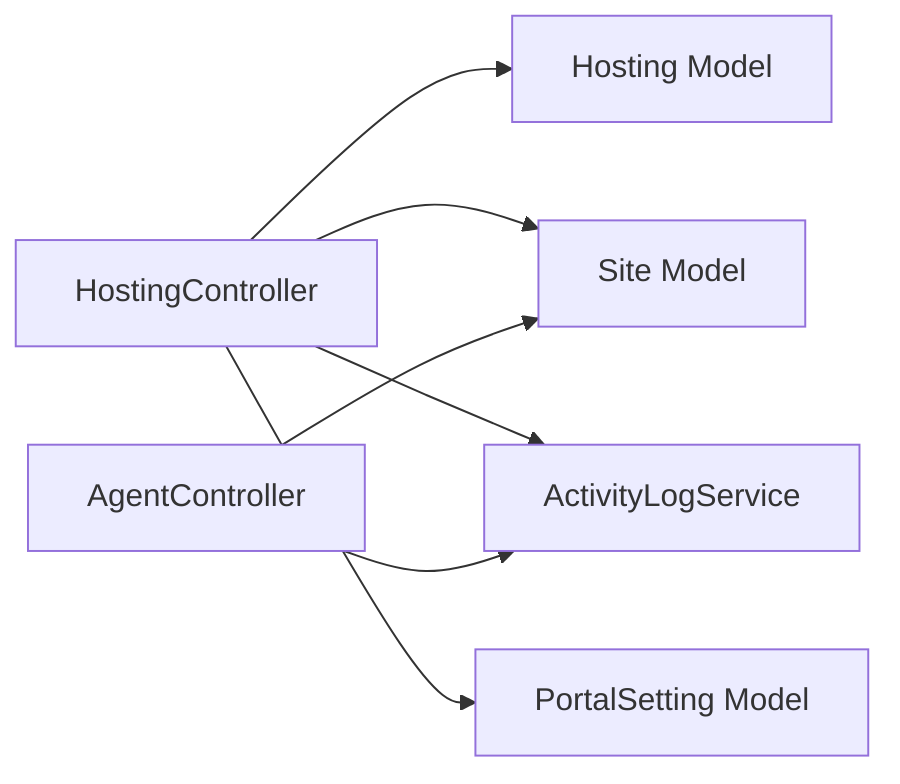

# Cost Tracking and Billing

<cite>
**Referenced Files in This Document**
- [Hosting.php](file://portal/app/Models/Hosting.php)
- [Site.php](file://portal/app/Models/Site.php)
- [HostingController.php](file://portal/app/Http/Controllers/Portal/HostingController.php)
- [2026_05_15_070001_create_hostings_table.php](file://portal/database/migrations/2026_05_15_070001_create_hostings_table.php)
- [2026_05_15_070002_create_sites_table.php](file://portal/database/migrations/2026_05_15_070002_create_sites_table.php)
- [PortalSetting.php](file://portal/app/Models/PortalSetting.php)
- [2026_05_15_070005_create_portal_settings_table.php](file://portal/database/migrations/2026_05_15_070005_create_portal_settings_table.php)
- [ActivityLogService.php](file://portal/app/Services/ActivityLogService.php)
- [2026_05_15_070004_create_activity_logs_table.php](file://portal/database/migrations/2026_05_15_070004_create_activity_logs_table.php)
- [AgentController.php](file://portal/app/Http/Controllers/Agent/AgentController.php)
- [class-activator.php](file://agent/epos-wp-agent/includes/class-activator.php)
- [class-ping.php](file://agent/epos-wp-agent/includes/class-ping.php)
- [class-deactivator.php](file://agent/epos-wp-agent/includes/class-deactivator.php)
- [User.php](file://portal/app/Models/User.php)
</cite>

## Table of Contents
1. [Introduction](#introduction)
2. [Project Structure](#project-structure)
3. [Core Components](#core-components)
4. [Architecture Overview](#architecture-overview)
5. [Detailed Component Analysis](#detailed-component-analysis)
6. [Dependency Analysis](#dependency-analysis)
7. [Performance Considerations](#performance-considerations)
8. [Troubleshooting Guide](#troubleshooting-guide)
9. [Conclusion](#conclusion)
10. [Appendices](#appendices)

## Introduction
This document describes the cost tracking and billing management capabilities currently present in the hosting system and outlines recommended approaches for implementing per-site pricing, resource-based billing, usage-based charges, billing cycle automation, invoice generation, cost allocation for shared resources, budget tracking, spending limit enforcement, reporting, and optimization guidelines. The current codebase provides foundational models for hosting providers and sites, along with activity logging and agent connectivity, but does not yet include explicit billing or cost calculation logic. The recommendations herein propose structured extensions to the existing schema and services to support robust cost tracking and billing workflows.

## Project Structure
The hosting system comprises:
- Backend Laravel application with models for hosting providers and sites, controllers for managing hosting records, and activity logging.
- Frontend Next.js dashboard for managing hosting providers and related operations.
- WordPress Agent plugin that connects individual sites to the portal via periodic pings and handshake.

**Diagram sources**
- [HostingController.php:1-83](file://portal/app/Http/Controllers/Portal/HostingController.php#L1-L83)
- [Hosting.php:1-31](file://portal/app/Models/Hosting.php#L1-L31)
- [Site.php:1-86](file://portal/app/Models/Site.php#L1-L86)
- [ActivityLogService.php:1-50](file://portal/app/Services/ActivityLogService.php#L1-L50)
- [PortalSetting.php:1-11](file://portal/app/Models/PortalSetting.php#L1-L11)
- [AgentController.php:1-98](file://portal/app/Http/Controllers/Agent/AgentController.php#L1-L98)
- [class-activator.php:1-44](file://agent/epos-wp-agent/includes/class-activator.php#L1-L44)
- [class-ping.php:1-48](file://agent/epos-wp-agent/includes/class-ping.php#L1-L48)

**Section sources**
- [HostingController.php:1-83](file://portal/app/Http/Controllers/Portal/HostingController.php#L1-L83)
- [Hosting.php:1-31](file://portal/app/Models/Hosting.php#L1-L31)
- [Site.php:1-86](file://portal/app/Models/Site.php#L1-L86)
- [2026_05_15_070001_create_hostings_table.php:1-27](file://portal/database/migrations/2026_05_15_070001_create_hostings_table.php#L1-L27)
- [2026_05_15_070002_create_sites_table.php:1-35](file://portal/database/migrations/2026_05_15_070002_create_sites_table.php#L1-L35)
- [2026_05_15_070005_create_portal_settings_table.php:1-24](file://portal/database/migrations/2026_05_15_070005_create_portal_settings_table.php#L1-L24)
- [2026_05_15_070004_create_activity_logs_table.php:1-32](file://portal/database/migrations/2026_05_15_070004_create_activity_logs_table.php#L1-L32)
- [AgentController.php:1-98](file://portal/app/Http/Controllers/Agent/AgentController.php#L1-L98)
- [class-activator.php:1-44](file://agent/epos-wp-agent/includes/class-activator.php#L1-L44)
- [class-ping.php:1-48](file://agent/epos-wp-agent/includes/class-ping.php#L1-L48)
- [class-deactivator.php:1-21](file://agent/epos-wp-agent/includes/class-deactivator.php#L1-L21)

## Core Components
- Hosting model and controller manage hosting providers and their associated sites.
- Site model tracks site metadata and relationships to hosting providers and users.
- Activity logging service centralizes audit trails for administrative actions and agent events.
- Portal settings model supports storing global configuration keys and values.
- WordPress Agent handles handshake and periodic ping to maintain connectivity and report status.

Key observations:
- No dedicated billing or cost calculation models exist in the current codebase.
- The system maintains site status and connection health via agent pings.
- Activity logs capture actions and metadata for auditing.

**Section sources**
- [Hosting.php:10-30](file://portal/app/Models/Hosting.php#L10-L30)
- [Site.php:12-85](file://portal/app/Models/Site.php#L12-L85)
- [HostingController.php:17-81](file://portal/app/Http/Controllers/Portal/HostingController.php#L17-L81)
- [ActivityLogService.php:16-48](file://portal/app/Services/ActivityLogService.php#L16-L48)
- [PortalSetting.php:7-10](file://portal/app/Models/PortalSetting.php#L7-L10)
- [AgentController.php:16-97](file://portal/app/Http/Controllers/Agent/AgentController.php#L16-L97)

## Architecture Overview
The current architecture separates concerns into:
- Management plane: Laravel controllers and models for hosting and site administration.
- Observability plane: Activity logs for auditability.
- Agent plane: WordPress plugin that communicates with the portal.

**Diagram sources**
- [HostingController.php:1-83](file://portal/app/Http/Controllers/Portal/HostingController.php#L1-L83)
- [Hosting.php:1-31](file://portal/app/Models/Hosting.php#L1-L31)
- [Site.php:1-86](file://portal/app/Models/Site.php#L1-L86)
- [PortalSetting.php:1-11](file://portal/app/Models/PortalSetting.php#L1-L11)
- [ActivityLogService.php:1-50](file://portal/app/Services/ActivityLogService.php#L1-L50)
- [2026_05_15_070004_create_activity_logs_table.php:1-32](file://portal/database/migrations/2026_05_15_070004_create_activity_logs_table.php#L1-L32)
- [AgentController.php:1-98](file://portal/app/Http/Controllers/Agent/AgentController.php#L1-L98)
- [class-activator.php:1-44](file://agent/epos-wp-agent/includes/class-activator.php#L1-L44)
- [class-ping.php:1-48](file://agent/epos-wp-agent/includes/class-ping.php#L1-L48)

## Detailed Component Analysis

### Hosting and Site Models
The Hosting and Site models define the core domain entities for cost tracking and billing:
- Hosting: Provider metadata and relationship to multiple sites.
- Site: Site-level attributes including status, versions, and timestamps that inform connectivity and potential billing triggers.

**Diagram sources**
- [Hosting.php:10-30](file://portal/app/Models/Hosting.php#L10-L30)
- [Site.php:12-85](file://portal/app/Models/Site.php#L12-L85)
- [User.php:11-38](file://portal/app/Models/User.php#L11-L38)

**Section sources**
- [Hosting.php:10-30](file://portal/app/Models/Hosting.php#L10-L30)
- [Site.php:12-85](file://portal/app/Models/Site.php#L12-L85)
- [2026_05_15_070001_create_hostings_table.php:9-19](file://portal/database/migrations/2026_05_15_070001_create_hostings_table.php#L9-L19)
- [2026_05_15_070002_create_sites_table.php:9-27](file://portal/database/migrations/2026_05_15_070002_create_sites_table.php#L9-L27)

### Activity Logging for Auditing
ActivityLogService centralizes logging of actions with optional subject context and metadata. This is essential for tracking billing-related changes and anomalies.

**Diagram sources**
- [ActivityLogService.php:16-48](file://portal/app/Services/ActivityLogService.php#L16-L48)
- [2026_05_15_070004_create_activity_logs_table.php:11-24](file://portal/database/migrations/2026_05_15_070004_create_activity_logs_table.php#L11-L24)

**Section sources**
- [ActivityLogService.php:16-48](file://portal/app/Services/ActivityLogService.php#L16-L48)
- [2026_05_15_070004_create_activity_logs_table.php:9-24](file://portal/database/migrations/2026_05_15_070004_create_activity_logs_table.php#L9-L24)

### Agent Connectivity and Status
The WordPress Agent performs handshake and periodic pings, updating site status and connection health. These events are logged for auditability.

**Diagram sources**
- [AgentController.php:16-97](file://portal/app/Http/Controllers/Agent/AgentController.php#L16-L97)
- [class-activator.php:35-44](file://agent/epos-wp-agent/includes/class-activator.php#L35-L44)
- [class-ping.php:29-48](file://agent/epos-wp-agent/includes/class-ping.php#L29-L48)

**Section sources**
- [AgentController.php:16-97](file://portal/app/Http/Controllers/Agent/AgentController.php#L16-L97)
- [class-activator.php:12-30](file://agent/epos-wp-agent/includes/class-activator.php#L12-L30)
- [class-ping.php:29-48](file://agent/epos-wp-agent/includes/class-ping.php#L29-L48)
- [class-deactivator.php:11-20](file://agent/epos-wp-agent/includes/class-deactivator.php#L11-L20)

### Proposed Billing Extensions
To implement cost tracking and billing, extend the schema and services as follows:

- New billing entities:
  - BillingCycle: billing period definition (monthly, quarterly, annual).
  - PricingPlan: per-site or resource-based pricing tiers.
  - Invoice: generated line items and totals for a cycle.
  - CostAllocation: allocation of shared resource costs across sites.
  - Budget: spending limits per customer or site.
  - UsageRecord: metered usage metrics for usage-based billing.

- Data model relationships:
  - Hosting belongs to BillingCycle and PricingPlan.
  - Sites belong to Hosting and may be linked to multiple Budgets/CostAllocations.
  - Invoices reference BillingCycle and aggregate Costs.
  - CostAllocation references shared resources and distributes cost proportionally.

- Controllers and services:
  - BillingCycleController: create/update billing cycles.
  - PricingPlanController: manage pricing tiers.
  - InvoiceService: compute totals, apply discounts, generate invoices.
  - CostAllocationService: distribute shared costs across sites.
  - BudgetService: enforce spending limits and trigger alerts.
  - UsageMeteringService: collect and normalize usage metrics.

- Reporting:
  - CostAnalysisService: produce reports by site, hosting, or customer.
  - FinancialDashboard: KPIs, trends, and alerts.

[No sources needed since this section proposes future extensions not present in the current codebase]

## Dependency Analysis
Current dependencies among core components:
- HostingController depends on Hosting, Site, ActivityLogService, and PortalSetting.
- Site and Hosting models define Eloquent relationships.
- AgentController updates Site status and relies on ActivityLogService for audit trails.

**Diagram sources**
- [HostingController.php:1-83](file://portal/app/Http/Controllers/Portal/HostingController.php#L1-L83)
- [Hosting.php:1-31](file://portal/app/Models/Hosting.php#L1-L31)
- [Site.php:1-86](file://portal/app/Models/Site.php#L1-L86)
- [ActivityLogService.php:1-50](file://portal/app/Services/ActivityLogService.php#L1-L50)
- [PortalSetting.php:1-11](file://portal/app/Models/PortalSetting.php#L1-L11)
- [AgentController.php:1-98](file://portal/app/Http/Controllers/Agent/AgentController.php#L1-L98)

**Section sources**
- [HostingController.php:17-81](file://portal/app/Http/Controllers/Portal/HostingController.php#L17-L81)
- [Site.php:41-54](file://portal/app/Models/Site.php#L41-L54)
- [Hosting.php:21-29](file://portal/app/Models/Hosting.php#L21-L29)
- [AgentController.php:39-96](file://portal/app/Http/Controllers/Agent/AgentController.php#L39-L96)

## Performance Considerations
- Indexing: Ensure indexes on foreign keys and frequently queried columns (e.g., hosting_id, created_by, last_ping_at) to optimize joins and filters.
- Pagination: Use pagination for listing large datasets (as seen in controllers) to reduce memory overhead.
- Background jobs: Offload heavy tasks (invoice generation, cost allocation) to queued jobs to avoid request timeouts.
- Caching: Cache frequently accessed configuration (PortalSetting) to minimize database queries.
- Monitoring: Track slow queries and long-running billing computations to identify bottlenecks.

[No sources needed since this section provides general guidance]

## Troubleshooting Guide
Common issues and resolutions:
- Missing activity_logs table: ActivityLogService falls back to logs if the table does not exist. Ensure the migration is applied to enable structured audit trails.
- Agent connectivity failures: Verify portal URL and API key settings in the WordPress plugin. Confirm cron scheduling and network reachability.
- Disconnected sites: AgentController recovers a site’s status upon ping; check last_ping_at and status transitions.
- Authorization errors: Controllers enforce role-based access; ensure users have appropriate roles.

**Section sources**
- [ActivityLogService.php:34-47](file://portal/app/Services/ActivityLogService.php#L34-L47)
- [2026_05_15_070004_create_activity_logs_table.php:11-24](file://portal/database/migrations/2026_05_15_070004_create_activity_logs_table.php#L11-L24)
- [AgentController.php:61-96](file://portal/app/Http/Controllers/Agent/AgentController.php#L61-L96)
- [class-activator.php:18-30](file://agent/epos-wp-agent/includes/class-activator.php#L18-L30)
- [class-ping.php:18-24](file://agent/epos-wp-agent/includes/class-ping.php#L18-L24)

## Conclusion
The current system provides a solid foundation for managing hosting providers and sites, with built-in activity logging and agent connectivity. To implement comprehensive cost tracking and billing, introduce dedicated billing entities, controllers, and services, and integrate them with the existing models. Adopt the proposed methodologies for per-site pricing, resource-based and usage-based billing, automated billing cycles, invoice generation, cost allocation, budget enforcement, and reporting. This will enable accurate cost visibility, efficient resource utilization, and strong financial governance across shared hosting environments.

[No sources needed since this section summarizes without analyzing specific files]

## Appendices

### Recommended Billing Models and Pricing Strategies
- Per-site flat fee: Fixed monthly charge per site; suitable for predictable workloads.
- Resource-based billing: Charge based on allocated CPU/RAM/disk; scale with hosting tier.
- Usage-based billing: Meter bandwidth, storage, requests; bill according to consumption.
- Hybrid model: Base fee plus usage surcharges; balances predictability and fairness.
- Shared resource allocation: Distribute shared costs (e.g., SSL, CDN) across sites proportionally.

[No sources needed since this section provides conceptual guidance]

### Cost Allocation Mechanisms for Shared Resources
- Proportional allocation: Distribute shared costs by site resource allocation or revenue contribution.
- Flat allocation: Split shared costs evenly among all sites.
- Usage-weighted: Allocate based on measured usage (e.g., bandwidth share).

[No sources needed since this section provides conceptual guidance]

### Budget Tracking and Spending Limit Enforcement
- Define budgets per customer or per site with thresholds and alerts.
- Monitor real-time spend against budgets; block actions exceeding limits when configured.
- Notify administrators and customers via notifications and logs.

[No sources needed since this section provides conceptual guidance]

### Reporting Capabilities for Cost Analysis
- Daily/weekly/monthly cost summaries by site, hosting provider, and customer.
- Trend analysis and variance reporting.
- Exportable reports for accounting reconciliation.

[No sources needed since this section provides conceptual guidance]