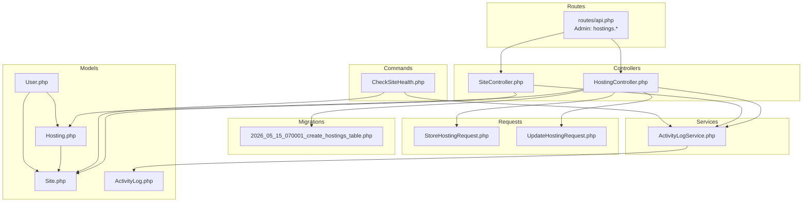
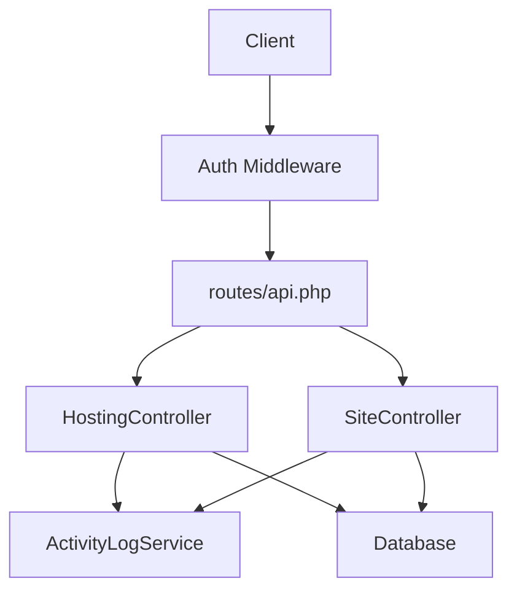
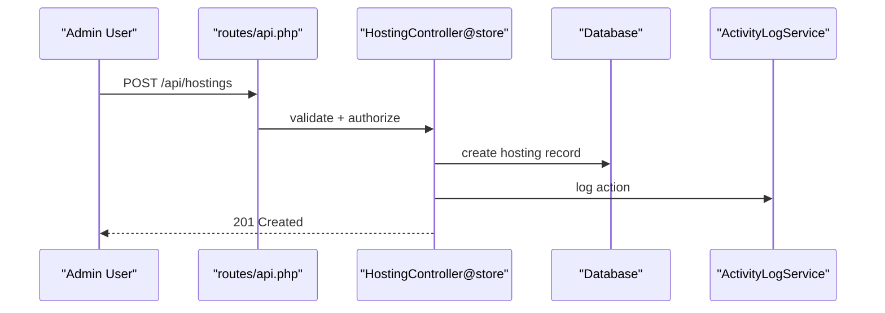
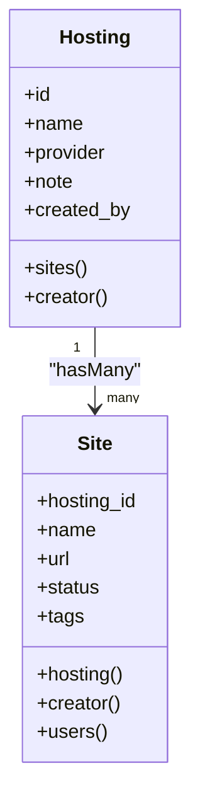
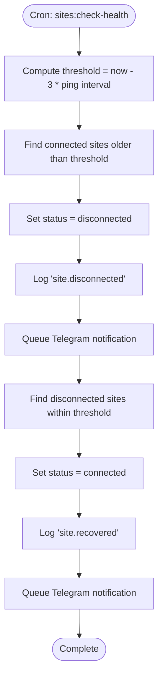
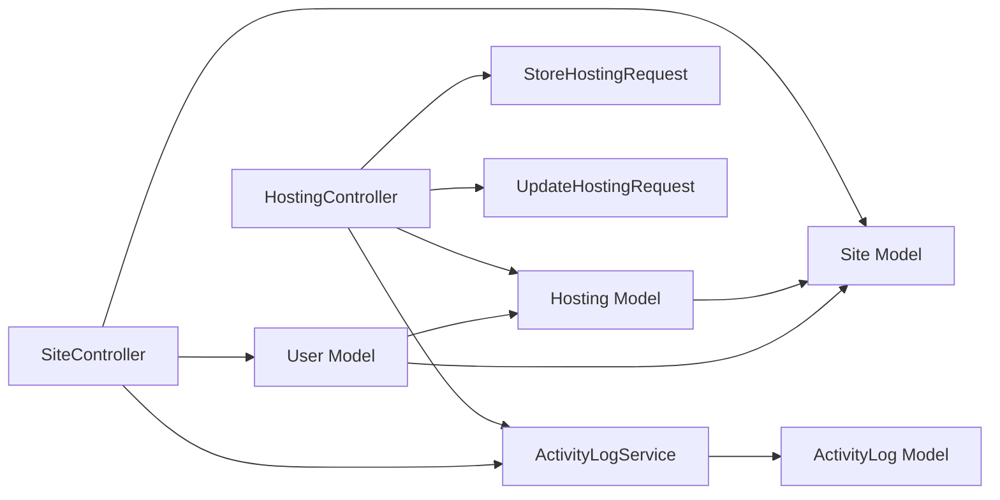

# Hosting Management

<cite>
**Referenced Files in This Document**
- [Hosting.php](file://portal/app/Models/Hosting.php)
- [HostingController.php](file://portal/app/Http/Controllers/Portal/HostingController.php)
- [2026_05_15_070001_create_hostings_table.php](file://portal/database/migrations/2026_05_15_070001_create_hostings_table.php)
- [StoreHostingRequest.php](file://portal/app/Http/Requests/Hosting/StoreHostingRequest.php)
- [UpdateHostingRequest.php](file://portal/app/Http/Requests/Hosting/UpdateHostingRequest.php)
- [Site.php](file://portal/app/Models/Site.php)
- [SiteController.php](file://portal/app/Http/Controllers/Portal/SiteController.php)
- [api.php](file://portal/routes/api.php)
- [CheckSiteHealth.php](file://portal/app/Console/Commands/CheckSiteHealth.php)
- [ActivityLogService.php](file://portal/app/Services/ActivityLogService.php)
- [ActivityLog.php](file://portal/app/Models/ActivityLog.php)
- [User.php](file://portal/app/Models/User.php)
</cite>

## Table of Contents
1. [Introduction](#introduction)
2. [Project Structure](#project-structure)
3. [Core Components](#core-components)
4. [Architecture Overview](#architecture-overview)
5. [Detailed Component Analysis](#detailed-component-analysis)
6. [Dependency Analysis](#dependency-analysis)
7. [Performance Considerations](#performance-considerations)
8. [Troubleshooting Guide](#troubleshooting-guide)
9. [Conclusion](#conclusion)
10. [Appendices](#appendices)

## Introduction
This document describes the hosting management system that powers WordPress site provisioning, monitoring, and lifecycle management. It covers provider registration, resource allocation, capacity planning across multiple hosting providers, performance monitoring, activity tracking, and operational integrations. The system is built around two primary domain entities: Hosting and Site, with supporting models for users, activity logs, and portal settings.

## Project Structure
The hosting management functionality spans Laravel backend controllers, Eloquent models, validation requests, database migrations, scheduled commands, and routing. The API surface is role-gated and exposes read/write operations for administrators and read-only access for other roles.

**Diagram sources**
- [api.php:19-20](file://portal/routes/api.php#L19-L20)
- [HostingController.php:13-82](file://portal/app/Http/Controllers/Portal/HostingController.php#L13-L82)
- [SiteController.php:14-203](file://portal/app/Http/Controllers/Portal/SiteController.php#L14-L203)
- [Hosting.php:10-30](file://portal/app/Models/Hosting.php#L10-L30)
- [Site.php:12-75](file://portal/app/Models/Site.php#L12-L75)
- [StoreHostingRequest.php:7-22](file://portal/app/Http/Requests/Hosting/StoreHostingRequest.php#L7-L22)
- [UpdateHostingRequest.php:8-23](file://portal/app/Http/Requests/Hosting/UpdateHostingRequest.php#L8-L23)
- [2026_05_15_070001_create_hostings_table.php:7-26](file://portal/database/migrations/2026_05_15_070001_create_hostings_table.php#L7-L26)
- [CheckSiteHealth.php:11-94](file://portal/app/Console/Commands/CheckSiteHealth.php#L11-L94)
- [ActivityLogService.php:11-49](file://portal/app/Services/ActivityLogService.php#L11-L49)
- [ActivityLog.php:9-36](file://portal/app/Models/ActivityLog.php#L9-L36)
- [User.php:11-37](file://portal/app/Models/User.php#L11-L37)

**Section sources**
- [api.php:10-47](file://portal/routes/api.php#L10-L47)
- [HostingController.php:17-81](file://portal/app/Http/Controllers/Portal/HostingController.php#L17-L81)
- [SiteController.php:23-150](file://portal/app/Http/Controllers/Portal/SiteController.php#L23-L150)

## Core Components
- Hosting model: Represents a hosting provider account with provider type, metadata, and relationships to sites and creators.
- Site model: Represents a WordPress site with status, versions, tags, and relationships to hosting, users, and activity logs.
- HostingController: Manages CRUD operations for hosting accounts with activity logging and soft deletes.
- SiteController: Manages site lifecycle, including creation with generated API keys, updates, deletions, and access control.
- Validation requests: Enforce provider enumeration and uniqueness for hosting names.
- Scheduled command: Performs periodic health checks to mark sites as connected/disconnected based on last ping timestamps.
- Activity logging service: Centralized logging for administrative actions and system events.

**Section sources**
- [Hosting.php:14-29](file://portal/app/Models/Hosting.php#L14-L29)
- [Site.php:16-39](file://portal/app/Models/Site.php#L16-L39)
- [HostingController.php:26-81](file://portal/app/Http/Controllers/Portal/HostingController.php#L26-L81)
- [SiteController.php:62-150](file://portal/app/Http/Controllers/Portal/SiteController.php#L62-L150)
- [StoreHostingRequest.php:14-21](file://portal/app/Http/Requests/Hosting/StoreHostingRequest.php#L14-L21)
- [UpdateHostingRequest.php:15-22](file://portal/app/Http/Requests/Hosting/UpdateHostingRequest.php#L15-L22)
- [CheckSiteHealth.php:13-73](file://portal/app/Console/Commands/CheckSiteHealth.php#L13-L73)
- [ActivityLogService.php:16-48](file://portal/app/Services/ActivityLogService.php#L16-L48)

## Architecture Overview
The system follows a layered architecture:
- Presentation: API routes define endpoints grouped by role and scope.
- Application: Controllers orchestrate requests, apply validation, and delegate to services.
- Domain: Models encapsulate persistence and relationships.
- Infrastructure: Migrations define schema; scheduled commands automate tasks; activity logs persist audit trails.

**Diagram sources**
- [api.php:10-47](file://portal/routes/api.php#L10-L47)
- [HostingController.php:15-40](file://portal/app/Http/Controllers/Portal/HostingController.php#L15-L40)
- [SiteController.php:16-91](file://portal/app/Http/Controllers/Portal/SiteController.php#L16-L91)
- [ActivityLogService.php:16-48](file://portal/app/Services/ActivityLogService.php#L16-L48)

## Detailed Component Analysis

### Hosting Provider Registration and Management
- Provider registration: Admins create hosting accounts with a validated provider type and optional notes. The controller records the creator and emits an activity log.
- Provider enumeration: The validation restricts provider values to a predefined set, ensuring consistent categorization across the system.
- Deletion behavior: Deleting a hosting account unlinks associated sites (sets hosting_id to null) before deletion, preventing orphaned references.

**Diagram sources**
- [api.php:19-20](file://portal/routes/api.php#L19-L20)
- [HostingController.php:26-41](file://portal/app/Http/Controllers/Portal/HostingController.php#L26-L41)
- [StoreHostingRequest.php:9-21](file://portal/app/Http/Requests/Hosting/StoreHostingRequest.php#L9-L21)
- [ActivityLogService.php:16-32](file://portal/app/Services/ActivityLogService.php#L16-L32)

**Section sources**
- [HostingController.php:26-41](file://portal/app/Http/Controllers/Portal/HostingController.php#L26-L41)
- [StoreHostingRequest.php:14-21](file://portal/app/Http/Requests/Hosting/StoreHostingRequest.php#L14-L21)
- [2026_05_15_070001_create_hostings_table.php:11-18](file://portal/database/migrations/2026_05_15_070001_create_hostings_table.php#L11-L18)

### Resource Allocation and Capacity Planning
- Multi-site association: A hosting account can manage multiple WordPress sites via a one-to-many relationship. The controller lists hostings with site counts for capacity awareness.
- Site tagging and filtering: Sites support tags and status filters, enabling capacity planning by category and operational state.
- Access control: Non-admin users can only view sites assigned to them, aiding team-based capacity planning and workload distribution.

**Diagram sources**
- [Hosting.php:21-29](file://portal/app/Models/Hosting.php#L21-L29)
- [Site.php:41-49](file://portal/app/Models/Site.php#L41-L49)

**Section sources**
- [HostingController.php:19-23](file://portal/app/Http/Controllers/Portal/HostingController.php#L19-L23)
- [SiteController.php:23-55](file://portal/app/Http/Controllers/Portal/SiteController.php#L23-L55)
- [Site.php:31-39](file://portal/app/Models/Site.php#L31-L39)

### Performance Monitoring and Health Checks
- Health monitoring: A scheduled command evaluates site connectivity by comparing last ping timestamps against a derived threshold. It transitions sites between connected and disconnected states and logs these events.
- Notifications: On state changes, the system dispatches Telegram notifications asynchronously.
- Audit trail: All state transitions are recorded in the activity log for compliance and troubleshooting.

**Diagram sources**
- [CheckSiteHealth.php:13-73](file://portal/app/Console/Commands/CheckSiteHealth.php#L13-L73)
- [ActivityLogService.php:16-48](file://portal/app/Services/ActivityLogService.php#L16-L48)

**Section sources**
- [CheckSiteHealth.php:16-73](file://portal/app/Console/Commands/CheckSiteHealth.php#L16-L73)
- [SiteController.php:97-109](file://portal/app/Http/Controllers/Portal/SiteController.php#L97-L109)

### Billing and Cost Allocation
- Current state: The codebase does not include billing or cost allocation models, fields, or services. No provider-specific cost attributes are defined in the hosting schema.
- Recommendation: Introduce a billing model with fields such as cost_per_provider, currency, billing_cycle, and cost_allocation_rules. Link this to Hosting and Site to enable per-provider and per-site cost tracking.

[No sources needed since this section provides recommendations without analyzing specific files]

### Integration with Hosting Providers
- Provider enumeration: The system recognizes specific providers via an enumerated field, enabling future integrations tailored to each provider’s configuration needs.
- Configuration requirements: While the schema defines provider type, concrete integration parameters (e.g., API credentials, endpoints) are not modeled in the current codebase. These should be persisted in a provider-specific configuration table or JSON field on Hosting.

**Section sources**
- [2026_05_15_070001_create_hostings_table.php:14](file://portal/database/migrations/2026_05_15_070001_create_hostings_table.php#L14)
- [StoreHostingRequest.php:18](file://portal/app/Http/Requests/Hosting/StoreHostingRequest.php#L18)

### Resource Scaling and Auto-Scaling Policies
- Current state: There are no explicit scaling or auto-scaling policies implemented in the codebase. No metrics-driven triggers or provider-specific scaling controls are present.
- Recommendation: Define scaling policies (e.g., CPU/memory thresholds, concurrent site limits) and integrate with provider APIs to adjust resources automatically. Track scaling events in activity logs.

[No sources needed since this section provides recommendations without analyzing specific files]

### Relationship Between Hosting Resources and Site Performance
- Capacity planning: Use site tags and statuses to group workloads by performance tier or risk profile. Monitor provider utilization indirectly via health signals and manual capacity assessments.
- Bottleneck identification: Combine connectivity status, ping intervals, and activity logs to identify degraded hosts or sites. Use filtering and counts to prioritize remediation.

**Section sources**
- [SiteController.php:39-51](file://portal/app/Http/Controllers/Portal/SiteController.php#L39-L51)
- [CheckSiteHealth.php:18-25](file://portal/app/Console/Commands/CheckSiteHealth.php#L18-L25)

### Optimizing Costs While Maintaining SLAs
- Guidance: Align provider selection with workload profiles, leverage tagging for cost attribution, and monitor site health to avoid over-provisioning. Establish SLAs for uptime and response times, and track deviations via activity logs.

[No sources needed since this section provides general guidance]

## Dependency Analysis
The following diagram highlights key dependencies among hosting and site management components.

**Diagram sources**
- [HostingController.php:6-11](file://portal/app/Http/Controllers/Portal/HostingController.php#L6-L11)
- [SiteController.php:6-12](file://portal/app/Http/Controllers/Portal/SiteController.php#L6-L12)
- [Hosting.php:10-30](file://portal/app/Models/Hosting.php#L10-L30)
- [Site.php:12-75](file://portal/app/Models/Site.php#L12-L75)
- [StoreHostingRequest.php:7-22](file://portal/app/Http/Requests/Hosting/StoreHostingRequest.php#L7-L22)
- [UpdateHostingRequest.php:8-23](file://portal/app/Http/Requests/Hosting/UpdateHostingRequest.php#L8-L23)
- [ActivityLogService.php:11-49](file://portal/app/Services/ActivityLogService.php#L11-L49)
- [ActivityLog.php:9-36](file://portal/app/Models/ActivityLog.php#L9-L36)
- [User.php:11-37](file://portal/app/Models/User.php#L11-L37)

**Section sources**
- [api.php:19-20](file://portal/routes/api.php#L19-L20)
- [HostingController.php:17-81](file://portal/app/Http/Controllers/Portal/HostingController.php#L17-L81)
- [SiteController.php:23-150](file://portal/app/Http/Controllers/Portal/SiteController.php#L23-L150)

## Performance Considerations
- Indexing: Add indexes on frequently filtered columns such as hosting_id, status, and tags for improved query performance.
- Pagination: Controllers already use pagination for listings; maintain reasonable page sizes to balance responsiveness and memory usage.
- Asynchronous notifications: Leverage queued jobs for notifications to avoid blocking API responses.
- Caching: Consider caching provider enumerations and portal settings to reduce repeated reads.

[No sources needed since this section provides general guidance]

## Troubleshooting Guide
- Activity logs: Use the activity log service to trace administrative actions and system events. The service writes to the activity_logs table when available, otherwise falls back to application logs.
- Health check anomalies: Investigate thresholds and agent ping intervals. Verify that the scheduled command runs and that Telegram settings are configured if notifications are expected.
- Access control: Non-admin users receive 403 responses when accessing sites they do not own. Confirm user-site associations and roles.

**Section sources**
- [ActivityLogService.php:16-48](file://portal/app/Services/ActivityLogService.php#L16-L48)
- [CheckSiteHealth.php:75-93](file://portal/app/Console/Commands/CheckSiteHealth.php#L75-L93)
- [SiteController.php:99-104](file://portal/app/Http/Controllers/Portal/SiteController.php#L99-L104)

## Conclusion
The hosting management system provides a solid foundation for registering hosting providers, associating multiple WordPress sites, and monitoring site health. To achieve comprehensive capacity planning, performance monitoring, and cost optimization, extend the system with provider-specific configuration storage, billing models, scaling policies, and metrics-driven automation. The existing activity logging and role-based access control offer strong auditing and security foundations for further enhancements.

## Appendices

### API Endpoints Summary
- Admin-only endpoints under hostings resource:
  - GET /api/hostings
  - POST /api/hostings
  - GET /api/hostings/{hosting}
  - PUT /api/hostings/{hosting}
  - DELETE /api/hostings/{hosting}

- Sites endpoints:
  - GET /api/sites
  - POST /api/sites
  - GET /api/sites/{site}
  - PUT /api/sites/{site}
  - DELETE /api/sites/{site}
  - POST /api/sites/{site}/regenerate-key
  - GET /api/sites/{site}/activity

**Section sources**
- [api.php:19-38](file://portal/routes/api.php#L19-L38)