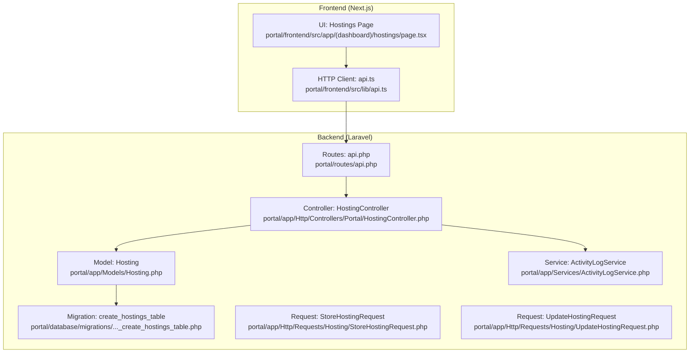
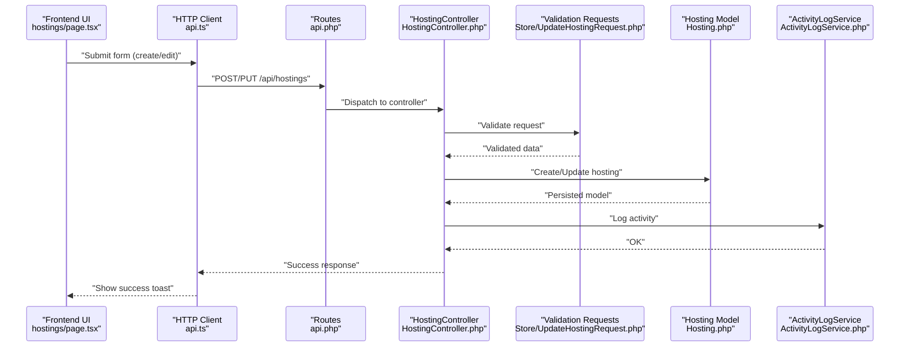
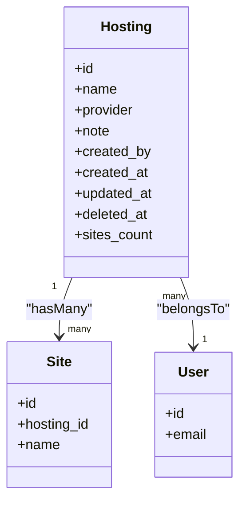
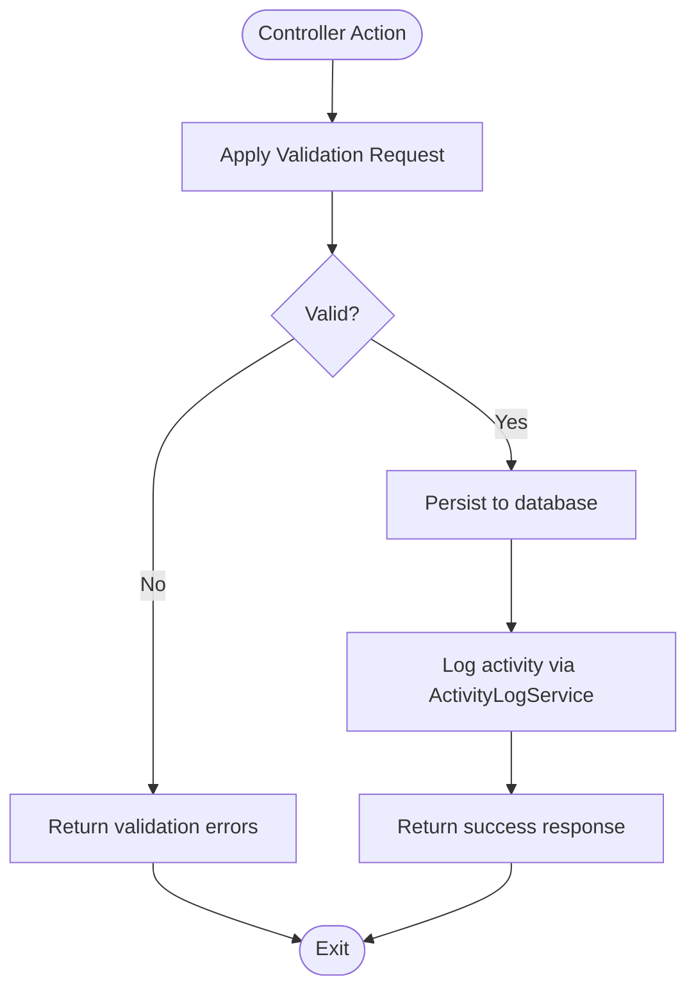
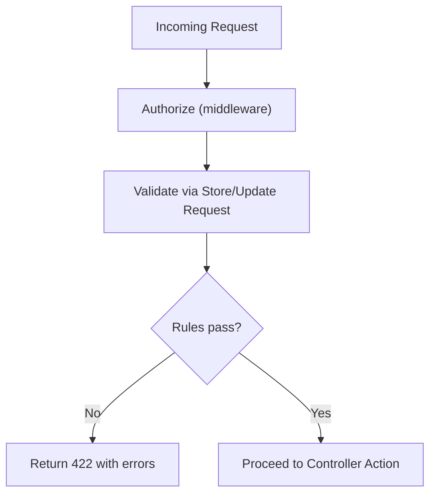
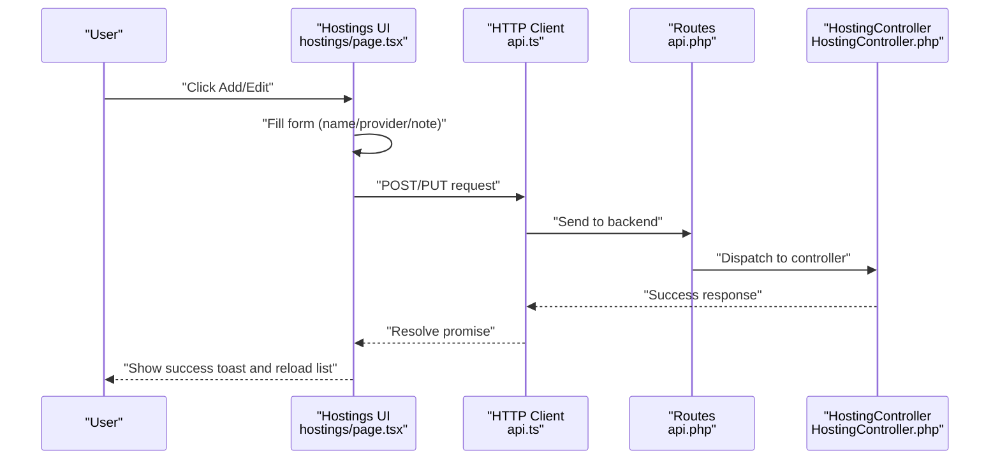
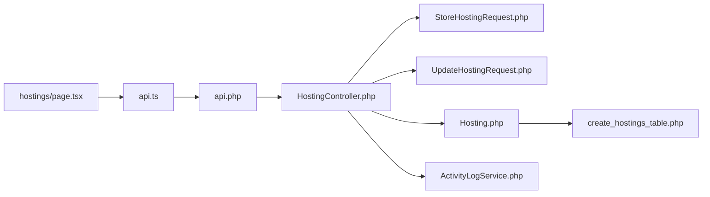
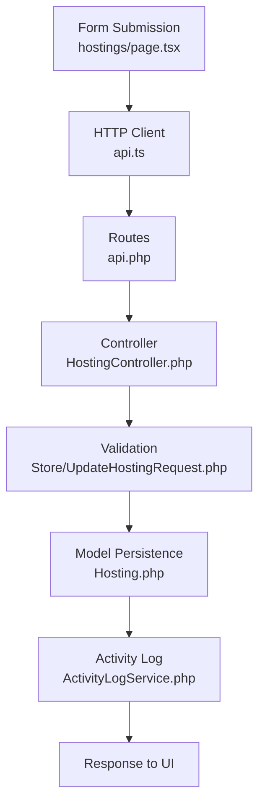

# Hosting Provider Configuration

<cite>
**Referenced Files in This Document**
- [Hosting.php](file://portal/app/Models/Hosting.php)
- [create_hostings_table.php](file://portal/database/migrations/2026_05_15_070001_create_hostings_table.php)
- [HostingController.php](file://portal/app/Http/Controllers/Portal/HostingController.php)
- [StoreHostingRequest.php](file://portal/app/Http/Requests/Hosting/StoreHostingRequest.php)
- [UpdateHostingRequest.php](file://portal/app/Http/Requests/Hosting/UpdateHostingRequest.php)
- [api.php](file://portal/routes/api.php)
- [ActivityLogService.php](file://portal/app/Services/ActivityLogService.php)
- [hostings/page.tsx](file://portal/frontend/src/app/(dashboard)/hostings/page.tsx)
- [api.ts](file://portal/frontend/src/lib/api.ts)
</cite>

## Table of Contents
1. [Introduction](#introduction)
2. [Project Structure](#project-structure)
3. [Core Components](#core-components)
4. [Architecture Overview](#architecture-overview)
5. [Detailed Component Analysis](#detailed-component-analysis)
6. [Dependency Analysis](#dependency-analysis)
7. [Performance Considerations](#performance-considerations)
8. [Troubleshooting Guide](#troubleshooting-guide)
9. [Conclusion](#conclusion)
10. [Appendices](#appendices)

## Introduction
This document explains how hosting provider configuration is modeled, validated, stored, and managed within the system. It covers the hosting model structure, provider metadata, validation rules, controller actions, request handling, and the frontend UI for onboarding and managing hosting providers. It also outlines security considerations, credential management guidance, and testing/validation approaches for provider configurations.

## Project Structure
The hosting provider feature spans backend Laravel components (model, migration, controller, requests, routes, and activity logging) and a Next.js frontend UI for listing, adding, editing, and deleting hosting providers.

**Diagram sources**
- [Hosting.php:1-31](file://portal/app/Models/Hosting.php#L1-L31)
- [create_hostings_table.php:1-27](file://portal/database/migrations/2026_05_15_070001_create_hostings_table.php#L1-L27)
- [HostingController.php:1-83](file://portal/app/Http/Controllers/Portal/HostingController.php#L1-L83)
- [StoreHostingRequest.php:1-23](file://portal/app/Http/Requests/Hosting/StoreHostingRequest.php#L1-L23)
- [UpdateHostingRequest.php:1-24](file://portal/app/Http/Requests/Hosting/UpdateHostingRequest.php#L1-L24)
- [api.php:1-48](file://portal/routes/api.php#L1-L48)
- [ActivityLogService.php:1-50](file://portal/app/Services/ActivityLogService.php#L1-L50)
- [hostings/page.tsx](file://portal/frontend/src/app/(dashboard)/hostings/page.tsx#L1-L282)
- [api.ts:1-37](file://portal/frontend/src/lib/api.ts#L1-L37)

**Section sources**
- [Hosting.php:1-31](file://portal/app/Models/Hosting.php#L1-L31)
- [create_hostings_table.php:1-27](file://portal/database/migrations/2026_05_15_070001_create_hostings_table.php#L1-L27)
- [HostingController.php:1-83](file://portal/app/Http/Controllers/Portal/HostingController.php#L1-L83)
- [StoreHostingRequest.php:1-23](file://portal/app/Http/Requests/Hosting/StoreHostingRequest.php#L1-L23)
- [UpdateHostingRequest.php:1-24](file://portal/app/Http/Requests/Hosting/UpdateHostingRequest.php#L1-L24)
- [api.php:1-48](file://portal/routes/api.php#L1-L48)
- [ActivityLogService.php:1-50](file://portal/app/Services/ActivityLogService.php#L1-L50)
- [hostings/page.tsx](file://portal/frontend/src/app/(dashboard)/hostings/page.tsx#L1-L282)
- [api.ts:1-37](file://portal/frontend/src/lib/api.ts#L1-L37)

## Core Components
- Hosting model: Defines the hosting entity, fillable attributes, relationships to sites and creator, and soft deletes support.
- Database migration: Creates the hostings table with fields for name, provider, note, created_by, timestamps, and soft deletes.
- Controller: Implements index, store, show, update, and destroy actions with request validation and activity logging.
- Validation requests: Define strict rules for creating and updating hosting records.
- Routes: Exposes REST endpoints for hosting management under an authenticated admin role.
- Activity logging: Centralized service to record actions with optional metadata.
- Frontend UI: Provides a dashboard page to list, add, edit, and delete hosting providers with a simple form.

**Section sources**
- [Hosting.php:10-30](file://portal/app/Models/Hosting.php#L10-L30)
- [create_hostings_table.php:11-19](file://portal/database/migrations/2026_05_15_070001_create_hostings_table.php#L11-L19)
- [HostingController.php:17-81](file://portal/app/Http/Controllers/Portal/HostingController.php#L17-L81)
- [StoreHostingRequest.php:14-21](file://portal/app/Http/Requests/Hosting/StoreHostingRequest.php#L14-L21)
- [UpdateHostingRequest.php:15-22](file://portal/app/Http/Requests/Hosting/UpdateHostingRequest.php#L15-L22)
- [api.php:19-20](file://portal/routes/api.php#L19-L20)
- [ActivityLogService.php:16-47](file://portal/app/Services/ActivityLogService.php#L16-L47)
- [hostings/page.tsx](file://portal/frontend/src/app/(dashboard)/hostings/page.tsx#L33-L98)

## Architecture Overview
The system follows a layered architecture:
- Presentation layer: Next.js UI handles user interactions and calls the API.
- API layer: Laravel routes define protected endpoints for hosting management.
- Application layer: Controller orchestrates requests, applies validation, updates state, and logs activities.
- Domain layer: Eloquent model encapsulates persistence and relationships.
- Persistence layer: Database schema defines the hosting record structure.

**Diagram sources**
- [hostings/page.tsx](file://portal/frontend/src/app/(dashboard)/hostings/page.tsx#L81-L98)
- [api.ts:1-37](file://portal/frontend/src/lib/api.ts#L1-L37)
- [api.php:19-20](file://portal/routes/api.php#L19-L20)
- [HostingController.php:26-61](file://portal/app/Http/Controllers/Portal/HostingController.php#L26-L61)
- [StoreHostingRequest.php:14-21](file://portal/app/Http/Requests/Hosting/StoreHostingRequest.php#L14-L21)
- [UpdateHostingRequest.php:15-22](file://portal/app/Http/Requests/Hosting/UpdateHostingRequest.php#L15-L22)
- [Hosting.php:14-29](file://portal/app/Models/Hosting.php#L14-L29)
- [ActivityLogService.php:16-47](file://portal/app/Services/ActivityLogService.php#L16-L47)

## Detailed Component Analysis

### Hosting Model
- Purpose: Represents a hosting provider with metadata and relationships.
- Attributes:
  - name: string, required during creation, unique per tenant.
  - provider: string, required, limited to predefined values.
  - note: text, optional.
  - created_by: foreign key to users.
- Relationships:
  - sites: one-to-many relationship to sites.
  - creator: belongs-to relationship to the user who created the record.
- Soft deletes: Supports logical deletion with cascade unlinking of sites.

**Diagram sources**
- [Hosting.php:14-29](file://portal/app/Models/Hosting.php#L14-L29)
- [create_hostings_table.php:11-19](file://portal/database/migrations/2026_05_15_070001_create_hostings_table.php#L11-L19)

**Section sources**
- [Hosting.php:10-30](file://portal/app/Models/Hosting.php#L10-L30)
- [create_hostings_table.php:11-19](file://portal/database/migrations/2026_05_15_070001_create_hostings_table.php#L11-L19)

### Database Schema
- Table: hostings
- Columns:
  - id: primary key
  - name: string, required, unique
  - provider: string (length limit), required, constrained to a fixed set of values
  - note: text, nullable
  - created_by: foreign key to users
  - timestamps and soft deletes
- Indexes: unique index on name; foreign key constraint on created_by

**Section sources**
- [create_hostings_table.php:11-19](file://portal/database/migrations/2026_05_15_070001_create_hostings_table.php#L11-L19)

### Controller Actions
- index: Lists all hostings with site counts, ordered by creation date.
- store: Validates input via StoreHostingRequest, sets created_by to current user, persists, logs activity, and returns success.
- show: Loads a single hosting with site count.
- update: Validates input via UpdateHostingRequest, updates the record, logs activity, and returns success.
- destroy: Unlinks associated sites by setting hosting_id to null, deletes the hosting, logs activity with metadata indicating prior site count, and returns success.

**Diagram sources**
- [HostingController.php:26-81](file://portal/app/Http/Controllers/Portal/HostingController.php#L26-L81)
- [StoreHostingRequest.php:14-21](file://portal/app/Http/Requests/Hosting/StoreHostingRequest.php#L14-L21)
- [UpdateHostingRequest.php:15-22](file://portal/app/Http/Requests/Hosting/UpdateHostingRequest.php#L15-L22)
- [ActivityLogService.php:16-47](file://portal/app/Services/ActivityLogService.php#L16-L47)

**Section sources**
- [HostingController.php:17-81](file://portal/app/Http/Controllers/Portal/HostingController.php#L17-L81)

### Validation Rules and Request Handling
- StoreHostingRequest:
  - name: required, string, max length, unique across hostings
  - provider: required, string, restricted to a predefined list
  - note: nullable string
- UpdateHostingRequest:
  - name: optional, string, max length, unique ignoring current record
  - provider: optional, string, restricted to the predefined list
  - note: nullable string

**Diagram sources**
- [StoreHostingRequest.php:9-21](file://portal/app/Http/Requests/Hosting/StoreHostingRequest.php#L9-L21)
- [UpdateHostingRequest.php:10-22](file://portal/app/Http/Requests/Hosting/UpdateHostingRequest.php#L10-L22)

**Section sources**
- [StoreHostingRequest.php:14-21](file://portal/app/Http/Requests/Hosting/StoreHostingRequest.php#L14-L21)
- [UpdateHostingRequest.php:15-22](file://portal/app/Http/Requests/Hosting/UpdateHostingRequest.php#L15-L22)

### Routing and Access Control
- Protected routes group requires Sanctum authentication and active user middleware.
- Admin-only routes include:
  - GET/POST hostings
  - PUT/PATCH hostings/{hosting}
  - DELETE hostings/{hosting}

**Section sources**
- [api.php:10-27](file://portal/routes/api.php#L10-L27)

### Activity Logging
- Logs actions such as hosting.created, hosting.updated, and hosting.deleted.
- Captures actor (user), IP address, subject (model), and optional metadata (e.g., had_sites).
- Falls back to application logs if the activity_logs table is missing.

**Section sources**
- [HostingController.php:33-78](file://portal/app/Http/Controllers/Portal/HostingController.php#L33-L78)
- [ActivityLogService.php:16-47](file://portal/app/Services/ActivityLogService.php#L16-L47)

### Frontend UI and Onboarding Workflow
- Displays a table of hostings with counts and actions.
- Provides dialogs to create or edit a hosting provider with:
  - Name field
  - Provider selection from a curated list
  - Optional Notes field
- Submits via HTTP client configured with bearer token and automatic 401 handling.
- Shows success/error notifications and refreshes the list after mutations.

**Diagram sources**
- [hostings/page.tsx](file://portal/frontend/src/app/(dashboard)/hostings/page.tsx#L81-L98)
- [api.ts:12-20](file://portal/frontend/src/lib/api.ts#L12-L20)
- [api.php:19-20](file://portal/routes/api.php#L19-L20)
- [HostingController.php:26-61](file://portal/app/Http/Controllers/Portal/HostingController.php#L26-L61)

**Section sources**
- [hostings/page.tsx](file://portal/frontend/src/app/(dashboard)/hostings/page.tsx#L33-L98)
- [api.ts:1-37](file://portal/frontend/src/lib/api.ts#L1-L37)

## Dependency Analysis
- Controller depends on:
  - Hosting model for persistence and relationships
  - Validation requests for input sanitization and enforcement
  - ActivityLogService for audit trail
- Model depends on:
  - Eloquent ORM and relationships
  - Soft deletes for safe removal
- Frontend depends on:
  - HTTP client for authenticated API calls
  - Routes for endpoint discovery
- Routes depend on:
  - Controller actions for handling requests
  - Middleware for authentication and authorization

**Diagram sources**
- [hostings/page.tsx](file://portal/frontend/src/app/(dashboard)/hostings/page.tsx#L1-L282)
- [api.ts:1-37](file://portal/frontend/src/lib/api.ts#L1-L37)
- [api.php:1-48](file://portal/routes/api.php#L1-L48)
- [HostingController.php:1-83](file://portal/app/Http/Controllers/Portal/HostingController.php#L1-L83)
- [StoreHostingRequest.php:1-23](file://portal/app/Http/Requests/Hosting/StoreHostingRequest.php#L1-L23)
- [UpdateHostingRequest.php:1-24](file://portal/app/Http/Requests/Hosting/UpdateHostingRequest.php#L1-L24)
- [Hosting.php:1-31](file://portal/app/Models/Hosting.php#L1-L31)
- [create_hostings_table.php:1-27](file://portal/database/migrations/2026_05_15_070001_create_hostings_table.php#L1-L27)
- [ActivityLogService.php:1-50](file://portal/app/Services/ActivityLogService.php#L1-L50)

**Section sources**
- [HostingController.php:1-83](file://portal/app/Http/Controllers/Portal/HostingController.php#L1-L83)
- [Hosting.php:1-31](file://portal/app/Models/Hosting.php#L1-L31)
- [api.php:1-48](file://portal/routes/api.php#L1-L48)

## Performance Considerations
- Use pagination for large datasets when listing hostings.
- Minimize N+1 queries by eager-loading related counts (already done via sites_count).
- Keep provider lists small and curated to reduce validation overhead.
- Consider indexing provider column if filtering by provider becomes frequent.

[No sources needed since this section provides general guidance]

## Troubleshooting Guide
- Validation failures:
  - Ensure name uniqueness and provider inclusion in the allowed list.
  - Confirm optional note is a string.
- Authentication/authorization:
  - Verify bearer token presence and validity.
  - Confirm user role allows admin access to hostings endpoints.
- Activity logging:
  - If activity_logs table is missing, logs fall back to application logs.
- Deletion behavior:
  - Deleting a hosting provider unlinks associated sites (hosting_id set to null) before deletion.

**Section sources**
- [StoreHostingRequest.php:14-21](file://portal/app/Http/Requests/Hosting/StoreHostingRequest.php#L14-L21)
- [UpdateHostingRequest.php:15-22](file://portal/app/Http/Requests/Hosting/UpdateHostingRequest.php#L15-L22)
- [api.ts:12-20](file://portal/frontend/src/lib/api.ts#L12-L20)
- [HostingController.php:63-81](file://portal/app/Http/Controllers/Portal/HostingController.php#L63-L81)
- [ActivityLogService.php:34-47](file://portal/app/Services/ActivityLogService.php#L34-L47)

## Conclusion
The hosting provider configuration feature provides a secure, audited, and user-friendly way to manage provider metadata. The backend enforces strict validation and maintains an activity trail, while the frontend offers a streamlined onboarding experience. Extending the system to include provider-specific credentials and connection parameters would require additional model fields, validation rules, and secure storage mechanisms.

[No sources needed since this section summarizes without analyzing specific files]

## Appendices

### Hosting Model Data Flow

**Diagram sources**
- [hostings/page.tsx](file://portal/frontend/src/app/(dashboard)/hostings/page.tsx#L81-L98)
- [api.ts:1-37](file://portal/frontend/src/lib/api.ts#L1-L37)
- [api.php:19-20](file://portal/routes/api.php#L19-L20)
- [HostingController.php:26-61](file://portal/app/Http/Controllers/Portal/HostingController.php#L26-L61)
- [StoreHostingRequest.php:14-21](file://portal/app/Http/Requests/Hosting/StoreHostingRequest.php#L14-L21)
- [UpdateHostingRequest.php:15-22](file://portal/app/Http/Requests/Hosting/UpdateHostingRequest.php#L15-L22)
- [Hosting.php:14-29](file://portal/app/Models/Hosting.php#L14-L29)
- [ActivityLogService.php:16-47](file://portal/app/Services/ActivityLogService.php#L16-L47)

### Provider Types and Configuration Guidance
- Current supported provider values (backend):
  - cloudways, cpanel, runcloud, vultr, digitalocean, other
- UI provider list (frontend):
  - RunCloud, GridPane, SpinupWP, Cloudways, Forge, Ploi, Other
- Guidance:
  - Align UI list with backend allowed values for consistency.
  - For provider-specific configuration (e.g., credentials, endpoints), introduce a dedicated configuration table and secure storage, then extend validation and controller logic accordingly.

**Section sources**
- [StoreHostingRequest.php:18-18](file://portal/app/Http/Requests/Hosting/StoreHostingRequest.php#L18-L18)
- [hostings/page.tsx](file://portal/frontend/src/app/(dashboard)/hostings/page.tsx#L33-L33)

### Security Considerations
- Treat provider credentials as sensitive data; avoid storing plaintext secrets in the database.
- Use encrypted fields or external secret managers for tokens and keys.
- Enforce least privilege for API access and rotate credentials periodically.
- Audit all provider-related changes via activity logs.

[No sources needed since this section provides general guidance]

### Testing Provider Connections and Validating Configurations
- Backend:
  - Write feature tests to validate successful creation, update, and deletion flows.
  - Mock external provider APIs to test connection validation without real network calls.
  - Add unit tests for validation rules and controller behavior.
- Frontend:
  - Test form submission, error handling, and success notifications.
  - Verify that provider selection aligns with allowed values.

[No sources needed since this section provides general guidance]