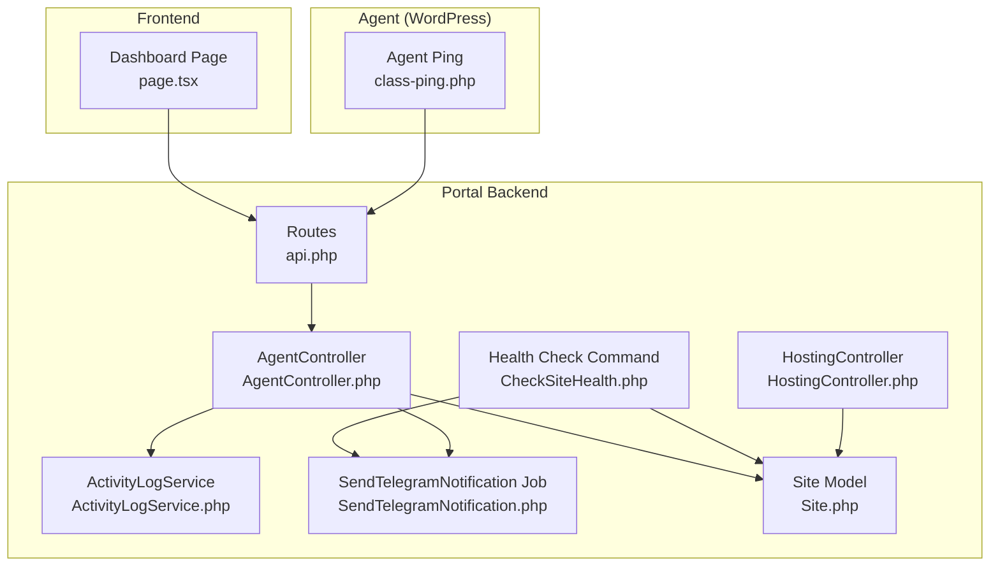
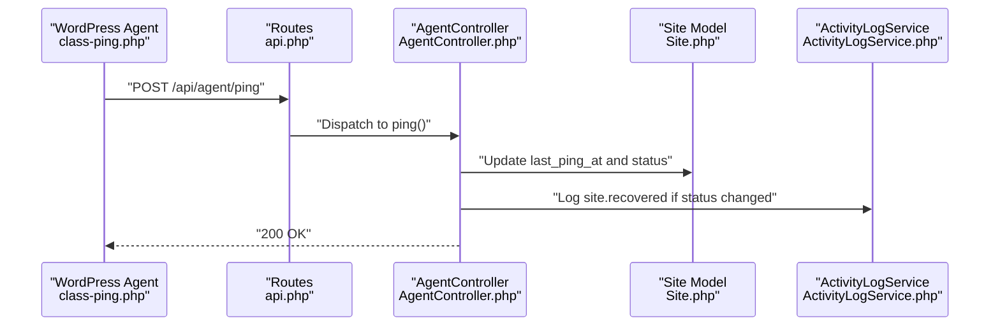
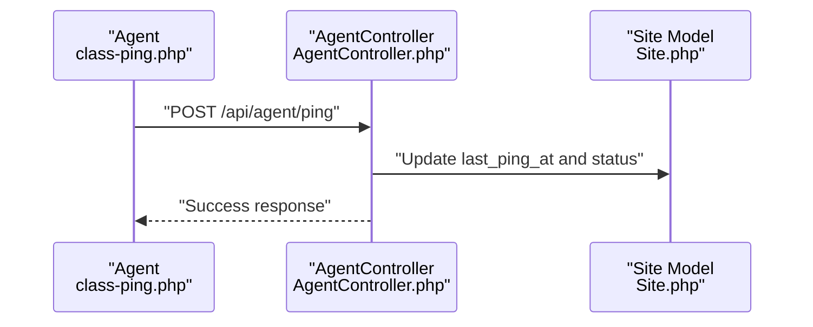
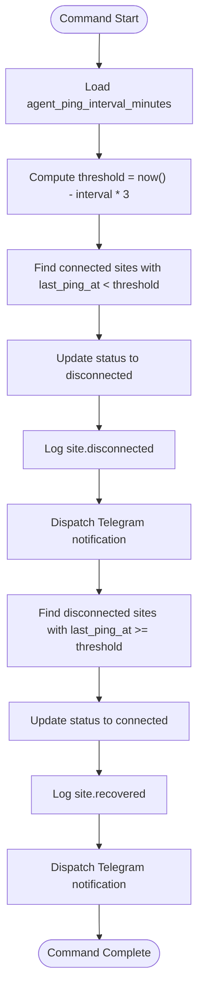
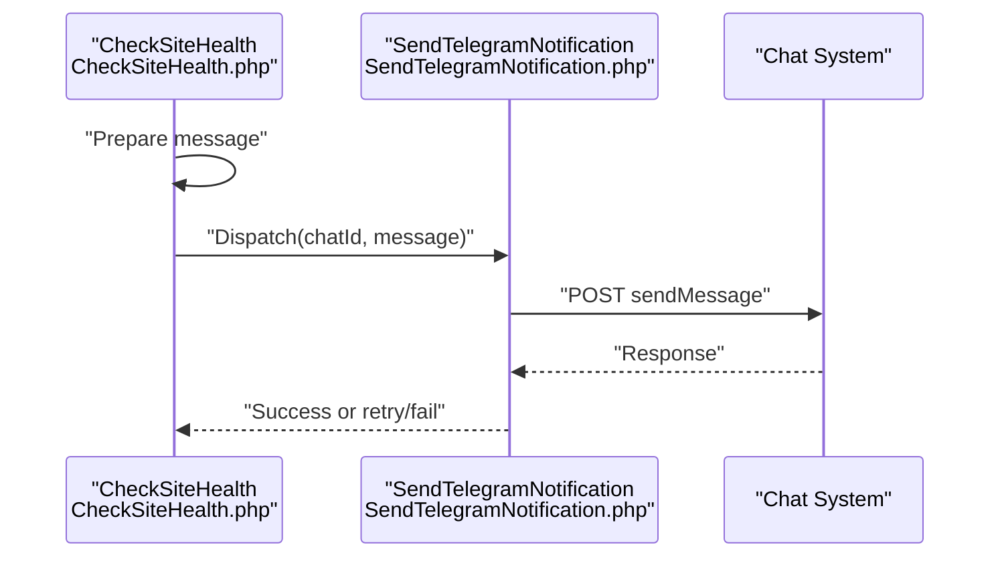
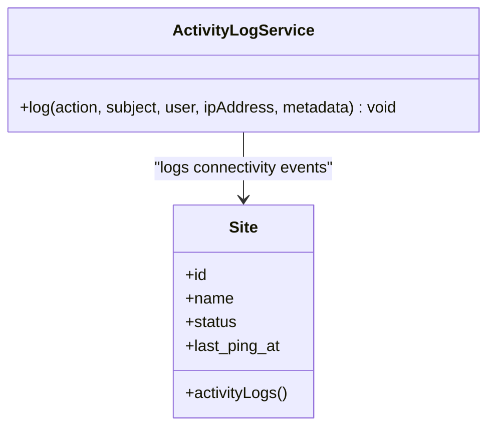
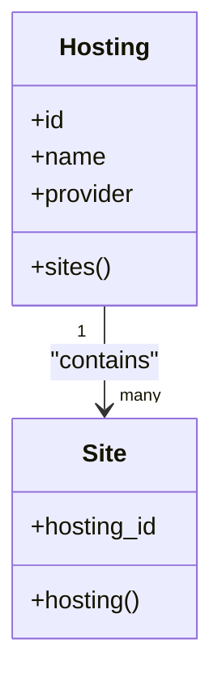
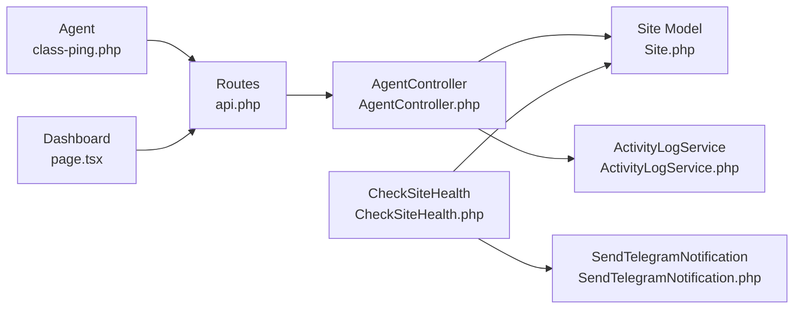

# Performance Monitoring

<cite>
**Referenced Files in This Document**
- [CheckSiteHealth.php](file://portal/app/Console/Commands/CheckSiteHealth.php)
- [AgentController.php](file://portal/app/Http/Controllers/Agent/AgentController.php)
- [class-ping.php](file://agent/epos-wp-agent/includes/class-ping.php)
- [ActivityLogService.php](file://portal/app/Services/ActivityLogService.php)
- [SendTelegramNotification.php](file://portal/app/Jobs/SendTelegramNotification.php)
- [Site.php](file://portal/app/Models/Site.php)
- [Hosting.php](file://portal/app/Models/Hosting.php)
- [page.tsx](file://portal/frontend/src/app/(dashboard)/dashboard/page.tsx)
- [HostingController.php](file://portal/app/Http/Controllers/Portal/HostingController.php)
- [2026_05_15_070002_create_sites_table.php](file://portal/database/migrations/2026_05_15_070002_create_sites_table.php)
- [2026_05_15_070001_create_hostings_table.php](file://portal/database/migrations/2026_05_15_070001_create_hostings_table.php)
- [2026_05_15_070005_create_portal_settings_table.php](file://portal/database/migrations/2026_05_15_070005_create_portal_settings_table.php)
- [api.php](file://portal/routes/api.php)
</cite>

## Table of Contents
1. [Introduction](#introduction)
2. [Project Structure](#project-structure)
3. [Core Components](#core-components)
4. [Architecture Overview](#architecture-overview)
5. [Detailed Component Analysis](#detailed-component-analysis)
6. [Dependency Analysis](#dependency-analysis)
7. [Performance Considerations](#performance-considerations)
8. [Troubleshooting Guide](#troubleshooting-guide)
9. [Conclusion](#conclusion)
10. [Appendices](#appendices)

## Introduction
This document explains the performance monitoring and resource utilization tracking capabilities implemented in the system. It focuses on how hosting performance is monitored via agent pings, how health checks detect connectivity issues, how alerts are triggered, and how historical events are recorded for trend analysis. It also outlines current limitations around direct resource metrics (CPU, memory, disk I/O, network throughput) and provides guidance for extending the system to support richer telemetry and integrations with external monitoring tools.

## Project Structure
The performance monitoring spans three layers:
- Frontend dashboards for high-level visibility
- Backend APIs and controllers for agent handshakes and pings
- Agent-side WordPress plugin that periodically pings the backend
- Background jobs and commands for health checks and notifications
- Activity logging for auditability and trend analysis



**Diagram sources**
- [page.tsx](file://portal/frontend/src/app/(dashboard)/dashboard/page.tsx#L1-L107)
- [class-ping.php:1-83](file://agent/epos-wp-agent/includes/class-ping.php#L1-L83)
- [api.php:1-52](file://portal/routes/api.php#L1-L52)
- [AgentController.php:1-99](file://portal/app/Http/Controllers/Agent/AgentController.php#L1-L99)
- [CheckSiteHealth.php:1-95](file://portal/app/Console/Commands/CheckSiteHealth.php#L1-L95)
- [ActivityLogService.php:1-50](file://portal/app/Services/ActivityLogService.php#L1-L50)
- [SendTelegramNotification.php:1-62](file://portal/app/Jobs/SendTelegramNotification.php#L1-L62)
- [Site.php:1-86](file://portal/app/Models/Site.php#L1-L86)
- [HostingController.php:1-83](file://portal/app/Http/Controllers/Portal/HostingController.php#L1-L83)

**Section sources**
- [page.tsx](file://portal/frontend/src/app/(dashboard)/dashboard/page.tsx#L1-L107)
- [class-ping.php:1-83](file://agent/epos-wp-agent/includes/class-ping.php#L1-L83)
- [api.php:1-52](file://portal/routes/api.php#L1-L52)
- [AgentController.php:1-99](file://portal/app/Http/Controllers/Agent/AgentController.php#L1-L99)
- [CheckSiteHealth.php:1-95](file://portal/app/Console/Commands/CheckSiteHealth.php#L1-L95)
- [ActivityLogService.php:1-50](file://portal/app/Services/ActivityLogService.php#L1-L50)
- [SendTelegramNotification.php:1-62](file://portal/app/Jobs/SendTelegramNotification.php#L1-L62)
- [Site.php:1-86](file://portal/app/Models/Site.php#L1-L86)
- [HostingController.php:1-83](file://portal/app/Http/Controllers/Portal/HostingController.php#L1-L83)

## Core Components
- Agent ping mechanism: The WordPress agent sends periodic pings to the backend, updating site connectivity and recording connection events.
- Health check command: A scheduled command evaluates last ping timestamps against a configurable threshold to mark sites as disconnected or recovered.
- Alerting: Notifications are dispatched via a queued job to a chat system when connectivity changes occur.
- Activity logging: All significant actions (connect, disconnect, recover) are logged for historical trend analysis.
- Frontend dashboard: Displays counts of total, connected, and disconnected sites for quick operational awareness.

**Section sources**
- [class-ping.php:29-81](file://agent/epos-wp-agent/includes/class-ping.php#L29-L81)
- [AgentController.php:61-97](file://portal/app/Http/Controllers/Agent/AgentController.php#L61-L97)
- [CheckSiteHealth.php:16-73](file://portal/app/Console/Commands/CheckSiteHealth.php#L16-L73)
- [SendTelegramNotification.php:25-52](file://portal/app/Jobs/SendTelegramNotification.php#L25-L52)
- [ActivityLogService.php:16-48](file://portal/app/Services/ActivityLogService.php#L16-L48)
- [page.tsx](file://portal/frontend/src/app/(dashboard)/dashboard/page.tsx#L18-L104)

## Architecture Overview
The monitoring architecture relies on:
- Periodic agent pings to maintain liveness and record connectivity
- Backend endpoints to accept pings and handshake requests
- A health-check command to detect outages and recoveries
- Queued jobs for asynchronous alert delivery
- Activity logs for historical trend analysis



**Diagram sources**
- [class-ping.php:50-81](file://agent/epos-wp-agent/includes/class-ping.php#L50-L81)
- [api.php:1-52](file://portal/routes/api.php#L1-L52)
- [AgentController.php:61-97](file://portal/app/Http/Controllers/Agent/AgentController.php#L61-L97)
- [Site.php:1-86](file://portal/app/Models/Site.php#L1-L86)
- [ActivityLogService.php:16-48](file://portal/app/Services/ActivityLogService.php#L16-L48)

## Detailed Component Analysis

### Agent Ping and Handshake
- The agent registers a custom cron schedule for every five minutes and posts a heartbeat payload to the backend.
- The backend controller validates incoming data and updates the site’s last ping timestamp and status.
- On recovery from a disconnected state, the backend logs a recovery event.



**Diagram sources**
- [class-ping.php:29-81](file://agent/epos-wp-agent/includes/class-ping.php#L29-L81)
- [AgentController.php:61-97](file://portal/app/Http/Controllers/Agent/AgentController.php#L61-L97)
- [Site.php:1-86](file://portal/app/Models/Site.php#L1-L86)

**Section sources**
- [class-ping.php:18-24](file://agent/epos-wp-agent/includes/class-ping.php#L18-L24)
- [class-ping.php:29-81](file://agent/epos-wp-agent/includes/class-ping.php#L29-L81)
- [AgentController.php:61-97](file://portal/app/Http/Controllers/Agent/AgentController.php#L61-L97)

### Health Check Command
- The command computes a disconnection threshold based on a configurable ping interval multiplied by a safety factor.
- It marks sites as disconnected if they exceed the threshold and as recovered if they come back within the threshold.
- It emits notifications and writes activity logs for each change.



**Diagram sources**
- [CheckSiteHealth.php:16-73](file://portal/app/Console/Commands/CheckSiteHealth.php#L16-L73)
- [SendTelegramNotification.php:25-52](file://portal/app/Jobs/SendTelegramNotification.php#L25-L52)
- [ActivityLogService.php:16-48](file://portal/app/Services/ActivityLogService.php#L16-L48)

**Section sources**
- [CheckSiteHealth.php:16-73](file://portal/app/Console/Commands/CheckSiteHealth.php#L16-L73)
- [SendTelegramNotification.php:17-18](file://portal/app/Jobs/SendTelegramNotification.php#L17-L18)
- [ActivityLogService.php:16-48](file://portal/app/Services/ActivityLogService.php#L16-L48)

### Alerting Mechanism
- Alerts are queued via a dedicated job that posts messages to a chat system.
- The job retries on transient failures and records permanent failure logs.
- The health command and agent controller can trigger alerts upon connectivity changes.



**Diagram sources**
- [CheckSiteHealth.php:39-42](file://portal/app/Console/Commands/CheckSiteHealth.php#L39-L42)
- [SendTelegramNotification.php:25-52](file://portal/app/Jobs/SendTelegramNotification.php#L25-L52)

**Section sources**
- [CheckSiteHealth.php:81-93](file://portal/app/Console/Commands/CheckSiteHealth.php#L81-L93)
- [SendTelegramNotification.php:25-52](file://portal/app/Jobs/SendTelegramNotification.php#L25-L52)

### Historical Performance Data and Trend Analysis
- Connectivity events (connect, disconnect, recover) are persisted through the activity logging service.
- The frontend dashboard aggregates counts of connected/disconnected sites for quick trend observation.
- Future enhancements could include storing granular metrics (CPU, memory, I/O, network) and exposing them via APIs for advanced analytics.



**Diagram sources**
- [ActivityLogService.php:16-48](file://portal/app/Services/ActivityLogService.php#L16-L48)
- [Site.php:56-60](file://portal/app/Models/Site.php#L56-L60)

**Section sources**
- [ActivityLogService.php:16-48](file://portal/app/Services/ActivityLogService.php#L16-L48)
- [page.tsx](file://portal/frontend/src/app/(dashboard)/dashboard/page.tsx#L18-L104)

### Hosting Management and Site Association
- Hosting entities group multiple sites, enabling capacity planning and resource allocation insights.
- Controllers manage CRUD operations with activity logging for governance.



**Diagram sources**
- [Hosting.php:21-24](file://portal/app/Models/Hosting.php#L21-L24)
- [Site.php:41-44](file://portal/app/Models/Site.php#L41-L44)
- [HostingController.php:19-23](file://portal/app/Http/Controllers/Portal/HostingController.php#L19-L23)

**Section sources**
- [HostingController.php:17-24](file://portal/app/Http/Controllers/Portal/HostingController.php#L17-L24)
- [Hosting.php:21-24](file://portal/app/Models/Hosting.php#L21-L24)
- [Site.php:41-44](file://portal/app/Models/Site.php#L41-L44)

## Dependency Analysis
- The agent depends on WordPress cron and HTTP client to post pings.
- The backend controllers depend on models and services for persistence and logging.
- The health command depends on configuration settings and queues for alerting.
- The frontend dashboard depends on API endpoints to render statistics.



**Diagram sources**
- [class-ping.php:29-81](file://agent/epos-wp-agent/includes/class-ping.php#L29-L81)
- [api.php:1-52](file://portal/routes/api.php#L1-L52)
- [AgentController.php:61-97](file://portal/app/Http/Controllers/Agent/AgentController.php#L61-L97)
- [Site.php:1-86](file://portal/app/Models/Site.php#L1-L86)
- [ActivityLogService.php:16-48](file://portal/app/Services/ActivityLogService.php#L16-L48)
- [CheckSiteHealth.php:16-73](file://portal/app/Console/Commands/CheckSiteHealth.php#L16-L73)
- [SendTelegramNotification.php:25-52](file://portal/app/Jobs/SendTelegramNotification.php#L25-L52)
- [page.tsx](file://portal/frontend/src/app/(dashboard)/dashboard/page.tsx#L18-L104)

**Section sources**
- [class-ping.php:29-81](file://agent/epos-wp-agent/includes/class-ping.php#L29-L81)
- [AgentController.php:61-97](file://portal/app/Http/Controllers/Agent/AgentController.php#L61-L97)
- [CheckSiteHealth.php:16-73](file://portal/app/Console/Commands/CheckSiteHealth.php#L16-L73)
- [SendTelegramNotification.php:25-52](file://portal/app/Jobs/SendTelegramNotification.php#L25-L52)
- [page.tsx](file://portal/frontend/src/app/(dashboard)/dashboard/page.tsx#L18-L104)

## Performance Considerations
- Current metrics: The system tracks connectivity liveness via agent pings and maintains a last ping timestamp per site. There is no built-in collection of CPU, memory, disk I/O, or network throughput.
- Scalability: Health checks and pings operate on lightweight database updates and HTTP requests. As the number of sites grows, ensure database indexing on status and last_ping_at improves query performance.
- Alerting overhead: Queued jobs process notifications asynchronously, reducing latency spikes during mass connectivity changes.
- Recommendations:
  - Add database indexes on status and last_ping_at for faster health checks.
  - Introduce optional telemetry endpoints on agents to report resource metrics (to be stored in a new metrics table).
  - Expose metrics via APIs for integration with external monitoring systems (e.g., Prometheus, Grafana).
  - Implement rate limiting and circuit breakers for alert dispatches to prevent cascading failures.

[No sources needed since this section provides general guidance]

## Troubleshooting Guide
- Agent cannot connect:
  - Verify portal URL and API key in agent settings.
  - Confirm backend route availability and that the agent key header is present.
- Frequent disconnects:
  - Adjust the ping interval setting and the safety multiplier used by the health check command.
  - Inspect agent cron schedules and server time synchronization.
- Alerts not delivered:
  - Ensure the chat token and chat ID are configured.
  - Review queued job logs for retry attempts and final failures.
- Missing historical trends:
  - Confirm the activity logs table exists and is writable.
  - Validate that connectivity events are being logged on ping and recovery.

**Section sources**
- [class-ping.php:30-35](file://agent/epos-wp-agent/includes/class-ping.php#L30-L35)
- [AgentController.php:16-55](file://portal/app/Http/Controllers/Agent/AgentController.php#L16-L55)
- [CheckSiteHealth.php:75-79](file://portal/app/Console/Commands/CheckSiteHealth.php#L75-L79)
- [SendTelegramNotification.php:27-32](file://portal/app/Jobs/SendTelegramNotification.php#L27-L32)
- [ActivityLogService.php:34-42](file://portal/app/Services/ActivityLogService.php#L34-L42)

## Conclusion
The system currently provides robust connectivity monitoring through agent pings, automated health checks, and alerting. Historical events are captured for trend analysis, and the frontend offers a concise dashboard overview. To achieve comprehensive performance monitoring, extend the system with optional resource telemetry collection, standardized metrics APIs, and integrations with external monitoring platforms.

[No sources needed since this section summarizes without analyzing specific files]

## Appendices

### Data Model Overview
The following tables capture connectivity and configuration data used by the monitoring system.

```mermaid
erDiagram
SITES {
bigint id PK
bigint hosting_id FK
string name
string url
string api_secret_key
enum status
string wp_version
string php_version
boolean woo_active
timestamp last_ping_at
json tags
bigint created_by FK
timestamps
soft_deleted
}
HOSTINGS {
bigint id PK
string name
string provider
text note
bigint created_by FK
timestamps
soft_deleted
}
PORTAL_SETTINGS {
bigint id PK
string key UK
text value
timestamps
}
HOSTINGS ||--o{ SITES : "contains"
```

**Diagram sources**
- [2026_05_15_070002_create_sites_table.php:11-27](file://portal/database/migrations/2026_05_15_070002_create_sites_table.php#L11-L27)
- [2026_05_15_070001_create_hostings_table.php:11-19](file://portal/database/migrations/2026_05_15_070001_create_hostings_table.php#L11-L19)
- [2026_05_15_070005_create_portal_settings_table.php:11-16](file://portal/database/migrations/2026_05_15_070005_create_portal_settings_table.php#L11-L16)

### API Surface for Monitoring
- Agent endpoints:
  - POST /api/agent/handshake: Establish initial connection and update site metadata.
  - POST /api/agent/ping: Heartbeat to keep site connected and record recovery.

**Section sources**
- [AgentController.php:16-97](file://portal/app/Http/Controllers/Agent/AgentController.php#L16-L97)
- [api.php:1-52](file://portal/routes/api.php#L1-L52)