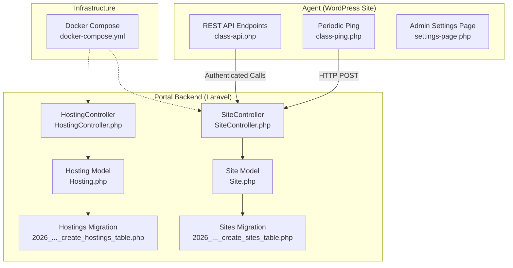
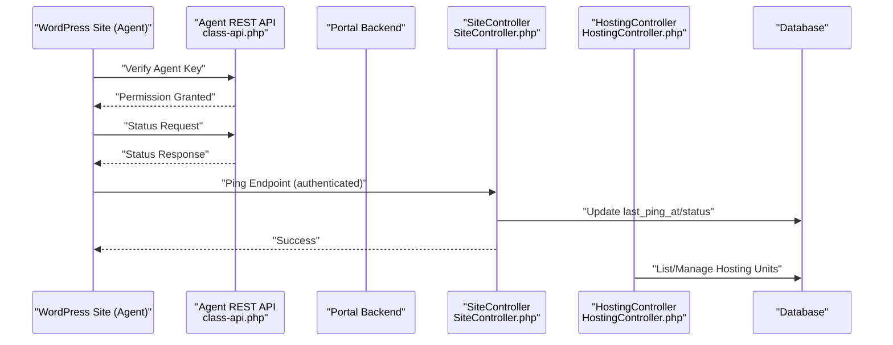
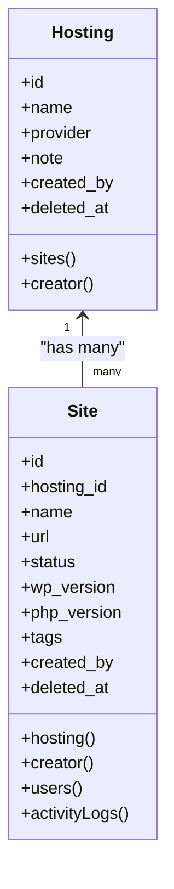
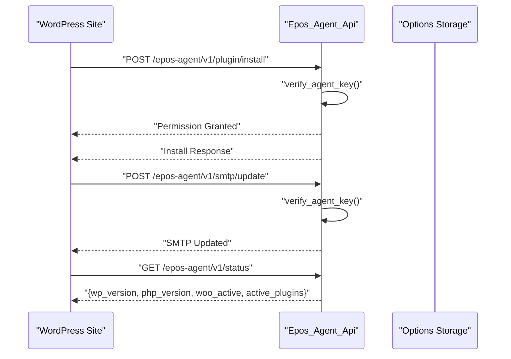
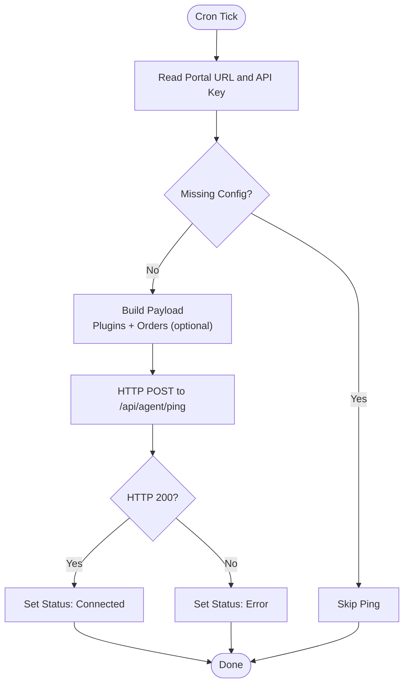
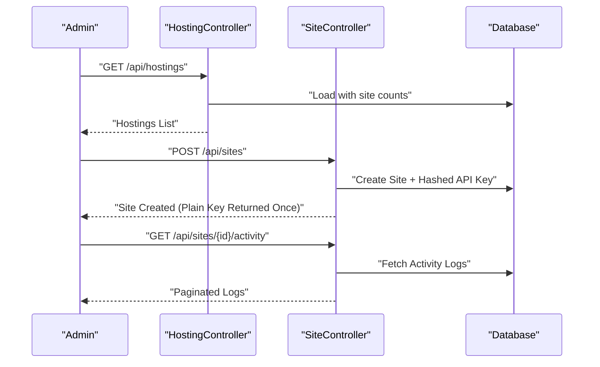
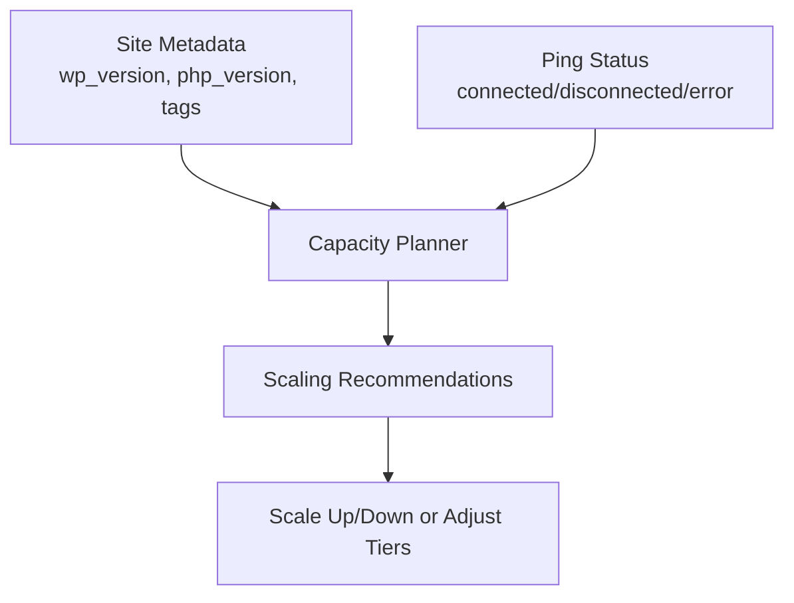
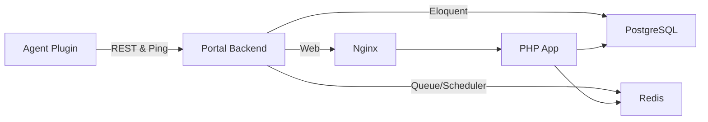

# Resource Allocation Management

<cite>
**Referenced Files in This Document**
- [docker-compose.yml](file://docker-compose.yml)
- [epos-wp-agent.php](file://agent/epos-wp-agent/epos-wp-agent.php)
- [settings-page.php](file://agent/epos-wp-agent/admin/settings-page.php)
- [class-api.php](file://agent/epos-wp-agent/includes/class-api.php)
- [class-ping.php](file://agent/epos-wp-agent/includes/class-ping.php)
- [Hosting.php](file://portal/app/Models/Hosting.php)
- [Site.php](file://portal/app/Models/Site.php)
- [2026_05_15_070001_create_hostings_table.php](file://portal/database/migrations/2026_05_15_070001_create_hostings_table.php)
- [2026_05_15_070002_create_sites_table.php](file://portal/database/migrations/2026_05_15_070002_create_sites_table.php)
- [HostingController.php](file://portal/app/Http/Controllers/Portal/HostingController.php)
- [SiteController.php](file://portal/app/Http/Controllers/Portal/SiteController.php)
</cite>

## Table of Contents
1. [Introduction](#introduction)
2. [Project Structure](#project-structure)
3. [Core Components](#core-components)
4. [Architecture Overview](#architecture-overview)
5. [Detailed Component Analysis](#detailed-component-analysis)
6. [Dependency Analysis](#dependency-analysis)
7. [Performance Considerations](#performance-considerations)
8. [Troubleshooting Guide](#troubleshooting-guide)
9. [Conclusion](#conclusion)
10. [Appendices](#appendices)

## Introduction
This document describes resource allocation management within the hosting system. It focuses on how hosting resources are modeled, how WordPress sites are associated with hosting units, and how the system monitors connectivity and operational status. While the current codebase does not implement explicit CPU, memory, storage, or bandwidth quotas, it provides the foundation for building capacity planning and resource monitoring around the existing hosting and site models, along with the agent-driven ping mechanism that tracks site health and connectivity.

## Project Structure
The hosting system comprises:
- A Laravel-based portal backend that manages hosting units and WordPress sites.
- A WordPress plugin agent that communicates with the portal, periodically pings its status, and exposes administrative endpoints for remote management.
- A Docker Compose environment that orchestrates the application stack, including the web server, application container, PostgreSQL database, Redis, and optional queue/scheduler services.

**Diagram sources**
- [docker-compose.yml:1-109](file://docker-compose.yml#L1-L109)
- [class-api.php:1-110](file://agent/epos-wp-agent/includes/class-api.php#L1-L110)
- [class-ping.php:1-83](file://agent/epos-wp-agent/includes/class-ping.php#L1-L83)
- [settings-page.php:1-118](file://agent/epos-wp-agent/admin/settings-page.php#L1-L118)
- [Hosting.php:1-31](file://portal/app/Models/Hosting.php#L1-L31)
- [Site.php:1-76](file://portal/app/Models/Site.php#L1-L76)
- [2026_05_15_070001_create_hostings_table.php:1-27](file://portal/database/migrations/2026_05_15_070001_create_hostings_table.php#L1-L27)
- [2026_05_15_070002_create_sites_table.php:1-35](file://portal/database/migrations/2026_05_15_070002_create_sites_table.php#L1-L35)
- [HostingController.php:1-83](file://portal/app/Http/Controllers/Portal/HostingController.php#L1-L83)
- [SiteController.php:1-204](file://portal/app/Http/Controllers/Portal/SiteController.php#L1-L204)

**Section sources**
- [docker-compose.yml:1-109](file://docker-compose.yml#L1-L109)
- [epos-wp-agent.php:1-61](file://agent/epos-wp-agent/epos-wp-agent.php#L1-L61)

## Core Components
- Hosting model and controller: Represent hosting units and expose CRUD operations, including listing with site counts and soft deletion semantics.
- Site model and controller: Represent WordPress sites, track status, metadata, and associations with hosting and users, and provide filtering/searching capabilities.
- Agent plugin: Exposes REST endpoints for remote management, verifies agent keys, and performs periodic pings to the portal to report status and connectivity.
- Infrastructure: Docker Compose defines service containers and network topology supporting the portal backend.

Key observations:
- No explicit resource quota fields exist in the hosting or site models.
- The agent ping mechanism records connection status and can be leveraged for availability and health monitoring.
- The portal maintains site metadata such as WordPress and PHP versions, which can inform capacity planning decisions.

**Section sources**
- [Hosting.php:1-31](file://portal/app/Models/Hosting.php#L1-L31)
- [Site.php:1-76](file://portal/app/Models/Site.php#L1-L76)
- [2026_05_15_070001_create_hostings_table.php:1-27](file://portal/database/migrations/2026_05_15_070001_create_hostings_table.php#L1-L27)
- [2026_05_15_070002_create_sites_table.php:1-35](file://portal/database/migrations/2026_05_15_070002_create_sites_table.php#L1-L35)
- [HostingController.php:1-83](file://portal/app/Http/Controllers/Portal/HostingController.php#L1-L83)
- [SiteController.php:1-204](file://portal/app/Http/Controllers/Portal/SiteController.php#L1-L204)
- [class-ping.php:1-83](file://agent/epos-wp-agent/includes/class-ping.php#L1-L83)

## Architecture Overview
The system architecture connects WordPress sites (agents) to the central portal via authenticated REST endpoints and periodic pings. The portal manages hosting and site entities, while infrastructure orchestration ensures runtime availability.

**Diagram sources**
- [class-api.php:1-110](file://agent/epos-wp-agent/includes/class-api.php#L1-L110)
- [SiteController.php:1-204](file://portal/app/Http/Controllers/Portal/SiteController.php#L1-L204)
- [HostingController.php:1-83](file://portal/app/Http/Controllers/Portal/HostingController.php#L1-L83)

## Detailed Component Analysis

### Hosting and Site Models
- Hosting: Represents a hosting unit with provider and note fields, and maintains a count of associated sites.
- Site: Represents a WordPress site with status, versions, and tags, and links to hosting and users.

**Diagram sources**
- [Hosting.php:1-31](file://portal/app/Models/Hosting.php#L1-L31)
- [Site.php:1-76](file://portal/app/Models/Site.php#L1-L76)

**Section sources**
- [Hosting.php:1-31](file://portal/app/Models/Hosting.php#L1-L31)
- [Site.php:1-76](file://portal/app/Models/Site.php#L1-L76)
- [2026_05_15_070001_create_hostings_table.php:1-27](file://portal/database/migrations/2026_05_15_070001_create_hostings_table.php#L1-L27)
- [2026_05_15_070002_create_sites_table.php:1-35](file://portal/database/migrations/2026_05_15_070002_create_sites_table.php#L1-L35)

### Agent REST API and Authentication
- The agent registers REST routes under a dedicated namespace and enforces key-based authentication using a shared secret.
- Endpoints include plugin installation/update, SMTP configuration updates/tests, and a status endpoint returning WordPress and plugin information.

**Diagram sources**
- [class-api.php:1-110](file://agent/epos-wp-agent/includes/class-api.php#L1-L110)

**Section sources**
- [class-api.php:1-110](file://agent/epos-wp-agent/includes/class-api.php#L1-L110)

### Periodic Ping Mechanism
- The agent schedules a periodic ping to the portal at a fixed interval, sending site metadata and optionally order data when WooCommerce is active.
- The portal endpoint updates last ping timestamps and connection status, enabling monitoring of site health and availability.

**Diagram sources**
- [class-ping.php:1-83](file://agent/epos-wp-agent/includes/class-ping.php#L1-L83)

**Section sources**
- [class-ping.php:1-83](file://agent/epos-wp-agent/includes/class-ping.php#L1-L83)

### Portal Controllers: Hosting and Site Management
- HostingController supports listing, creation, retrieval, updates, and deletion of hosting units, with activity logging and site unlinking during deletion.
- SiteController supports listing with filters, creation with generated API keys, per-site management, regeneration of API keys, and activity log retrieval.

**Diagram sources**
- [HostingController.php:1-83](file://portal/app/Http/Controllers/Portal/HostingController.php#L1-L83)
- [SiteController.php:1-204](file://portal/app/Http/Controllers/Portal/SiteController.php#L1-L204)

**Section sources**
- [HostingController.php:1-83](file://portal/app/Http/Controllers/Portal/HostingController.php#L1-L83)
- [SiteController.php:1-204](file://portal/app/Http/Controllers/Portal/SiteController.php#L1-L204)

### Conceptual Overview
- Current implementation focuses on connectivity and operational visibility rather than explicit resource quotas.
- Capacity planning can leverage site metadata (versions, tags) and ping status to infer load characteristics and drive scaling decisions.

[No sources needed since this diagram shows conceptual workflow, not actual code structure]

## Dependency Analysis
- The agent plugin depends on WordPress hooks and options storage for configuration and authentication.
- The portal controllers depend on Eloquent models and database migrations to persist and query hosting and site data.
- Docker Compose ties services together and provides external exposure for the application stack.

**Diagram sources**
- [docker-compose.yml:1-109](file://docker-compose.yml#L1-L109)
- [class-api.php:1-110](file://agent/epos-wp-agent/includes/class-api.php#L1-L110)
- [class-ping.php:1-83](file://agent/epos-wp-agent/includes/class-ping.php#L1-L83)
- [SiteController.php:1-204](file://portal/app/Http/Controllers/Portal/SiteController.php#L1-L204)

**Section sources**
- [docker-compose.yml:1-109](file://docker-compose.yml#L1-L109)

## Performance Considerations
- Connection checks and pings occur at regular intervals; ensure intervals balance observability with overhead.
- REST endpoints should validate inputs and enforce rate limits to prevent abuse.
- Database queries for listing sites and hosts should leverage indexing on frequently filtered columns (status, hosting_id, tags).
- Caching of site metadata and connection status can reduce repeated computations.

[No sources needed since this section provides general guidance]

## Troubleshooting Guide
Common issues and remedies:
- Agent key mismatch: Verify the stored key matches the provided header and that the portal URL is configured correctly.
- Missing configuration: Ensure portal URL and API key are set in the agent settings page.
- Connectivity errors: Review ping response codes and connection status updates; investigate SSL/TLS and network reachability.
- Rate limiting or timeouts: Increase timeout values and implement retry/backoff strategies in the agent.

**Section sources**
- [class-api.php:48-71](file://agent/epos-wp-agent/includes/class-api.php#L48-L71)
- [settings-page.php:20-27](file://agent/epos-wp-agent/admin/settings-page.php#L20-L27)
- [class-ping.php:30-81](file://agent/epos-wp-agent/includes/class-ping.php#L30-L81)

## Conclusion
The current system establishes a strong foundation for resource allocation management by modeling hosting and site entities, enforcing secure agent communication, and tracking connectivity through periodic pings. While explicit CPU, memory, storage, and bandwidth quotas are not present in the codebase, the existing models and monitoring mechanisms can serve as the basis for implementing capacity planning, resource tracking, and automated scaling policies.

## Appendices

### Appendix A: Data Model Definitions
- Hosting table fields: name, provider, note, created_by, timestamps, soft deletes.
- Site table fields: hosting_id, name, url, description, api_secret_key, status, wp_version, php_version, woo_active, last_ping_at, tags, created_by, timestamps, soft deletes.

**Section sources**
- [2026_05_15_070001_create_hostings_table.php:11-18](file://portal/database/migrations/2026_05_15_070001_create_hostings_table.php#L11-L18)
- [2026_05_15_070002_create_sites_table.php:11-26](file://portal/database/migrations/2026_05_15_070002_create_sites_table.php#L11-L26)

### Appendix B: Example Scaling Scenarios
- Scenario 1: High traffic detected via frequent pings and increased plugin activity; scale vertically by moving to a higher-tier hosting unit.
- Scenario 2: Multiple disconnected sites indicate infrastructure issues; trigger auto-provisioning of new hosting units and rebalance site allocations.
- Scenario 3: Tag-based grouping of sites by technology stack enables targeted scaling policies (e.g., PHP version upgrades requiring more memory).

[No sources needed since this section provides general guidance]