# Multi-Channel Notifications

<cite>
**Referenced Files in This Document**
- [SendTelegramNotification.php](file://portal/app/Jobs/SendTelegramNotification.php)
- [TelegramNotificationService.php](file://portal/app/Services/TelegramNotificationService.php)
- [SettingsController.php](file://portal/app/Http/Controllers/Portal/SettingsController.php)
- [mail.php](file://portal/config/mail.php)
- [class-smtp-config.php](file://agent/epos-wp-agent/includes/class-smtp-config.php)
- [class-api.php](file://agent/epos-wp-agent/includes/class-api.php)
- [User.php](file://portal/app/Models/User.php)
- [PortalSetting.php](file://portal/app/Models/PortalSetting.php)
- [2026_05_15_070005_create_portal_settings_table.php](file://portal/database/migrations/2026_05_15_070005_create_portal_settings_table.php)
- [ActivityLog.php](file://portal/app/Models/ActivityLog.php)
</cite>

## Table of Contents
1. [Introduction](#introduction)
2. [Project Structure](#project-structure)
3. [Core Components](#core-components)
4. [Architecture Overview](#architecture-overview)
5. [Detailed Component Analysis](#detailed-component-analysis)
6. [Dependency Analysis](#dependency-analysis)
7. [Performance Considerations](#performance-considerations)
8. [Troubleshooting Guide](#troubleshooting-guide)
9. [Conclusion](#conclusion)
10. [Appendices](#appendices)

## Introduction
This document describes the current multi-channel notification capabilities and the extensible architecture for adding new channels. The system currently supports Telegram notifications with asynchronous delivery via queues and synchronous testing. It also includes an email subsystem with configurable mailers and an SMTP configuration mechanism for WordPress agents. The document outlines how to extend the system to support additional channels (email templates, SMS, webhooks), how to route messages across multiple channels, and how to manage user preferences and opt-outs.

## Project Structure
The notification-related code spans three areas:
- Portal backend (Laravel): Telegram service, job, settings controller, and configuration
- Agent plugin (WordPress): SMTP configuration endpoints and PHPMailer integration
- Shared configuration: mail transport settings and portal settings persistence

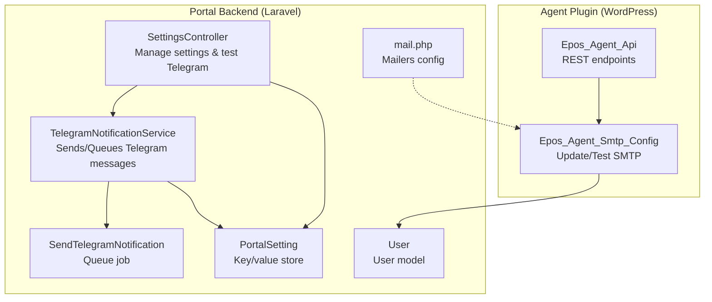

**Diagram sources**
- [TelegramNotificationService.php:11-106](file://portal/app/Services/TelegramNotificationService.php#L11-L106)
- [SendTelegramNotification.php:13-61](file://portal/app/Jobs/SendTelegramNotification.php#L13-L61)
- [SettingsController.php:11-86](file://portal/app/Http/Controllers/Portal/SettingsController.php#L11-L86)
- [mail.php:38-118](file://portal/config/mail.php#L38-L118)
- [PortalSetting.php:7-10](file://portal/app/Models/PortalSetting.php#L7-L10)
- [User.php:11-37](file://portal/app/Models/User.php#L11-L37)
- [class-api.php:6-37](file://agent/epos-wp-agent/includes/class-api.php#L6-L37)
- [class-smtp-config.php:5-104](file://agent/epos-wp-agent/includes/class-smtp-config.php#L5-L104)

**Section sources**
- [TelegramNotificationService.php:11-106](file://portal/app/Services/TelegramNotificationService.php#L11-L106)
- [SendTelegramNotification.php:13-61](file://portal/app/Jobs/SendTelegramNotification.php#L13-L61)
- [SettingsController.php:11-86](file://portal/app/Http/Controllers/Portal/SettingsController.php#L11-L86)
- [mail.php:38-118](file://portal/config/mail.php#L38-L118)
- [class-api.php:6-37](file://agent/epos-wp-agent/includes/class-api.php#L6-L37)
- [class-smtp-config.php:5-104](file://agent/epos-wp-agent/includes/class-smtp-config.php#L5-L104)
- [PortalSetting.php:7-10](file://portal/app/Models/PortalSetting.php#L7-L10)
- [User.php:11-37](file://portal/app/Models/User.php#L11-L37)

## Core Components
- TelegramNotificationService: Provides synchronous send and asynchronous queue methods, admin channel broadcasting, and cached retrieval of Telegram bot token and default chat ID from portal settings.
- SendTelegramNotification: Queue job implementing retry/backoff behavior and logging for Telegram API failures.
- SettingsController: Manages portal-wide settings (including Telegram credentials and defaults), masks sensitive values, and exposes a test endpoint for Telegram.
- mail.php: Defines supported mailers (SMTP, SES, Postmark, Resend, Sendmail, Log, Array, Failover, Round-robin) and global sender identity.
- Epos_Agent_Smtp_Config: Applies SMTP settings to PHPMailer and sends test emails for WordPress sites.
- Epos_Agent_Api: Exposes REST endpoints for agent-to-portal communication (install, SMTP update/test).
- PortalSetting: Key/value store for configuration persisted in the database.
- User: Includes a field for storing Telegram chat ID.

**Section sources**
- [TelegramNotificationService.php:11-106](file://portal/app/Services/TelegramNotificationService.php#L11-L106)
- [SendTelegramNotification.php:13-61](file://portal/app/Jobs/SendTelegramNotification.php#L13-L61)
- [SettingsController.php:11-86](file://portal/app/Http/Controllers/Portal/SettingsController.php#L11-L86)
- [mail.php:38-118](file://portal/config/mail.php#L38-L118)
- [class-smtp-config.php:5-104](file://agent/epos-wp-agent/includes/class-smtp-config.php#L5-L104)
- [class-api.php:6-37](file://agent/epos-wp-agent/includes/class-api.php#L6-L37)
- [PortalSetting.php:7-10](file://portal/app/Models/PortalSetting.php#L7-L10)
- [User.php:11-37](file://portal/app/Models/User.php#L11-L37)

## Architecture Overview
The system separates concerns between:
- Synchronous vs asynchronous delivery: Telegram messages can be sent immediately for testing or queued for background processing.
- Centralized configuration: Settings are stored in a key/value table and cached for performance.
- Transport abstraction: Email uses Laravel’s mailer configuration supporting multiple transports.
- Agent integration: WordPress agent applies SMTP settings and validates connectivity.

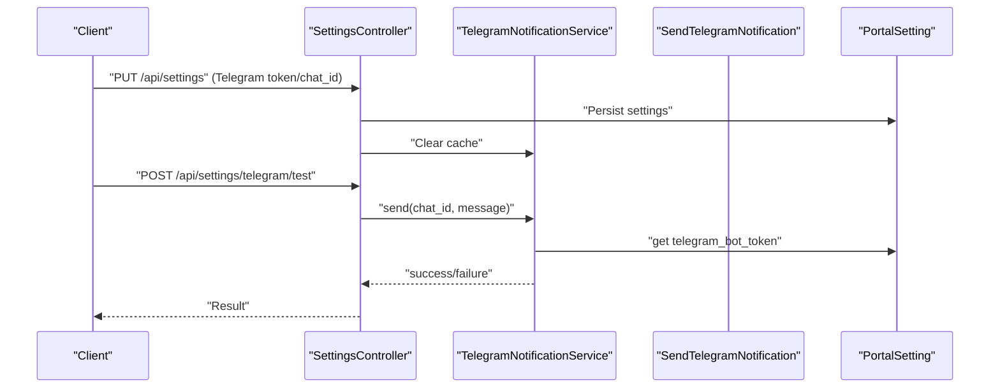

**Diagram sources**
- [SettingsController.php:33-85](file://portal/app/Http/Controllers/Portal/SettingsController.php#L33-L85)
- [TelegramNotificationService.php:16-47](file://portal/app/Services/TelegramNotificationService.php#L16-L47)
- [PortalSetting.php:7-10](file://portal/app/Models/PortalSetting.php#L7-L10)

## Detailed Component Analysis

### Telegram Notification Service
- Responsibilities:
  - Synchronous send with timeout and error handling
  - Asynchronous dispatch to queue with default chat fallback
  - Admin channel broadcast
  - Cached retrieval of bot token and default chat ID
- Error handling:
  - Logs warnings when missing credentials
  - Returns false on failure and throws on queue job errors to trigger retries
- Extensibility:
  - New channels can reuse the same pattern: a service class with sync/async methods and a queue job

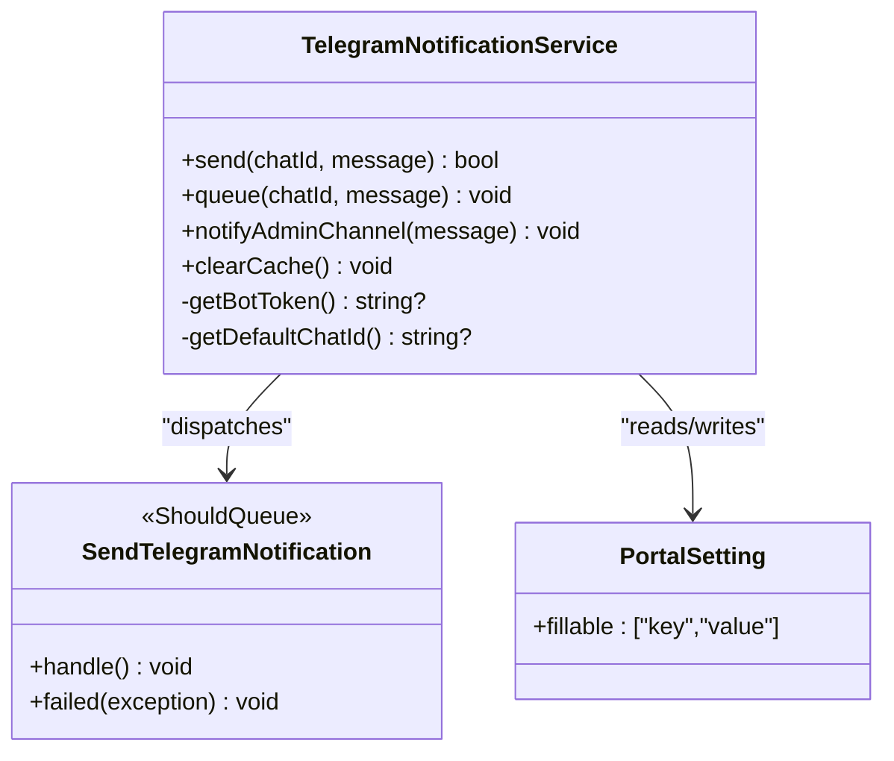

**Diagram sources**
- [TelegramNotificationService.php:11-106](file://portal/app/Services/TelegramNotificationService.php#L11-L106)
- [SendTelegramNotification.php:13-61](file://portal/app/Jobs/SendTelegramNotification.php#L13-L61)
- [PortalSetting.php:7-10](file://portal/app/Models/PortalSetting.php#L7-L10)

**Section sources**
- [TelegramNotificationService.php:11-106](file://portal/app/Services/TelegramNotificationService.php#L11-L106)
- [SendTelegramNotification.php:13-61](file://portal/app/Jobs/SendTelegramNotification.php#L13-L61)

### Queue Job: SendTelegramNotification
- Implements ShouldQueue with retry/backoff
- Fetches token from settings
- Posts to Telegram API with Markdown parsing
- Logs successes and failures; throws to trigger retry on API errors

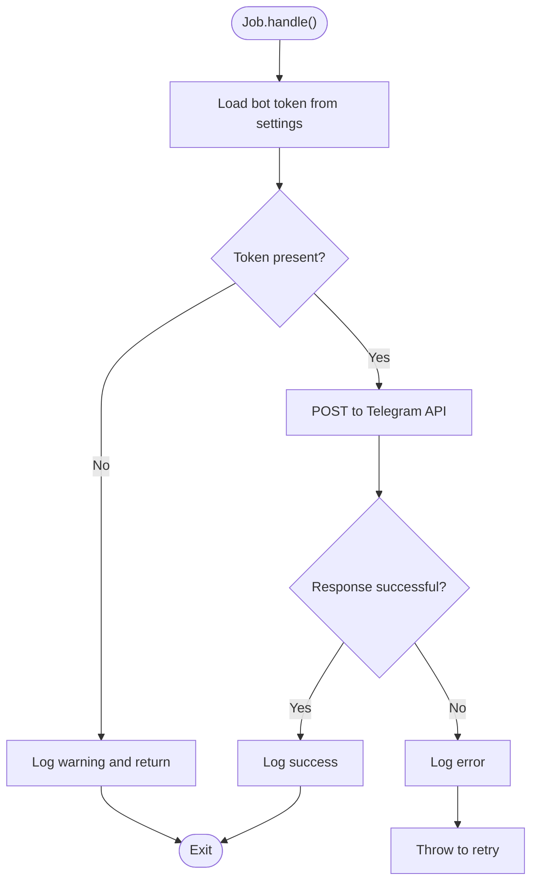

**Diagram sources**
- [SendTelegramNotification.php:25-51](file://portal/app/Jobs/SendTelegramNotification.php#L25-L51)

**Section sources**
- [SendTelegramNotification.php:13-61](file://portal/app/Jobs/SendTelegramNotification.php#L13-L61)

### Settings Management and Testing
- SettingsController:
  - Lists and updates portal settings
  - Masks Telegram bot token in responses
  - Clears Telegram cache after updates
  - Provides a test endpoint that triggers synchronous Telegram send
- PortalSetting:
  - Key/value persistence for configuration
- User:
  - Stores Telegram chat ID per user

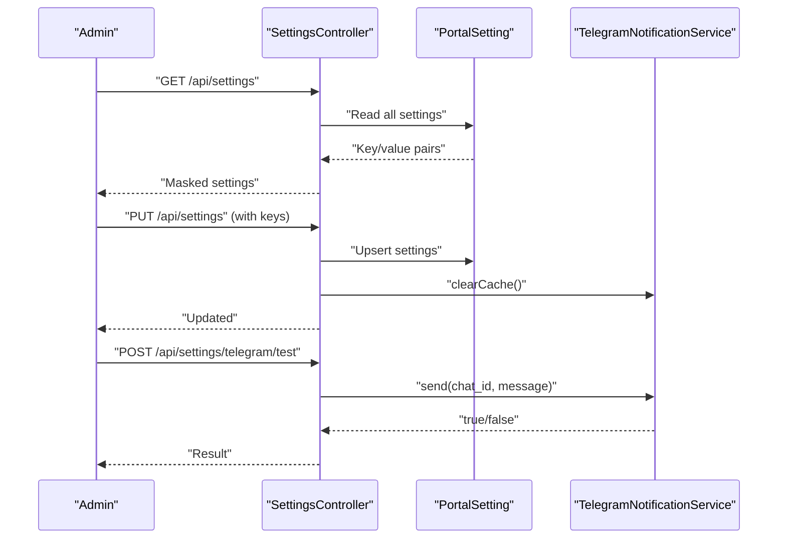

**Diagram sources**
- [SettingsController.php:18-85](file://portal/app/Http/Controllers/Portal/SettingsController.php#L18-L85)
- [PortalSetting.php:7-10](file://portal/app/Models/PortalSetting.php#L7-L10)
- [TelegramNotificationService.php:16-47](file://portal/app/Services/TelegramNotificationService.php#L16-L47)

**Section sources**
- [SettingsController.php:11-86](file://portal/app/Http/Controllers/Portal/SettingsController.php#L11-L86)
- [PortalSetting.php:7-10](file://portal/app/Models/PortalSetting.php#L7-L10)
- [User.php:11-37](file://portal/app/Models/User.php#L11-L37)

### Email Subsystem and SMTP Configuration
- mail.php defines multiple mailers and transport options, including SMTP, SES, Postmark, Resend, Sendmail, Log, Array, Failover, and Round-robin.
- Epos_Agent_Smtp_Config:
  - Receives SMTP settings from the Portal via REST
  - Persists WordPress options
  - Hooks into PHPMailer to apply settings
  - Sends a test email and returns success/failure
- class-api registers REST endpoints for agent-to-portal communication, including SMTP update and test.

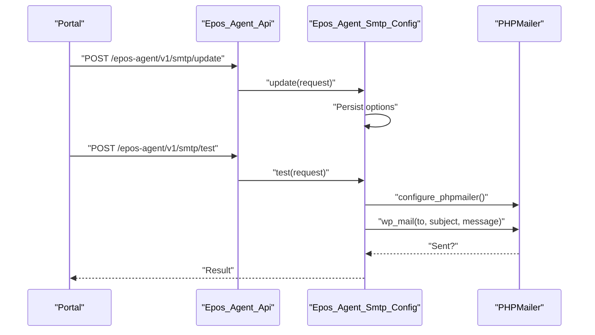

**Diagram sources**
- [mail.php:38-118](file://portal/config/mail.php#L38-L118)
- [class-api.php:15-37](file://agent/epos-wp-agent/includes/class-api.php#L15-L37)
- [class-smtp-config.php:13-103](file://agent/epos-wp-agent/includes/class-smtp-config.php#L13-L103)

**Section sources**
- [mail.php:38-118](file://portal/config/mail.php#L38-L118)
- [class-api.php:6-37](file://agent/epos-wp-agent/includes/class-api.php#L6-L37)
- [class-smtp-config.php:5-104](file://agent/epos-wp-agent/includes/class-smtp-config.php#L5-L104)

### Extensible Architecture for New Channels
- Pattern to follow:
  - Create a service class with:
    - Synchronous send method for immediate delivery
    - Queue method for background delivery
    - Optional admin broadcast helper
    - Cached settings retrieval
  - Create a queue job implementing ShouldQueue with retry/backoff and robust logging
  - Add configuration keys to PortalSetting and expose via SettingsController
  - Integrate with Laravel mailers for email channels
- Channel-specific configuration:
  - Telegram: bot token and default chat ID
  - Email: mailer selection and transport-specific settings
  - SMS/Webhook: add new keys and jobs similarly

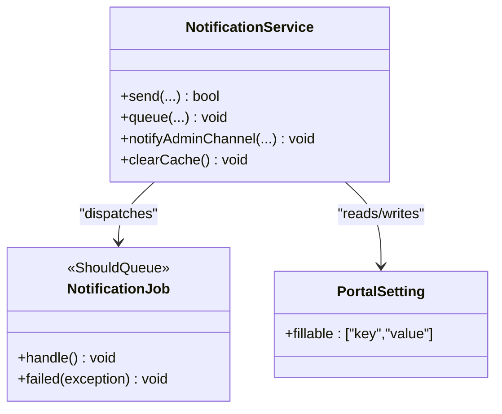

[No sources needed since this diagram shows conceptual architecture, not a direct mapping to specific files]

**Section sources**
- [TelegramNotificationService.php:11-106](file://portal/app/Services/TelegramNotificationService.php#L11-L106)
- [SendTelegramNotification.php:13-61](file://portal/app/Jobs/SendTelegramNotification.php#L13-L61)
- [SettingsController.php:33-64](file://portal/app/Http/Controllers/Portal/SettingsController.php#L33-L64)
- [PortalSetting.php:7-10](file://portal/app/Models/PortalSetting.php#L7-L10)

### Notification Routing Logic
- Current routing:
  - Telegram: synchronous send for testing; asynchronous queue for production
  - Email: configured via Laravel mailers; agent applies SMTP settings
- Proposed routing strategy:
  - Centralized router service that accepts a message and a channel list
  - For each channel, resolve credentials from PortalSetting and dispatch appropriate job/service
  - Support failover and round-robin strategies via Laravel mailers for email
  - Example: critical alerts -> Telegram (queue) + Email (failover mailer)

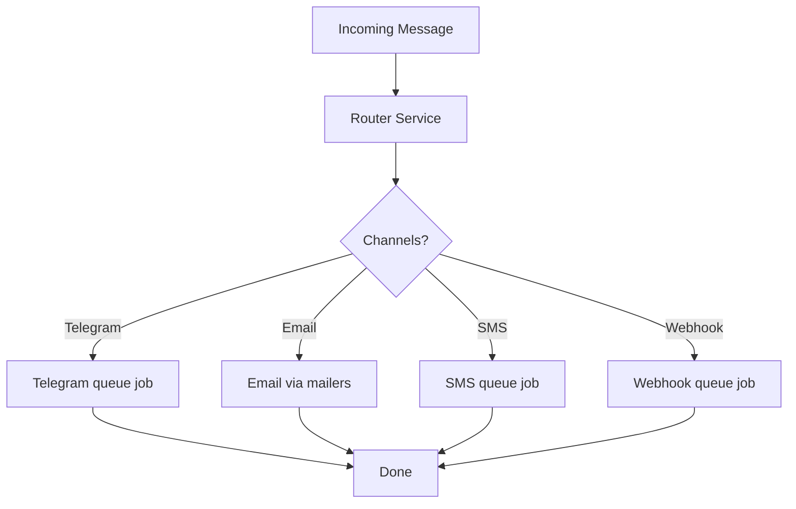

[No sources needed since this diagram shows conceptual routing logic]

**Section sources**
- [TelegramNotificationService.php:53-76](file://portal/app/Services/TelegramNotificationService.php#L53-L76)
- [mail.php:82-98](file://portal/config/mail.php#L82-L98)

### Notification Preferences and Opt-Out Mechanisms
- Current state:
  - Telegram chat ID is stored per user
  - No explicit opt-out flags are present in the user model
- Recommended approach:
  - Add boolean flags to the User model (e.g., allow_telegram, allow_email)
  - Extend router to check user preferences before dispatching
  - Provide settings endpoints to update preferences

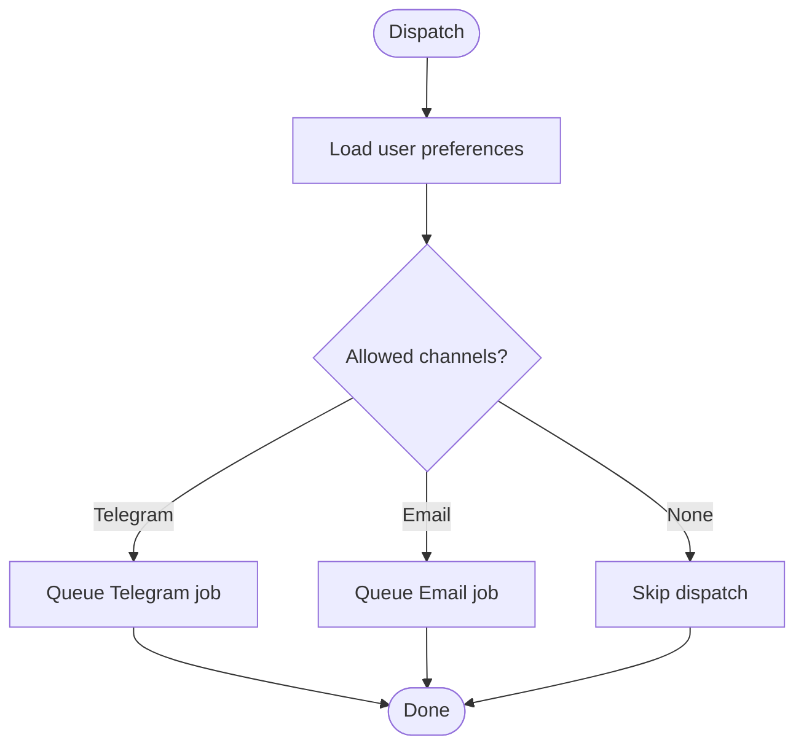

[No sources needed since this diagram shows conceptual preference logic]

**Section sources**
- [User.php:15-22](file://portal/app/Models/User.php#L15-L22)

### Webhook Support for External Services
- Integration points:
  - Create a WebhookNotificationService with synchronous and queue variants
  - Accept webhook URL and payload template from settings
  - Implement retry/backoff and logging
- Configuration:
  - Store webhook endpoint and secret in PortalSetting
  - Expose endpoints to update and test webhook delivery

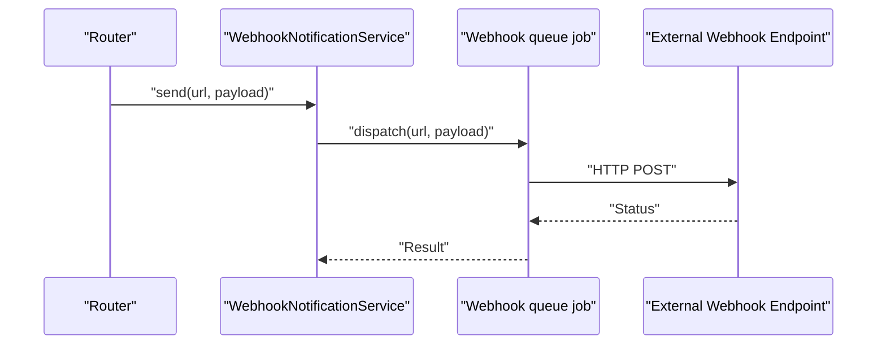

[No sources needed since this diagram shows conceptual webhook flow]

**Section sources**
- [SettingsController.php:33-64](file://portal/app/Http/Controllers/Portal/SettingsController.php#L33-L64)
- [PortalSetting.php:7-10](file://portal/app/Models/PortalSetting.php#L7-L10)

### Unified Interface for Managing Channels
- SettingsController already centralizes:
  - Listing and updating portal settings
  - Masking sensitive values
  - Clearing caches after updates
- Recommendations:
  - Expand validation rules to include new channel keys
  - Add test endpoints for each channel (e.g., test_email, test_sms, test_webhook)
  - Provide a single “channels” endpoint returning enabled channels and their statuses

**Section sources**
- [SettingsController.php:18-85](file://portal/app/Http/Controllers/Portal/SettingsController.php#L18-L85)

### Hybrid Notification Strategies
- Example: Critical alerts
  - Primary: Telegram (queued)
  - Backup: Email (failover mailer)
  - Optional: SMS (if integrated)
- Implementation:
  - Router selects channels based on severity and user preferences
  - Uses Laravel mailers’ failover/roundrobin for resilience

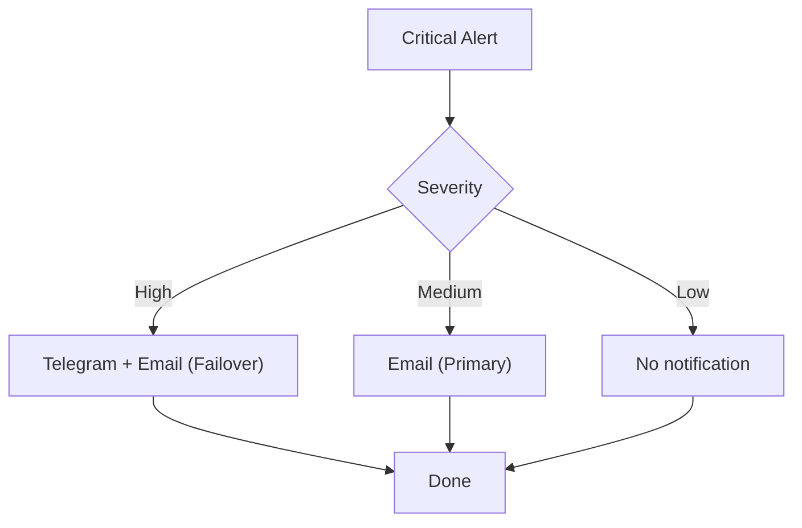

[No sources needed since this diagram shows conceptual strategy]

**Section sources**
- [mail.php:82-98](file://portal/config/mail.php#L82-L98)
- [TelegramNotificationService.php:53-76](file://portal/app/Services/TelegramNotificationService.php#L53-L76)

## Dependency Analysis
- TelegramNotificationService depends on:
  - PortalSetting for configuration
  - SendTelegramNotification for queueing
- SendTelegramNotification depends on:
  - PortalSetting for bot token
  - HTTP client for Telegram API
- SettingsController depends on:
  - PortalSetting for persistence
  - TelegramNotificationService for cache clearing and testing
- Email subsystem depends on:
  - mail.php configuration
  - Epos_Agent_Smtp_Config for WordPress SMTP application

```mermaid
graph LR
SettingsController --> PortalSetting
SettingsController --> TelegramNotificationService
TelegramNotificationService --> PortalSetting
TelegramNotificationService --> SendTelegramNotification
SendTelegramNotification --> PortalSetting
class-smtp-config --> mail
```

**Diagram sources**
- [SettingsController.php:33-85](file://portal/app/Http/Controllers/Portal/SettingsController.php#L33-L85)
- [TelegramNotificationService.php:11-106](file://portal/app/Services/TelegramNotificationService.php#L11-L106)
- [SendTelegramNotification.php:13-61](file://portal/app/Jobs/SendTelegramNotification.php#L13-L61)
- [PortalSetting.php:7-10](file://portal/app/Models/PortalSetting.php#L7-L10)
- [mail.php:38-118](file://portal/config/mail.php#L38-L118)
- [class-smtp-config.php:5-104](file://agent/epos-wp-agent/includes/class-smtp-config.php#L5-L104)

**Section sources**
- [SettingsController.php:33-85](file://portal/app/Http/Controllers/Portal/SettingsController.php#L33-L85)
- [TelegramNotificationService.php:11-106](file://portal/app/Services/TelegramNotificationService.php#L11-L106)
- [SendTelegramNotification.php:13-61](file://portal/app/Jobs/SendTelegramNotification.php#L13-L61)
- [PortalSetting.php:7-10](file://portal/app/Models/PortalSetting.php#L7-L10)
- [mail.php:38-118](file://portal/config/mail.php#L38-L118)
- [class-smtp-config.php:5-104](file://agent/epos-wp-agent/includes/class-smtp-config.php#L5-L104)

## Performance Considerations
- Caching:
  - Telegram bot token and default chat ID are cached to reduce database queries
- Queueing:
  - Telegram notifications are queued with retry/backoff to improve reliability
- Email:
  - Use failover or roundrobin mailers for resilience
- Scalability:
  - Consider batching or rate limiting for high-volume scenarios
  - Monitor queue backlog and adjust worker capacity

[No sources needed since this section provides general guidance]

## Troubleshooting Guide
- Telegram:
  - Verify bot token and default chat ID are set and cached
  - Check queue worker logs for retry exceptions
  - Use the test endpoint to validate configuration
- Email:
  - Confirm mailer configuration matches provider settings
  - Use agent SMTP test endpoint to validate WordPress mailer application
- General:
  - Review activity logs for metadata and timestamps
  - Ensure settings are persisted and cache cleared after updates

**Section sources**
- [TelegramNotificationService.php:101-105](file://portal/app/Services/TelegramNotificationService.php#L101-L105)
- [SendTelegramNotification.php:40-60](file://portal/app/Jobs/SendTelegramNotification.php#L40-L60)
- [SettingsController.php:69-85](file://portal/app/Http/Controllers/Portal/SettingsController.php#L69-L85)
- [ActivityLog.php:9-36](file://portal/app/Models/ActivityLog.php#L9-L36)

## Conclusion
The system provides a solid foundation for multi-channel notifications with a clear separation between synchronous testing and asynchronous delivery. Telegram is fully integrated with caching and queueing. Email is supported via Laravel’s flexible mailer configuration, and WordPress agents can apply SMTP settings and test connectivity. Extending the system to include SMS and webhooks follows the established patterns: create service/job pairs, persist configuration via PortalSetting, and integrate through a centralized router. Adding user preferences and opt-outs will enable fine-grained control over notification distribution.

[No sources needed since this section summarizes without analyzing specific files]

## Appendices

### Configuration Keys and Defaults
- Telegram:
  - Key: telegram_bot_token
  - Key: telegram_default_chat_id
- Email:
  - Mailer selection and transport-specific settings defined in mail.php
- Agent SMTP (WordPress):
  - Keys: epos_smtp_host, epos_smtp_port, epos_smtp_username, epos_smtp_password, epos_smtp_encryption, epos_smtp_from_email, epos_smtp_from_name

**Section sources**
- [SettingsController.php:35-49](file://portal/app/Http/Controllers/Portal/SettingsController.php#L35-L49)
- [mail.php:38-118](file://portal/config/mail.php#L38-L118)
- [class-smtp-config.php:14-31](file://agent/epos-wp-agent/includes/class-smtp-config.php#L14-L31)