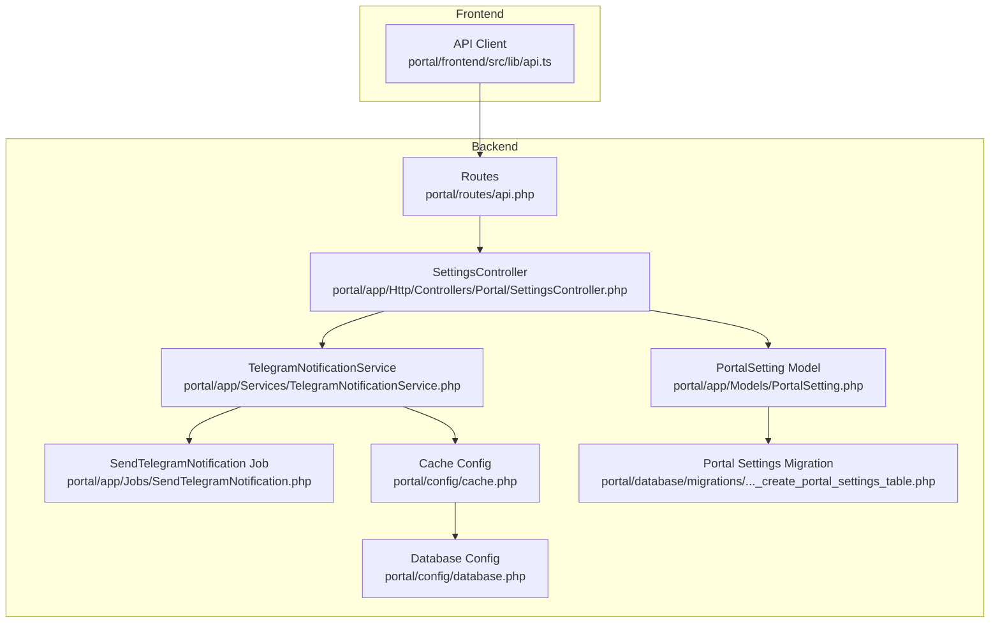
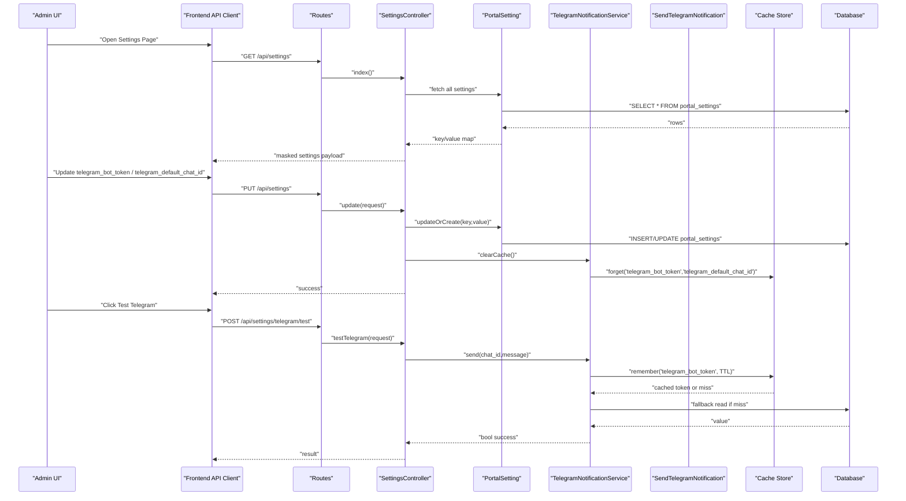
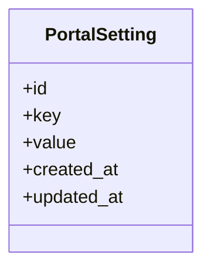
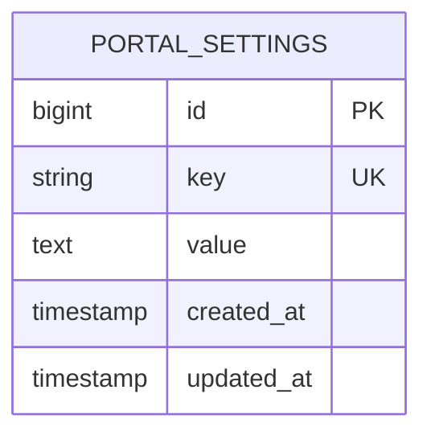
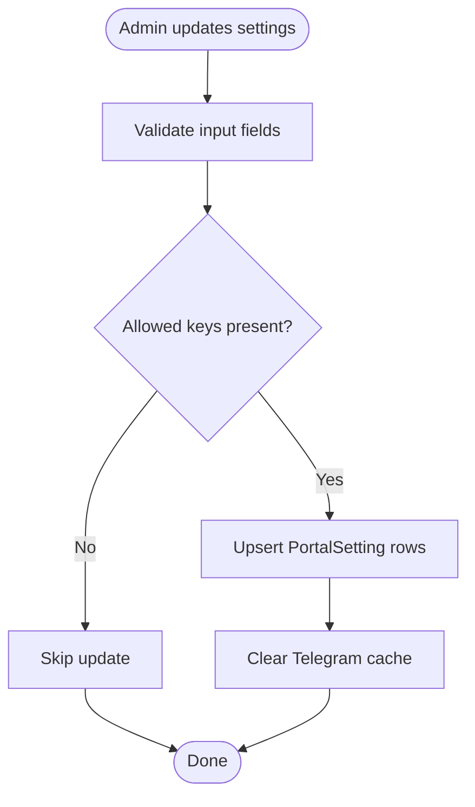
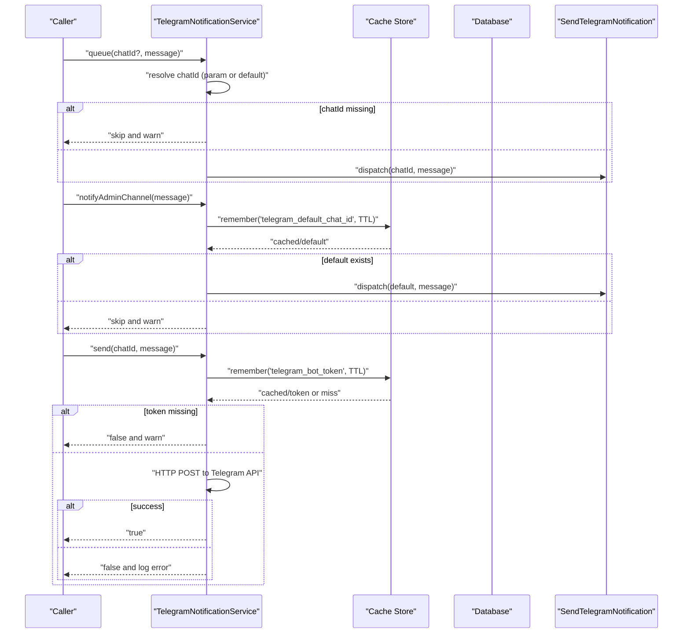
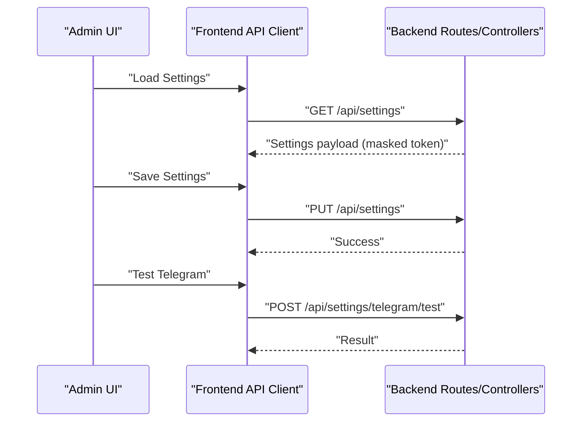
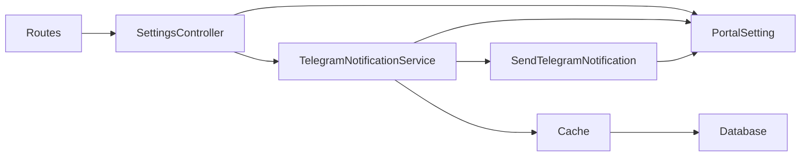

# Notification Configuration

<cite>
**Referenced Files in This Document**
- [PortalSetting.php](file://portal/app/Models/PortalSetting.php)
- [2026_05_15_070005_create_portal_settings_table.php](file://portal/database/migrations/2026_05_15_070005_create_portal_settings_table.php)
- [TelegramNotificationService.php](file://portal/app/Services/TelegramNotificationService.php)
- [SendTelegramNotification.php](file://portal/app/Jobs/SendTelegramNotification.php)
- [SettingsController.php](file://portal/app/Http/Controllers/Portal/SettingsController.php)
- [api.php](file://portal/routes/api.php)
- [cache.php](file://portal/config/cache.php)
- [database.php](file://portal/config/database.php)
- [api.ts](file://portal/frontend/src/lib/api.ts)
</cite>

## Table of Contents
1. [Introduction](#introduction)
2. [Project Structure](#project-structure)
3. [Core Components](#core-components)
4. [Architecture Overview](#architecture-overview)
5. [Detailed Component Analysis](#detailed-component-analysis)
6. [Dependency Analysis](#dependency-analysis)
7. [Performance Considerations](#performance-considerations)
8. [Troubleshooting Guide](#troubleshooting-guide)
9. [Conclusion](#conclusion)
10. [Appendices](#appendices)

## Introduction
This document explains how the notification system is configured and operated in the portal. It focuses on the PortalSetting model and the database schema used to store notification settings, the settings management interface, caching strategy for settings retrieval, and the Telegram notification pipeline. It also covers validation and error handling for missing or invalid settings, and provides step-by-step setup guides for configuring Telegram notifications.

## Project Structure
The notification configuration spans backend models, controllers, services, jobs, routes, and configuration files. The frontend interacts with the backend via an API client.

**Diagram sources**
- [PortalSetting.php:1-11](file://portal/app/Models/PortalSetting.php#L1-L11)
- [TelegramNotificationService.php:1-107](file://portal/app/Services/TelegramNotificationService.php#L1-L107)
- [SendTelegramNotification.php:1-62](file://portal/app/Jobs/SendTelegramNotification.php#L1-L62)
- [SettingsController.php:1-87](file://portal/app/Http/Controllers/Portal/SettingsController.php#L1-L87)
- [api.php:1-48](file://portal/routes/api.php#L1-L48)
- [cache.php:1-118](file://portal/config/cache.php#L1-L118)
- [database.php:1-185](file://portal/config/database.php#L1-L185)
- [2026_05_15_070005_create_portal_settings_table.php:1-24](file://portal/database/migrations/2026_05_15_070005_create_portal_settings_table.php#L1-L24)
- [api.ts:1-37](file://portal/frontend/src/lib/api.ts#L1-L37)

**Section sources**
- [PortalSetting.php:1-11](file://portal/app/Models/PortalSetting.php#L1-L11)
- [2026_05_15_070005_create_portal_settings_table.php:1-24](file://portal/database/migrations/2026_05_15_070005_create_portal_settings_table.php#L1-L24)
- [SettingsController.php:1-87](file://portal/app/Http/Controllers/Portal/SettingsController.php#L1-L87)
- [TelegramNotificationService.php:1-107](file://portal/app/Services/TelegramNotificationService.php#L1-L107)
- [SendTelegramNotification.php:1-62](file://portal/app/Jobs/SendTelegramNotification.php#L1-L62)
- [api.php:1-48](file://portal/routes/api.php#L1-L48)
- [cache.php:1-118](file://portal/config/cache.php#L1-L118)
- [database.php:1-185](file://portal/config/database.php#L1-L185)
- [api.ts:1-37](file://portal/frontend/src/lib/api.ts#L1-L37)

## Core Components
- PortalSetting model: Lightweight Eloquent model used to persist key-value pairs for portal-wide settings.
- SettingsController: Provides endpoints to list, update, and test Telegram settings.
- TelegramNotificationService: Encapsulates synchronous and asynchronous Telegram messaging, with caching and cache invalidation.
- SendTelegramNotification job: Asynchronously sends Telegram messages with retries and failure logging.
- Routes: Expose admin-only endpoints for settings management and testing.
- Cache and database configs: Define cache store and database connectivity used by the settings and jobs.

**Section sources**
- [PortalSetting.php:1-11](file://portal/app/Models/PortalSetting.php#L1-L11)
- [SettingsController.php:1-87](file://portal/app/Http/Controllers/Portal/SettingsController.php#L1-L87)
- [TelegramNotificationService.php:1-107](file://portal/app/Services/TelegramNotificationService.php#L1-L107)
- [SendTelegramNotification.php:1-62](file://portal/app/Jobs/SendTelegramNotification.php#L1-L62)
- [api.php:1-48](file://portal/routes/api.php#L1-L48)
- [cache.php:1-118](file://portal/config/cache.php#L1-L118)
- [database.php:1-185](file://portal/config/database.php#L1-L185)

## Architecture Overview
The notification configuration architecture centers around a generic settings store and a Telegram-specific workflow. Administrators set keys via the settings API, which are cached by the service layer. Jobs consume these cached values to deliver notifications asynchronously.

**Diagram sources**
- [SettingsController.php:1-87](file://portal/app/Http/Controllers/Portal/SettingsController.php#L1-L87)
- [TelegramNotificationService.php:1-107](file://portal/app/Services/TelegramNotificationService.php#L1-L107)
- [SendTelegramNotification.php:1-62](file://portal/app/Jobs/SendTelegramNotification.php#L1-L62)
- [PortalSetting.php:1-11](file://portal/app/Models/PortalSetting.php#L1-L11)
- [cache.php:1-118](file://portal/config/cache.php#L1-L118)
- [database.php:1-185](file://portal/config/database.php#L1-L185)
- [api.php:1-48](file://portal/routes/api.php#L1-L48)

## Detailed Component Analysis

### PortalSetting Model
- Purpose: Persist generic key-value settings for the portal.
- Fillable attributes: key, value.
- Used by SettingsController to store notification settings and by TelegramNotificationService to fetch them.

**Diagram sources**
- [PortalSetting.php:1-11](file://portal/app/Models/PortalSetting.php#L1-L11)

**Section sources**
- [PortalSetting.php:1-11](file://portal/app/Models/PortalSetting.php#L1-L11)

### Database Schema for Notification Settings
- Table: portal_settings
- Columns:
  - id: auto-increment primary key
  - key: string, unique
  - value: text, nullable
  - timestamps: created_at, updated_at
- This schema supports storing telegram_bot_token and telegram_default_chat_id as key-value pairs.

**Diagram sources**
- [2026_05_15_070005_create_portal_settings_table.php:1-24](file://portal/database/migrations/2026_05_15_070005_create_portal_settings_table.php#L1-L24)

**Section sources**
- [2026_05_15_070005_create_portal_settings_table.php:1-24](file://portal/database/migrations/2026_05_15_070005_create_portal_settings_table.php#L1-L24)

### Settings Management Interface
- Endpoints:
  - GET /api/settings: Returns all settings with masked telegram_bot_token.
  - PUT /api/settings: Updates allowed keys including telegram_bot_token, telegram_default_chat_id, portal_base_url, agent_ping_interval_minutes, max_deployment_retries.
  - POST /api/settings/telegram/test: Sends a test Telegram message to the provided chat_id.
- Validation:
  - telegram_bot_token: nullable string
  - telegram_default_chat_id: nullable string
  - portal_base_url: nullable url
  - agent_ping_interval_minutes: nullable integer between 1 and 60
  - max_deployment_retries: nullable integer between 0 and 10
- Behavior:
  - On update, clears cached Telegram settings so subsequent reads fetch fresh values from the database.
  - On test, invokes TelegramNotificationService::send and returns success or error.

**Diagram sources**
- [SettingsController.php:1-87](file://portal/app/Http/Controllers/Portal/SettingsController.php#L1-L87)

**Section sources**
- [SettingsController.php:1-87](file://portal/app/Http/Controllers/Portal/SettingsController.php#L1-L87)
- [api.php:1-48](file://portal/routes/api.php#L1-L48)

### Telegram Notification Service
- Responsibilities:
  - Synchronous send for testing.
  - Async queueing via SendTelegramNotification job.
  - Fetch cached telegram_bot_token and telegram_default_chat_id.
  - Clear cache on settings updates.
- Caching:
  - Keys: telegram_bot_token, telegram_default_chat_id
  - TTL: 300 seconds
  - Cache store: configured via cache.php (default database)
- Error handling:
  - Logs warnings when token/chat_id are missing.
  - Logs errors on API failures and exceptions.
  - Throws on unsuccessful API responses to trigger queue retries.

**Diagram sources**
- [TelegramNotificationService.php:1-107](file://portal/app/Services/TelegramNotificationService.php#L1-L107)
- [SendTelegramNotification.php:1-62](file://portal/app/Jobs/SendTelegramNotification.php#L1-L62)
- [cache.php:1-118](file://portal/config/cache.php#L1-L118)

**Section sources**
- [TelegramNotificationService.php:1-107](file://portal/app/Services/TelegramNotificationService.php#L1-L107)
- [SendTelegramNotification.php:1-62](file://portal/app/Jobs/SendTelegramNotification.php#L1-L62)
- [cache.php:1-118](file://portal/config/cache.php#L1-L118)

### Frontend Integration
- The frontend API client sets base URL and attaches Authorization headers for authenticated requests.
- The frontend can call the settings endpoints exposed by the backend to manage and test notifications.

**Diagram sources**
- [api.ts:1-37](file://portal/frontend/src/lib/api.ts#L1-L37)
- [api.php:1-48](file://portal/routes/api.php#L1-L48)
- [SettingsController.php:1-87](file://portal/app/Http/Controllers/Portal/SettingsController.php#L1-L87)

**Section sources**
- [api.ts:1-37](file://portal/frontend/src/lib/api.ts#L1-L37)
- [api.php:1-48](file://portal/routes/api.php#L1-L48)
- [SettingsController.php:1-87](file://portal/app/Http/Controllers/Portal/SettingsController.php#L1-L87)

## Dependency Analysis
- SettingsController depends on PortalSetting for persistence and TelegramNotificationService for cache invalidation.
- TelegramNotificationService depends on PortalSetting for reading settings, Cache for caching, and SendTelegramNotification for async delivery.
- SendTelegramNotification depends on PortalSetting for reading the bot token and Http client for Telegram API calls.
- Routes expose admin-only endpoints guarded by role middleware.
- Cache and database configurations define the backing stores used by the application.

**Diagram sources**
- [SettingsController.php:1-87](file://portal/app/Http/Controllers/Portal/SettingsController.php#L1-L87)
- [TelegramNotificationService.php:1-107](file://portal/app/Services/TelegramNotificationService.php#L1-L107)
- [SendTelegramNotification.php:1-62](file://portal/app/Jobs/SendTelegramNotification.php#L1-L62)
- [PortalSetting.php:1-11](file://portal/app/Models/PortalSetting.php#L1-L11)
- [cache.php:1-118](file://portal/config/cache.php#L1-L118)
- [database.php:1-185](file://portal/config/database.php#L1-L185)
- [api.php:1-48](file://portal/routes/api.php#L1-L48)

**Section sources**
- [SettingsController.php:1-87](file://portal/app/Http/Controllers/Portal/SettingsController.php#L1-L87)
- [TelegramNotificationService.php:1-107](file://portal/app/Services/TelegramNotificationService.php#L1-L107)
- [SendTelegramNotification.php:1-62](file://portal/app/Jobs/SendTelegramNotification.php#L1-L62)
- [PortalSetting.php:1-11](file://portal/app/Models/PortalSetting.php#L1-L11)
- [cache.php:1-118](file://portal/config/cache.php#L1-L118)
- [database.php:1-185](file://portal/config/database.php#L1-L185)
- [api.php:1-48](file://portal/routes/api.php#L1-L48)

## Performance Considerations
- Caching: Telegram settings are cached for 300 seconds to reduce database queries. Cache invalidation occurs immediately after settings updates.
- Queueing: Notifications are dispatched to the queue to avoid blocking requests. Jobs are retried with backoff.
- Network timeouts: Synchronous send uses a timeout to prevent long-blocking calls.
- Database indexing: The key column is unique, enabling efficient lookups.

[No sources needed since this section provides general guidance]

## Troubleshooting Guide
Common issues and resolutions:
- Missing bot token:
  - Symptom: Warning logged and early return in synchronous send and queueing.
  - Resolution: Set telegram_bot_token via the settings endpoint.
- Missing default chat ID:
  - Symptom: Warning logged when attempting admin channel notifications.
  - Resolution: Set telegram_default_chat_id via the settings endpoint.
- Telegram API failures:
  - Symptom: Error logged with status/body; job throws to trigger retry.
  - Resolution: Verify token and chat_id; inspect logs for status details.
- Cache stale values:
  - Symptom: Outdated token/chat_id used despite updates.
  - Resolution: Settings update automatically clears cache; confirm cache store availability.

**Section sources**
- [TelegramNotificationService.php:1-107](file://portal/app/Services/TelegramNotificationService.php#L1-L107)
- [SendTelegramNotification.php:1-62](file://portal/app/Jobs/SendTelegramNotification.php#L1-L62)
- [SettingsController.php:1-87](file://portal/app/Http/Controllers/Portal/SettingsController.php#L1-L87)

## Conclusion
The notification configuration leverages a simple key-value settings store with explicit caching and robust error handling. Administrators can configure Telegram settings through the settings API, test them, and rely on asynchronous delivery with retries. The design balances simplicity, reliability, and maintainability.

[No sources needed since this section summarizes without analyzing specific files]

## Appendices

### Environment Variables and Precedence
- Cache store selection and configuration are driven by environment variables in cache.php.
- Database connections and cache table names are configurable via database.php.
- While the current implementation reads settings directly from the database when cache misses, environment variables influence cache and database behavior indirectly.

**Section sources**
- [cache.php:1-118](file://portal/config/cache.php#L1-L118)
- [database.php:1-185](file://portal/config/database.php#L1-L185)

### Step-by-Step Setup Guides

#### Telegram Bot Token
1. Obtain a Telegram bot token from BotFather.
2. Navigate to the settings page in the admin interface.
3. Update telegram_bot_token via the settings endpoint.
4. Confirm the token is masked in listings.
5. Optionally, use the test endpoint to validate delivery.

**Section sources**
- [SettingsController.php:1-87](file://portal/app/Http/Controllers/Portal/SettingsController.php#L1-L87)
- [TelegramNotificationService.php:1-107](file://portal/app/Services/TelegramNotificationService.php#L1-L107)

#### Telegram Default Chat ID
1. Determine the target chat_id (e.g., a group or personal chat).
2. Update telegram_default_chat_id via the settings endpoint.
3. Use the admin channel notification method to broadcast to this chat.

**Section sources**
- [SettingsController.php:1-87](file://portal/app/Http/Controllers/Portal/SettingsController.php#L1-L87)
- [TelegramNotificationService.php:1-107](file://portal/app/Services/TelegramNotificationService.php#L1-L107)

#### Testing Telegram Notifications
1. From the settings page, submit a POST request to the Telegram test endpoint with a chat_id.
2. Review the response and logs for success or failure details.

**Section sources**
- [SettingsController.php:1-87](file://portal/app/Http/Controllers/Portal/SettingsController.php#L1-L87)