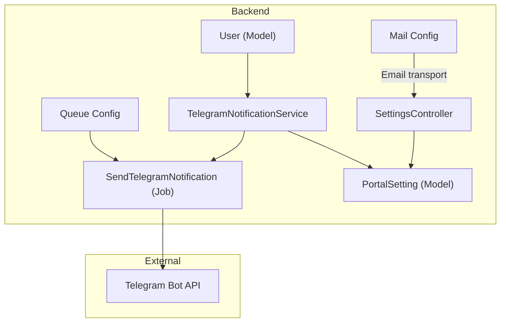
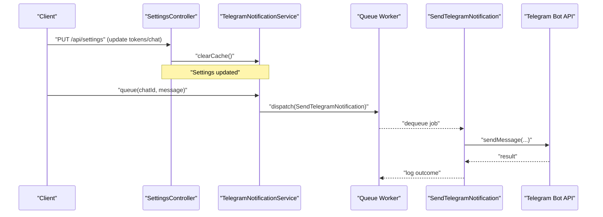
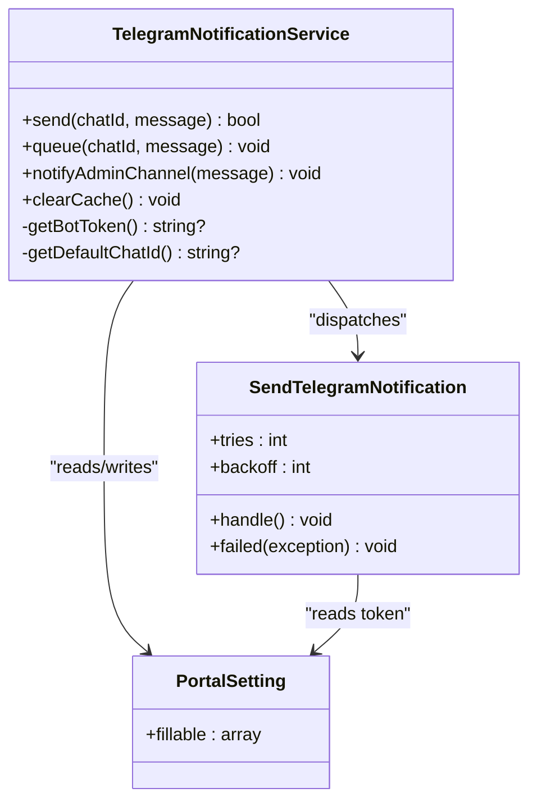
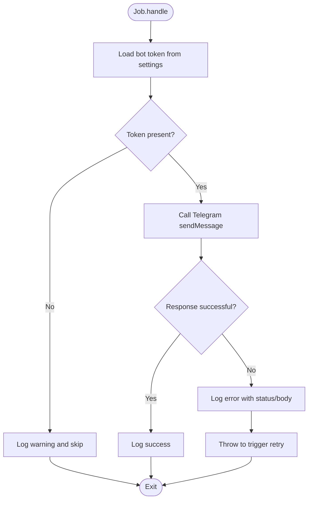
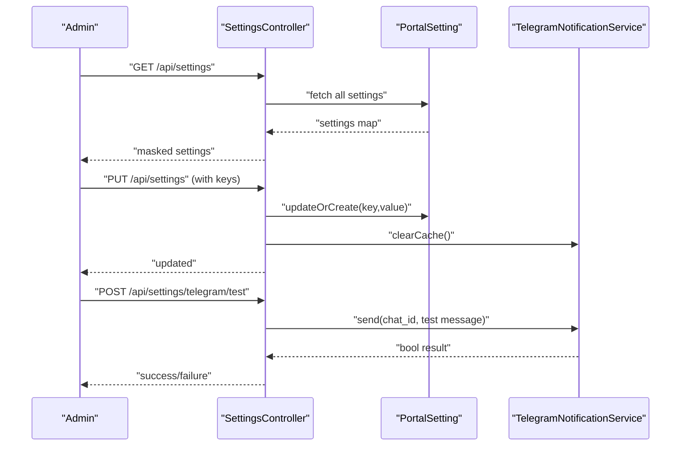
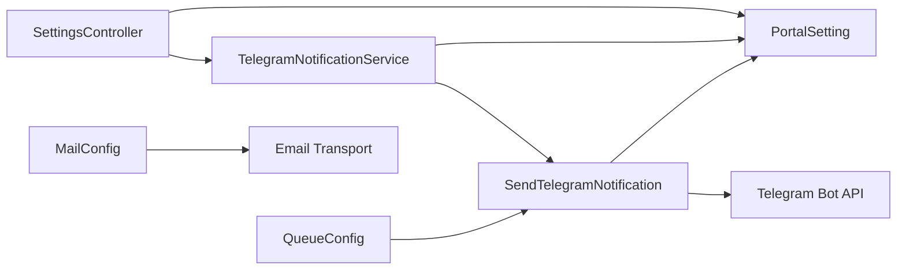

# Notification System

<cite>
**Referenced Files in This Document**
- [TelegramNotificationService.php](file://portal/app/Services/TelegramNotificationService.php)
- [SendTelegramNotification.php](file://portal/app/Jobs/SendTelegramNotification.php)
- [SettingsController.php](file://portal/app/Http/Controllers/Portal/SettingsController.php)
- [PortalSetting.php](file://portal/app/Models/PortalSetting.php)
- [queue.php](file://portal/config/queue.php)
- [mail.php](file://portal/config/mail.php)
- [services.php](file://portal/config/services.php)
- [2026_05_15_070005_create_portal_settings_table.php](file://portal/database/migrations/2026_05_15_070005_create_portal_settings_table.php)
- [0001_01_01_000000_create_users_table.php](file://portal/database/migrations/0001_01_01_000000_create_users_table.php)
- [User.php](file://portal/app/Models/User.php)
- [auth.ts](file://portal/frontend/src/lib/services/auth.ts)
</cite>

## Table of Contents
1. [Introduction](#introduction)
2. [Project Structure](#project-structure)
3. [Core Components](#core-components)
4. [Architecture Overview](#architecture-overview)
5. [Detailed Component Analysis](#detailed-component-analysis)
6. [Dependency Analysis](#dependency-analysis)
7. [Performance Considerations](#performance-considerations)
8. [Troubleshooting Guide](#troubleshooting-guide)
9. [Conclusion](#conclusion)
10. [Appendices](#appendices)

## Introduction
This document describes the notification system implemented in the portal application. It focuses on Telegram integration, queue-based delivery, and related configuration points. It also outlines how email and SMS could be integrated using existing configuration patterns, and provides guidance for extending the system to support additional channels, scheduling, templates, real-time updates, and user preferences.

## Project Structure
The notification system centers around:
- A Telegram-specific service that can send messages synchronously or enqueue asynchronous delivery.
- A dedicated queued job that performs the actual Telegram API call.
- A settings controller and model to manage configuration keys and values.
- Queue configuration supporting multiple backends.
- Email configuration for SMTP and other providers.
- User model enhancements to support Telegram chat identifiers.

**Diagram sources**
- [TelegramNotificationService.php:11-106](file://portal/app/Services/TelegramNotificationService.php#L11-L106)
- [SendTelegramNotification.php:13-61](file://portal/app/Jobs/SendTelegramNotification.php#L13-L61)
- [SettingsController.php:11-86](file://portal/app/Http/Controllers/Portal/SettingsController.php#L11-L86)
- [PortalSetting.php:7-10](file://portal/app/Models/PortalSetting.php#L7-L10)
- [queue.php:32-90](file://portal/config/queue.php#L32-L90)
- [mail.php:38-89](file://portal/config/mail.php#L38-L89)
- [User.php:11-37](file://portal/app/Models/User.php#L11-L37)

**Section sources**
- [TelegramNotificationService.php:11-106](file://portal/app/Services/TelegramNotificationService.php#L11-L106)
- [SendTelegramNotification.php:13-61](file://portal/app/Jobs/SendTelegramNotification.php#L13-L61)
- [SettingsController.php:11-86](file://portal/app/Http/Controllers/Portal/SettingsController.php#L11-L86)
- [PortalSetting.php:7-10](file://portal/app/Models/PortalSetting.php#L7-L10)
- [queue.php:32-90](file://portal/config/queue.php#L32-L90)
- [mail.php:38-89](file://portal/config/mail.php#L38-L89)
- [2026_05_15_070005_create_portal_settings_table.php:11-16](file://portal/database/migrations/2026_05_15_070005_create_portal_settings_table.php#L11-L16)
- [0001_01_01_000000_create_users_table.php:14-25](file://portal/database/migrations/0001_01_01_000000_create_users_table.php#L14-L25)
- [User.php:11-37](file://portal/app/Models/User.php#L11-L37)

## Core Components
- TelegramNotificationService: Provides synchronous send and asynchronous queue methods, admin channel broadcasting, and cached retrieval of bot token and default chat ID. It clears caches when settings change.
- SendTelegramNotification: Implements ShouldQueue to deliver Telegram messages asynchronously with retries and failure logging.
- SettingsController: Manages retrieval and update of notification settings, including Telegram bot token and default chat ID, and exposes a test endpoint for Telegram.
- PortalSetting: Eloquent model representing key-value settings persisted in the portal_settings table.
- Queue configuration: Supports multiple drivers (database, Redis, SQS, etc.) and defines retry behavior and failed job storage.
- Email configuration: Defines mailer transports (SMTP, SES, Postmark, Resend, Sendmail, Log, Failover) and related settings.
- User model: Stores optional Telegram chat identifier per user.

**Section sources**
- [TelegramNotificationService.php:11-106](file://portal/app/Services/TelegramNotificationService.php#L11-L106)
- [SendTelegramNotification.php:13-61](file://portal/app/Jobs/SendTelegramNotification.php#L13-L61)
- [SettingsController.php:11-86](file://portal/app/Http/Controllers/Portal/SettingsController.php#L11-L86)
- [PortalSetting.php:7-10](file://portal/app/Models/PortalSetting.php#L7-L10)
- [queue.php:32-90](file://portal/config/queue.php#L32-L90)
- [mail.php:38-89](file://portal/config/mail.php#L38-L89)
- [0001_01_01_000000_create_users_table.php:14-25](file://portal/database/migrations/0001_01_01_000000_create_users_table.php#L14-L25)
- [User.php:11-37](file://portal/app/Models/User.php#L11-L37)

## Architecture Overview
The system separates concerns between orchestration and delivery:
- Controllers and services validate inputs and decide whether to send immediately or enqueue.
- Queued jobs perform the actual external API call with retry/backoff logic.
- Settings are cached for performance and cleared when updated.
- Email and other channels can be integrated via configuration and additional services/jobs.

**Diagram sources**
- [SettingsController.php:33-64](file://portal/app/Http/Controllers/Portal/SettingsController.php#L33-L64)
- [TelegramNotificationService.php:53-76](file://portal/app/Services/TelegramNotificationService.php#L53-L76)
- [SendTelegramNotification.php:25-51](file://portal/app/Jobs/SendTelegramNotification.php#L25-L51)
- [queue.php:38-45](file://portal/config/queue.php#L38-L45)

## Detailed Component Analysis

### Telegram Integration
- Bot configuration: Stored as key-value pairs in the portal_settings table. Keys include the Telegram bot token and default chat ID. Values are cached for 5 minutes and cleared upon settings updates.
- Message formatting: Uses Markdown parse mode when sending messages.
- Delivery tracking: Logs success or failure; failed jobs are retried automatically according to queue configuration and job policy.

**Diagram sources**
- [TelegramNotificationService.php:11-106](file://portal/app/Services/TelegramNotificationService.php#L11-L106)
- [SendTelegramNotification.php:13-61](file://portal/app/Jobs/SendTelegramNotification.php#L13-L61)
- [PortalSetting.php:7-10](file://portal/app/Models/PortalSetting.php#L7-L10)

**Section sources**
- [TelegramNotificationService.php:16-48](file://portal/app/Services/TelegramNotificationService.php#L16-L48)
- [TelegramNotificationService.php:53-76](file://portal/app/Services/TelegramNotificationService.php#L53-L76)
- [TelegramNotificationService.php:81-96](file://portal/app/Services/TelegramNotificationService.php#L81-L96)
- [SendTelegramNotification.php:25-51](file://portal/app/Jobs/SendTelegramNotification.php#L25-L51)
- [SettingsController.php:33-64](file://portal/app/Http/Controllers/Portal/SettingsController.php#L33-L64)

### Queue-Based Processing and Retry Mechanisms
- Queue driver selection and tuning are configured centrally. The database driver is default and supports configurable retry windows and failed job storage.
- The Telegram job specifies a fixed number of tries and a backoff interval. On API failure, the job throws to trigger retry; on permanent failure, it logs an error.

**Diagram sources**
- [SendTelegramNotification.php:25-51](file://portal/app/Jobs/SendTelegramNotification.php#L25-L51)
- [queue.php:38-45](file://portal/config/queue.php#L38-L45)

**Section sources**
- [queue.php:32-90](file://portal/config/queue.php#L32-L90)
- [SendTelegramNotification.php:17-18](file://portal/app/Jobs/SendTelegramNotification.php#L17-L18)
- [SendTelegramNotification.php:40-49](file://portal/app/Jobs/SendTelegramNotification.php#L40-L49)

### Settings Management and Test Endpoint
- SettingsController retrieves and masks sensitive values, validates allowed keys, persists updates, and clears Telegram-related caches.
- A test endpoint sends a formatted Telegram message synchronously to validate configuration.

**Diagram sources**
- [SettingsController.php:18-28](file://portal/app/Http/Controllers/Portal/SettingsController.php#L18-L28)
- [SettingsController.php:33-64](file://portal/app/Http/Controllers/Portal/SettingsController.php#L33-L64)
- [SettingsController.php:69-85](file://portal/app/Http/Controllers/Portal/SettingsController.php#L69-L85)
- [TelegramNotificationService.php:16-48](file://portal/app/Services/TelegramNotificationService.php#L16-L48)

**Section sources**
- [SettingsController.php:18-28](file://portal/app/Http/Controllers/Portal/SettingsController.php#L18-L28)
- [SettingsController.php:33-64](file://portal/app/Http/Controllers/Portal/SettingsController.php#L33-L64)
- [SettingsController.php:69-85](file://portal/app/Http/Controllers/Portal/SettingsController.php#L69-L85)
- [2026_05_15_070005_create_portal_settings_table.php:11-16](file://portal/database/migrations/2026_05_15_070005_create_portal_settings_table.php#L11-L16)

### Multi-Channel Capabilities (Email and SMS)
- Email: The mail configuration supports multiple transports (SMTP, SES, Postmark, Resend, Sendmail, Log, Failover). Use Laravel’s built-in mailer APIs to send email notifications.
- SMS: While not implemented in the current codebase, SMS can be integrated by adding a dedicated service/job similar to the Telegram job and configuring an SMS provider SDK. Define credentials in environment variables and expose configuration endpoints analogous to the Telegram settings.

[No sources needed since this section provides general guidance]

### Notification Templates and Customization
- Current implementation sends raw text with Markdown formatting. To support templates:
  - Introduce a template engine or string interpolation mechanism.
  - Store template content keyed by event type.
  - Allow per-user overrides and environment-specific variants.
- Event-driven customization: Pass contextual data into the service/job to render dynamic content.

[No sources needed since this section provides general guidance]

### Real-Time Updates and WebSocket Integration
- The frontend includes an authentication service that can be extended to integrate with WebSocket connections for live notifications. Establish a WebSocket client that subscribes to user-specific channels and renders incoming events.
- Backend: Use a WebSocket server or a cloud service (e.g., Pusher, Ably) to broadcast events to subscribed clients.

[No sources needed since this section provides general guidance]

### Notification Scheduling and Batch Processing
- Scheduling: Use Laravel’s scheduler to dispatch periodic notifications or maintenance tasks.
- Batch processing: Leverage job batching for large-scale deliveries and track progress.

[No sources needed since this section provides general guidance]

### Notification Preferences and Opt-Out
- Users can set or remove their Telegram chat ID via profile updates. Extend the profile update endpoint to toggle notification preferences and maintain a preference record per user.
- Respect opt-out by skipping delivery when a user has disabled notifications.

[No sources needed since this section provides general guidance]

### External Service Integrations and Webhooks
- Webhook support: Add endpoints to receive external events and enqueue appropriate notifications. Validate signatures and deduplicate events.
- Provider integrations: Follow the pattern of the Telegram service/job to integrate additional providers (e.g., Slack, SMS).

[No sources needed since this section provides general guidance]

## Dependency Analysis
- TelegramNotificationService depends on PortalSetting for configuration and on SendTelegramNotification for asynchronous delivery.
- SendTelegramNotification depends on PortalSetting for credentials and on the Telegram Bot API for delivery.
- SettingsController coordinates updates and cache invalidation.
- Queue configuration determines how jobs are processed and retried.
- Email configuration enables email delivery via chosen transport.

**Diagram sources**
- [SettingsController.php:33-64](file://portal/app/Http/Controllers/Portal/SettingsController.php#L33-L64)
- [TelegramNotificationService.php:53-76](file://portal/app/Services/TelegramNotificationService.php#L53-L76)
- [SendTelegramNotification.php:25-51](file://portal/app/Jobs/SendTelegramNotification.php#L25-L51)
- [queue.php:38-45](file://portal/config/queue.php#L38-L45)
- [mail.php:38-89](file://portal/config/mail.php#L38-L89)

**Section sources**
- [TelegramNotificationService.php:53-76](file://portal/app/Services/TelegramNotificationService.php#L53-L76)
- [SendTelegramNotification.php:25-51](file://portal/app/Jobs/SendTelegramNotification.php#L25-L51)
- [SettingsController.php:33-64](file://portal/app/Http/Controllers/Portal/SettingsController.php#L33-L64)
- [queue.php:38-45](file://portal/config/queue.php#L38-L45)
- [mail.php:38-89](file://portal/config/mail.php#L38-L89)

## Performance Considerations
- Use caching for frequently accessed settings to reduce database load.
- Choose a scalable queue backend (Redis, SQS) for high throughput.
- Tune retry intervals and maximum attempts to balance reliability and resource usage.
- For email, prefer SMTP with connection pooling and failover transports.

[No sources needed since this section provides general guidance]

## Troubleshooting Guide
- Telegram token missing: The service logs a warning and skips sending. Verify the telegram_bot_token setting.
- API errors: Inspect logs for status and response body; the job triggers retries automatically.
- Settings not applied: Ensure settings are updated and caches are cleared after changes.
- Email delivery issues: Confirm mailer transport configuration and credentials.

**Section sources**
- [TelegramNotificationService.php:20-23](file://portal/app/Services/TelegramNotificationService.php#L20-L23)
- [SendTelegramNotification.php:29-32](file://portal/app/Jobs/SendTelegramNotification.php#L29-L32)
- [SendTelegramNotification.php:40-49](file://portal/app/Jobs/SendTelegramNotification.php#L40-L49)
- [SettingsController.php:60-61](file://portal/app/Http/Controllers/Portal/SettingsController.php#L60-L61)

## Conclusion
The notification system provides a solid foundation for Telegram delivery with asynchronous processing, robust configuration management, and clear extension points for email, SMS, scheduling, templates, real-time updates, and preferences. By following the established patterns, teams can reliably add new channels and enhance delivery reliability.

## Appendices

### Configuration Keys and Defaults
- Telegram bot token: Stored under the key telegram_bot_token.
- Default chat ID: Stored under the key telegram_default_chat_id.
- Additional portal settings include base URL, agent ping interval, and deployment retry limits.

**Section sources**
- [SettingsController.php:35-49](file://portal/app/Http/Controllers/Portal/SettingsController.php#L35-L49)
- [2026_05_15_070005_create_portal_settings_table.php:11-16](file://portal/database/migrations/2026_05_15_070005_create_portal_settings_table.php#L11-L16)

### User Profile and Telegram Chat ID
- Users can optionally set a Telegram chat ID via profile updates. This enables targeted notifications per user.

**Section sources**
- [0001_01_01_000000_create_users_table.php:21-21](file://portal/database/migrations/0001_01_01_000000_create_users_table.php#L21-L21)
- [auth.ts:8-8](file://portal/frontend/src/lib/services/auth.ts#L8-L8)