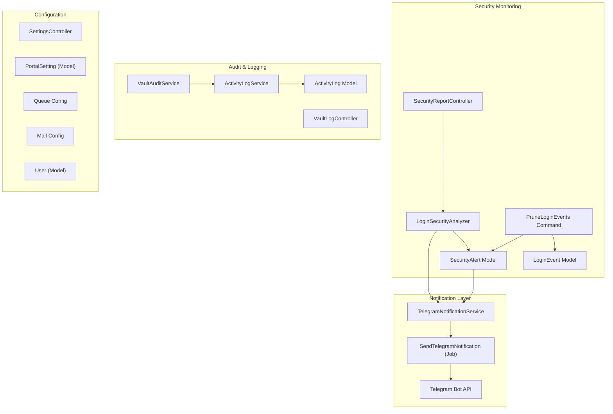
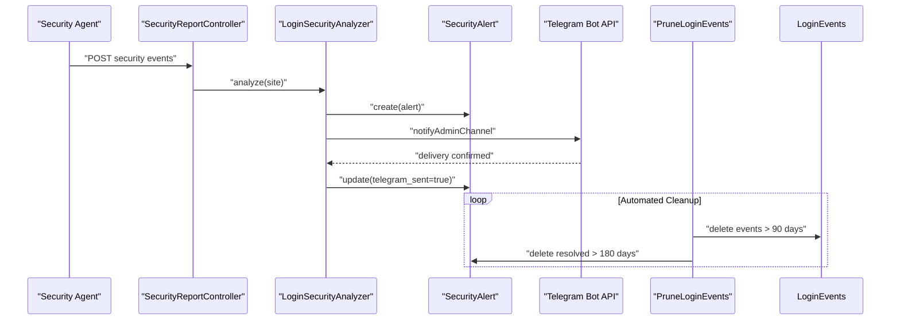
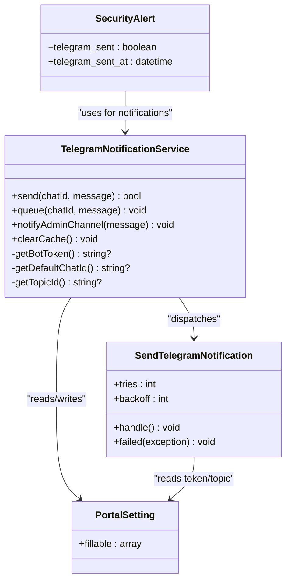
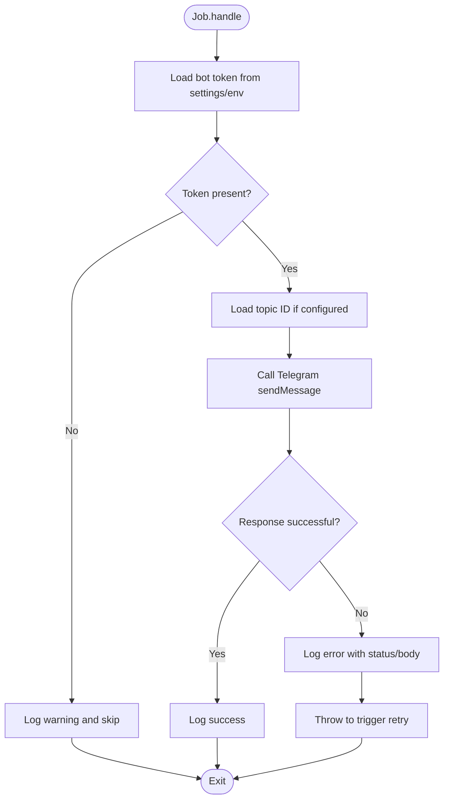
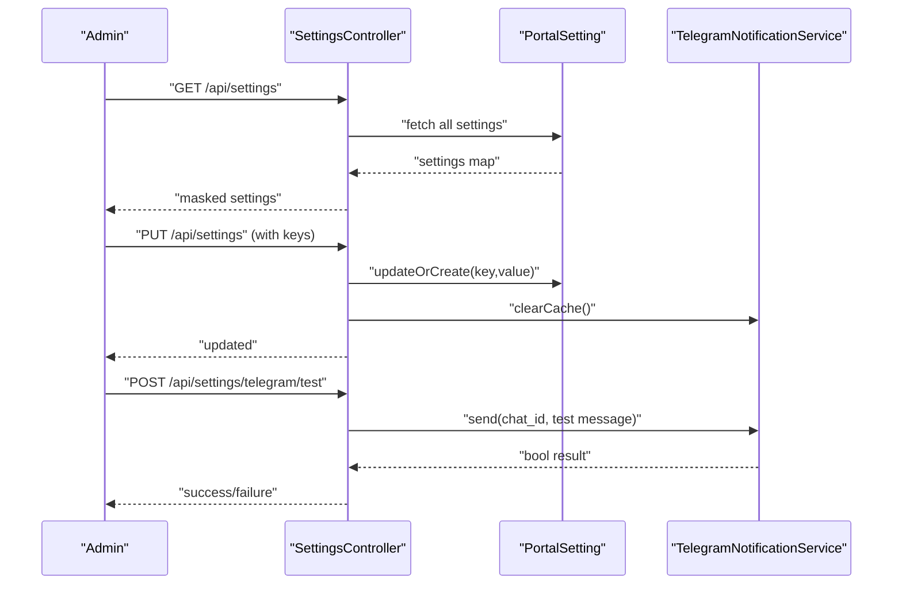
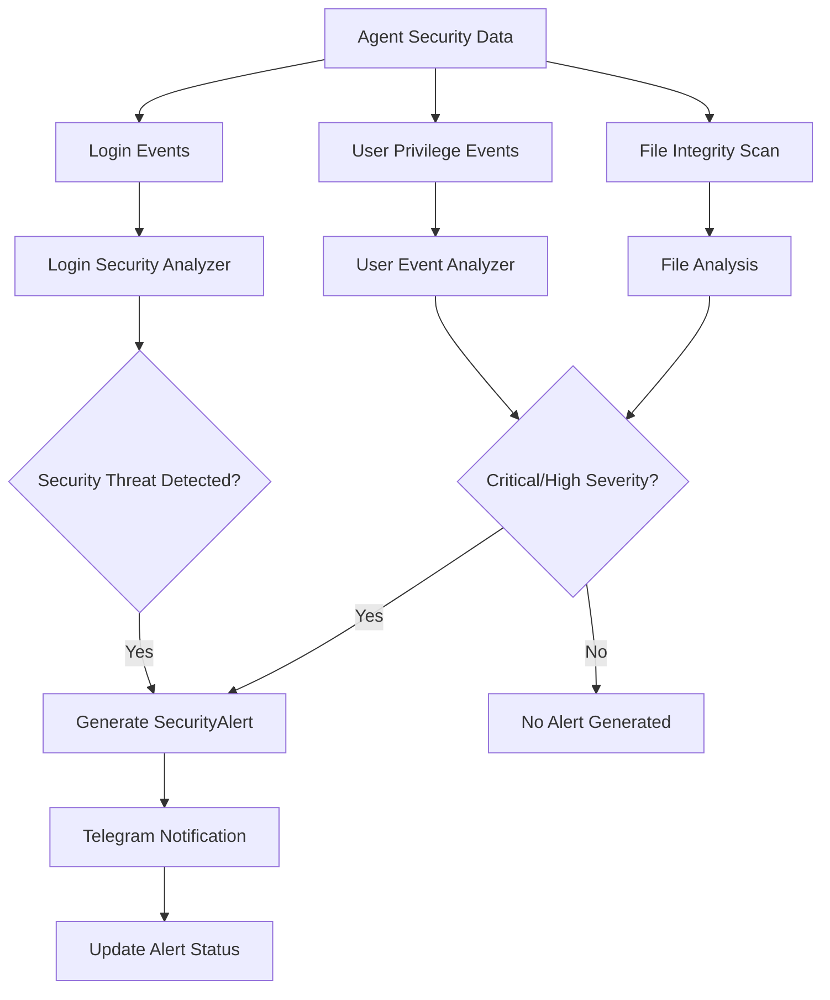
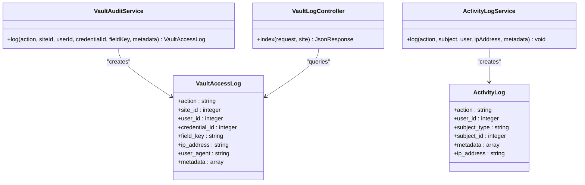
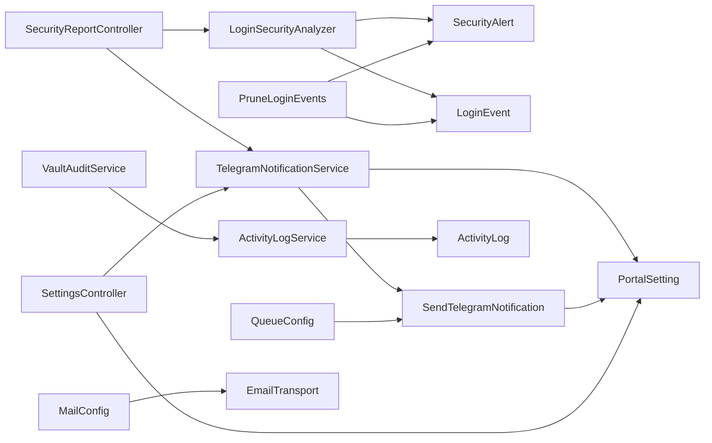

# Notification System

<cite>
**Referenced Files in This Document**
- [TelegramNotificationService.php](file://portal/app/Services/TelegramNotificationService.php)
- [SendTelegramNotification.php](file://portal/app/Jobs/SendTelegramNotification.php)
- [SettingsController.php](file://portal/app/Http/Controllers/Portal/SettingsController.php)
- [PortalSetting.php](file://portal/app/Models/PortalSetting.php)
- [SecurityReportController.php](file://portal/app/Http/Controllers/Agent/SecurityReportController.php)
- [LoginSecurityAnalyzer.php](file://portal/app/Services/LoginSecurityAnalyzer.php)
- [PruneLoginEvents.php](file://portal/app/Console/Commands/PruneLoginEvents.php)
- [VaultAuditService.php](file://portal/app/Services/VaultAuditService.php)
- [VaultLogController.php](file://portal/app/Http/Controllers/Portal/VaultLogController.php)
- [ActivityLogService.php](file://portal/app/Services/ActivityLogService.php)
- [ActivityLog.php](file://portal/app/Models/ActivityLog.php)
- [SecurityAlert.php](file://portal/app/Models/SecurityAlert.php)
- [LoginEvent.php](file://portal/app/Models/LoginEvent.php)
- [2026_05_18_000001_create_security_tables.php](file://portal/database/migrations/2026_05_18_000001_create_security_tables.php)
- [queue.php](file://portal/config/queue.php)
- [mail.php](file://portal/config/mail.php)
- [services.php](file://portal/config/services.php)
- [2026_05_15_070005_create_portal_settings_table.php](file://portal/database/migrations/2026_05_15_070005_create_portal_settings_table.php)
- [0001_01_01_000000_create_users_table.php](file://portal/database/migrations/0001_01_01_000000_create_users_table.php)
- [User.php](file://portal/app/Models/User.php)
- [auth.ts](file://portal/frontend/src/lib/services/auth.ts)
</cite>

## Update Summary
**Changes Made**
- Enhanced Telegram notification integration with critical security event alerts
- Added automated cleanup jobs for login events and resolved security alerts
- Integrated comprehensive audit logging throughout the platform
- Added security alert tracking with Telegram delivery status
- Implemented login security analysis with automated alert generation

## Table of Contents
1. [Introduction](#introduction)
2. [Project Structure](#project-structure)
3. [Core Components](#core-components)
4. [Architecture Overview](#architecture-overview)
5. [Detailed Component Analysis](#detailed-component-analysis)
6. [Security Event Notification System](#security-event-notification-system)
7. [Audit Logging and Monitoring](#audit-logging-and-monitoring)
8. [Dependency Analysis](#dependency-analysis)
9. [Performance Considerations](#performance-considerations)
10. [Troubleshooting Guide](#troubleshooting-guide)
11. [Conclusion](#conclusion)
12. [Appendices](#appendices)

## Introduction
This document describes the enhanced notification system implemented in the portal application. The system now features comprehensive security event monitoring with critical alert notifications via Telegram, automated cleanup of historical data, and extensive audit logging across all platform activities. It focuses on Telegram integration for security alerts, queue-based delivery, automated security analysis, and related configuration points.

## Project Structure
The notification system centers around:
- A Telegram-specific service that can send messages synchronously or enqueue asynchronous delivery
- A dedicated queued job that performs the actual Telegram API call
- Security alert management with automatic generation and Telegram delivery
- Automated cleanup jobs for login events and resolved security alerts
- Comprehensive audit logging for all platform activities
- Settings controller and model to manage configuration keys and values
- Queue configuration supporting multiple backends
- Email configuration for SMTP and other providers
- User model enhancements to support Telegram chat identifiers

**Diagram sources**
- [SecurityReportController.php:18-331](file://portal/app/Http/Controllers/Agent/SecurityReportController.php#L18-L331)
- [LoginSecurityAnalyzer.php:11-193](file://portal/app/Services/LoginSecurityAnalyzer.php#L11-L193)
- [SecurityAlert.php:9-61](file://portal/app/Models/SecurityAlert.php#L9-L61)
- [LoginEvent.php:9-42](file://portal/app/Models/LoginEvent.php#L9-L42)
- [PruneLoginEvents.php:10-35](file://portal/app/Console/Commands/PruneLoginEvents.php#L10-L35)
- [TelegramNotificationService.php:11-128](file://portal/app/Services/TelegramNotificationService.php#L11-L128)
- [SendTelegramNotification.php:13-76](file://portal/app/Jobs/SendTelegramNotification.php#L13-L76)
- [VaultAuditService.php:7-32](file://portal/app/Services/VaultAuditService.php#L7-L32)
- [ActivityLogService.php:11-50](file://portal/app/Services/ActivityLogService.php#L11-L50)
- [VaultLogController.php:12-87](file://portal/app/Http/Controllers/Portal/VaultLogController.php#L12-L87)
- [ActivityLog.php:9-37](file://portal/app/Models/ActivityLog.php#L9-L37)

**Section sources**
- [TelegramNotificationService.php:11-128](file://portal/app/Services/TelegramNotificationService.php#L11-L128)
- [SendTelegramNotification.php:13-76](file://portal/app/Jobs/SendTelegramNotification.php#L13-L76)
- [SecurityReportController.php:18-331](file://portal/app/Http/Controllers/Agent/SecurityReportController.php#L18-L331)
- [LoginSecurityAnalyzer.php:11-193](file://portal/app/Services/LoginSecurityAnalyzer.php#L11-L193)
- [PruneLoginEvents.php:10-35](file://portal/app/Console/Commands/PruneLoginEvents.php#L10-L35)
- [VaultAuditService.php:7-32](file://portal/app/Services/VaultAuditService.php#L7-L32)
- [ActivityLogService.php:11-50](file://portal/app/Services/ActivityLogService.php#L11-L50)
- [VaultLogController.php:12-87](file://portal/app/Http/Controllers/Portal/VaultLogController.php#L12-L87)
- [ActivityLog.php:9-37](file://portal/app/Models/ActivityLog.php#L9-L37)

## Core Components
- **TelegramNotificationService**: Provides synchronous send and asynchronous queue methods, admin channel broadcasting, and cached retrieval of bot token, default chat ID, and topic ID. It clears caches when settings change.
- **SendTelegramNotification**: Implements ShouldQueue to deliver Telegram messages asynchronously with retries and failure logging.
- **SecurityReportController**: Handles security event ingestion from agents, generates security alerts, and sends Telegram notifications for critical and high severity events.
- **LoginSecurityAnalyzer**: Analyzes login events for security threats and generates appropriate alerts with Telegram notifications for critical events.
- **PruneLoginEvents**: Automated cleanup job that removes old login events and resolved security alerts to maintain database performance.
- **VaultAuditService**: Comprehensive audit logging service for vault access operations with detailed metadata capture.
- **ActivityLogService**: General activity logging service for tracking user actions and system events.
- **SecurityAlert Model**: Tracks security events with severity levels, status tracking, and Telegram delivery status.
- **SettingsController**: Manages retrieval and update of notification settings, including Telegram bot token, default chat ID, and topic ID, and exposes a test endpoint for Telegram.
- **PortalSetting**: Eloquent model representing key-value settings persisted in the portal_settings table.
- **Queue configuration**: Supports multiple drivers (database, Redis, SQS, etc.) and defines retry behavior and failed job storage.
- **Email configuration**: Defines mailer transports (SMTP, SES, Postmark, Resend, Sendmail, Log, Failover) and related settings.
- **User model**: Stores optional Telegram chat identifier per user.

**Section sources**
- [TelegramNotificationService.php:11-128](file://portal/app/Services/TelegramNotificationService.php#L11-L128)
- [SendTelegramNotification.php:13-76](file://portal/app/Jobs/SendTelegramNotification.php#L13-L76)
- [SecurityReportController.php:18-331](file://portal/app/Http/Controllers/Agent/SecurityReportController.php#L18-L331)
- [LoginSecurityAnalyzer.php:11-193](file://portal/app/Services/LoginSecurityAnalyzer.php#L11-L193)
- [PruneLoginEvents.php:10-35](file://portal/app/Console/Commands/PruneLoginEvents.php#L10-L35)
- [VaultAuditService.php:7-32](file://portal/app/Services/VaultAuditService.php#L7-L32)
- [ActivityLogService.php:11-50](file://portal/app/Services/ActivityLogService.php#L11-L50)
- [SecurityAlert.php:9-61](file://portal/app/Models/SecurityAlert.php#L9-L61)
- [SettingsController.php:11-86](file://portal/app/Http/Controllers/Portal/SettingsController.php#L11-L86)
- [PortalSetting.php:7-10](file://portal/app/Models/PortalSetting.php#L7-L10)
- [queue.php:32-90](file://portal/config/queue.php#L32-L90)
- [mail.php:38-89](file://portal/config/mail.php#L38-L89)
- [0001_01_01_000000_create_users_table.php:14-25](file://portal/database/migrations/0001_01_01_000000_create_users_table.php#L14-L25)
- [User.php:11-37](file://portal/app/Models/User.php#L11-L37)

## Architecture Overview
The system separates concerns between orchestration, security monitoring, and delivery:
- Controllers and services validate inputs and decide whether to send immediately or enqueue
- Security events trigger automated alert generation and Telegram notifications
- Queued jobs perform the actual external API call with retry/backoff logic
- Automated cleanup jobs maintain database performance
- Comprehensive audit logging tracks all platform activities
- Settings are cached for performance and cleared when updated
- Email and other channels can be integrated via configuration and additional services/jobs

**Diagram sources**
- [SecurityReportController.php:109-142](file://portal/app/Http/Controllers/Agent/SecurityReportController.php#L109-L142)
- [LoginSecurityAnalyzer.php:16-23](file://portal/app/Services/LoginSecurityAnalyzer.php#L16-L23)
- [PruneLoginEvents.php:15-34](file://portal/app/Console/Commands/PruneLoginEvents.php#L15-L34)

## Detailed Component Analysis

### Enhanced Telegram Integration
- **Bot configuration**: Stored as key-value pairs in the portal_settings table with additional topic ID support. Keys include the Telegram bot token, default chat ID, and topic ID. Values are cached for 5 minutes and cleared upon settings updates.
- **Message formatting**: Uses Markdown parse mode when sending messages with emoji indicators for severity levels.
- **Delivery tracking**: Logs success or failure; failed jobs are retried automatically according to queue configuration and job policy.
- **Admin channel broadcasting**: Dedicated method for sending notifications to default admin channel with automatic queuing.

**Diagram sources**
- [TelegramNotificationService.php:11-128](file://portal/app/Services/TelegramNotificationService.php#L11-L128)
- [SendTelegramNotification.php:13-76](file://portal/app/Jobs/SendTelegramNotification.php#L13-L76)
- [PortalSetting.php:7-10](file://portal/app/Models/PortalSetting.php#L7-L10)
- [SecurityAlert.php:13-35](file://portal/app/Models/SecurityAlert.php#L13-L35)

**Section sources**
- [TelegramNotificationService.php:16-55](file://portal/app/Services/TelegramNotificationService.php#L16-L55)
- [TelegramNotificationService.php:77-83](file://portal/app/Services/TelegramNotificationService.php#L77-L83)
- [TelegramNotificationService.php:88-126](file://portal/app/Services/TelegramNotificationService.php#L88-L126)
- [SendTelegramNotification.php:25-74](file://portal/app/Jobs/SendTelegramNotification.php#L25-L74)
- [SettingsController.php:33-64](file://portal/app/Http/Controllers/Portal/SettingsController.php#L33-L64)

### Queue-Based Processing and Retry Mechanisms
- **Queue driver selection**: Configured centrally with database driver as default and supports configurable retry windows and failed job storage.
- **Telegram job specification**: Specifies 3 tries with 30-second backoff interval. On API failure, throws exception to trigger retry; on permanent failure, logs error.
- **Error handling**: Comprehensive logging of API responses, status codes, and error messages for debugging and monitoring.

**Diagram sources**
- [SendTelegramNotification.php:25-74](file://portal/app/Jobs/SendTelegramNotification.php#L25-L74)
- [queue.php:38-45](file://portal/config/queue.php#L38-L45)

**Section sources**
- [queue.php:32-90](file://portal/config/queue.php#L32-L90)
- [SendTelegramNotification.php:17-18](file://portal/app/Jobs/SendTelegramNotification.php#L17-L18)
- [SendTelegramNotification.php:40-49](file://portal/app/Jobs/SendTelegramNotification.php#L40-L49)

### Settings Management and Test Endpoint
- **SettingsController**: Retrieves and masks sensitive values, validates allowed keys, persists updates, and clears Telegram-related caches.
- **Test endpoint**: Sends formatted Telegram message synchronously to validate configuration.
- **Environment fallback**: Supports environment variable fallback for Telegram configuration when database values are not set.

**Diagram sources**
- [SettingsController.php:18-28](file://portal/app/Http/Controllers/Portal/SettingsController.php#L18-L28)
- [SettingsController.php:33-64](file://portal/app/Http/Controllers/Portal/SettingsController.php#L33-L64)
- [SettingsController.php:69-85](file://portal/app/Http/Controllers/Portal/SettingsController.php#L69-L85)
- [TelegramNotificationService.php:16-55](file://portal/app/Services/TelegramNotificationService.php#L16-L55)

**Section sources**
- [SettingsController.php:18-28](file://portal/app/Http/Controllers/Portal/SettingsController.php#L18-L28)
- [SettingsController.php:33-64](file://portal/app/Http/Controllers/Portal/SettingsController.php#L33-L64)
- [SettingsController.php:69-85](file://portal/app/Http/Controllers/Portal/SettingsController.php#L69-L85)
- [2026_05_15_070005_create_portal_settings_table.php:11-16](file://portal/database/migrations/2026_05_15_070005_create_portal_settings_table.php#L11-L16)

## Security Event Notification System

### Critical Security Event Detection
The system now includes comprehensive security event monitoring with automated detection and notification:

- **File Integrity Monitoring**: Detects critical and high severity file changes (added, modified, deleted) and generates appropriate alerts
- **Login Security Analysis**: Monitors for brute force attacks, credential stuffing, and suspicious login patterns
- **User Privilege Events**: Alerts on new admin creation and user promotions to admin level
- **Automated Alert Generation**: Creates SecurityAlert records with severity levels and detailed context

**Diagram sources**
- [SecurityReportController.php:48-103](file://portal/app/Http/Controllers/Agent/SecurityReportController.php#L48-L103)
- [LoginSecurityAnalyzer.php:16-193](file://portal/app/Services/LoginSecurityAnalyzer.php#L16-L193)
- [SecurityReportController.php:148-189](file://portal/app/Http/Controllers/Agent/SecurityReportController.php#L148-L189)

**Section sources**
- [SecurityReportController.php:48-103](file://portal/app/Http/Controllers/Agent/SecurityReportController.php#L48-L103)
- [SecurityReportController.php:109-142](file://portal/app/Http/Controllers/Agent/SecurityReportController.php#L109-L142)
- [SecurityReportController.php:148-189](file://portal/app/Http/Controllers/Agent/SecurityReportController.php#L148-L189)
- [LoginSecurityAnalyzer.php:16-193](file://portal/app/Services/LoginSecurityAnalyzer.php#L16-L193)

### Security Alert Tracking and Management
- **Alert States**: Tracks open, acknowledged, and resolved states with timestamps for each status change
- **Telegram Delivery Tracking**: Records whether Telegram notifications were successfully sent and when
- **Severity Levels**: Supports critical, high, medium, low severity levels with appropriate escalation
- **Context Preservation**: Stores detailed context information (file paths, usernames, IP addresses) for each alert

**Section sources**
- [SecurityAlert.php:13-35](file://portal/app/Models/SecurityAlert.php#L13-L35)
- [SecurityReportController.php:299-329](file://portal/app/Http/Controllers/Agent/SecurityReportController.php#L299-L329)

### Automated Cleanup Operations
- **PruneLoginEvents Command**: Removes old login events (older than 90 days) and resolved security alerts (older than 180 days) to maintain database performance
- **Scheduled Execution**: Runs automatically through Laravel's command scheduling system
- **Logging**: Provides detailed logging of cleanup operations for monitoring and auditing

**Section sources**
- [PruneLoginEvents.php:15-34](file://portal/app/Console/Commands/PruneLoginEvents.php#L15-L34)

## Audit Logging and Monitoring

### Comprehensive Audit Trail
The system maintains detailed audit logs across all platform activities:

- **Vault Access Logging**: Tracks all vault operations including viewed, copied, edited, created, deleted, shared, and autologin events
- **Activity Logging**: Captures user actions and system events with metadata for compliance and troubleshooting
- **Access Control**: Restricts vault log access based on user roles (admin vs dev vs marketing)
- **Search and Filtering**: Supports filtering by action type, date ranges, and user context

**Diagram sources**
- [VaultAuditService.php:7-32](file://portal/app/Services/VaultAuditService.php#L7-L32)
- [VaultLogController.php:12-87](file://portal/app/Http/Controllers/Portal/VaultLogController.php#L12-L87)
- [ActivityLogService.php:11-50](file://portal/app/Services/ActivityLogService.php#L11-L50)
- [ActivityLog.php:9-37](file://portal/app/Models/ActivityLog.php#L9-L37)

**Section sources**
- [VaultAuditService.php:12-30](file://portal/app/Services/VaultAuditService.php#L12-L30)
- [VaultLogController.php:20-85](file://portal/app/Http/Controllers/Portal/VaultLogController.php#L20-L85)
- [ActivityLogService.php:16-48](file://portal/app/Services/ActivityLogService.php#L16-L48)
- [ActivityLog.php:13-35](file://portal/app/Models/ActivityLog.php#L13-L35)

### Security Event Logging
- **Login Event Storage**: Captures failed and successful login attempts with timestamps, user agents, and IP addresses
- **Known IP Management**: Maintains whitelist of trusted IP addresses for each site
- **Security Analysis**: Provides data for detecting brute force attacks, credential stuffing, and suspicious login patterns
- **Compliance Support**: Maintains audit trail of all authentication events for security monitoring

**Section sources**
- [2026_05_18_000001_create_security_tables.php:90-116](file://portal/database/migrations/2026_05_18_000001_create_security_tables.php#L90-L116)
- [LoginEvent.php:13-25](file://portal/app/Models/LoginEvent.php#L13-L25)

## Dependency Analysis
- **TelegramNotificationService** depends on PortalSetting for configuration and on SendTelegramNotification for asynchronous delivery
- **SendTelegramNotification** depends on PortalSetting for credentials and on the Telegram Bot API for delivery
- **SecurityReportController** coordinates security event processing, alert generation, and Telegram notifications
- **LoginSecurityAnalyzer** depends on LoginEvent and SecurityAlert models for threat detection and alert creation
- **PruneLoginEvents** cleans up historical data from LoginEvent and SecurityAlert tables
- **VaultAuditService** and **ActivityLogService** provide comprehensive logging infrastructure
- **SettingsController** coordinates updates and cache invalidation
- **Queue configuration** determines how jobs are processed and retried
- **Email configuration** enables email delivery via chosen transport

**Diagram sources**
- [SecurityReportController.php:18-331](file://portal/app/Http/Controllers/Agent/SecurityReportController.php#L18-L331)
- [LoginSecurityAnalyzer.php:11-193](file://portal/app/Services/LoginSecurityAnalyzer.php#L11-L193)
- [PruneLoginEvents.php:10-35](file://portal/app/Console/Commands/PruneLoginEvents.php#L10-L35)
- [TelegramNotificationService.php:11-128](file://portal/app/Services/TelegramNotificationService.php#L11-L128)
- [SendTelegramNotification.php:13-76](file://portal/app/Jobs/SendTelegramNotification.php#L13-L76)
- [VaultAuditService.php:7-32](file://portal/app/Services/VaultAuditService.php#L7-L32)
- [ActivityLogService.php:11-50](file://portal/app/Services/ActivityLogService.php#L11-L50)

**Section sources**
- [TelegramNotificationService.php:53-76](file://portal/app/Services/TelegramNotificationService.php#L53-L76)
- [SendTelegramNotification.php:25-51](file://portal/app/Jobs/SendTelegramNotification.php#L25-L51)
- [SecurityReportController.php:18-331](file://portal/app/Http/Controllers/Agent/SecurityReportController.php#L18-L331)
- [LoginSecurityAnalyzer.php:11-193](file://portal/app/Services/LoginSecurityAnalyzer.php#L11-L193)
- [PruneLoginEvents.php:10-35](file://portal/app/Console/Commands/PruneLoginEvents.php#L10-L35)
- [VaultAuditService.php:7-32](file://portal/app/Services/VaultAuditService.php#L7-L32)
- [ActivityLogService.php:11-50](file://portal/app/Services/ActivityLogService.php#L11-L50)
- [SettingsController.php:33-64](file://portal/app/Http/Controllers/Portal/SettingsController.php#L33-L64)
- [queue.php:38-45](file://portal/config/queue.php#L38-L45)
- [mail.php:38-89](file://portal/config/mail.php#L38-L89)

## Performance Considerations
- **Caching Strategy**: Use caching for frequently accessed settings (bot token, chat ID, topic ID) to reduce database load
- **Queue Scalability**: Choose scalable queue backends (Redis, SQS) for high throughput security event processing
- **Retry Optimization**: Tune retry intervals and maximum attempts to balance reliability and resource usage
- **Database Maintenance**: Regular cleanup of old login events and resolved alerts prevents performance degradation
- **Batch Processing**: Leverage job batching for large-scale security event processing and audit log generation
- **Email Transport**: Prefer SMTP with connection pooling and failover transports for reliable email delivery

## Troubleshooting Guide
- **Telegram Token Issues**: Service logs warnings when bot token is missing; verify telegram_bot_token setting and environment fallback
- **API Errors**: Inspect logs for status codes and response bodies; job automatically retries failed deliveries
- **Settings Not Applied**: Ensure settings are updated and caches are cleared after changes; verify environment variable fallback
- **Security Alerts Not Generated**: Check login event ingestion and analyzer configuration; verify security alert thresholds
- **Cleanup Operations**: Monitor prune command logs for successful deletion of old records
- **Audit Log Issues**: Verify activity logs table exists and has proper permissions; check fallback logging to application logs
- **Email Delivery Problems**: Confirm mailer transport configuration and credentials are properly set

**Section sources**
- [TelegramNotificationService.php:20-23](file://portal/app/Services/TelegramNotificationService.php#L20-L23)
- [SendTelegramNotification.php:29-32](file://portal/app/Jobs/SendTelegramNotification.php#L29-L32)
- [SendTelegramNotification.php:40-49](file://portal/app/Jobs/SendTelegramNotification.php#L40-L49)
- [SettingsController.php:60-61](file://portal/app/Http/Controllers/Portal/SettingsController.php#L60-L61)
- [PruneLoginEvents.php:31-31](file://portal/app/Console/Commands/PruneLoginEvents.php#L31-L31)
- [ActivityLogService.php:43-47](file://portal/app/Services/ActivityLogService.php#L43-L47)

## Conclusion
The enhanced notification system provides a comprehensive security monitoring solution with Telegram integration for critical alerts, automated cleanup of historical data, and extensive audit logging. The system offers robust security event detection, reliable notification delivery, and comprehensive monitoring capabilities. By following the established patterns, teams can reliably extend the system with additional security features and maintain optimal performance through automated maintenance operations.

## Appendices

### Configuration Keys and Defaults
- **Telegram Configuration**: telegram_bot_token, telegram_default_chat_id, telegram_topic_id
- **Security Tables**: File integrity baselines, security alerts, login events, known login IPs
- **Additional Portal Settings**: Base URL, agent ping interval, deployment retry limits
- **Environment Variables**: TELEGRAM_BOT_TOKEN, TELEGRAM_CHAT_ID, TELEGRAM_TOPIC_ID

**Section sources**
- [SettingsController.php:35-49](file://portal/app/Http/Controllers/Portal/SettingsController.php#L35-L49)
- [2026_05_15_070005_create_portal_settings_table.php:11-16](file://portal/database/migrations/2026_05_15_070005_create_portal_settings_table.php#L11-L16)
- [services.php:38-42](file://portal/config/services.php#L38-L42)

### User Profile and Telegram Chat ID
- **User Configuration**: Users can optionally set a Telegram chat ID via profile updates for direct messaging
- **Profile Integration**: Extensible profile update endpoint supports notification preference management

**Section sources**
- [0001_01_01_000000_create_users_table.php:21-21](file://portal/database/migrations/0001_01_01_000000_create_users_table.php#L21-L21)
- [auth.ts:8-8](file://portal/frontend/src/lib/services/auth.ts#L8-L8)

### Security Event Thresholds
- **Brute Force Detection**: > 20 failed attempts from same IP in 10 minutes
- **Distributed Brute Force**: > 100 failed attempts from > 10 distinct IPs in 30 minutes  
- **Credential Stuffing**: > 50 attempts for same username in 1 hour
- **Suspicious Login**: Successful login from unknown IP during night hours (22:00-06:00)
- **File Integrity**: Critical and High severity file changes trigger immediate alerts

**Section sources**
- [LoginSecurityAnalyzer.php:28-183](file://portal/app/Services/LoginSecurityAnalyzer.php#L28-L183)
- [SecurityReportController.php:86-100](file://portal/app/Http/Controllers/Agent/SecurityReportController.php#L86-L100)