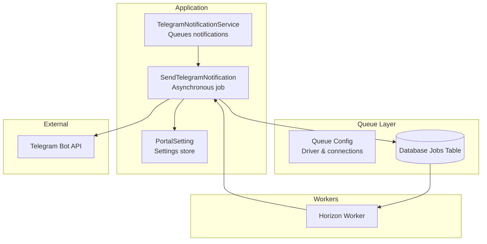
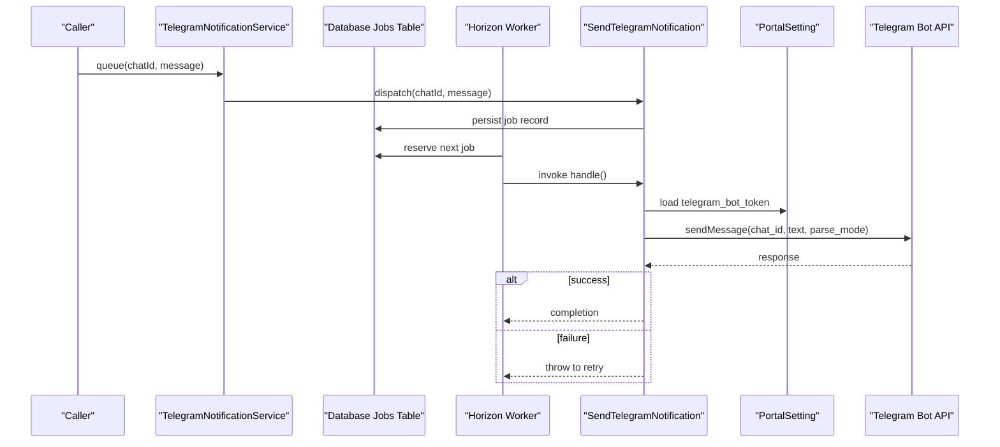
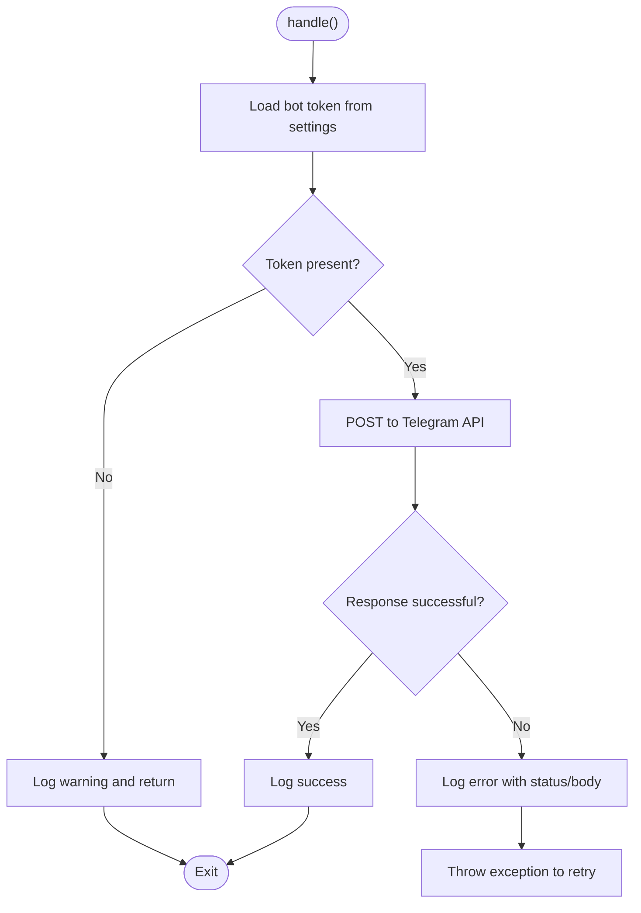
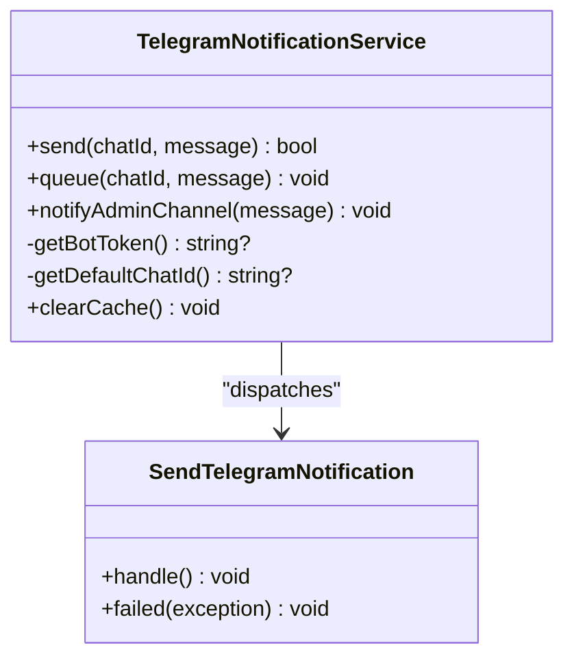
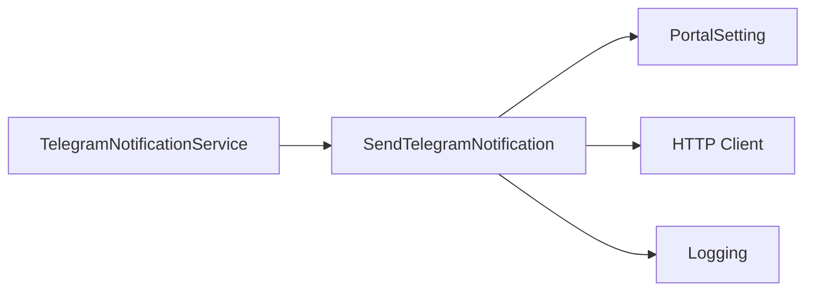

# Queue Processing

<cite>
**Referenced Files in This Document**
- [SendTelegramNotification.php](file://portal/app/Jobs/SendTelegramNotification.php)
- [TelegramNotificationService.php](file://portal/app/Services/TelegramNotificationService.php)
- [queue.php](file://portal/config/queue.php)
- [CheckSiteHealth.php](file://portal/app/Console/Commands/CheckSiteHealth.php)
- [docker-compose.yml](file://docker-compose.yml)
- [PortalSetting.php](file://portal/app/Models/PortalSetting.php)
- [2026_05_15_070005_create_portal_settings_table.php](file://portal/database/migrations/2026_05_15_070005_create_portal_settings_table.php)
</cite>

## Table of Contents
1. [Introduction](#introduction)
2. [Project Structure](#project-structure)
3. [Core Components](#core-components)
4. [Architecture Overview](#architecture-overview)
5. [Detailed Component Analysis](#detailed-component-analysis)
6. [Dependency Analysis](#dependency-analysis)
7. [Performance Considerations](#performance-considerations)
8. [Troubleshooting Guide](#troubleshooting-guide)
9. [Conclusion](#conclusion)
10. [Appendices](#appendices)

## Introduction
This document explains the queue-based notification processing system responsible for asynchronous Telegram message delivery. It covers the SendTelegramNotification job implementation, queue configuration, worker processes, job serialization, retry and failure handling, monitoring and management commands, performance considerations, and operational guidance for scaling and troubleshooting.

## Project Structure
The notification pipeline spans three primary areas:
- Jobs: The asynchronous job that sends Telegram messages.
- Services: A service layer that queues notifications and manages settings caching.
- Configuration: Queue driver selection, connection parameters, and failed job storage.

**Diagram sources**
- [TelegramNotificationService.php:11-106](file://portal/app/Services/TelegramNotificationService.php#L11-L106)
- [SendTelegramNotification.php:13-61](file://portal/app/Jobs/SendTelegramNotification.php#L13-L61)
- [queue.php:32-92](file://portal/config/queue.php#L32-L92)
- [docker-compose.yml:66-82](file://docker-compose.yml#L66-L82)

**Section sources**
- [SendTelegramNotification.php:1-62](file://portal/app/Jobs/SendTelegramNotification.php#L1-L62)
- [TelegramNotificationService.php:1-107](file://portal/app/Services/TelegramNotificationService.php#L1-L107)
- [queue.php:1-130](file://portal/config/queue.php#L1-L130)
- [docker-compose.yml:66-101](file://docker-compose.yml#L66-L101)

## Core Components
- SendTelegramNotification: Implements the asynchronous job interface, defines retry/backoff behavior, serializes arguments, and performs Telegram API calls with robust error logging and failure callbacks.
- TelegramNotificationService: Provides synchronous and asynchronous notification pathways, caches bot token and default chat ID, and dispatches the job safely.
- Queue Configuration: Defines the default driver, connection options for database-backed queues, and failed job storage.
- Worker Processes: Managed via Horizon in a dedicated container profile for workers.

Key behaviors:
- Serialization: Uses model serialization traits to safely pass primitive constructor arguments into queued jobs.
- Retry and Backoff: Configured per job with fixed tries and backoff seconds.
- Failure Handling: Logs permanent failures and defers to failed job storage.
- Monitoring: Horizon is used to monitor and manage queues.

**Section sources**
- [SendTelegramNotification.php:13-61](file://portal/app/Jobs/SendTelegramNotification.php#L13-L61)
- [TelegramNotificationService.php:11-106](file://portal/app/Services/TelegramNotificationService.php#L11-L106)
- [queue.php:32-127](file://portal/config/queue.php#L32-L127)
- [docker-compose.yml:66-82](file://docker-compose.yml#L66-L82)

## Architecture Overview
The system uses a database-backed queue by default. Jobs are stored in the jobs table and processed asynchronously by workers. The TelegramNotificationService decides whether to send immediately or queue for later processing. On successful dispatch, the job retrieves settings from the database and attempts to deliver the message to Telegram.

**Diagram sources**
- [TelegramNotificationService.php:53-65](file://portal/app/Services/TelegramNotificationService.php#L53-L65)
- [SendTelegramNotification.php:25-52](file://portal/app/Jobs/SendTelegramNotification.php#L25-L52)
- [queue.php:38-45](file://portal/config/queue.php#L38-L45)
- [docker-compose.yml:71](file://docker-compose.yml#L71)

## Detailed Component Analysis

### SendTelegramNotification Job
Responsibilities:
- Implements the asynchronous job contract.
- Defines retry count and backoff timing.
- Serializes constructor arguments for safe persistence.
- Retrieves bot token from settings and posts to Telegram API.
- Logs warnings when token is missing and errors on API failures.
- Triggers retry by throwing an exception on unsuccessful responses.
- Handles permanent failure via the failed callback.

Processing logic:
- Load token from settings.
- If missing, log warning and skip.
- Post to Telegram API with Markdown parsing.
- If response indicates failure, log error and rethrow to trigger retry.
- On success, log info.

**Diagram sources**
- [SendTelegramNotification.php:25-52](file://portal/app/Jobs/SendTelegramNotification.php#L25-L52)

**Section sources**
- [SendTelegramNotification.php:13-61](file://portal/app/Jobs/SendTelegramNotification.php#L13-L61)

### TelegramNotificationService
Responsibilities:
- Synchronous send: Attempts immediate delivery to Telegram with timeout and error logging.
- Asynchronous queue: Validates chat ID, falls back to default chat ID if needed, and dispatches the job.
- Settings caching: Caches bot token and default chat ID to reduce repeated reads.
- Admin notifications: Convenience method to notify the default admin channel.

**Diagram sources**
- [TelegramNotificationService.php:11-106](file://portal/app/Services/TelegramNotificationService.php#L11-L106)
- [SendTelegramNotification.php:13-61](file://portal/app/Jobs/SendTelegramNotification.php#L13-L61)

**Section sources**
- [TelegramNotificationService.php:11-106](file://portal/app/Services/TelegramNotificationService.php#L11-L106)

### Queue Configuration
Default driver and connections:
- Default connection is database.
- Database driver supports configurable table, queue name, and retry_after window.
- Redis, SQS, Beanstalkd, and other drivers are available for alternative backends.
- Failed jobs are stored in a dedicated failed_jobs table with UUID indexing.

Environment-driven settings:
- QUEUE_CONNECTION selects the driver.
- DB_QUEUE, DB_QUEUE_TABLE, DB_QUEUE_RETRY_AFTER control database queue behavior.
- REDIS_QUEUE_CONNECTION, REDIS_QUEUE, REDIS_QUEUE_RETRY_AFTER control Redis queue behavior.
- QUEUE_FAILED_DRIVER controls failed job storage driver and table.

**Section sources**
- [queue.php:16](file://portal/config/queue.php#L16)
- [queue.php:38-45](file://portal/config/queue.php#L38-L45)
- [queue.php:67-74](file://portal/config/queue.php#L67-L74)
- [queue.php:123-127](file://portal/config/queue.php#L123-L127)

### Worker Processes and Monitoring
- Workers are managed by Horizon running inside a dedicated container.
- The queue container runs the Horizon command and depends on the app, PostgreSQL, and Redis.
- The worker profile is enabled to start the queue and scheduler containers.

Operational note:
- Ensure the queue container is started with the worker profile to process jobs.

**Section sources**
- [docker-compose.yml:66-82](file://docker-compose.yml#L66-L82)

### Job Serialization and Deserialization
- The job uses model serialization traits to serialize constructor arguments.
- Constructor accepts primitive parameters (chat ID and message), ensuring safe persistence and reconstruction when the job is executed by the worker.

**Section sources**
- [SendTelegramNotification.php:15](file://portal/app/Jobs/SendTelegramNotification.php#L15)
- [SendTelegramNotification.php:20-23](file://portal/app/Jobs/SendTelegramNotification.php#L20-L23)

### Retry Mechanisms, Failure Handling, and Dead Letter Management
- Retry policy: The job defines a fixed number of tries and a backoff interval.
- Failure handling: On thrown exceptions, the job is retried according to the queue’s retry_after window.
- Permanent failure: The failed callback logs the error; failed jobs are persisted to the failed_jobs table for inspection and potential manual intervention.

**Section sources**
- [SendTelegramNotification.php:17-18](file://portal/app/Jobs/SendTelegramNotification.php#L17-L18)
- [SendTelegramNotification.php:54-60](file://portal/app/Jobs/SendTelegramNotification.php#L54-L60)
- [queue.php:123-127](file://portal/config/queue.php#L123-L127)

### Queue Monitoring and Management Commands
- Horizon: Used to monitor and manage queues and workers.
- Console command usage: The health check command demonstrates dispatching a notification job during automated maintenance tasks.

Note: Additional queue management commands (e.g., list, retry, flush) are available in Laravel and can be invoked similarly to existing console commands.

**Section sources**
- [docker-compose.yml:71](file://docker-compose.yml#L71)
- [CheckSiteHealth.php:81-93](file://portal/app/Console/Commands/CheckSiteHealth.php#L81-L93)

## Dependency Analysis
The job depends on:
- Settings model to retrieve bot credentials.
- HTTP client to call Telegram API.
- Logging facilities for warnings, errors, and info.

The service depends on:
- The job dispatcher to enqueue notifications.
- Settings model and cache to avoid repeated reads.

**Diagram sources**
- [TelegramNotificationService.php:5-10](file://portal/app/Services/TelegramNotificationService.php#L5-L10)
- [SendTelegramNotification.php:5-11](file://portal/app/Jobs/SendTelegramNotification.php#L5-L11)
- [PortalSetting.php:7-10](file://portal/app/Models/PortalSetting.php#L7-L10)

**Section sources**
- [TelegramNotificationService.php:5-10](file://portal/app/Services/TelegramNotificationService.php#L5-L10)
- [SendTelegramNotification.php:5-11](file://portal/app/Jobs/SendTelegramNotification.php#L5-L11)
- [PortalSetting.php:7-10](file://portal/app/Models/PortalSetting.php#L7-L10)

## Performance Considerations
- Queue driver choice: Database driver is simple but may require careful tuning of retry_after and connection pooling. Redis or SQS offer better throughput and horizontal scaling.
- Throughput: Increase concurrency by running multiple Horizon workers or using multiple queues to distribute load.
- Retry strategy: Tune tries and backoff to balance reliability and resource usage.
- Payload size: Keep messages concise to minimize serialization overhead.
- Database contention: For database-backed queues, ensure appropriate indexing and connection limits.
- External rate limits: Telegram API may throttle; consider batching or exponential backoff at the application level if needed.

[No sources needed since this section provides general guidance]

## Troubleshooting Guide
Common issues and resolutions:
- Stuck jobs:
  - Verify workers are running and connected to the queue container profile.
  - Check failed_jobs table for persistent failures.
  - Confirm retry_after is sufficient for long-running operations.
- Processing failures:
  - Review logs for API error details and status codes.
  - Validate bot token and chat ID availability in settings.
  - Ensure network connectivity to Telegram API.
- Missing notifications:
  - Confirm queue is not blocked by retry_after or worker unavailability.
  - Verify settings caching is current after updates (use service’s cache clearing method).
- Scaling bottlenecks:
  - Switch to Redis or SQS driver for higher throughput.
  - Run multiple workers behind Horizon.
  - Distribute workloads across multiple queues.

**Section sources**
- [queue.php:123-127](file://portal/config/queue.php#L123-L127)
- [SendTelegramNotification.php:40-49](file://portal/app/Jobs/SendTelegramNotification.php#L40-L49)
- [TelegramNotificationService.php:101-105](file://portal/app/Services/TelegramNotificationService.php#L101-L105)
- [docker-compose.yml:66-82](file://docker-compose.yml#L66-L82)

## Conclusion
The queue-based notification system provides reliable, asynchronous delivery of Telegram messages. By leveraging Horizon workers, configurable queue drivers, and robust retry/failure handling, the system scales effectively while maintaining observability and operability. Proper configuration of settings, queues, and workers ensures smooth operation under varying loads.

[No sources needed since this section summarizes without analyzing specific files]

## Appendices

### Settings and Schema Notes
- Settings table stores key-value pairs for bot token and default chat ID.
- The service caches these values to reduce database queries.

**Section sources**
- [2026_05_15_070005_create_portal_settings_table.php:11-16](file://portal/database/migrations/2026_05_15_070005_create_portal_settings_table.php#L11-L16)
- [TelegramNotificationService.php:81-96](file://portal/app/Services/TelegramNotificationService.php#L81-L96)