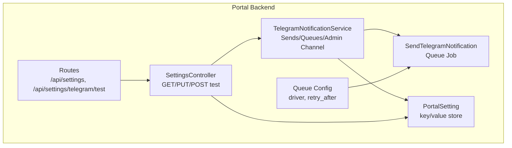
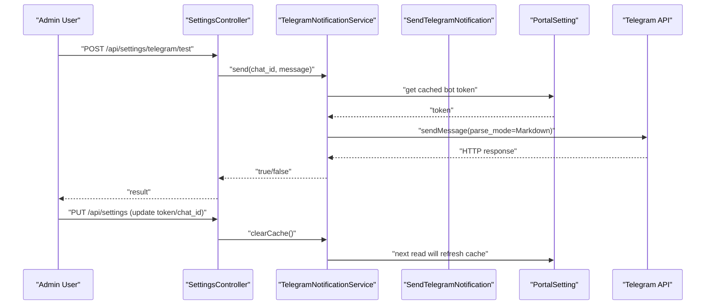
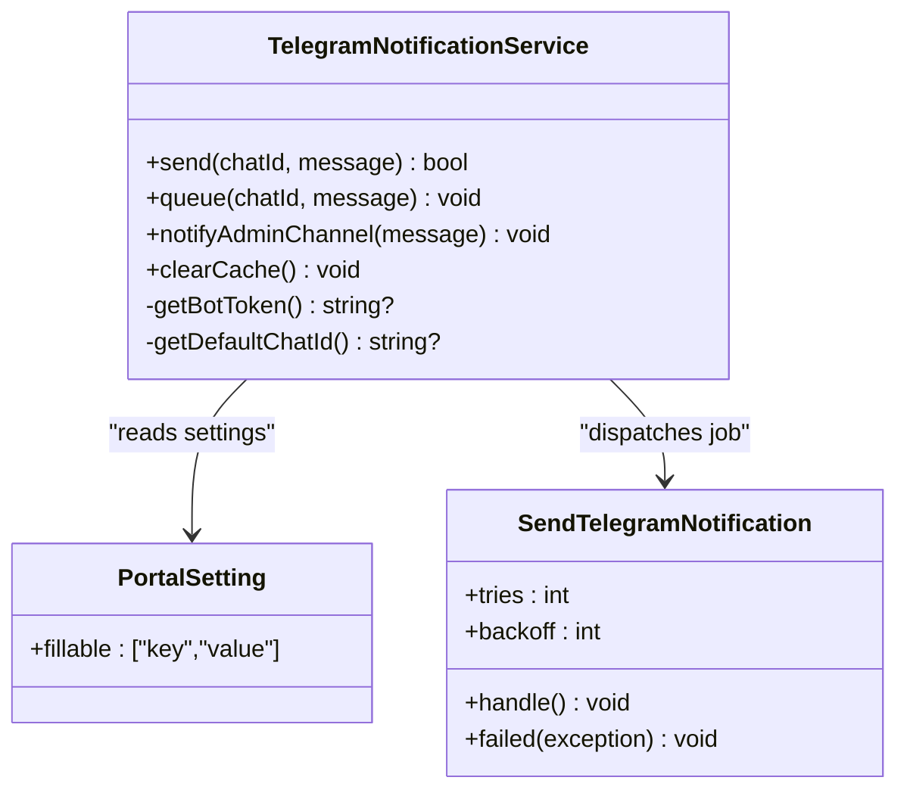
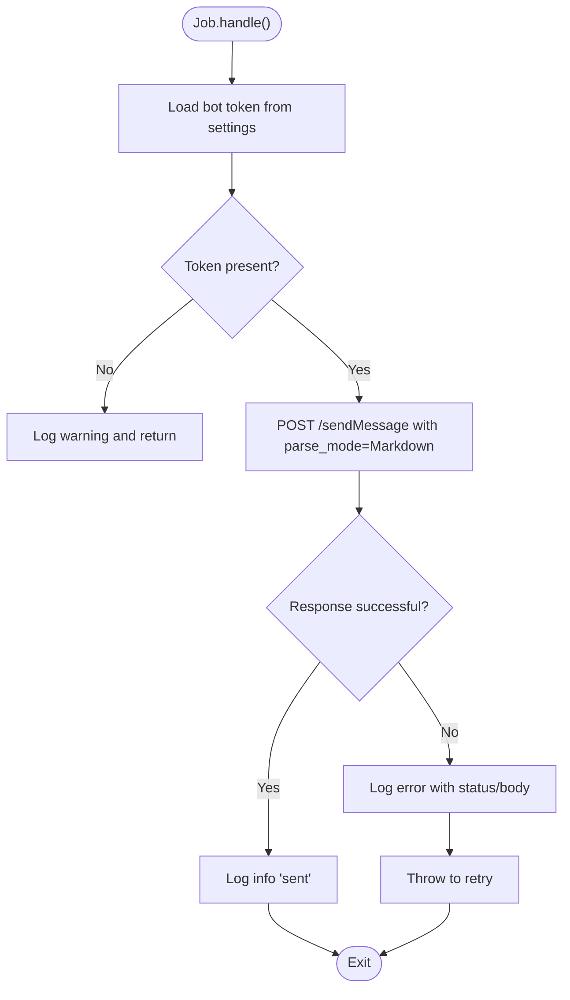
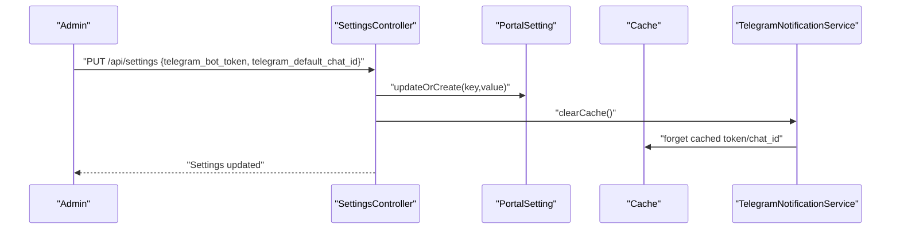
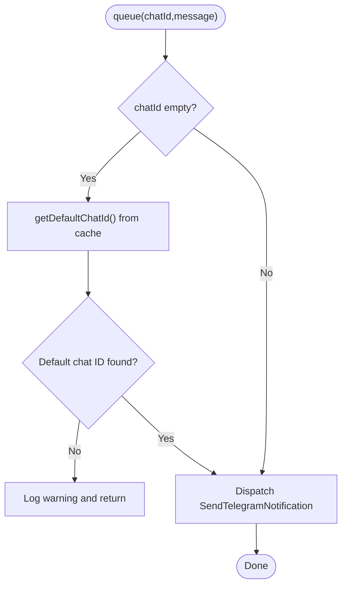
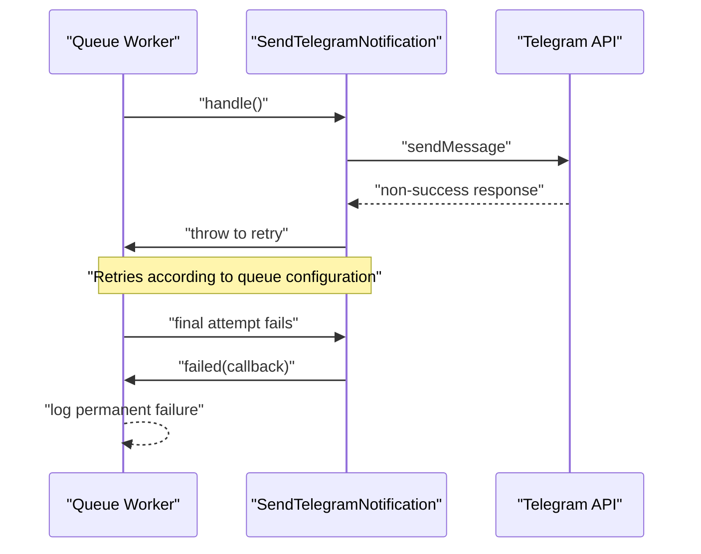
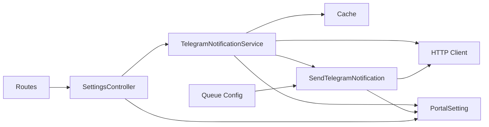

# Telegram Integration

<cite>
**Referenced Files in This Document**
- [SendTelegramNotification.php](file://portal/app/Jobs/SendTelegramNotification.php)
- [TelegramNotificationService.php](file://portal/app/Services/TelegramNotificationService.php)
- [SettingsController.php](file://portal/app/Http/Controllers/Portal/SettingsController.php)
- [PortalSetting.php](file://portal/app/Models/PortalSetting.php)
- [2026_05_15_070005_create_portal_settings_table.php](file://portal/database/migrations/2026_05_15_070005_create_portal_settings_table.php)
- [api.php](file://portal/routes/api.php)
- [queue.php](file://portal/config/queue.php)
- [User.php](file://portal/app/Models/User.php)
- [UserController.php](file://portal/app/Http/Controllers/Portal/UserController.php)
</cite>

## Table of Contents
1. [Introduction](#introduction)
2. [Project Structure](#project-structure)
3. [Core Components](#core-components)
4. [Architecture Overview](#architecture-overview)
5. [Detailed Component Analysis](#detailed-component-analysis)
6. [Dependency Analysis](#dependency-analysis)
7. [Performance Considerations](#performance-considerations)
8. [Troubleshooting Guide](#troubleshooting-guide)
9. [Conclusion](#conclusion)
10. [Appendices](#appendices)

## Introduction
This document explains the Telegram notification integration for the portal. It covers how to configure a Telegram bot, how messages are formatted and delivered, and how the system supports both synchronous and asynchronous delivery. It also documents the queue-based delivery system, default admin channel configuration, caching of tokens and chat IDs, error handling and retries, and practical examples for common notification scenarios.

## Project Structure
The Telegram integration spans three main areas:
- Service layer that orchestrates notifications and caches settings
- Queue job that performs the actual Telegram API call
- Settings controller and model that persist bot token and default chat ID

**Diagram sources**
- [TelegramNotificationService.php:11-106](file://portal/app/Services/TelegramNotificationService.php#L11-L106)
- [SendTelegramNotification.php:13-61](file://portal/app/Jobs/SendTelegramNotification.php#L13-L61)
- [SettingsController.php:11-86](file://portal/app/Http/Controllers/Portal/SettingsController.php#L11-L86)
- [PortalSetting.php:7-10](file://portal/app/Models/PortalSetting.php#L7-L10)
- [api.php:24-26](file://portal/routes/api.php#L24-L26)
- [queue.php:16](file://portal/config/queue.php#L16)

**Section sources**
- [TelegramNotificationService.php:11-106](file://portal/app/Services/TelegramNotificationService.php#L11-L106)
- [SendTelegramNotification.php:13-61](file://portal/app/Jobs/SendTelegramNotification.php#L13-L61)
- [SettingsController.php:11-86](file://portal/app/Http/Controllers/Portal/SettingsController.php#L11-L86)
- [PortalSetting.php:7-10](file://portal/app/Models/PortalSetting.php#L7-L10)
- [api.php:24-26](file://portal/routes/api.php#L24-L26)
- [queue.php:16](file://portal/config/queue.php#L16)

## Core Components
- TelegramNotificationService: Provides synchronous send, asynchronous queue, admin channel broadcast, and cached retrieval of bot token and default chat ID.
- SendTelegramNotification: Queue job that posts to Telegram’s API using Markdown parse mode, with retry and failure logging.
- SettingsController: Exposes endpoints to fetch and update settings, including Telegram bot token and default chat ID, plus a test endpoint.
- PortalSetting: Eloquent model for key/value settings persisted in the database.
- Routes: Declares the settings endpoints used to configure and test Telegram.
- Queue configuration: Defines the default queue driver and retry behavior.

**Section sources**
- [TelegramNotificationService.php:11-106](file://portal/app/Services/TelegramNotificationService.php#L11-L106)
- [SendTelegramNotification.php:13-61](file://portal/app/Jobs/SendTelegramNotification.php#L13-L61)
- [SettingsController.php:11-86](file://portal/app/Http/Controllers/Portal/SettingsController.php#L11-L86)
- [PortalSetting.php:7-10](file://portal/app/Models/PortalSetting.php#L7-L10)
- [api.php:24-26](file://portal/routes/api.php#L24-L26)
- [queue.php:16](file://portal/config/queue.php#L16)

## Architecture Overview
The integration supports two delivery modes:
- Synchronous: Used primarily for testing. Sends immediately and returns a boolean result.
- Asynchronous: Dispatches a queue job to deliver the message later, enabling non-blocking operation.

**Diagram sources**
- [SettingsController.php:69-85](file://portal/app/Http/Controllers/Portal/SettingsController.php#L69-L85)
- [TelegramNotificationService.php:16-48](file://portal/app/Services/TelegramNotificationService.php#L16-L48)
- [TelegramNotificationService.php:81-96](file://portal/app/Services/TelegramNotificationService.php#L81-L96)
- [SendTelegramNotification.php:25-51](file://portal/app/Jobs/SendTelegramNotification.php#L25-L51)
- [PortalSetting.php:7-10](file://portal/app/Models/PortalSetting.php#L7-L10)

## Detailed Component Analysis

### TelegramNotificationService
Responsibilities:
- Synchronous send: Posts to Telegram API with Markdown parse mode and returns success/failure.
- Queue dispatch: If chat ID is empty, resolves default admin chat ID from cache and dispatches job.
- Admin broadcast: Convenience method to queue a message to the default admin channel.
- Caching: Uses cache with a 300-second TTL for bot token and default chat ID; exposes clearCache to invalidate on settings updates.

Key behaviors:
- Uses Markdown parse mode for message formatting.
- Validates presence of bot token and chat ID before sending.
- Clears cache when settings are updated to reflect new values.

**Diagram sources**
- [TelegramNotificationService.php:11-106](file://portal/app/Services/TelegramNotificationService.php#L11-L106)
- [PortalSetting.php:7-10](file://portal/app/Models/PortalSetting.php#L7-L10)
- [SendTelegramNotification.php:13-61](file://portal/app/Jobs/SendTelegramNotification.php#L13-L61)

**Section sources**
- [TelegramNotificationService.php:16-48](file://portal/app/Services/TelegramNotificationService.php#L16-L48)
- [TelegramNotificationService.php:53-76](file://portal/app/Services/TelegramNotificationService.php#L53-L76)
- [TelegramNotificationService.php:81-96](file://portal/app/Services/TelegramNotificationService.php#L81-L96)
- [TelegramNotificationService.php:101-105](file://portal/app/Services/TelegramNotificationService.php#L101-L105)

### SendTelegramNotification (Queue Job)
Responsibilities:
- Performs the Telegram API call with Markdown parse mode.
- Implements retry logic via queue worker and failure callback.
- Logs successes and failures with context.

Behavior:
- Reads the bot token directly from settings on each run (bypassing cache to avoid stale values).
- Throws on non-success responses to trigger retry.
- On permanent failure, logs the error with chat ID.

**Diagram sources**
- [SendTelegramNotification.php:25-51](file://portal/app/Jobs/SendTelegramNotification.php#L25-L51)

**Section sources**
- [SendTelegramNotification.php:25-51](file://portal/app/Jobs/SendTelegramNotification.php#L25-L51)
- [SendTelegramNotification.php:54-60](file://portal/app/Jobs/SendTelegramNotification.php#L54-L60)

### SettingsController and Settings Persistence
Endpoints:
- GET /api/settings: Returns all settings, masking the bot token value.
- PUT /api/settings: Updates allowed keys including telegram_bot_token and telegram_default_chat_id; clears Telegram cache after update.
- POST /api/settings/telegram/test: Tests Telegram configuration by sending a sample message synchronously.

Settings persistence:
- Uses PortalSetting model to store key/value pairs.
- Migration defines a unique key constraint on the key column.

**Diagram sources**
- [SettingsController.php:33-64](file://portal/app/Http/Controllers/Portal/SettingsController.php#L33-L64)
- [TelegramNotificationService.php:101-105](file://portal/app/Services/TelegramNotificationService.php#L101-L105)
- [PortalSetting.php:7-10](file://portal/app/Models/PortalSetting.php#L7-L10)
- [2026_05_15_070005_create_portal_settings_table.php:11-16](file://portal/database/migrations/2026_05_15_070005_create_portal_settings_table.php#L11-L16)

**Section sources**
- [SettingsController.php:18-28](file://portal/app/Http/Controllers/Portal/SettingsController.php#L18-L28)
- [SettingsController.php:33-64](file://portal/app/Http/Controllers/Portal/SettingsController.php#L33-L64)
- [SettingsController.php:69-85](file://portal/app/Http/Controllers/Portal/SettingsController.php#L69-L85)
- [PortalSetting.php:7-10](file://portal/app/Models/PortalSetting.php#L7-L10)
- [2026_05_15_070005_create_portal_settings_table.php:11-16](file://portal/database/migrations/2026_05_15_070005_create_portal_settings_table.php#L11-L16)

### Message Formatting and Delivery Modes
- Parse mode: Messages are sent with Markdown parse mode, enabling basic formatting such as bold, italic, and line breaks.
- Synchronous mode: Intended for immediate feedback (e.g., test messages).
- Asynchronous mode: Uses queue job for non-blocking delivery.

Note: The current implementation does not enable HTML parse mode. If HTML is desired, the parse_mode would need to be changed accordingly.

**Section sources**
- [TelegramNotificationService.php:31](file://portal/app/Services/TelegramNotificationService.php#L31)
- [SendTelegramNotification.php:37](file://portal/app/Jobs/SendTelegramNotification.php#L37)

### Default Admin Channel and Chat ID Management
- Default chat ID is resolved from cached settings if a specific chat ID is not provided.
- The service attempts to queue the message; if no default chat ID is available, it logs a warning and skips delivery.
- Users can optionally set their personal Telegram chat ID in their profile; however, the default admin channel is managed via settings.

**Diagram sources**
- [TelegramNotificationService.php:53-76](file://portal/app/Services/TelegramNotificationService.php#L53-L76)
- [TelegramNotificationService.php:89-96](file://portal/app/Services/TelegramNotificationService.php#L89-L96)

**Section sources**
- [TelegramNotificationService.php:53-76](file://portal/app/Services/TelegramNotificationService.php#L53-L76)
- [TelegramNotificationService.php:89-96](file://portal/app/Services/TelegramNotificationService.php#L89-L96)

### Caching Mechanism
- Bot token and default chat ID are cached with a 300-second TTL.
- On settings updates, cache entries are explicitly removed so subsequent reads fetch fresh values from the database.

**Section sources**
- [TelegramNotificationService.php:81-96](file://portal/app/Services/TelegramNotificationService.php#L81-L96)
- [TelegramNotificationService.php:101-105](file://portal/app/Services/TelegramNotificationService.php#L101-L105)

### Error Handling, Retry Logic, and Delivery Tracking
- Synchronous send: Returns false on non-success responses and logs errors.
- Queue job: Throws on non-success responses to trigger retry; logs transient failure and permanent failure via the failed callback.
- Retry configuration: Controlled by the queue driver and retry_after settings.

**Diagram sources**
- [SendTelegramNotification.php:40-60](file://portal/app/Jobs/SendTelegramNotification.php#L40-L60)
- [queue.php:43](file://portal/config/queue.php#L43)

**Section sources**
- [TelegramNotificationService.php:39-47](file://portal/app/Services/TelegramNotificationService.php#L39-L47)
- [SendTelegramNotification.php:40-60](file://portal/app/Jobs/SendTelegramNotification.php#L40-L60)
- [queue.php:43](file://portal/config/queue.php#L43)

### Common Notification Scenarios and Templates
Below are typical scenarios and recommended approaches. Replace placeholders with actual values and tailor content to your needs.

- Test notification
  - Endpoint: POST /api/settings/telegram/test
  - Purpose: Verify bot token and chat ID configuration.
  - Notes: The payload requires a chat_id; the message body is fixed for this endpoint.

- Admin broadcast
  - Method: notifyAdminChannel(message)
  - Behavior: Sends the message to the default admin channel if configured.

- Per-user notification
  - Method: queue(user.telegram_chat_id, message)
  - Behavior: Sends the message to the user’s Telegram chat if available.

- Immediate feedback
  - Method: send(chatId, message)
  - Behavior: Useful for testing or small alerts where blocking is acceptable.

**Section sources**
- [SettingsController.php:69-85](file://portal/app/Http/Controllers/Portal/SettingsController.php#L69-L85)
- [TelegramNotificationService.php:70-76](file://portal/app/Services/TelegramNotificationService.php#L70-L76)
- [TelegramNotificationService.php:53-65](file://portal/app/Services/TelegramNotificationService.php#L53-L65)
- [TelegramNotificationService.php:16](file://portal/app/Services/TelegramNotificationService.php#L16)

## Dependency Analysis
- Service depends on:
  - PortalSetting for persistent configuration
  - Cache for token/chat ID caching
  - HTTP client for Telegram API calls
  - Queue system for asynchronous delivery
- Job depends on:
  - PortalSetting for token retrieval
  - HTTP client for Telegram API calls
  - Queue worker for retries

**Diagram sources**
- [TelegramNotificationService.php:5-9](file://portal/app/Services/TelegramNotificationService.php#L5-L9)
- [SendTelegramNotification.php:10](file://portal/app/Jobs/SendTelegramNotification.php#L10)
- [SettingsController.php:8](file://portal/app/Http/Controllers/Portal/SettingsController.php#L8)
- [api.php:24-26](file://portal/routes/api.php#L24-L26)
- [queue.php:16](file://portal/config/queue.php#L16)

**Section sources**
- [TelegramNotificationService.php:5-9](file://portal/app/Services/TelegramNotificationService.php#L5-L9)
- [SendTelegramNotification.php:10](file://portal/app/Jobs/SendTelegramNotification.php#L10)
- [SettingsController.php:8](file://portal/app/Http/Controllers/Portal/SettingsController.php#L8)
- [api.php:24-26](file://portal/routes/api.php#L24-L26)
- [queue.php:16](file://portal/config/queue.php#L16)

## Performance Considerations
- Use asynchronous delivery (queue) for bulk or non-critical notifications to avoid blocking requests.
- Keep retry_after and queue driver tuned to your infrastructure capacity.
- Cache token and chat ID to reduce database queries; remember to clear cache on settings changes.
- Limit message size and formatting complexity to minimize API overhead.

[No sources needed since this section provides general guidance]

## Troubleshooting Guide
Common issues and resolutions:
- No bot token configured
  - Symptom: Warning logged and early return in both sync and queue flows.
  - Action: Set telegram_bot_token via settings and clear cache.

- No default chat ID configured
  - Symptom: Warning logged and queue skipped when attempting admin broadcast.
  - Action: Set telegram_default_chat_id via settings.

- Non-success Telegram API response
  - Symptom: Error logged; queue job throws to trigger retry; permanent failure logged on final attempt.
  - Action: Inspect status and body; verify chat_id and token; confirm rate limits.

- Settings not taking effect
  - Symptom: Old values used despite updates.
  - Action: Ensure settings update triggers clearCache; verify cache driver and TTL.

**Section sources**
- [SendTelegramNotification.php:29-31](file://portal/app/Jobs/SendTelegramNotification.php#L29-L31)
- [TelegramNotificationService.php:20-23](file://portal/app/Services/TelegramNotificationService.php#L20-L23)
- [TelegramNotificationService.php:59-61](file://portal/app/Services/TelegramNotificationService.php#L59-L61)
- [SendTelegramNotification.php:40-49](file://portal/app/Jobs/SendTelegramNotification.php#L40-L49)
- [SettingsController.php:60-61](file://portal/app/Http/Controllers/Portal/SettingsController.php#L60-L61)

## Conclusion
The Telegram integration provides a robust, configurable solution for delivering notifications. It supports both synchronous and asynchronous delivery, caches critical settings for performance, and offers a test endpoint to validate configurations. Administrators can manage bot tokens and default channels via the settings API, while developers can integrate notifications using the service layer.

[No sources needed since this section summarizes without analyzing specific files]

## Appendices

### Rate Limiting and API Considerations
- The current implementation does not include explicit rate-limit handling or exponential backoff beyond the queue worker’s built-in retry behavior.
- Recommendations:
  - Monitor Telegram API response codes and implement client-side throttling if needed.
  - Use queue concurrency controls appropriate to your infrastructure.
  - Consider batching or staggering high-volume notifications.

[No sources needed since this section provides general guidance]