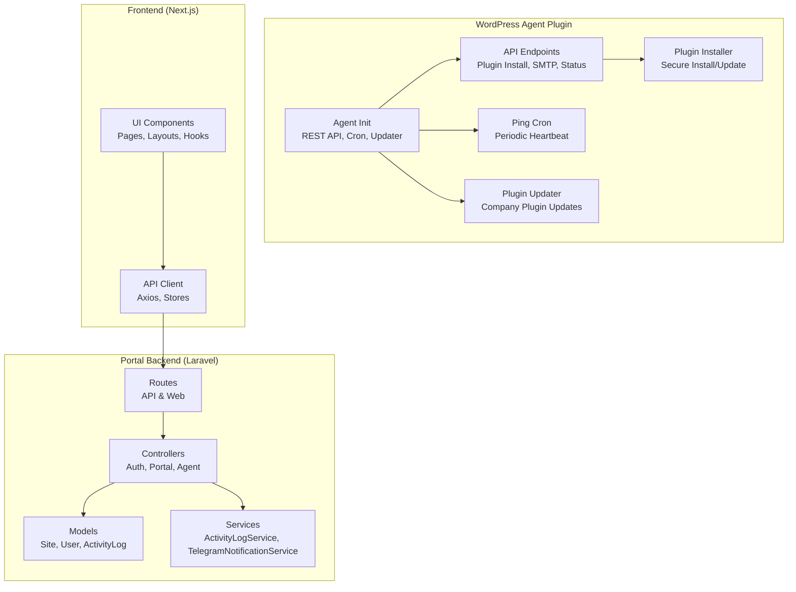
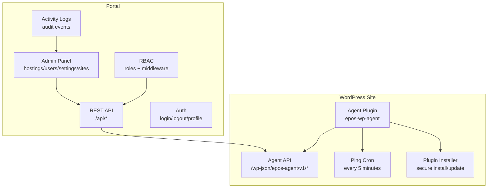
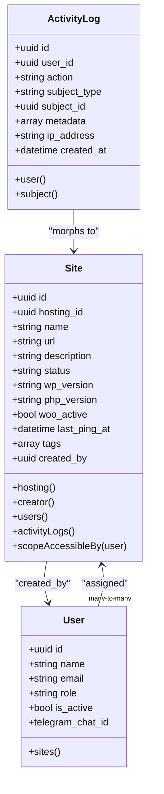
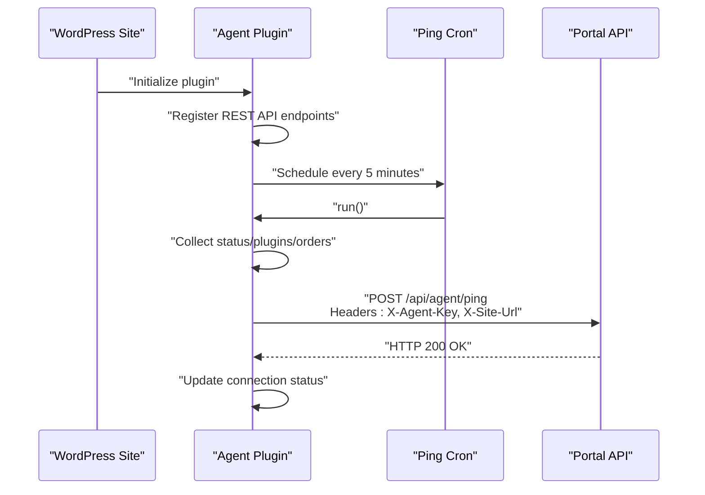
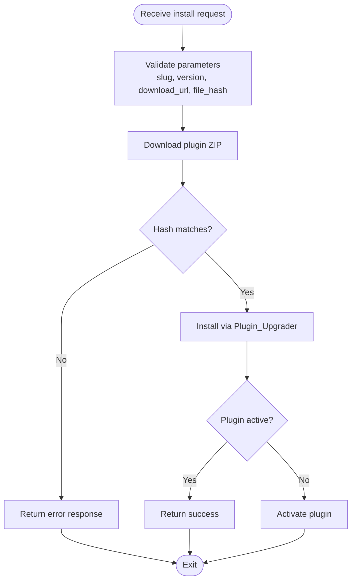
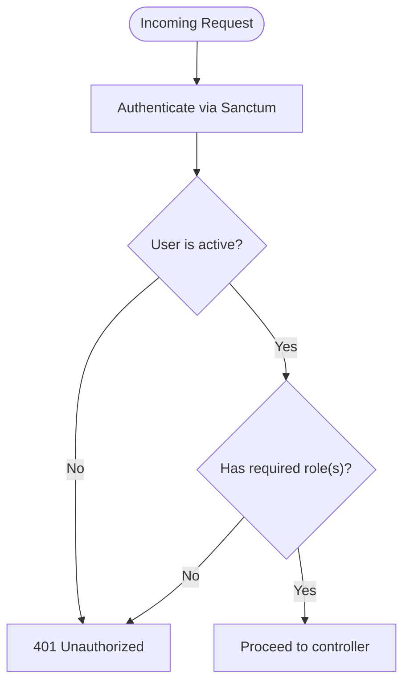
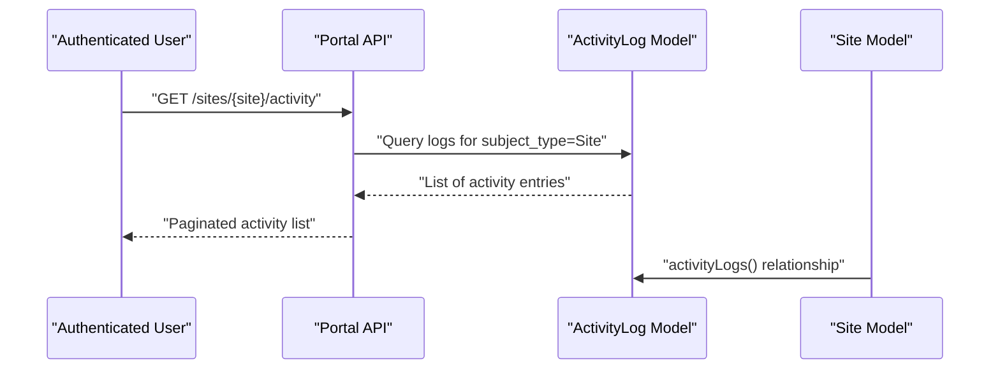
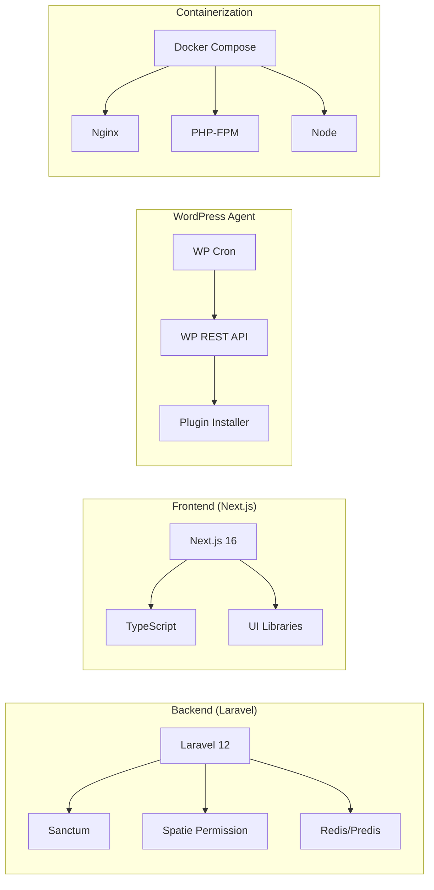

# Project Overview

<cite>
**Referenced Files in This Document**
- [epos-wp-agent.php](file://agent/epos-wp-agent/epos-wp-agent.php)
- [class-api.php](file://agent/epos-wp-agent/includes/class-api.php)
- [class-ping.php](file://agent/epos-wp-agent/includes/class-ping.php)
- [class-plugin-installer.php](file://agent/epos-wp-agent/includes/class-plugin-installer.php)
- [class-plugin-updater.php](file://agent/epos-wp-agent/includes/class-plugin-updater.php)
- [composer.json](file://portal/composer.json)
- [package.json](file://portal/frontend/package.json)
- [api.php](file://portal/routes/api.php)
- [Site.php](file://portal/app/Models/Site.php)
- [User.php](file://portal/app/Models/User.php)
- [ActivityLog.php](file://portal/app/Models/ActivityLog.php)
- [docker-compose.yml](file://docker-compose.yml)
- [Dockerfile (PHP)](file://docker/php/Dockerfile)
- [Dockerfile (Node)](file://docker/node/Dockerfile)
- [default.conf](file://docker/nginx/default.conf)
</cite>

## Table of Contents
1. [Introduction](#introduction)
2. [Project Structure](#project-structure)
3. [Core Components](#core-components)
4. [Architecture Overview](#architecture-overview)
5. [Detailed Component Analysis](#detailed-component-analysis)
6. [Dependency Analysis](#dependency-analysis)
7. [Performance Considerations](#performance-considerations)
8. [Troubleshooting Guide](#troubleshooting-guide)
9. [Conclusion](#conclusion)

## Introduction
EPOS Portal is a centralized WordPress site management platform designed to streamline administration across multiple WordPress installations. Its core value proposition lies in enabling administrators to manage numerous WordPress sites from a single control plane, while providing real-time visibility, automated operations, and robust governance through role-based access control and activity logging.

Key benefits for administrators:
- Multi-tenant management: provision, monitor, and operate many WordPress sites efficiently.
- Real-time agent communication: continuous health and status reporting from each site to the central portal.
- Automated plugin lifecycle: remote installation and updates for company plugins with secure verification.
- Role-based access control: granular permissions tailored for administrators, developers, and marketing teams.
- Activity logging: audit trails for compliance and operational insights.

Target audience:
- Administrators: oversee global settings, hosting, and user management.
- Developers: deploy and maintain WordPress sites, manage plugins, and configure integrations.
- Marketing teams: access read-only views of assigned sites for content and analytics oversight.

Common use cases:
- Managing a portfolio of client WordPress sites from a central dashboard.
- Rolling out company plugins across hundreds of sites with a single command.
- Monitoring uptime and performance via periodic agent pings and status reports.
- Enforcing access policies and tracking who made changes to which site.

## Project Structure
The project is organized into three primary layers:
- Backend portal: Laravel application exposing REST APIs and administrative interfaces.
- WordPress agent plugin: a site-side plugin that communicates with the portal, performs automated tasks, and reports status.
- Frontend: Next.js application providing the user interface for administrators and team members.

**Diagram sources**
- [epos-wp-agent.php:43-53](file://agent/epos-wp-agent/epos-wp-agent.php#L43-L53)
- [class-api.php:8-45](file://agent/epos-wp-agent/includes/class-api.php#L8-L45)
- [class-ping.php:7-13](file://agent/epos-wp-agent/includes/class-ping.php#L7-L13)
- [class-plugin-installer.php:13-92](file://agent/epos-wp-agent/includes/class-plugin-installer.php#L13-L92)
- [class-plugin-updater.php:8-11](file://agent/epos-wp-agent/includes/class-plugin-updater.php#L8-L11)
- [api.php:10-47](file://portal/routes/api.php#L10-L47)
- [Site.php:12-75](file://portal/app/Models/Site.php#L12-L75)
- [User.php:11-37](file://portal/app/Models/User.php#L11-L37)
- [ActivityLog.php:9-36](file://portal/app/Models/ActivityLog.php#L9-L36)

**Section sources**
- [epos-wp-agent.php:1-61](file://agent/epos-wp-agent/epos-wp-agent.php#L1-L61)
- [api.php:1-48](file://portal/routes/api.php#L1-L48)
- [composer.json:1-90](file://portal/composer.json#L1-L90)
- [package.json:1-43](file://portal/frontend/package.json#L1-L43)

## Core Components
- Multi-tenant WordPress site management
  - The portal models sites and their relationships to hosting providers and users, enabling centralized provisioning and access control.
  - See [Site.php:12-75](file://portal/app/Models/Site.php#L12-L75) for attributes and relationships, and [api.php:44-46](file://portal/routes/api.php#L44-L46) for listing and viewing sites.

- Real-time agent communication
  - The WordPress agent periodically pings the portal with status and optionally order data, and exposes endpoints for remote commands.
  - See [class-ping.php:29-81](file://agent/epos-wp-agent/includes/class-ping.php#L29-L81) for the heartbeat mechanism and [class-api.php:15-45](file://agent/epos-wp-agent/includes/class-api.php#L15-L45) for command endpoints.

- Role-based access control
  - Built on Laravel Sanctum and Spatie Permission, supporting roles such as admin, dev, and mkt with middleware enforcement.
  - See [User.php:11-37](file://portal/app/Models/User.php#L11-L37) and route groups in [api.php:17-47](file://portal/routes/api.php#L17-L47).

- Automated plugin management
  - Remote plugin installation with secure hash verification and activation.
  - See [class-plugin-installer.php:13-92](file://agent/epos-wp-agent/includes/class-plugin-installer.php#L13-L92).

- Activity logging
  - Audit trail capturing actions performed by users against sites and related entities.
  - See [ActivityLog.php:9-36](file://portal/app/Models/ActivityLog.php#L9-L36) and site-scoped activity retrieval in [api.php](file://portal/routes/api.php#L46).

**Section sources**
- [Site.php:12-75](file://portal/app/Models/Site.php#L12-L75)
- [class-ping.php:29-81](file://agent/epos-wp-agent/includes/class-ping.php#L29-L81)
- [class-api.php:15-45](file://agent/epos-wp-agent/includes/class-api.php#L15-L45)
- [User.php:11-37](file://portal/app/Models/User.php#L11-L37)
- [api.php:17-47](file://portal/routes/api.php#L17-L47)
- [class-plugin-installer.php:13-92](file://agent/epos-wp-agent/includes/class-plugin-installer.php#L13-L92)
- [ActivityLog.php:9-36](file://portal/app/Models/ActivityLog.php#L9-L36)

## Architecture Overview
The system architecture connects the central portal to WordPress sites through a dedicated agent plugin. The portal exposes REST APIs for authentication, resource management, and administrative controls. The agent plugin registers REST endpoints and a periodic cron job to report status and execute commands.

**Diagram sources**
- [epos-wp-agent.php:43-53](file://agent/epos-wp-agent/epos-wp-agent.php#L43-L53)
- [class-api.php:8-45](file://agent/epos-wp-agent/includes/class-api.php#L8-L45)
- [class-ping.php:7-13](file://agent/epos-wp-agent/includes/class-ping.php#L7-L13)
- [class-plugin-installer.php:13-92](file://agent/epos-wp-agent/includes/class-plugin-installer.php#L13-L92)
- [api.php:10-47](file://portal/routes/api.php#L10-L47)

## Detailed Component Analysis

### Multi-tenant Site Management
The portal models WordPress sites with metadata such as name, URL, status, versions, and tags. It supports filtering by user assignment for non-admin users and exposes CRUD operations for admins and developers.

**Diagram sources**
- [Site.php:12-75](file://portal/app/Models/Site.php#L12-L75)
- [User.php:11-37](file://portal/app/Models/User.php#L11-L37)
- [ActivityLog.php:9-36](file://portal/app/Models/ActivityLog.php#L9-L36)

**Section sources**
- [Site.php:12-75](file://portal/app/Models/Site.php#L12-L75)
- [api.php:44-46](file://portal/routes/api.php#L44-L46)

### Real-time Agent Communication
The agent plugin registers REST endpoints and a periodic cron job to send status and optionally order data to the portal. Authentication is enforced via a shared agent key header.

**Diagram sources**
- [epos-wp-agent.php:43-53](file://agent/epos-wp-agent/epos-wp-agent.php#L43-L53)
- [class-ping.php:29-81](file://agent/epos-wp-agent/includes/class-ping.php#L29-L81)
- [class-api.php:15-45](file://agent/epos-wp-agent/includes/class-api.php#L15-L45)

**Section sources**
- [class-ping.php:29-81](file://agent/epos-wp-agent/includes/class-ping.php#L29-L81)
- [class-api.php:15-45](file://agent/epos-wp-agent/includes/class-api.php#L15-L45)

### Automated Plugin Management
The portal can remotely install or update company plugins on WordPress sites. The agent verifies the download, validates the file hash, installs/updates, and activates the plugin.

**Diagram sources**
- [class-plugin-installer.php:13-92](file://agent/epos-wp-agent/includes/class-plugin-installer.php#L13-L92)

**Section sources**
- [class-plugin-installer.php:13-92](file://agent/epos-wp-agent/includes/class-plugin-installer.php#L13-L92)

### Role-Based Access Control
The portal enforces roles and permissions across routes. Administrative routes are protected by role middleware, while developer and marketing users have scoped access to sites.

**Diagram sources**
- [api.php:10-27](file://portal/routes/api.php#L10-L27)
- [User.php:11-37](file://portal/app/Models/User.php#L11-L37)

**Section sources**
- [api.php:17-47](file://portal/routes/api.php#L17-L47)
- [User.php:11-37](file://portal/app/Models/User.php#L11-L37)

### Activity Logging
Activity logs capture user actions against sites and related entities, enabling audits and operational insights. Sites expose an activity endpoint for filtered retrieval.

**Diagram sources**
- [api.php](file://portal/routes/api.php#L46)
- [ActivityLog.php:9-36](file://portal/app/Models/ActivityLog.php#L9-L36)
- [Site.php:56-60](file://portal/app/Models/Site.php#L56-L60)

**Section sources**
- [ActivityLog.php:9-36](file://portal/app/Models/ActivityLog.php#L9-L36)
- [Site.php:56-60](file://portal/app/Models/Site.php#L56-L60)
- [api.php](file://portal/routes/api.php#L46)

## Dependency Analysis
Technology stack overview:
- Backend: Laravel 12 with Sanctum for API authentication, Spatie Permission for roles, Redis via Predis for caching/queues, and MySQL/SQLite for persistence.
- Frontend: Next.js 16 with React 19, TypeScript, Tailwind CSS, and TanStack Table for data grids.
- WordPress Agent: PHP plugin leveraging WordPress REST API, cron system, and plugin installer/upgrader APIs.
- Containerization: Docker Compose with Nginx, PHP-FPM, and Node services.

**Diagram sources**
- [composer.json:8-14](file://portal/composer.json#L8-L14)
- [package.json:11-31](file://portal/frontend/package.json#L11-L31)
- [epos-wp-agent.php:26-34](file://agent/epos-wp-agent/epos-wp-agent.php#L26-L34)
- [docker-compose.yml](file://docker-compose.yml)

**Section sources**
- [composer.json:8-14](file://portal/composer.json#L8-L14)
- [package.json:11-31](file://portal/frontend/package.json#L11-L31)
- [epos-wp-agent.php:26-34](file://agent/epos-wp-agent/epos-wp-agent.php#L26-L34)
- [docker-compose.yml](file://docker-compose.yml)

## Performance Considerations
- Agent ping cadence: The current schedule runs every five minutes. Adjust intervals based on monitoring needs and network capacity.
- Plugin downloads: Ensure sufficient disk space and memory limits during bulk plugin operations.
- Queue processing: Offload long-running tasks (notifications, sync jobs) to queues for responsiveness.
- Caching: Use Redis for session caching and rate-limiting to reduce database load.
- CDN and asset optimization: Serve frontend assets via CDN and enable compression for improved UX.

## Troubleshooting Guide
Common issues and resolutions:
- Agent authentication failures
  - Symptom: HTTP 401 when the portal calls agent endpoints.
  - Cause: Missing or invalid X-Agent-Key header.
  - Resolution: Verify the stored API key in site options and ensure the portal sends matching headers.
  - Reference: [class-api.php:50-71](file://agent/epos-wp-agent/includes/class-api.php#L50-L71)

- Ping connectivity errors
  - Symptom: Connection status marked as error after ping attempts.
  - Cause: Invalid portal URL, missing API key, or network restrictions.
  - Resolution: Confirm portal URL and API key settings; check firewall and SSL configuration.
  - Reference: [class-ping.php:30-81](file://agent/epos-wp-agent/includes/class-ping.php#L30-L81)

- Plugin installation failures
  - Symptom: Installation returns failure with error messages.
  - Causes: Hash mismatch, insufficient permissions, or download timeouts.
  - Resolution: Validate file hash, ensure write permissions, and retry with stable connectivity.
  - Reference: [class-plugin-installer.php:19-92](file://agent/epos-wp-agent/includes/class-plugin-installer.php#L19-L92)

- Role-based access denied
  - Symptom: 403/401 when accessing admin endpoints.
  - Cause: User inactive or missing required role.
  - Resolution: Activate user account and assign appropriate role via admin panel.
  - Reference: [api.php:17-27](file://portal/routes/api.php#L17-L27), [User.php:11-37](file://portal/app/Models/User.php#L11-L37)

**Section sources**
- [class-api.php:50-71](file://agent/epos-wp-agent/includes/class-api.php#L50-L71)
- [class-ping.php:30-81](file://agent/epos-wp-agent/includes/class-ping.php#L30-L81)
- [class-plugin-installer.php:19-92](file://agent/epos-wp-agent/includes/class-plugin-installer.php#L19-L92)
- [api.php:17-27](file://portal/routes/api.php#L17-L27)
- [User.php:11-37](file://portal/app/Models/User.php#L11-L37)

## Conclusion
EPOS Portal delivers a cohesive solution for managing multiple WordPress sites at scale. By combining a Laravel-powered backend, a Next.js frontend, a WordPress agent plugin, and Docker containerization, it enables administrators to automate operations, enforce governance, and maintain real-time visibility across their WordPress ecosystem. The platform’s role-based access control, activity logging, and automated plugin management provide strong operational and compliance foundations for teams of varying expertise.